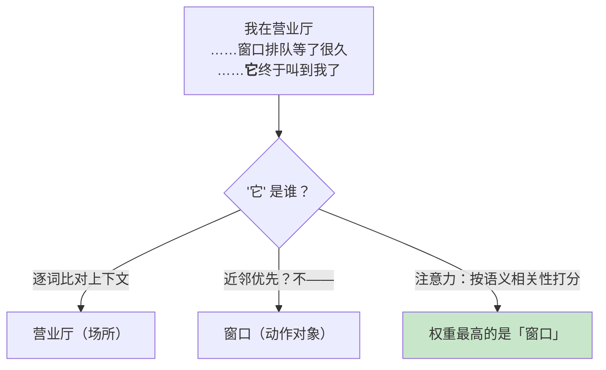
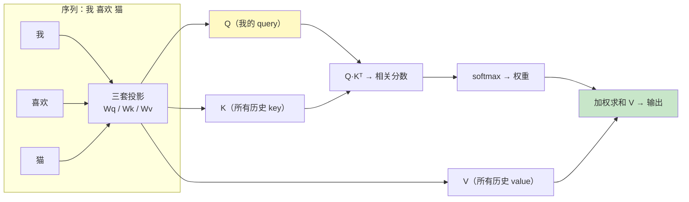
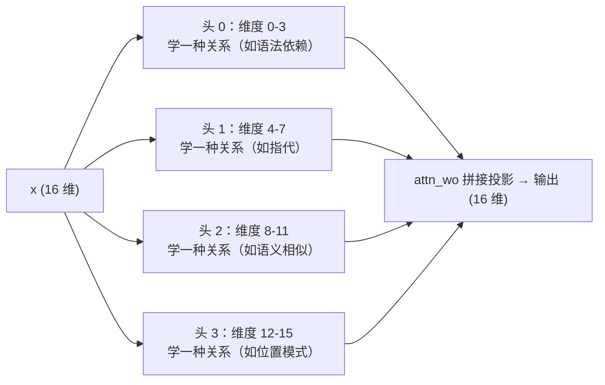

# 02 注意力与位置编码

| 元信息 | 内容 |
|------|------|
| 所属模块 | 05-大语言模型原理（核心层） |
| 篇目 | 05-2 注意力与位置编码 |
| 预计时间 | 60-75 分钟（含源码逐段读） |
| 前置 | 05-1（Next-Token 与采样） |
| 面试可答一句话摘要 | 一句话讲清「QKV = 查询 / 索引 / 内容三套投影；注意力 = 按相关性把历史加权汇总；因果掩码让 GPT 只能看左边；位置编码告诉模型 token 在第几个位置」 |

> 本篇是模块 05 的机理核心：搞懂「模型内部到底怎么算出下一个 token 的概率」。我们不推导矩阵运算，而是**逐段读 microgpt 源码里的单头注意力**——靶子已经替你选好（200 行全链路，有官方 TS 移植版，可在 TS 主场读）。深度边界（大纲 §9）：能读懂源码里单头注意力的 QKV 计算流程即可，不抠 Flash Attention 等工程优化写法。

## 学习目标

- 用「查资料」类比讲清 Q、K、V 各自在干什么
- 说出缩放点积的公式直觉和「为什么除以 $\sqrt{d_k}$」
- 读懂 microgpt 里单头注意力的完整 QKV 计算流程（TS 版为主、Python 对照）
- 讲清因果掩码为什么是 GPT 的「单向」设计，以及 microgpt 是怎么实现因果性的
- 一句话解释现代位置编码 RoPE 在做什么

---

## 1. 注意力要解决什么问题

回顾 02-3 的结论：RNN 把历史压进一个状态变量「一站站传」，长距离信息容易丢；而语言里**任意两个位置的词都可能有关系**——「它」指代的是 30 个字前面的「苹果」，不是紧邻的词。

注意力（attention）给出一套动态权重：**每个位置主动决定「我要多看重哪些历史位置」**。



同样的句子，如果「它」指「营业厅」，注意力权重会完全不同——**同一个模型、同一套参数，输入不变，权重随语义上下文动态变化**，这就是「动态加权」四个字的含义。

---

## 2. QKV：一次「检索」的三步

一句话结论：**注意力 = 拿 Query 去 Key 索引里查，按匹配度取 Value 加权汇总。**

| 角色 | 一句话 | 类比（查资料） |
|------|--------|--------------|
| Q（Query） | “我在找什么” | 你的检索词 |
| K（Key） | “我有什么标签” | 文档的标题 / 索引 |
| V（Value） | “我实际给出的内容” | 文档正文 |

模型把每个 token 的向量分别乘三套学习到的矩阵 $W_Q$、$W_K$、$W_V$，得到三个新向量：

- **Q**：当前 token「想从历史里找什么」
- **K**：历史每个 token「声明自己是什么」
- **V**：历史每个 token「真正能提供的素材」

然后 `Q` 和每个历史的 `K` 做点积 → 得到相关分数 → softmax → 用分数加权 `V` 求和。因为是**同一个序列同时扮演三种角色**（每个 token 既是提问者也是被查阅者），所以叫 self-attention（自注意力）。



---

## 3. 缩放点积注意力：公式与直觉

完整公式（Attention Is All You Need，2017）：

$$\text{Attention}(Q, K, V) = \text{softmax}\left(\frac{QK^\top}{\sqrt{d_k}}\right) V$$

拆成四步直觉：

1. **$QK^\top$**：把「我的 Q」和「每个历史的 K」做点积。点积 = 「两个向量方向多一致」→ 匹配分数
2. **除以 $\sqrt{d_k}$**（$d_k$ = 每个头的维度）：维度越大，向量点积的绝对值越大，softmax 输入一大会「饱和」（最大项概率趋近 1、其他趋近 0，梯度近乎消失）。缩放把分数拉回可控范围
3. **softmax**：分数变权重，和为 1（05-1 的 softmax 在这里兑现）
4. **乘 V 求和**：按权重把历史 value 混合成新向量——**加权汇总**，这就是「把找来的资料读进来」

输出向量的语义 = 「当前 token 结合了它认为重要的历史信息」，带着这些信息去预测下一个 token（接 MLP 和下一层，本篇不展开残差和 MLP，那不是本次目标）。

---

## 4. 因果掩码：GPT 只能看左边

预测下一个 token 时，模型**绝不能偷看未来**——训练时如果偷看了，输出「下一个词」就没有任何学习价值了。

所以 GPT 这类单向语言模型给注意力加约束：**每个位置只能看到自己及左侧的位置**。两种实现方式：

| 实现 | 做法 | 用在哪 |
|------|------|--------|
| 显式掩码（masked_fill） | 注意力矩阵中把未来位置的分数填成 $-\infty$，softmax 后权重归零 | nanoGPT / PyTorch 大模型（矩阵化实现） |
| 结构性因果（incremental） | 每个位置只用「左侧位置算出的 K/V」参与计算 | microgpt（逐个位置循环推理） |

位置可见关系（上下文长度 3）：

| 位置 | 能看的 token |
|------|--------------|
| 第 1 个 | 1 |
| 第 2 个 | 1、2 |
| 第 3 个 | 1、2、3 |

> 对比一句话：BERT 一类双向模型是「两个方向都看」（适合做理解任务），GPT 单向（适合做生成任务）——05-4 会回到这个区别。

---

## 5. 读源码：microgpt 里的单头注意力

靶子说明：下面代码**逐字摘自 [microgpt.ts（社区作者 snoblenet 的 TS 移植版）](https://gist.github.com/snoblenet/7739055e32bffb81277b6a08d33a37ef)，与 karpathy 原版 microgpt.py 同构**，本机 `bun microgpt.ts` 可直接运行训练。我们只读 `gpt()` 函数里的注意力段。先铺两个前置变量（都来自源码开头）：

```typescript
// 配置（源码原样）：1 层、16 维、4 个头 → 每个头 4 维
const nLayer = 1, nEmbd = 16, nHead = 4, headDim = nEmbd / nHead  // headDim = 4
```

### 5.1 第一步：token 与位置向量相加（embedding 出场）

```typescript
// 源码位置：gpt() 函数最开头（token+pos embedding 段）
let x = stateDict['wte'][tokenId].map((t, i) =>
  t.add(stateDict['wpe'][posId][i]),
);
```

`wte` 是 token 查表（04-2 学过的 Embedding），`wpe` 是位置查表——每个位置一个向量，两者逐元素相加。回答 04 遗留的问题：**为什么位置靠「加」而不是「拼接」**？因为加完同样进 16 维空间，模型内部自己就能解出「哪个维度是词义、哪个维度被位置偏移」——参数从数据学，省维度。

### 5.2 第二步：投影出 Q、K、V，并存入 KV 缓存

```typescript
// 源码位置：gpt() 注意力块开头
const q = linear(x, stateDict[`layer${li}.attn_wq`]);  // q: Value[16]  ← x · Wq
const k = linear(x, stateDict[`layer${li}.attn_wk`]);  // k: Value[16]  ← x · Wk
const v = linear(x, stateDict[`layer${li}.attn_wv`]);  // v: Value[16]  ← x · Wv
kvKeys[li].push(k);   // 把本次的 K 存进 KV 缓存（For 后面的位置查）
kvVals[li].push(v);   // 把本次的 V 存进 KV 缓存
```

三行 `linear` = 第 2 节说的「三套投影」：每个 token 进来，分别乘三套学习矩阵，得到它自己的 Q、K、V。**Q 是「我这次想问什么」；K 是「我被未来的谁记住」，V 是「我被选中时给出什么」。**

注意两行 push：K、V 被存进缓存供后续位置使用——这就是 KV Cache 的最初形态（05-3 专门讲它为什么省算力；microgpt 的推理/训练循环里它已经在了）。

### 5.3 第三步：单头切分与缩放点积注意力（本教程核心）

```typescript
// 源码位置：gpt() 的注意力头循环 for (let h = 0; h < nHead; h++)
const hs = h * headDim;                                        // 头 h 的起始维度
const qH = q.slice(hs, hs + headDim);                          // 本头的 Q（4 维）
const kH = kvKeys[li].map(ki => ki.slice(hs, hs + headDim));   // 本头的所有历史 K
const vH = kvVals[li].map(vi => vi.slice(hs, hs + headDim));   // 本头的所有历史 V

const scale = headDim ** 0.5;                                  // √d_k = 2
// 逐历史位置算相关分数：Q·K / √d_k（shape: 1 × len(kH)）
const attnLogits = kH.map(khi => Value.dot(qH, khi).div(scale));
// 分数 → 权重：softmax（和为 1）
const attnWeights = softmax(attnLogits);
// 按权重混合历史 V：输出 = Σ_t w_t · v_t （shape: headDim，只与本头维度有关）
for (let j = 0; j < headDim; j++) {
  xAttn.push(Value.sum(attnWeights.map((w, t) => w.mul(vH[t][j]))));
}
```

逐行对照第 3 节的公式，三处要点：

1. **`q.slice(hs, hs + headDim)`**：16 维被切成 4 段（4 个头），每个头独立做一套注意力——多头 = 把空间切开并行学多种关系，最后一层 `attn_wo` 再拼回去（§7）
2. **`attnLogits` 那行**：就是 $QK^\top / \sqrt{d_k}$，只不过写成「Q 与每个历史 K 逐一点积」——这是单头注意力最本真的形态，**没有任何矩阵运算魔法**
3. **`attnWeights` → `xAttn`**：softmax 权重对 V 逐维加权混合——「把找来的资料按相关度读进来」

（对照原版 Python，同一段是：`attn_logits = [sum(q_h[j] * k_h[t][j] for j in range(head_dim)) / head_dim**0.5 for t in range(len(k_h))]`，逻辑逐行一致。）

### 5.4 因果性在 microgpt 里是怎么保证的

microgpt 里**没有显式的 mask 矩阵**。因果性藏在两个地方：

- 训练循环对 `pos_id` **逐个位置**处理（每个位置只见 `kvKeys` 里已 push 的左侧 K/V）
- 代码流程天然「左侧先算、进缓存、右侧后算」——后一个位置根本拿不到未来的 K/V，想偷看都偷看不了

这是和 nanoGPT（矩阵化 + `masked_fill`）最不同的设计哲学：**microgpt 用「数据结构上的顺序」实现因果，nanoGPT 用「矩阵遮罩」实现因果**。两种都是真因果，面试时能说出这个区别，说明你真读了代码。

---

## 6. 位置编码：告诉模型「在第几个位置」

### 6.1 为什么必须要有

注意力对顺序「天然失忆」：把输入序列打乱，QKV 的点积、权重、加权结果**完全不变**——它只关心「谁和谁相关」，不关心「谁在哪个位置」。而语言（和代码！）的顺序是命根子。所以必须显式把位置信息喂进去。

### 6.2 三代方案一句话

| 方案 | 做法 | 一句话评价 |
|------|------|-----------|
| 绝对位置查表（wpe） | 每个位置一个可学习向量，加进 embedding（microgpt / nanoGPT / GPT-2 用这个） | 简单，但超出训练长度「没见过」的位置没学到 |
| 正弦位置编码 | 用 sin/cos 固定函数生成位置向量（Transformer 原论文） | 无需训练，但仍是绝对位置 |
| **RoPE（旋转位置编码）** | 把「位置」旋进 Q、K 向量的夹角，让注意力自动只看**相对距离** | **现代基座（Llama / Qwen / GLM）标配**：长上下文外推能力好 |

RoPE 一句话版本：**它不把位置向量加进输入，而是把每个 Q、K 按位置「旋转」一个角度，使得 (Q@位置i) 和 (K@位置j) 的点积自动等于「相对距离 i−j 的函数」**——模型学到的注意力权重自然平移不变（「第 2 个词看第 1 个词」和「第 100 个词看第 99 个词」使用同一套规律），这就是为什么 RoPE 模型更容易把上下文从训练长度推到更长（外推）。

> 🚧 深度边界（大纲 §9）：RoPE 只要求能说这一句话 + 知道它是主流；不要求会推导旋转矩阵。

---

## 7. 多头注意力：一句话说明

代码里的 `n_head = 4` 意味着同一份 16 维输入被切成 4 段、并行跑 4 套独立的注意力，最后用 `attn_wo` 拼回 16 维：



一句话：**多头 = 同一个注意力公式跑多份、各学各的关系，最后拼起来**。microgpt 里循环 `n_head` 次就是在做这件事——本篇只要求看懂「一个头」，多头就是「复制粘贴」。（视觉化可玩 https://bbycroft.net/llm 的互动图。）

---

## 8. 练习：把单头注意力改出花样（约 40 分钟）

**要求**：在 microgpt（TS 版，`bun microgpt.ts` 直接跑）基础上做三个实验，各记录一行结论：

1. **改头数**：把 `nHead` 从 4 改到 8（`headDim` 自动变 2），观察训练 loss 曲线与推理名字质量是否变化；再改到 1（单头 = 16 维一个头），观察是否还能学会
2. **拆比例**：把 `headDim ** 0.5`（缩放）改成 `1.0`（不缩放）和 `headDim`（过度缩放）各训练一次，对比 loss 曲线
3. **读原文**：在 microgpt.py 原版里定位 `attn_logits` 一行，把 `keys` / `values` 的作用注释出来（像 5.3 那样）

**提示**：

- 实验 1 是「改配置即可」的最小实验——microgpt 里改 `nHead` 后 `headDim = n_embd // n_head` 自动联动；头数是超参，太多/太少都可能让训练变慢或效果变差，留意 loss 打印
- 实验 2 直接演示 §3 的「为什么缩放」：不缩放时 4 维点积数值略大，短序列里或许看不出差别；把 train 数据换成长名字（或增大 block_size）后，饱和效应会更明显——**先记住结论：除以 $\sqrt{d_k}$ 是让 dot product 的方差保持稳定**
- 实验 3 是「背书式复述」练习：自己把第 5.3 节的注释对着 Python 版重写一遍，能独立完成说明真读懂了 QKV 流程

**预期效果**：你能不查资料画出「单头注意力的数据流」——token+pos → Wq/Wk/Wv → Q/K/V → Q·K/√d → softmax → 加权 V →（多头拼接）→ 输出；能指出改哪个超参会动到哪个环节。这是 05 模块验收「10 分钟讲清一次推理」的第二步（第一步是 05-1 的采样链路）。

---

## 9. 对比板块：四种「建模位置关系」的方式

| 维度 | 注意力（本技术，self-attention） | 全连接层 | RNN | CNN |
|------|--------------------------------|---------|-----|-----|
| 关系建模 | 每个位置与全部历史动态加权 | 位置固定通道（静态权重） | 隐状态串行接力 | 局部窗口卷积 |
| 顺序感知 | 需要外加位置编码（wpe / RoPE） | 输入摊平即丢顺序 | 天然按序读 | 靠窗口顺序隐含 |
| 长距离依赖 | 一步直达（任意两位置直接点积） | 也能「看到」全部，但权重不随语义变 | 一站站传，长距离易丢 | 需要叠很多层 |
| 计算特性 | 并行度高；$O(n^2)$ 注意力矩阵 | 并行，$O(n \cdot d^2)$ | 严格串行 | 并行，局部感受野 |
| 定位 | 当前 LLM 的默认（核心） | 注意力之外的 MLP 块 | 已被替代（02-3 结论） | 图像 / 局部模式 |

> 记忆锚点：**注意力唯一不可替代的价值是「每一步的动态相关性」**——全连接只能学固定权重组合，注意力能按上下文临时决定看重谁。代价是 $O(n^2)$（05-3 讲明白这笔账）。就像做过检索：**动态相关 = 检索，静态权重 = 规则表。**

---

## 10. 面试问答

> **问：Q、K、V 分别是什么？为什么叫自注意力？**
>
> **答：** 模型把每个 token 分别乘三套学习矩阵得到三个向量：Q（Query，当前 token 想问历史什么）、K（Key，历史 token 声明自己是什么，供匹配）、V（Value，被选中后实际给出的内容）。过程类似检索：拿 Q 去 K 索引里算匹配度，按匹配度加权汇总 V。因为 Q/K/V 全部由同一个序列自己产生（既是提问者也是被查阅者），所以叫「自」注意力（self-attention）。
>
> **追问（陷阱）：Q 和 K 换一下会怎样？**
>
> **答：** 单独换顺序不影响点积数值（$Q \cdot K = K \cdot Q$），所以匹配分数不变；但整个矩阵转置会让「谁查询谁」的关系反掉，多头各头学的东西会乱掉——训练出来的模型就没法用了。所以 Q/K 的角色分工是由训练目标塑造的，不是数学上强制的。

> **问：为什么点积后要除以 $\sqrt{d_k}$？**
>
> **答：** 向量维度越大，随机向量的点积方差越大（绝对值越大），softmax 输入一大就饱和——最大项概率趋近 1，其余趋近 0，梯度近乎消失，训练推不动。除以 $\sqrt{d_k}$ 把点积方差拉回与维度无关的常数量级，softmax 输入保持温和，梯度好走。直觉：**维度越高，两个随机方向「看起来越像相关」，不缩一下，点积噪声会淹没真实信号。**

> **问：GPT 为什么是单向的？和 Bert 有什么区别？**
>
> **答：** GPT 的注意力只允许每个位置看到自己及左侧历史，否则「预测下一个 token」训练时偷看了未来，任务就失去意义。实现上 nanoGPT 用掩码矩阵把未来分数填成 $-\infty$，microgpt 用「只允许左侧 K/V 入缓存」的结构性方式。Bert 双向注意力适合「理解」类任务（掩码词填空），GPT 单向适合「生成」类任务——生成天然只能由左向右。

> **问：位置编码为什么必要？RoPE 具体做了什么？**
>
> **答：** 注意力本身对序列顺序不敏感（乱序输入结果不变），所以要把位置信息显式加进去。RoPE 的做法是：计算注意力前把每个位置的 Q、K 向量做旋转，使「位置 i 的 Q」与「位置 j 的 K」之间点积自动只依赖相对距离 i−j——注意力权重因此对位置平移不变，外推到更长上下文容易。一句话：绝对位置时代结束，相对距离时代是 Llama / Qwen 们的默认。

---

## 参考链接

- [microgpt（karpathy，纯 Python 零依赖 200 行全链路）](https://gist.github.com/karpathy/8627fe009c40f57531cb18360106ce95) —— 本篇逐段读的靶子（`keys/values` 缓存 + 单头注意力）
- [microgpt 官方 TS 移植版（snoblenet，bun 单文件、零依赖）](https://gist.github.com/snoblenet/7739055e32bffb81277b6a08d33a37ef) —— 本篇首选阅读版本
- [nanoGPT（karpathy，~300 行 GPT 复现）](https://github.com/karpathy/nanoGPT) —— 对照读 `CausalSelfAttention`（masked_fill 的矩阵化因果写法）
- [Attention Is All You Need（Transformer 原始论文）](https://arxiv.org/abs/1706.03762) —— QKV、缩放点积、位置编码的出处
- [LLM 可视化互动图（bbycroft）](https://bbycroft.net/llm) —— 单头/多头注意力动画演示

---

**下一篇**：[03 上下文窗口与 KV Cache](03-上下文窗口与KV-Cache.md) —— 注意力逐位置重算 K/V 太浪费：KV Cache 为什么能省掉重复计算，以及上下文为什么不能无限大。