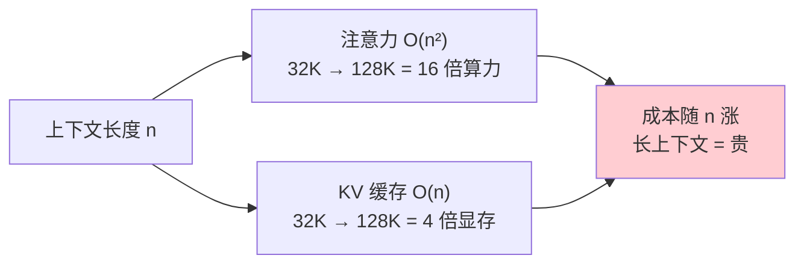
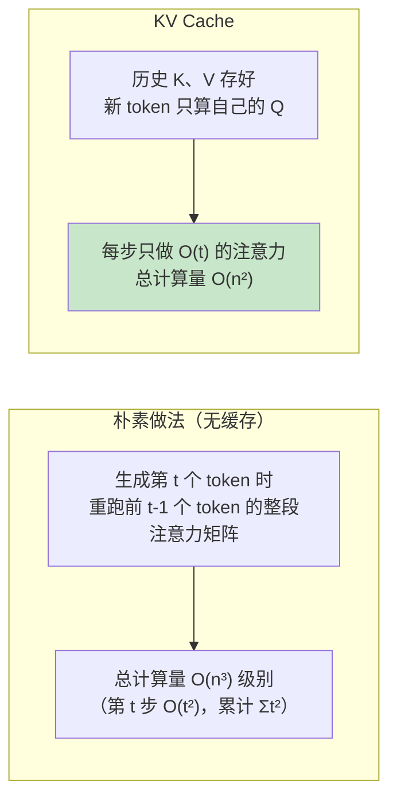
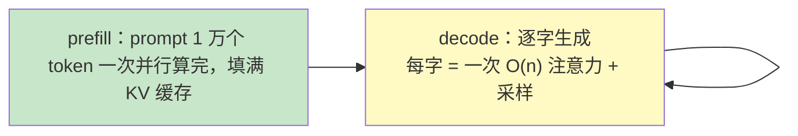
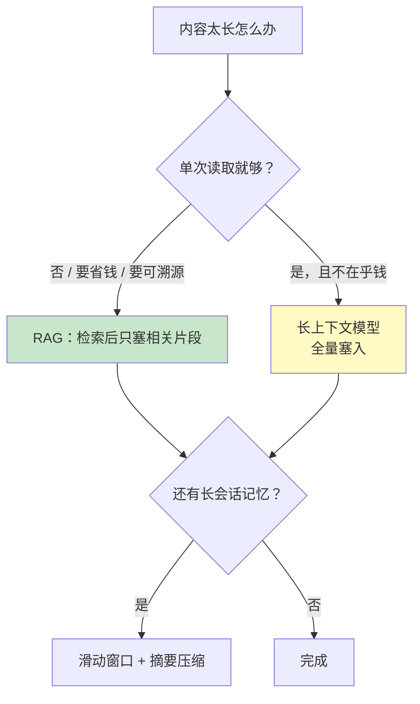

# 03 上下文窗口与 KV Cache

| 元信息 | 内容 |
|------|------|
| 所属模块 | 05-大语言模型原理（核心层） |
| 篇目 | 05-3 上下文窗口与 KV Cache |
| 预计时间 | 50-60 分钟 |
| 前置 | 05-2（注意力与位置编码） |
| 面试可答一句话摘要 | 一句话讲清「上下文不能无限大：注意力矩阵 O(n²) + KV 缓存显存 O(n)；KV Cache = 缓存历史 K/V，让每个新 token 只重算自己的注意力」 |

> 本篇把 05-2 的知识推进到工程侧：上下文窗口为什么有上限、一次请求的钱和显存到底花在哪、业务上长文本怎么选。全程两张图两种算账：注意力矩阵是 O(n²) 的，KV Cache 是把生成从 O(n³) 降回 O(n²) 的那块糖。前置 05-2；下一篇 05-4 讲架构与选型。

## 学习目标

- 从显存、算力、训练三个角度解释「上下文为什么不能无限大」
- 讲清 KV Cache 为什么能省掉重复计算、复杂度从多少降到多少
- 能手算一次长上下文请求的 KV 显存（套公式 + 查表）
- 拿到业务长文本场景能给出策略选型结论（截断 / RAG / 长上下文模型 / 稀疏注意力）

---

## 1. 上下文窗口：训练时定死的「最长输入」

上下文窗口（context window / block_size）= 模型一次能看进眼里的最大 token 数。它在**训练时就被定死**：

- microgpt 源码里 `block_size = 16`（最长名字 15 字符 + BOS）
- nanoGPT 的 toy 配置通常 `block_size = 8~256`
- 生产模型商用的 4K / 32K / 128K / 1M 是更大号的同一件事

三个直接推论：

1. **训练长度之外的「更远距离」依赖，模型根本没有机会学**——上下文窗口也画定了模型能力边界（§2 第三本账）
2. **推理时 prompt 超窗怎么办**：要么截断（丢开头/丢中间），要么报错，要么交给上层方案（§5）
3. 上下文窗口可以比训练时小（推理更省），但**不能比训练时大出太多**——位置编码外推是另一门学问（05-2 §6.2 的 RoPE 就是为此而生）

---

## 2. 为什么上下文不能无限大：三本账

### 2.1 算力账：注意力矩阵是 O(n²)

05-2 的公式里，每个头要算「每个位置对每个位置」的匹配分数（$QK^\top$）：上下文 $n$ 个 token 时，单层单头的分数矩阵是 $n \times n$，模型有 $L$ 层 × $H$ 个头。总计算量：

$$O(L \cdot H \cdot n^2 \cdot d)$$

**n 翻倍，注意力成本翻 4 倍。** 128K 上下文不是 32K 的 4 倍贵，而是 16 倍贵（平方）——这是所有「长上下文成本」讨论的根。

### 2.2 显存账：KV 缓存线性涨 + 分数矩阵平方涨

推理时有两块显存开销随上下文长大：

| 开销 | 量级 | 含义 |
|------|------|------|
| 权重 | 常数 | 固定 ~模型参数量 |
| KV 缓存 | O(n) | 每个历史 token 存一份 K、V（§3 讲） |
| 注意力分数/激活 | O(n²) | 每步推理的中间矩阵，存不下就流式省（Flash Attention 那类工程优化，大纲 §9 边界：不深挖） |

### 2.3 训练账：长上下文的训练成本指数级贵

训练一个「吃 128K 上下文」的模型，需要喂它 128K 长度的样本并跑反向传播——显存峰值比推理更高（要存反向需要的中间量），语料里天然长文占比低、采样成本高。所以**大厂也不是随心所欲加窗**，128K 是大量工程权衡的结果。



> 一句话总结：**上下文窗口的上限 = 显存 × 算力 × 训练代价三本账的综合结果，注意力 O(n²) 是其中最硬的墙。**

---

## 3. KV Cache：为什么能省掉重复计算

### 3.1 先看问题：自回归生成里的重复劳动

回顾 05-1 的生成链路：每生成一个新 token，模型都要重新跑一遍「看全部上下文 → 预测下一个」。**如果不做任何缓存，第 k 个 token 生成时要对前 k−1 个历史 token 重新算一次它们的 K、V**——而这些 K、V 只取决于历史 token 本身，跟新 token 一点关系没有（05-2 §5.2：K、V 由左侧 token 投影而来，与右侧无关）。

### 3.2 解法：算一次、存起来

**KV Cache = 把每个历史 token 的 K、V 向量存进缓存，之后每个新 token 复用**。microgpt 源码里那两行 push（05-2 §5.2 见过）：

```typescript
kvKeys[li].push(k);   // 新 token 的 K 入缓存
kvVals[li].push(v);   // 新 token 的 V 入缓存
```

就是 KV Cache 的最原始形态。推理时每个新 token 只需：**用自己的 Q 与缓存里所有 K 算分数 → softmax → 加权缓存里所有 V**。旧的 K、V 一次算过,终身复用。



复杂度对照（生成全部 n 个 token）：

| 方案 | 每步注意力 | 总成本 |
|------|-----------|--------|
| 无缓存（朴素重算） | 每步重跑整段注意力矩阵 → O(t²) | O(n³) |
| **KV Cache** | 只算新位置 → 每步 O(t) | **O(n²)** |

> 直观版本：没有缓存 = 每写一个新字都把前面所有字重新「读一遍、做笔记」；有缓存 = 笔记随手记，新字只查旧笔记 + 记一笔新的。

### 3.3 prefill 与 decode：一次请求的两个阶段

- **prefill（预填充）**：处理 prompt 里的全部 token，把它们算 K、V 进缓存，一次性并行算完注意力 → 很快
- **decode（逐字生成）**：每次只处理 1 个新 token（这步是串行的），反复「查缓存 → 采样 → 追加」



这就是「**同样的内容，做长 prompt 比做长输出便宜**」的根源（§4 再算账）。

---

## 4. 推理成本拆解：显存与带宽

### 4.1 KV 显存公式

$$KV\_mem \approx 2\ (\text{K与V}) \times L\ (\text{层}) \times d_{model}\times n_{tokens} \times bytes$$

代入一个 7B 规模例子的常见配置（仅示意，具体模型各不同）：

- $L = 32$ 层，$d_{model} = 4096$，权重精度 bf16（每数 2 字节）
- 每 token：$2 \times 32 \times 4096 \times 2\text{B} = 0.5$MB

| 上下文长度 | KV 显存（约） | 一句话感受 |
|-----------|--------------|-----------|
| 4K | ~2 GB | 单卡无压力 |
| 32K | ~16 GB | 开始挤出正常推理 |
| 128K | ~64 GB | 单卡 A100(80G) 都被吃掉一大半 |
| 1M | ~500 GB | 必须多卡 + 量化 + 特殊工程 |

（对照：7B 权重本身约 14 GB——**上下文一长，KV 显存会反超权重**，这是 2024 年后长上下文才流行的资金门槛。）

### 4.2 decode 是「带宽瓶颈」

decode 每生成一个 token 都要把全部权重从显存读到计算单元一次（权重太大搬不完，只能每次重读）。所以生成速度 ≈ 显存带宽 ÷ 参数量，**与上下文长短关系不大，与模型大小强相关**——7B 比 70B 快约 10 倍。而 prefill/长 prompt 的算力主要由注意力 O(n²) 主导。两个阶段分开算账，是评估服务成本的第一步。

---

## 5. 长文本策略与取舍

业务上要「喂给模型很长的内容」，方案有五档，先看决策表：

| 方案 | 做法 | 优点 | 代价 / 风险 | 适用 |
|------|------|------|------------|------|
| 窗口截断 | 只留头尾（或相关性最高的片段） | 零成本、无延迟 | 丢中间事实 → 答错 | 内容短/可丢、预算紧 |
| 滑动窗口 | 固定看最近 K 个 token | 成本恒定 | 太久远的信息丢失 | 流式对话 |
| 摘要压缩 | 历史先让模型概括成摘要再拼回去 | 收纳长历史 | 摘要即损失、层层失真 | 长会话记忆 |
| RAG 外置检索 | 库里查 top-k 段塞进 prompt（阶段 1 已会） | 事实可控、可溯源、成本极低 | 检索质量是天花板（06 模块） | **多数业务 RAG 的默认答案** |
| 长上下文模型 | 直接买 128K-1M 的模型塞全量 | 简单粗暴、不依赖检索 | 贵（§4 账）、长文反而「更傻」（注意力稀释/训练没见那么长） | 一次性长文分析、证据链必须完整 |

（另有训练侧优化——稀疏注意力：局部窗口 + 全局锚点 token，把 O(n²) 砍成近似线性。一句话带过，属模型本身的事，工程侧用得少。）



> 工程结论：**默认 RAG；一次性整篇证据用长上下文模型；会话记忆上滑动窗口 + 摘要。** 别一上来就买最贵的 Token 包——先把「必须全量吗？」问好（06 模块会讲检索质量怎么保障）。

---

## 6. 练习：亲手算一笔账（约 40 分钟）

**要求**：

1. 用 §4.1 公式，对配置 $L=48$ 层、$d_{model}=8192$、bf16 的「近似 70B 规模」模型，算出 4K / 32K / 128K 三档的 KV 显存，并对比它的权重显存（约 140 GB）
2. 打开 microgpt.ts，把 `block_size` 从 16 改成 64，重新训练并对比「单步耗时」与名字质量；思考为什么推理循环也变慢了（它没有用我们 §3 讲的增量技巧吗？提示：microgpt 训练时是逐位置重算的，代价正是 §3.2 的 O(n³) 朴素版——但它只有 4K 参数，随便算）
3. 到 API 后台看一眼你常用模型的上下文窗口与价格，把「长 prompt 1M token」的账单写出来（留档）

**提示**：

- 实验 1 是纯查表乘法；重点不是算出精确数字，而是建立直觉：**KV 显存 ≈ 权重显存的一半甚至相当，128K 直接吃垮单卡**
- 实验 2 改一个常量就能跑；如果你发现训练慢了很多，那正是从 O(n²·n)（训练逐位置）到 O(n²)（推理带缓存）的体感证据——再小声说一句，nanoGPT 矩阵化训练之所以快，就是因为它把「逐位置循环」换成了「一次矩阵前向」，这正是工程优化，不在本篇边界内
- 实验 3 注意「输入 token 单价 vs 输出 token 单价」往往是 3~4 倍差：长 prompt 的账在 prefill，长输出的账在 decode

**预期效果**：你能不看资料完成「上下文 $n$ → 注意力 O(n²)、KV O(nLd)、prefill/decode 两阶段」的完整推导；给一个业务场景（如 200 页合同分析）能直接拍板选型（RAG 分章检索 vs 128K 全量塞入）并报出成本量级。

---

## 7. 对比板块：长上下文五方案的成本结构对比

| 维度 | 窗口截断（基线） | 滑动窗口 | 摘要压缩 | RAG 检索 | 长上下文模型 |
|------|----------------|---------|---------|---------|------------|
| 成本随内容增长 | 恒定（截断） | 恒定 | 线性 | 线性（检索 + 少量 token） | 平方级（注意力 O(n²)）|
| 事实完整性 | 差（丢内容） | 差（丢远内容） | 中（压缩损失） | 好（按需取全） | 好（全量在眼） |
| 可溯源 | 无 | 无 | 无 | **有（引用原文）** | 无（模型自解释） |
| 延迟 | 最低 | 低 | 中 | 中（多一跳检索） | 最高（长 prefill） |
| 实现成本 | 一行代码 | 框架原生 | 一次 prompt | 阶段 1 已具备 | 买 API 即用 |
| 一句话定位 | 兜底 | 会话记忆 | 记忆衰竭补偿 | **信息的仓库在库外** | 一次性全量证据 |

> 记忆锚点：**五个方案的本质区别是「信息存哪、怎么进上下文」——只有 RAG 把信息存放在「上下文之外、按需取回」，其余四种都要求模型「一次看得下」。** 在 KV 显存和 O(n²) 的眼皮底下，RAG 是成本上最体面的那条路（06 模块给你评估它的完整工具）。

---

## 8. 面试问答

> **问：上下文窗口为什么不能无限大？**
>
> **答：** 三本账。算力上，注意力分数矩阵随着上下文长度 n 按 O(n²) 增长，n 翻倍成本翻 4 倍；显存上，KV 缓存按 O(n·L·d) 线性增长，128K 上下文仅 KV 就约 64GB（7B 规模），会反超权重显存；训练上，长上下文样本既贵又稀缺，模型根本没有在那么长的序列上被训练过，硬塞进未训练长度的内容，远距离依赖反而学不到。所以窗口上限是显存、算力、训练代价共同决定的，O(n²) 是那堵最硬的墙。
>
> **追问（陷阱）：KV Cache 是「显存换算力」吗？**
>
> **答：** 对，但更准确说是「显存换延迟」。没有 KV Cache，每生成一个新 token 都要把全部历史的 K、V 重算一遍，总成本是 O(n³)；有了 KV Cache，K、V 只算一次、按需复用，单步降为 O(n)、总成本 O(n²)。代价是缓存占显存——这就是「为什么解码速度主要看显存带宽与模型大小、而不是看上下文长度」。

> **问：prompt 太长一般怎么处理？**
>
> **答：** 看场景分层处理：能明确「只要一部分」的（事实问答）用 RAG 检索后只塞相关片段，省钱又可溯源；必须整篇看全的（合同分析、长文档一次性判断）直接上长上下文模型全量塞；会话变长的用滑动窗口 + 摘要压缩收纳历史。默认顺序：先问「真的需要全量吗」——大多数业务说不用。
>
> **追问：为什么长上下文模型塞全量反而有时更傻？**
>
> **答：** 注意力是软加权，内容超长时每个位置的权重被稀释，模型容易「看什么都像看过」；加上训练语料里真正超长的样本占比低，长窗能力并不等于长窗效果。这跟「给模型更多资料不等于它读得更细」是一回事——所以长上下文的正确用法是配检索，而不是无脑全量。

> **问：为什么「长 prompt 便宜、长输出贵」？**
>
> **答：** prefill 阶段处理 prompt 全部 token 可以并行一次算完（KV 缓存一次性填满）；decode 阶段每个新 token 严格串行：一次采样 → 一步注意力 → 追加，而**每个 token 都要把全部权重从显存读一遍（带宽瓶颈）**，所以输出 token 单价普遍是输入的 3~4 倍。这也解释了 API 定价表上「输入/输出」分档的原因。

---

## 参考链接

- [microgpt（karpathy）](https://gist.github.com/karpathy/8627fe009c40f57531cb18360106ce95) / [TS 移植版](https://gist.github.com/snoblenet/7739055e32bffb81277b6a08d33a37ef) —— `block_size`、`keys/values` 缓存就是本篇全部概念的源码源头
- [nanoGPT（karpathy）](https://github.com/karpathy/nanoGPT) —— 看 `config` 里 `block_size` 与训练脚本如何随窗口调成本
- [Attention Is All You Need](https://arxiv.org/abs/1706.03762) —— 注意力 O(n²) 复杂度的原始出处
- 长上下文实测：[Transformer vs SSM 效率反转（arXiv 2507.12442）](https://arxiv.org/html/2507.12442v3) —— 05-4 讲架构选型时会用到的实测数据

---

**下一篇**：[04 架构与选型](04-架构与选型.md) —— 注意力 O(n²) 太贵，Mamba 凭什么 O(n)；微调 / Prompt / RAG 怎么选；结构化输出约束与多模态一句话定位。