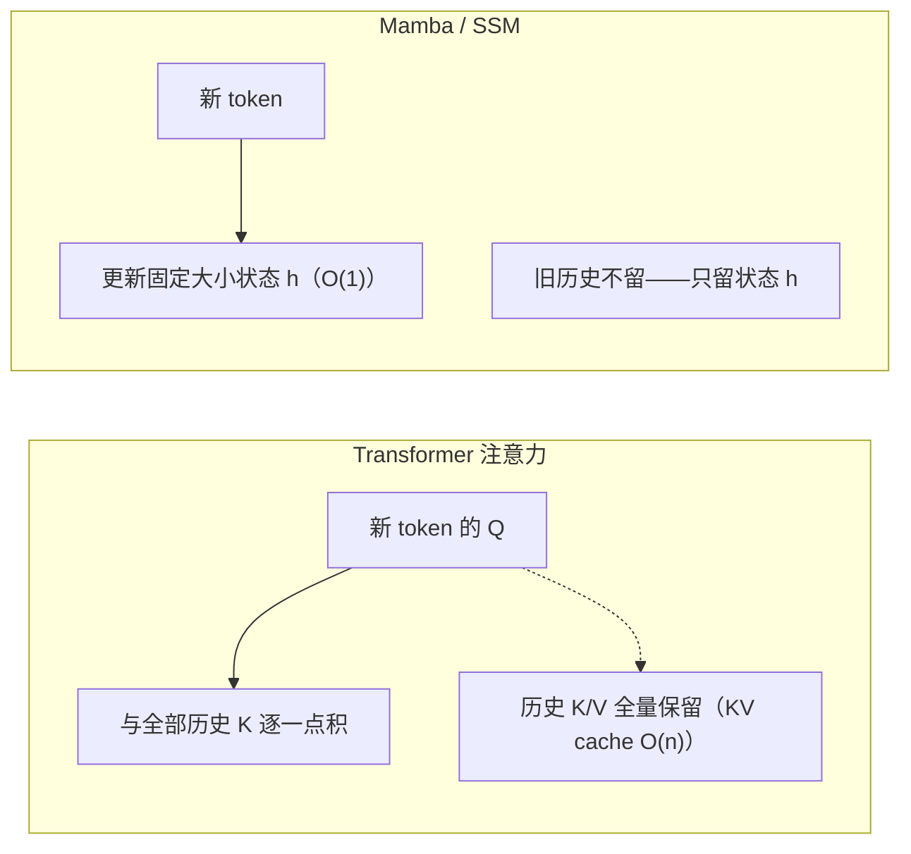
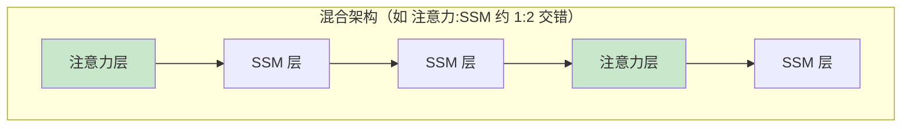
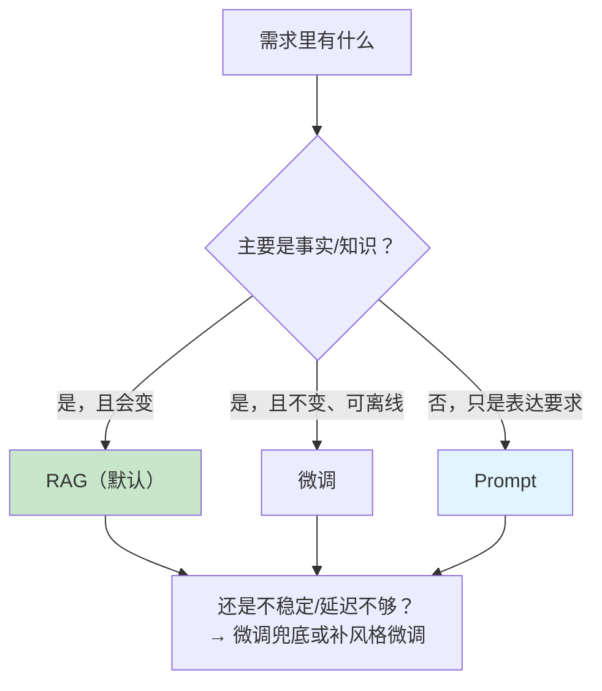
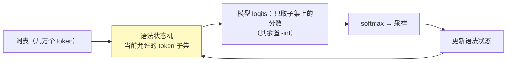
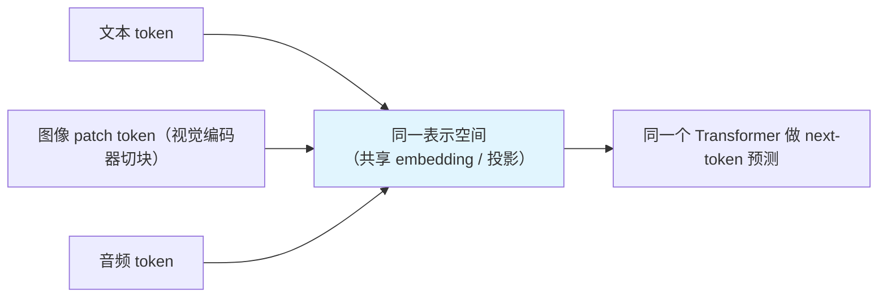

# 04 架构与选型

| 元信息 | 内容 |
|------|------|
| 所属模块 | 05-大语言模型原理（核心层） |
| 篇目 | 05-4 架构与选型 |
| 预计时间 | 60-75 分钟 |
| 前置 | 05-2、05-3（注意力与 KV Cache） |
| 面试可答一句话摘要 | 一句话讲清「注意力 O(n²) vs Mamba O(n)：长上下文谁赢（实测效率会在长文段反转）；微调 / Prompt / RAG 三道菜按『知识在哪、多久变、多贵』点单；结构化输出 = 约束采样空间；多模态 = 视觉音频 token 进同一表示空间」 |

> 本篇是模块 05 的收口篇，把前面三篇的结论收成长文工具：① 注意力 O(n²) 太贵 → Mamba（SSM）O(n) 凭什么、实测效率何时反转、混合架构为何成为主流；② 微调 / Prompt / RAG 怎么选；③ 结构化输出与工具调用为什么稳定；④ 多模态一句话定位。nanochat 仅作「生产全链路」了解。下一篇进入模块 06（应用层原理与选型）。

## 学习目标

- 用复杂度直觉对比 Transformer / Mamba / 混合架构，能复述「效率反转」的实测数据
- 给出微调 vs Prompt vs RAG 的选型决策表，对具体业务能一键选型
- 讲清结构化输出 = 约束采样空间的机理（和 05-1 演示闭环）
- 一句话定位多模态模型，知道 nanochat 在生产全链路里的位置

---

## 1. 复杂度回顾：注意力 O(n²) 到底贵在哪

05-3 的账本搬出来：上下文长度为 $n$ 时，单层注意力的分数矩阵是 $n \times n$；$n$ 翻倍成本翻 4 倍。KV 缓存还要随 $n$ 线性涨显存。**短上下文无感，128K+ 开始肉疼**——这就是 2024 年后「新架构」层出不穷的原始动机：大家不想再为注意力之城付过桥费。

---

## 2. Mamba（SSM）：线性时间序列模型的直觉

### 2.1 一句话直觉

**注意力 = 每一步都和所有历史直接「翻聊天记录」；SSM = 把历史压进一个固定大小的状态变量，逐 token 滚动更新，「记日记摘要」。**

| 维度 | Transformer | Mamba（SSM） |
|------|------------|-------------|
| 每层计算 | O(n²)（分数矩阵） | O(n)（线性扫描） |
| 历史存储 | KV 缓存 O(n)，随长度涨 | 固定状态 O(1)，不随长度涨 |
| 记忆精度 | 每条历史位置都可直达（精确） | 有损压缩（摘要式） |
| 并行训练 | 好（矩阵化） | 需要特殊 kernel（scan），工程未熟 |
| 长程精确检索 | 强（如「第 123 行的那个变量」） | 弱（细节被压缩） |

（大纲 §9 边界：**不推状态空间方程，不展开 Mamba 数学**——上面两张表就是面试能答的全部。）

### 2.2 效率反转：实测长上下文谁赢

2025 年的一项系统级实测（[arXiv 2507.12442](https://arxiv.org/html/2507.12442v4)，UC Irvine，消费级 GPU 上对比 Qwen2.5-0.5B vs Mamba2-780m）给出关键数据：

| 上下文长度 | 谁快 | 倍数 |
|-----------|------|------|
| <8K（短序列） | Transformer（Qwen2.5） | 快 1.8~1.9 倍（工程优化成熟） |
| ~57K | **SSM（Mamba2）反超** | 快至 4 倍（TTFT） |
| 220K（24GB 消费卡） | 只剩 SSM 能跑 | Transformer OOM |

为什么反转：短序列时 Transformer 吃「工程红利」（Flash Attention 等高度优化 kernel），SSM 的 scan 反而慢；但序列一长，注意力的 O(n²) + KV 显存把优势吃光，SSM 的线性复杂度 + 恒定状态开始统治。**结论：长上下文（尤其端侧/消费级硬件）= SSM 的主场。**

### 2.3 代价：长程精确记忆

SSM 的记忆是「把历史塞进固定状态」——定长状态装不下无限细节。直觉对比：

- 注意力：看档案原件（每条历史都留着，按需翻阅）——精确、贵
- SSM：看档案摘要（只留综述）——便宜、丢细节

需要「精确回溯长文细节」的任务（代码里跨行变量引用、长文档里某一段原文）SSM 明显吃亏；需要「把 200K 长尾都看完」的任务（流式、端侧、日志分析）SSM 占优。

---

## 3. 混合架构：两条路都要

既然注意力贵而准、SSM 便宜而粗，自然的解是**分层混搭**：大部分层用注意力（保住精确检索能力），一部分层换成 SSM（吃掉长文成本大头）。2025 年后主流大厂纷纷转向，代表如 HuggingFace/TII 的 Falcon-H1（本模块 §2.2 的论文即测了它）、NVIDIA 的 Hymba、IBM 的 Granite、MiniMax-01 等混合模型（多数有公开论文或技术报告，形态类似：**注意力层与 SSM 层按比例交错**）。注意：xAI 的 Grok 虽有混合架构传闻，但 xAI 从未公开架构论文，不能当作论据。

一句话选型：**2026 年看新模型，不用再执着「纯 Transformer」——混合架构在保留注意力的精确性同时换来了近似线性的长文成本，是长上下文时代的默认方向。** 对应用工程师的实操含义：API 背后是什么架构你不用关心，但「长文贵不贵、窗口多大」直接决定你的 RAG 设计（05-3 §5 那套决策仍然成立）。

---

## 4. 微调 vs Prompt vs RAG：三道菜怎么点

### 4.1 一个判断公式

$$选型 = \text{知识在哪} \times \text{多久变一次} \times \text{多贵}$$

### 4.2 决策表

| 维度 | Prompt（提示工程） | RAG（检索增强） | 微调（Fine-tune） |
|------|------------------|----------------|------------------|
| 知识在哪 | 模型肚子里（in-context 说清楚） | 上下文之外（检索进来） | 参数里（训练写进去） |
| 知识更新 | 改 prompt 即可 | 改库即可 | 要重训/重推 |
| 生效范围 | 单次请求 | 每次请求（按检索结果） | 全局永久 |
| 可控/可溯源 | 无 | **有（引用原文）** | 无 |
| 成本 | 最低（token 费） | 中（检索 + token） | 高（数据 + 算力 + 维护） |
| 副作用 | 无 | 检索质量绑定天花板 | 灾难性遗忘、和预训练能力打架 |
| 典型用途 | 快速验证、格式约定 | **私有知识、频繁事实、合规** | 风格/格式/领域术语强绑定、低延迟要求 |
| 深度边界（大纲 §9） | — | — | 只讲选型边界，**不学 LoRA/QLoRA 实现** |

### 4.3 结论与组合拳

- **默认组合 = Prompt + RAG**：事实靠检索喂，方式靠 prompt 约定——成本最低、可溯源、可回滚
- **微调是「把知识焊进肌肉记忆」**：只有当你需要「每次请求都稳定地产出一个特定风格/格式、且不能每次走检索」时才上（如固定法律文书排版、企业专用术语）
- **微调不解决事实更新**：新事实请交给 RAG，微调只会让「格式正确地说错」
- 可以先微调「说话方式」+ RAG「知识内容」双轨——很多生产系统就是这么叠的

---

## 5. 结构化输出约束机理：约束采样空间

05-1 演示已经给出最小实现（05-1 §5）。这里把机理说完整：**「只输出合法 JSON」和「工具调用参数合法」本质是同一件事——解码时把采样空间约束到合法域。**

三档约束从粗到细：

| 档位 | 做法 | 效果 | 代表 |
|------|------|------|------|
| 1. prompt 约定 | 让模型「返回 JSON」 | 高概率合法，不保证（05-1 的 0/200 教训） | 普通的 `response_format` |
| 2. logit 屏蔽 | 解码时把非法 token 的 logit 置 $-\infty$ | 逐 token 合法性 100%（对「语法单位」粒度） | JSON Schema / Function Calling 的工程实现 |
| 3. 语法级约束解码 | 用完整语法状态机（含嵌套、类型推断）驱动每步采样 | 整个输出必为合法结构 | outlines / Guidance 等框架 |

机理一句话：**模型在每一步依然在做「next-token 概率预测」（05-1 的采样链路没变），只是候选集合从「整个词表」被压缩成「当前语法状态允许的 token」**——错误路径在采样开始前就被封死了。

> 与幻觉的关系：结构化输出**消灭结构性错误**（括号、类型、字段），但**不消灭事实性错误**（字段值本身可能编）——05-1 结论不变：语法归状态机，内容归模型，事实靠 RAG。tool calling 的稳定性就是这么来的：不是模型会 JSON，而是解码器根本不给它写非法 JSON 的机会。

---

## 6. 多模态定位一句话

**多模态 = 把图像 / 音频 / 视频也切成一串 token，与文本 token 送进同一个向量空间，共用同一套 next-token 自回归机制。**

一句话定位：**它没有发明新机制——只是让模型「会读更多种类的 token」**，推理、采样、幻觉机制与文本完全一致（视觉模型同样会幻觉，同样要吃 RAG 兜底）。当前「模型能看图」= 视觉编码器 + 投影层 + 文本 LLM 联合训练，该边界照旧（大纲 §9：不学视觉/音频模型训练细节）。

---

## 7. 延伸：nanochat 的生产全链路长什么样

nanochat（karpathy，~8000 行全栈 ChatGPT）不是拿来逐行读的靶子（大纲 §6 定位：仅作生产全链路了解）。它与 microgpt 的关系一句话：

- **microgpt ≈ 算法核心**（200 行：分词 → 训练 → 推理）
- **nanochat ≈ 生产壳**（服务端、客户端、并发、流式输出、模型加载，8000 行把「模型」变成「产品」）

应用工程师从这里拿走的是**分层图**：`REST 接口 → 会话管理 → 推理引擎（就是 microgpt 那套）→ token 流式回传`——你在阶段 1 调的 OpenAI 兼容 API，内部就是这条链的工程放大版。知道这条链存在即可，不必现在读源码。

---

## 8. 练习：把选型做成肌肉记忆（约 40 分钟）

**要求**：给以下 5 个场景各给出选型结论和一句话理由，写下来（这是你的选型样本库起点）：

1. 公司内部 5000 份产品手册，员工随时问「某参数在哪台设备上用」——不能答错、要可溯源
2. 客服机器人要按公司模板输出工单 JSON（字段固定，格式错了工单系统就崩）
3. 让模型把长篇小说（100 万字）读一遍后写梗概，预算有限
4. 法务要求「每次报价单的条款措辞完全一致」且延迟 < 300ms
5. 本地离线设备（24GB 消费卡）上处理 200K 日志找异常模式

**提示**：

- 场景 1 是 RAG 教科书场景（私有知识 + 可溯源）；场景 2 是「结构化输出约束 + Prompt 模板」（05-1 §5 的机理直接适用）；场景 3 与「长上下文成本」（05-3 §4 的账）强相关——先问能否拆章 RAG 再考虑长上下文模型；场景 4 先问「措辞一致」是知识还是风格——是风格 → 微调；场景 5 典型「本地上长文 + 端侧」→ Mamba/混合架构或长窗量化模型，别上 128K Transformer 全家桶
- 判断顺序建议固定：**先问知识（可更新？可溯源？）→ 再问格式（结构化？风格？）→ 最后问预算（算力/延迟）**，三问下来答案自然浮现
- 每个结论试着用一句话对照 §4.1 公式「知识在哪 × 多久变 × 多贵」复核一遍

**预期效果**：5 个场景都能脱口给出「方案 + 理由」，且理由能落到「知识 / 格式 / 成本」三个词上——这是 05 模块为 06 模块预留的选型接口（06 会用它做完整的《RAG 选型与优化方案》）。

---

## 9. 对比板块：两大选型对比表

### 9.1 架构侧：Transformer vs Mamba vs 混合（长上下文场景）

| 维度 | Transformer（注意力） | Mamba（SSM） | 混合（注意力 + SSM） |
|------|---------------------|-------------|---------------------|
| 复杂度 | O(n²) 注意力 + O(n) KV | O(n) 计算 + O(1) 状态 | 近似线性（SSM 占大头） |
| 长上下文 | 贵、窗口受显存限制 | 便宜、可吃 220K+（24GB 卡实测） | 折中：长文便宜 + 精确检索不丢 |
| 短序列 | **最快**（工程红利 1.8~1.9×） | 相对慢（kernel 未熟） | 接近 Transformer |
| 长程精确记忆 | 强（全量 KV） | 弱（固定状态压缩） | 中（注意力层兜底） |
| 生态成熟度 | 最高 | 低（scan kernel、工具链） | 上升期（2026 主流新品多云上方案） |
| 应用工程师的感知 | API 贵、窗口小 | API 少（这层你通常碰不到源码） | API 窗口大 + 便宜长文 |

### 9.2 应用侧：微调 vs Prompt vs RAG

| 维度 | Prompt | RAG | 微调 |
|------|--------|-----|------|
| 知识来源 | In-context 说明 | 检索注入 | 参数固化 |
| 更新成本 | 改文案 | 改索引 | 重训重推 |
| 溯源性 | 无 | 强（引用原文） | 无 |
| 成本（量级） | token 费 | 检索 + token | 数据 + 算力 + 维护（贵一个量级） |
| 最佳位置 | 表达格式、风格约定 | **默认事实方案** | 强格式/风格/术语的肌肉记忆 |

> 记忆锚点：**架构对比看「知识存放在哪、多贵」，应用选型看「知识在哪、多久变、多贵」**——两件事共用同一个问题：知识的存放位置决定一切。

---

## 10. 面试问答

> **问：RAG / 微调 / Prompt 怎么选？**
>
> **答：** 先问三件事：知识在哪、多久变一次、多贵。事实型知识（公司手册、实时数据）默认 RAG——检索注入、可溯源、更新改索引即可；固定风格与格式（条款措辞、工单模板）用 Prompt 约定，不够稳定再上微调；微调适合「每次请求都要稳定输出特定风格/格式」且事实不变的场景，但成本高、可能遗忘预训练能力，且不解决事实更新。组合拳：Prompt + RAG 是默认地基，微调只做「说话方式」.
>
> **追问（陷阱）：微调能不能替代 RAG？**
>
> **答：** 不能。微调是把知识焊进参数：知识一变就要重训，且事实型知识一多就「灾难性遗忘」、还可能和其他能力打架；RAG 把事实放在检索库，变了就更新索引，永远能溯源。新事实找 RAG，风格格式找微调——方向反了只会得到一个「很会胡说八道」的模型。

> **问：Mamba 凭什么比 Transformer 快？有没有反例？**
>
> **答：** 凭复杂度：注意力对全部历史做两两比较是 O(n²)，KV 缓存随上下文线性涨；Mamba 把历史压进固定大小的状态逐 token 滚动更新，每层计算 O(n)、状态 O(1)，长上下文下显存和算力都大幅节省。反例实测存在（arXiv 2507.12442）：短序列（<8K）时优化成熟的 Transformer 反而快约 1.8~1.9 倍，到 ~57K 长文段 SSM 反超至 4 倍，24GB 消费卡上只有 SSM 能跑到 220K——所以结论是「长上下文的效率反转」，不是「Mamba 无条件更快」。
>
> **追问：那 Mamba 有没有短板？**
>
> **答：** 有。定长状态 = 有损压缩，长程精确回溯弱（比如跨行精确引用一段原文）、并行训练需要专门 scan kernel 工程未完全成熟、生态和基础设施不如 Transformer。所以现在主流是混合架构：注意力层保住精确检索，SSM 层吃掉长文成本。

> **问：为什么结构化输出 / 工具调用能保证 JSON 不坏？**
>
> **答：** 因为解码时用语法状态机约束采样空间：模型每步照常在词表上给出 next-token 概率，但解码器把「当前语法状态不允许」的 token 全部屏蔽（logit 置 $-\infty$），再从剩余候选里采样——错误路径在采样前就被封死，所以结构错误 100% 归零。要区分：它保语法不保事实——字段值是编的还是真的，取决于模型知识与 RAG 兜底，约束只负责「结构合法」这一件事。

> **问：多模态模型和文本模型有什么关系？**
>
> **答：** 一句话：视觉/音频被编码成 token 后，与文本 token 进入同一表示空间，走同一套 next-token 自回归。所以多模态没有发明新机制——采样、幻觉、KV cache、上下文窗口这些讨论全部照搬；区别只是输入的 token 种类多了，以及前置的视觉/音频编码器是额外训练的。这也意味着多模态模型同样会幻觉，同样需要 RAG 兜底。

---

## 参考链接

- [Mamba（状态空间模型，arXiv 2312.00752）](https://arxiv.org/abs/2312.00752) —— O(n) 复杂度与选择性机制的原始论文
- 长上下文实测：[Transformer vs SSM 效率反转（arXiv 2507.12442，UC Irvine，消费级 GPU 实测）](https://arxiv.org/html/2507.12442v3) —— §2.2 全部数据的出处
- [nanochat（karpathy，~8000 行全栈 ChatGPT，生产全链路参考）](https://github.com/karpathy/nanochat) —— §7 延伸了解
- [nanoGPT（karpathy）](https://github.com/karpathy/nanoGPT) / [microgpt（karpathy 200 行全链路）](https://gist.github.com/karpathy/8627fe009c40f57531cb18360106ce95) + [官方 TS 移植版](https://gist.github.com/snoblenet/7739055e32bffb81277b6a08d33a37ef) —— 模块 05 全部靶子共读
- [Attention Is All You Need](https://arxiv.org/abs/1706.03762) —— Transformer 原点；05 模块据此收口
- [transformers.js（浏览器 / Node 推理）](https://huggingface.co/docs/transformers.js) —— 本地跑小模型体验架构差异
- 模块 06 预告：[bge-m3（智源，混合向量）](https://huggingface.co/BAAI/bge-m3) 与 [MTEB 榜单](https://huggingface.co/spaces/mteb/leaderboard) —— 下模块嵌入选型的检索侧

---

**下一篇**：[06 应用层原理与选型](../06-应用层原理与选型/01-检索质量四件套.md) —— 把 05 模块的「长文该用 RAG、事实靠检索」落成完整工具：chunking / query 改写 / 混合检索 / rerank，并基于你阶段 1 的项目做出选型与优化方案。