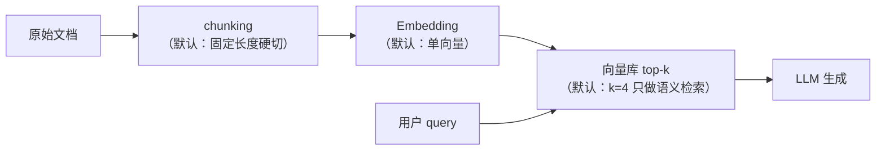
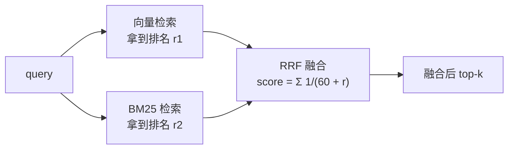
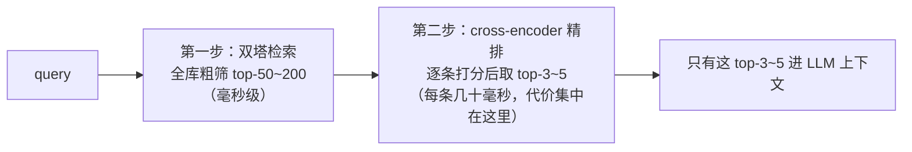
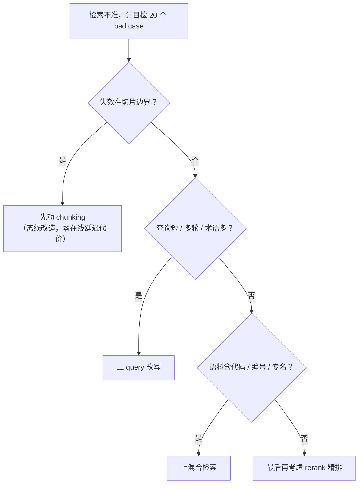

# 06-1 检索质量四件套

| 元信息 | 内容 |
|------|------|
| 所属模块 | 06-应用层原理与选型（应用/工程层） |
| 篇目 | 06-1 检索质量四件套 |
| 预计时间 | 45-60 分钟 |
| 前置 | 04-3（检索失败模式）、05-1（Next-Token 与采样） |
| 面试可答一句话摘要 | RAG 检索质量有四个独立旋钮，各有各的失效模式：chunking 治「语义被切碎/混噪」、query 改写治「查询与文档措辞不对称」、混合检索治「只认语义或只认词面」、rerank 治「初筛排序粗」——先定位失效模式再拧对应旋钮，不盲目叠料 |

> 模块 06 的收口目标：把前五个模块的「为什么有效」翻译成阶段 1 项目里能拧的旋钮。本篇是总开关——一条检索链路，四个可以独立调整的质量开关，每个开关都对治 04-3 里的一类失败模式。前置：04-3 已把「查询 → 检索」链路每一环的失败模式列了清单；05-1 让你理解 LLM 的采样与幻觉机制（rerank 和 query 改写都会调用 LLM，知其边界才不会被幻觉反噬）。

## 学习目标

- 能说出四件套（chunking / query 改写 / 混合检索 / rerank）各自对治 04-3 的哪类失效模式
- 每个旋钮都能给出「什么场景该拧、拧了付什么代价」
- 用 10 行代码完成一次「query 改写前后」的检索结果对比，并读懂差异
- 对照阶段 1 项目的检索配置，说出「我这套配置失效在哪里」

---

## 1. 全景：一条链路，四个开关

先回到 04-3 的核心结论：**RAG 检索不准，从来不是「一个环节」坏了，而是每一环都有自己的失败模式**。阶段 1 你大概率用的就是下面这条「默认链路」：



这条链路上你基本没拧过任何旋钮。结果就是：文档按固定字数硬切，语义单元被拦腰斩断；用户用碎片口语问，文档用书面语答，两边向量对不上；专有名词、代码、编号靠语义向量根本召不回；就算召回了，排序也是粗粒度 top-k，次优片段混进上下文带偏回答。

四大失效模式，各配一个开关：

| 失效模式（04-3） | 对应旋钮 | 治什么 |
|-----------------|---------|--------|
| chunk 粒度不当：语义截断 / 噪声混入 | **chunking** | 让「被检索的最小单元」尽量等于「一个完整语义单元」 |
| 查询与文档表达不对称：碎片提问、指代、术语不一致 | **query 改写** | 把用户的话改写成「文档的语言」，问法对齐 |
| 纯语义单腿走路：专有名词 / 代码 / 编号召不回 | **混合检索** | 语义匹配 + 词面匹配两条腿走路 |
| 初筛排序粗：top-k 放进上下文的片段不是最优 | **rerank** | 对候选再做一次精确排序，只把最相关的喂给 LLM |

> 💡 四件套不是必选项，是「对症下药」药箱：**先目检 bad case 判断是哪种失效，再决定拧哪个。** 本篇 §2-§5 逐个拆解，§6 给组合决策。

---

## 2. chunking：切块的粒度，决定「语义单元」长什么样

### 2.1 它解决什么问题

Embedding 模型对一段文本输出一个向量，这个向量是**整段语义的平均**。所以：

- **切太大** → 一段里混进多个话题，向量被平均成「四不像」，哪个话题都查不准
- **切太小** → 语义单元被拦腰斩断，一个完整论点散在三个块里，单块向量都不完整
- **切在错误边界** → 把「张三拒绝续费」切成「张三拒绝」+「续费」，语义直接反转

一句话：**chunking 决定了「检索命中一个块」是否约等于「命中一个可回答问题的片段」。** 这是整个检索质量的地基——后面三个旋钮都在这个地基上补救。

### 2.2 三种策略，按文档结构递进

| 策略 | 做法 | 适用 | 代价 |
|------|------|------|------|
| 固定长度 + overlap | 按字符/token 数硬切，相邻块重叠 10-20% | 无结构长文本（聊天记录、纯文本文档） | 最省事；边界仍可能切歪 |
| 结构切分 | 按标题 / 段落 / 代码函数 / 列表项切分 | Markdown、代码、PDF 章节等有结构文档 | 需要一个结构解析器（md 的标题层级、代码的 AST） |
| 小块检索 + 大上下文回填 | 小块（~200 token）负责检索，命中后把所属「父文档/父段落」整段喂给 LLM | 答案依赖前后文支撑（代码、法律文书） | 实现多一层，上下文变大、token 成本上升 |

阶段 1 常见的坑：**PDF 直接按字符硬切**——表格被切碎、图表标题与正文分离、列表项断成半句。至少做到「按空白行 / 标题先分段，再对超长段做固定长度切分」。

### 2.3 节奏与验证

- **参数直觉**：size 越小，检索越精确但上下文越碎；overlap 只防「恰好在语义边界截断」，不解决「块本身混了多个话题」
- **验证方式**：抽 20 个切块边界做目检——「每个块读起来是一个完整的小论点吗？」比任何参数公式都可靠
- **什么时候该动**：bad case 表现为「命中片段本身答不了问题，但该片段附近的文本能答」——这是切块问题，不是检索问题

---

## 3. query 改写：把用户的话，翻译成文档的语言

### 3.1 它解决什么问题

用户查询和文档语料的措辞**天然不对称**：

- 用户爱用碎片词：「上个月那单」vs 文档写「采购订单 #8842」
- 用户问法口语化：「怎么退款快」vs 文档写「退款时效」
- 多轮对话里有指代：「那它呢」——脱离历史根本没法检索
- 中英混搭、专有缩写：「jwt 过期处理」

向量检索已经能处理「同义但不共享词」的情况，但跨了术语、缩写、指代，语义向量也会失效。**query 改写 = 在检索前用一个轻量 LLM 把查询改写成「文档更可能匹配的形式」。**

### 3.2 三种改法

| 改法 | 做什么 | 典型 prompt 一句话 | 代价 |
|------|--------|-------------------|------|
| 扩展 | 补全指代、补全上下文、加同义表述 | 「把用户问题改写成 3 个更详细的检索式」 | 一次 LLM 调用 |
| 压缩/去噪 | 多轮对话 → 剥离历史冗余，提炼「当前要搜什么」 | 「把对话压缩成一个独立可检索的问题」 | 一次 LLM 调用 |
| 结构化/翻译 | 中→英、口语→书面、生成多个检索角度 | 「改写为适合向量检索的中文表述」 | 一次 LLM 调用 |

注意：**改写不是「越详细越好」**。改写成一大段描述性文字反而会稀释检索焦点；多查询改写（改写出 3-5 个检索式）再合并结果，比单句改写在召回上更稳，但会成倍放大下游检索与 rerank 成本。

### 3.3 什么时候该上

- 产品形态是**多轮对话**（必须有压缩/指代补全，否则第 3 轮起检索就废）
- 语料含**强术语/缩写/编号**，且用户查询短
- 查询是**问句**而非关键词（「这个功能的权限在哪里配置」→ 抽出「权限配置」）

反过来的判断：单轮关键词检索、查询与文档措辞高度一致时，改写的收益有限，还白付一次 LLM 延迟——**先跑最小案例验证差距，再决定常驻**（见 §3.4）。

### 3.4 最小案例：改写前后 10 行对比

大纲要求模块 06 有一个 10 行最小案例：**做一次「query 改写前后」的检索结果对比**。真实工程里 `rewrite`（LLM 调用）与 `search`（向量库）是两个强依赖缺口，此处用「词面重合打分」模拟语义检索，只演示**改写前后命中变化**这个核心事实——把两个 `// 伪代码接口` 换成真实的 LLM 与向量库即可，下面的对比逻辑（Node 直接跑通）不用改：

```typescript
// min-rewrite-demo.ts —— query 改写前后检索对比（教学 mock 版）
// 伪代码接口 ①：rewrite(q) = 调 LLM 改写（真实工程：轻量模型 + 「压缩为独立可检索问题」prompt）
// 伪代码接口 ②：search(q)  = 调向量库取 top-k（真实工程：Embedding + cosine）
const rewrite = (raw: string) =>
  raw === '退货钱什么时候能到' ? '退款到账时间' : raw // 仅演示：改写把碎片口语对齐成文档语言

const DOCS = [
  { id: 'd1', text: '退款到账时间：确认收货后 7 个工作日内' }, // 目标文档
  { id: 'd2', text: '取消订单后优惠券 24 小时内返还账户' },
  { id: 'd3', text: '提交工单后一个工作日内响应' }
]

function score(query: string, doc: string): number {
  // 词面子串命中计数，仅教学用途；真实工程这里是向量的 cosine 相似度
  return query.split(' ').filter((w) => w && doc.includes(w)).length
}
const search = (q: string, k = 2) =>
  DOCS.map((d) => ({ id: d.id, s: score(q, d.text) })).sort((a, b) => b.s - a.s).slice(0, k)

const raw = '退货钱什么时候能到' // 用户原话：与任何文档无语义/词面重合
const rw = rewrite(raw)          // 改写：与 d1 共享「退款到账时间」子串

const fmt = (r: { id: string; s: number }[]) => r.map((d) => `${d.id}:${d.s}`).join(' ')
console.log('改写前 top2:', search(raw).map((d) => d.id), '分数:', fmt(search(raw)), '(零命中 → 回退/答案劣化)')
console.log('改写后 top2:', search(rw).map((d) => d.id), '分数:', fmt(search(rw)), '(d1 直接命中)')
// 输出：改写前 top2: [ 'd1', 'd2' ] 分数: d1:0 d2:0 d3:0  → 三文档同分，零区分度
//       改写后 top2: [ 'd1', 'd2' ] 分数: d1:1 d2:0 d3:0  → 只有 d1 命中「退款到账时间」
```

输出结论一句话：**同一条用户话，不改写检索等于空查，改写后第一命即中——query 改写的价值就在这 10 行里。**

---

## 4. 混合检索：语义 + 词面两条腿走路

### 4.1 它解决什么问题

阶段 1 大概率只用稠密向量（Embedding + cosine）。稠密向量的优势是「同义不同词也能匹配」，但**对必须逐字命中的场景天然失明**：

- 代码检索（`async/await`、函数名拼写）
- 专有名词 / 编号 / SKU / 版本号（「v2.4」「BUG-1043」）
- 缩写与品牌名（「GCP」「ollama」）
- 用户精确复述文档原话关键词

这些靠语义向量召不回的，靠 BM25 这类**词面检索**反而一抓一个准。混合检索 = **稠密 + 稀疏（BM25）并行检索，再融合排序**。组合起来正好互补：向量管「懂意思」，BM25 管「记性准」。

### 4.2 融合怎么做

融合不是简单加权平均分数——两边的分数尺度完全不可比（cosine 是 [-1,1]，BM25 是无上界得分）。业界通行做法是 **RRF（Reciprocal Rank Fusion）**：不比较分数，比较**排名**，对每个文档按 `1/(k + rank)` 累加两边名次，k 常取 60：



给分逻辑一句话：**两边都排前面的文档分最高；只被一边命中的也有机会被捞回来。** 这不需要调权重、不依赖分数归一化，是工程上最稳的默认融合手段。

### 4.3 什么时候该上

语料或查询命中以下任一特征，就该上混合检索：**代码 / 编号 / 专有名词 / 中英混搭 / 用户会精确复述原文关键词**。代价是两套索引（向量索引 + 倒排索引）+ 查询延迟叠加——但都是可接受的工程成本，且可以在召回侧只做混合、生成侧照旧。

---

## 5. rerank：先粗筛，再精排

### 5.1 为什么还需要「第二次排序」

Embedding 的相似度是**双塔（bi-encoder）**：query 和文档各自过一遍模型变成向量，再算 cosine。维度被压缩成固定向量，query 与文档之间的**精细语义交互**（「这个片段有没有直接回答这个问题」）被丢掉了。所以双塔快（可提前把所有文档向量化建索引），但排序粗。

**rerank（精排）用交叉编码器（cross-encoder）**：把 query 和每条候选文档**拼在一起过一遍模型**，输出一个「多相关」的直接打分。它看到了完整的交互，排序精准，但必须逐条计算——所以只能对 top-50~200 的候选做，不能对全库做。



一句话：**粗筛负责「别漏」，精排负责「别乱」。** 上下文窗口有限（05-3），喂给 LLM 的片段必须是精排后的最优解，否则再强的生成模型也会被次优片段带偏（05-1 的幻觉机制会在「片段相关但不够直接」时放大）。

### 5.2 什么时候该上

- bad case 表现为「相关文档进来了，但**排位不对**」——top-k 里混着次优片段，最有用的被挤出上下文
- 语料量大、检索召回 top-200 的性价比高于「加大 k」时
- 精排模型成本可承受（rerank 模型参数量通常远小于生成 LLM，如 Qwen3-Reranker 0.6B/4B/8B）

代价：**一次额外的在线模型调用**（延迟 + 计费）。所以 rerank 是「质量雷达」上最靠后的开关——前面三件套拧完还差精度，才轮到它。

---

## 6. 组合决策：四件套怎么配

每个旋钮的代价不同维：

| 旋钮 | 代价维度 | 生效位置 |
|------|---------|---------|
| chunking | 离线一次性改造（重构切分逻辑 + 重新 embedding） | 地基，影响所有下游 |
| query 改写 | 在线每查询一次 LLM 调用（延迟 + token 成本） | 检索前 |
| 混合检索 | 多一套索引 + 查询延迟叠加 | 检索时 |
| rerank | 在线每查询一次精排模型调用（延迟 + 计费） | 检索后 |

按「先免费后付费」的次序拧：



组合路线（推荐）：
- **轻量**：优质 chunking + 混合检索 —— 大多数阶段 1 项目到这已经够用
- **标准**：轻量 + query 改写 —— 多轮对话、口语化查询的产品必上
- **重**：标准 + rerank —— 查询量大、对回答质量敏感、成本可接受

---

## 7. 练习：给阶段 1 的项目拧一个旋钮（约 40 分钟）

**要求**：从阶段 1 任一 RAG 项目里挑一个检索场景，**只拧一个旋钮**，做一次前后对比，产出「前 5 命中目检表」+ 三句结论：

1. 场景 A：改 chunk —— 把固定长度硬切改成「结构优先切分」（或调整 size/overlap），重新索引后跑同一批查询
2. 场景 B：上 query 改写 —— 对 5-10 条「碎片口语查询」做改写后再检索，对照命中变化

**提示**：

- 控制变量：一次只动一个旋钮，其余配置不动，否则无法归因
- 用 5-10 条「真实但难命中」的查询，别用理想的完整问句——碎片查询才是现状
- 目检标准：「前 5 命中里，有没有一条能直接支撑回答这个问题」，并记录它排在位置几
- 阶段 1 若项目已不可运行，把查询与文档抽出来，用一个最小脚本模拟对比（参照 §3.4 的最小案例）

**预期效果**：你能说出「我的项目主要卡在 04-3 的哪类失效模式上，所以选择拧哪个旋钮」——这句话是 06-2 审计的起点（坏例采样样本），也是评审时讲得清的选型理由。

---

## 8. 对比板块：四件套 vs 默认朴素链路

| 维度 | 默认朴素链路（阶段 1 基线） | 拧完四件套后的链路 |
|------|---------------------------|-------------------|
| chunking | 固定字数硬切，语义单元可被切断 | 结构/语义切分，切块 ≈ 可回答问题的最小片段 |
| 查询侧 | 用户原话直接检索，碎片查询命中率低 | 改写后检索，查询与文档措辞对齐 |
| 召回 | 仅稠密向量，术语/代码/编号失明 | 混合检索，语义 + 词面互补，RRF 融合 |
| 排序 | 双塔相似度粗排，top-k 直进上下文 | 粗筛 + 精排，只有最相关的片段进上下文 |
| 体验差异 | 答非所问、上下文被次优片段污染 | 命中片段本身就能支撑回答，生成质量随之变好 |
| 代价 | — | 离线改造一次 + 每查询多一次 LLM/精排调用（按需配置） |

> 对照 04-2 的三类向量（稠密 / 稀疏 / 混合）与 04-3 的失败模式清单：四件套不是新概念，是把已有的「为什么」翻译成「工程上拧哪里」。如果你能向评审讲清「我的坏例卡在切片边界，所以我先改了 chunking 而不是直接上 rerank」——这套「先归因再动手」的调试思维，在 06-2 会被正式化成分环节审计流程。

---

## 9. 面试问答

> **问：RAG 检索不准，应该先查哪个环节？**
>
> **答：** 先目检 bad case 归因，而不是上来就加技术。分四类对号入座：命中片段本身答不了问题但附近文本能答 → chunking 问题（语义被切碎）；查询碎片化/多轮指代导致检索对不上 → query 改写问题；专有名词、代码、编号召不回 → 缺混合检索；相关文档都召回了但排序不对、次优片段进上下文 → rerank 问题。归因清楚后再动对应旋钮，避免四个增强全上、哪个有效都不知道。
>
> **追问：为什么坏了桩事不能只看端到端准确率？**
>
> **答：** 端到端一个数字没法告诉你说错在检索还是生成——是「该查的没查出来」还是「查出来了但生成时没用好」。必须分环节给指标：检索侧看 recall@k / MRR，生成侧看 faithfulness / relevancy（详见 06-2），先定位环节再优化。

> **问：什么时候该上 rerank？**
>
> **答：** 两个前提：一是 bad case 表现为「相关内容已召回但排位不对」，即 recall 够、precision 不够；二是成本可接受，因为 rerank 是每查询一次的在线模型调用。顺序上它是最靠后的开关——先确认 chunking、query 改写、混合检索都到位，还有精度缺口，才轮到它。技术本质是 cross-encoder 逐条精排，只能对 top-50~200 做，不能替代第一步粗筛。
>
> **追问：rerank 和混合检索是一回事吗？**
>
> **答：** 不是。混合检索解决「召回」：用两套索引（语义 + 词面）把可能相关的都捞回来，管的是**别漏**；rerank 解决「排序」：对捞回来的候选做精确打分，管的是**别乱**。一个在检索前/检索时，一个在检索后。

> **问：query 改写会不会引入新问题？**
>
> **答：** 有三类风险：延迟与成本（每查询多一次 LLM 调用）；改写发散——LLM 可能把「怎么退款」改写成偏题的长句，反而稀释检索焦点；幻觉改写——把查询中不存在的假设编进去。缓解手段：改写用专门的轻量模型或小参数模型、限制输出为「独立的短查询」、改写前后结果对比验证收益（06-2 的审计也能覆盖这一环）。所以正确姿势是「先对比再常驻」，而不是默认全开。

---

## 参考链接

- [Qwen3-Embedding 官方博客](https://qwenlm.github.io/blog/qwen3-embedding/) —— 同一家还发布了 Qwen3-Reranker（0.6B/4B/8B），rerank 精排可选的现成开源模型；代码与权重见 [GitHub qwenlm/qwen3-embedding](https://github.com/qwenlm/qwen3-embedding)
- [BGE-M3（智源，混合向量，稠密 + 稀疏 + 多向量）](https://huggingface.co/BAAI/bge-m3) —— 「混合检索」的模型侧依据，04-2 已读模型卡
- [Gemini Embedding 官方发布（Google Developers Blog）](https://developers.googleblog.com/gemini-embedding-available-gemini-api/) —— query 改写/Embedding 之外的厂商基线
- [MTEB 榜单（Embedding 评测，官方为准、分数逐月更新）](https://huggingface.co/spaces/mteb/leaderboard) —— 选 Embedding 前的第一站

---

**下一篇**：[06-2 评估与审计](02-评估与审计.md)——四件套拧完，怎么证明它有效？进入 20-30 条真实查询的分环节审计流程。