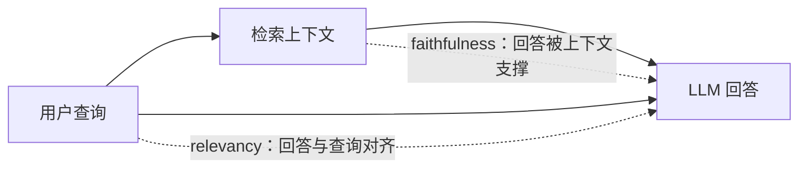
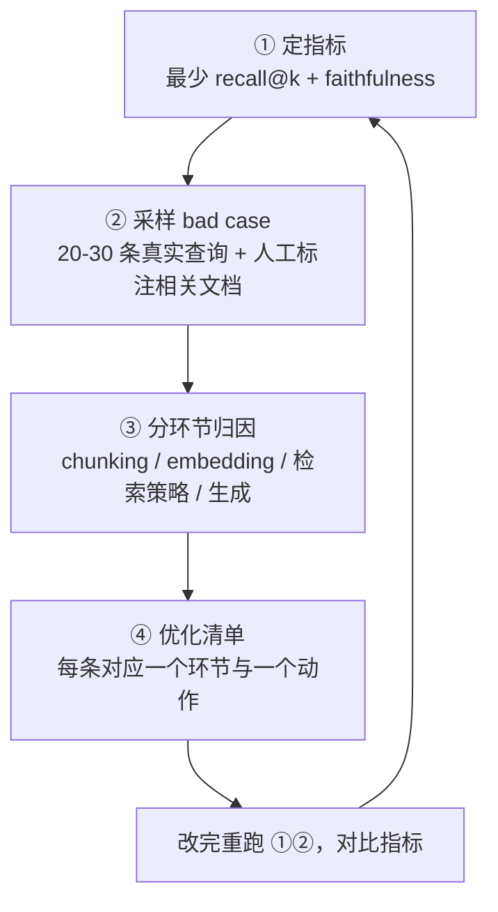

# 06-2 评估与审计

| 元信息 | 内容 |
|------|------|
| 所属模块 | 06-应用层原理与选型（应用/工程层） |
| 篇目 | 06-2 评估与审计 |
| 预计时间 | 45-60 分钟 |
| 前置 | 06-1（检索质量四件套） |
| 面试可答一句话摘要 | 评估 RAG 要分两侧、分环节：检索侧看 recall@k（别漏）/ MRR（第一个相关的排位）/ NDCG@10（整体排序质量），生成侧看 faithfulness（没胡说）/ relevancy（没跑题）；用 20-30 条真实查询跑「定指标 → 采样 bad case → 分环节归因 → 优化清单」闭环，先定位环节再优化，不盯端到端一个数 |

> 06-1 给了四个旋钮，本篇给「证明旋钮有没有拧对」的仪表盘。核心转变：从「端到端一个数」升级为「分侧、分环节的指标 + 可复现的审计流程」。所有指标全部锚定阶段 1 项目——你需要的不是懂定义的读者，而是能跑通审计闭环的工程师。前置：06-1 已把四件套的失效模式挂上了钩，本篇把「目检 bad case」变成「可算数、可对比」的流程。

## 学习目标

- 能手算 recall@k / MRR / NDCG@10，并说清三个指标各自在「看什么」
- 掌握 faithfulness / relevancy 的直觉：一个防「胡说」，一个防「跑题」
- 能跑通 20-30 条真实查询的四步审计流程：定指标 → 采样 bad case → 分环节归因 → 优化清单
- 完成阶段 1 项目的首次检索质量审计（无检索日志时用最小 RAG demo 兜底）

---

## 1. 为什么必须分环节评估

阶段 1 你判断 RAG 好坏的唯一方式是「试几条 query 看回答像不像样」。它的两个致命缺陷：

- **不可量化**：「像不像样」没法在改版前后做 AB 对比，也没法写进验收标准
- **不可归因**：回答错了，你分不清是「该查的没查出来」（检索侧）还是「查出来了但生成时没用好」（生成侧）——这两类问题的修法完全不同

所以评估的第一原则：**把 RAG 拆成两个半场分别计量**。


- **检索半场**：只问「该相关的文档，检索出来没有、排得对不对」——跟生成无关，用它判断 chunking / query 改写 / 混合检索 / rerank 四件套该不该动
- **生成半场**：给定检索结果，只问「回答有没有忠实于上下文、有没有答非所问」——用它判断提示词、上下文窗口利用、模型选择

先定位半场，再谈优化。下面 §2-§3 分别给两半场的指标（直觉 + 手算），§4 把它们串成审计流程。

---

## 2. 检索侧三指标：recall@k / MRR / NDCG@10

### 2.1 先给一个统一的算例

假设语料里有一条查询 q，人工标注的相关文档是 {d2, d5}（共 2 条）。某次检索返回的前 5 个文档是：

| 位置 | 1 | 2 | 3 | 4 | 5 |
|------|---|---|---|---|---|
| 返回文档 | d5 | d3 | d2 | d1 | d6 |
| 相关？ | ✅ | ❌ | ✅ | ❌ | ❌ |

三指标从三个角度看这次返回，**都基于「位置」算，但强调的东西完全不同**：

### 2.2 recall@k：前 k 个里召回了多少相关文档

$$recall@k = \frac{\text{前 } k \text{ 个里相关的个数}}{\text{全部相关文档总数}}$$

本例：k=5 时命中 d5、d2 两个，相关总数 = 2 → **recall@5 = 2/2 = 1.0**。k=1 时只有 d5 命中 → **recall@1 = 0.5**。

直觉：**recall 管「别漏」**——相关文档有没有被捞回来。它完全无视排序（d5 排第 1 还是第 5 都算命中），是判断「召回能力」（该上混合检索？该加大 k？）的指标。注意它需要知道「全部相关文档有多少」，这是审计时人工标注的活，也是最贵的部分。

### 2.3 MRR：第一个相关文档排得多靠前

$$MRR@k = \frac{1}{\text{第一个相关文档的排名}}$$

本例：第一个相关的 d5 排在位置 1 → **MRR = 1/1 = 1.0**。若把 d5 挪到位置 2（[d3, d5, d2, d1, d6]），其他不变：recall@5 仍 = 1.0，但 **MRR 掉到 1/2 = 0.5**。

直觉：**MRR 管「第一个命中的跟手程度」**——对「只要第一个答案」的产品（FAQ、客服首答、单轮问答）特别敏感。多查询取平均，就是对「典型时候能不能第一下就命中」的度量。它的盲区：最多只看第一个相关，后面还有几个、排多乱它一概不管。

### 2.4 NDCG@10：整体排序质量（对「位置越靠后衰减越重」敏感）

$$NDCG@k = \frac{\text{DCG}@k}{\text{IDCG}@k}, \quad DCG@k = \sum_{i=1}^{k} \frac{rel_i}{\log_2(i+1)}$$

其中 $rel_i$ 是位置 $i$ 的相关性（相关 = 1，不相关 = 0）；IDCG 是「把全部相关文档放到最前面」时的 DCG（理想值），NDCG = 实际/理想，值域 [0,1]。

本例（k=5）：位置 1、3 相关 → DCG@5 = 1/log₂2 + 1/log₂4 = 1 + 0.5 = 1.5；理想排序（2 个相关文档排最前）→ IDCG@5 = 1 + 1/log₂3 = 1.631 → **NDCG@5 ≈ 0.92**。

直觉：**NDCG 管「整体排序质量」**——既看召回（相关没相关），又看位置（排得靠不靠前），还对靠后位置打了对数衰减（排在位置 1 的相关价值远高于位置 5）。它是「上下文质量」最好的单一代理：**LLM 只会看到 top-k，top-k 里相关片段排得越靠前，上下文越干净**。也正是这个原因，rerank 该不该上、动了 chunking 有没有用，看 NDCG 变化最直接。

> 💡 三指标分工一句话：**recall@k 查「漏没漏」，MRR 查「第一下准不准」，NDCG@10 查「喂进上下文的整体干不干净」。** 一次审计不用全算——最少 recall@k + 1 个排序指标（MRR 或 NDCG），排序指标推荐 NDCG@10（与生成质量的关联最直接）。

### 2.5 指标代码：三个函数，直接可跑

```typescript
// metrics.ts —— 检索侧三指标（纯函数，零依赖，node metrics.ts 直接跑）
// 类型约定：hits 为按排名从高到低的检索结果；relevant=true 表示该文档与查询相关
type Hit = { docId: string; relevant: boolean }

function recallAtK(hits: Hit[], totalRelevant: number, k: number): number {
  if (totalRelevant === 0) return 0
  const hit = hits.slice(0, k).filter((h) => h.relevant).length
  return hit / totalRelevant
}

function mrr(hits: Hit[]): number {
  const rank = hits.findIndex((h) => h.relevant) // 第一个相关的下标（0 起）
  return rank === -1 ? 0 : 1 / (rank + 1)
}

function ndcgAtK(hits: Hit[], k: number): number {
  const top = hits.slice(0, k)
  let dcg = 0
  top.forEach((h, i) => {
    if (h.relevant) dcg += 1 / Math.log2(i + 2) // 位置 i(0 起) 的 rank = i+1，权重 1/log2(rank+1)
  })
  const relevantCount = top.filter((h) => h.relevant).length
  let idcg = 0
  for (let i = 0; i < relevantCount; i++) idcg += 1 / Math.log2(i + 2) // 理想：相关全排最前
  return idcg === 0 ? 0 : dcg / idcg
}

// —— 演示：q1 的相关文档为 {d2, d5}，返回顺序见正文 §2.1 ——
const q1: Hit[] = [
  { docId: 'd5', relevant: true },
  { docId: 'd3', relevant: false },
  { docId: 'd2', relevant: true },
  { docId: 'd1', relevant: false },
  { docId: 'd6', relevant: false }
]
console.log('recall@5 =', recallAtK(q1, 2, 5)) // 1
console.log('MRR     =', mrr(q1))              // 1
console.log('NDCG@5  =', ndcgAtK(q1, 5).toFixed(3)) // 0.920
```

---

## 3. 生成侧两指标：faithfulness / relevancy

检索侧算的是「命中」，生成侧必须算「用没用好命中结果」。两个指标对治 05-1 的两类幻觉：**faithfulness 治「胡说」，relevancy 治「跑题」**。

### 3.1 faithfulness（忠实度）：回答有没有被检索上下文支撑

- **直觉**：把回答拆成若干「事实性声明」（claim），逐条问「这条声明能不能在检索到的片段里找到支撑」。能找到的比例就是 faithfulness。
- **手算**：回答含 3 个关键声明（版本号、时限、操作路径），检索上下文能支撑 2 条 → **faithfulness = 2/3 ≈ 0.67**。声明里混进了上下文没有的数字、日期、因果 → 掉分。
- **工程判定**：用 LLM-as-judge（让一个评估 LLM 按「裁定 prompt」逐条比对）或规则（数字/专名对齐）。LLM-as-judge 是当前主流，因为它能识别改写后的「事实等价」，规则只能抓字面。

### 3.2 relevancy（相关性）：回答有没有回答「问的问题」

- **直觉**：回答整体是否切题。用户问「退款多久到账」，回答谈「退款方式有几种」——相关文档可能找对了，但回答跑题，relevancy 低。
- **手算**：某次审计 5 条查询，人工判定 4 条的回答切题 → **relevancy = 4/5 = 0.8**。
- **工程判定**：LLM-as-judge 对「回答 vs 查询」打分（0-5 后设阈值转二值），或人工小样本抽样。

### 3.3 faithfulness 与 relevancy 的边界（面试高频）

| | faithfulness | relevancy |
|---|---|---|
| 对比的对象 | 回答 vs 检索到的上下文 | 回答 vs 用户查询 |
| 防的是什么 | 无中生有（编造上下文没有的事实） | 答非所问（内容真实但不对题） |
| 典型掉分 | 回答里出现上下文没有的版本号/日期/结论 | 问 A 答 B、答了一大段相关但不解决提问 |



> ⚠️ 注意两指标是「给定检索结果」下的生成侧诊断：faithfulness 低，先怪 LLM/提示词；但若连检索结果本身就跑题，relevancy 会同时差——这时该回头查检索半场。这正是 §4 分环节归因的依据。

---

## 4. 审计流程：20-30 条真实查询跑一个闭环

四件套可以在没有指标前凭手感调，但**只有指标能证明「调了之后真的变好」**。完整闭环四步：



### 第 1 步：定指标

- **至少两项**（模块要求）：检索侧 recall@k（k 取 5 或你产品实际使用的 top-k）+ 生成侧 faithfulness
- 建议补一项排序指标（NDCG@10）评估上下文干净度；想量化「第一下命中」就加 MRR
- 把指标与具体环节挂上：想验证 chunking / 混合检索 → recall@k；想验证 rerank → NDCG@10；想验证提示词 / 模型 → faithfulness

### 第 2 步：采样 bad case

- **20-30 条真实查询**：从线上日志抽（必须覆盖「难命中」的，别只挑好答的），或让同事/用户按真实用法提
- 每一条标注 **gold 相关文档**（最多 5 个），跑现有系统，记录返回结果与最终回答
- 产出：一张审计表——每条查询的「检索命中情况 + 回答内容」；凡是回答不达标的，都是 bad case 候选
- 这里就是 06-1 §7 练习里目检表的正式化版本

### 第 3 步：分环节归因

bad case 逐个过四个环节的问诊表：

| 环节 | 问诊问题 | 判定信号 |
|------|---------|---------|
| chunking | 命中片段本身能不能回答问题？ | 片段残缺/混噪/切在语义边界 → 归因 chunking |
| embedding | 语义相近但词面不同的命中了，术语/缩写没中？ | 专名、编号、代码召不回 → 归因 embedding/混合检索缺失 |
| 检索策略 | 相关文档进了 top-N 吗？排列对吗？ | recall 达标但 NDCG 差 → 归因排序（rerank） |
| 生成 | 检索结果挺好，回答还是错？ | faithfulness/relevancy 低但检索指标好 → 归因生成 |

### 第 4 步：优化清单

每条 bad case 收敛成一行「动作」，格式固定：

> **现象** → **归因环节** → **动作** → **预期指标变化**（引用 04/05 原理一句话解释）

示例两条：

1. 查询「GCP 计费导出到 BigQuery 的步骤」→ 命中片段是「计费导出」章节被硬切成两截 → 该块改结构切分 → 预期 recall@5 提升（04-3：语义单元被切碎是首个失败模式）
2. 查询带「jwt 过期怎么处理」→ 相关文档没进前 5 → 上混合检索（BM25 命中「jwt」）→ 预期 recall@5 提升（06-1：词面匹配补语义盲区）

改完后用同一批 20-30 条查询重跑第 1-2 步，指标对比即验收——**不允许「凭感觉觉得变好了」收尾**。

---

## 5. 落地三件套：日志、标注、最小 demo

### 5.1 检索日志（审计的原料，必须先有）

审计的前提是能回放每一次查询的完整链路。每条查询的日志最小结构：

```json
{
  "query": "jwt 过期怎么处理",
  "rewritten": "jwt token 过期处理方式",           // 若开了 query 改写
  "hits": ["d3", "d7", "d1", "d9", "d5"],          // 检索 top-k 顺序（含源类型）
  "scores": [0.89, 0.81, 0.72, 0.65, 0.58],
  "context_ids": ["d3", "d7", "d1"],                // 实际喂给 LLM 的 top-3
  "answer": "……",
  "ts": "2026-08-27T10:00:00+08:00"
}
```

阶段 1 项目若没埋这些点，先补日志再审计——**没有日志，评估无从谈起**。

### 5.2 gold 标注与评估执行

- **gold 标注**：20-30 条查询 × 每条标 ≤5 个相关文档，人工 1-2 小时可完成；这是审计中唯一不可自动化的工作
- **指标计算**：recall@k / MRR / NDCG 直接套 §2.5 的函数；faithfulness / relevancy 用 LLM-as-judge：

```jsonc
// 伪代码：LLM-as-judge 判定 faithfulness（依赖大模型 API，此处仅示意调用形状）
// 输入结构: { query, context: [...], answer }  输出: { verdict: boolean, reason: string }
async function judgeFaithfulness(item) {
  const claims = await extractClaims(item.answer)      // 先拆声明：伪代码接口
  const supported = await Promise.all(claims.map((c) =>
    judgeClaim(item.context, c)                        // 逐条判定「能否被上下文支撑」
  ))
  return supported.filter(Boolean).length / claims.length
}
```

### 5.3 兜底：没有检索日志 / 没有完整链路怎么办

这是阶段 1 项目的常见现实：项目已不可运行、或只是 demo 壳没有检索日志。**兜底方案：用带日志的最小 RAG demo 替代审计对象**——目标不是复刻项目，而是让「分环节审计能力」有地方练：

```typescript
// 伪代码：最小 RAG demo 骨架（真实工程用向量库与 Embedding API 填充两个缺口）
// const docs: Doc[]              —— 20-50 条真实业务文档（从项目语料抽）
// const myIndex = indexDocs(docs) —— 伪代码接口：chunk + embedding + 建索引
type Doc = { id: string; text: string }

function logQuery(query: string, hits: string[], answer: string) {
  // 把 §5.1 的日志结构追加到 audit.log，供评估脚本回放
}

const engine = {
  async answer(query: string) {
    const hits = await myIndex.search(query, 5)        // 伪代码接口：向量检索
    const context = hits.map((id: string) => docs.find((d) => d.id === id))
    const answer = await llmAnswer(context, query)     // 伪代码接口：LLM 生成
    logQuery(query, hits, answer)
    return answer
  }
}
// 用 §4 的 20-30 条查询跑 engine.answer，日志即审计原料
```

这个 demo 的「审计价值」与项目等价——四步流程、指标计算、归因方法全部通用，唯一区别是规模小。

---

## 6. 练习：完成阶段 1 项目的首次检索质量审计（约 1-2 小时）

**要求**：对阶段 1 任一项目做一次完整四步审计，产出带数据的优化清单：

1. 定指标：至少 recall@k + faithfulness 两项（排序列再加 NDCG@10）
2. 采样：20-30 条真实查询，标注 gold 相关文档，跑现有系统收集 bad case
3. 归因：按「chunking / embedding / 检索策略 / 生成」四环节问诊表给坏例贴标签
4. 输出：优化清单（每条含现象 → 归因 → 动作 → 预期指标变化），引用 04/05 的知识解释每条原因

**提示**：

- **兜底**：项目无检索日志或链路不完整时，用 §5.3 的最小 RAG demo 替代审计对象——语料从原项目抽 20-50 条文档，流程与指标完全一致
- gold 标注别追求完美：每条标 2-3 个「明显相关」的文档即可，审计目的是相对对比不是绝对精确
- 指标前后对比要在**同一批查询**上进行——换查询等于换考题，数字不可比
- 如果 20-30 条不够覆盖「难命中」场景，优先补「你知道它容易失败」的查询（术语、代码、多轮指代），这批才是审计价值所在

**预期效果**：一份「每条能对应到具体环节、每条有预期指标变化」的优化清单——它既是 06-3 选型评估的输入（选型要基于审计结论），也是评审会上「我是基于数据不是凭感觉优化」的证据。项目里建议把这份清单沉淀成 `RAG-审计报告.md` 存档。

---

## 7. 对比板块：三个检索指标的视角差异 vs 生成侧两指标

| 维度 | recall@k | MRR | NDCG@10 | faithfulness | relevancy |
|------|---------|-----|---------|--------------|-----------|
| 半场 | 检索 | 检索 | 检索 | 生成 | 生成 |
| 核心问题 | 漏了吗？ | 第一下准吗？ | 喂给 LLM 的干净吗？ | 胡说吗？ | 跑题吗？ |
| 是否看排序 | ❌ 只看命中个数 | ✅ 只看第一个 | ✅ 全排序、靠前权重高 | — | — |
| 需要的标注 | 全部相关文档数 | 相关文档（知道哪个就行） | 相关文档 + 位置价值 | 声明 + 上下文比对 | 回答 + 查询比对 |
| 最敏感的优化动作 | 混合检索 / 加大 k / chunking | 排序前置（改写精准化） | rerank / chunking | 提示词 / 换模型 / 上下文裁剪 | 查询意图理解 / 上下文选择 |

> 结论：**指标不是越多越好，是「你要验证哪个旋钮，就选能反映它的指标」。** 验证召回类改动看 recall@k；验证排序类改动看 NDCG@10；验证生成类改动看 faithfulness。把五个指标当「仪表盘」而非「考试分数」——它们是诊断工具，不是对项目的打分。

---

## 8. 面试问答

> **问：怎么评估一个 RAG 系统的好坏？**
>
> **答：** 分两侧、分环节。检索侧看 recall@k（相关文档有没有被召回，管「漏」）、MRR（第一个相关的排位，管「第一下准不准」）、NDCG@10（整体排序质量，管「喂给 LLM 的上下文干不干净」）；生成侧看 faithfulness（回答是否被检索上下文支撑，管「不胡说」）和 relevancy（回答是否切题，管「不跑题」）。做法是先定最少指标（recall@k + faithfulness），拿 20-30 条真实查询跑审计闭环：采样 bad case → 分环节归因 → 出优化清单——先定位环节再优化，避免只盯端到端一个数。
>
> **追问：NDCG 和 recall 的区别到底在哪？**
>
> **答：** recall@k 只数「前 k 个里相关文档有几个」，完全不看顺序——d5 排第 1 和排第 5 对它一样；NDCG 同时惩罚「没召回」和「排得靠后」，位置越靠后权重衰减越厉害（1/log₂(rank+1)），所以它更贴近「LLM 实际看到的上下文质量」。这就是为什么验证 rerank 看 NDCG 最直接，验证混合检索看 recall 最直接。

> **问：faithfulness 和 relevancy 有什么区别？**
>
> **答：** 对比的对象不同。faithfulness 是「回答 vs 检索到的上下文」——回答里的每个声明能不能被上下文支撑，防的是幻觉编造；relevancy 是「回答 vs 用户查询」——有没有答对题，防的是跑题。一个真实例子：问「退款多久到账」、回答「退款方式有三种」，内容真实、上下文支撑得住（faithfulness 高），但没回答到点子上（relevancy 低）。两者都差时还要回头查检索——上下文本身跑题，生成侧两个指标一起崩。

> **问：LLM-as-judge 评估可信吗？**
>
> **答：** 可信度取决于三个条件：裁判模型要够强（通常用比产品更强的模型或另一个厂商的模型，避免「自我偏好」）；判定 prompt 要给明确标准（faithfulness 按「声明能否被上下文支撑」逐条裁定）；要有抽样的真人对齐验证（拿 10-20 条让裁判与人工各评一次，一致率低就调标准）。它替代不了人工标注 gold——但审计流程的定位是「相对对比」，同一条的标准一致，指标变化就有意义。

---

## 参考链接

- [MTEB 榜单（Embedding 评测，官方为准、分数逐月更新）](https://huggingface.co/spaces/mteb/leaderboard) —— recall@k / NDCG@10 等检索指标在该榜各任务的实现口径可对照
- [Qwen3-Embedding 官方博客](https://qwenlm.github.io/blog/qwen3-embedding/) —— 发布时登顶 MTEB 多语言榜（2025-06，分数 70.58），榜单口径参考
- [Gemini Embedding 官方发布（Google Developers Blog）](https://developers.googleblog.com/gemini-embedding-available-gemini-api/) —— 厂商对评估/延迟的口径参考
- [Cohere Embed v4 变更日志](https://docs.cohere.com/changelog/embed-multimodal-v4) —— 多模态 Embedding 评估场景延伸
- [BGE-M3（智源，混合向量）](https://huggingface.co/BAAI/bge-m3) —— 04-2 已读模型卡，检索指标在其模型卡有基准数字

---

**下一篇**：[06-3 模型与 Embedding 选型](03-模型与Embedding选型.md)——审计清单给出了方向：换 Embedding、上精排还是调策略？进入 2026 主流 Embedding 的最终选型。