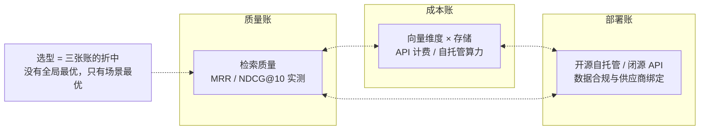
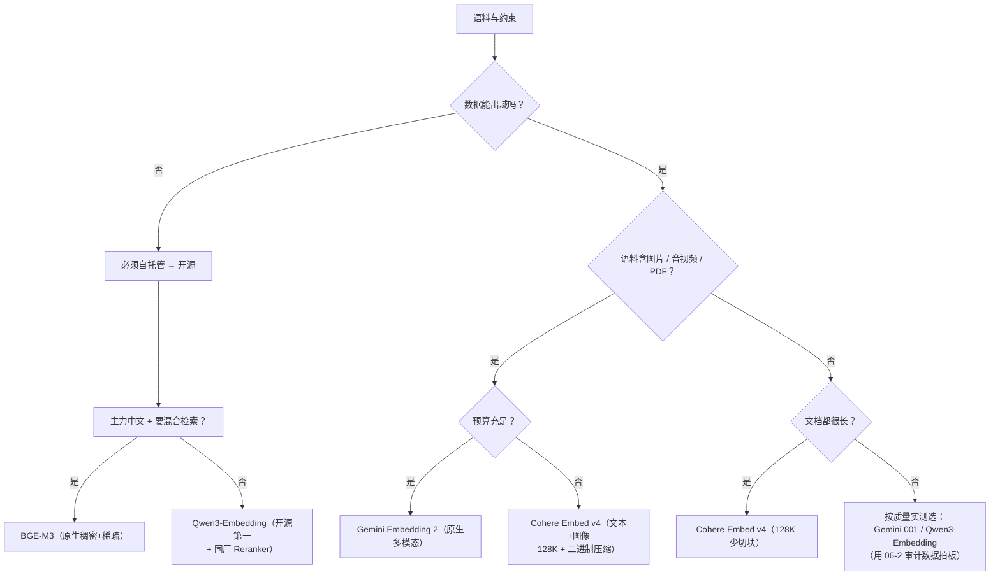

# 06-3 模型与 Embedding 选型

| 元信息 | 内容 |
|------|------|
| 所属模块 | 06-应用层原理与选型（应用/工程层） |
| 篇目 | 06-3 模型与 Embedding 选型 |
| 预计时间 | 60 分钟 |
| 前置 | 06-1（检索质量四件套）、06-2（评估与审计） |
| 面试可答一句话摘要 | Embedding 选型看三张账——质量账（MTEB 榜单位置 + 自家语料实测）、成本账（维度与 MRL、API 计费 vs 自托管）、部署账（开源自托管 / 闭源 API / 数据合规）；2026 主流是 Gemini Embedding（多模态 + MRL 领先）、Qwen3-Embedding（开源第一、代码检索强）、BGE-M3（中文 + 混合向量）、Cohere Embed v4（多模态 + 128K 上下文）；量化与蒸馏是「换存储/算力换延迟」的概念级手段，不改变选型主逻辑 |

> 模块 06 的收官篇：06-1 给了旋钮，06-2 给了仪表盘，本篇把「旋钮 + 仪表盘」打包成一次完整的技术选型——从 Embedding 模型开始，向下引到量化/蒸馏，向上落到推理成本，最终产出《我的 RAG 选型与优化方案》。选型不是选「榜一」，而是选「与你的场景、成本、合规约束最匹配的」；本篇所有数字锚定 **2026-08** 时点，榜单逐月更新（见对比板块的时间戳约定）。

## 学习目标

- 能说出 2026 主流四家 Embedding（Gemini / Qwen3 / BGE-M3 / Cohere v4）的定位一条线与适用场景
- 掌握选型决策的三张账：质量账 / 成本账 / 部署账，能在评审会上讲清每条取舍理由
- 讲清量化与蒸馏的「概念与适用场景」（不涉及算法实现，见大纲 §9 边界）
- 完成《我的 RAG 选型与优化方案》并达到「可对评审会讲」的程度

---

## 1. 选型框架：三张账一起算

选 Embedding 之前，先明确「选型是在比什么」。任何模型选择都是在一张三角里取折中点：



- **质量账**：MTEB 榜单（官方为准）给「通用能力」一个排序起点；但**真正的质量账必须用自家语料实测**——06-2 审计流程里的 20-30 条查询 + recall@k/NDCG@10，就是为这一刻准备的。榜单第一 ≠ 你的语料第一（中文/代码/术语的专业域差异很大）。
- **成本账**：维度决定向量存储与检索成本（维度翻倍，存储翻倍、检索变慢）；API 按 token 计费 vs 自托管买 GPU。Embedding 是「一次生产、多次查询」——生产成本随语料规模线性涨，查询成本与维度强相关。
- **部署账**：开源可自托管（数据不出域、无 API 计费、可量化压缩）但算力/运维自担；闭源 API 开箱即用但按量付费、依赖供应商（数据合规场景直接出局）。

三张账对应三个前置问题：**「谁在用、有多少数据、数据能不能出域」——答案不同，选型结论就不同。** 带着这三张账读 §2 的四家。

---

## 2. 2026 主流四家：定位一条线

> 以下为 2026-08 时点的公开信息摘要；分数与排位以官方发布与 MTEB 榜单实时数据为准（见 §7 对比板块的时间戳）。

### 2.1 Gemini Embedding（Google，闭源 API）：多模态 + MRL 的先进课代表

**是什么**：Gemini API / Vertex AI 提供的 Embedding 服务。两条产品线：

- `gemini-embedding-001`：纯文本，默认 3072 维，MRL 可裁剪（1536/768 等），输入上限 2048 tokens，MTEB 英文/多语言榜长期领先梯队
- `gemini-embedding-2-preview`（2026-03 发布）：**首个原生多模态 Embedding**——文本/图片/视频/音频/PDF 映射到同一向量空间，输入上限 8192 tokens，MRL 支持 128-3072 维任意裁剪，官方推荐 768 维为性价比甜点

**强在哪**：多模态统一向量空间（一步替代「文本 Embedding + 图像 CLIP + 音视频转写」的多管线拼装）；MRL 自由度最高，官方明说「768 维 ≈ 接近顶配质量、1/4 存储」。
**用在哪**：语料含图片/PDF/音视频，或预算充足想要「一个模型全模态」的团队。
**注意**：闭源、按 token 计费、预览版有迁移风险；纯文本场景它的领先幅度并不大，溢价主要买多模态。

### 2.2 Qwen3-Embedding（阿里，开源）：发布即开源第一，代码检索强

**是什么**：2025-06 开源（Apache 2.0）的 Embedding + Reranker 模型族，0.6B / 4B / 8B 三档。8B 发布时登顶 MTEB 多语言榜（分数 70.58，2025-06-05）；32768 tokens 上下文；last-token pooling；支持指令感知（同一模型换指令做检索/分类/聚类）与 MRL（8B 全维度 4096，可裁至 32 维）；100+ 语言含多种编程语言的代码检索。

**强在哪**：**开源模型的天花板 + 同厂配套 Reranker（06-1 的 rerank 旋钮直接有开源选项）**；8B 本地部署在 A100 级单卡可跑，0.6B 对显存需求极低（可低成本常驻）。
**用在哪**：数据不能出域 / 长期成本敏感 / 代码检索场景 / 需要配套 rerank 的一站式开源方案。
**注意**：8B 自托管需要显存与运维；检索质量与「榜单数字」之间隔着实测——文档域、query 风格差异都要用 06-2 流程验证。

### 2.3 BGE-M3（智源，开源）：中文 + 混合向量的原生玩家

**是什么**：智源 BAAI 的开源多语模型，核心卖点是**一种表示内同时输出稠密（dense）+ 稀疏（lexical）+ 多向量（ColBERT）三种检索信号**——即 06-1 的「混合检索」在模型侧的原生支持（稠密管语义、稀疏管词面、多向量管精细匹配）。8192 tokens 上下文，中文/多语检索经多年社区验证稳定。

**强在哪**：中文场景（尤其专有名词/数字/缩写）稠密 + 稀疏一条龙，无需另配 BM25 再融合；开源、可按业务微调。
**用在哪**：中文学科/技术文档为主、混合检索是刚需、想省掉「两套索引 + RRF」工程量的团队。
**注意**：模型规模对顶尖质量略逊于 2025-2026 新秀（榜单中游偏上），极致质量场景通常作为对照基线而非终点；向量库需支持多表示（部分向量库对稀疏向量支持需要额外配置）。

### 2.4 Cohere Embed v4（Cohere，闭源 API）：多模态 + 超长上下文 + 向量压缩

**是什么**：`embed-v4.0`，多模态（文本 + 图像，可交错输入 PDF 页式内容），**128K 上下文**（该量级里顶尖），输出维度 256-1536 可配，支持 float/int8/uint8/binary/ubinary 向量压缩格式，100+ 语言，`input_type` 区分 search_document / search_query 提高检索对齐。

**强在哪**：128K 上下文让「长文档少切块甚至整档 embedding」成为可能（直接缓解 chunking 的截断问题）；binary/int8 小向量让存储与检索成本骤降（维度 × 字节数）——这是其他几家少有的出厂能力。
**用在哪**：长文档/合同/论文类语料、对向量存储成本敏感、或需要图像-文本混合检索的企业场景。
**注意**：闭源按量计费；128K 是「能嵌」不是「该嵌」——RAG 场景小块通常检索更准（官方也建议小块），长上下文的意义在于少切几刀。

---

## 3. 量化与蒸馏：概念与适用场景

> ⚠️ 本模块边界（大纲 §9）：只学**概念与适用场景**，不学量化算法的数学实现、不写训练流程。看懂「该不该量化、该不该蒸馏」即可。

### 3.1 量化：把模型/向量塞进更小的箱子

- **概念**：推理/存储时把参数或向量从高精度（float32）压成低精度（int8 / int4 / binary），用少量精度损失换显存、存储与算力的大幅下降。Embedding 输出的向量同样可量化——Cohere v4 的 binary 嵌入就是把每个 float 维度压成 1 bit（存储降到 1/32）。
- **适用场景**：向量库规模大（百万级向量 × 多维度的存储与检索延迟是真实账）；自托管模型放不进目标显存；对延迟敏感且质量损失可接受（量化后 recall 通常掉 1-3 个点，视任务而定）。
- **一句话判断**：**存储或延迟是瓶颈、且实测质量不塌 → 量化**；质量是瓶颈、存储不是 → 别量化。

### 3.2 蒸馏：大模型教小模型

- **概念**：用强模型（teacher）的输出/标签去训练弱模型（student），让小模型逼近大模型的行为——Embedding 领域典型如「用 8B 模型蒸馏出 0.5B 的边缘端模型」。
- **适用场景**：目标环境算力有限（端侧/低配服务器）且需要「常驻可用」；对延迟要求苛刻（实时检索且无 GPU）；**而不是**「省 API 费」——蒸馏是一次性训练工程，需要数据与算力准备，阶段 2 的你了解概念、判断场景即可。
- **一句话判断**：**要常驻小设备、有训练预算 → 蒸馏值得；能接受 API/GPU 成本 → 直接上大模型。**

---

## 4. 推理成本与延迟权衡

选型落地时，成本结构决定「哪个配置值得」。一张老实的账：

| 成本项 | 影响因素 | 阶段 1 常见教训 |
|--------|---------|----------------|
| Embedding 生产（一次性） | 语料 token 总量 × 单价（API）或 显存/时长（自托管） | 语料反复 re-embed（每换个模型重算一次），批量 API 比逐条便宜约一半 |
| 向量存储与检索 | **维度** × 向量数 × 精度 | 不看维度就选 3072 维全量存，实际 768 维（MRL 裁剪）质量几乎不掉 |
| 每查询检索（在线） | 并发 × 向量维度 × 索引类型 | 查询放大（改写 × 3 + 混合 × 2 + rerank）后延迟/成本翻几番，需按 QPS 估算 |
| Rerank（在线） | 候选数 × 单次打分成本 | 「先粗筛后精排」只对候选做，粗筛必须便宜（06-1 §5） |
| LLM 生成（在线） | 上下文 token 数 × 单价 | 上下文被低质量片段灌满时，成本与回答质量双输——检索质量直接影响生成成本 |

**两个结论性权衡**：

1. **维度是成本杠杆，不是质量开关**：MRL 让「768 维 ≈ 顶配质量的 97-99%」（Gemini 官方口径；Qwen3/BGE-M3 同为 MRL 家族）。默认从 768 维起步，用 06-2 指标验证「降维掉分」后再上大维度——多数阶段 1 项目在这一步就省掉了过半存储。
2. **生成侧才是成本大头**：Embedding 是一次性 + 存储成本，LLM 生成是**每查询**成本。一个让回答质量变好的检索改动（更准的上下文），同时降低了「无效上下文 token」——检索质量与生成成本是同向变量，这解释了为什么 06-1/06-2 的功夫值得下。

---

## 5. 目标产出：《我的 RAG 选型与优化方案》

选型文档的验收标准不是「写得多」，是「评审会上讲得清取舍」。模板五节，每节一问一答：

```markdown
# 《我的 RAG 选型与优化方案》（模板）

1. 场景
   - 业务场景一句话：语料是什么、用户怎么问、多轮还是单轮、数据能否出域
2. Embedding 选型
   - 候选：Gemini / Qwen3 / BGE-M3 / Cohere v4（含自托管 vs API）
   - 结论与理由：三张账各一句话（质量实测 / 成本 / 部署合规），引用 06-2 审计数据
3. 检索策略
   - chunking 策略、query 改写开关、混合检索（RRF）、rerank（开源 or 闭源）
   - 每项注明：开着还是关着、为什么（对应 06-1 的失效模式）
4. 评估指标与验收线
   - recall@k、NDCG@10、faithfulness 的当前值与目标值（来自 06-2 审计）
5. 取舍理由
   - 「为什么不是榜一」「多花/省了多少钱、换了什么」「未来什么信号出现会换方案」
```

练习 §6 将把它填实。这张表同时就是面试与评审的提词器：**「场景 → Embedding → 检索策略 → 评估指标 → 取舍理由」每条都给理由，就是懂原理的架构师 vs 会调 API 的工程师的分界线。**

---

## 6. 练习：产出《我的 RAG 选型与优化方案》（约 1-2 小时）

**要求**：按 §5 模板为阶段 1 项目（或一个你熟悉的真实业务）写一份完整选型方案，五节齐全：

- 场景必须有真实约束（语料规模、QPS 预算、数据合规有没有这条线）
- Embedding 结论必须引用 06-2 审计的具体数字（哪怕只是「当前 baseline 的 recall@5 = 0.6，期望混合检索后 ≥ 0.75」）
- 取舍理由至少写两条：「为什么不用方案 X」「什么信号出现会换」

**提示**：

- 一切拿不准的数字优先实测，其次查官方文档，最后才是榜单——三者在信任序上递减
- 若审计数据没有、时间不允许完整跑 06-2，允许用「量化目标 + 待验证」标注替代，但必须写出「验证这个目标的指标与动作」
- 练习的隐藏考点：每选一个模型，能否脱口而出它的「三张账」立场（开源/闭源、维度策略、上下文、多模态）；说不出就回到 §2 重读该节
- 方案稿建议沉淀为 `RAG-选型方案.md`，与 06-2 的 `RAG-审计报告.md` 配套存档——这是模块 06 的验收产出

**预期效果**：评审会场景模拟——给一个不熟悉项目的人讲 5 分钟，TA 听完能复述「你的场景、你选了谁、为什么、怎么证明」。能做到这一条，模块 06 的验收产出即达成：**能优化、能选型、能设计**——从「会用 LangChain」到「能设计下一代 AI 应用」。

---

## 7. 对比板块：2026 主流 Embedding 横向矩阵 + 选型决策树

> ⚠️ **时间戳约定**：以下数据截至 **2026-08**，MTEB 榜单逐月更新，排位与分数以 [MTEB 官方榜单](https://huggingface.co/spaces/mteb/leaderboard) 与各厂商官方发布为准；数字变化不改变本表的结构性结论（谁开源、谁多模态、谁上下文长）。

| 维度 | Gemini Embedding 001 / 2 | Qwen3-Embedding 0.6B-8B | BGE-M3 | Cohere Embed v4 |
|------|--------------------------|------------------------|--------|-----------------|
| 厂商 / 模式 | Google / 闭源 API | 阿里 / 开源（Apache 2.0） | 智源 / 开源 | Cohere / 闭源 API |
| 一句话定位 | 多模态 + MRL 先进课代表 | 开源第一、代码检索强 | 中文 + 混合向量原生 | 多模态 + 128K + 向量压缩 |
| 上下文上限 | 2K tokens（001）/<br/>8K tokens（2-preview） | 32K tokens | 8K tokens | ~128K（同量级顶尖） |
| 维度策略 | MRL 3072 → 768 甜点（官方口径） | MRL（4096 → 32 可裁） | 稠密/稀疏/多向量多表示 | 256-1536 可配 + binary/int8 压缩 |
| 多模态 | ✅（2-preview 原生五模态） | ❌（文本 + 代码） | ❌（文本） | ✅（文本 + 图像交错） |
| 混合检索支持 | 需外部（BM25 + RRF） | 需外部 | **原生稠密+稀疏+多向量** | 需外部（但 input_type 优化查询/文档对齐） |
| 配套 rerank | — | ✅ 同厂 Qwen3-Reranker | 社区可配 | ✅ 同厂 Rerank 系列 |
| 适合场景 | 多模态语料 / 预算充足 | 数据不出域 / 代码 / 一站式开源 | 中文文档 / 想要省混合检索工程量 | 长文档 / 存储成本敏感 / 图像检索 |
| 主要成本形态 | token 计费（生产 + 查询） | 自托管显存 / 云 API | 自托管显存 | token 计费 + 压缩省存储 |

**选型决策树**：



> 决策树不是终局：**所有结论都要回到 06-2 的指标上验证**。选型是一次「带证据的假设」，不是一次性判断题——审计循环（§4 流程）跑过两轮后，选型结论才谈得上「收敛」。

---

## 8. 面试问答

> **问：Embedding 模型怎么选？**
>
> **答：** 三张账一起算。质量账：MTEB 榜单给起点，但必须用自家语料实测（06-2 的 recall@k / NDCG@10）——榜单第一不等于你的语料第一；成本账：维度 × 存储 + 生产/查询计费，MRL 让 768 维成为多数场景的默认起点；部署账：数据能否出域决定开源自托管还是闭源 API。2026 主流格局：Gemini（多模态 + MRL 领先）、Qwen3（开源第一、代码强、有配套 Reranker）、BGE-M3（中文 + 原生混合向量）、Cohere v4（128K + 多模态 + 二进制压缩）。用一个决策树把场景映射到候选，再用审计指标验证收敛。
>
> **追问：榜单第一的模型可以直接用吗？**
>
> **答：** 不能。三点：榜单是通用任务的均值，你的语料可能极端（中文技术文档、代码、内部术语）而它掉分；榜单分数是「当时版本」的快照且逐月变化；更关键的是成本与部署约束可能直接排除它。正确姿势：用榜单圈出 2-3 个候选，再用自家 20-30 条查询实测拍板——这也正是 Audit（06-2）→ 选型（本篇）的衔接点。

> **问：量化 / 蒸馏分别解决什么问题？什么时候用？**
>
> **答：** 都是「用少量质量换资源」的手段，但场景不同。量化是把参数/向量压到低精度（int8、binary），换显存、存储与延迟——向量规模大、延迟敏感且实测质量不塌时用，Embedding 维度从 float32 压到 binary 存储可降 32 倍；蒸馏是用强模型教出小模型，换「小设备常驻可用」——端侧/低配服务器刚需时用，它不是省 API 费的免费午餐（一次性训练工程）。判断标准统一为：资源是瓶颈就看量化，设备是瓶颈就看蒸馏，质量是瓶颈就都别碰。
>
> **追问：量化后质量掉多少？**
>
> **答：** 没有通用答案——因任务、因量化位宽而异，Embedding 检索实测通常掉 1-3 个点（int8），binary 掉得更多但在「先粗筛」阶段可接受。所以流程永远是「试点 → 用 06-2 指标对比 → 决定」，而不是「厂商说无损就直接上」。

> **问：推理成本怎么权衡？Embedding 和生成谁更贵？**
>
> **答：** 时间维度分开看：Embedding 是「一次性生产 + 存储」成本（语料规模线性），生成是「每查询」成本。长期运行下生成侧（LLM 上下文 token）通常是成本大头，而它的高低直接受检索质量影响——上下文被次优片段灌满，成本高且回答差，双重亏损。所以选型优化顺序：先保证检索质量（四件套 + 审计），再做维度取舍（768 起步），量化与蒸馏作为最后的资源谈判手段。

---

## 参考链接

- [MTEB 榜单（Embedding 评测，官方为准、分数逐月更新）](https://huggingface.co/spaces/mteb/leaderboard) —— 质量账的起点，榜单是「候选圈定器」不是「终审」
- [Qwen3-Embedding 官方博客](https://qwenlm.github.io/blog/qwen3-embedding/) / [论文（arXiv 2506.05176）](https://arxiv.org/abs/2506.05176) —— 开源第一的开源依据：定位、尺寸档位、MRL 与指令支持
- [Gemini Embedding 官方发布（Google Developers Blog）](https://developers.googleblog.com/gemini-embedding-available-gemini-api/) —— Gemini Embedding 001 的文本基线；多模态续集 `gemini-embedding-2` 见 [Gemini API Embeddings 文档](https://ai.google.dev/gemini-api/docs/embeddings)
- [Cohere Embed v4 变更日志](https://docs.cohere.com/changelog/embed-multimodal-v4) —— 多模态、128K 上下文、二进制压缩的出厂商口径；[Cohere Embeddings 文档](https://docs.cohere.com/docs/embeddings/) 有 `embed-v4.0` 的使用与 `input_type` 约定
- [BGE-M3（智源，混合向量，稠密 + 稀疏 + 多向量）](https://huggingface.co/BAAI/bge-m3) —— 中文 + 混合检索原生支持，04-2 已读模型卡

---

## 收口：模块 06 完成，验收产出已就位

到这里，模块 06 的三篇全部闭环：**06-1 给了旋钮（四件套），06-2 给了仪表盘（指标 + 审计），06-3 给了选型（模型与成本）**。三篇的产出合成一个完整交付物——`RAG-审计报告.md`（数据）+ `RAG-选型方案.md`（决策）——正是大纲模块 06 的验收产出《我的 RAG 选型与优化方案》。

对照大纲模块 06 的验收标准，「可对评审会讲清楚」的勾选清单：

- [ ] 场景一句话：语料、用户、多轮还是单轮、数据能否出域——三句话内说清
- [ ] Embedding：报出候选与最终选择，三张账（质量实测 / 成本 / 部署）各一句理由
- [ ] 检索策略：四件套每项「开着还是关着 + 为什么」——对应 06-1 的失效模式
- [ ] 评估指标：recall@k / NDCG@10 / faithfulness 的当前值与目标值——来自 06-2 审计
- [ ] 取舍理由：至少两条「为什么不是别的方案」「什么信号出现会换」

至此阶段 2「ML / DL / NLP 原理层」六模块收口。从 01 的全景认知到 06 的应用层选型，你积累的能力是一条完整链路：**理解原理 → 解释现象 → 优化 RAG/Agent → 技术选型**。回到大纲 §3 的定位：你不是算法工程师，是能向算法团队提出有效问题、讲清每条选型理由的**懂原理的 AI 应用架构师**。下一步，带上这份方案回到阶段 3 的架构与落地场景中去。