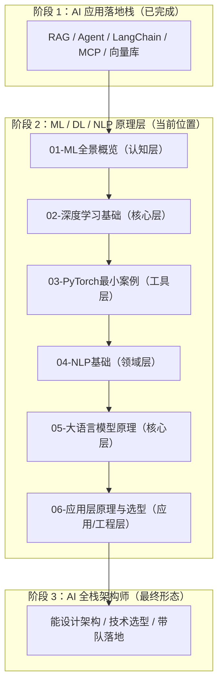
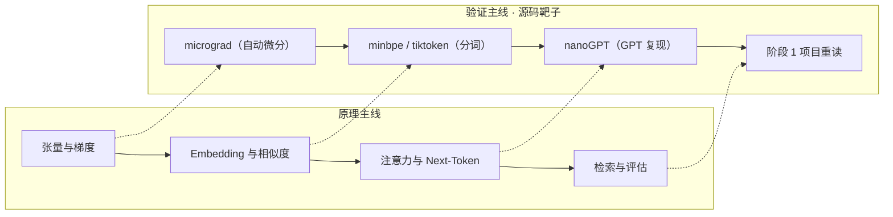

# ML / DL / NLP 原理层 — 面向全栈工程师的 AI 系统能力升级路线

> 从「会用 LangChain」升级到「能设计下一代 AI 应用」。全程围绕 **理解原理 → 优化 RAG/Agent → 技术选型**，不卷模型训练、不卷调参、不卷炼丹。

---

## 1. 定位

| 项目 | 内容 |
|------|------|
| 目标读者 | 前端 Leader / 全栈工程师 / Agent 开发工程师（CS 专业，阶段 1 已完成） |
| 前置要求 | 阶段 1「AI 应用落地栈」已完成（RAG / Agent / LangChain / MCP / 向量库已上手）；TS/Node 为主力语言；Python 只需脚本阅读与运行能力；数学按需补直觉 |
| 学习目标 | 懂原理的 AI 应用架构师：能解释 AI 现象、优化 RAG/Agent、独立完成模型与检索选型 |
| 面试目标 | 面试能答、评审能讲：能向算法团队提出有效问题；讲清每条选型理由与取舍 |

## 2. 边界声明

| 维度 | ✅ 这是 | ❌ 这不是 |
|------|---------|----------|
| 学习目标 | 懂原理的 AI 应用架构师 | 算法工程师 |
| 学习导向 | 理解原理 → 解释现象 → 优化 RAG/Agent → 技术选型 | 训练模型 → 调参 → 发论文 |
| 代码定位 | 最短代码验证原理（10 行跑通一个原理） | 深入算法开发 |
| 数学要求 | 按需补直觉，够用即止 | 系统学数学、推导公式 |
| 模型训练 | 理解训练过程在做什么 | 手撸模型、自训大模型 |
| 知识锚点 | RAG / Agent / 选型场景 | 脱离场景的纯理论 |
| 卡壳策略 | 2 天搞不懂就跳过，继续前进 | 死磕一个原理到底 |

**一句话总结**：只学「能帮你解释 AI 现象、优化 RAG/Agent、做技术选型」的核心内容，其余一概不碰。

## 3. 学习原则（四条铁律）

| # | 原则 | 说明 |
|---|------|------|
| 1 | 一个概念回答三个问题 | 它是什么（直觉）？为什么有效（类比，不推公式）？和我的 AI 应用什么关系（落到场景）？ |
| 2 | 最小案例验证原理 | 每个原理用 ≤10 行代码跑通；**能留在 TypeScript 就不切 Python**（transformers.js 等） |
| 3 | 锚定核心场景 | 每个知识点必须能回答：「这对优化 RAG/Agent 有什么用？」 |
| 4 | 源码靶子优先 | 每个模块读一个最小实现（micrograd / minbpe / nanoGPT），用读代码代替刷教程 |

> 🚧 红线原则：如果一个知识点用了 2 天还没理解、且无法直接帮你优化 RAG/Agent/AI 应用 —— **跳过，继续前进**。

## 4. 学习路径图

## 5. 模块规划总览

| 序号 | 模块 | 层 | 一句话定位 | 源码靶子 | 验收产出 | 前置 |
|------|------|----|-----------|---------|---------|------|
| 01 | ML全景概览 | 认知层 | 核心内容 30-60 分钟；含练习与沉淀共 3-4 天 | — | 非技术同事也能听懂「ML 在学什么」 | 无 |
| 02 | 深度学习基础 | 核心层 | 弄懂神经网络为什么有效 | micrograd | 画出 2 层网络数据流图 | 01 |
| 03 | PyTorch最小案例 | 工具层 | 掌握 10 行验证原理的工具 | micrograd vs autograd | 3 个最小案例脱离教程重写 | 02 |
| 04 | NLP基础 | 领域层 | 文本如何被机器理解：分词 → Embedding → 相似度 | minbpe / tiktoken | 讲清检索链路每一环的失败模式 | 03 |
| 05 | 大语言模型原理 | 核心层 | 大模型为什么聪明、又为什么胡说 | nanoGPT + microgpt | 10 分钟讲清一次推理全过程 | 04 |
| 06 | 应用层原理与选型 | 应用/工程层 | 收口为「能优化、能选型、能设计」 | 阶段 1 RAG 项目重读 | 输出《RAG 选型与优化方案》 | 05 |

## 6. 模块详解

> 两级结构：**模块**为契约单元（含练习 / 面试 / 验收）；每个模块尾部的「篇目拆分」是写作单元——每篇 30-60 分钟一篇文档，**落盘路径固定为 `doc/NN-模块名/01-xxx.md`**（如 `doc/05-大语言模型原理/01-Next-Token与采样.md`），与阶段 1 的 `agent-fullstack/doc/01-…/` 惯例对齐。前置列中的 `M-P` 指「第 M 模块第 P 篇」。

### 01-ML全景概览（认知层 · 无代码）

| 要素 | 内容 |
|------|------|
| 一句话定位 | 用一次专注会话建立 ML 全景图，让后续每个模块都能「对号入座」 |
| 预计时间 | 3-4 天 |
| 核心知识点 | 监督 / 无监督 / 自监督的划分；分类 / 回归 / 聚类 / 检索的本质；训练 vs 推理的工程含义；「模型 = 学习输入到输出的映射」的最小直觉 |
| 源码靶子 | 无（本模块不写代码） |
| 练习 | 要求：给监督 / 无监督 / 自监督各找 1 个 AI 应用对应物并写真实例子。提示：从「它要学什么」倒推——工具选择学「输入 → 用哪个工具」，用户分组学「谁和谁相似」，LLM 预训练学「下一个 token 是什么」。预期：能进一步解释「为什么 RAG 检索属于度量学习（学相似度），而不是分类」 |
| 面试问答 | ①监督 vs 自监督 vs 强化学习一句话区别；②为什么说 LLM 是自监督的。示范：问：自监督和监督学习有什么区别？答：监督学习需要人工标注的（输入 → 标签）样本；自监督的标签从数据自身构造（如预测下一个 token），无需人工标注，因此 LLM 预训练属于自监督 |
| 对比板块 | ML 范式全景 vs Agent 工程中的对应结构 |
| 参考链接 | — |
| 验收产出 | 5 分钟内、不用术语给非技术同事讲清「ML 在学什么、和你的 Agent 有什么关系」 |

**篇目拆分**（每篇 30-60 分钟，写作时落盘为 `doc/01-ML全景概览/01-xxx.md`）

| 篇 | 篇名 | 一句话定位 | 前置 | 靶子 |
|----|------|-----------|------|------|
| 01-1 | ML 全景与学习范式 | 一次会话建立范式全景：范式划分 → 分类/回归/聚类/检索本质 → 训练 vs 推理 → 范式↔Agent 工程对应 | 无 | — |

### 02-深度学习基础（核心层）

| 要素 | 内容 |
|------|------|
| 一句话定位 | 弄懂神经网络为什么有效（前向 / 反向 / 损失函数的直觉），为 LLM 打地基 |
| 预计时间 | 约 1 周 |
| 核心知识点 | 数学弹药（够用即止）：导数 = 斜率、链式法则 = 复合函数拆解、向量逐元素运算；神经元与层；前向传播；损失函数；反向传播（知道它在做什么，不需要会推导）；梯度下降；过拟合 / Dropout 直觉；CNN / RNN 适用场景与局限；Transformer 为何取代 RNN（并行 + 长依赖） |
| 源码靶子 | [micrograd](https://github.com/karpathy/micrograd)（~100 行自动微分，逐行读） |
| 最小案例 | 手动完成一次 `y = x·w + b` 的前向 + 反向（≤10 行 NumPy） |
| 练习 | 要求：跑通 micrograd demo 训练 2 层 MLP 拟合异或，并改动学习率与层数对比。提示：异或不可线性分割，先试单层（必失败）体会为什么需要 2 层；学习率从 0.1 起，过大（loss 发散）与过小（收敛极慢）各试一次。预期：能讲清「为什么必须 2 层 + 非线性激活」 |
| 面试问答 | ①梯度下降怎么工作；②为什么深层网络难训练；③Dropout 是干嘛的；④为什么 RNN 不适合长文本而 Transformer 可以。示范：问：梯度下降具体在做什么？答：算出损失对每个参数的梯度，让参数朝「损失下降最快的方向」迈一小步，反复迭代直到损失不再下降；学习率过大会跨过最优点，过小则走得太慢 |
| 对比板块 | CNN vs RNN vs Transformer 适用场景三角 |
| 参考链接 | micrograd 仓库（源码靶子本身即一级资料）；[PyTorch autograd 官方教程](https://pytorch.org/tutorials/beginner/blitz/autograd_tutorial.html) |
| 验收产出 | 不看资料画出 2 层网络数据流图，能指出每个张量在哪一步产生、用来做什么 |

**篇目拆分**

| 篇 | 篇名 | 一句话定位 | 前置 | 靶子 |
|----|------|-----------|------|------|
| 02-1 | 神经网络与前向传播 | 神经元、层、前向传播、损失函数直觉，先跑通 `y = x·w + b` 手算 | 01-1 | — |
| 02-2 | 训练三件套：反向传播 / 梯度下降 / 过拟合 | 反向传播在做什么（不求导）、梯度下降与学习率、过拟合与 Dropout | 02-1 | micrograd |
| 02-3 | 架构演进：CNN vs RNN vs Transformer | 各自的适用场景与局限，Transformer 为何取代 RNN | 02-2 | — |

### 03-PyTorch最小案例（工具层）

| 要素 | 内容 |
|------|------|
| 一句话定位 | 掌握「最短代码验证原理」的工具能力（工具层先玩出感觉，机理留到 04 讲），同时守住 TS 主场 |
| 预计时间 | 3-4 天 |
| 核心知识点 | Tensor 与广播；`autograd.grad` 自动微分；`nn.Embedding` / `softmax` / `matmul` 常用算子；何时用 PyTorch、何时用 [transformers.js](https://huggingface.co/docs/transformers.js) |
| 源码靶子 | 同一个「反向传播」：对比 micrograd（02 已读）与 PyTorch autograd 两套实现 |
| 最小案例 | 3 个 10 行案例：Embedding 查表、softmax 归一化、cosine 相似度 |
| 练习 | 要求：用 torch 3 行实现 cosine，与欧氏距离对比同一对句子的分数差异并解释。提示：先验证「单位向量下两者排序等价」，再换不同长度向量，观察排序何时分叉。预期：能回答「为什么文本检索常选 cosine（对向量长度不敏感）」 |
| 面试问答 | ①Embedding 层训练出来的是什么；②为什么打分前要 softmax。示范：问：Embedding 层训练出来的是什么？答：是一张可学习的查表（每个 token 一行向量）；训练目标让「上下文相似的 token 向量相近」，推理时按 token id 查出对应向量 |
| 对比板块 | PyTorch（本地最小实验）vs transformers.js（浏览器 / Node 推理） |
| 参考链接 | [PyTorch autograd 教程](https://pytorch.org/tutorials/beginner/blitz/autograd_tutorial.html)；[transformers.js 文档](https://huggingface.co/docs/transformers.js) |
| 验收产出 | 3 个最小案例脱离教程重写（允许查 API 速查表），重点讲清流程而非背 Python 语法 |

**篇目拆分**

| 篇 | 篇名 | 一句话定位 | 前置 | 靶子 |
|----|------|-----------|------|------|
| 03-1 | 张量与自动微分 | Tensor / 广播 / autograd.grad，与 micrograd 两套实现对照 | 02-2 | micrograd vs autograd |
| 03-2 | 三个最小案例与 TS 边界 | Embedding 查表 / softmax / cosine 各 10 行跑通；何时用 transformers.js | 03-1 | — |

### 04-NLP基础（领域层）

| 要素 | 内容 |
|------|------|
| 一句话定位 | 文本如何被机器理解：Tokenization → Embedding → 相似度，一条线打通 |
| 预计时间 | 约 1 周 |
| 核心知识点 | BPE 分词与 OOV；词 / 句 / 文档 Embedding；稠密 vs 稀疏 vs 混合向量；cosine vs 欧氏距离；语义匹配为什么有效；Matryoshka（可裁剪维度）概念 |
| 源码靶子 | [minbpe](https://github.com/karpathy/minbpe) 或 [tiktoken](https://github.com/openai/tiktoken)（BPE 实现）；[BGE-M3](https://huggingface.co/BAAI/bge-m3)（混合向量原理，看模型卡） |
| 最小案例 | 5 行代码把「猫和狗打架」与「猫咪大战狗狗」embedding 后算 cosine |
| 练习 | 要求：用同义 / 反义句对测 2 个不同 Embedding 模型，输出相似度小对照表。提示：固定同一批句子与同一度量，只换模型；「区分度 = 同义对均分 − 反义对均分」可作模型敏感性的粗略指标。预期：能指出哪个模型对中文语义更敏感，并猜测原因（训练语料 / 多语言目标） |
| 面试问答 | ①为什么 RAG 检索不准（3 类原因）；②cosine 为什么比欧氏距离常用；③BPE 怎么解决 OOV。示范：问：RAG 检索不准一般出在哪些环节？答：三处——chunk 切分粒度不当（语义被截断或混入噪声）、Embedding 模型与语料域不匹配、相似度度量或 top-k 阈值不适配；定位需分环节评估（见 06） |
| 对比板块 | 稠密向量 vs 稀疏向量（BM25）vs 混合向量（BGE-M3） |
| 参考链接 | [minbpe](https://github.com/karpathy/minbpe) / [tiktoken](https://github.com/openai/tiktoken)；[BGE-M3](https://huggingface.co/BAAI/bge-m3) |
| 验收产出 | 能独立列出「查询 → top-k 检索」链路每一环的失败模式与对应优化手段 |

**篇目拆分**

| 篇 | 篇名 | 一句话定位 | 前置 | 靶子 |
|----|------|-----------|------|------|
| 04-1 | 分词与 BPE | Tokenizer 如何把文本变成 id、BPE 与 OOV | 03-2 | minbpe / tiktoken |
| 04-2 | Embedding 与相似度 | 词/句/文档 Embedding、稠密 vs 稀疏 vs 混合、cosine vs 欧氏、Matryoshka | 04-1 | BGE-M3 模型卡（延伸） |
| 04-3 | 检索失败模式 | 「查询 → 检索」链路每一环的失败原因与归因清单（06-1 的前置；与 05 无依赖，可放在 05 之后读） | 04-2 | — |

### 05-大语言模型原理（核心层）

| 要素 | 内容 |
|------|------|
| 一句话定位 | 弄懂「大模型为什么聪明、又为什么胡说」，核心是注意力、next-token、采样与上下文窗口 |
| 预计时间 | 1-1.5 周 |
| 核心知识点 | Next-Token Prediction 训练目标；注意力机制直觉；结构化输出与工具调用的约束机理（约束采样空间）；位置编码；上下文窗口与 KV Cache 概念；temperature / top-p 采样与幻觉的关系；幻觉成因与缓解（置信度、RAG、结构化输出）；微调 vs Prompt 的边界；架构演进：Transformer O(n²) vs SSM/Mamba O(n) vs 混合架构；多模态一句话定位（视觉 / 音频 token 与文本进入同一表示空间） |
| 源码靶子 | 主：[nanoGPT](https://github.com/karpathy/nanoGPT)（~300 行 GPT，按「注意力 → Block → GPT」逐模块读；已停维护，不影响教学价值）；备：[microgpt](https://gist.github.com/karpathy/8627fe009c40f57531cb18360106ce95)（纯 Python 零依赖 200 行全链路：分词 → 自动微分 → GPT → 训练 → 推理；有 [TS 移植版（bun 单文件、零依赖）](https://gist.github.com/snoblenet/7739055e32bffb81277b6a08d33a37ef)，可直接在 TS 主场读，原版 Python 仅作对照）；[nanochat](https://github.com/karpathy/nanochat) 仅作「生产全链路」的延伸了解，不作为逐模块读靶子 |
| 最小案例 | nanoGPT character-level 配置训练 10 分钟观察生成质量；或 transformers.js 在浏览器跑一个小模型 |
| 练习 | 要求：把 temperature 从 0.0 调到 1.5，记录输出的重复度 / 发散度并解释；再让 nanoGPT 学一个「只输出合法 JSON」的字符集任务。提示：temperature=0 时取最大概率 token（几乎确定性），越高越倾向按概率采样，低概率 token 也有机会被选中；JSON 任务先构造「必须学会的字符集合」，观察闭合括号等语法约束是否被学会。预期：能用「概率分布重缩放」解释温度与幻觉的关系 |
| 面试问答 | ①LLM 为什么会幻觉；②上下文窗口为什么不能无限大；③RAG / 微调 / Prompt 怎么选；④Mamba 凭什么更快（复杂度直觉）。示范：问：LLM 为什么会幻觉？答：LLM 只学了「下一个 token 的概率分布」，没有事实核对机制；当采样落到分布中「合理但错误」的区域（少见事实、低概率路径）就产生幻觉；缓解：RAG 兜底、降低温度、结构化输出约束、置信度自检 |
| 对比板块 | Transformer vs Mamba vs 混合架构（长上下文场景）；微调 vs Prompt vs RAG |
| 参考链接 | [nanoGPT](https://github.com/karpathy/nanoGPT) / [microgpt（200 行全链路）](https://gist.github.com/karpathy/8627fe009c40f57531cb18360106ce95) / [nanochat（生产全链路）](https://github.com/karpathy/nanochat)；[Attention Is All You Need](https://arxiv.org/abs/1706.03762)；[Mamba 论文](https://arxiv.org/abs/2312.00752)；长上下文实测：[Transformer vs SSM 效率反转（arXiv 2507.12442）](https://arxiv.org/html/2507.12442v3) |
| 验收产出 | 10 分钟内讲清「一次推理从 prompt 到 token 的全过程」，包括「哪里可能胡说、怎么写 prompt 缓解」 |

**篇目拆分**（本模块最重，4 篇不合并）

| 篇 | 篇名 | 一句话定位 | 前置 | 靶子 |
|----|------|-----------|------|------|
| 05-1 | Next-Token 与采样 | 训练目标、temperature / top-p 与幻觉机制、「只输出合法 JSON」任务 | 04-2 | — |
| 05-2 | 注意力与位置编码 | QKV 直觉、因果掩码、位置编码，结合源码逐段读 | 05-1 | nanoGPT / microgpt |
| 05-3 | 上下文窗口与 KV Cache | 为什么不能无限大、推理成本、长上下文策略 | 05-2 | — |
| 05-4 | 架构与选型 | Transformer vs Mamba vs 混合、微调 vs Prompt vs RAG、结构化输出约束、多模态定位 | 05-3 | nanochat（生产全链路延伸） |

### 06-应用层原理与选型（应用 / 工程层）

| 要素 | 内容 |
|------|------|
| 一句话定位 | 把前 5 个模块收口为「能优化、能选型、能设计」，直接对标阶段 1 项目 |
| 预计时间 | 1-2 周 |
| 核心知识点 | 检索质量四件套：chunking / query 改写 / 混合检索 / rerank；评估指标（recall@k、MRR、NDCG@10、faithfulness / relevancy）；2026 主流 Embedding 格局（见对比板块）；量化 / 蒸馏概念与适用场景；推理成本与延迟权衡 |
| 源码靶子 | 重读自己阶段 1 的 RAG 项目（标注瓶颈）；选读一个 reranker 实现 |
| 最小案例 | 10 行代码做一次「query 改写前后」的检索结果对比 |
| 练习 | 要求：对阶段 1 任一项目做检索质量审计：定指标 → 采样 bad case → 定位环节 → 给出优化清单（若项目无完整检索链路 / 检索日志，用带日志的「最小 RAG demo」替代审计对象）。提示：先跑 20-30 条真实查询，把 bad case 按「chunking / embedding / 检索策略 / 生成」4 个环节归因；指标至少用 recall@k 与 faithfulness 两项。预期：产出一份带数据支撑的优化清单，每条能对应到具体环节，并引用 04/05 的知识解释原因 |
| 面试问答 | ①怎么评估一个 RAG 系统；②Embedding 模型怎么选；③什么时候该上 rerank；④多模态检索怎么做。示范：问：怎么评估一个 RAG 系统的好坏？答：分检索与生成两侧——检索侧看 recall@k、MRR、NDCG@10，生成侧看 faithfulness、relevancy；先分环节定位瓶颈再针对性优化，避免只盯端到端一个数 |
| 对比板块 | 2026 主流 Embedding（数据截至 2026-08，MTEB 榜单逐月更新）：Gemini Embedding（MTEB 领先、支持 MRL）vs Qwen3-Embedding（开源第一、代码检索强）vs [BGE-M3](https://huggingface.co/BAAI/bge-m3)（中文 + 混合向量）vs [Cohere Embed v4](https://docs.cohere.com/changelog/embed-multimodal-v4)（多模态、128K 上下文）；附选型决策树 |
| 参考链接 | [MTEB 榜单](https://huggingface.co/spaces/mteb/leaderboard)（官方为准、逐月变化）；[Qwen3-Embedding 官方博客](https://qwenlm.github.io/blog/qwen3-embedding/)；[Gemini Embedding 官方发布](https://developers.googleblog.com/gemini-embedding-available-gemini-api/)；[Cohere Embed v4 变更日志](https://docs.cohere.com/changelog/embed-multimodal-v4) |
| 验收产出 | 输出《我的 RAG 选型与优化方案》：场景 → Embedding → 检索策略 → 评估指标 → 取舍理由，能对评审会讲清楚 |

**篇目拆分**

| 篇 | 篇名 | 一句话定位 | 前置 | 靶子 |
|----|------|-----------|------|------|
| 06-1 | 检索质量四件套 | chunking / query 改写 / 混合检索 / rerank 各自解决什么 | 04-3、05-1 | 重读阶段 1 RAG 代码 |
| 06-2 | 评估与审计 | recall@k / MRR / NDCG@10 / faithfulness；20-30 条真实查询审计流程 | 06-1 | — |
| 06-3 | 模型与 Embedding 选型 | 2026 格局（Gemini / Qwen3 / BGE-M3 / Cohere v4）、量化/蒸馏概念、成本与延迟 | 06-1 | — |

## 7. 练习递进线

| 层级 | 覆盖模块 | 能力 | 样例 |
|------|---------|------|------|
| L1 验证 | 01-03 | 最短代码跑通一个原理 | 10 行代码验证 cosine、梯度下降 |
| L2 诊断 | 04-05 | 解释现象 + 做对照实验 | temperature 对照、Embedding 模型对照 |
| L3 收口 | 06 | 改造真实项目并给出结论 | 检索质量审计 + 选型文档 |

## 8. 面试覆盖图

| 高频面试点 | 覆盖模块 |
|-----------|---------|
| 监督 / 自监督 / 强化学习一句话区别 | 01 |
| 梯度下降、过拟合、Dropout 直觉 | 02、03 |
| RAG 为什么不准；cosine vs 欧氏距离；混合检索 | 04、06 |
| LLM 幻觉成因与缓解 | 05、06 |
| 上下文窗口限制；KV Cache 直觉 | 05 |
| 微调 vs Prompt vs RAG 选型 | 05、06 |
| Embedding / 模型选型与评估指标 | 06 |
| 结构化输出 / 工具调用为什么稳定 | 05 |
| Mamba vs Transformer 复杂度直觉 | 05 |

> 写作期规范：各模块「面试问答」的内容在正式文档中统一用 `> **问：**` / `> **答：**` 模板展开（本大纲已在各模块附 1 条示范，其余按同风格补全）。

## 9. 学习深度边界

| 学到什么程度 | 不学什么 |
|-------------|---------|
| Embedding 为什么有效、如何影响检索 | Word2Vec 数学推导、负采样实现细节 |
| 能读懂 nanoGPT / microgpt 里单头注意力的 QKV 计算流程 | 不手推矩阵运算、不抠工程化写法（Flash Attention 等） |
| CNN / RNN / Transformer 适用场景与局限 | 反向传播链式推导、梯度消失数学证明 |
| 幻觉成因与缓解策略 | RLHF 训练细节、PPO 算法实现 |
| 相似度计算原理、混合检索动机 | ANN 底层实现优化（HNSW / IVF 细节） |
| 架构复杂度直觉（O(n²) vs O(n)）、SSM 动机 | 状态空间方程推导、Mamba 数学 |
| 微调 vs Prompt 的选型边界 | LoRA / QLoRA 实现原理与训练流程 |
| 量化 / 蒸馏的概念与适用场景 | 量化算法的数学实现 |
| 多模态 Embedding / 模型能做什么 | 图像 / 音频模型训练细节 |
| PyTorch 张量与自动微分 | 自己手写深度学习框架 |

## 10. 预估周期（每天 1-2 小时）

| 模块 | 预估 |
|------|------|
| 01-ML全景概览 | 3-4 天 |
| 02-深度学习基础 | 约 1 周 |
| 03-PyTorch最小案例 | 3-4 天 |
| 04-NLP基础 | 约 1 周 |
| 05-大语言模型原理 | 1-1.5 周 |
| 06-应用层原理与选型 | 1-2 周 |

合计约 6-8 周，核心耗时集中在 05、06 两个模块。

## 11. 参考链接（一级来源）

- [micrograd（自动微分，~100 行）](https://github.com/karpathy/micrograd)
- [minbpe（BPE 分词实现）](https://github.com/karpathy/minbpe) / [tiktoken（OpenAI 官方）](https://github.com/openai/tiktoken)
- [nanoGPT（GPT 复现，~300 行）](https://github.com/karpathy/nanoGPT)（已停维护，仍作逐模块读靶子）；[microgpt（官方 200 行全链路，备选靶子）](https://gist.github.com/karpathy/8627fe009c40f57531cb18360106ce95) + [TS 移植版（bun 单文件、零依赖）](https://gist.github.com/snoblenet/7739055e32bffb81277b6a08d33a37ef)；[nanochat（~8000 行全栈 ChatGPT，仅作生产全链路参考）](https://github.com/karpathy/nanochat)
- [Attention Is All You Need（Transformer 原始论文）](https://arxiv.org/abs/1706.03762)
- [Mamba（状态空间模型，arXiv 2312.00752）](https://arxiv.org/abs/2312.00752)；长上下文实测：[Transformer vs SSM 效率反转（arXiv 2507.12442）](https://arxiv.org/html/2507.12442v4)
- [MTEB 榜单（Embedding 评测，官方为准、分数逐月更新）](https://huggingface.co/spaces/mteb/leaderboard)
- [Qwen3-Embedding 官方博客](https://qwenlm.github.io/blog/qwen3-embedding/) / [论文（arXiv 2506.05176）](https://arxiv.org/abs/2506.05176)
- [Gemini Embedding 官方发布（Google Developers Blog）](https://developers.googleblog.com/gemini-embedding-available-gemini-api/)
- [Cohere Embed v4（多模态）变更日志](https://docs.cohere.com/changelog/embed-multimodal-v4)
- [BGE-M3（智源，混合向量）](https://huggingface.co/BAAI/bge-m3)
- [transformers.js（浏览器 / Node 推理）](https://huggingface.co/docs/transformers.js)

## 12. 与阶段 1 的关系

| 维度 | AI 应用落地栈（阶段 1） | ML/DL/NLP 原理层（阶段 2） |
|------|------------------------|---------------------------|
| 目标 | 能做产品、能落地 | 能看懂原理、能做技术选型 |
| 内容 | RAG / Agent / LangChain / MCP | ML / DL / NLP / LLM 本质 |
| 深度 | 调 API、搭流程 | 理解「为什么有效」「什么时候不行」 |
| 产出 | 可运行的 AI 应用 | 能优化、能选型、能设计架构 |
| 关系 | **前置已完成** | **当前位置，即将开始** |

> 学完不是让你当算法工程师，而是成为未来最稀缺的角色 —— **懂原理的 AI 应用架构师**。