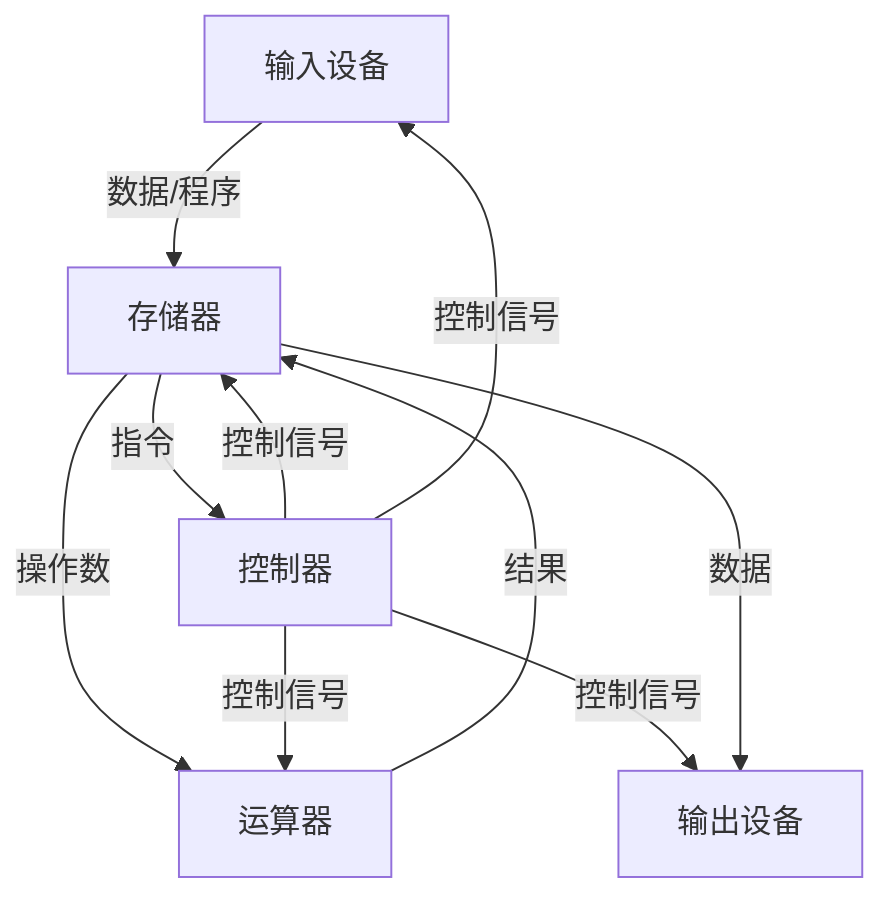

# 第 1 章：计算机系统概述

> 这章在 408 里分值不高（1-2 道选择题），但**性能指标计算是必考送分题**——CPI、MIPS、执行时间公式、Amdahl 定律，每年至少出一个计算型选择题。冯·诺依曼结构是基础概念，选择题里经常以"以下哪项不属于……"的形式出现。本章花 1-2 小时搞定即可，重点放在公式和例题上。

---

## 1.1 计算机发展历程

四代计算机的划分依据是**电子器件**：

| 代 | 时间 | 核心器件 | 特征 |
|---|------|---------|------|
| 第一代 | 1946-1957 | 电子管 | 体积大、耗电多、机器语言编程 |
| 第二代 | 1958-1964 | 晶体管 | 出现高级语言、操作系统雏形 |
| 第三代 | 1965-1970 | 中小规模集成电路 | 操作系统成熟、系列化 |
| 第四代 | 1971-至今 | 大规模/超大规模集成电路 | 微处理器、个人计算机 |

> 考试只需记住"第几代对应什么器件"，偶尔出选择题。ENIAC（1946）是第一台电子计算机，采用十进制运算。

---

## 1.2 冯·诺依曼体系结构

### 核心思想

冯·诺依曼（Von Neumann）1945 年提出**存储程序**概念，核心三点：

1. **存储程序**：程序和数据以二进制形式事先存入存储器
2. **按地址访问**：通过地址访问存储器中的指令和数据
3. **顺序执行**：指令按存储顺序逐条执行（除非遇到转移指令）

### 五大部件

> 注意：**控制器**是指挥中心，向所有部件发出控制信号；**运算器**和**存储器**之间有双向数据流。数据流和控制流要分清——选择题常在这里设坑。

### 指令执行的基本过程

冯·诺依曼机中，每条指令的执行分为以下步骤：

1. **取指**：PC → MAR → 主存 → MDR → IR，同时 PC+1
2. **译码**：CU 对 IR 中的操作码进行译码，确定操作类型
3. **执行**：根据指令类型完成运算、访存、转移等操作
4. **中断检测**：一条指令执行完毕后，检查是否有中断请求

> 这个流程在第 5 章（CPU）会详细展开，这里只需建立"取指 → 译码 → 执行"的基本印象。

### 冯·诺依曼结构 vs 哈佛结构

| 对比项 | 冯·诺依曼 | 哈佛 |
|-------|----------|------|
| 存储方式 | 指令和数据共用存储器 | 指令和数据分开存储 |
| 总线 | 共享总线，取指和取数不能同时进行 | 独立总线，可同时取指和取数 |
| 应用 | 通用计算机 | DSP、单片机、Cache 设计 |

> 现代 CPU 内部（L1 Cache 层面）普遍采用哈佛结构（指令 Cache 和数据 Cache 分离），但整体仍归为冯·诺依曼体系。

---

## 1.3 计算机硬件组成

### CPU = 运算器 + 控制器

| 部件 | 组成 | 功能 |
|------|------|------|
| **运算器** | ALU、累加器（ACC）、状态寄存器（PSW）、通用寄存器 | 执行算术/逻辑运算 |
| **控制器** | PC、IR、MAR、MDR、CU（控制单元） | 取指、译码、产生控制信号 |

> 易错点：**MAR 和 MDR 的归属**。MAR（存储器地址寄存器）和 MDR（存储器数据寄存器）在教材中有时归入控制器、有时归入主存接口。408 中通常认为它们属于**主存**的组成部分。

### 主存 = MAR + MDR + 存储体

- **MAR**：存放要访问的存储单元地址，位数决定寻址范围
- **MDR**：暂存读出/写入的数据，位数等于存储字长
- **存储体**：实际存放数据的阵列

### 数据通路结构

| 结构 | 特点 | 优缺点 |
|------|------|--------|
| 单总线 | 所有部件共享一条总线 | 结构简单，但同一时刻只能有一个部件发送数据 |
| 多总线 | 多条总线并行 | 吞吐率高，但成本增加 |
| 专用通路 | 部件间专用连线 | 速度最快，但连线复杂、不灵活 |

> 单总线结构中，一次操作需要多个时钟周期（因为数据要分步传输）；专用通路可以一步完成，但硬件成本高。

---

## 1.4 计算机软件

- **系统软件**：操作系统、编译程序、数据库管理系统、系统工具
- **应用软件**：面向具体应用的程序（办公软件、浏览器等）

### 计算机系统层次结构

从用户到硬件，计算机系统分为多层：

| 层次 | 名称 | 说明 |
|------|------|------|
| L5 | 应用语言层 | 用户程序（Java、Python 等） |
| L4 | 高级语言层 | 编译器翻译为汇编 |
| L3 | 汇编语言层 | 汇编器翻译为机器语言 |
| L2 | 操作系统层 | 系统调用、资源管理 |
| L1 | 机器语言层（ISA） | 指令集架构，软硬件分界面 |
| L0 | 微程序/硬件层 | 微指令或直接硬件执行 |

> 408 中**ISA（指令集架构）** 是软硬件的分界面，这个概念偶尔会考。计组主要研究 L0-L1 层。

> 选择题偶尔考"以下哪个属于系统软件"，记住：操作系统、编译器、驱动程序都是系统软件。

---

## 1.5 性能指标（408 必考）

### 基本时间概念

- **时钟周期**（ $T$ ）：CPU 主频的倒数， $T = 1/f$
- **主频**（ $f$ ）：CPU 时钟频率，单位 Hz
- **CPI**（Cycles Per Instruction）：执行一条指令所需的平均时钟周期数

### 核心公式

**CPU 执行时间**：

$$
T_{CPU} = N \times CPI \times T = \frac{N \times CPI}{f}
$$

其中 $N$ 为指令条数， $CPI$ 为平均每条指令的时钟周期数， $T$ 为时钟周期， $f$ 为主频。

> 这个公式是本章最核心的公式，**必须记牢**。所有性能计算题都是它的变形。

**MIPS**（Million Instructions Per Second）：

$$
MIPS = \frac{f}{CPI \times 10^6} = \frac{N}{T_{CPU} \times 10^6}
$$

**MFLOPS**（Million Floating-point Operations Per Second）：

$$
MFLOPS = \frac{\text{浮点运算次数}}{T_{CPU} \times 10^6}
$$

> MIPS 和 MFLOPS 都是"每秒执行多少百万条指令/运算"，注意单位是**百万**（ $10^6$ ），不是 $10^9$ 。GHz 对应的是 $10^9$ Hz。

### 多种指令的加权 CPI

当程序包含多类指令时：

$$
CPI_{avg} = \sum_{i=1}^{n} CPI_i \times \frac{N_i}{N}
$$

其中 $CPI_i$ 是第 $i$ 类指令的 CPI， $N_i$ 是第 $i$ 类指令的条数， $N$ 是总指令数。

### CPU 时间 vs 用户时间 vs 系统时间

| 概念 | 含义 |
|------|------|
| CPU 时间 | 程序实际占用 CPU 的时间（不含 I/O 等待） |
| 用户 CPU 时间 | 执行用户态代码的时间 |
| 系统 CPU 时间 | 执行内核态代码（系统调用）的时间 |
| 墙钟时间 | 从开始到结束的总时间（含 I/O、等待其他进程） |

> 关系：墙钟时间 $\geq$ CPU 时间 $=$ 用户 CPU 时间 $+$ 系统 CPU 时间。

### 常见易错点

1. **MIPS 不能直接比较不同机器的性能**：不同指令集的指令复杂度不同，MIPS 高不代表实际执行同一程序更快
2. **主频高 ≠ 性能高**：如果 CPI 很大（比如 CISC 机器），主频高也可能比不过 CPI 小的 RISC 机器
3. **单位换算**：GHz 是 $10^9$ Hz，MIPS 中的 M 是 $10^6$ ，别搞混

> 408 选择题经典陷阱：给出两台机器，一台主频高但 CPI 大，另一台主频低但 CPI 小，问谁快。直接套公式算执行时间，不要凭主频判断。

---

## 1.6 摩尔定律与 Amdahl 定律

### 摩尔定律

集成电路上可容纳的晶体管数目约每 **18-24 个月**翻一番。这不是物理定律，是经验观察，近年来已逐渐放缓。

### Amdahl 定律（408 必考）

对系统中**某一部件**进行加速时，整体加速比受限于该部件在原始执行时间中的占比：

$$
S = \frac{T_{old}}{T_{new}} = \frac{1}{(1 - F_e) + \frac{F_e}{S_e}}
$$

其中：
- $F_e$ ：可改进部分占原始执行时间的比例（加速比例）
- $S_e$ ：该部分的加速比

> 直觉：如果某部分只占 10% 的时间，即使把它加速到无穷快，整体最多快 $1/(1-0.1) \approx 1.11$ 倍。**瓶颈决定上限**。

**特殊情况**：当 $S_e \to \infty$ （可改进部分加速到无穷快）时：

$$
S_{max} = \frac{1}{1 - F_e}
$$

这就是整体加速比的理论上限。

---

## 1.7 典型例题

**例 1**：某 CPU 主频为 2 GHz，某程序包含 10 亿条指令，平均 CPI 为 1.5。求该程序的 CPU 执行时间和 MIPS。

**解**：

$$
T_{CPU} = \frac{N \times CPI}{f} = \frac{10^9 \times 1.5}{2 \times 10^9} = 0.75 \text{ s}
$$

$$
MIPS = \frac{f}{CPI \times 10^6} = \frac{2 \times 10^9}{1.5 \times 10^6} \approx 1333 \text{ MIPS}
$$

> 注意单位换算：2 GHz $= 2 \times 10^9$ Hz。

**例 2**：某程序由三类指令组成：A 类 5000 条（CPI = 1），B 类 3000 条（CPI = 2），C 类 2000 条（CPI = 4）。CPU 主频为 1 GHz。求加权 CPI 和执行时间。

**解**：

总指令数 $N = 5000 + 3000 + 2000 = 10000$

$$
CPI_{avg} = \frac{5000 \times 1 + 3000 \times 2 + 2000 \times 4}{10000} = \frac{5000 + 6000 + 8000}{10000} = 1.9
$$

$$
T_{CPU} = \frac{10000 \times 1.9}{10^9} = 19 \times 10^{-6} \text{ s} = 19 \text{ μs}
$$

**例 3**（Amdahl 定律）：某程序执行时间为 100 s，其中浮点运算占 60 s。若将浮点运算部件加速 3 倍，求整体加速比。

**解**：

$$
F_e = \frac{60}{100} = 0.6, \quad S_e = 3
$$

$$
S = \frac{1}{(1 - 0.6) + \frac{0.6}{3}} = \frac{1}{0.4 + 0.2} = \frac{1}{0.6} \approx 1.67
$$

即整体加速约 1.67 倍，而非 3 倍。

> 这道题说明：即使把占 60% 时间的部分加速 3 倍，整体也只能快 1.67 倍。优化要抓瓶颈，但瓶颈占比决定了收益上限。

### 解题技巧总结

- 看到"主频 + 指令数 + CPI"→ 直接套 $T = N \times CPI / f$
- 看到"多类指令"→ 先算加权 CPI，再套公式
- 看到"加速某部分"→ Amdahl 定律，先确定 $F_e$ 和 $S_e$
- 看到"比较两台机器"→ 分别算执行时间，比大小
- 单位陷阱：GHz → $10^9$ Hz，MIPS → $10^6$ 条/秒，别漏乘除

### 常见陷阱清单

1. **主频高 ≠ 性能高**：必须结合 CPI 和指令数综合判断，不能只看主频
2. **MIPS 不能跨指令集比较**：CISC 一条指令可能完成 RISC 三条指令的工作，MIPS 数值大不代表程序跑得快
3. **CPU 时间 ≠ 墙钟时间**：题目问"CPU 执行时间"时不要加上 I/O 等待时间
4. **Amdahl 定律中 $F_e$ 是时间占比不是指令占比**：如果题目给的是"浮点指令占 30%"，还需要知道浮点指令的 CPI 才能算出时间占比
5. **加权 CPI 的分母是总指令数**：不是指令种类数

---

## 本章小结

### 核心要点回顾

1. **冯·诺依曼三要素**：存储程序、按地址访问、顺序执行
2. **五大部件**：运算器、控制器、存储器、输入设备、输出设备
3. **CPU = 运算器 + 控制器**；主存 = MAR + MDR + 存储体
4. **执行时间公式**： $T_{CPU} = N \times CPI / f$ （最核心）
5. **Amdahl 定律**： $S = 1 / [(1-F_e) + F_e/S_e]$

### 考试重点排序

| 优先级 | 考点 | 题型 |
|--------|------|------|
| ⭐⭐⭐ | 执行时间、CPI、MIPS 计算 | 选择题 |
| ⭐⭐⭐ | Amdahl 定律计算 | 选择题 |
| ⭐⭐ | 冯·诺依曼结构特征 | 选择题 |
| ⭐ | 计算机发展代际、软硬件分类 | 选择题 |

> 本章复习策略：公式记住、例题做会即可，不需要花太多时间。把精力留给第 2 章（数据表示）和第 3 章（存储系统）——那才是计组的大头。
