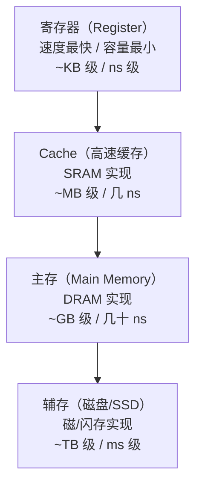
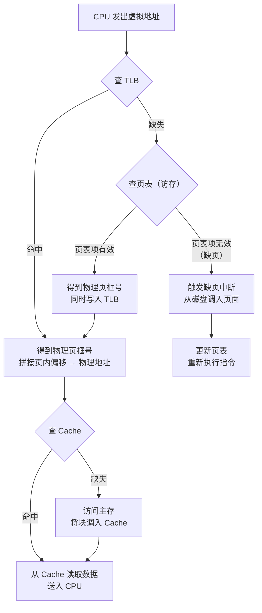

# 第 3 章：存储系统

> 存储系统是计组两大核心之一（另一个是 CPU/流水线）。Cache 地址划分、命中率计算、主存扩展几乎每年必考，选择题和综合题都会出。这一章的套路非常固定：记住地址结构怎么切、容量怎么算、扩展怎么做，拿分就是水到渠成的事。

---

## 3.1 存储器层次结构

### 层次模型

计算机存储系统是一个**多级层次结构**，从上到下速度递减、容量递增、每位成本递减：



### 核心思想

- **局部性原理**是层次结构能工作的理论基础：
  - **时间局部性**：刚被访问的数据很可能再次被访问（循环、栈顶）
  - **空间局部性**：刚被访问地址附近的数据很可能被访问（数组遍历、顺序指令）
- 上层是下层的"缓存"，对程序员透明（寄存器除外）
- 408 关注的是 **Cache-主存** 和 **主存-辅存（虚拟存储）** 这两级
- 相邻两级之间的性能差距：Cache-主存约 10 倍，主存-辅存约 10 万倍

> 考试直觉：层次结构本身不单独出题，但它是理解 Cache 和虚拟存储的前提。记住"越往上越快越小越贵"就够了。

---

## 3.2 主存储器

### SRAM vs DRAM

| 对比项 | SRAM（静态 RAM） | DRAM（动态 RAM） |
|--------|-----------------|-----------------|
| 存储元件 | 触发器（6 管） | 电容（1 管 1 电容） |
| 是否需要刷新 | **不需要** | **需要**（电容漏电） |
| 速度 | 快（ns 级） | 较慢（几十 ns） |
| 集成度 | 低 | 高 |
| 成本 | 高 | 低 |
| 功耗 | 较高 | 较低 |
| 典型用途 | Cache | 主存 |

### DRAM 刷新机制

DRAM 靠电容存储电荷，电荷会泄漏，必须定期刷新：

- **刷新单位**：按**行**刷新（一次刷新一行所有存储元）
- **刷新周期**：一般 2 ms 内必须刷完所有行
- 三种刷新方式：

| 刷新方式 | 方法 | 优点 | 缺点 |
|---------|------|------|------|
| 集中刷新 | 在 2 ms 末尾集中刷完所有行 | 控制简单 | 有"死时间"（刷新期间不能访问） |
| 分散刷新 | 每个存取周期中安排一行刷新 | 无死时间 | 刷新过于频繁，浪费带宽 |
| 异步刷新 | 每隔一段时间刷一行（分散 + 集中折中） | 兼顾性能和带宽 | 控制较复杂 |

> 408 选择题考法：给定行数（如 1024 行）和刷新周期（2 ms），问集中刷新的"死时间"。
> 死时间 = 行数 × 刷新周期时间。若存取周期为 0.5 μs，1024 行的死时间 = 1024 × 0.5 μs = 512 μs。

### 存储芯片容量计算

芯片容量表示为 $字数 \times 位数$，例如 $8K \times 4$ 位：

- 字数 $= 8K = 8 \times 1024 = 2^{13}$，需要 **13 根地址线**
- 位数 $= 4$，即 **4 根数据线**
- 总存储容量 $= 8K \times 4 = 32Kb = 4KB$

> 注意区分：$K = 2^{10} = 1024$（存储器语境），不是 $1000$。
> 地址线根数 = $\log_2(字数)$，数据线根数 = 位数。这是基本功，必须秒算。

### 主存扩展

用多片小容量芯片组成大容量存储器，有三种方式：

| 扩展方式 | 目的 | 方法 | 地址线 | 数据线 | 片选 |
|---------|------|------|--------|--------|------|
| **位扩展** | 增加字长 | 各芯片地址线并联，数据线分别接不同位 | 不变 | 增加 | 各芯片同时工作，无需片选 |
| **字扩展** | 增加字数 | 各芯片数据线并联，用高位地址做片选 | 增加 | 不变 | 需要片选信号 |
| **字位同时扩展** | 同时增加字数和字长 | 先位扩展成组，再字扩展 | 增加 | 增加 | 需要片选信号 |

**芯片数量公式**：

$$
芯片数 = \frac{总字数}{每片字数} \times \frac{总位数}{每片位数}
$$

**例 1**：用 $4K \times 2$ 位的 DRAM 芯片组成 $16K \times 8$ 位的主存，需要多少片芯片？如何连接？

**解**：

- 字扩展倍数： $16K / 4K = 4$
- 位扩展倍数： $8 / 2 = 4$
- 总芯片数： $4 \times 4 = 16$ 片
- 连接方式：
  - 每 4 片为一组（位扩展），数据线分别接 $D_0D_1$、 $D_2D_3$、 $D_4D_5$、 $D_6D_7$
  - 共 4 组（字扩展），用地址线 $A_{12}A_{13}$ 经 2-4 译码器产生片选信号
  - 地址线 $A_0 \sim A_{11}$（12 根）并联到所有芯片
  - 每组 4 片共享同一片选信号，组内各片同时工作（位扩展）

> 片选信号由**高位地址**经译码产生，这是字扩展的核心。408 综合题经常要求画连线图，记住"低位地址线并联、高位地址线译码做片选"。

### 存储芯片与 CPU 的连接

连接三要素：

1. **地址线**：CPU 地址总线 → 芯片地址引脚（低位直连，高位译码做片选）
2. **数据线**：CPU 数据总线 ↔ 芯片数据引脚（注意位扩展时各芯片接不同位段）
3. **控制线**：读/写信号（ $\overline{RD}$、 $\overline{WR}$ ）、片选（ $\overline{CS}$ ）

连接步骤（做题模板）：

1. 算出芯片地址线根数 → 确定 CPU 低位地址线直连范围
2. 算出需要多少组（字扩展倍数）→ 确定需要几根高位地址线做片选
3. 高位地址线接译码器 → 译码器输出接各组片选端
4. 数据线按位扩展接法分配
5. 读写控制线并联到所有芯片

> 易错点：若 CPU 地址总线有 20 根，芯片只需 12 根地址线，则 $A_0 \sim A_{11}$ 接芯片， $A_{12} \sim A_{19}$ 用于产生片选。不要遗漏高位地址！

---

## 3.3 高速缓冲存储器（Cache）

### 局部性原理与 Cache 基本思想

- CPU 访问数据具有局部性 → 把最近访问的主存块复制到 Cache
- **Cache 行（Line/Block）**：Cache 与主存交换数据的最小单位
- 主存和 Cache 都按**块**划分，块大小相同（通常 16~128 字节）
- 每个 Cache 行包含：**有效位（1 bit）+ 标记（Tag）+ 数据**
- 写回法还需**脏位（Dirty bit，1 bit）**

> Cache 不存储主存地址本身，而是用"标记"来标识这一行来自主存的哪个块。
> 有效位 = 0 表示该行数据无效（刚上电或刚被替换），即使标记匹配也不算命中。

### 映射方式

主存块放入 Cache 的规则，决定了地址结构的划分方式：

| 对比项 | 直接映射 | 全相联映射 | 组相联映射 |
|--------|---------|-----------|-----------|
| 放置规则 | 块号 mod 行数 | 任意位置 | 组间直接、组内全相联 |
| 命中率 | 低（冲突多） | 高 | 中（兼顾） |
| 查找速度 | 快（直接定位） | 慢（全部比较） | 中 |
| 硬件成本 | 低 | 高（需相联存储器） | 中 |
| 地址结构 | 标记 + 行号 + 块内地址 | 标记 + 块内地址 | 标记 + 组号 + 块内地址 |
| 适用场景 | L1 Cache | TLB、小容量 Cache | L2/L3 Cache |

> **组相联是 408 最爱考的方式**。"组间直接"意味着主存块号 mod 组数 = 组号；"组内全相联"意味着块可以放在该组内任意一行。
> 直接映射是 1 路组相联，全相联是"行数"路组相联——三者是统一框架的特例。

### 地址结构划分

设主存地址为 $m$ 位，块大小为 $B$ 字节，Cache 共 $C$ 行，组相联每组 $n$ 行（即 $n$ 路）：

- **块内地址位数**： $b = \log_2 B$
- **直接映射**：行号位数 $= \log_2 C$，标记位数 $= m - \log_2 C - b$
- **全相联映射**：无行号/组号字段，标记位数 $= m - b$
- **组相联映射**：组数 $= C / n$，组号位数 $= \log_2(C/n)$，标记位数 $= m - \log_2(C/n) - b$

**例 2**：主存容量 256 MB，按字节编址，块大小 64 B，Cache 容量 256 KB，采用 4 路组相联映射。求主存地址各字段的位数。

**解**：

- 主存地址位数： $256\text{ MB} = 2^{28}\text{ B}$，故 $m = 28$ 位
- 块内地址： $B = 64 = 2^6$，故块内地址 **6 位**
- Cache 行数： $256\text{ KB} / 64\text{ B} = 4K = 2^{12}$ 行
- 组数： $2^{12} / 4 = 2^{10}$ 组，故组号 **10 位**
- 标记位数： $28 - 10 - 6 = $ **12 位**

地址结构：

| 标记（Tag） | 组号 | 块内地址 |
|:-----------:|:----:|:--------:|
| 12 位 | 10 位 | 6 位 |

**例 3**：同上条件，分别求直接映射和全相联映射的地址结构。

**解**：

**直接映射**：

- 块内地址仍为 6 位
- 行号位数： $\log_2(2^{12}) = 12$ 位
- 标记位数： $28 - 12 - 6 = $ **10 位**

| 标记（Tag） | 行号 | 块内地址 |
|:-----------:|:----:|:--------:|
| 10 位 | 12 位 | 6 位 |

**全相联映射**：

- 块内地址仍为 6 位
- 无行号/组号字段
- 标记位数： $28 - 6 = $ **22 位**

| 标记（Tag） | 块内地址 |
|:-----------:|:--------:|
| 22 位 | 6 位 |

> 对比规律：直接映射行号最长、标记最短；全相联无行号、标记最长；组相联居中。
> 4 路组相联的组号比直接映射的行号少 $\log_2 4 = 2$ 位，标记相应多 2 位。

### Cache 命中判断（做题流程）

给定一个主存地址，判断是否命中 Cache 的步骤：

1. **拆分地址**：按地址结构将主存地址拆为标记、行号/组号、块内地址
2. **定位 Cache 行/组**：
   - 直接映射：用行号字段直接定位到某一行
   - 组相联：用组号字段定位到某一组，再在组内逐行比较标记
   - 全相联：在所有行中比较标记
3. **比较标记 + 有效位**：标记匹配且有效位 = 1 → 命中；否则 → 缺失
4. **缺失处理**：从主存调入对应块，替换某一行（按替换算法）

> 408 综合题常见问法："给出主存地址 0x12345678，判断在给定 Cache 配置下是否命中，若命中给出 Cache 行号。"
> 做题关键：先把十六进制转二进制，再按字段切割。

### 替换算法

当 Cache 已满且发生缺失时，需要替换某个 Cache 行：

| 算法 | 策略 | 特点 |
|------|------|------|
| 随机（Random） | 随机选一行替换 | 实现简单，性能不稳定 |
| FIFO | 替换最先进入的行 | 实现简单，有 Belady 异常 |
| **LRU** | 替换最近最久未使用的行 | 性能最好，硬件开销大 |

> 408 选择题常考 LRU 的执行过程：给出访问序列，要求判断替换了哪一行。
> 做题方法：维护一个栈（或列表），每次访问把对应块移到栈顶，替换时淘汰栈底。
> 注意：直接映射不需要替换算法（位置固定），只有全相联和组相联才需要。

LRU 示例（2 路组相联，某组内）：

- 初始：组内两行为空
- 访问块 5 → 放入行 0，栈：[5]
- 访问块 7 → 放入行 1，栈：[7, 5]（7 最近使用）
- 访问块 5 → 命中，栈：[5, 7]（5 移到栈顶）
- 访问块 3 → 缺失，替换栈底（7），栈：[3, 5]

> 栈顶 = 最近使用，栈底 = 最久未使用 = 被替换的对象。

### 写策略

| 策略 | 写命中时 | 写缺失时 | 特点 |
|------|---------|---------|------|
| **写直达（Write-Through）** | 同时写 Cache 和主存 | 写主存（可选是否调入 Cache） | 实现简单，总线流量大 |
| **写回（Write-Back）** | 只写 Cache，置脏位 | 调入块后写 Cache | 总线流量小，需脏位 |

- 写直达常配**写缓冲（Write Buffer）** 减少 CPU 等待
- 写回法在替换时才将脏块写回主存，**需要脏位（1 bit/行）**
- 写回法的"写分配"策略：写缺失时先把块调入 Cache 再写（利用空间局部性）

> 考试注意：写回法计算 Cache 总容量时必须加上脏位；写直达法不需要脏位。
> 选择题陷阱：问"写回法相比写直达法的优点"→ 减少访存次数/总线带宽，不是"数据一致性更好"。

### Cache 总容量计算

$$
Cache 总容量 = (有效位 + 脏位 + 标记位数 + 数据位数) \times 行数
$$

各项含义：

- **有效位**：1 bit（标识该行是否有效）
- **脏位**：写回法 1 bit，写直达法 0 bit
- **标记位数**：由地址划分决定（注意：不是主存地址位数！）
- **数据位数**：块大小 $\times$ 8（字节转位）

**例 4**：某机主存地址 32 位，Cache 采用 2 路组相联，块大小 128 B，Cache 共 64 行，写回法。求 Cache 总容量（含标记和辅助位）。

**解**：

- 块内地址： $\log_2 128 = 7$ 位
- 行数 64，2 路 → 组数 $= 64 / 2 = 32$，组号 $= \log_2 32 = 5$ 位
- 标记位数： $32 - 5 - 7 = 20$ 位
- 每行总位数： $1（有效位）+ 1（脏位）+ 20（标记）+ 128 \times 8（数据）= 1046$ bit
- Cache 总容量： $1046 \times 64 = 66944\text{ bit} \approx 8.17\text{ KB}$

> 易错点：题目问"Cache 总容量"时，一定要包含有效位、脏位、标记位，不能只算数据部分。
> 如果题目问"Cache 数据容量"或"Cache 存储容量"，则只算 $块大小 \times 行数 = 128 \times 64 = 8\text{ KB}$。
> 审题！审题！审题！

### 命中率与平均访问时间

基本公式（两级存储）：

$$
平均访问时间 = h \times t_c + (1 - h) \times t_m
$$

其中 $h$ 为命中率， $t_c$ 为 Cache 访问时间， $t_m$ 为缺失时的访问时间。

> 注意两种出题模型：
> - 模型 A："命中时间 $t_c$，缺失代价 $t_m$"→ $T = h \times t_c + (1-h) \times t_m$
> - 模型 B："Cache 访问时间 $t_c$，主存访问时间 $t_m$"→ $T = h \times t_c + (1-h) \times (t_c + t_m)$
> 区别在于缺失时是否还要算一次 Cache 查找时间。审题时看清楚。

**例 5**：Cache 访问时间 $t_c = 5\text{ ns}$，主存访问时间 $t_m = 50\text{ ns}$，命中率 $h = 95\%$。缺失时需先查 Cache 再访主存。求平均访问时间。

**解**：

$$
T = h \times t_c + (1-h) \times (t_c + t_m) = 0.95 \times 5 + 0.05 \times (5 + 50) = 4.75 + 2.75 = 7.5\text{ ns}
$$

> 若题目改为"命中时访问 Cache，缺失时直接访问主存（不再重复查 Cache）"，则：
> $T = 0.95 \times 5 + 0.05 \times 50 = 4.75 + 2.5 = 7.25\text{ ns}$
> 两种模型差一个 $(1-h) \times t_c$，数值不大但选择题会设陷阱。

### 含 TLB 的多级访存

完整的一次内存访问可能涉及：TLB → 页表 → Cache → 主存。

**例 6**：TLB 访问时间 10 ns，Cache 访问时间 5 ns，主存访问时间 100 ns，TLB 命中率 90%，Cache 命中率 95%，不考虑缺页。采用串行查找模型（TLB → 页表/Cache → 主存依次进行）。求平均访存时间。

**解**：

分四种情况讨论：

| 情况 | 概率 | 访问路径 | 时间 |
|------|------|---------|------|
| TLB 命中 + Cache 命中 | $0.9 \times 0.95 = 0.855$ | TLB → Cache | $10 + 5 = 15\text{ ns}$ |
| TLB 命中 + Cache 缺失 | $0.9 \times 0.05 = 0.045$ | TLB → Cache → 主存 | $10 + 5 + 100 = 115\text{ ns}$ |
| TLB 缺失 + Cache 命中 | $0.1 \times 0.95 = 0.095$ | TLB → 主存(页表) → Cache | $10 + 100 + 5 = 115\text{ ns}$ |
| TLB 缺失 + Cache 缺失 | $0.1 \times 0.05 = 0.005$ | TLB → 主存(页表) → Cache → 主存 | $10 + 100 + 5 + 100 = 215\text{ ns}$ |

> TLB 缺失需要访问主存中的页表（100 ns），得到物理地址后再查 Cache。

$$
T = 0.855 \times 15 + 0.045 \times 115 + 0.095 \times 115 + 0.005 \times 215
$$

$$
= 12.825 + 5.175 + 10.925 + 1.075 = 30\text{ ns}
$$

> 408 真题中通常会给简化条件（如"TLB 与 Cache 同时查找"或"TLB 命中则直接得到物理地址"），按题目给定模型计算即可。关键是分清每次访问经过了哪些部件、各花了多少时间。

---

## 3.4 虚拟存储器

### 基本概念

- 虚拟存储器将**主存和辅存**统一管理，给程序员一个比实际主存大得多的地址空间
- 虚拟地址（逻辑地址）→ 物理地址（实地址）的转换由硬件（MMU）完成
- 管理方式：**页式、段式、段页式**（与 OS 内存管理呼应）

| 管理方式 | 划分单位 | 地址结构 | 特点 |
|---------|---------|---------|------|
| 页式 | 固定大小的页 | 页号 + 页内偏移 | 无外碎片，有内碎片 |
| 段式 | 按逻辑段（长度可变） | 段号 + 段内偏移 | 无内碎片，有外碎片 |
| 段页式 | 先分段再分页 | 段号 + 页号 + 页内偏移 | 兼顾两者优点，开销最大 |

> 408 计组部分主要考页式虚拟存储（因为和 Cache 的"块"概念对应），段式和段页式在 OS 部分考。

### TLB（快表）

- **TLB 是页表的缓存**，存放最近使用的页表项（虚拟页号 → 物理页框号）
- 全相联或组相联组织，用相联存储器（CAM）实现并行查找
- TLB 命中：直接得到物理页框号，无需访问内存中的页表
- TLB 缺失：访问内存中的页表（可能触发缺页中断）
- TLB 通常只有几十到几千个表项，命中率可达 95% 以上

> TLB 和 Cache 的区别：TLB 缓存的是"地址翻译信息"（页表项），Cache 缓存的是"实际数据"。
> TLB 在 Cache 之前工作：先翻译出物理地址，才能去查 Cache。

### 页表结构

页表存放在主存中，每个进程一张页表：

- **页表项（PTE）** 包含：物理页框号、有效位（是否在内存）、保护位、脏位、访问位等
- 页表基址寄存器（PTBR）存放当前进程页表起始地址
- 页表长度寄存器记录页表项数（用于越界检查）

页大小与地址划分：

- 虚拟地址 = 虚拟页号 + 页内偏移
- 物理地址 = 物理页框号 + 页内偏移
- 页内偏移位数 = $\log_2(页大小)$，虚拟和物理地址中相同

> 页大小通常等于或大于 Cache 块大小（如页 4 KB，块 64 B）。
> 一个页包含多个 Cache 块： $4\text{ KB} / 64\text{ B} = 64$ 块。

### 地址转换过程



### 最坏访存次数分析

一次数据访问中，各种情况的访存次数：

| 情况 | 访存次数 | 说明 |
|------|---------|------|
| TLB 命中 + Cache 命中 | 0 次 | 全部在硬件缓存中完成 |
| TLB 命中 + Cache 缺失 | 1 次 | 访问主存取数据 |
| TLB 缺失 + 页表命中 + Cache 命中 | 1 次 | 访问主存查页表 |
| TLB 缺失 + 页表命中 + Cache 缺失 | 2 次 | 1 次查页表 + 1 次取数据 |
| TLB 缺失 + 缺页 | 2 次 + 磁盘 I/O | 磁盘 I/O 不算"访存" |

> 408 常问："不考虑缺页，最多访问几次主存？"答案：**2 次**（1 次查页表 + 1 次取数据）。
> 若页表为 $k$ 级页表，TLB 缺失时最多访存次数 = $k$（查各级页表）+ 1（取数据）。
> 例如二级页表：最多 3 次访存（查一级页表 + 查二级页表 + 取数据）。

### 虚拟地址与 Cache 的关系

- Cache 用**物理地址**索引（物理标记），不用虚拟地址
- 因此必须先完成地址翻译（TLB/页表），才能查 Cache
- 这就是为什么 TLB 在 Cache 之前工作的原因
- 页内偏移 = 块内地址（当页大小 ≥ 块大小时），翻译前后不变

> 408 综合题可能问："虚拟地址的哪些位可以直接用于 Cache 查找？"
> 答：块内地址（页内偏移）部分不需要翻译，可以直接用；标记部分需要翻译后才能比较。

---

## 3.5 并行存储器

### 双端口 RAM

- 同一存储器有**两套独立的读写端口**（左端口、右端口）
- 两个 CPU/设备可以同时访问**不同地址**
- 若两端口访问**同一地址**，需要仲裁逻辑（忙/等待信号）
- 应用：多处理机系统中共享存储器

> 双端口 RAM 解决的是"两个设备同时访问"的问题，多模块交叉编址解决的是"一个设备连续访问"的带宽问题。

### 多模块交叉编址

将主存分为多个模块，提高连续访问的带宽：

| 编址方式 | 地址分配 | 连续地址分布 | 能否流水 |
|---------|---------|------------|---------|
| **高位交叉** | 高位地址选模块 | 同一模块内 | 不能 |
| **低位交叉** | 低位地址选模块 | 不同模块间 | **能** |

**低位交叉编址的时间分析**：

设模块数为 $m$，单模块存取周期为 $T$，总线传输时间为 $\tau$（通常 $T = m \times \tau$）：

- 连续访问 $m$ 个字：
  - 高位交叉（顺序方式）：时间 $= m \times T$
  - 低位交叉（流水方式）：时间 $= T + (m-1) \times \tau$

时间线示意（4 模块低位交叉）：

```text
时间 →
模块0: |----T----|
模块1:    τ |----T----|
模块2:       τ |----T----|
模块3:          τ |----T----|
总线:        [字0] [字1] [字2] [字3]
总时间: T + 3τ
```

**例 7**：4 个模块低位交叉编址，存取周期 $T = 200\text{ ns}$，总线传输时间 $\tau = 50\text{ ns}$。连续读取 4 个字需要多长时间？与顺序方式对比。

**解**：

- 低位交叉流水方式： $T + (m-1) \times \tau = 200 + 3 \times 50 = 350\text{ ns}$
- 顺序方式（高位交叉）： $m \times T = 4 \times 200 = 800\text{ ns}$
- 加速比： $800 / 350 \approx 2.29$

> 直觉：低位交叉就像流水线，第一个模块启动后，每隔 $\tau$ 就启动下一个模块，$m$ 个模块"错开"工作。
> 408 选择题常考："连续访问多少个字时，交叉编址比顺序编址快？"
> 设连续访问 $n$ 个字（ $n > m$），交叉编址时间 $= T + (n-1)\tau$，顺序时间 $= nT$。
> 令 $T + (n-1)\tau < nT$，化简得 $(n-1)(T - \tau) > 0$，当 $T > \tau$ 时只需 $n \geq 2$。
> 即连续访问 2 个字及以上时，交叉编址就比顺序编址快。

### 高位交叉 vs 低位交叉对比

| 对比项 | 高位交叉（顺序） | 低位交叉（流水） |
|--------|----------------|----------------|
| 模块选择 | 高位地址 | 低位地址 |
| 连续地址 | 在同一模块 | 在不同模块 |
| 连续访问 | 必须等待，无并行 | 流水启动，有并行 |
| 带宽提升 | 无 | 接近 $m$ 倍（理想） |
| 适用场景 | 各模块独立使用 | 连续数据流（数组、指令） |

> 408 只考低位交叉的计算，高位交叉知道"不能加速连续访问"即可。

---

## 本章公式速查

| 公式 | 适用场景 |
|------|---------|
| 芯片数 $= \frac{总字数}{片字数} \times \frac{总位数}{片位数}$ | 主存扩展 |
| 地址线根数 $= \log_2(字数)$ | 芯片连接 |
| 块内地址位数 $= \log_2(块大小)$ | Cache 地址划分 |
| 标记位数 $= m - 行号/组号位数 - 块内地址位数$ | Cache 地址划分 |
| Cache 总容量 $= (1 + d + t + 8B) \times C$ | Cache 容量（ $d$ = 脏位， $t$ = 标记位， $B$ = 块大小， $C$ = 行数） |
| $T = h \times t_c + (1-h) \times t_m$ | 平均访问时间 |
| 交叉编址时间 $= T + (m-1)\tau$ | 低位交叉连续访问 $m$ 字 |
| 最坏访存次数 $= k + 1$（ $k$ 级页表） | 虚拟存储 |

---

## 本章小结

### 核心要点回顾

1. **存储器层次**：寄存器 → Cache → 主存 → 辅存，局部性原理是基础
2. **SRAM/DRAM**：SRAM 不需刷新（Cache），DRAM 需按行刷新（主存）
3. **主存扩展**：芯片数 = 字扩展倍数 × 位扩展倍数，高位地址译码做片选
4. **Cache 映射**：直接（行号）、全相联（无行号）、组相联（组号）三种方式
5. **地址划分**：标记 + 行号/组号 + 块内地址，三者位数之和 = 主存地址位数
6. **Cache 容量**：(有效位 + 脏位 + 标记 + 数据) × 行数
7. **命中率**： $T = h \times t_c + (1-h) \times t_m$，含 TLB 时逐级分析
8. **虚拟存储**：TLB → 页表 → 物理地址 → Cache → 主存，最坏 2 次访存
9. **交叉编址**：低位交叉可流水，时间 $= T + (m-1)\tau$

### 考试重点排序

| 优先级 | 考点 | 题型 |
|--------|------|------|
| ⭐⭐⭐⭐⭐ | Cache 地址结构划分（三种映射） | 选择 + 综合题 |
| ⭐⭐⭐⭐⭐ | Cache 总容量计算（含辅助位） | 综合题 |
| ⭐⭐⭐⭐⭐ | 命中率与平均访问时间（含 TLB） | 选择 + 综合题 |
| ⭐⭐⭐⭐ | 主存扩展与 CPU 连接 | 综合题 |
| ⭐⭐⭐⭐ | 虚拟存储地址转换、最坏访存次数 | 选择题 |
| ⭐⭐⭐ | 低位交叉编址时间计算 | 选择题 |
| ⭐⭐⭐ | 写策略（写直达 vs 写回） | 选择题 |
| ⭐⭐ | SRAM/DRAM 区别、刷新 | 选择题 |

### 常见陷阱清单

1. **块大小单位**：题目给"块大小 64 B"，块内地址是 $\log_2 64 = 6$ 位，不是 $\log_2(64 \times 8)$
2. **Cache 容量 vs 数据容量**：问"总容量"要加有效位、脏位、标记位；问"数据容量"只算块大小 × 行数
3. **写回法才有脏位**：写直达法不需要脏位，计算时别多加 1 bit
4. **组相联的组数**：组数 = 总行数 / 路数，不是总行数
5. **全相联没有行号/组号字段**：标记 = 主存地址位数 - 块内地址位数
6. **TLB 缺失的代价**：TLB 缺失要访问内存页表（1 次访存），不是只多花 TLB 查找时间
7. **缺失代价的模型**：看清题目是"缺失时总时间"还是"主存存取时间"，前者已含 Cache 查找时间
8. **字扩展片选**：片选用高位地址，不是低位地址；低位地址是所有芯片共用的
9. **交叉编址**：低位交叉才能流水加速，高位交叉不行
10. **$K$ 的含义**：存储器中 $1K = 1024 = 2^{10}$，不是 $1000$
11. **多级页表访存次数**： $k$ 级页表 + TLB 缺失 = $k$ 次访存查页表，别忘了最后还有 1 次取数据
12. **有效位为 0 不算命中**：即使标记匹配，有效位 = 0 也按缺失处理
