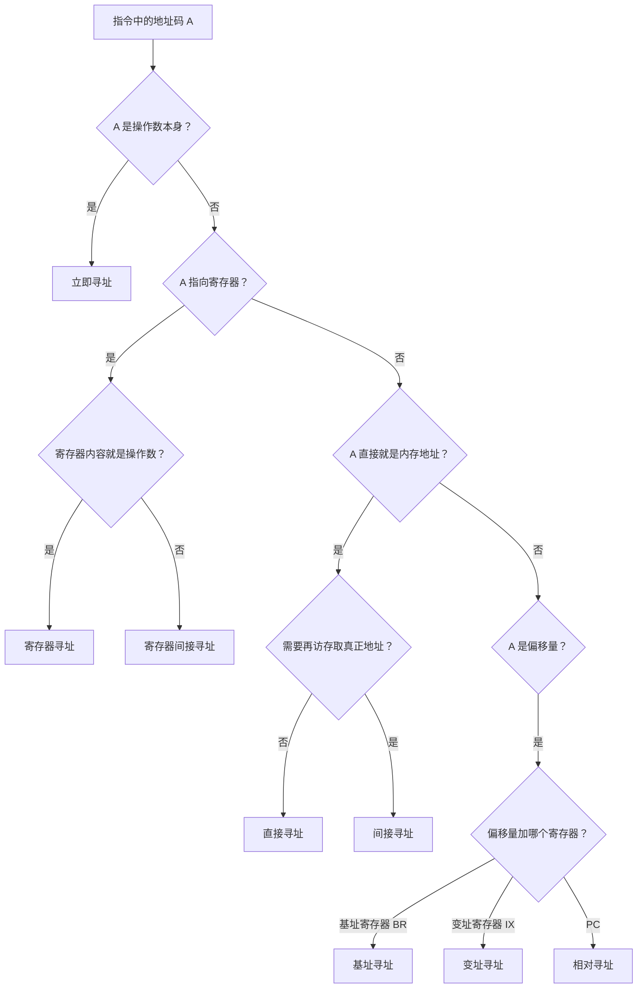

# 第 4 章：指令系统

> 这章主要考选择题，重要度 ⭐⭐⭐。核心就两件事：**寻址方式判断**和**扩展操作码设计**。寻址方式是送分题，但必须记牢每种寻址的有效地址计算方法，考试时看到指令格式能秒判。扩展操作码是固定套路，掌握"短码留空间"的原则就能拿分。整章不需要复杂计算，重在对比记忆。

---

## 4.1 指令格式

### 指令的基本结构

一条指令由**操作码（OP）** 和**地址码**两部分组成：

$$\text{指令} = \text{操作码} + \text{地址码}$$

- **操作码**：指出要做什么操作（加、减、跳转、传送等）
- **地址码**：指出操作数在哪里、结果存到哪里

地址码中可能包含：

- **源操作数地址**：操作数从哪来
- **结果操作数地址**：结果存到哪
- **下一条指令地址**：转移指令用

### 按地址码个数分类

| 类型 | 格式 | 含义 | 适用场景 |
|------|------|------|---------|
| **零地址** | OP | 无操作数（或隐含在栈顶/累加器） | 空操作 NOP、停机 HLT、堆栈计算机的运算 |
| **一地址** | OP, A1 | 一个操作数地址（另一个隐含在 ACC） | 自增 INC、取反 NOT、I/O 指令 |
| **二地址** | OP, A1, A2 | 两个操作数地址（结果存 A1） | 通用寄存器运算（x86 风格） |
| **三地址** | OP, A1, A2, A3 | 两个源操作数 + 一个结果地址 | RISC 指令（如 MIPS） |

> **易错点**：一地址指令中，另一个操作数隐含在**累加器 ACC** 中，结果也写回 ACC。不要误以为只有一个操作数参与运算。例如 `ADD X` 的含义是 `(ACC) + (X) → ACC`。

### 指令字长与地址码

- **指令字长**：一条指令占用的存储单元位数（通常等于机器字长或其整数倍）
- **地址码位数**决定了直接寻址范围： $n$ 位地址码可寻址 $2^n$ 个单元
- 地址码字段可以指向**内存地址**或**寄存器编号**（寄存器编号所需位数少得多）

> 指令字长 = 操作码位数 + 地址码位数 × 地址码个数。这是扩展操作码计算的基础。

---

## 4.2 操作码编码

### 定长操作码

所有指令的操作码位数相同。 $n$ 位操作码最多编码 $2^n$ 条指令。

- 优点：译码简单，硬件实现方便
- 缺点：指令条数受限于操作码位数，地址码空间被压缩

### 扩展操作码（Huffman 思想）

**核心思想**：操作码位数不固定，短操作码为长操作码"留空间"。地址码越多的指令，操作码越短；地址码越少的指令，操作码越长。

> **直觉理解**：把操作码空间想象成一棵树。短操作码占据树的上层节点，它的子树空间留给更长的操作码使用。一旦某个短码被使用，它下面的所有长码组合都不能再用。

**设计原则**：

1. 操作码短的指令先分配（占用高位空间）
2. 每扩展一位，可用编码数翻倍
3. 任何指令的操作码不能是另一条指令操作码的前缀（**前缀码约束**）

**例 1**：某指令系统指令字长 16 位，地址码每个字段 4 位。设计三地址指令 4 条、二地址指令 8 条、一地址指令 16 条，问零地址指令最多几条？

**解**：

指令字长 16 位，地址码字段 4 位，因此：

- 三地址指令：操作码 4 位 + 3 × 4 位地址码 = 16 位
- 二地址指令：操作码 8 位 + 2 × 4 位地址码 = 16 位
- 一地址指令：操作码 12 位 + 1 × 4 位地址码 = 16 位
- 零地址指令：操作码 16 位 = 16 位

逐层计算可用空间：

1. 三地址：4 位操作码共 16 种，用 4 条，剩余 $16 - 4 = 12$ 个前缀可扩展
2. 二地址：扩展到 8 位，可用 $12 \times 16 = 192$ 个，用 8 条，剩余 $192 - 8 = 184$ 个
3. 一地址：扩展到 12 位，可用 $184 \times 16 = 2944$ 个，用 16 条，剩余 $2944 - 16 = 2928$ 个
4. 零地址：扩展到 16 位，可用 $2928 \times 16 = 46848$ 条

> **考试技巧**：扩展操作码题目的套路是逐层计算"剩余前缀数 × 扩展倍数"。记住公式：下一层可用数 = (本层总数 - 本层已用数) × $2^{\text{扩展位数}}$ 。本题中每次扩展 4 位，所以倍数是 $2^4 = 16$ 。

---

## 4.3 寻址方式（408 高频）

### 核心概念

- **有效地址（EA）**：操作数在主存中的实际地址
- **形式地址（A）**：指令地址码字段中给出的地址
- **寻址方式**：从形式地址 A 到有效地址 EA 的映射规则

> 寻址方式的本质就是回答一个问题：**指令里给的地址码 A，到底怎么找到真正的操作数？** 不同寻址方式就是不同的"找法"。

### 寻址方式对比大表

| 寻址方式 | 有效地址 EA | 访存次数 | 特点 |
|---------|------------|---------|------|
| **立即寻址** | 无（A 就是操作数） | 0 | 速度最快，操作数范围受 A 位数限制 |
| **直接寻址** | EA = A | 1 | 简单直观，寻址范围受 A 位数限制 |
| **间接寻址** | EA = (A) | ≥2 | 扩大寻址范围，便于程序修改，速度慢 |
| **寄存器寻址** | EA = Ri（寄存器编号） | 0 | 速度快，寄存器数量有限 |
| **寄存器间接寻址** | EA = (Ri) | 1 | 比内存间接寻址快（少一次访存） |
| **基址寻址** | EA = (BR) + A | 1 | 面向系统，程序重定位，BR 由 OS 管理 |
| **变址寻址** | EA = (IX) + A | 1 | 面向用户，循环/数组访问，IX 用户可改 |
| **相对寻址** | EA = (PC) + A | 1 | 用于转移指令，实现程序浮动 |

### 各寻址方式详解

**立即寻址**：地址码字段直接给出操作数本身，不需要访存。

- 例：`MOV R1, #5` → 操作数就是 5，直接送入 R1
- 限制：操作数大小受地址码字段位数限制

**直接寻址**：地址码字段就是操作数的内存地址，访存一次取操作数。

- 例：`LOAD R1, [200]` → 访问内存 200 号单元，取出操作数

**间接寻址**：地址码字段给出的是"地址的地址"。先访存取到真正地址，再访存取操作数。

- 一次间接：EA = (A)，访存 2 次（第一次取地址，第二次取操作数）
- 多次间接：(A) 的内容最高位为 1 表示还要继续间接，直到最高位为 0
- 优点：扩大寻址范围（A 只有 8 位也能访问整个内存）；便于修改操作数地址
- 缺点：每多一次间接就多一次访存，速度最慢

**寄存器寻址**：地址码给出寄存器编号，操作数就在寄存器中，不访存。

- 例：`ADD R1, R2` → 操作数在 R2 中，速度最快

**寄存器间接寻址**：寄存器中存的是操作数的内存地址，需要访存一次。

- 例：`LOAD R1, (R2)` → R2 中存的是地址，访问该地址取操作数
- 比内存间接寻址快：省去了第一次访存（取地址）

**基址寻址**：EA = (基址寄存器 BR) + 偏移量 A。

- BR 由操作系统在程序加载时设定，运行中**不可修改**
- 用途：多道程序环境下，每个程序分配不同基址，实现**程序重定位**
- 偏移量 A 通常较短（如 8 位有符号数）

**变址寻址**：EA = (变址寄存器 IX) + 偏移量 A。

- IX 由用户程序控制，循环中**自动递增/递减**
- 用途：数组遍历、循环处理（A 是数组首地址，IX 是下标偏移）

**相对寻址**：EA = (PC) + 偏移量 A。

- 用于**转移指令**（JMP、BEQ 等）
- PC 是取完当前指令后的值（已指向下一条指令）
- 用途：实现**程序浮动**（程序加载到内存任意位置都能正确跳转）

> **关键区分**：基址、变址、相对三种寻址的公式形式相同（都是寄存器 + 偏移），但用途和管理者不同：
> - **基址**：BR 由系统管理，面向程序重定位
> - **变址**：IX 由用户控制，面向循环/数组
> - **相对**：PC 自动变化，面向转移指令

### 数值计算示例

设指令字中地址码字段 A = 200，主存地址 200 单元内容为 300，寄存器 R1 = 400，(400) = 500，PC = 100（取指后），基址寄存器 BR = 1000，变址寄存器 IX = 50。

| 寻址方式 | 计算过程 | EA | 操作数 |
|---------|---------|-----|--------|
| 立即寻址 | 操作数 = A = 200 | — | 200 |
| 直接寻址 | EA = A = 200 | 200 | (200) = 300 |
| 间接寻址 | EA = (A) = (200) = 300 | 300 | (300) |
| 寄存器寻址 | 操作数 = (R1) = 400 | — | 400 |
| 寄存器间接寻址 | EA = (R1) = 400 | 400 | (400) = 500 |
| 基址寻址 | EA = (BR) + A = 1000 + 200 | 1200 | (1200) |
| 变址寻址 | EA = (IX) + A = 50 + 200 | 250 | (250) |
| 相对寻址 | EA = (PC) + A = 100 + 200 | 300 | (300) |

> **注意**：相对寻址中 PC 的值是**取完当前指令后**的 PC（即已指向下一条指令），不是当前指令的地址。如果题目说"当前 PC = 100，指令字长 1 个字"，则计算时 PC 应取 101。

### 寻址方式判断流程

### 典型例题

**例 2**：某指令格式为 `OP, Mode, Rn, A`，其中 Mode 为寻址方式字段。若 Mode = 01 表示寄存器间接寻址，Rn = R2，(R2) = 1000，(1000) = 2000，则该指令的有效地址和操作数分别是什么？

**解**：

- 寄存器间接寻址：EA = (Rn) = (R2) = 1000
- 操作数 = (EA) = (1000) = 2000
- 访存 1 次（取操作数）

**例 3**：某转移指令采用相对寻址，指令字长 2 字节，当前 PC = 2000（十进制），地址码字段 A = -5（补码表示），求转移目标地址。

**解**：

- 取完指令后 PC = 2000 + 2 = 2002
- EA = (PC) + A = 2002 + (-5) = 1997
- 转移目标地址为 1997

> **易错点**：相对寻址一定要先更新 PC（加上当前指令字长），再加偏移量。忘记更新 PC 是最常见的丢分原因。

**例 4**：某机指令字长 16 位，采用基址寻址，基址寄存器 BR = 0F00H，指令中偏移量 A = 10H（8 位有符号数），求有效地址。若改为变址寻址，IX = 0020H，有效地址又是多少？

**解**：

- 基址寻址：EA = (BR) + A = 0F00H + 10H = 0F10H
- 变址寻址：EA = (IX) + A = 0020H + 10H = 0030H
- 两者公式相同，但基址寻址得到的是"程序基址 + 局部偏移"（大地址），变址寻址得到的是"数组首址 + 元素偏移"（小地址）

---

## 4.4 指令类型

| 类型 | 功能 | 典型指令 | 备注 |
|------|------|---------|------|
| **数据传送** | 在寄存器/内存/IO 之间搬运数据 | MOV、LOAD、STORE、PUSH、POP | 使用最频繁 |
| **算术逻辑** | 加减乘除、与或非异或、比较 | ADD、SUB、MUL、AND、OR、CMP | 影响标志位 |
| **移位** | 算术移位、逻辑移位、循环移位 | SHL、SHR、SAR、ROL、ROR | 可实现乘除 2 |
| **转移** | 改变程序执行顺序 | JMP、BEQ、BNE、CALL、RET | 用相对/间接寻址 |
| **输入输出** | CPU 与外设交换数据 | IN、OUT | 可独立编址或统一编址 |

> 408 对指令类型的考查很少单独出题，通常作为寻址方式题目的背景出现。了解各类指令的典型助记符即可。

---

## 4.5 CISC 与 RISC

### 对比表

| 对比项 | CISC（复杂指令集） | RISC（精简指令集） |
|--------|-------------------|-------------------|
| **指令数量** | 多（200+） | 少（100 左右） |
| **指令长度** | 不固定（变长） | 固定（通常 32 位） |
| **指令周期** | 不等（1~多个周期） | 单周期（或接近） |
| **寻址方式** | 多样（5~20 种） | 少（仅 Load/Store 访存） |
| **访存操作** | 运算指令可直接访存 | 只有 Load/Store 访存 |
| **寄存器数量** | 较少 | 较多（32 个通用寄存器） |
| **控制方式** | 微程序控制为主 | 硬布线控制为主 |
| **流水线适配** | 差（指令不等长、周期不等） | **好**（规整，易流水） |
| **编译器依赖** | 低（硬件完成复杂操作） | 高（靠编译器优化） |
| **代表** | x86（Intel/AMD） | ARM、MIPS、RISC-V |

### 为什么 RISC 更适合流水线？

1. **指令等长**：取指阶段可以固定节拍，不需要变长译码
2. **单周期执行**：各指令占用流水段时间均匀，减少气泡
3. **Load/Store 结构**：访存集中在固定阶段，减少结构冒险
4. **硬布线控制**：控制信号产生快，不增加额外延迟

> **考试记忆口诀**：RISC = "少、定、快、硬、流水好"——指令少、长度固定、单周期、硬布线、适合流水线。

**例 5**：下列关于 RISC 的叙述中，错误的是（）。

A. RISC 指令长度固定，指令种类少
B. RISC 采用硬布线控制，指令执行速度快
C. RISC 所有指令都可以在一个时钟周期内完成
D. RISC 只有 Load/Store 指令访问存储器

**解**：选 C。RISC 的设计目标是大多数指令单周期完成，但 Load/Store 指令涉及访存，不一定能在一个周期内完成。"所有指令都单周期"的说法过于绝对。A、B、D 均为 RISC 的正确特征描述。

---

## 4.6 本章小结

### 核心要点回顾

1. **指令格式**：操作码 + 地址码；按地址码个数分零/一/二/三地址指令；一地址指令隐含 ACC
2. **扩展操作码**：短码先分配，为长码留空间；前缀码约束；逐层计算剩余空间 × 扩展倍数
3. **寻址方式**：8 种寻址方式的有效地址计算是本章核心，必须做到看到指令格式就能秒判
4. **基址 vs 变址 vs 相对**：公式相同（寄存器 + 偏移），区别在于用哪个寄存器、谁管理、什么用途
5. **CISC vs RISC**：RISC 为流水线而生，指令少、定长、单周期、硬布线、Load/Store 结构

### 考试重点排序

| 优先级 | 考点 | 题型 | 备注 |
|--------|------|------|------|
| ⭐⭐⭐⭐⭐ | 寻址方式判断与 EA 计算 | 选择题 | 几乎每年必考，送分题 |
| ⭐⭐⭐⭐ | 扩展操作码设计 | 选择题 | 固定套路，练 3 道就够 |
| ⭐⭐⭐ | CISC vs RISC 特点 | 选择题 | 记忆为主，注意"过于绝对"的选项 |
| ⭐⭐ | 指令格式分类 | 选择题 | 偶尔出现，注意一地址隐含 ACC |
| ⭐ | 指令类型 | 选择题 | 了解即可 |

> **备考建议**：这章投入产出比很高。寻址方式那张大表打印出来贴墙上，每天看一遍，三天就能做到条件反射。扩展操作码把例 1 的套路吃透，换个数字你也能做。CISC/RISC 记住口诀就行。整章复习时间控制在 2 小时以内。
>
> **与其他章节的关联**：寻址方式在第 5 章（CPU）的指令执行流程中会再次出现——取指阶段用 PC 相对寻址，间址阶段对应间接寻址。扩展操作码的思想在第 5 章微程序控制器中也有体现（微指令编码的垂直型/水平型）。

### 常见陷阱清单

1. **相对寻址的 PC 值**：PC 在取指后已自动 +1（或 +指令字长），计算 EA 时用的是**更新后的 PC**，不是指令本身的地址
2. **间接寻址的访存次数**：一次间接寻址需要**额外 1 次访存**取真正地址；若为多次间接寻址，则更多
3. **基址 vs 变址搞混**：公式相同但寄存器不同——基址寄存器由 OS/系统管理（值大），变址寄存器由用户管理（值小）
4. **扩展操作码的前缀约束**：已分配的短操作码不能是任何长操作码的前缀，否则译码歧义
5. **RISC "所有指令单周期"是错误说法**：Load/Store 涉及访存，不一定单周期完成
6. **一地址指令隐含 ACC**：运算结果默认存回 ACC，不是存回地址码指定的位置
