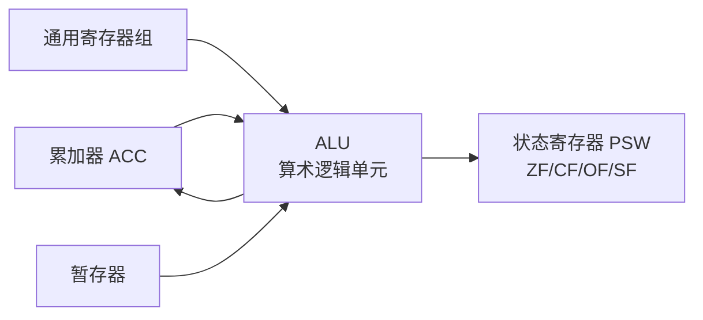
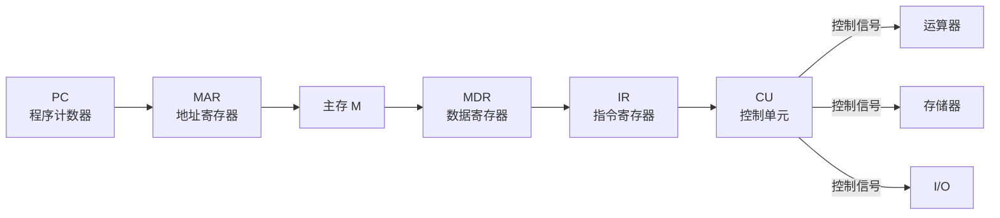
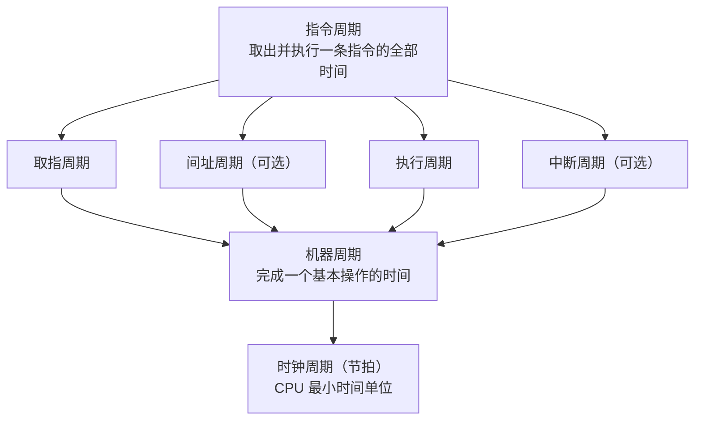
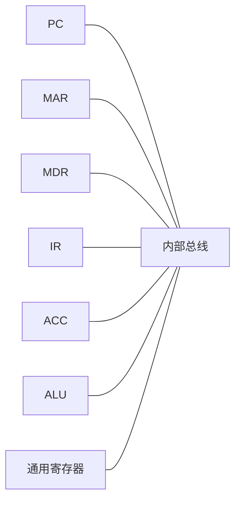
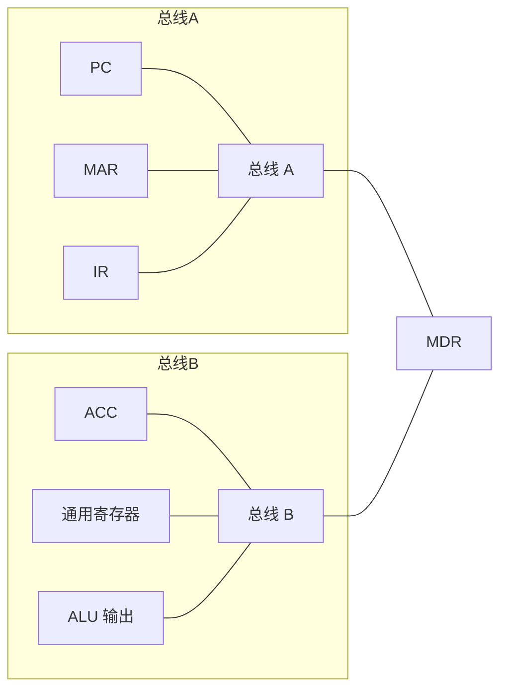
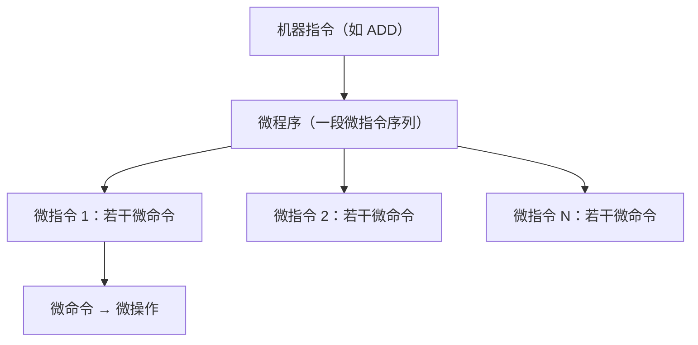

# 第 5 章：中央处理器

> CPU 这章是计组的硬核部分，重要度 ⭐⭐⭐⭐。流水线时空图和冒险分析是综合题标配，必须会画会算。CPU 内部结构（运算器 + 控制器）和指令执行流程是选择题基础，数据通路分析偶尔出现。微程序控制器考选择题记忆为主。整章复习重心：**流水线性能计算 > 冒险分析 > 指令执行数据流 > 微程序控制器**。

---

## 5.1 CPU 的功能与结构

### CPU 的基本功能

CPU 是计算机的"大脑"，核心功能就两个：

1. **取指令**：从内存中取出下一条要执行的指令
2. **执行指令**：对指令进行译码，产生控制信号，完成操作

### 运算器

运算器负责**数据加工**，核心部件：



| 部件 | 功能 | 备注 |
|------|------|------|
| **ALU** | 算术运算（加减乘除）、逻辑运算（与或非异或） | 运算器的核心 |
| **累加器 ACC** | 存放运算的一个操作数和运算结果 | 一地址指令隐含使用 |
| **状态寄存器 PSW** | 记录运算结果状态（零标志 ZF、进位 CF、溢出 OF、符号 SF） | 条件转移指令依赖它 |
| **通用寄存器组** | 暂存操作数和中间结果 | 减少访存次数 |
| **暂存器** | 暂存 ALU 的一个输入 | 配合 ALU 工作 |

### 控制器

控制器负责**指挥协调**，是 CPU 的"指挥中心"：



| 部件 | 全称 | 功能 |
|------|------|------|
| **PC** | Program Counter | 存放**下一条指令**的地址，自动 +1 |
| **IR** | Instruction Register | 存放**当前正在执行**的指令 |
| **MAR** | Memory Address Register | 存放要访问的内存地址 |
| **MDR** | Memory Data Register | 暂存从内存读出/写入的数据 |
| **CU** | Control Unit | 译码指令，产生全部控制信号 |

> **易错点**：PC 存的是"下一条指令"的地址，不是"当前指令"的地址。IR 存的才是当前指令。取指完成后 PC 已经指向下一条了。

---

## 5.2 指令执行过程

### 指令周期的层次关系



- **时钟周期**：CPU 工作的最小时间单位，等于主频的倒数
- **机器周期**：完成一个基本操作（如一次访存）所需时间，包含若干时钟周期
- **指令周期**：取出并执行一条指令的全部时间，包含 1~多个机器周期

> 三者关系：指令周期 > 机器周期 > 时钟周期。一条指令的指令周期由若干机器周期组成，一个机器周期由若干时钟周期（节拍）组成。

### 各阶段数据流

| 阶段 | 数据流 | 完成的操作 |
|------|--------|-----------|
| **取指** | PC → MAR → M → MDR → IR；(PC)+1 → PC | 取出指令，PC 自动加 1 |
| **间址**（可选） | IR(Ad) → MAR → M → MDR | 间接寻址时，取操作数的真正地址 |
| **执行** | 取决于指令类型（见下） | 完成指令规定的操作 |
| **中断**（可选） | PC → M（保存断点）；SP 相关操作 | 响应中断，保存现场，转入中断服务程序 |

**执行阶段数据流举例**：

| 指令类型 | 执行阶段数据流 |
|---------|--------------|
| 取数指令 LOAD | IR(Ad) → MAR → M → MDR → ACC |
| 存数指令 STORE | ACC → MDR → MAR → M |
| 加法指令 ADD | IR(Ad) → MAR → M → MDR → ALU；ACC + MDR → ACC |
| 转移指令 JMP | IR(Ad) → PC |

> **考试重点**：取指阶段的数据流是必记内容。"PC → MAR → M → MDR → IR，(PC)+1 → PC"这条链路几乎每年选择题都涉及。注意 PC+1 和取指是**同时**进行的（PC 送 MAR 的同时，PC 也可以加 1）。

**例 1**：某机采用单总线结构，指令字长等于存储字长。取指阶段需要几个机器周期？若采用间接寻址，取操作数还需要几个机器周期？

**解**：

- 取指阶段：PC → MAR（1 个节拍）→ 访存（1 个机器周期）→ MDR → IR（1 个节拍），共需 **1 个机器周期**（访存是瓶颈）
- 间接寻址取操作数：IR(Ad) → MAR → 访存 → MDR（得到真正地址）→ MAR → 访存 → MDR → ACC，需要 **2 个机器周期**（两次访存）

---

## 5.3 数据通路

### 三种结构对比

| 对比项 | 单总线结构 | 多总线结构 | 专用通路 |
|--------|-----------|-----------|---------|
| **总线数量** | 1 条内部总线 | 2~3 条内部总线 | 无公共总线，点对点连接 |
| **数据传送** | 任意两部件分时共享总线 | 不同总线可并行传送 | 各路径独立，可完全并行 |
| **速度** | 最慢（串行） | 中等 | 最快 |
| **硬件成本** | 最低 | 中等 | 最高（连线多） |
| **控制复杂度** | 简单 | 中等 | 复杂 |
| **典型应用** | 早期简单 CPU | 现代通用 CPU | 高性能流水线 CPU |

### 单总线结构数据通路



> 单总线结构的核心限制：**同一时刻总线上只能有一个数据传送**。所以 ALU 的两个输入不能同时从总线获取，需要暂存器配合。

### 数据流动路径分析

以单总线结构执行 `ADD R1, R2`（R2 + R1 → R1）为例：

1. R2 → 总线 → ALU 输入暂存器
2. R1 → 总线 → ALU 另一输入
3. ALU 完成加法，结果 → 总线 → R1

> 注意：单总线下，ALU 输出不能直接送回总线（会冲突），通常需要经过暂存器或者 ALU 输出直接写入目的寄存器。

### 多总线结构



多总线结构允许**不同总线同时传送数据**，例如总线 A 送地址到 MAR 的同时，总线 B 送操作数到 ALU。这比单总线快，但硬件成本增加。

> 现代 CPU 通常采用多总线 + 部分专用通路的混合结构。408 不要求画具体电路，但要能判断"某操作在单总线下需要几个节拍"。

**例 1.5**：单总线结构 CPU，执行指令 `ADD R1, [X]`（将内存地址 X 处的数据与 R1 相加，结果存回 R1）。列出执行阶段的各节拍数据流。

**解**（执行阶段，假设取指和译码已完成，IR 中已有操作码和地址 X）：

| 节拍 | 数据流 | 说明 |
|------|--------|------|
| T1 | IR(Ad) → MAR | 将地址 X 送 MAR |
| T2 | 1 → R（读命令），M(MAR) → MDR | 发读命令，主存将 X 处数据送 MDR（**访存，占 1 个机器周期**） |
| T3 | R1 → ALU 输入暂存器 | R1 经总线送 ALU 一端（单总线一次只能送一个） |
| T4 | MDR → ALU 另一输入 | 内存数据经总线送 ALU 另一端 |
| T5 | ALU 加法，结果 → R1 | ALU 输出直接写入 R1（不经总线，避免冲突） |

> **要点**：单总线下 ALU 两个输入必须分两个节拍送入（T3、T4），这是单总线结构的固有限制。若为双总线结构，T3 和 T4 可合并为 1 个节拍。

---

## 5.4 指令流水线（408 综合题高频）

### 基本概念

**流水线**：将指令执行过程分解为若干**段（级）**，每段由独立硬件完成，多条指令在不同段上**重叠执行**。

- **段数 k**：流水线的级数（如 5 段：IF、ID、EX、MEM、WB）
- **流水周期 $\Delta t$**：每段的工作时间（取各段中最长时间）
- **吞吐率 TP**：单位时间内完成的指令数
- **加速比 S**：流水线 vs 顺序执行的速度比
- **效率 E**：流水线设备的利用率

### 经典五段流水线

| 段 | 名称 | 功能 |
|----|------|------|
| IF | 取指 | 从内存取指令 |
| ID | 译码 | 指令译码，读寄存器 |
| EX | 执行 | ALU 运算 |
| MEM | 访存 | 访问内存（Load/Store） |
| WB | 写回 | 结果写回寄存器 |

### 时空图

以 5 段流水线执行 4 条指令为例（行 = 段，列 = 时间）：

| 段 \ 时间 | 1 | 2 | 3 | 4 | 5 | 6 | 7 | 8 |
|-----------|---|---|---|---|---|---|---|---|
| IF | I1 | I2 | I3 | I4 | | | | |
| ID | | I1 | I2 | I3 | I4 | | | |
| EX | | | I1 | I2 | I3 | I4 | | |
| MEM | | | | I1 | I2 | I3 | I4 | |
| WB | | | | | I1 | I2 | I3 | I4 |

> 从时空图可以直观看出：第一条指令需要 5 个周期（填满流水线），之后每个周期完成一条。4 条指令总共需要 $5 + 4 - 1 = 8$ 个周期。

### 性能计算公式

设流水线有 $k$ 段，执行 $n$ 条指令，每段时间为 $\Delta t$：

**执行时间**：

$$T_{pipeline} = (k + n - 1) \times \Delta t$$

**顺序执行时间**（每条指令需 $k \times \Delta t$）：

$$T_{sequential} = n \times k \times \Delta t$$

**加速比**：

$$S = \frac{T_{sequential}}{T_{pipeline}} = \frac{n \times k}{k + n - 1}$$

**最大加速比**（ $n \to \infty$ ）： $S_{max} = k$

**吞吐率**：

$$TP = \frac{n}{(k + n - 1) \times \Delta t}$$

**最大吞吐率**： $TP_{max} = \frac{1}{\Delta t}$

**效率**：

$$E = \frac{n}{k + n - 1}$$

> **记忆技巧**： $(k + n - 1)$ 是流水线的核心公式。理解为"第一条指令填满 k 段，之后每条指令只需 1 个周期"。

> **非等长时间段**：若各段耗时不同（如 $\Delta t_1, \Delta t_2, ..., \Delta t_k$ ），则流水周期取最大值 $\Delta t = \max(\Delta t_1, ..., \Delta t_k)$ ，慢段决定整体节奏。顺序时间则为 $n \times \sum_{i=1}^{k} \Delta t_i$ 。

**例 2**：某 5 段流水线，每段耗时均为 2 ns。执行 100 条指令，求：（1）流水线执行时间；（2）加速比；（3）吞吐率；（4）效率。

**解**：

（1）执行时间： $T = (5 + 100 - 1) \times 2 = 104 \times 2 = 208$ ns

（2）顺序执行时间： $T_{seq} = 100 \times 5 \times 2 = 1000$ ns

加速比： $S = 1000 / 208 \approx 4.81$

（3）吞吐率： $TP = 100 / 208 \approx 0.48$ 条/ns $= 480$ 条/μs

（4）效率： $E = 100 / 104 \approx 96.2\%$

> 当 $n$ 足够大时，加速比趋近于段数 $k = 5$ ，效率趋近于 100%。本题 100 条指令已经接近极限。

### 流水线冒险

**冒险（Hazard）**：流水线中多条指令重叠执行时，由于资源、数据或控制依赖导致的冲突。

| 冒险类型 | 原因 | 典型场景 | 解决方法 |
|---------|------|---------|---------|
| **结构冒险** | 多条指令同时需要同一硬件资源 | 单内存同时取指和访存 | 资源复制（分离 I-Cache/D-Cache）、暂停 |
| **数据冒险** | 后续指令需要前面指令尚未产生的结果 | `ADD R1,R2,R3` 后紧跟 `SUB R4,R1,R5` | 转发/旁路、暂停、编译器调度 |
| **控制冒险** | 分支指令导致不确定取哪条指令 | 条件转移、函数调用 | 延迟槽、分支预测、提前计算目标地址 |

### 数据冒险详解

数据冒险的三种类型：

| 类型 | 含义 | 示例 | 是否存在于流水线 |
|------|------|------|----------------|
| **RAW**（写后读） | 后面指令要读的数据，前面指令还没写完 | I1 写 R1，I2 读 R1 | **是**（最常见） |
| **WAR**（读后写） | 后面指令要写的位置，前面指令还没读完 | I1 读 R1，I2 写 R1 | 乱序执行时存在 |
| **WAW**（写后写） | 两条指令写同一位置，顺序不能乱 | I1 写 R1，I2 写 R1 | 乱序执行时存在 |

> 在**顺序流水线**中，只有 **RAW** 是真正的数据冒险。WAR 和 WAW 在乱序执行（超标量）中才会出现。408 主要考 RAW。

### 转发（旁路）机制

**转发（Forwarding/Bypassing）**：将 ALU 的运算结果不经过写回阶段，直接通过旁路送到下一条指令的 ALU 输入端。

以 5 段流水线为例，`ADD R1, R2, R3`（EX 段产生结果）后紧跟 `SUB R4, R1, R5`（需要 R1）：

- **无转发**：SUB 必须等到 ADD 完成 WB（第 5 段），暂停 2 个周期
- **有转发**：ADD 在 EX 段结束时结果就可用，直接旁路给 SUB 的 EX 段，**无需暂停**

> **转发能解决的情况**：前一条指令在 EX 段产生结果，后一条指令在 EX 段需要该结果。
> **转发不能解决的情况**：Load 指令（MEM 段才得到数据），紧跟的指令在 EX 段就需要——必须暂停 1 个周期。

**例 3**：在 5 段流水线中执行以下指令序列，假设采用转发机制：

```
I1: LOAD R1, [R2]      ; R1 ← M[R2]
I2: ADD  R3, R1, R4    ; R3 ← R1 + R4
I3: SUB  R5, R3, R6    ; R5 ← R3 - R6
```

问：（1）无转发需要暂停几个周期？（2）有转发需要暂停几个周期？

**解**：

（1）无转发：每条数据依赖都需要等到 WB 完成。
- I2 依赖 I1 的 R1：I1 在第 4 周期完成 MEM，第 5 周期 WB；I2 在第 3 周期需要 EX → 暂停 2 周期
- I3 依赖 I2 的 R3：同理暂停 2 周期
- 共暂停 **4 个周期**

（2）有转发：
- I1 是 Load 指令，数据在 MEM 段（第 4 周期）才可用，I2 的 EX 在第 3 周期 → 必须暂停 **1 个周期**（Load-Use 冒险）
- I2 的 ADD 结果在 EX 段（第 4 周期）产生，转发给 I3 的 EX → **无需暂停**
- 共暂停 **1 个周期**

> **考试技巧**：Load-Use 冒险是转发无法完全消除的，必须暂停 1 拍。非 Load 的 RAW 冒险（如 ADD 后跟 SUB），转发可以完全消除。这是 408 综合题的经典考法。

### 控制冒险与分支处理

分支指令（如 BEQ）在 EX 或 ID 段才能确定是否跳转，在此之前已经取了指令——可能取错了。

| 处理方法 | 原理 | 代价 |
|---------|------|------|
| **暂停** | 分支结果出来前不取后续指令 | 损失若干周期（简单但慢） |
| **延迟槽** | 分支指令后放一条无论如何都要执行的指令 | 需要编译器配合，MIPS 用 1 个延迟槽 |
| **分支预测** | 预测分支方向，猜错再冲刷流水线 | 猜对无损失，猜错损失 k-1 周期 |

> 408 考法：给定分支指令在流水线中的位置，问"冲刷"了几条指令。答案 = 分支判断点之前已经取出的指令数。

**例 4**：5 段流水线中，条件分支指令在 EX 段末尾确定是否跳转。若分支成功，需要冲刷几条已取出的指令？若采用"总是预测不跳转"策略，分支成功时的惩罚是几个周期？

**解**：

画出 EX 段末尾时刻的流水线状态：

| 周期 | 1 | 2 | 3 |
|------|---|---|---|
| Branch | IF | ID | **EX** |
| I+1 | | IF | ID |
| I+2 | | | IF |

- EX 段末尾（第 3 周期结束）确定跳转，此时 I+1 在 ID 段、I+2 在 IF 段，I+3 **尚未进入流水线**
- 需要冲刷 **2 条**指令（I+1、I+2）
- 惩罚 = **2 个周期**（这 2 条指令白取了）

> 规律：分支判断点越靠后，惩罚越大。若在 ID 段末尾判断（如 MIPS 的 BEQ 在 ID 段比较寄存器），只需冲刷 1 条；若在 MEM 段末尾判断，则需冲刷 3 条。题目要看分支判断在哪一段。

---

## 5.5 控制单元设计

### 硬布线控制器 vs 微程序控制器

| 对比项 | 硬布线控制器 | 微程序控制器 |
|--------|------------|------------|
| **实现方式** | 组合逻辑电路（门电路、触发器） | 微程序存储器（ROM） |
| **设计方法** | 逻辑方程 → 电路 | 编写微指令序列 |
| **速度** | **快**（纯硬件，无访存） | 较慢（每条微指令需访控存） |
| **灵活性** | 差（改指令集要改电路） | **好**（改微程序即可） |
| **规整性** | 不规整，设计复杂 | 规整，易于设计 |
| **适用场景** | RISC（指令少、规整） | CISC（指令多、复杂） |
| **成本** | 指令多时成本高 | 需要控制存储器 |

> **记忆口诀**：硬布线 = "快但不灵活"，微程序 = "灵活但慢"。RISC 用硬布线，CISC 用微程序。

### 微程序控制器基本概念

- **微命令**：控制一个部件完成一个基本操作的信号（最小单位）
- **微操作**：微命令对应的实际动作
- **微指令**：若干微命令的组合，一个时钟周期内执行
- **微程序**：若干微指令的有序集合，对应一条机器指令
- **控制存储器（CM）**：存放微程序的 ROM

**层次关系**：机器指令 → 微程序 → 微指令 → 微命令/微操作



### 微指令编码方式

| 对比项 | 水平型微指令 | 垂直型微指令 |
|--------|------------|------------|
| **微命令编码** | 直接编码（每位代表一个微命令） | 间接编码（类似机器指令操作码） |
| **微指令字长** | **长**（微命令多则很长） | **短**（编码压缩） |
| **并行性** | 高（多个微命令可同时发出） | 低（需译码，一次少量微命令） |
| **速度** | 快（无需译码） | 较慢（需要译码器） |
| **设计难度** | 较难（需考虑微命令兼容性） | 较易（规整） |
| **适用** | 追求速度的场景 | 追求规整、微命令多的场景 |

> **直觉理解**：水平型像"一排开关"，每个开关直接控制一个部件，字长但速度快；垂直型像"机器指令"，用短编码表示操作，需要译码，字短但多一步。

### 微地址形成方式

- **增量方式**：微地址 +1，顺序执行下一条微指令（最常用）
- **下地址字段**：微指令中直接给出下一条微指令的地址（跳转）
- **测试网络**：根据机器指令操作码、状态标志等形成微地址（入口地址）

**例 5**：某微程序控制器采用水平型微指令，微指令字长 32 位，其中操作控制字段 24 位（直接编码），顺序控制字段 8 位。若共有 40 个微命令，问：（1）操作控制字段能否容纳所有微命令？（2）顺序控制字段能寻址多少条微指令？

**解**：

（1）直接编码下，每位对应一个微命令。24 位最多表示 24 个微命令。40 > 24，**不能容纳**。需要扩展字长或改用字段间接编码。

（2）顺序控制字段 8 位，可寻址 $2^8 = 256$ 条微指令。

> 水平型微指令的位数 = 互斥微命令数（同时只能执行一个的分组取最大值）+ 相容微命令数（可同时执行的各占一位）。这是选择题常考的细节。

---

## 5.6 本章小结

### 核心要点回顾

1. **CPU 结构**：运算器（ALU + ACC + PSW）负责数据加工，控制器（PC + IR + MAR + MDR + CU）负责指挥协调
2. **指令执行**：取指（PC → MAR → M → MDR → IR，PC+1）→ 间址（可选）→ 执行 → 中断（可选）
3. **周期关系**：指令周期 > 机器周期 > 时钟周期
4. **数据通路**：单总线（慢、省）、多总线（折中）、专用通路（快、贵）
5. **流水线公式**：执行时间 $(k+n-1) \times \Delta t$ ，加速比 $\frac{nk}{k+n-1}$ ，效率 $\frac{n}{k+n-1}$
6. **三种冒险**：结构（资源冲突）、数据（RAW，转发/暂停）、控制（分支，延迟槽/预测）
7. **控制器设计**：硬布线（快、不灵活、RISC）vs 微程序（灵活、慢、CISC）
8. **微指令编码**：水平型（直接、字长、快）vs 垂直型（间接、字短、需译码）

### 考试重点排序

| 优先级 | 考点 | 题型 | 备注 |
|--------|------|------|------|
| ⭐⭐⭐⭐⭐ | 流水线性能计算（时间、加速比、吞吐率） | 综合题/选择题 | $(k+n-1) \times \Delta t$ 必须秒算 |
| ⭐⭐⭐⭐⭐ | 数据冒险分析（转发/暂停） | 综合题 | Load-Use 暂停 1 拍是经典考法 |
| ⭐⭐⭐⭐ | 指令执行数据流（取指阶段） | 选择题 | PC→MAR→M→MDR→IR 必记 |
| ⭐⭐⭐⭐ | 时空图绘制与分析 | 综合题 | 会画就能做对 |
| ⭐⭐⭐ | 控制冒险与分支惩罚 | 选择题 | 冲刷条数 = 判断点前已取指令数 |
| ⭐⭐⭐ | 微程序控制器基本概念 | 选择题 | 层次关系、水平/垂直对比 |
| ⭐⭐ | CPU 内部结构（运算器/控制器组成） | 选择题 | 各寄存器功能 |
| ⭐⭐ | 数据通路结构对比 | 选择题 | 单总线限制 |

### 常见陷阱清单

| 陷阱 | 正确理解 |
|------|---------|
| 流水线加速比 = 段数 k | 只有 $n \to \infty$ 时才趋近 k，有限条指令时小于 k |
| 转发能消除所有数据冒险 | Load-Use 冒险转发无法消除，必须暂停 1 拍 |
| PC 存当前指令地址 | PC 存**下一条**指令地址，IR 存当前指令 |
| 取指和 PC+1 是串行的 | PC → MAR 和 PC+1 可以**并行**（同一机器周期内） |
| 水平型微指令一定比垂直型好 | 各有适用场景，水平型字长可能过长 |
| 流水线段数越多越好 | 段数多则 $\Delta t$ 受最慢段限制，且冒险惩罚增大 |
| 所有指令的指令周期相同 | 不同指令的指令周期可能不同（复杂指令需要更多机器周期） |

> **备考建议**：流水线是本章绝对核心。把 $(k+n-1) \times \Delta t$ 这个公式刻进脑子里，然后练 5 道时空图题（含转发和 Load-Use），综合题基本就稳了。微程序控制器记住"硬布线 vs 微程序"和"水平 vs 垂直"两张对比表即可，选择题够用了。整章复习建议 3~4 小时，其中流水线占 2 小时。
