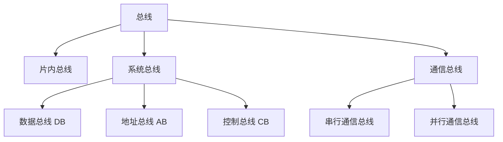
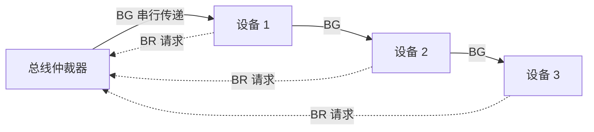

# 第 6 章：总线

> 总线这章分值不高，重要度 ⭐⭐，主要考选择题。核心就三块：**总线带宽计算**（送分题，公式背熟）、**三种集中仲裁方式对比**（链式查询/计数器/独立请求，记住各自优缺点）、**同步与异步定时对比**（异步握手三种互锁是常考点）。整章不需要复杂推导，重在对比记忆，1 小时左右就能搞定。

---

## 6.1 总线的基本概念

### 什么是总线

**总线（Bus）** 是连接多个部件的**公共信息通路**，各部件通过它分时传送信息。

> **直觉理解**：总线就像一条公共马路，所有车辆（数据）共用。同一时刻只能有一辆车占用，所以才需要"仲裁"来决定谁先走；车辆按交通规则通行，所以才需要"定时"来约定怎么走。

总线的核心特征是**共享**和**分时**：

- **共享**：多个设备挂接在同一条总线上
- **分时**：同一时刻只允许一个设备向总线发送数据（多个设备可同时接收）

### 总线的分类

按**所在层次和连接范围**，总线分为三类：

| 类别 | 位置 | 连接对象 | 特点 |
|------|------|---------|------|
| **片内总线** | 芯片内部 | CPU 内部各寄存器、ALU 之间 | 速度最快，距离最短 |
| **系统总线** | 主板级 | CPU、主存、I/O 接口之间 | 计算机内部主干，本章重点 |
| **通信总线** | 设备之间/计算机之间 | 计算机与外设、计算机与计算机 | 距离远，分串行/并行 |

> **易错点**：系统总线是"计算机内部"各功能部件之间的总线；通信总线用于"计算机之间"或"计算机与外部设备之间"。别把 USB 当成系统总线——USB 属于通信总线。

### 系统总线的三类

系统总线按**传送内容**分为数据总线、地址总线、控制总线：

| 类别 | 缩写 | 传送内容 | 方向 | 位数决定 |
|------|------|---------|------|---------|
| **数据总线** | DB | 数据、指令 | **双向** | 一次并行传送的数据位数（机器字长） |
| **地址总线** | AB | 内存/IO 端口地址 | **单向**（由总线主设备（CPU 或 DMAC）指向内存/IO 端口） | 寻址范围， $n$ 位可寻址 $2^n$ 个单元 |
| **控制总线** | CB | 控制信号、状态信号 | 每条线方向固定，整体**双向** | 控制功能的多少 |

> **关键区分**：数据总线是**双向**的（既能读也能写），地址总线是**单向**的（地址只能由总线主设备（CPU 或 DMAC）发出）。选择题常考"哪种总线是双向的"，答案是数据总线。控制总线中每一根线方向固定，但作为一个整体有入有出，所以说整体双向。

### 总线性能指标

衡量总线性能的几个核心指标：

- **总线宽度**：一次能并行传送的数据位数（单位 bit），通常等于数据总线的根数
- **总线频率**：总线的工作时钟频率（单位 Hz）
- **总线带宽**：单位时间内总线上传送的数据量，是**最重要的指标**

总线带宽的基本计算公式：

$$ 总线带宽 = 总线宽度 \times 总线频率 $$

> **单位换算陷阱**：公式算出来的单位是 **bit/s**，而题目通常要求 **B/s** 或 **MB/s**，记得除以 8（1 Byte = 8 bit）。这是带宽计算题最常见的丢分点。

**例 1**：某总线的数据线为 32 根，工作频率为 100 MHz，每个时钟周期传送一次数据，求总线带宽。

**解**：

- 总线宽度 = 32 bit，总线频率 = 100 MHz
- 带宽 = $32 \times 100$ MHz = 3200 Mbit/s
- 换算为字节： $3200 \div 8 = 400$ MB/s

> 注意先按 bit 算，再除以 8 换成 Byte。如果题目问的是 MB/s 而你答了 3200，就白白丢分。

**例 2**：某总线在一个总线周期内并行传送 8 字节数据，总线周期为 20 ns，求总线带宽。

**解**：

- 每个总线周期传送 8 B，周期 = 20 ns
- 带宽 = $8 \div (20 \times 10^{-9})$ B/s = $4 \times 10^8$ B/s = 400 MB/s
- 也可先求频率： $f = 1 \div 20$ ns = 50 MHz，宽度 8 B = 64 bit，带宽 = $64 \times 50 \div 8$ = 400 MB/s

> 两种算法等价。题目给"总线周期"就用周期算，给"频率"就用频率算，本质都是"单位时间传多少数据"。

**例 3**：某总线时钟频率 100 MHz，数据宽度 8 B，支持突发（burst）传输，突发长度为 8（一个突发事务 = 1 个地址周期 + 8 个数据周期）。求突发方式传送 64 B 数据的带宽，并与非突发方式（每个字都要 1 个地址周期 + 1 个数据周期）对比。

**解**：

- 总线时钟周期 = $1 / 100$ MHz = 10 ns
- 突发方式：一个突发事务 = 1 + 8 = 9 个周期 = 90 ns，传送 $8 \times 8 = 64$ B
  - 带宽 = $64 / (90 \times 10^{-9})$ B/s $\approx 711$ MB/s
- 非突发方式：每个字要 2 个周期，8 个字共 16 个周期 = 160 ns
  - 带宽 = $64 / (160 \times 10^{-9})$ B/s = 400 MB/s

> 点评：突发传输只发一次地址，随后连续送出多个数据，把地址阶段的开销摊薄了——突发长度越大，带宽提升越明显。做题记住：一个突发事务 = 1 个地址周期 + 突发长度个数据周期。

---

## 6.2 总线仲裁

### 为什么需要仲裁

总线是共享的，同一时刻只能有一个主设备占用。当多个设备**同时**请求使用总线时，必须由**总线仲裁器**决定把总线使用权交给谁，这就是**总线仲裁**。

按仲裁器的位置，分为**集中式仲裁**和**分布式仲裁**两大类。

### 集中式仲裁的三种方式

集中式仲裁由一个**中央仲裁器**统一裁决，常见三种：

| 方式 | 工作原理 | 优点 | 缺点 | 适用场景 |
|------|---------|------|------|---------|
| **链式查询** | 授权信号 BG 沿设备**串行**逐个传递，离仲裁器近的设备优先 | 线路少、结构简单、易扩充设备 | 优先级固定，靠后的设备可能"饿死"；对电路故障敏感 | 设备数少、优先级固定的场合 |
| **计数器定时** | 仲裁器内计数器循环计数，计数到谁谁获得总线 | 优先级循环变化，较公平 | 优先级不可灵活调整 | 各设备优先级相近的场合 |
| **独立请求** | 每个设备有**独立**的请求线 BR 和授权线 BG，仲裁器直接裁决 | 速度快、优先级灵活可变 | 线路多（每设备 2 根线）、硬件成本高 | 设备数少、要求高速灵活的场合 |

链式查询的授权信号串行传递示意：

> **记忆口诀**：链式查询"省线但偏心"（优先级固定、易饿死）；独立请求"快但费线"（每设备两根线）；计数器"折中循环"。考试最爱考三者的优缺点对比，尤其是"哪种方式优先级可灵活改变"——答案是**独立请求**。

### 分布式仲裁

分布式仲裁**没有中央仲裁器**，每个设备都有自己的仲裁逻辑，各设备通过总线上的竞争信号自行裁决。

- 优点：可靠性高（无单点故障）、便于扩充
- 缺点：控制逻辑分散、设计复杂
- 408 中了解概念即可，很少单独出题

---

## 6.3 总线定时

**总线定时**指总线上传输信息时各信号的**时间配合关系**，即"请求方和响应方如何约定何时发、何时收"。分为同步定时和异步定时。

### 同步定时

所有设备由**统一的时钟信号**控制，在固定的时钟节拍上完成传输，传输时间固定。

- 优点：速度快、控制简单
- 缺点：灵活性差，必须迁就**最慢**的设备；时钟频率受总线长度限制

### 异步定时（握手协议）

没有统一时钟，靠**请求（Request）和应答（Acknowledge）** 两根信号线"握手"协调，传输时间不固定，由设备实际速度决定。

- 优点：灵活，能适应速度差异大的设备
- 缺点：速度较慢、控制较复杂

### 同步 vs 异步对比

| 对比项 | 同步定时 | 异步定时 |
|--------|---------|---------|
| **时钟** | 统一时钟 | 无统一时钟，靠握手信号 |
| **传输时间** | 固定 | 不固定，按实际速度 |
| **速度** | 快 | 较慢 |
| **灵活性** | 差（迁就最慢设备） | 好（适应不同速度设备） |
| **控制复杂度** | 简单 | 复杂 |
| **适用** | 速度相近的设备 | 速度差异大的设备 |

> **考试记忆**：同步 = "快但死板"，异步 = "慢但灵活"。看到"各设备速度差异大"就选异步，看到"高速、定时"就选同步。

### 异步握手的三种互锁方式

按请求和应答信号之间**是否互相制约、制约到什么程度**，分为三种：

| 方式 | 请求信号 | 应答信号 | 特点 |
|------|---------|---------|------|
| **不互锁** | 发出后定时自动撤销，不等应答 | 发出后定时自动撤销 | 双方各自定时，无制约，最快但不可靠 |
| **半互锁** | 等应答到达后才撤销 | 定时自动撤销，不等请求撤销 | 请求受应答制约，应答不受制约 |
| **全互锁** | 等应答到达后才撤销 | 等请求撤销后才撤销 | 完全互相制约，最可靠也最慢 |

> **直觉理解**：把握手想象成"打电话"。不互锁 = 各说各的，不管对方听没听到；半互锁 = 我等你"喂"一声才挂，但你不用等我确认；全互锁 = 我等你回应才挂，你也要等我挂了才挂，双方都确认到位。互锁程度越高越可靠，但传输越慢。

> **易错点**：区分"半互锁"和"全互锁"的关键看**应答信号**——半互锁的应答是定时自动撤销，全互锁的应答要等请求撤销后才撤销。选择题常在这里设坑。

---

## 6.4 总线标准

总线标准是总线的技术规范，408 只需了解两个常见的：

| 标准 | 类型 | 特点 |
|------|------|------|
| **PCI** | 系统总线（并行） | 高性能局部总线，支持即插即用，曾广泛用于主板扩展槽 |
| **USB** | 通信总线（串行） | 通用串行总线，支持热插拔、即插即用，可连接多种外设 |

> 这部分了解即可，偶尔以"以下哪个是串行总线""USB 支持热插拔吗"的形式出选择题。记住 **PCI 是并行系统总线、USB 是串行通信总线**就够了。

---

## 6.5 本章小结

### 核心要点回顾

1. **总线分类**：片内总线（芯片内）、系统总线（计算机内主干）、通信总线（设备/计算机之间）；USB 属于通信总线
2. **系统总线三类**：数据总线（双向）、地址总线（单向，位数定寻址范围）、控制总线（整体双向）
3. **总线带宽**：带宽 = 宽度 × 频率，算出 bit/s 后记得除以 8 换成 B/s
4. **集中仲裁三种**：链式查询（省线、优先级固定易饿死）、计数器定时（循环公平）、独立请求（快、优先级灵活但费线）
5. **总线定时**：同步（统一时钟、快但死板）vs 异步（握手、慢但灵活）；异步握手分不互锁、半互锁、全互锁，互锁程度越高越可靠越慢

### 考试重点排序

| 优先级 | 考点 | 题型 | 备注 |
|--------|------|------|------|
| ⭐⭐⭐⭐ | 总线带宽计算 | 选择题 | 送分题，注意 bit 与 Byte 换算 |
| ⭐⭐⭐⭐ | 三种集中仲裁方式对比 | 选择题 | 记优缺点，"优先级灵活"选独立请求 |
| ⭐⭐⭐ | 同步 vs 异步定时 | 选择题 | "速度差异大"选异步 |
| ⭐⭐⭐ | 异步握手三种互锁 | 选择题 | 区分半互锁与全互锁看应答信号 |
| ⭐⭐ | 系统总线三类（DB/AB/CB） | 选择题 | 记方向：数据双向、地址单向 |
| ⭐ | 总线标准（PCI/USB） | 选择题 | 了解即可 |

> **备考建议**：这章投入产出比高，1 小时足够。带宽公式和 bit/Byte 换算练两道题就稳；仲裁和定时那两张对比表打印出来看两遍，记住"谁快谁慢、谁省线谁费线、谁可靠谁灵活"。整章以选择题为主，不会出大题，不用深挖细节。
>
> **与其他章节的关联**：总线带宽和存储器带宽（[第 3 章](03-memory-system.md)）计算思路一致；总线仲裁中"主设备"的概念在[第 5 章（CPU）](05-cpu.md)的总线周期、总线请求中会再次出现；同步/异步定时的思想也贯穿 CPU 与内存、I/O 之间的数据传送。

### 常见陷阱清单

1. **bit 与 Byte 换算**：总线宽度通常给的是 bit（如 64 位），带宽算出来是 bit/s，题目问 B/s 必须除以 8
2. **总线频率 ≠ 主频**：总线有自己独立的时钟频率，不一定等于 CPU 主频
3. **地址总线是单向的**：只有由总线主设备（CPU 或 DMAC）指向内存/设备的方向，不要写成双向
4. **控制总线"整体双向"**：单根控制线是单向的（如读命令是 CPU → 内存），但控制总线作为整体包含双向的信号线
5. **链式查询的优先级是固定的**：离仲裁器近的设备优先级永远最高，不能动态调整；"优先级灵活"选独立请求
6. **半互锁 vs 全互锁**：区别在**应答信号**而非请求信号——半互锁与全互锁的请求信号都是等应答到达后才撤销；半互锁的应答定时自动撤销（不等请求撤销），全互锁的应答要等请求撤销后才撤销

---

## 自测题

1. 总线宽度 32 位、时钟频率 50 MHz，总线带宽是多少 MB/s？
2. 三种集中仲裁方式中，哪种的优先级灵活、可动态调整？
3. 异步握手的三种互锁方式中，区分半互锁与全互锁的关键是哪种信号？
4. 同步定时和异步定时各适用于什么场景？

> **答案**：1. 200 MB/s（ $32 \times 50 = 1600$ Mbit/s，除以 8 得 200 MB/s）；2. 独立请求方式；3. 应答信号（请求信号两者相同；半互锁应答定时自动撤销，全互锁应答要等请求撤销）；4. 同步定时适合速度接近的设备，异步定时适合速度差异大的设备。
