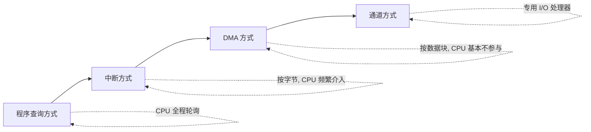
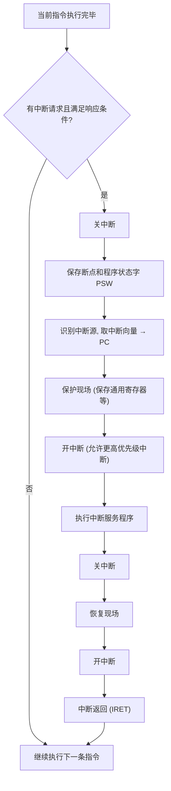

# 第 7 章：输入/输出系统

> I/O 这章偏理解记忆，重要度 ⭐⭐⭐，主要考选择题。**中断和 DMA 的区别是选择题常客**，搞清楚各自的工作方式和适用场景就能拿分。中断部分最核心的是**中断响应条件**、**中断屏蔽字与优先级**、**中断嵌套**，这三个点几乎每年轮换着考。DMA 记住"数据块传输、CPU 基本不参与"这个核心特征，再记牢三种总线交互方式。整章不需要复杂计算，重在对比和判断。

---

## 7.1 I/O 系统概述

### I/O 接口与端口

CPU 和外设之间不能直接相连，中间需要一个**I/O 接口**（I/O 控制器）做缓冲和转换。接口内部包含若干**端口**（Port），每个端口对应一个可寻址的寄存器：

- **数据端口**：暂存输入/输出的数据
- **状态端口**：反映外设状态（如"就绪"、"忙"）
- **控制端口**：接收 CPU 发来的控制命令

> **易错点**：接口 ≠ 端口。接口是一个整体部件，端口是接口内部可单独寻址的寄存器。"端口地址"才是 CPU 实际访问的对象。

### I/O 端口编址方式

CPU 要访问端口，必须先给端口编址。两种编址方式：

| 对比项 | 统一编址（存储器映射） | 独立编址（I/O 映射） |
|--------|----------------------|---------------------|
| **地址空间** | 端口占用内存地址空间的一部分 | 端口有独立的地址空间，与内存分开 |
| **访问指令** | 用普通访存指令（LOAD/STORE） | 用专门的 I/O 指令（IN/OUT） |
| **优点** | 无需专门 I/O 指令，编程灵活 | 不占内存地址空间，I/O 指令短 |
| **缺点** | 占用内存地址空间 | 需要专门的 I/O 指令 |
| **代表** | MIPS、ARM | x86（有独立的 I/O 地址空间） |

> 统一编址下没有专门的 I/O 指令；独立编址下才有 IN/OUT 这类专用指令。选择题常考"哪种编址方式需要专门的 I/O 指令"——答案是**独立编址**。

### I/O 控制方式的演进

随着外设速度提升和 CPU 负担减轻的需求，I/O 控制方式经历了四个阶段，**CPU 的参与度逐步降低**：



> 演进的主线就一句话：**CPU 越来越省事**。程序查询时 CPU 干等；中断时 CPU 可以干别的但每个字节都要被打断；DMA 时一整块数据都不用管；通道方式干脆配了个专门的 I/O 处理器。

---

## 7.2 程序查询方式

### 工作方式

CPU 不断**轮询**外设状态端口，检查外设是否就绪。就绪则传送一个数据，然后继续轮询。整个过程中 CPU 原地等待，什么也干不了。

流程：

1. CPU 读状态端口
2. 判断"就绪"位是否为 1
3. 未就绪 → 回到第 1 步继续查
4. 就绪 → 读/写数据端口，传送一个数据
5. 还有数据 → 回到第 1 步

### 特点

- **优点**：硬件简单，控制容易
- **缺点**：CPU 与外设**串行**工作，CPU 大量时间浪费在等待上，效率极低
- 数据传输以**字节/字**为单位，每一步都要 CPU 参与

> 程序查询方式的核心问题：**CPU 和外设速度严重不匹配**，CPU 被迫干等慢速外设。后面的中断、DMA 都是为了解决这个问题。

---

## 7.3 中断方式（408 高频）

### 中断的概念与分类

**中断**：CPU 暂停当前正在执行的程序，转去处理某个突发事件（中断源），处理完后再返回原程序继续执行。

按中断源位置分类：

| 类型 | 别名 | 来源 | 举例 |
|------|------|------|------|
| **内中断** | 异常、陷入（Trap） | CPU 内部事件 | 除零、溢出、非法指令、缺页、系统调用 |
| **外中断** | 中断（狭义） | CPU 外部设备 | I/O 完成、定时器、电源故障 |

> **易错点**：广义的"中断"包含内中断和外中断；狭义的"中断"仅指外中断。内中断（异常）通常**不可屏蔽**，外中断可以被屏蔽。系统调用（访管指令）属于内中断中的"陷入"。

### 中断向量

- **中断向量**：中断服务程序的入口地址（有的教材还包含程序状态字 PSW）
- **中断向量表**：所有中断向量按中断类型号有序存放的表格，存放在内存固定区域
- **中断类型号**（中断向量号）：标识中断源，用作中断向量表的索引

> 中断响应时，CPU 根据中断类型号查中断向量表，取出服务程序入口地址送入 PC，从而跳转到服务程序。

### 中断响应条件（408 必背）

CPU 不是随时都能响应中断，必须**同时满足**以下条件：

1. **中断允许触发器（IF）为开**（CPU 处于开中断状态）
2. **有中断请求**（某中断源发出了请求且未被屏蔽）
3. **没有更高优先级的中断请求**（当前请求优先级最高）
4. **当前指令执行完毕**（中断在一条指令执行结束时才被响应）

> **关键**：中断响应发生在**一条指令执行完毕之后**，而不是指令执行中途。这保证了指令执行的完整性。但注意——**DMA 请求**的响应可以发生在指令执行周期内的任意时刻（总线周期级别），这是 DMA 和中断的重要区别。

### 中断处理过程



四个核心环节：**保护现场 → 执行服务程序 → 恢复现场 → 中断返回**。

> **断点 vs 现场**：
> - **断点**：被中断程序的下一条指令地址（PC），由硬件自动保存（压栈）
> - **现场**：程序状态字 PSW 和通用寄存器的内容，由中断服务程序用指令保存
>
> 保存断点是硬件做的，保存现场是软件（服务程序）做的——这是常见考点。

### 中断屏蔽字与优先级

- **中断优先级**：每个中断源有一个优先级，高优先级可以打断低优先级的服务程序
- **中断屏蔽字**：一个寄存器，每一位对应一个中断源。某位为 1 表示**屏蔽**该中断源的请求
- 通过设置不同的屏蔽字，可以**动态改变**中断的实际处理优先级（实际优先级 ≠ 硬件排队优先级）

> **核心规律**：某中断源能否被打断，取决于**正在运行的服务程序**的屏蔽字中对应位是否为 0（开放）。屏蔽字里把谁置 1，谁就不能打断当前服务程序。

**例 1**：某系统有 4 个中断源 A、B、C、D，硬件排队优先级为 A > B > C > D。各中断服务程序运行时的屏蔽字如下（1 表示屏蔽）：

| 中断源 | A | B | C | D |
|--------|---|---|---|---|
| A 的屏蔽字 | 1 | 1 | 0 | 0 |
| B 的屏蔽字 | 1 | 1 | 1 | 1 |
| C 的屏蔽字 | 1 | 1 | 1 | 0 |
| D 的屏蔽字 | 1 | 1 | 1 | 1 |

若 A、B、C、D 同时发出请求，求实际的中断响应和处理顺序。

**解**：

第一步确定**响应顺序**（由硬件排队优先级决定，与屏蔽字无关）：A > B > C > D，所以最先响应 A。

第二步用屏蔽字判断**谁能打断谁**。看每个服务程序的屏蔽字中，哪些位是 0（开放）：

- A 的屏蔽字 `1100`：屏蔽 A、B，开放 C、D → C、D 可以打断 A
- B 的屏蔽字 `1111`：全屏蔽 → 谁也打断不了 B
- C 的屏蔽字 `1110`：屏蔽 A、B、C，开放 D → D 可以打断 C
- D 的屏蔽字 `1111`：全屏蔽 → 谁也打断不了 D

同时请求时先响应 A；A 运行中 C、D 可打断它。由于 C、D 同时存在，按硬件优先级 C > D，先响应 C；C 运行中 D 可打断它，于是转去处理 D；D 全屏蔽，处理完返回 C；C 处理完返回 A；A 处理完后，B 才被响应（B 优先级低于 A，且 A 屏蔽了 B）。

**最终处理顺序：A → C → D → C → A → B**（嵌套展开后实际执行序列为 A 被打断去 C，C 被打断去 D，D 返回 C，C 返回 A，A 完成后再处理 B）。

> **解题套路**：① 硬件优先级定"响应先后"；② 屏蔽字中为 0 的位定"谁能打断当前服务程序"；③ 从最先响应的中断开始，逐层判断是否被打断，画出嵌套关系。

### 多重中断（中断嵌套）

CPU 正在执行某个中断服务程序时，如果来了一个**优先级更高**的中断请求，CPU 可以暂停当前服务程序，转去处理更高优先级的中断，处理完再返回——这就是**中断嵌套**。

实现条件：进入服务程序后要**重新开中断**，且新请求优先级更高。

**例 2**：设中断源 A、B、C 的优先级为 A > B > C。主程序运行中，t1 时刻 C 请求，t2 时刻 B 请求，t3 时刻 A 请求（t1 < t2 < t3，且各服务程序尚未执行完）。画出中断处理的时间线。

**解**：


时间线（从左到右）：

```
主程序 ──┬─ C 服务 ─┬─ B 服务 ─┬─ A 服务 ─┬─ B 服务 ─┬─ C 服务 ─┬─ 主程序
         t1         t2         t3        A返回      B返回      C返回
```

> **记忆要点**：中断嵌套像函数调用栈——**后响应的先返回**（先进后出）。高优先级打断低优先级，处理完按相反次序逐层返回，最后回到主程序。

---

## 7.4 DMA 方式（408 高频）

### DMA 的基本概念

**DMA（Direct Memory Access，直接存储器访问）**：在外设和内存之间建立一条直接数据通路，由**DMA 控制器（DMAC）** 控制数据传送，**不需要 CPU 逐字节干预**。CPU 只在传输开始前做预处理、传输结束后做后处理。

> DMA 的核心价值：把 CPU 从**数据块搬运**这种机械劳动中解放出来。CPU 只需"发号施令"和"验收结果"，中间过程由 DMAC 全权负责。

### DMA 传输的三个阶段

1. **预处理**：CPU 设置 DMAC 的寄存器（内存首地址、外设地址、传输字节数、传输方向等），启动 DMA。此阶段 CPU 参与。
2. **数据传输**：DMAC 控制数据在内存和外设之间成块传送，**CPU 基本不参与**（仅占用总线）。
3. **后处理**：传输完成后，DMAC 向 CPU 发**中断**，CPU 做收尾工作（如校验、通知进程）。此阶段 CPU 参与。

> **注意**：DMA 传输结束后是通过**中断**通知 CPU 的。所以 DMA 并没有完全脱离中断——它只是把"每个字节都中断"变成了"一整块结束才中断一次"。

### DMA 与 CPU 的三种总线交互方式

DMA 传输要访问内存，而 CPU 也要访问内存，两者共享总线，必须协调。三种方式：

| 方式 | 工作方式 | CPU 影响 | 适用场景 |
|------|---------|---------|---------|
| **停止 CPU 访问**（独占） | DMA 传输期间 CPU 完全让出总线，停止访存 | CPU 完全不能工作，影响最大 | 高速成块传输 |
| **周期挪用**（周期窃取） | DMA 每传一个字，挪用（窃取）一个或几个**存取周期**，CPU 短暂让出总线 | CPU 仅在个别周期被短暂挂起，影响较小 | 最常用 |
| **交替访问** | 总线周期分成两段，一段给 CPU、一段给 DMA，交替使用 | CPU 和 DMA 交替工作，无需总线仲裁 | 存取周期足够分时 |

> **易错点**：
> - "停止 CPU 访问"是**整块传输期间** CPU 都不能访存；"周期挪用"是**每个字**挪用一两个周期，CPU 大部分时间还能工作。
> - 周期挪用对 CPU 影响小，是实际系统中最常用的方式。
> - 交替访问不需要总线仲裁，但要求存取周期能分成两段。

### DMA vs 中断

| 对比项 | 中断方式 | DMA 方式 |
|--------|---------|---------|
| **传输单位** | 字节/字（每传一个都要中断） | **数据块**（成块传输） |
| **CPU 介入** | 每个字节都要 CPU 执行服务程序 | 仅预处理和后处理，传输中 CPU 不参与 |
| **响应时机** | 一条指令执行完毕 | 总线周期级别，可在指令周期内任意时刻 |
| **数据通路** | 经过 CPU（寄存器中转） | 外设 ↔ 内存直接通路，不经过 CPU |
| **优先级** | 低于 DMA | 高于中断（DMA 请求优先于中断请求） |
| **适用设备** | 低速、少量数据 | 高速、大批量数据（磁盘、网卡） |

> **一句话区分**：中断是"按字节、CPU 频繁介入"；DMA 是"按数据块、CPU 基本不参与"。看到"磁盘等高速设备成块传输"→ DMA；看到"键盘等低速设备少量数据"→ 中断。

---

## 7.5 通道方式

### 通道的基本概念

**通道（Channel）**：一种**专用的 I/O 处理器**，有自己的指令系统（通道指令），能独立执行由通道指令组成的**通道程序**，控制外设与内存之间的数据交换。

> 通道是 DMA 的进一步发展。DMA 传一块数据要 CPU 设置一次；通道可以执行一整段通道程序，管理多台外设，CPU 的参与度更低。通道主要出现在大型机中。

### 通道程序与通道命令字

- **通道命令字（CCW，Channel Command Word）**：通道指令，规定通道执行的操作（读/写、设备地址、内存地址、传输字节数等）
- **通道程序**：由若干条 CCW 组成，存放在内存中，由通道取出并执行
- CPU 只需把通道程序的首地址告诉通道，启动通道后便可去干别的，通道独立执行完整个程序

### 通道的三种类型

| 类型 | 工作方式 | 连接设备 | 特点 |
|------|---------|---------|------|
| **字节多路通道** | 以字节为单位交叉传输，分时为多台设备服务 | 多台**低速**设备（终端、打印机） | 设备多、速度慢，靠分时提高利用率 |
| **数组多路通道** | 以数据块为单位，多台设备分时成块传输 | 多台**中高速**设备 | 结合了多路和成块传输的优点 |
| **选择通道** | 一段时间只为一台设备独占服务，成块传完再换下一台 | 单台**高速**设备（磁盘） | 传输率高，但设备独占、利用率低 |

> **记忆口诀**：
> - **字节多路**：多设备 + 低速 + 按字节交叉
> - **数组多路**：多设备 + 中高速 + 按块交叉
> - **选择通道**：单设备独占 + 高速 + 按块

---

## 7.6 四种 I/O 控制方式对比与 OS 关联

### 四种方式综合对比

| 对比项 | 程序查询 | 中断 | DMA | 通道 |
|--------|---------|------|-----|------|
| **CPU 参与度** | 全程参与（轮询） | 每字节介入 | 仅预处理/后处理 | 仅启动/结束 |
| **传输单位** | 字节/字 | 字节/字 | **数据块** | 数据块/一组块 |
| **CPU 与外设关系** | 串行 | 并行（可干别的） | 基本并行 | 完全并行 |
| **数据通路** | 经 CPU | 经 CPU | 外设↔内存直达 | 通道控制直达 |
| **控制者** | CPU | CPU | DMAC | 通道（I/O 处理器） |
| **硬件成本** | 最低 | 较低 | 较高 | 最高 |
| **适用场景** | 简单/嵌入式 | 低速少量数据 | 高速成块数据 | 大型机、多设备管理 |
| **效率** | 最低 | 较低 | 高 | 最高 |

> 从左到右，**CPU 负担递减、硬件成本递增、传输效率递增**。考试常考"哪种方式 CPU 效率最高""哪种方式以数据块为单位传输"——前者是通道，后者是 DMA 和通道。

### I/O 与操作系统的关联

从用户程序发起 I/O 到完成，软硬件协同的完整链路：


- **系统调用**：用户程序通过访管指令（内中断/陷入）进入内核态，请求 I/O
- **设备驱动**：OS 中的驱动程序设置 I/O 控制器寄存器，启动设备
- **中断/DMA**：实际数据传输由中断或 DMA 完成，结束后通过中断通知 OS
- OS 唤醒等待的进程，I/O 完成

> 这条链路把第 7 章（I/O 硬件）和操作系统（设备管理、中断处理）串了起来。408 的计组和 OS 经常在这里交叉出题：计组考"硬件怎么传"，OS 考"软件怎么管"。

---

## 本章小结

### 核心要点回顾

1. **端口编址**：统一编址用普通访存指令；独立编址用专门 I/O 指令（IN/OUT）
2. **控制方式演进**：程序查询 → 中断 → DMA → 通道，CPU 负担递减
3. **中断响应条件**（必背）：开中断 + 有请求 + 无更高优先级 + 当前指令执行完毕
4. **中断处理**：保护现场 → 执行服务程序 → 恢复现场 → 中断返回；断点由硬件存，现场由软件存
5. **中断屏蔽字**：屏蔽字中为 0 的位对应中断源可打断当前服务程序；可动态改变实际优先级
6. **中断嵌套**：高优先级打断低优先级，后响应先返回（先进后出）
7. **DMA 三阶段**：预处理 → 数据传输 → 后处理；传输结束用中断通知 CPU
8. **DMA 三种总线交互**：停止 CPU、周期挪用（最常用）、交替访问
9. **DMA vs 中断**：数据块 vs 字节；CPU 基本不参与 vs 频繁介入
10. **通道三类型**：字节多路（低速多设备）、数组多路（中高速多设备）、选择通道（高速单设备独占）

### 考试重点排序

| 优先级 | 考点 | 题型 | 备注 |
|--------|------|------|------|
| ⭐⭐⭐⭐⭐ | 中断响应条件 | 选择题 | 几乎必考，四个条件缺一不可 |
| ⭐⭐⭐⭐⭐ | 中断屏蔽字与优先级判断 | 选择题 | 给屏蔽字判断响应/处理顺序，必练 |
| ⭐⭐⭐⭐ | 中断嵌套时间线 | 选择题 | 画嵌套关系，后响应先返回 |
| ⭐⭐⭐⭐ | DMA vs 中断 | 选择题 | 数据块 vs 字节是核心区分点 |
| ⭐⭐⭐ | DMA 三种总线交互方式 | 选择题 | 周期挪用最常用 |
| ⭐⭐⭐ | 四种控制方式综合对比 | 选择题 | 传输单位、CPU 参与度 |
| ⭐⭐ | 端口编址方式 | 选择题 | 独立编址需专门 I/O 指令 |
| ⭐⭐ | 通道三种类型 | 选择题 | 按设备速度和数量区分 |
| ⭐ | I/O 与 OS 关联 | 选择题 | 了解链路即可 |

> **备考建议**：这章的核心就是中断和 DMA。中断屏蔽字判断处理顺序（例 1）和中断嵌套时间线（例 2）是固定套路，把这两道例题吃透，换个中断源名字和屏蔽字你照样能做。DMA 抓住"数据块、CPU 基本不参与、结束发中断"三个关键词。四种方式的大对比表和通道三类型表格打印出来，考前看两遍即可。整章复习时间控制在 2 小时以内。
>
> **与其他章节的关联**：中断响应条件中"当前指令执行完毕"对应第 5 章（CPU）的指令执行流程；DMA 的总线交互对应第 3 章（存储系统）的总线结构；I/O 与 OS 的关联则是操作系统"设备管理"和"中断处理"章节的硬件基础。

### 常见陷阱清单

1. **中断响应 ≠ 中断处理**：响应是硬件自动完成的（保存断点、关中断、转服务程序入口），处理是软件执行的（保护现场、服务、恢复现场）
2. **断点由硬件保存，现场由软件保存**：PC 和 PSW 由中断隐指令（硬件）压栈；通用寄存器由中断服务程序（软件）压栈
3. **中断屏蔽字中 0 表示"可被打断"**：不是 1！屏蔽字某位为 1 表示屏蔽（不可打断），为 0 表示允许打断
4. **DMA 传输结束用中断通知 CPU**：DMA 不是完全不需要中断，只是传输过程中不需要，结束后仍需中断通知
5. **DMA 的"预处理"由 CPU 完成**：设置 DMAC 的源地址、目的地址、传输长度等，这一步是 CPU 做的
6. **周期挪用 vs 停止 CPU**：周期挪用只在 DMA 需要访存的那个周期让出总线，其余周期 CPU 正常工作；停止 CPU 是整个数据块传输期间 CPU 都不能访存
7. **统一编址不需要专门 I/O 指令**：用普通的 LOAD/STORE 即可访问 I/O 端口；独立编址才需要 IN/OUT
