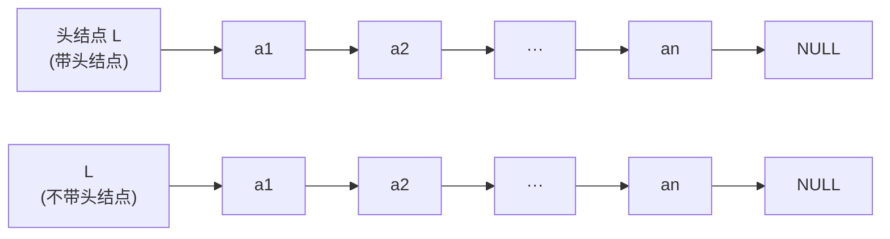

# 第 2 章：线性表

> 本章是 408 算法设计题（第 41 题，13 分）的**第一主战场**——链表逆置、合并两个有序链表、删除特定值结点、双指针找中点/倒数第 k 个，这些几乎轮流出现在历年真题中。选择题部分主要考顺序表插入/删除的平均移动次数、带头结点与不带头结点的差异。本章重要度 ⭐⭐⭐⭐，建议花 6-8 小时：先理解结构，再**逐段手写**每一段代码（只看不写 = 白学）。学习前提是 [C 语言第 3 章（结构体与动态内存）](../../../programming-languages/c/doc/03-struct-memory-408.md) 中的 typedef、结构体指针与 malloc/free。

> **代码约定**：正文代码采用 408 通用写法（王道/严蔚敏风格），使用 `bool` 与 C++ 引用 `&`（按 C++ 编译）。纯 C 环境只需把 `bool` 换成 `int`、把形参 `LinkList &L` 换成 `LinkList *L`（调用处传 `&L`）。典型例题部分给出了可直接编译运行的完整程序。

---

## 2.1 线性表的定义与基本操作

**线性表**（Linear List）是具有**相同数据类型**的 n（ n >= 0 ）个数据元素的**有限序列**，其中 n 为表长， n=0 时称为**空表**。记作：

$$ L = (a_1, a_2, \cdots, a_i, a_{i+1}, \cdots, a_n) $$

除第一个元素 $a_1$ 外，每个元素有且仅有一个**直接前驱**；除最后一个元素 $a_n$ 外，每个元素有且仅有一个**直接后继**。这是线性结构的核心特征——"一对一"关系，与[第 1 章（绪论）](01-introduction.md)中线性结构的概念完全对应。

> 易错点：线性表强调**逻辑相邻**，至于物理上是否连续存储并不关心——这正是顺序表（物理连续）与链表（物理离散）并存的根本原因。

### 2.1.1 基本操作

线性表的操作是"逻辑层面的定义"，与存储结构无关。408 要求的六大基本操作：

| 操作 | 函数签名 | 功能说明 |
|------|---------|---------|
| 初始化 | `InitList(&L)` | 构造一个空的线性表 L |
| 求表长 | `Length(L)` | 返回表中元素个数 |
| 按值查找 | `LocateElem(L, e)` | 返回第一个值与 e 相等的元素的位置，不存在返回 0 |
| 按位查找 | `GetElem(L, i)` | 返回第 i 个位置的元素值，i 越界时报错 |
| 插入 | `ListInsert(&L, i, e)` | 在 L 的第 i 个位置插入新元素 e，表长加一 |
| 删除 | `ListDelete(&L, i, &e)` | 删除第 i 个位置元素，用 e 返回其值，表长减一 |

> 注意带 `&` 的参数：凡是要**修改表本身**（初始化、插入、删除）的操作都要传引用；只读查询（求长、查找）不修改表，直接传值即可。后面会看到，链表里"修改头指针"也必须用引用或二级指针。

---

## 2.2 顺序表

**顺序表**是线性表的顺序存储结构：用**一段地址连续的存储单元**依次存放数据元素，逻辑上相邻的元素物理位置也相邻。因此元素下标与存储位置存在确定的关系，可**随机访问**。

### 2.2.1 静态分配与动态分配

**静态分配**：用定长数组存储，表长一经分配不可改变，空间满了就无法插入：

```c
#define MaxSize 50            // 表的最大容量

typedef int ElemType;         // 元素类型统一别名，换类型只改这一行

typedef struct {
    ElemType data[MaxSize];   // 用静态数组存放数据元素
    int length;               // 当前表长（元素个数）
} SqList;                     // Sq = Sequential（顺序）

// 初始化：只要把表长置 0 即可
void InitList(SqList &L) {
    L.length = 0;
}
```

> 静态分配的致命缺点：`MaxSize` 定死。小了会溢出，大了浪费空间，且**无法扩容**。工程中更常用动态分配。

**动态分配**：用 `malloc` 在堆上申请数组，表长（容量）可随时扩充——这就是动态数组的思路：

```c
#include <stdlib.h>

#define InitSize 100          // 初始容量

typedef struct {
    ElemType *data;           // 指向动态数组首地址的指针
    int MaxSize;              // 当前最大容量
    int length;               // 当前表长
} SeqList;

// 初始化：申请一块连续空间，data 指向它
void InitList(SeqList &L) {
    L.data = (ElemType *)malloc(InitSize * sizeof(ElemType));
    if (L.data == NULL) return;      // 申请失败保护
    L.MaxSize = InitSize;
    L.length = 0;
}

// 扩容：申请更大的新数组，把旧数据复制过去（等价于 realloc）
void IncreaseSize(SeqList &L, int len) {
    ElemType *p = L.data;                        // 先记住旧数组
    L.data = (ElemType *)malloc((L.MaxSize + len) * sizeof(ElemType));
    for (int i = 0; i < L.length; i++)
        L.data[i] = p[i];                        // 数据搬到新数组
    L.MaxSize += len;
    free(p);                                     // 释放旧空间
}
```

> 动态分配后"最大容量"由 `MaxSize` 记录，不再依赖数组本身的大小——这是动态顺序表与静态顺序表代码上唯一的本质差别，其余操作（插入/删除/查找）完全一致。
>
> 注意 `malloc` 可能失败返回 NULL，严谨的代码要判空；`realloc` 是"申请新空间 + 拷贝 + 释放旧空间"一步到位的函数，理解上面 `IncreaseSize` 的手写过程即理解了 realloc 的原理。

### 2.2.2 随机访问与插入/删除的效率分析（408 必考推导）

**随机访问**：要取第 i 个元素（下标 $i-1$ ），直接计算地址

$$ \text{Loc}(a_i) = \text{Loc}(a_1) + (i - 1) \times \text{sizeof}(ElemType) $$

不需要遍历，故**按位查找时间复杂度 $O(1)$**——这是顺序表对比链表的决定性优势。

**插入的平均移动次数推导**：在表长为 $n$ 的顺序表中插入一个元素，合法的插入位置有 $n+1$ 个（位置 $1 \sim n+1$ ），设每个位置等概率，均为 $\frac{1}{n+1}$ 。若插入在位置 $i$ ，需要把 $a_i \sim a_n$ 共 $n-i+1$ 个元素依次后移。平均移动次数：

$$ \text{ASL} = \sum_{i=1}^{n+1} \frac{1}{n+1}(n-i+1) = \frac{1}{n+1} \cdot \frac{n(n+1)}{2} = \frac{n}{2} $$

**删除的平均移动次数推导**：合法的删除位置有 $n$ 个（位置 $1 \sim n$ ），每个概率 $\frac{1}{n}$ 。删除位置 $i$ 的元素需把 $a_{i+1} \sim a_n$ 共 $n-i$ 个元素前移：

$$ \text{ASL} = \sum_{i=1}^{n} \frac{1}{n}(n-i) = \frac{n-1}{2} \approx \frac{n}{2} $$

**时间复杂度结论**（记忆重点）：

| 操作 | 最好 | 最坏 | 平均 |
|------|------|------|------|
| 插入 | $O(1)$ （表尾插入，不移动） | $O(n)$ （表头插入，移 $n$ 个） | $O(n)$ （平均移 $\frac{n}{2}$ 个） |
| 删除 | $O(1)$ （表尾删除） | $O(n)$ （表头删除，移 $n-1$ 个） | $O(n)$ （平均移 $\frac{n-1}{2}$ 个） |
| 按位查找 | $O(1)$ | $O(1)$ | $O(1)$ |
| 按值查找 | $O(1)$ （第一个就命中） | $O(n)$ | $O(n)$ |

> 高频陷阱：**插入的分母是 $n+1$**（有 $n+1$ 个插入位置），**删除的分母是 $n$**（只有 $n$ 个删除位置）。选择题里"平均移动 $n/2$ 个"是对插入说的，删除严格说是 $(n-1)/2$ 个，出题人常在分母上做文章。

### 2.2.3 顺序表基本操作完整代码

```c
#include <stdio.h>
#include <stdbool.h>          // bool、true、false

#define MaxSize 50

typedef int ElemType;

typedef struct {
    ElemType data[MaxSize];
    int length;
} SqList;

void InitList(SqList &L) {
    L.length = 0;
}

// 插入：在位置 i（1 <= i <= L.length+1）插入 e
bool ListInsert(SqList &L, int i, ElemType e) {
    if (i < 1 || i > L.length + 1) return false;  // ① i 越界
    if (L.length == MaxSize)          return false;  // ② 表已满
    for (int j = L.length; j >= i; j--)  // ③ 从最后一个元素开始
        L.data[j] = L.data[j - 1];          //    依次后移一位
    L.data[i - 1] = e;                       // ④ 空出的位置写入 e
    L.length++;                              // ⑤ 表长加一
    return true;
}

// 删除：删除位置 i 的元素，用 e 返回其值
bool ListDelete(SqList &L, int i, ElemType &e) {
    if (i < 1 || i > L.length) return false;   // ① i 越界
    e = L.data[i - 1];                         // ② 取出被删元素
    for (int j = i; j < L.length; j++)         // ③ 从第 i 个元素起
        L.data[j - 1] = L.data[j];             //    依次前移一位
    L.length--;                                // ④ 表长减一
    return true;
}

// 按值查找：返回第一个值为 e 的元素下标（0 基），不存在返回 -1
// 注意：王道教材约定返回"位序"（1 基、不存在返回 0），两种约定考试都要看得懂
int LocateElem(SqList L, ElemType e) {
    for (int i = 0; i < L.length; i++)
        if (L.data[i] == e)
            return i;
    return -1;
}

// 按位查找：返回第 i 个元素的值（1 基），i 越界返回 -1
ElemType GetElem(SqList L, int i) {
    if (i < 1 || i > L.length) return -1;
    return L.data[i - 1];
}

int Length(SqList L) {
    return L.length;
}
```

> 易错点：**删除后必须 `L.length--`，插入后必须 `L.length++`**，漏掉就是经典的"幽灵元素"bug。另外移动方向不能错——插入必须**从后往前**移（否则后面元素被前面覆盖），删除必须**从前往后**移（否则前面元素被后面覆盖）。

---

## 2.3 单链表

**单链表**是线性表的链式存储：通过指针把各结点"串"起来，逻辑相邻的结点**物理位置可以任意**。每个结点由数据域 `data` 和指针域 `next`（指向后继）组成。

### 2.3.1 类型定义

```c
typedef int ElemType;

typedef struct LNode {        // 单链表结点
    ElemType data;            // 数据域
    struct LNode *next;       // 指针域：指向后继结点
} LNode, *LinkList;
```

`LNode` 是结点类型，`LinkList` 是"指向结点的指针"类型。同一个指针既能写 `LNode *p` 也能写 `LinkList p`——习惯上，强调"某结点"时用 `LNode *p`，强调"整条链表"时用 `LinkList L`。typedef 的逐行解读见 [C 语言第 3 章](../../../programming-languages/c/doc/03-struct-memory-408.md)。

### 2.3.2 带头结点 vs 不带头结点（408 高频选择题）

为了统一对"第一个数据结点"的操作，可以在第一个数据结点之前附加一个**头结点**（`data` 域空闲，`next` 指向第一个数据结点）。两者差异直接决定代码写法：



| 对比项 | 带头结点 | 不带头结点 |
|--------|---------|-----------|
| 空表判断 | `L->next == NULL` | `L == NULL` |
| 第一个数据结点 | `L->next` | `L` 本身 |
| 表头插入/删除 | 与普通位置代码相同，**无需修改头指针** | 需修改头指针 L，形参必须用引用/二级指针 |
| 删除第一个结点 | 不需特判 | 需特判"删除的是首结点" |
| 遍历 | 从 `L->next` 开始，代码统一 | 从 `L` 开始 |
| 头结点的含义 | 头结点不是数据结点，是"哨兵" | 无头结点，L 就是首结点指针 |

> 408 默认**带头结点**（严蔚敏/王道教材均如此）。考试若题目未明确，先声明"我采用带头结点写法"。不带头的写法核心难点：**对表头操作要改头指针本身**，C++ 用引用 `LinkList &L`，纯 C 用二级指针 `LinkList *L`，否则头指针修改传不回调用方。

### 2.3.3 建表：头插法与尾插法（必须手写熟练）

**头插法**：每个新结点都插到头结点之后。优点是代码短，缺点是**建出的链表与原输入顺序相反**：

```c
// 头插法建表：输入以 9999 结束，返回带头结点的单链表
LinkList List_HeadInsert(LinkList &L) {
    L = (LNode *)malloc(sizeof(LNode));   // 创建头结点
    L->next = NULL;                       // 初始为空表（重要！）
    ElemType x;
    scanf("%d", &x);
    while (x != 9999) {                   // 输入 9999 表示结束
        LNode *s = (LNode *)malloc(sizeof(LNode));
        s->data = x;
        s->next = L->next;                // ① 新结点指向原首结点
        L->next = s;                      // ② 头结点指向新结点
        scanf("%d", &x);
    }
    return L;
}
```

**尾插法**：新结点接在表尾，用**尾指针 `r`** 始终指向当前尾结点，保证每次插入是 $O(1)$ 而不是从头遍历。建出的链表与原输入**顺序一致**：

```c
// 尾插法建表：输入以 9999 结束，返回带头结点的单链表
LinkList List_TailInsert(LinkList &L) {
    L = (LNode *)malloc(sizeof(LNode));
    LNode *s, *r = L;                     // r 始终指向尾结点（初始为头结点）
    ElemType x;
    scanf("%d", &x);
    while (x != 9999) {
        s = (LNode *)malloc(sizeof(LNode));
        s->data = x;
        r->next = s;                      // ① 尾结点接上新结点
        r = s;                            // ② r 后移，指向新的尾结点
        scanf("%d", &x);
    }
    r->next = NULL;                       // 尾结点的 next 置空
    return L;
}
```

> 两个细节：头插法里 `L->next = NULL` 必须写在循环前（否则尾结点指针悬空，逆置类题目也靠这一招）；尾插法循环结束后**必须** `r->next = NULL` 封尾。两法时间复杂度都是 $O(n)$ （每个结点处理 $O(1)$ ）。408 算法题常利用"头插法 = 逆序"的性质原地逆置链表，见 2.8.1。

### 2.3.4 查找、插入、删除

单链表**不支持随机访问**，定位第 $i$ 个结点必须从头遍历，故按位查找是 $O(n)$ ：

```c
// 按序号查找：返回第 i 个数据结点（1 基），i 越界/超出表长返回 NULL
LNode *GetElem(LinkList L, int i) {
    if (i < 1) return NULL;
    LNode *p = L->next;       // p 指向第一个数据结点
    int j = 1;                // 计数器
    while (p != NULL && j < i) {   // 向后找，直到 p 为空或找到第 i 个
        p = p->next;
        j++;
    }
    return p;
}

// 按值查找：返回第一个 data == e 的结点，不存在返回 NULL
LNode *LocateElem(LinkList L, ElemType e) {
    LNode *p = L->next;
    while (p != NULL && p->data != e)
        p = p->next;
    return p;
}

// 求表长
int Length(LinkList L) {
    int len = 0;
    LNode *p = L->next;
    while (p != NULL) {
        len++;
        p = p->next;
    }
    return len;
}
```

**后插**（在已知结点 p 之后插入）：核心两步，**顺序不能反**：

```c
// 后插：在结点 p 之后插入值为 e 的新结点
bool InsertNextNode(LNode *p, ElemType e) {
    if (p == NULL) return false;
    LNode *s = (LNode *)malloc(sizeof(LNode));
    if (s == NULL) return false;
    s->data = e;
    s->next = p->next;        // ① 先让新结点接上 p 的后继（防止断链丢结点）
    p->next = s;              // ② 再让 p 指向新结点
    return true;
}

// 按位插入：在第 i 个位置插入 e（先找到第 i-1 个结点作为前驱）
bool ListInsert(LinkList &L, int i, ElemType e) {
    if (i < 1) return false;
    LNode *p = GetElem(L, i - 1);   // 找前驱结点（i=1 时就是头结点）
    return InsertNextNode(p, e);    // p 为空说明 i 越界
}
```

**按位删除**（删除第 $i$ 个结点）：本质是"删除前驱结点的后继"，同样要先找前驱：

```c
// 删除 p 的后继结点（单链表删除的本质操作）
bool DeleteNextNode(LNode *p) {
    if (p == NULL || p->next == NULL) return false;  // p 是尾结点则无可删
    LNode *q = p->next;            // ① 先用 q 保存待删结点
    p->next = q->next;             // ② 让 p 跨过 q 直接指向 q 的后继
    free(q);                       // ③ 释放 q 的空间
    return true;
}

// 按位删除：删除第 i 个结点，用 e 返回其值
bool ListDelete(LinkList &L, int i, ElemType &e) {
    if (i < 1) return false;
    LNode *p = GetElem(L, i - 1);                  // 找前驱
    if (p == NULL || p->next == NULL) return false;
    LNode *q = p->next;
    e = q->data;                   // 先取值
    p->next = q->next;
    free(q);
    return true;
}
```

> 本节所有操作的时间复杂度都在"**定位**"这一步：插入/删除都是 $O(n)$ （因为找前驱要遍历），但**已知前驱结点时**插入/删除只是改指针， $O(1)$ 。另外注意单链表**没有前驱指针**，所以"删除第 i 个"必须先找到第 $i-1$ 个——这是与双链表的本质区别。

---

## 2.4 双链表

单链表只能单向走，"找前驱"必须从头遍历。双链表给每个结点再加一个**前驱指针 `prior`**，前插/删除都不再依赖前驱查找：

```c
typedef struct DNode {
    ElemType data;              // 数据域
    struct DNode *prior, *next; // 前驱指针、后继指针
} DNode, *DLinkList;
```

### 2.4.1 双链表的插入（在结点 p 之后插入 s，共 4 步连接）

```c
// 在结点 p 之后插入结点 s（4 步连接，顺序有讲究）
bool InsertNextDNode(DNode *p, DNode *s) {
    if (p == NULL || s == NULL) return false;
    s->next = p->next;               // ① s 的后继 = p 的原后继
    s->prior = p;                    // ② s 的前驱 = p
    if (p->next != NULL)             // ③ p 不是尾结点时才需要
        p->next->prior = s;          //    p 原后继的前驱改为 s
    p->next = s;                     // ④ p 的后继改为 s
    return true;
}
```

> 4 步连接的正确顺序：**先处理新结点 s 的两个指针（① ②），再处理 p 的后继（③），最后改 p（④）**。其中 ③ 必须判断 `p->next != NULL`——若 p 是尾结点，`p->next` 为空，`p->next->prior` 会空指针崩溃。若在**双向循环链表**中插入则无需此判断（尾结点的 next 指向头结点，永不为空）。

### 2.4.2 双链表的删除（删除 p 的后继结点 q）

```c
// 删除结点 p 的后继结点 q
bool DeleteNextDNode(DNode *p) {
    if (p == NULL || p->next == NULL) return false;   // p 无后继可删
    DNode *q = p->next;               // ① 保存待删结点
    p->next = q->next;                // ② 让 p 跨过 q
    if (q->next != NULL)              // ③ q 不是尾结点时
        q->next->prior = p;           //    q 的后继的前驱改为 p
    free(q);                          // ④ 释放 q
    return true;
}
```

> 对比记忆：单链表插入"**先接新结点、再改旧指针**"（两步）；双链表插入"**先连 s 自身、再连 p 及其后继**"（四步）。口诀：**先连新结点，后改旧链接；改旧链接时"先断前、后接后"**——本质是保证任何时候都不会因为先断链而丢失结点。

---

## 2.5 循环链表

**循环单链表**：尾结点的 `next` 不再指向 NULL，而是**指向头结点**。整条链形成环：

```c
// 循环单链表与单链表类型定义完全一样
typedef struct LNode {
    ElemType data;
    struct LNode *next;
} LNode, *LinkList;

// 循环单链表判空：L->next == L（头结点指向自己）
bool Empty(LinkList L) {
    return L->next == L;
}
```

| 特点 | 说明 |
|------|------|
| 空表判断 | 从 `L->next == NULL` 变为 `L->next == L` |
| 遍历终止条件 | 从 `p != NULL` 变为 `p != L`（回到头结点即结束） |
| 从任一结点出发 | 可访问全表（单链表从中间结点出发只能看后半段） |
| 常用**尾指针**表示 | 设表尾指针 r，则 `r->next == L`；在表头插入 $O(1)$ 、表尾插入 $O(1)$ ，而仅带头指针时表尾插入要 $O(n)$ |

**循环双链表**：头结点的 `prior` 指向尾结点，尾结点的 `next` 指向头结点。判空条件：

```c
bool Empty(DLinkList L) {
    return L->next == L && L->prior == L;
}
```

> 循环双链表的额外好处：任意结点 p 的 `p->prior` 就是其前驱，插入/删除**不需要判断 p 是否为尾结点**（`p->next` 永远非空）。判断"某结点 p 是否为表尾结点"：单链表看 `p->next == NULL`，循环链表看 `p->next == L`。

---

## 2.6 静态链表（了解）

用**数组**模拟链表：数组下标代替指针（游标），每个元素存 `data` 和 `next`（下一结点的数组下标）。适合早期不支持指针的语言（如 BASIC/Fortran），408 只要求理解，不要求手写操作：

```c
#define MaxSize 100

typedef struct {
    ElemType data;   // 数据域
    int next;        // 游标：下一个结点的数组下标
} SLinkList[MaxSize];   // 直接分配一个长度为 MaxSize 的结点数组
```

| 约定 | 说明 |
|------|------|
| 下标 0 的结点 | 充当"头结点"，`next` 指向第一个数据结点 |
| 表尾结点 | `next == -1`（相当于单链表的 NULL） |
| 特点 | 插入/删除只改游标不移动元素（同链表），但**不能随机访问**且容量固定（同数组） |
| 适用场景 | 文件系统空闲块链、哈希表链地址法（用数组下标做"指针"） |

> 静态链表本质是"用数组实现的链式结构"，选择题容易考它与顺序表、链表的异同：**它的插入删除不需要移动元素（像链表），但不能动态扩容、不能随机访问（像数组）**。

---

## 2.7 顺序表 vs 链表：综合对比（408 选择题必考）

| 对比项 | 顺序表 | 链表 |
|--------|--------|------|
| 存取方式 | **随机存取**，按位查找 $O(1)$ | **顺序存取**，按位查找 $O(n)$ |
| 逻辑相邻 | 靠物理位置相邻表示 | 靠指针显式表示 |
| 插入/删除 | 需移动元素，平均移 $\frac{n}{2}$ 个， $O(n)$ | 已知位置只需改指针 $O(1)$ ，但**找位置**仍 $O(n)$ |
| 空间分配 | 静态：固定；动态：可扩容但需搬移 | 按需申请，灵活，无浪费 |
| 存储密度 | 高（无指针开销） | 低（每个结点多一个指针域） |
| 空间代价 | 可能浪费（预分配过大）或溢出 | 指针域额外开销，但空间利用率动态匹配 |
| 适用场景 | 查找多、规模稳定、插入删除少 | 插入删除频繁、规模动态变化 |
| 典型应用 | 二分查找（必须随机存取）、静态数据库 | 内存管理、文件系统、图的邻接表 |

> 高频考法：问"哪个操作上顺序表一定优于链表？"——**按位查找**（ $O(1)$ vs $O(n)$ ）；"链表一定优于顺序表？"——**已知位置处的插入/删除**（ $O(1)$ vs $O(n)$ ）。注意选择题常给"在链表中插入是 $O(1)$"这种说法——**前提是已知插入位置/前驱结点**，若给的是位序 i 仍需先遍历，仍是 $O(n)$ ，这题特别容易错。

---

## 2.8 408 算法设计题高频专题

算法设计题的标准作答格式是**三问**：① 设计思想；② 算法代码；③ 时空复杂度分析。以下 6 个专题是真题常客，代码均针对**带头结点**的单链表。

### 2.8.1 链表原地逆置（头插法， $O(n)$ 时间、 $O(1)$ 空间）

**设计思想**：利用"头插法建表结果逆序"的性质。把原链表从头结点处断开，然后依次摘下每个数据结点，用头插法重新插入到头结点之后，原链表的先后顺序自然被反转。

```c
// 将带头结点的单链表 L 原地逆置（不允许申请新的结点空间）
void Reverse(LinkList &L) {
    LNode *p = L->next, *q;      // p 指向第一个待处理的数据结点
    L->next = NULL;              // ① 头结点单独摘下，链表先"拆空"
    while (p != NULL) {          // ② 依次摘下原链表的每个结点
        q = p->next;             //    先保存后继，否则断链丢失
        p->next = L->next;       //    ③ 头插：新结点指向当前首结点
        L->next = p;             //    头结点指向新结点
        p = q;                   //    ④ 继续处理原链表的下一个结点
    }
}
```

**复杂度**：单趟扫描每个结点一次，时间 $O(n)$ ；只用了 p、q 两个辅助指针，空间 $O(1)$ （原地工作）。

> 本题是"断链丢结点"陷阱的典型教材：第 ③ 步若直接 `p->next = L->next` 而不先 `q = p->next` 保存后继，p 后面的整段链表就找不回来了。

### 2.8.2 合并两个有序链表（带头结点归并， $O(n)$ ）

**设计思想**：设两个指针分别指向两表的第一个数据结点，比较 `data`，较小者摘下接到结果表尾（用尾指针 r 记录），直到某表为空，再把另一表的剩余部分整体接上。结果表沿用 A 的头结点，不另开空间。

```c
// 将递增有序链表 A、B 合并为递增有序链表 C（沿用 A 的头结点）
LinkList MergeList(LinkList A, LinkList B) {
    LNode *pa = A->next, *pb = B->next;   // 分别指向两表首结点
    LinkList C = A;                       // 复用 A 的头结点作为 C 的头结点
    LNode *r = C;                         // r 始终指向 C 的尾结点
    while (pa != NULL && pb != NULL) {    // 两表都非空时取较小者
        if (pa->data <= pb->data) {
            r->next = pa;
            pa = pa->next;
        } else {
            r->next = pb;
            pb = pb->next;
        }
        r = r->next;                      // 尾指针后移
    }
    r->next = (pa != NULL) ? pa : pb;     // 剩余部分整体挂上
    free(B);                              // 释放 B 的头结点
    return C;
}
```

**复杂度**：两表各扫一遍，时间 $O(n+m)$ （表长分别为 n、m 时）；只用了常数个指针，空间 $O(1)$ 。

> 变式题："合并成**递减**有序表"——只需把归并方向反过来（结果用头插法插入），仍是 $O(n)$ 。"把链表 B 合并进 A"——改一下参数与返回值即可。408 原题（如 2011 年"查找两个有序序列的中位数"）也是这个归并思路的变形。

### 2.8.3 删除所有值为 x 的结点（前驱指针 pre 遍历， $O(n)$ ）

**设计思想**：设置前驱指针 `pre` 和当前指针 `p`，从头到尾扫描；`p` 的值等于 x 时，用 pre 跨过它并释放；否则 pre、p 同步后移。关键：**删除后 pre 不动**，p 改为原后继。

```c
// 删除带头结点单链表 L 中所有值为 x 的结点
void Delete_x(LinkList &L, ElemType x) {
    LNode *pre = L, *p = L->next;   // pre 始终是 p 的前驱
    while (p != NULL) {
        if (p->data == x) {
            pre->next = p->next;    // ① 前驱跨过 p
            free(p);                // ② 释放 p
            p = pre->next;          // ③ p 指向新后继，pre 保持不动
        } else {
            pre = p;                // 值不等，pre、p 同步后移
            p = p->next;
        }
    }
}
```

**复杂度**：单趟扫描，时间 $O(n)$ ；空间 $O(1)$ 。

> 递归写法（王道课后题也认可）：`void Delete_x(LinkList &L, ElemType x)` 递归处理，但**递归深度为 n，空间 $O(n)$**，若题目要求"尽可能高效"应选迭代版。另外注意：若链表**不带头结点**，删除首结点时 pre 无法指向它——这正是带头结点写法统一性的体现。

### 2.8.4 删除倒数第 k 个结点（快慢指针，fast 先走 k 步， $O(n)$ ）

**设计思想**：双指针。fast 先从头往后走 k 步；然后 fast 与 pre（从**头结点**出发）同步每次走一步。当 fast 走到 NULL 时，pre 恰好停在倒数第 k+1 个结点（即倒数第 k 个结点的前驱），跨过并释放即可。一趟完成，不需要先数表长。

```c
// 删除带头结点单链表 L 中倒数第 k 个结点，成功返回 true
bool DeleteLastK(LinkList &L, int k) {
    if (k <= 0) return false;
    LNode *fast = L->next, *pre = L;   // pre 初始指向头结点
    int i = 0;
    for (; i < k && fast != NULL; i++) // ① fast 先走 k 步
        fast = fast->next;
    if (i < k) return false;           // ② k 大于表长，不存在倒数第 k 个
    while (fast != NULL) {             // ③ fast 与 pre 同步走
        fast = fast->next;
        pre = pre->next;
    }
    LNode *q = pre->next;              // ④ pre 是倒数第 k 个的前驱
    pre->next = q->next;
    free(q);
    return true;
}
```

**复杂度**：fast 先走 k 步、再与 pre 合走 $n-k$ 步，合计约 $n$ 步，时间 $O(n)$ ；空间 $O(1)$ 。

> 正确性验证：设表长 n。fast 先走 k 步后指向第 $k+1$ 个数据结点（k=n 时正好为 NULL）。随后 fast 还需走 $n-k$ 步到 NULL，pre 同步走 $n-k$ 步，从"头结点（第 0 位）"到达第 $n-k$ 位，正是倒数第 $k$ 个结点（第 $n-k+1$ 位）的前驱。若表长不足 k，for 循环提前因 fast 为空退出，`i < k` 兜底返回 false。

### 2.8.5 找链表中点（快慢指针，fast 每次走 2 步， $O(n)$ ）

**设计思想**：快指针 fast 每次走 2 步，慢指针 slow 每次走 1 步，二者同时从头出发。fast 到达表尾时，slow 正好走到中间位置。**只扫描一遍**，而朴素做法需要"先数长度、再走一半"共两遍。

```c
// 返回带头结点单链表 L 的中间结点
// 奇数个结点返回正中间；偶数个结点返回第 n/2+1 个（偏右的一个）
LNode *FindMid(LinkList L) {
    if (L->next == NULL) return NULL;      // 空表
    LNode *fast = L->next, *slow = L->next;
    while (fast != NULL && fast->next != NULL) {
        fast = fast->next->next;           // fast 走 2 步
        slow = slow->next;                 // slow 走 1 步
    }
    return slow;
}
```

**复杂度**：fast 走约 $\frac{n}{2}$ 步即到表尾，时间 $O(n)$ ；空间 $O(1)$ 。

> 循环条件 `fast != NULL && fast->next != NULL` 两个都要判：奇数个结点时 fast 最后落在尾结点，偶数个时会直接跳到 NULL，漏判任何一个都越界。若想"偶数个时返回偏左的一个"，把循环条件改为 `fast->next != NULL && fast->next->next != NULL` 即可。快慢指针的思想可泛化：找倒数第 k 个（先走 k 步，见 2.8.4）、判断链表是否有环（快慢相遇）。

### 2.8.6 有序表去重（相邻元素比较， $O(n)$ ）

**设计思想**：链表递增有序，则**重复元素必然相邻**。扫描时只需比较当前结点与后继：相等就删掉后继（保持当前结点不动继续比），不等则当前指针后移。

```c
// 删除递增有序带头结点单链表 L 中的重复元素（保留一个）
void DeleteDuplicate(LinkList &L) {
    LNode *p = L->next;                     // p 指向当前结点
    while (p != NULL && p->next != NULL) {
        if (p->data == p->next->data) {     // 相邻元素相等 → 删除后继
            LNode *q = p->next;
            p->next = q->next;
            free(q);
            // p 不动：新后继可能仍然重复
        } else {
            p = p->next;                    // 不等 → 继续向后
        }
    }
}
```

**复杂度**：每个结点至多被比较、删除一次，时间 $O(n)$ ；空间 $O(1)$ 。

> 变式："删除无序链表中的重复元素"就不能用相邻比较了（重复元素不相邻），需要哈希表或双重循环 $O(n^2)$——**"有序"这个前提直接决定了算法能否做到 $O(n)$**，这也是为什么"把无序变有序"（排序）本身是另一个大考点。

---

## 2.9 典型例题

**例 1**（顺序表删除指定区间，双下标覆盖法）：设计一个高效的算法，从顺序表 L 中删除所有值在 $[s, t]$ （ $s < t$ ）之间的元素，要求时间 $O(n)$ 、空间 $O(1)$ 。给出完整可运行程序。

**解**：

（1）设计思想：设置"覆盖游标" k 作为新表的写入位置，一趟扫描：凡是不在 $[s, t]$ 内的元素，就覆盖写入 `data[k]` 并让 k 自增；在区间内的元素直接跳过（被后面的保留元素覆盖掉）。扫描结束后把表长改为 k。每个元素只处理一次，无需移动整段元素。

（2）完整可运行程序：

```c
#include <stdio.h>
#include <stdbool.h>

#define MaxSize 100
typedef int ElemType;

typedef struct {
    ElemType data[MaxSize];
    int length;
} SqList;

// 删除值在 [s, t] 之间的所有元素：双下标覆盖法
void DelRange(SqList &L, ElemType s, ElemType t) {
    int k = 0;                              // k：新表的写入下标
    for (int i = 0; i < L.length; i++)
        if (L.data[i] < s || L.data[i] > t) // 保留区间外的元素
            L.data[k++] = L.data[i];        // 覆盖写入，原地完成
    L.length = k;                           // 更新表长
}

int main() {
    SqList L;
    L.length = 0;
    int a[] = {1, 5, 8, 3, 9, 4, 6};        // 删除 [3, 6] 之间的值
    for (int i = 0; i < 7; i++) { L.data[i] = a[i]; L.length++; }
    DelRange(L, 3, 6);
    for (int i = 0; i < L.length; i++)
        printf("%d ", L.data[i]);           // 输出：1 8 9
    return 0;
}
```

（3）复杂度分析：一趟扫描，时间 $O(n)$ ；只用一个整型游标 k，空间 $O(1)$ 。

> 双下标覆盖法是顺序表"删除满足条件的元素"类题目的**通用模板**（删区间、删指定值、删重复、奇偶重排都用它），比"边删边移动"的朴素写法高效且不易出错。核心：**用 k 记录保留元素该去的位置，边扫边覆盖**。

**例 2**（链表逆置，完整三问格式）：设计算法，将带头结点的单链表 L 就地逆置，要求不申请新的结点空间，时间 $O(n)$ 、空间 $O(1)$ 。

**解**：

（1）设计思想：头插法逆置。将头结点与数据链表断开，然后依次摘下原链表的每个结点，头插到头结点之后，逆序自然形成（"头插法建表结果与原序相反"）。

（2）算法代码：

```c
void Reverse(LinkList &L) {           // 带头结点
    LNode *p = L->next, *q;
    L->next = NULL;                   // 断开，链表拆空
    while (p != NULL) {
        q = p->next;                  // 先保存后继（防止断链）
        p->next = L->next;            // 头插
        L->next = p;
        p = q;
    }
}
```

（3）复杂度分析：每个结点处理一次，时间 $O(n)$ ；仅两个辅助指针，空间 $O(1)$ ，满足"就地"要求。

> 真题变形：① 逆置**不带头结点**的链表——第一步改成 `L = NULL`，循环内 `p->next = L; L = p;`，头指针本身被修改（需引用/二级指针）；② 只逆置前 k 个结点；③ 逆序输出链表（可用递归，但空间 $O(n)$ ，考点对比）。

**例 3**（合并有序链表，三问格式）：设计算法，将两个递增有序的带头结点单链表 A、B 合并为一个递增有序链表 C，要求利用原结点，时间 $O(n)$ 、空间 $O(1)$ 。

**解**：

（1）设计思想：归并思想。pa、pb 分别指向两表首结点，比较 data 取较小者接到结果表尾（尾指针 r 记录），某表取空后把另一表剩余部分整体接入；结果表沿用 A 的头结点。

（2）算法代码：

```c
LinkList MergeList(LinkList A, LinkList B) {
    LNode *pa = A->next, *pb = B->next;
    LinkList C = A;                   // 复用 A 的头结点
    LNode *r = C;                     // 尾指针
    while (pa != NULL && pb != NULL) {
        if (pa->data <= pb->data) { r->next = pa; pa = pa->next; }
        else                       { r->next = pb; pb = pb->next; }
        r = r->next;
    }
    r->next = (pa != NULL) ? pa : pb; // 剩余部分整体挂上
    free(B);                          // 释放 B 的头结点
    return C;
}
```

（3）复杂度分析：两表各扫描一遍，时间 $O(n+m)$ ；空间 $O(1)$ 。合并成递减表只需把接入方式改为头插。

**例 4**（快慢指针）：设计算法，找出带头结点单链表的中间结点，要求只扫描一趟。

**解**：

（1）设计思想：快慢指针。fast 每次走 2 步，slow 每次走 1 步；fast 到表尾时 slow 恰在中点。一趟完成，朴素"数长度 + 走一半"需两趟。

（2）算法代码：

```c
LNode *FindMid(LinkList L) {
    if (L->next == NULL) return NULL;
    LNode *fast = L->next, *slow = L->next;
    while (fast != NULL && fast->next != NULL) {
        fast = fast->next->next;
        slow = slow->next;
    }
    return slow;    // 偶数个结点时返回第 n/2+1 个（偏右）
}
```

（3）复杂度分析：fast 约走 $\frac{n}{2}$ 步，时间 $O(n)$ ；空间 $O(1)$ 。

> 变式（同考点，真题常考"删除倒数第 k 个结点"）：fast 先走 k 步，随后 fast 与 pre（从头结点出发）同步走，fast 为空时 pre 即倒数第 k 个结点的前驱，跨过释放即可，代码见 2.8.4。两个问题都是"**快慢指针拉开固定距离**"——快慢指针是 408 算法设计题最通用的工具之一。

### 常见陷阱清单

1. **先断链就丢后续结点**：链表插入/删除/逆置前，务必先用临时指针保存 `p->next`，再改指针。
2. **修改头指针必须用引用/二级指针**：不带头结点的表头插入删除、原地逆置，`LinkList &L` 或 `LinkList *L` 缺一不可，否则改动传不回调用方。
3. **循环边界 `while (p)` vs `while (p->next)`**：前者处理到 NULL 为止（适用于"每个结点都要处理"）；后者停在尾结点（适用于"要访问 p->next 的指针域"）。选错会导致空指针解引用或漏处理最后一个结点。
4. **顺序表删除/插入后忘记更新 length**：插入 `length++`、删除 `length--`，漏掉就是幽灵元素。
5. **平均移动次数算错分母**：插入分母 $n+1$ （有 $n+1$ 个插入位置），删除分母 $n$ ；插入平均移 $\frac{n}{2}$ 个，删除平均移 $\frac{n-1}{2}$ 个。
6. **双链表插入 4 步顺序错**：先连新结点自身两指针，再改 p 的后继的前驱（需判非空），最后改 p->next。
7. **尾插法忘记封尾**：循环结束后 `r->next = NULL`（或循环链表中 `r->next = L`）。
8. **快慢指针循环条件漏判**：`fast != NULL && fast->next != NULL` 两个条件缺一即可能越界。
9. **头插法与尾插法结果顺序**：头插法建表结果与输入顺序**相反**，尾插法**一致**——算法题里常故意用这个特性。
10. **合并有序链表忘释放另一表的头结点**：`free(B)`，虽然不释放也不影响正确性，但严谨的答案会释放。

---

## 本章小结

### 核心要点回顾

1. **线性表**：相同数据类型、 $n \geq 0$ 个元素的有限序列；一对一逻辑关系，每个元素至多一个直接前驱/后继。
2. **顺序表**：随机访问 $O(1)$ ；插入平均移动 $\frac{n}{2}$ 个元素、删除平均移动 $\frac{n-1}{2}$ 个元素，均为 $O(n)$ ；支持静态/动态分配。
3. **单链表**：带头结点使表头操作统一（空表 `L->next == NULL`）；头插法逆序建表、尾插法（尾指针 r）顺序建表；按位查找 $O(n)$ 、已知前驱的插入删除 $O(1)$ 。
4. **双链表**：prior + next 双指针，插入 4 步连接（先连新结点，再改旧链接），删除 3 步 + 释放。
5. **循环链表**：尾结点指向头结点；空表判断 `L->next == L`；常用尾指针表示。
6. **静态链表**：数组 + 游标实现，插入删除不动元素但容量固定、不能随机访问（了解即可）。
7. **六大高频算法专题**：逆置（头插）、合并有序链表、删值为 x 的结点（pre 前驱）、删倒数第 k 个（快慢指针）、找中点（快慢指针）、有序去重（相邻比较）——全部 $O(n)$ 时间、 $O(1)$ 空间。

### 考试重点排序

| 优先级 | 考点 | 题型 |
|--------|------|------|
| ⭐⭐⭐⭐⭐ | 链表逆置 / 合并有序链表 / 双指针（中点、倒数第 k 个） | 算法设计题（13 分） |
| ⭐⭐⭐⭐ | 顺序表插入/删除平均移动次数与复杂度 | 选择题 |
| ⭐⭐⭐⭐ | 带头结点 vs 不带头结点的差异 | 选择题 |
| ⭐⭐⭐ | 头插法/尾插法、单链表查找插入删除代码 | 选择 + 算法题基础 |
| ⭐⭐⭐ | 双链表插入删除的指针顺序 | 选择题 |
| ⭐⭐ | 顺序表 vs 链表综合对比 | 选择题 |
| ⭐ | 循环链表判空、静态链表原理 | 选择题 |

> 本章复习策略：选择题靠对比表与推导公式，算法题靠**手写**。建议把 2.8 的六个专题各默写三遍（设计思想 → 代码 → 复杂度），再独立完成 2.9 例题，最后做自测题验证。链表的逆置、合并、双指针是后面树、图算法（层次遍历、判断环等）的基础，务必一次过关。下一章见[第 3 章（栈和队列）](03-stack-and-queue.md)。

---

## 自测题

1. 在表长为 $n$ 的顺序表中插入一个元素，平均需要移动多少个元素？请写出推导过程。
2. 带头结点单链表的空表判断条件是什么？不带头结点的呢？
3. 同一组输入分别用头插法和尾插法建表，得到的链表顺序分别是什么？
4. 在双链表的结点 p 之后插入新结点 s，写出关键的 4 步指针操作。
5. 写出算法：删除带头结点单链表中所有值大于 x 的结点，并分析时间复杂度。
6. 循环单链表（带头结点）如何判断空表？如何判断结点 p 是尾结点？
7. 设计算法：删除带头结点单链表 L 中值最小的结点（假定唯一），要求一趟扫描完成，并分析复杂度。

> **答案**：1. $\frac{n}{2}$ 个。推导：插入位置有 $n+1$ 个、等概率 $\frac{1}{n+1}$ ，位置 $i$ 需移动 $n-i+1$ 个，平均 $\frac{1}{n+1}\sum_{i=1}^{n+1}(n-i+1)=\frac{1}{n+1}\cdot\frac{n(n+1)}{2}=\frac{n}{2}$ 。2. 带头结点：`L->next == NULL`；不带头结点：`L == NULL`。3. 头插法得到的链表与输入顺序**相反**（逆序）；尾插法与原输入**一致**（正序）。4. ① `s->next = p->next;` ② `s->prior = p;` ③ 若 `p->next != NULL` 则 `p->next->prior = s;` ④ `p->next = s;`（顺序：先连新结点 s 自身，再改 p 的后继与 p）。5. 与 2.8.3 同模板：设 `pre = L, p = L->next`，`p->data > x` 时 `pre->next = p->next; free(p); p = pre->next;`，否则 pre、p 同步后移；时间 $O(n)$ 、空间 $O(1)$ 。6. 空表：`L->next == L`；p 是尾结点：`p->next == L`（普通单链表是 `p->next == NULL`）。7. 一趟扫描找最小结点并**同时记录其前驱 minpre**：`p = L->next, minpre = L, pre = L; while (p != NULL) { if (p->data < minpre->next->data) minpre = pre; pre = p; p = p->next; }`，然后 `q = minpre->next; minpre->next = q->next; free(q);`，时间 $O(n)$ 、空间 $O(1)$ 。
