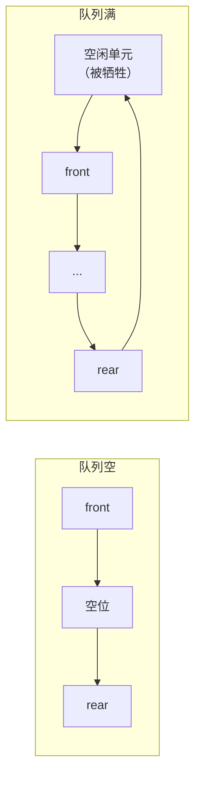

# 第 3 章：栈和队列

> 本章在 408 中通常出 1-2 道选择题（重要度 ⭐⭐⭐），但**循环队列的元素个数计算、中缀转后缀、输出序列合法性判断**是每年必考的计算型选择题。栈和队列是后续学习树（非递归遍历、层序遍历）、图（DFS/BFS）和递归的基石，务必把"特性 + 代码 + 应用"三者打通。本章建议投入 2-3 小时，重点：循环队列三种判满判空方法、表达式求值全流程、典型例题的推演过程。

---

## 3.1 栈的基本概念

**栈（Stack）** 是只允许在**一端**（栈顶）进行插入和删除操作的线性表，遵循 **LIFO（Last In First Out，后进先出）** 原则。

| 概念 | 含义 |
|------|------|
| 栈顶（top） | 允许插入和删除的一端，栈顶元素随时可能被访问/删除 |
| 栈底（bottom） | 固定不变的一端，最先进栈的元素所在位置 |
| 入栈（Push） | 在栈顶插入新元素 |
| 出栈（Pop） | 删除并返回栈顶元素 |
| 栈空 | 没有任何元素，此时执行 Pop 出错（下溢） |
| 栈满 | 顺序存储时空间已满，此时执行 Push 出错（上溢） |

> 栈是"**操作受限**的线性表"——它的逻辑结构仍是线性表，只是把插入/删除限定在一端。选择题常问"栈和队列的共同点"：**都是操作受限的线性表**，都只能在端点操作，插入删除都在 $O(1)$ 时间完成。

### 栈的数学性质（了解）

$n$ 个互不相同的元素进栈，出栈序列数为**卡特兰数**：

$$
\frac{1}{n+1} \binom{2n}{n}
$$

例如 $n = 3$ 时有 $\frac{1}{4} \times \binom{6}{3} = 5$ 种合法出栈序列。此公式只需了解，408 不会考直接套公式，但会考"某个序列是否合法"（见 3.11 例 4）。

> 卡特兰数的另一种形式： $\frac{1}{n+1} C_{2n}^{n}$ ，两者等价。记忆要点：**卡特兰数专门描述"进栈出栈"这类受限排列的计数**。

---

## 3.2 顺序栈

顺序栈用一组**地址连续**的存储单元存放自栈底到栈顶的数据元素，附加一个指针 `top` 指示栈顶位置。

```c
#define MaxSize 100
typedef struct {
    ElemType data[MaxSize];   // 存放栈中元素
    int top;                  // 栈顶指针，初始为 -1
} SqStack;
```

| 操作 | 判定条件 | 说明 |
|------|---------|------|
| 判空 | `top == -1` | 栈空 |
| 判满 | `top == MaxSize - 1` | 栈顶指针指向最后一个存储单元 |
| 元素个数 | `top + 1` | 从 0 开始计数 |

### 完整代码

```c
// 初始化
void InitStack(SqStack *S) {
    S->top = -1;
}

// 判空
bool StackEmpty(SqStack S) {
    return S.top == -1;
}

// 入栈
bool Push(SqStack *S, ElemType x) {
    if (S->top == MaxSize - 1)   // 栈满，无法入栈
        return false;
    S->data[++S->top] = x;       // 先移动指针，再赋值
    return true;
}

// 出栈
bool Pop(SqStack *S, ElemType *x) {
    if (S->top == -1)            // 栈空，无法出栈
        return false;
    *x = S->data[S->top--];      // 先取值，再移动指针
    return true;
}

// 读栈顶元素（不删除）
bool GetTop(SqStack S, ElemType *x) {
    if (S.top == -1)
        return false;
    *x = S.data[S.top];
    return true;
}
```

> 易错点：**栈满判断是 `top == MaxSize - 1` 而不是 `top == MaxSize`**，因为数组下标从 0 开始，最后一个可用下标是 `MaxSize - 1`。同理栈空判断是 `top == -1` 而不是 `top == 0`（`top == 0` 表示栈中还有 1 个元素）。

---

## 3.3 共享栈（双端栈）

两个栈共享一个长度为 `MaxSize` 的数组，两栈的栈底分别位于数组两端，栈顶**相向生长**：

```mermaid
graph LR
    subgraph data[数组 data[0..MaxSize-1]]
        A[0号栈<br/>栈底] --> B[...] --> C[top0]
        E[top1] --> F[...] --> G[1号栈<br/>栈底]
    end
```

- `top0` 初始为 `-1`，向数组**右端**生长
- `top1` 初始为 `MaxSize`，向数组**左端**生长
- 判满条件：两栈顶指针**相邻**，即 `top1 - top0 == 1`

```c
typedef struct {
    ElemType data[MaxSize];
    int top0;   // 0 号栈栈顶，初始 -1
    int top1;   // 1 号栈栈顶，初始 MaxSize
} ShStack;

// 0 号栈入栈
bool Push0(ShStack *S, ElemType x) {
    if (S->top1 - S->top0 == 1)  // 栈满（两栈顶相邻）
        return false;
    S->data[++S->top0] = x;
    return true;
}

// 1 号栈入栈
bool Push1(ShStack *S, ElemType x) {
    if (S->top1 - S->top0 == 1)
        return false;
    S->data[--S->top1] = x;
    return true;
}
```

> 易错点：共享栈**不存在单栈满的问题**，只有"两栈顶相遇"才算满。所以共享栈可以更充分地利用空间——一个栈空而另一个栈满时，仍可向空的那一侧继续入栈。判满统一写 `top1 - top0 == 1`。

---

## 3.4 链栈

链栈采用**头插法**的单链表实现：链头作为栈顶，入栈在链头插入结点，出栈删除链头结点，无需判满（除非内存耗尽），不存在"栈满"问题。

```c
typedef struct LNode {
    ElemType data;
    struct LNode *next;
} LNode, *LinkStack;

// 入栈 = 头插
bool Push(LinkStack *S, ElemType x) {
    LNode *p = (LNode *)malloc(sizeof(LNode));
    if (p == NULL) return false;
    p->data = x;
    p->next = *S;      // 新结点指向原栈顶
    *S = p;            // 新结点成为新栈顶
    return true;
}

// 出栈 = 删除首结点
bool Pop(LinkStack *S, ElemType *x) {
    if (*S == NULL) return false;   // 栈空
    LNode *p = *S;
    *x = p->data;
    *S = p->next;      // 栈顶指针后移
    free(p);
    return true;
}
```

| 对比 | 顺序栈 | 链栈 |
|------|--------|------|
| 判满 | 需要（`top == MaxSize - 1`） | 不需要（动态分配） |
| 空间 | 固定，可能浪费或溢出 | 按需分配，不浪费 |
| 典型场景 | 已知容量、追求速度 | 元素数量变化大 |

---

## 3.5 队列的基本概念

**队列（Queue）** 是只允许在**一端（队尾 rear）插入、另一端（队头 front）删除**的线性表，遵循 **FIFO（First In First Out，先进先出）** 原则。

| 概念 | 含义 |
|------|------|
| 队头（front） | 允许删除的一端，出队操作发生处 |
| 队尾（rear） | 允许插入的一端，入队操作发生处 |
| 入队（EnQueue） | 在队尾插入新元素 |
| 出队（DeQueue） | 删除并返回队头元素 |

> 排队"先来先服务"就是队列的直觉模型。栈和队列的区别只在**插入删除位置**：栈"一头进出"，队列"一头进一头出"。408 选择题常见问法："既是线性结构又操作受限的是？"——答案是栈和队列。

---

## 3.6 循环队列（本章核心）

### 3.6.1 假溢出问题

用顺序存储实现队列时，若只在数组尾部入队，则出队后 front 之前的空间被永久闲置，称为**假溢出**——`rear` 已经指向数组末尾，但 front 之前明明有大量空闲单元却无法使用。

解决思路：把数组**首尾相接**，构成逻辑上的环，`front` 和 `rear` 移动时对 `MaxSize` **取模**，这就是**循环队列**。

### 3.6.2 三种判满/判空方法对比

循环队列中 `rear == front` 时可能是空也可能是满（循环一周追上），因此必须额外区分。三种经典做法：

| 方法 | 判空条件 | 判满条件 | 队列长度 | 特点 |
|------|---------|---------|---------|------|
| ① 牺牲一个单元 | `rear == front` | `(rear + 1) % MaxSize == front` | `(rear - front + MaxSize) % MaxSize` | 最常用，教材/王道标准，最多存 `MaxSize - 1` 个元素 |
| ② 设 size 变量 | `size == 0` | `size == MaxSize` | `size` | 存满 `MaxSize` 个元素，入队 `size++`，出队 `size--` |
| ③ 设 tag 标记 | `front == rear && tag == 0` | `front == rear && tag == 1` | `(rear - front + MaxSize) % MaxSize` | 入队置 `tag = 1`，出队置 `tag = 0` |

> 核心区别一句话：**牺牲单元法用"环上差一格"判满；size 法用计数器判满；tag 法用"最近一次操作是入队还是出队"判满**。三者都能存满 `MaxSize` 个元素的只有 ②③，① 最多存 `MaxSize - 1` 个。选择题问"最多能存几个元素"，先判断用的是哪种方法。

循环队列判满示意（牺牲单元法，`MaxSize = 8`）：



### 3.6.3 完整代码（牺牲单元法）

```c
#define MaxSize 10
typedef struct {
    ElemType data[MaxSize];
    int front, rear;   // 队头指针、队尾指针
} SqQueue;

// 初始化：front 指向队头元素，rear 指向队尾元素的下一个位置
void InitQueue(SqQueue *Q) {
    Q->front = Q->rear = 0;
}

// 判空
bool QueueEmpty(SqQueue Q) {
    return Q.front == Q.rear;
}

// 判满
bool QueueFull(SqQueue Q) {
    return (Q.rear + 1) % MaxSize == Q.front;
}

// 入队
bool EnQueue(SqQueue *Q, ElemType x) {
    if ((Q->rear + 1) % MaxSize == Q->front)
        return false;                    // 队满
    Q->data[Q->rear] = x;
    Q->rear = (Q->rear + 1) % MaxSize;   // 尾指针循环后移
    return true;
}

// 出队
bool DeQueue(SqQueue *Q, ElemType *x) {
    if (Q->front == Q->rear)
        return false;                    // 队空
    *x = Q->data[Q->front];
    Q->front = (Q->front + 1) % MaxSize; // 头指针循环后移
    return true;
}

// 元素个数
int QueueLength(SqQueue Q) {
    return (Q.rear - Q.front + MaxSize) % MaxSize;
}
```

> 易错点：**长度公式 `(rear - front + MaxSize) % MaxSize` 必须加 `MaxSize` 再取模**。当 `rear < front`（指针已绕环一周）时，直接 `rear - front` 是负数，必须先补上 `MaxSize` 才正确。这是 408 循环队列计算题的固定陷阱。

---

## 3.7 链队列

链队列用**带头结点的单链表**实现，同时维护 `front`（队头）和 `rear`（队尾）两个指针：入队 = 在尾部插入结点（尾插），出队 = 删除头结点后的首结点。

```c
typedef struct QNode {
    ElemType data;
    struct QNode *next;
} QNode;

typedef struct {
    QNode *front;   // 队头指针，指向头结点
    QNode *rear;    // 队尾指针，指向最后一个结点
} LinkQueue;

// 初始化（带头结点）
void InitQueue(LinkQueue *Q) {
    Q->front = Q->rear = (QNode *)malloc(sizeof(QNode));
    Q->front->next = NULL;
}

// 判空
bool QueueEmpty(LinkQueue Q) {
    return Q.front == Q.rear;
}

// 入队 = 尾插
void EnQueue(LinkQueue *Q, ElemType x) {
    QNode *p = (QNode *)malloc(sizeof(QNode));
    p->data = x;
    p->next = NULL;
    Q->rear->next = p;   // 新结点链到队尾
    Q->rear = p;         // 尾指针后移
}

// 出队 = 删除首结点
bool DeQueue(LinkQueue *Q, ElemType *x) {
    if (Q->front == Q->rear)   // 队空
        return false;
    QNode *p = Q->front->next;
    *x = p->data;
    Q->front->next = p->next;
    if (Q->rear == p)          // 队列中只有一个结点：删除后尾指针也要更新
        Q->rear = Q->front;
    free(p);
    return true;
}
```

> 易错点：**出队删除的是最后一个结点时，`rear` 必须回指头结点**，否则 `rear` 指向已释放的内存，形成悬空指针，后续判空和入队都会出错。这是链队列代码题最常挖的坑。

---

## 3.8 双端队列

**双端队列（Deque）** 允许在两端插入、两端删除。408 常考两种受限变体：

| 类型 | 插入限制 | 删除限制 | 典型判断 |
|------|---------|---------|---------|
| 输入受限双端队列 | 只允许一端插入 | 两端均可删除 | 输出序列判断 |
| 输出受限双端队列 | 两端均可插入 | 只允许一端删除 | 输出序列判断 |

判断方法（以输出受限为例）：**插入时灵活选择左端或右端，使每个要输出的元素恰好位于输出端**。详细推演见 3.11 例 5。

> 双端队列的选择题核心就一句话：**任何元素只要在插入时能放到"输出端一侧"且不影响已排好顺序的元素，就能控制输出顺序**。逐元素模拟即可，不要背结论。

---

## 3.9 栈的应用

### 3.9.1 括号匹配

用栈依次扫描括号串：左括号入栈；遇右括号时，若栈空说明右括号多余，否则弹出栈顶并判断类型是否匹配；扫描结束后栈必须为空。

```c
bool BracketMatch(char str[], int n) {
    char stack[MaxSize];
    int top = -1;
    for (int i = 0; i < n; i++) {
        if (str[i] == '(' || str[i] == '[' || str[i] == '{') {
            stack[++top] = str[i];              // 左括号入栈
        } else if (str[i] == ')' || str[i] == ']' || str[i] == '}') {
            if (top == -1) return false;        // 右括号多余
            char left = stack[top--];           // 弹出最近一个左括号
            if ((str[i] == ')' && left != '(') ||
                (str[i] == ']' && left != '[') ||
                (str[i] == '}' && left != '{'))
                return false;                   // 类型不匹配
        }
    }
    return top == -1;                           // 栈空才算全部匹配
}
```

> 易错点：**括号匹配必须是"就近匹配"**——最近入栈的左括号优先被匹配，这正是栈 LIFO 特性的来源。如 `([)]` 这种交叉嵌套是不合法的（第二个 `)` 弹出的是 `[`）。

### 3.9.2 表达式求值：中缀 → 后缀 → 计算

**运算符优先级**（中缀转后缀时决定弹出时机）：

| 优先级 | 运算符 |
|--------|--------|
| 高 | `*` `/` |
| 低 | `+` `-` |
| 括号 | `(` 直接入栈；`)` 弹出直到 `(` |

**中缀转后缀规则**（栈存运算符）：
1. 操作数 → 直接输出
2. `(` → 入栈
3. `)` → 弹出并输出栈中运算符，直到遇到 `(`，`(` 出栈但不输出
4. 运算符 → 栈空或栈顶为 `(` 则入栈；否则**栈顶优先级 ≥ 当前**时弹出并输出，直到满足入栈条件
5. 扫描结束，把栈中剩余运算符全部弹出输出

**后缀表达式计算规则**（栈存操作数）：扫描后缀串，数字入栈；遇运算符弹出**两个**操作数，先弹出的是**右操作数**，运算结果再入栈；扫描结束栈顶即结果。

| 步骤 | 操作 | 说明 |
|------|------|------|
| 1 | 操作数入栈 | 遇到数字 |
| 2 | 弹出 `a`、`b`（`a` 先弹 = 右操作数） | 遇二元运算符 |
| 3 | 计算 `b op a` 并入栈 | 减/除顺序敏感 |
| 4 | 重复至结束 | 栈中唯一元素为结果 |

> 易错点：**减法和除法的操作数顺序不能颠倒**——先弹出的是右操作数（减数/除数），后弹出的是左操作数（被减数/被除数）。`8 2 /` 应算 $8 / 2 = 4$ ，若写成 $2 / 8$ 就错了。

### 3.9.3 递归与函数调用栈

每次函数调用（包括递归）都会在系统栈中压入一个**活动记录/栈帧**（含返回地址、局部变量、参数），函数返回时弹出。因此：

- **递归深度** = 栈中同时存在的活动记录数，即最大栈空间需求
- 递归过深会**栈溢出**（如斐波那契直接递归 $O(2^n)$ 深度 $n$ ）
- 非递归化 = 用**显式栈**模拟系统栈（如二叉树中序非递归遍历，见[第 5 章（树与二叉树）](05-tree-and-binary-tree.md)）

> 联系：递归是"系统替你管理栈"，非递归是"自己管理栈"。408 常考"某递归函数的最大递归深度"——就是最深层嵌套的调用次数。

---

## 3.10 队列的应用

| 应用 | 原理 | 关联章节 |
|------|------|---------|
| **层序遍历** | 根入队；出队访问，左右孩子依次入队，直到队空 | [第 5 章（树与二叉树）](05-tree-and-binary-tree.md) |
| **缓冲区** | 生产者入队、消费者出队，FIFO 保证先到先处理（打印队列、消息队列） | — |
| **图的 BFS** | 初始顶点入队，出队访问并让所有未访问邻接顶点入队 | 第 6 章（图） |

**层序遍历核心框架**（用队列 FIFO 保证"同层先于下一层"被访问）：

```text
根结点入队
while (队列不空) {
    出队一个结点并访问
    若其左孩子非空，左孩子入队
    若其右孩子非空，右孩子入队
}
```

> 层序遍历必须在[第 5 章（树与二叉树）](05-tree-and-binary-tree.md)中配合二叉树掌握：**队列里永远同时只有"相邻两层"的结点**，这正是"层序"的由来。图的 BFS 只是把它推广到一般图并加访问标记。

---

## 3.11 典型例题

**例 1**（循环队列元素个数）：某循环队列容量 `MaxSize = 10`，`front = 7`，`rear = 3`，求队列中元素个数。

**解**：直接套长度公式：

$$
(rear - front + MaxSize) \% MaxSize = (3 - 7 + 10) \% 10 = 6
$$

> 注意 `rear < front` 时必须加 `MaxSize` 再取模，否则得到负数是错的。这类题 408 每年必出，公式务必记死。

**例 2**（中缀转后缀完整推演）：将中缀表达式 $a + b * (c - d) - e / f$ 转为后缀表达式。

**解**：用栈存运算符，逐步推演（栈内容自底向上）：

| 扫描字符 | 操作 | 栈（底→顶） | 输出 |
|---------|------|------------|------|
| a | 操作数，直接输出 | 空 | a |
| + | 栈空，入栈 | + | a |
| b | 操作数 | + | ab |
| * | 栈顶 `+` 优先级低于 `*`，入栈 | + * | ab |
| ( | 入栈 | + * ( | ab |
| c | 操作数 | + * ( | abc |
| - | 栈顶是 `(`，直接入栈 | + * ( - | abc |
| d | 操作数 | + * ( - | abcd |
| ) | 弹出 `-` 输出；弹出 `(` 不输出 | + * | abcd- |
| - | 栈顶 `*` 优先级 ≥ `-`，弹出输出；栈顶 `+` 优先级 ≥ `-`，弹出输出；栈空，`-` 入栈 | - | abcd-*+ |
| e | 操作数 | - | abcd-*+e |
| / | 栈顶 `-` 优先级低于 `/`，入栈 | - / | abcd-*+e |
| f | 操作数 | - / | abcd-*+ef |
| 结束 | 弹出 `/`、`-` | 空 | abcd-*+ef/- |

结果： $a b c d - * e f / -$ （即 `abcd-*+ef/-`）

> 推演要点：`*` 先入栈后，遇到第一个 `-` 时 `*` 优先级更高必须**先弹出**，这保证乘法先于减法执行；括号内的 `-` 因栈顶是 `(` 而直接入栈，括号保证 $c - d$ 先行；`/` 优先级高于 `-`，直接入栈，保证 $e / f$ 先于最后的减法计算。

**例 3**（后缀表达式求值）：计算后缀表达式 `a b c d - * e f / -` ，其中 $a=10, b=2, c=8, d=3, e=20, f=5$ 。

**解**：用栈存操作数，逐步推演（栈内容自底向上，左为栈底）：

| 扫描 | 操作 | 栈 |
|------|------|-----|
| 10 | 入栈 | 10 |
| 2 | 入栈 | 10, 2 |
| 8 | 入栈 | 10, 2, 8 |
| 3 | 入栈 | 10, 2, 8, 3 |
| - | 弹 3（右）、8（左）： $8 - 3 = 5$ ，入栈 | 10, 2, 5 |
| * | 弹 5（右）、2（左）： $2 \times 5 = 10$ ，入栈 | 10, 10 |
| + | 弹 10（右）、10（左）： $10 + 10 = 20$ ，入栈 | 20 |
| 20 | 入栈 | 20, 20 |
| 5 | 入栈 | 20, 20, 5 |
| / | 弹 5（右）、20（左）： $20 / 5 = 4$ ，入栈 | 20, 4 |
| - | 弹 4（右）、20（左）： $20 - 4 = 16$ ，入栈 | 16 |

结果： $16$ 。验算原中缀： $10 + 2 \times (8 - 3) - 20 / 5 = 10 + 10 - 4 = 16$ ，一致。

> 关键观察：每次 `-`、`/` 运算都是**先弹出的元素作右操作数**——`8 3 -` 是 $8 - 3$ 而不是 $3 - 8$ ，`20 5 /` 是 $20 / 5$ 而不是 $5 / 20$ 。顺序写反是全题唯一的失分点。

**例 4**（输出序列合法性——栈容量限制）：元素 1, 2, 3, 4, 5 依次入栈，**栈容量为 3**。判断出栈序列 `4, 3, 5, 1, 2` 是否可能。

**解**：不可能。推演：要第一个出栈 4，必须先把 1, 2, 3, 4 全部压入栈中，但栈容量只有 3，压入 4 时栈已满，入栈失败。所以序列不合法。

> 若去掉容量限制，`4, 3, 5, 1, 2` 仍然不可能：1, 2, 3, 4 入栈 → 出 4 → 出 3 → 5 入栈 → 出 5，此时栈中剩 1, 2（2 在顶），而期望下一个出 1，矛盾。**判断合法性的通用方法**：模拟入栈/出栈，若某一时刻"栈顶元素 ≠ 期望出栈元素且无法继续入栈凑出"，则非法。

**例 5**（双端队列输出序列判断）：元素 1, 2, 3, 4 依次进入一个**输出受限的双端队列**（两端可插入、只允许左端输出）。判断输出序列 `4, 2, 1, 3` 是否可能。

**解**：可能。推演：

| 步骤 | 操作 | 队列（左端→右端） |
|------|------|-------------------|
| 1 | 插入 1 | 1 |
| 2 | 2 从**左端**插入 | 2, 1 |
| 3 | 3 从**右端**插入 | 2, 1, 3 |
| 4 | 4 从**左端**插入 | 4, 2, 1, 3 |
| 5 | 依次输出 4, 2, 1, 3 | 空 |

> 关键技巧：**在插入 4 之前，先把 2 调整到左端第二个位置、3 放到右端**，这样 4 从左边插入后，左端顺序恰好是 4, 2, 1，输出 3 时 3 已在队尾等待。这类题逐元素模拟插入方向即可，无需背结论。

### 常见陷阱清单

1. **循环队列长度公式**：必须 `(rear - front + MaxSize) % MaxSize`，`rear < front` 时少了 `+MaxSize` 必错
2. **栈满判断**：`top == MaxSize - 1`（不是 `MaxSize`）；栈空 `top == -1`（不是 `top == 0`）
3. **后缀计算减/除顺序**：先弹出的是**右操作数**，`a b -` 是 $a - b$ 而非 $b - a$
4. **括号匹配嵌套**：必须是就近匹配，`([)]` 非法
5. **链队列删尾**：仅剩一个结点出队后，`rear` 必须回指头结点
6. **共享栈判满**：`top1 - top0 == 1`，两栈顶相遇才算满

---

## 本章小结

### 核心要点回顾

1. **栈 LIFO、队列 FIFO**：都是操作受限的线性表，插入/删除只在端点
2. **顺序栈**：`top = -1` 空、`top == MaxSize - 1` 满，入栈 `data[++top]`，出栈 `data[top--]`
3. **共享栈**：两栈底在两端、栈顶相向生长，判满 `top1 - top0 == 1`
4. **链栈**：头插法单链表，入栈头插、出栈删首，无判满
5. **循环队列**：取模循环；三种判满方法（牺牲单元 / size / tag）；长度 `(rear - front + MaxSize) % MaxSize`
6. **链队列**：带头尾指针，出队删首，单结点时更新 `rear`
7. **表达式求值**：中缀 → 后缀（栈存运算符）→ 计算（栈存操作数），减除注意操作数顺序
8. **递归与栈**：递归深度 = 系统栈中活动记录的最大数量

### 考试重点排序

| 优先级 | 考点 | 题型 |
|--------|------|------|
| ⭐⭐⭐ | 循环队列元素个数 / 判满判空条件 | 选择题 |
| ⭐⭐⭐ | 中缀转后缀、后缀求值 | 选择题 |
| ⭐⭐⭐ | 出栈/出队序列合法性判断（含双端队列） | 选择题 |
| ⭐⭐ | 栈/队列基本概念与特性辨析 | 选择题 |
| ⭐⭐ | 括号匹配、层序遍历（与树联动） | 选择/综合题 |
| ⭐ | 链栈、链队列手写代码 | 代码题（偶尔） |

> 复习策略：循环队列的三张表格（判满判空对比、中缀转后缀推演、后缀求值推演）必须能默写；典型例题动手重推一遍。栈和队列为[第 4 章（串）](04-string.md)的 KMP、[第 5 章（树与二叉树）](05-tree-and-binary-tree.md)的遍历打基础，第 2 章的线性表实现（[02-linear-list.md](02-linear-list.md)）是本章代码的前置。

---

## 自测题

1. 栈和队列的共同点是什么？与普通线性表的本质区别是什么？
2. 容量为 5 的循环队列，`front = 4`，`rear = 1`，队列中元素个数是多少？
3. 将中缀表达式 $a + b * c - d$ 转为后缀表达式。
4. 计算后缀表达式 `8 2 / 3 4 - *` 的值（整数运算）。
5. 元素 1, 2, 3, 4, 5 依次入栈（容量不限），出栈序列 `3, 2, 5, 4, 1` 是否可能？若是，给出入出栈过程。
6. 共享栈中，0 号栈和 1 号栈的栈顶指针分别为 `top0`、`top1`，栈满的条件是什么？为什么？
7. 链队列出队时，什么情况下需要额外更新队尾指针？为什么？

> **答案**：1. 都是**操作受限的线性表**，只能在端点插入删除；区别是栈仅一端操作（LIFO），队列一端插入一端删除（FIFO）。2. 长度 $= (1 - 4 + 5) \% 5 = 2$ 个。3. 后缀为 `abc*+d-`（推演：`*` 先入栈，遇 `-` 时优先级更高先弹出，再入栈 `-`）。4. 值为 `-4`：`8 2 /` 得 4，`3 4 -` 得 -1，`4 -1 *` 得 -4（注意 `3 4 -` 是先弹 4 为右操作数、再弹 3 为左操作数， $3 - 4 = -1$ ）。5. 可能：1, 2, 3 入栈 → 出 3, 2 → 4, 5 入栈 → 出 5, 4 → 出 1。6. 条件为 `top1 - top0 == 1`，即两栈顶相邻；因为两栈底在数组两端、栈顶相向生长，只有相遇时才无空间可插入。7. 当队列中**仅剩一个结点**且将其出队后，`rear` 必须回指头结点（`Q->rear = Q->front`），否则 `rear` 指向已释放的结点形成悬空指针。
