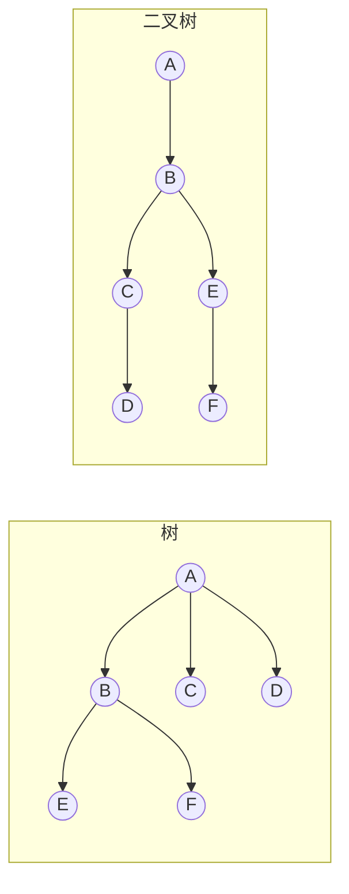
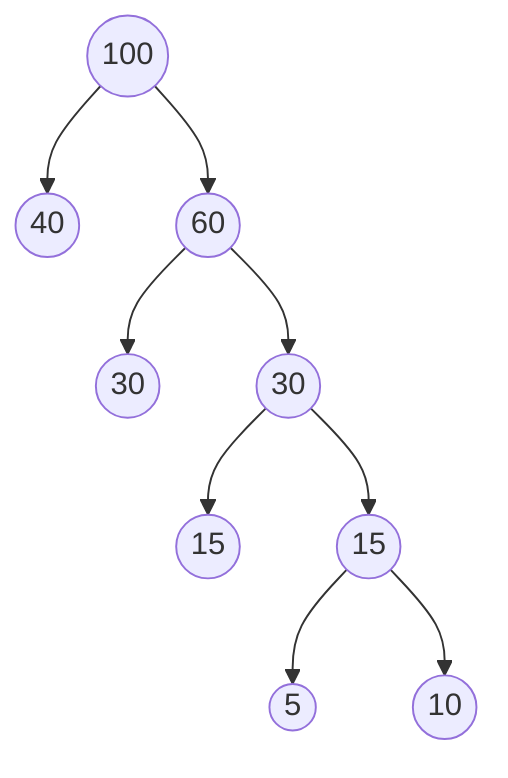
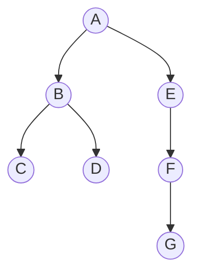
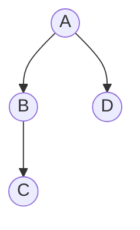

# 第 5 章：树与二叉树

> 本章是 408 数据结构的**第一重点章节**（重要度 ⭐⭐⭐⭐⭐），也是综合应用题的第二主战场——**由遍历序列构造二叉树、哈夫曼树的构造与 WPL 计算、线索化**每年必考其一。选择题高频考点包括：二叉树性质计算（ $n_0$ 与 $n_2$ 关系）、完全二叉树编号互推、遍历序列合法性判断、哈夫曼编码长度计算。树是后续第 6 章图（DFS/BFS 与树的遍历一脉相承）、第 7 章查找（BST、AVL、B 树）的基础，本章建议投入 **6-8 小时**，重点是"性质背熟、遍历代码能手写、构造过程能推演"。栈和队列的基础请先复习[第 3 章（栈和队列）](03-stack-and-queue.md)。

---

## 5.1 树的基本概念

### 5.1.1 树的定义

**树（Tree）** 是 $n$ （ $n \geq 0$ ）个结点的有限集合。当 $n = 0$ 时称为**空树**；当 $n > 0$ 时，它满足：

1. 有且仅有一个称为**根（Root）** 的结点；
2. 其余结点可分为 $m$ （ $m > 0$ ）个**互不相交**的有限集合 $T_1, T_2, \dots, T_m$ ，其中每个集合本身又是一棵树，称为根的**子树（Subtree）**。

> 递归定义是树最重要的特征：**一棵树由根和若干互不相交的子树构成**。选择题常考"子树必须互不相交"——如果两个集合有交集，就不是树，而是图（图结构允许任意连接，见[第 6 章（图）](06-graph.md)）。

### 5.1.2 基本术语

| 术语 | 定义 | 记忆要点 |
|------|------|---------|
| **结点的度** | 该结点拥有的**孩子数** | 叶子结点的度为 0 |
| **树的度** | 树内各结点度的**最大值** | 不是平均值！ |
| **叶子结点** | 度为 0 的结点（终端结点） | 无孩子的结点 |
| **分支结点** | 度大于 0 的结点（非终端结点） | 含根（若根不是叶子） |
| **层次** | 根在第 1 层，孩子结点在第 $i+1$ 层 | 根层号为 1，不是 0 |
| **深度** | 自顶向下：结点的深度 = 结点所在层次 | 即根到该结点的层数 |
| **高度** | 自底向上：叶子的高度为 1，根的高度 = 树的深度 | 数值上与深度相等 |
| **双亲（父）** | 结点的直接上层结点 | 每个结点有且仅有一个双亲 |
| **孩子** | 结点的直接下层结点 | 结点可以有多个孩子 |
| **兄弟** | 同一双亲的孩子之间互为兄弟 | 不同双亲的孩子不叫兄弟 |
| **祖先** | 从根到该结点路径上除自身外的所有结点 | 根是所有结点的祖先 |
| **子孙** | 以某结点为根的子树中的所有结点（除自身） | 与祖先互逆 |
| **堂兄弟** | 双亲在同一层的结点（双亲互为兄弟） | 双亲不是同一个结点 |

> 易错点：**树的深度与高度数值相同，但含义不同**——深度是"到根的距离"（自顶向下数），高度是"到最远叶子的距离"（自底向上数），只有根结点的树的深度 = 高度 = 1。另外注意"结点的层次"从 1 开始编号，这直接影响后续完全二叉树的编号与深度公式。

### 5.1.3 树的性质（n 个结点的树）

设树有 $n$ 个结点， $m$ 为树的度，则：

**性质 1**：树中边数 $= n - 1$ 。

> 直观解释：除根以外，每个结点有且仅有一条由双亲指向它的边。 $n$ 个结点有 $n-1$ 个非根结点，所以恰好 $n-1$ 条边。这是本章最基础、最常用的等式——**n 个结点的树的边数恒为 n-1**，与树的形态无关。

**性质 2**：度为 $m$ 的树中第 $i$ 层上至多有 $m^{i-1}$ 个结点（ $i \geq 1$ ）。

**性质 3**：高度为 $h$ 的 $m$ 叉树至多有 $\frac{m^h - 1}{m - 1}$ 个结点（每层都满时取最大值，等比数列求和）。

**性质 4**：设度为 $i$ 的结点数为 $n_i$ （ $0 \leq i \leq m$ ），则结点总数与各度结点数的关系为：

$$
n = n_0 + n_1 + n_2 + \cdots + n_m = 1 + \sum_{i=1}^{m} i \cdot n_i
$$

> 推导： $n = 1 +$ 边数（性质 1），而边数又等于所有结点的度之和 $\sum i \cdot n_i$ （每条边对应一个"孩子关系"，被计数一次）。两个等式联立即得。

**性质 5**： $n_0 = 1 + \sum_{i=2}^{m} (i - 1) n_i$ ，对二叉树（ $m = 2$ ）特殊化为 $n_0 = n_2 + 1$ ，这是 5.2.2 的重要性质 ③。

---

## 5.2 二叉树

### 5.2.1 二叉树的定义与五种基本形态

**二叉树（Binary Tree）** 是 $n$ （ $n \geq 0$ ）个结点的有限集合，它或是空集，或由一个根结点加上两棵**互不相交**、分别称为**左子树**和**右子树**的二叉树组成。

二叉树有**五种基本形态**：

| 形态 | 说明 |
|------|------|
| ① 空二叉树 | $n = 0$ ，没有任何结点 |
| ② 只有根结点 | 左右子树均为空 |
| ③ 只有左子树 | 右子树为空 |
| ④ 只有右子树 | 左子树为空 |
| ⑤ 左右子树都有 | 完整形态 |

### 二叉树与度为 2 的树的区别

| 对比项 | 度为 2 的树 | 二叉树 |
|--------|------------|--------|
| 子树顺序 | 子树不分左右 | **左右子树有严格次序**，左子树与右子树是两棵不同的树 |
| 度数限制 | 允许恰有 2 个孩子 | 每个结点最多 2 个孩子，且区分左右 |
| 空树 | 不是树 | 可以是空树（ $n = 0$ ） |

> 例：一个只有右孩子、没有左孩子的二叉树，与"只有 2 个孩子"的树形态不同——二叉树中"只有右孩子"是合法形态，而"只有一个孩子"的结点的度不是 2。选择题常问"二叉树是度为 2 的有序树吗？"答案是**不完全等同**：二叉树允许只有左孩子或只有右孩子，且必须是区分左右的有序结构。

### 5.2.2 二叉树的重要性质（逐个证明）

**性质 ①**：非空二叉树的第 $i$ 层上至多有 $2^{i-1}$ 个结点（ $i \geq 1$ ）。

> 直观解释：第 1 层只有根 1 个结点 $= 2^0$ ；每层结点数最多是上一层的 2 倍，所以第 $i$ 层最多 $2^{i-1}$ 个。可用数学归纳法严格证明：第 1 层 $2^0 = 1$ 成立；假设第 $k$ 层最多 $2^{k-1}$ 个，则第 $k+1$ 层每个结点最多有 2 个孩子，最多 $2 \times 2^{k-1} = 2^k$ 个，结论对 $k+1$ 成立。

**性质 ②**：深度为 $k$ 的二叉树至多有 $2^k - 1$ 个结点（ $k \geq 1$ ）。

> 直观解释：把每一层取最大值再求和， $2^0 + 2^1 + \cdots + 2^{k-1} = 2^k - 1$ （等比数列求和）。当且仅当二叉树是**满二叉树**时取到最大值。

**性质 ③**：对任何一棵非空二叉树，叶子结点数 $n_0$ 与度为 2 的结点数 $n_2$ 满足：

$$
n_0 = n_2 + 1
$$

> 证明（由边数关系推导）：设二叉树中度为 0、1、2 的结点数分别为 $n_0, n_1, n_2$ ，结点总数 $n = n_0 + n_1 + n_2$ 。二叉树中除根外每个结点有一条入边，边数 $= n - 1$ ；同时边数等于所有结点的度之和 $= n_1 + 2n_2$ 。联立：
>
> $$
> n - 1 = n_1 + 2n_2 \quad \Rightarrow \quad (n_0 + n_1 + n_2) - 1 = n_1 + 2n_2 \quad \Rightarrow \quad n_0 = n_2 + 1
> $$
>
> 即叶子结点数等于度为 2 的结点数加 1。

> 易错点：性质 ③ **对任意二叉树都成立**（满二叉树、完全二叉树、任何形态），不是只有完全二叉树才满足。考试时"只给叶子数求度为 2 的结点数"这类题直接套 $n_0 = n_2 + 1$ 即可，无需知道 $n_1$ 。

**性质 ④**（推论）：二叉树的结点总数 $n = 2n_2 + n_1 + 1$ ，即 $n_0 + n_1 + n_2 = 2n_2 + n_1 + 1$ ，联立 $n_0 = n_2 + 1$ 得出。做题时常用于"已知 $n$ 和 $n_1$ 求 $n_0$ "。

### 5.2.3 满二叉树

一棵深度为 $k$ 且有 $2^k - 1$ 个结点的二叉树称为**满二叉树**。

- 每层结点数都取到最大值，没有空位；
- 叶子全在第 $k$ 层；
- 对满二叉树按从上到下、从左到右编号，结点 $i$ 的左孩子 $2i$ 、右孩子 $2i+1$ 、双亲 $\lfloor i/2 \rfloor$ 。

### 5.2.4 完全二叉树

**完全二叉树（Complete Binary Tree）**：对一棵深度为 $k$ 、有 $n$ 个结点的二叉树，当且仅当其每个结点都与深度为 $k$ 的满二叉树中编号为 $1 \sim n$ 的结点**一一对应**时，称为完全二叉树。

直观特征：

1. 只有**最下面两层**的结点度可以小于 2；
2. 最下层的叶子**都靠左**连续排列；
3. 若有度为 1 的结点，**只可能有一个**，且该结点**只有左孩子**（没有右孩子）；
4. 按层序编号后，结点编号与满二叉树完全一致。

**完全二叉树的性质**：

**性质 A（父子编号关系）**：按层序从 1 开始编号，对编号为 $i$ （ $i \geq 1$ ）的结点：

| 关系 | 公式 | 条件 |
|------|------|------|
| 双亲 | $\lfloor i/2 \rfloor$ | $i > 1$ （根无双亲） |
| 左孩子 | $2i$ | $2i \leq n$ 时才存在 |
| 右孩子 | $2i + 1$ | $2i + 1 \leq n$ 时才存在 |
| 所在层次 | $\lfloor \log_2 i \rfloor + 1$ | 第 $i$ 个结点的层次 |

**性质 B（深度）**： $n$ 个结点的完全二叉树深度为 $\lfloor \log_2 n \rfloor + 1$ 。

> 验证： $n = 1000$ 时 $\lfloor \log_2 1000 \rfloor = 9$ （ $2^9 = 512 \leq 1000 < 1024 = 2^{10}$ ），深度 $= 10$ 。第 10 层编号范围是 $2^9 = 512 \sim 2^{10} - 1 = 1023$ ，1000 确实落在第 10 层。

**性质 C（度为 1 的结点数）**：完全二叉树中 $n_1$ 只能是 0 或 1。当 $n$ 为偶数时 $n_1 = 1$ ；当 $n$ 为奇数时 $n_1 = 0$ 。

> 由性质 C 可推导： $n_0 = \lceil n/2 \rceil$ （完全二叉树叶子数）。例： $n = 1000$ （偶数）， $n_1 = 1$ ，由 $n_0 = n_2 + 1$ 与 $n_0 + n_1 + n_2 = 1000$ 得 $n_0 = 500$ （详见 5.9 例 1）。

> 常见陷阱——**完全二叉树的判断**：① 只有右孩子没有左孩子的结点一定不是完全二叉树；② 某结点没有左孩子但仍有右孩子，不是完全二叉树；③ 出现第一个"缺孩子"的结点后，其后所有结点必须是叶子（即不能"先缺后满"）。判断时逐层检查"结点是否靠左、是否连续"。

### 5.2.5 二叉排序树与平衡二叉树（预告）

二叉排序树（BST）与平衡二叉树（AVL）也是二叉树，但它们是**查找结构**，重点内容放在[第 7 章（查找）](07-search.md)，本章只需知道它们都是二叉树的特殊形态，性质 ①②③ 对其同样成立。


---

## 5.3 二叉树的存储结构

### 5.3.1 顺序存储

用一组地址连续的存储单元**按层序编号**存放结点，数组下标从 **1** 开始（下标 0 闲置或存其他信息）：

| 数组下标 | 1 | 2 | 3 | 4 | 5 | ... |
|---------|---|---|---|---|---|-----|
| 结点 | 根 | 左孩子 | 右孩子 | 4 号 | 5 号 | ... |

编号规则（设结点编号为 $i$ ）：

- 双亲： $\lfloor i/2 \rfloor$ ；
- 左孩子： $2i$ ；右孩子： $2i + 1$ 。

> 顺序存储**只适合完全二叉树**（或满二叉树）：结点填入数组后无空洞，父子下标关系严格成立。对一般的二叉树，为保留编号关系必须在缺失位置留空位，极端情况（深度 $k$ 的单支树）需要 $2^k - 1$ 个存储单元却只存 $k$ 个结点，**空间浪费极其严重**，此时应改用链式存储。

```c
// 顺序存储：用数组表示完全二叉树，下标 1 起
#define MaxSize 100
typedef int SqBiTree[MaxSize];   // SqBiTree[0] 空闲或存结点总数
// 结点 i（1 ≤ i ≤ n）的左孩子为 SqBiTree[2*i]，右孩子为 SqBiTree[2*i+1]
```

### 5.3.2 链式存储

**二叉链表**：每个结点含数据域和两个指针域，分别指向左孩子、右孩子（类型定义与 [C 语言第 3 章（结构体与内存）](../../../programming-languages/c/doc/03-struct-memory-408.md) 一致）：

```c
typedef struct BiTNode {
    ElemType data;                     // 数据域
    struct BiTNode *lchild, *rchild;   // 左右孩子指针
} BiTNode, *BiTree;
```

**三叉链表**：在二叉链表基础上增加一个指向**双亲**的指针 `parent`，便于从任意结点回溯到根（如求祖先、最近公共祖先）：

```c
typedef struct BiTNode {
    ElemType data;
    struct BiTNode *lchild, *rchild;   // 左右孩子指针
    struct BiTNode *parent;            // 指向双亲的指针
} BiTNode, *BiTree;
```

**空链域个数**： $n$ 个结点的二叉链表共有 $2n$ 个指针域，其中 $n - 1$ 个被非根结点的双亲指针占用（每条边占一个指针域），故**空链域 $= 2n - (n - 1) = n + 1$**。

> 这个 $n+1$ 是线索二叉树的理论基础（5.5 节）： $n+1$ 个空链域若能利用起来，正好可以存放 $n$ 个结点的前驱/后继线索（为什么正好够用，见 5.5.1）。

---

## 5.4 二叉树的遍历（本章核心）

### 5.4.1 三种遍历次序

遍历是指按某条搜索路径访问树中每个结点**恰好一次**。按"访问根结点"的相对时机，分为三种：

| 遍历方式 | 访问顺序 | 口诀 |
|---------|---------|------|
| 先序（前序）遍历 | **根** → 左子树 → 右子树 | 根左右 |
| 中序遍历 | 左子树 → **根** → 右子树 | 左根右 |
| 后序遍历 | 左子树 → 右子树 → **根** | 左右根 |

三种遍历都是**递归定义**：先/中/后是"根"的相对位置，左右子树内部的访问方式相同。分析遍历结果时，左右子树内部也按同规则递归展开。

> 注意："先序、中序、后序"的命名依据是**根结点的访问时机**，与左子树、右子树本身的访问顺序无关（左右子树内部的访问方式总是与整棵树一致）。选择题常考：已知先序序列，问中序序列中某元素的位置——逐层用"根分割左右子树"来推。

### 5.4.2 递归遍历（3 个完整代码）

```c
// 先序遍历：根 → 左 → 右
void PreOrder(BiTree T) {
    if (T != NULL) {
        visit(T);                 // 访问根结点
        PreOrder(T->lchild);      // 递归遍历左子树
        PreOrder(T->rchild);      // 递归遍历右子树
    }
}

// 中序遍历：左 → 根 → 右
void InOrder(BiTree T) {
    if (T != NULL) {
        InOrder(T->lchild);
        visit(T);
        InOrder(T->rchild);
    }
}

// 后序遍历：左 → 右 → 根
void PostOrder(BiTree T) {
    if (T != NULL) {
        PostOrder(T->lchild);
        PostOrder(T->rchild);
        visit(T);
    }
}
```

递归遍历的时间复杂度 $O(n)$ （每个结点访问一次），空间复杂度 $O(h)$ （递归工作栈深度等于树的高度 $h$ ，最坏 $O(n)$ ）。

> 无论哪种遍历，**叶子结点的访问顺序**都值得注意：先序最先访问叶子（一旦到达即输出），中序与后序的叶子相对顺序完全一致（都从左到右），但叶子在整个序列中的绝对位置不同。

### 5.4.3 非递归遍历（用栈模拟递归）

递归遍历隐式使用了系统调用栈，非递归遍历用**显式栈**模拟。中序非递归是 408 高频考点（选择题考"入栈/出栈时机"，算法题考手写）。

**中序非递归遍历（完整代码）**：

```c
// 中序非递归：借助栈，思想 = "先一路向左入栈，无左孩子时出栈访问，再转向右子树"
void InOrder2(BiTree T) {
    SqStack S;                 // 顺序栈，见第 3 章
    InitStack(&S);
    BiTNode *p = T;
    while (p != NULL || !StackEmpty(S)) {
        if (p != NULL) {
            Push(&S, p);       // 结点入栈，暂不访问
            p = p->lchild;     // 继续向左走
        } else {
            Pop(&S, &p);       // 栈顶出栈（左子树为空）
            visit(p);          // 出栈时才访问结点
            p = p->rchild;     // 转向右子树
        }
    }
}
```

> 易错点——**中序非递归的入栈时机**：结点是在"向左走"的过程中**先入栈、后访问**的，出栈即访问；而**先序非递归**是"入栈前先访问"（一碰到结点就输出）。两者只有 `visit` 的位置不同，其余骨架完全相同。选择题常给出"某结点在第几步入栈/出栈"来区分这两种写法。

**过程推演**（结合 5.9 例 4 的完整栈变化表）：核心规律是"**左到底 → 出栈访问 → 转向右**"，任何一个结点被访问时，它的左子树一定已经全部访问完毕（因为左链已空），这正是中序"左根右"的含义。

**先序非递归（简述）**：与中序结构相同，只在**入栈前先访问**：

```c
void PreOrder2(BiTree T) {
    SqStack S;
    InitStack(&S);
    BiTNode *p = T;
    while (p != NULL || !StackEmpty(S)) {
        if (p != NULL) {
            visit(p);          // 入栈前先访问（与中序唯一区别）
            Push(&S, p);
            p = p->lchild;
        } else {
            Pop(&S, &p);
            p = p->rchild;
        }
    }
}
```

**后序非递归（简述）**：后序要求"左右根"，结点出栈时右子树可能还没访问完，需要**二次入栈**（加标志位），或使用**双栈法**（第一栈按"根右左"入栈，出栈顺序即为后序）。理解思想即可：

```c
// 双栈法：先按"根→右→左"压入栈 1，栈 1 出栈顺序压入栈 2，栈 2 出栈即后序
void PostOrder2(BiTree T) {
    SqStack S1, S2;
    InitStack(&S1); InitStack(&S2);
    BiTNode *p = T;
    Push(&S1, p);
    while (!StackEmpty(S1)) {
        Pop(&S1, &p);
        Push(&S2, p);              // 根先入 S2（最后出）
        if (p->lchild != NULL) Push(&S1, p->lchild);   // 注意先左后右入 S1
        if (p->rchild != NULL) Push(&S1, p->rchild);
    }
    while (!StackEmpty(S2)) {
        Pop(&S2, &p);
        visit(p);                  // S2 出栈顺序 = 左、右、根
    }
}
```

### 5.4.4 层序遍历（队列，完整代码）

层序遍历按**从上到下、从左到右**逐层访问，借助队列（FIFO）实现：根入队，队头出队并访问，再将其左右孩子依次入队，重复直至队空。

```c
// 层序遍历：队列辅助（循环队列实现见第 3 章）
void LevelOrder(BiTree T) {
    SqQueue Q;                 // 队列
    InitQueue(&Q);
    BiTNode *p;
    EnQueue(&Q, T);            // 根结点入队
    while (!QueueEmpty(Q)) {
        DeQueue(&Q, &p);       // 队头出队
        visit(p);              // 访问队头结点
        if (p->lchild != NULL)
            EnQueue(&Q, p->lchild);   // 左孩子入队
        if (p->rchild != NULL)
            EnQueue(&Q, p->rchild);   // 右孩子入队
    }
}
```

> 层序遍历与"广度优先搜索（BFS）"完全同构，图结构的 BFS 就是队列 + 访问标记的推广（见[第 6 章（图）](06-graph.md)）。注意层序遍历对非完全二叉树同样适用，不受存储结构限制。

### 5.4.5 遍历序列的性质（由遍历序列确定二叉树）

| 已知序列组合 | 能否唯一确定二叉树 | 原因 |
|-------------|------------------|------|
| 先序 + 中序 | ✅ 唯一 | 先序确定根，中序分割左右子树 |
| 后序 + 中序 | ✅ 唯一 | 后序确定根（最后一个），中序分割左右子树 |
| 层次 + 中序 | ✅ 唯一 | 层次序确定根，中序分割左右子树 |
| 先序 + 后序 | ❌ **不能唯一确定** | 只有一个孩子时无法判断是左孩子还是右孩子 |

**为什么"先序 + 中序"能唯一确定**：

1. 先序序列的第一个结点是**根**；
2. 在中序序列中找到根，根的**左边**是中序左子树序列，**右边**是中序右子树序列，左右子树的结点集合被唯一分割；
3. 按结点集合从先序序列中截出左右子树的先序序列；
4. 递归重复上述步骤，直至序列为空。

**为什么"先序 + 后序"不能唯一确定**：先序序列 $AB$ 、后序序列 $BA$ 可以对应"$A$ 有左孩子 $B$"，也可以对应"$A$ 有右孩子 $B$"——只凭这两个序列无法区分左右。**只有单孩子结点出现时才会产生歧义**。

> 例：先序 $AB$ 、后序 $BA$ 对应两棵不同的二叉树（ $B$ 为 $A$ 的左孩子 / $B$ 为 $A$ 的右孩子），都满足两个序列。所以"先序 + 后序确定一棵二叉树"的说法是错误的。

### 5.4.6 由遍历序列构造二叉树的方法

**先序 + 中序**的递归构造（伪代码思想，例题推演见 5.9 例 3）：

```c
// 思想：pre 为先序序列，in 为中序序列
// ① 取 pre 的第一个元素为根结点
// ② 在 in 中定位根，左边为左子树中序、右边为右子树中序
// ③ 由子树结点数切分 pre，得到左右子树的先序
// ④ 递归构造左右子树
BiTree BuildTree(char pre[], char in[], int pl, int pr, int il, int ir) {
    if (pl > pr) return NULL;
    BiTNode *root = (BiTNode *)malloc(sizeof(BiTNode));
    root->data = pre[pl];                 // 先序第一个为根
    int k = il;
    while (in[k] != pre[pl]) k++;         // 在中序中定位根
    int leftLen = k - il;                 // 左子树结点数
    root->lchild = BuildTree(pre, in, pl + 1, pl + leftLen, il, k - 1);
    root->rchild = BuildTree(pre, in, pl + leftLen + 1, pr, k + 1, ir);
    return root;
}
```

> 层序 + 中序的构造思路类似：层次序中第一个是根，用中序分割左右子树后，**左子树结点在层次序中仍保持相对顺序**（同一层的左右子结点先后出现），递归即可。后序 + 中序只需把"先序第一个"换成"后序最后一个"。


---

## 5.5 线索二叉树

### 5.5.1 为什么要线索化

$n$ 个结点的二叉链表有 $n + 1$ 个空链域（5.3.2 已证）。这些空指针白白浪费。**线索化**的思路是：用空链域存放遍历序列中的**前驱/后继**信息，使遍历不必借助栈或队列即可线性推进。

- 空**左**指针 → 指向前驱（在遍历序列中的前一个结点），称为**前驱线索**；
- 空**右**指针 → 指向后继（在遍历序列中的后一个结点），称为**后继线索**。

为了区分"指针指向孩子"还是"指针指向线索"，为每个指针增加标志位：

- `ltag = 0`：`lchild` 指向左孩子；`ltag = 1`：`lchild` 指向前驱线索；
- `rtag = 0`：`rchild` 指向右孩子；`rtag = 1`：`rchild` 指向后继线索。

> 注意：**标志位 ltag/rtag 本身不是指针域**，它们只是附加的标志位，原指针域个数不变。选择题常见陷阱：认为线索化后"空链域消失、增加指针域"——空链域是被**重新赋值**为线索，而不是多出指针域。加标志位后结点共 4 类信息：data、lchild、rchild、ltag/rtag（ltag/rtag 各占 1 位标志）。

### 5.5.2 线索二叉树的结构定义

```c
typedef struct ThreadNode {
    ElemType data;
    struct ThreadNode *lchild, *rchild;   // 左、右孩子指针
    int ltag, rtag;                       // 0 表示孩子指针，1 表示线索
} ThreadNode, *ThreadTree;
```

按遍历次序的不同，线索二叉树分为**先序线索二叉树、中序线索二叉树、后序线索二叉树**，其中**中序线索化最重要**（408 常考）。

### 5.5.3 中序线索化的过程（代码）

中序线索化通过一次中序遍历完成，遍历过程中维护一个**前驱指针** `pre` 指向"当前已访问的最后一个结点"：

```c
// 中序线索化递归函数：p 为当前结点，pre 为中序前驱
void InThread(ThreadNode *p, ThreadNode **pre) {
    if (p == NULL) return;
    InThread(p->lchild, pre);            // ① 递归线索化左子树
    if (p->lchild == NULL) {             // ② 左孩子为空 → 建立前驱线索
        p->lchild = *pre;
        p->ltag = 1;
    }
    if (*pre != NULL && (*pre)->rchild == NULL) {  // ③ 前驱右孩子为空 → 建立后继线索
        (*pre)->rchild = p;
        (*pre)->rtag = 1;
    }
    *pre = p;                            // ④ 更新前驱为当前结点
    InThread(p->rchild, pre);            // ⑤ 递归线索化右子树
}

// 中序线索化入口
void CreateInThread(ThreadTree T) {
    ThreadNode *pre = NULL;
    if (T != NULL) {
        InThread(T, &pre);
        pre->rchild = NULL;              // 中序最后一个结点右链域置空（无后继）
        pre->rtag = 1;
    }
}
```

> 线索化的**核心步骤是②③④**：当前结点 $p$ 左空 → 指向前驱 $pre$ ；前驱 $pre$ 右空 → 指向 $p$ ；然后 $pre$ 前移为 $p$ 。每对相邻结点之间正好建立一个"前驱/后继"线索。注意中序序列**第一个结点没有前驱**（左链域仍为空），**最后一个结点没有后继**（右链域置空， $rtag = 1$ ）。

### 5.5.4 线索二叉树的遍历（找后继的规则）

对中序线索二叉树，**中序遍历不需要栈**，关键在于找后继：

**求中序后继的规则**：设当前结点为 $p$ ：

1. 若 $p \to rtag == 1$ ： $p \to rchild$ 直接指向后继；
2. 若 $p \to rtag == 0$ ： $p$ 有右子树，后继是**右子树中最左下**的结点（右子树中第一个被中序遍历的结点）。

```c
// 求以 p 为根的子树中第一个被中序遍历的结点（最左下）
ThreadNode *FirstNode(ThreadNode *p) {
    while (p->ltag == 0)      // 沿左链走到最左下
        p = p->lchild;
    return p;
}

// 求 p 在中序线索树中的后继
ThreadNode *NextNode(ThreadNode *p) {
    if (p->rtag == 1)
        return p->rchild;                  // rtag=1，直接由线索给出后继
    else
        return FirstNode(p->rchild);       // rtag=0，右子树最左下结点
}

// 利用线索进行中序遍历（不含头结点版本）
void InOrderThread(ThreadTree T) {
    for (ThreadNode *p = FirstNode(T); p != NULL; p = NextNode(p))
        visit(p);
}
```

**求中序前驱的规则**（对称）：若 $p \to ltag == 1$ ， $lchild$ 即前驱；否则前驱是**左子树中最右下**的结点。

> 易错点——**线索与空指针的区分**：看到 `p->rchild` 不能直接当作后继，必须先看 `rtag`。`rtag = 1` 时 `rchild` 是线索（后继）；`rtag = 0` 时 `rchild` 是真实右孩子，此时后继是右子树最左下结点，`rchild` 本身不是后继。同理先序线索找后继、后序线索找前驱的规则各不相同，408 主要考中序，务必把中序的后继/前驱两条规则背熟。

---

## 5.6 树、森林与二叉树的转换

### 5.6.1 孩子兄弟表示法（二叉树表示法）

**孩子兄弟表示法**：每个结点设置两个指针域——`firstchild`（第一个孩子）和 `nextsibling`（下一个兄弟）。这种表示法的存储结构与二叉链表**完全一致**（只是语义不同），因此**任何一棵树都能唯一对应一棵二叉树**，这是树与二叉树互相转换的基础。

```c
// 树的二叉树表示（孩子兄弟法）
typedef struct CSNode {
    ElemType data;
    struct CSNode *firstchild, *nextsibling;   // 第一个孩子、下一个兄弟
} CSNode, *CSTree;
```

### 5.6.2 树 → 二叉树的转换规则

**口诀：左孩子、右兄弟。** 将树转换为二叉树：

1. 在**兄弟之间**加一条水平连线（兄弟变"右孩子"）；
2. 对每个结点，只保留它与**第一个孩子**的连线，删去与其余孩子的连线；
3. 以树根为轴顺时针旋转 $45^\circ$ 整理成形。



转换要点：树中第一个孩子变成二叉树中的**左孩子**，其余孩子依次变为"上一个兄弟的**右孩子**"。树的**根没有兄弟**，所以转换后二叉树的根**没有右子树**。

### 5.6.3 森林 → 二叉树的转换

把森林中每棵树的根都看成**兄弟**：第一棵树的根作为二叉树的根，第二棵树的根作为第一棵根的**右孩子**，第三棵树的根作为第二棵根的右孩子……依此类推（每棵树内部再按"左孩子右兄弟"转换）。

### 5.6.4 二叉树 → 树 / 森林

逆过程：

1. 若二叉树的根有右孩子，先断开右链，把二叉树拆成若干棵"根无右子树"的二叉树（每棵对应森林中的一棵树）；
2. 对每棵二叉树：若某结点是其双亲的右孩子（由兄弟关系而来），则把它"上移"为双亲的孩子（恢复兄弟关系）；
3. 恢复"第一个孩子 + 兄弟"的连线即得原树/森林。

### 5.6.5 遍历对应关系（必背）

| 树 | 二叉树（孩子兄弟法转换后） | 森林 |
|----|--------------------------|------|
| 先根遍历 | **先序遍历** | 先序遍历 |
| 后根遍历 | **中序遍历** | 中序遍历 |
| 层次遍历 | 与二叉树层序遍历**不对应** | 层次遍历 |

> 树的"先根遍历"（先根后子树）对应二叉树的先序遍历；树的"后根遍历"（先子树后根）对应二叉树的**中序遍历**，不是后序遍历！选择题常考这个对应关系——题目给一棵树的先根/后根序列，实际等价于转换后二叉树的先序/中序序列，据此可以反推二叉树。

---

## 5.7 哈夫曼树与哈夫曼编码（408 必考）

### 5.7.1 相关概念

| 术语 | 定义 |
|------|------|
| 路径 | 两个结点之间的分支序列（从上到下） |
| 路径长度 | 路径上分支（边）的条数，等于两结点层数之差 |
| 结点的权 | 给结点赋予的具有某种含义的数值 |
| 带权路径长度 | 从根到该结点的**路径长度 × 该结点的权** |
| 树的带权路径长度 **WPL** | 树中**所有叶子结点**的带权路径长度之和 |

设叶子结点 $w_k$ 的权值为 $w_k$ ，从根到该叶子的路径长度为 $l_k$ （根到叶子经过的边数），则：

$$
WPL = \sum_{k=1}^{n} w_k \cdot l_k
$$

### 5.7.2 哈夫曼树（最优二叉树）的定义与构造

**哈夫曼树（Huffman Tree）**：在含有 $n$ 个带权叶子的二叉树中，**带权路径长度 WPL 最小**的二叉树称为哈夫曼树，也称**最优二叉树**。

**构造算法（哈夫曼算法）**——每次取两个最小权值合并：

1. 将 $n$ 个权值看作 $n$ 棵只有根结点的二叉树（森林）；
2. 从森林中选取**权值最小的两棵树**，合并为一棵新树——新根的权值 = 两棵子树根权值之和，两棵子树分别作新根的左右孩子；
3. 从森林中删除这两棵树，加入新树；
4. 重复步骤 2-3，直到森林中只剩一棵树，即哈夫曼树。

**哈夫曼树的性质**：

1. $n$ 个叶子结点的哈夫曼树共有 **$2n - 1$** 个结点（ $n - 1$ 个内部结点来自 $n - 1$ 次合并，每次合并增加 1 个内部结点）；
2. 每个初始权值都是**叶子结点**，内部结点的权值等于其两孩子权值之和（由此可得 WPL 的快捷算法，见 5.7.3）；
3. 哈夫曼树**不唯一**（两个最小权值的左右位置可交换、权值相等时合并对象可任选），但 **WPL 唯一且最小**；
4. 哈夫曼树中没有度为 1 的结点（每次合并都产生度为 2 的结点），因此 $n_1 = 0$ 。

### 5.7.3 构造例题：权值 5, 15, 40, 30, 10（完整推演）

**例**：有 5 个权值 $\{5, 15, 40, 30, 10\}$ ，构造哈夫曼树并求 WPL。

**解**：按哈夫曼算法逐步合并，每次取两个最小权值：

| 步骤 | 当前森林（权值集合） | 操作 | 合并结果 |
|------|---------------------|------|---------|
| 初始 | {5, 10, 15, 30, 40} | — | — |
| 1 | {5, 10, 15, 30, 40} | 取最小的 5 和 10 | 新结点 15（5+10） |
| 2 | {15, 15, 30, 40} | 取最小的 15 和 15（新 15 与原始 15） | 新结点 30（15+15） |
| 3 | {30, 30, 40} | 取最小的 30 和 30 | 新结点 60（30+30） |
| 4 | {40, 60} | 取 40 和 60 | 新结点 100（40+60，即根） |

构造出的哈夫曼树（约定：每次合并时权值小的作左子树，等权时先合并的新结点作左子树）：



各叶子深度（从根开始，根在第 0 层，深度 = 路径长度 = 边数）：

| 叶子权值 | 5 | 10 | 15 | 30 | 40 |
|---------|---|---|---|---|---|
| 路径长度 | 4 | 4 | 3 | 2 | 1 |

WPL 计算（定义式）：

$$
WPL = 40 \times 1 + 30 \times 2 + 15 \times 3 + 10 \times 4 + 5 \times 4 = 40 + 60 + 45 + 40 + 20 = 205
$$

**验算（内部结点权值和法）**：哈夫曼树 WPL 恰等于所有内部结点（含根）权值之和，这里内部结点为 100、60、30、15：

$$
WPL = 100 + 60 + 30 + 15 = 205
$$

两种方法结果一致， $WPL = 205$ 。总结点数 $= 2 \times 5 - 1 = 9$ ，与"5 个叶子 + 4 个内部结点"吻合。

> 易错点：**WPL 必须按叶子权值 × 路径长度求和**，路径长度是"根到叶子的边数"，根自身所在层不算。常见的错误是把某个合并后的内部结点权值也计入（内部结点是推导工具，不是 WPL 的定义对象），或把权值 5、10 的深度误算为 3——本例中 5 和 10 参与了 4 次合并，深度是 4，对应 $5 \times 4 + 10 \times 4 = 60$ ，不是 $5 \times 3 + 10 \times 3 = 45$ 。

### 5.7.4 哈夫曼编码

**前缀编码**：任何一个字符的编码都不是另一个字符编码的**前缀**，这样的编码称为前缀编码。前缀编码保证解码时无需分隔符即可唯一译码。

哈夫曼树产生哈夫曼编码：约定**左分支为 0、右分支为 1**（也可反之），从根到每个叶子结点的路径上的 0/1 序列就是该叶子的编码。因为每个叶子到根路径唯一、且没有任何叶子位于另一叶子路径的中间位置，所以哈夫曼编码天然是**前缀编码**。

**定长编码 vs 变长编码**（以 5.7.3 例题的 5 个字符为例）：

| 编码方式 | 规则 | 总长度（设权值即出现次数，共 100 个字符） |
|---------|------|----------------------------------------|
| 定长编码 | 5 种字符需要 $\lceil \log_2 5 \rceil = 3$ 位 | $100 \times 3 = 300$ 位 |
| 哈夫曼变长编码 | 高频字符短码、低频字符长码 | $205$ 位（即 WPL） |

> **WPL 就是编码总长度的原因**：把权值看作字符出现次数，叶子 $w_k$ 的编码长度就是其路径长度 $l_k$ ，所以 $\sum w_k l_k$ 恰好等于全部字符编码的总位数。平均码长 $= WPL / 总字符数 = 205 / 100 = 2.05$ 位/字符，比定长编码少约 31.7%。

沿用 5.7.3 的树形（左 0 右 1），各字符的哈夫曼编码：

| 字符 | 权值（出现次数） | 编码 | 码长 |
|------|----------------|------|------|
| A | 40 | 0 | 1 |
| B | 30 | 10 | 2 |
| C | 15 | 110 | 3 |
| D | 5 | 1110 | 4 |
| E | 10 | 1111 | 4 |

编码总长度 $= 40 \times 1 + 30 \times 2 + 15 \times 3 + 5 \times 4 + 10 \times 4 = 205$ 位 ✓（与 WPL 一致）。任意两编码互不为前缀：如 D（1110）与 E（1111）仅在最后一位不同，C（110）不是它们的前缀。

> 易错点：① 哈夫曼**编码不唯一**（左右分支 0/1 可互换、等权合并顺序可不同），但**编码总长度（WPL）唯一最小**；② 编码长度与字符权值直接相关——权值越大的字符编码越短；③ 若题目给的是"字符出现频率（百分比）"，权值用频率或按比例化为整数均可，WPL 为相对值，注意频率之和应为 1 或 100。

### 5.7.5 哈夫曼树应用小结

- **数据压缩**：按字符频次构造哈夫曼树，生成前缀编码，压缩率取决于频率分布（前缀编码与字符串的存储、匹配问题可联系[第 4 章（串）](04-string.md)）；
- **最佳判定树**：把判定问题的各结果概率作为权值，构造的判定树平均比较次数最少（即 WPL 最小）；
- **外部排序**：最佳归并树就是多路哈夫曼树的思想（见[第 8 章（排序）](08-sorting.md)）。


---

## 5.8 并查集（Union-Find，了解）

**并查集**是一种维护"元素所属集合"的树形数据结构，支持三种操作：初始化、查找（Find）、合并（Union）。它的逻辑结构是**森林**——每个集合用一棵树表示，树的根作为集合标识。存储上采用**双亲表示法**：每个结点只存其双亲下标，根的双亲存负的结点数（或 -1）。

```c
#define MAXN 100
int parent[MAXN];   // parent[i] 存 i 的双亲下标；根的 parent 为负数（绝对值 = 集合大小）

// ① 初始化：每个元素自成一个集合（根，双亲为 -1）
void Init(int n) {
    for (int i = 0; i < n; i++)
        parent[i] = -1;
}

// ② 查找：返回 x 所在集合的根（带路径压缩）
int Find(int x) {
    if (parent[x] < 0)
        return x;                        // 找到根
    return parent[x] = Find(parent[x]);  // 路径压缩：把路径上结点直接挂到根下
}

// ③ 合并：把 x、y 所在的两个集合合并
void Union(int x, int y) {
    int rx = Find(x), ry = Find(y);
    if (rx == ry) return;                // 已在同一集合，无需合并
    // 按规模合并：小树并入大树（parent 为负，数值越小规模越大）
    if (parent[rx] > parent[ry]) {       // rx 的集合更小（如 -2 > -5）
        parent[ry] += parent[rx];        // 更新根 ry 的规模
        parent[rx] = ry;                 // rx 的根指向 ry
    } else {
        parent[rx] += parent[ry];
        parent[ry] = rx;
    }
}
```

**复杂度**：仅 Find + Union（无优化）最坏 $O(n)$ （树退化成链）；加**路径压缩**和**按规模合并**后，单次操作近似 $O(\alpha(n))$ （ $\alpha$ 为反阿克曼函数，可视为常数）。

> 并查集在 408 中主要作为**工具**出现：判断两个元素是否连通、统计连通分量个数、合并等价类。经典应用是[第 6 章（图）](06-graph.md)中 Kruskal 最小生成树算法的"判断加入一条边是否成环"（只需比较两个端点是否同根），以及求无向图的连通分量个数（扫描所有顶点，Find 不同的根计数）。

---

## 5.9 典型例题

**例 1**（二叉树性质计算）：一棵完全二叉树共有 1000 个结点，求叶子结点数 $n_0$ 。

**解**：方法一（ $n_0$ 与 $n_2$ 关系）：

完全二叉树中度为 1 的结点数 $n_1$ 只能是 0 或 1（5.2.4 性质 C）。已知 $n_0 = n_2 + 1$ 且 $n_0 + n_1 + n_2 = 1000$ ，代入得 $2n_2 + n_1 + 1 = 1000$ ，即 $2n_2 = 999 - n_1$ 。

- 若 $n_1 = 0$ ： $2n_2 = 999$ ， $n_2$ 不是整数，矛盾，舍去；
- 若 $n_1 = 1$ ： $2n_2 = 998$ ， $n_2 = 499$ ，故 $n_0 = n_2 + 1 = 500$ 。

方法二（编号法，更直观）：最后一个结点编号为 1000，其双亲编号 $\lfloor 1000/2 \rfloor = 500$ 。编号 $i \leq 500$ 的结点都有左孩子（ $2i \leq 1000$ ），均为非叶结点；编号 $> 500$ 的结点不可能有孩子（孩子编号 $> 1000$ ），均为叶子。故 $n_0 = 1000 - 500 = 500$ 。

> 答案： $n_0 = 500$ 。此题是" $n_0$ 与 $n_2$ 关系"的经典考法——若题中给的是**一般二叉树**（非完全），仅凭结点总数无法求出 $n_0$ （因为 $n_1$ 未知），必须补充 $n_1$ 或形态信息；完全二叉树正好因为 $n_1 \in \{0, 1\}$ 而可解。

---

**例 2**（完全二叉树结点编号互推）：一棵完全二叉树共 1000 个结点，按层序从 1 开始编号。求：

(1) 结点 300 的双亲编号与左右孩子编号；
(2) 结点 700 是否有孩子；
(3) 结点 256 所在的层次；
(4) 整棵树的深度。

**解**：

(1) 双亲 $\lfloor 300/2 \rfloor = 150$ ；左孩子 $2 \times 300 = 600$ （ $600 \leq 1000$ ，存在）；右孩子 $2 \times 300 + 1 = 601$ （ $601 \leq 1000$ ，存在）。

(2) 左孩子 $2 \times 700 = 1400 > 1000$ ，不存在左孩子 → 结点 700 没有孩子，是叶子。

(3) 结点 $i$ 所在层次 $= \lfloor \log_2 i \rfloor + 1 = \lfloor \log_2 256 \rfloor + 1 = 8 + 1 = 9$ （第 9 层，编号范围 $2^8 \sim 2^9 - 1$ ，即 256 ~ 511）。

(4) 深度 $= \lfloor \log_2 n \rfloor + 1 = \lfloor \log_2 1000 \rfloor + 1 = 9 + 1 = 10$ 。

> 三个编号公式 $\lfloor i/2 \rfloor$ 、 $2i$ 、 $2i+1$ 及深度公式 $\lfloor \log_2 n \rfloor + 1$ 必须熟练到"口算"程度——408 选择题常直接给出编号问双亲/孩子/层次，且经常把 1000 换成 1023（ $2^{10} - 1$ ，满二叉树）来考。

---

**例 3**（由先序 + 中序构造二叉树）：已知某二叉树的先序遍历序列为 $A B C D E F G$ ，中序遍历序列为 $C B D A E F G$ 。画出该二叉树，并写出后序遍历序列。

**解**：逐步推演：

| 步骤 | 当前先序 / 中序 | 判断 |
|------|----------------|------|
| 1 | 先序 `ABCDEFG`，中序 `CBDAEFG` | 先序首元素 **A** 是根；中序中 A 左边 `CBD` 是左子树，右边 `EFG` 是右子树 |
| 2 | 左子树先序 `BCD`，中序 `CBD` | 先序首元素 **B** 是左子树根；中序中 B 左边 `C`、右边 `D` |
| 3 | B 的左子树先序 `C`，中序 `C` | **C** 是 B 的左孩子（叶子） |
| 4 | B 的右子树先序 `D`，中序 `D` | **D** 是 B 的右孩子（叶子） |
| 5 | 右子树先序 `EFG`，中序 `EFG` | 先序首元素 **E** 是右子树根；中序中 E 左边为空、右边 `FG` |
| 6 | E 的右子树先序 `FG`，中序 `FG` | **F** 是 E 的右孩子；中序中 F 右边 `G` → **G** 是 F 的右孩子 |

构造出的二叉树：



后序遍历序列：左 → 右 → 根，先左子树（ `C D B` ），再右子树（ `G F E` ），最后根 `A` ，得到：

$$
\text{后序序列} = C \ D \ B \ G \ F \ E \ A
$$

> 关键规律：**先序定位根，中序分割左右**。每次递归只需在中序中找根的左右边界即可，先序序列只是用来"依次取根"。此题若再给出后序序列 $C D B G F E A$ ，验证完全一致。做此类题要养成"先画树、再写序列"的习惯，防止漏层。

---

**例 4**（非递归中序遍历过程推演）：对例 3 中的二叉树（先序 `ABCDEFG`，中序 `CBDAEFG`），用栈模拟中序非递归遍历，写出每一步栈的变化与访问输出。

**解**：按"左到底 → 出栈访问 → 转向右"的规则推演：

| 步骤 | 操作 | 栈（底 → 顶） | 访问输出 |
|------|------|--------------|---------|
| 1 | A 入栈，p → A 的左孩子 | A | |
| 2 | B 入栈，p → B 的左孩子 | A B | |
| 3 | C 入栈，p → C 的左孩子（空） | A B C | |
| 4 | 左空 → 弹 C 并访问，p → C 的右孩子（空） | A B | **C** |
| 5 | p 空 → 弹 B 并访问，p → B 的右孩子 D | A | **C B** |
| 6 | D 入栈，p → D 的左孩子（空） | A D | |
| 7 | 左空 → 弹 D 并访问，p → D 的右孩子（空） | A | **C B D** |
| 8 | p 空 → 弹 A 并访问，p → A 的右孩子 E | | **C B D A** |
| 9 | E 入栈，p → E 的左孩子（空） | E | |
| 10 | 左空 → 弹 E 并访问，p → E 的右孩子 F | | **C B D A E** |
| 11 | F 入栈，p → F 的左孩子（空） | F | |
| 12 | 左空 → 弹 F 并访问，p → F 的右孩子 G | | **C B D A E F** |
| 13 | G 入栈，p → G 的左孩子（空） | G | |
| 14 | 左空 → 弹 G 并访问，p → G 的右孩子（空） | | **C B D A E F G** |
| 15 | 栈空且 p 为空 → 结束 | | 输出：`C B D A E F G` |

最终输出 $C B D A E F G$ ，与已知中序序列完全一致 ✓。

> 观察规律：每个结点**入栈一次、出栈一次**，出栈时访问。从步骤 4 起可以总结出中序非递归的"三段式"：向左走到尽头 → 弹栈访问 → 转向右子树。考试中此类"栈变化表"题每年都有，务必能手写。

---

**例 5**（哈夫曼树构造 + WPL + 编码，完整推演）：字符集 $\{A, B, C, D, E\}$ 的权值（出现次数）分别为 $\{5, 15, 40, 30, 10\}$ 。构造哈夫曼树，求 WPL 与各字符的哈夫曼编码，并对比定长编码。

**解**：

**第一步，构造哈夫曼树**（每次取两个最小权值合并）：

| 步骤 | 集合 | 合并 | 结果 |
|------|------|------|------|
| 0 | {5, 10, 15, 30, 40} | — | — |
| 1 | {5, 10, 15, 30, 40} | 5 + 10 | 新权 15 |
| 2 | {15, 15, 30, 40} | 15 + 15 | 新权 30 |
| 3 | {30, 30, 40} | 30 + 30 | 新权 60 |
| 4 | {40, 60} | 40 + 60 | 新权 100（根） |

构造出的树形同 5.7.3 的哈夫曼树（此处从略）。

**第二步，计算 WPL**（叶子路径长度依次为 40:1、30:2、15:3、5:4、10:4）：

$$
WPL = 40 \times 1 + 30 \times 2 + 15 \times 3 + 5 \times 4 + 10 \times 4 = 40 + 60 + 45 + 20 + 40 = 205
$$

验算：内部结点（100、60、30、15）权值和 $= 100 + 60 + 30 + 15 = 205$ ✓。 $5$ 个叶子 → $2 \times 5 - 1 = 9$ 个结点 ✓。

**第三步，编码**（约定左分支 0、右分支 1）：

| 字符 | 权值 | 编码 | 码长 |
|------|------|------|------|
| A | 40 | 0 | 1 |
| B | 30 | 10 | 2 |
| C | 15 | 110 | 3 |
| D | 5 | 1110 | 4 |
| E | 10 | 1111 | 4 |

**第四步，对比定长编码**：5 种字符需 $\lceil \log_2 5 \rceil = 3$ 位定长编码，总长度 $= 100 \times 3 = 300$ 位；哈夫曼编码总长度 $= 205$ 位（= WPL），缩短 $300 - 205 = 95$ 位，压缩率约 31.7%，平均码长 $205 / 100 = 2.05$ 位/字符。

> 若将左右分支互换（左 1 右 0），编码全体取反仍合法（如 A 变为 1），WPL 不变；若第一步合并 5 与 10 后第二步选择不同的 15 作左子树，树形不同但 WPL 仍为 205——**哈夫曼树不唯一，但 WPL 唯一最小**。

---

**例 6**（线索二叉树找前驱/后继）：对二叉树（A 的左孩子为 B、右孩子为 D，B 的左孩子为 C）：



(1) 写出中序遍历序列；(2) 中序线索化后，指出 B 的右链域、D 的左链域分别存放什么；(3) 求结点 A 的中序后继、结点 C 的中序后继。

**解**：

(1) 中序遍历： $C \to B \to A \to D$ 。

(2) 中序序列中相邻关系为 $C \to B \to A \to D$ 。线索化规则：结点左孩子为空 → 左链域指前驱；右孩子为空 → 右链域指后继。

- B 的右孩子为空 → **B 的右链域指向其中序后继 A**（ $rtag = 1$ ）；
- D 的左孩子为空 → **D 的左链域指向其中序前驱 A**（ $ltag = 1$ ）；
- C 的左右孩子均为空 → 左链域指前驱（无前驱，置空， $ltag = 1$ ），右链域指后继 B（ $rtag = 1$ ）；
- A 的左右孩子均非空 → 两链域仍为真实孩子指针（ $ltag = rtag = 0$ ）。

(3) 求后继按规则：

- **A 的中序后继**： $rtag = 0$ （A 有右孩子 D），后继 = 右子树最左下结点 = D（D 无左孩子，D 自身）；
- **C 的中序后继**： $rtag = 1$ ，直接由右线索给出 = B。

> 本题浓缩了线索化的全部考点：**空指针改存线索 + ltag/rtag 标志区分**。做这类题先写中序序列，再逐结点检查"左空存前驱、右空存后继"，最后用"rtag=1 直接取、rtag=0 找右子树最左下"验证后继规则。

---

### 常见陷阱清单

1. **完全二叉树判断**：只看"每层结点连续"不够，还必须满足"度为 1 的结点只能有一个且只有左孩子"；"有右孩子无左孩子"一定不是完全二叉树。
2. **$n_0 = n_2 + 1$ 适用范围**：对**任何**非空二叉树都成立（不是完全二叉树专属），但**仅凭结点总数无法求 $n_0$** （ $n_1$ 未知），只有完全二叉树（ $n_1 \in \{0,1\}$ ）或给出其他条件才可解。
3. **哈夫曼树不唯一但 WPL 唯一**：题目问"WPL 是多少"有唯一答案；问"哈夫曼树是什么样"答案不唯一。编码同理：编码不唯一，总码长唯一。
4. **中序非递归入栈时机**：中序"入栈时不访问、出栈时访问"；先序"入栈前访问"。两者骨架相同，仅 `visit` 位置不同，看代码时要盯住 visit 的位置。
5. **线索与空指针区分**：`p->rchild` 是否为后继必须看 `rtag`；`rtag = 0` 时后继是"右子树最左下"，而不是 `rchild` 本身。同理前驱看 `ltag`，`ltag = 0` 时前驱是"左子树最右下"。
6. **树的遍历与二叉树遍历的对应**：树的后根遍历对应二叉树的**中序**遍历（不是后序）；只有先根对应先序是直观的。
7. **WPL 中路径长度从 0 开始**：根到叶子经过的边数，根自身的层次 1 不参与乘法。


---

## 本章小结

### 核心要点回顾

1. **树的基本性质**： $n$ 个结点的树边数 $= n - 1$ ；度为 $m$ 的树第 $i$ 层最多 $m^{i-1}$ 个结点； $n = 1 + \sum i \cdot n_i$ 。
2. **二叉树的三个重要性质**：第 $i$ 层最多 $2^{i-1}$ 个结点；深度 $k$ 最多 $2^k - 1$ 个结点； $n_0 = n_2 + 1$ （由边数关系推出，对任意二叉树成立）。
3. **完全二叉树**： $n$ 个结点的深度 $\lfloor \log_2 n \rfloor + 1$ ；编号 $i$ 的双亲 $\lfloor i/2 \rfloor$ 、左孩子 $2i$ 、右孩子 $2i+1$ ； $n_1 \in \{0, 1\}$ ， $n_0 = \lceil n/2 \rceil$ 。
4. **存储**：顺序存储（下标 1 起，适合完全二叉树）；链式存储（二叉链表 / 三叉链表）， $n$ 个结点空链域 $n + 1$ 个。
5. **遍历**：递归三序（根左右 / 左根右 / 左右根）、非递归三序（显式栈）、层序（队列）；**中序 + 先序 / 后序 / 层次 → 唯一确定二叉树**，先序 + 后序不能唯一确定。
6. **线索二叉树**：用 $n+1$ 个空链域存前驱/后继，`ltag`/`rtag` 区分孩子与线索；中序后继规则：`rtag = 1` 直接取，否则右子树最左下。
7. **树 / 森林 ↔ 二叉树**：孩子兄弟法（左孩子、右兄弟）；树的先根 ↔ 二叉树先序，树的后根 ↔ 二叉树中序。
8. **哈夫曼树**：WPL $= \sum w_k l_k$ 最小；每次取两个最小权值合并， $n$ 个叶子 → $2n - 1$ 个结点；树不唯一但 WPL 唯一最小。
9. **哈夫曼编码**：前缀编码；编码总长度 = WPL（权值即出现次数时）；高频短码、低频长码。
10. **并查集**：双亲表示法存储；Init / Find（路径压缩）/ Union（按规模合并），近似 $O(\alpha(n))$ 。

### 考试重点排序

| 优先级 | 考点 | 题型 |
|--------|------|------|
| ⭐⭐⭐ | 由遍历序列构造二叉树（先/后/层次 + 中序） | 选择题 + 综合题 |
| ⭐⭐⭐ | 哈夫曼树构造、WPL 计算、编码长度 | 选择题 + 综合题 |
| ⭐⭐⭐ | 二叉树性质计算（ $n_0 = n_2 + 1$ 、完全二叉树编号） | 选择题 |
| ⭐⭐⭐ | 遍历算法（递归/非递归/层序，含栈变化推演） | 选择题 + 算法题 |
| ⭐⭐ | 线索二叉树的线索化与找前驱/后继 | 选择题 |
| ⭐⭐ | 树 / 森林与二叉树的转换及遍历对应 | 选择题 |
| ⭐ | 并查集 Find/Union | 选择题（常结合图） |

> 本章复习策略：**性质背熟、代码手写、例题推演**三件套缺一不可。先序+中序构造、哈夫曼 WPL、非递归中序栈变化这三类题要练到"看到就能动笔"。后续的[第 6 章（图）](06-graph.md)中 DFS/BFS、生成树、Kruskal（并查集）都会反复用到本章的概念，请务必打好基础。

---

## 自测题

1. 一棵完全二叉树有 1000 个结点，问叶子结点数是多少？度为 1 的结点数是多少？
2. 一棵完全二叉树按层序编号，结点 2 的双亲、左孩子、右孩子分别是什么？若某结点编号为 $i$ ，其双亲编号公式是什么？
3. 已知一棵二叉树的先序序列为 $A B D E C F$ ，中序序列为 $D B E A C F$ ，画出该二叉树并写出后序序列。
4. 中序非递归遍历中，结点是"入栈时访问"还是"出栈时访问"？先序非递归呢？层序遍历用的是栈还是队列？
5. 给权值 $\{2, 3, 6, 9\}$ 构造哈夫曼树，求 WPL 及每个权值的编码（左 0 右 1）。
6. 中序线索二叉树中，如何求结点 $p$ 的后继？写出两条规则。
7. 为什么"先序 + 后序"不能唯一确定一棵二叉树？请举出一个反例。

> **答案**：1. 由 $n_0 + n_1 + n_2 = 1000$ 且 $n_0 = n_2 + 1$ 、完全二叉树 $n_1 \in \{0,1\}$ ：若 $n_1 = 0$ 则 $2n_2 = 999$ 无整数解，故 $n_1 = 1$ 、 $n_2 = 499$ 、 $n_0 = 500$ （叶子 500 个，度为 1 的结点 1 个）。2. 双亲 $\lfloor 2/2 \rfloor = 1$ （根），左孩子 $4$ ，右孩子 $5$ ；一般地双亲编号 $= \lfloor i/2 \rfloor$ 。3. 根 A，左子树先序 BDE、中序 DBE → B 为左子树根，D、E 分别为 B 的左右孩子；右子树先序 CF、中序 CF → C 为右子树根，F 为 C 的右孩子（C 中序左边为空、右边 F）。后序序列： $D E B F C A$ 。4. 中序"出栈时访问"（入栈只是暂存），先序"入栈前访问"（碰见就输出）；层序遍历用**队列**。5. 合并过程：2+3=5 → {5,6,9} → 5+6=11 → {9,11} → 9+11=20（根）。叶子路径长度：9 为 1、6 为 2、3 为 3、2 为 3，WPL $= 9 \times 1 + 6 \times 2 + 3 \times 3 + 2 \times 3 = 9 + 12 + 9 + 6 = 36$ （验算：内部结点和 $20 + 11 + 5 = 36$ ✓）。编码（左 0 右 1）：9 → 0，6 → 10，3 → 110，2 → 111。6. 若 $rtag = 1$ ， $rchild$ 直接指向后继；若 $rtag = 0$ ，后继是右子树中最左下的结点（沿左链走到 $ltag = 1$ 处）。7. 先序 $AB$ 、后序 $BA$ 既对应"A 左孩子为 B"也对应"A 右孩子为 B"，仅凭两序列无法区分左右，故不能唯一确定。

__tr_native_ec=$?; pwd -P >| '/var/folders/4r/bqp927xs2_v1k3gs69yq4g580000gn/T/trae-agent-toolhost-501/jobs/job-2828941fa99b4b5395480afb6ddf4fdc/cwd.txt'; exit "$__tr_native_ec"