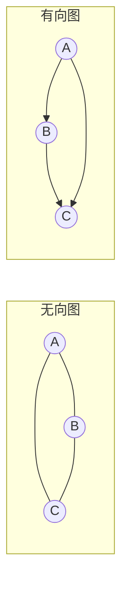
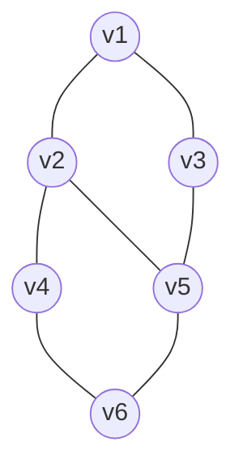
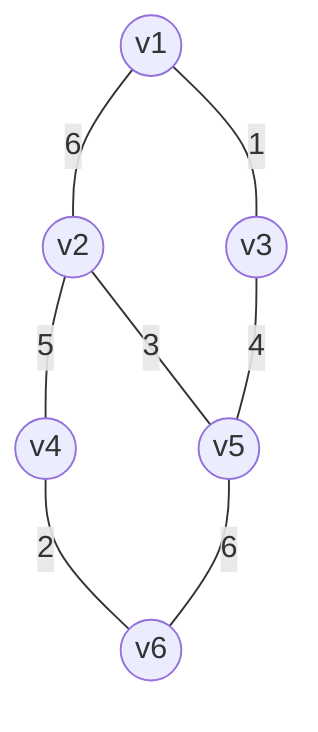
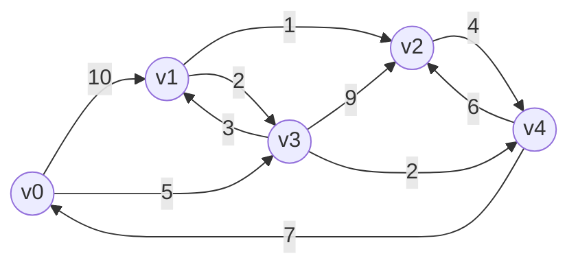
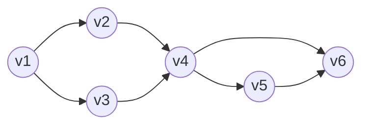
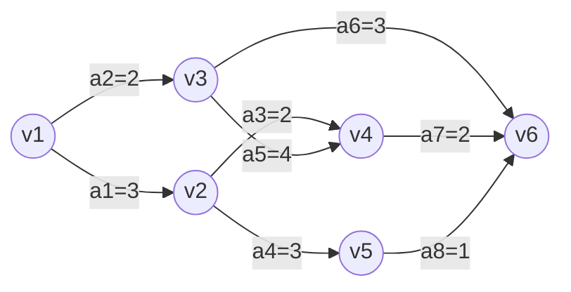

# 第 6 章：图

> 本章是 408 数据结构的**重点章节**（重要度 ⭐⭐⭐⭐⭐），与第 5 章并列两大 ⭐⭐⭐⭐⭐ 之一，也是综合应用题的常客——**Dijkstra/Prim/Kruskal 的逐步推演、给定邻接表写 DFS/BFS 序列、拓扑排序与关键路径计算**几乎每年至少命中其一。选择题高频考点包括：完全图边数公式、度与边数的关系、邻接矩阵/邻接表的性质与空间复杂度、遍历序列合法性、MST 的性质。图与前一章关系密切：BFS 就是树的层序遍历的推广（队列辅助，见[第 3 章（栈和队列）](03-stack-and-queue.md)），DFS 与树的先序遍历思想一致，生成树" $n$ 个顶点 $n-1$ 条边"沿用树的性质，Kruskal 判环直接复用第 5 章的并查集。本章建议投入 **8-10 小时**，重点是"概念公式背熟、四大算法（BFS/DFS、Prim/Kruskal、Dijkstra/Floyd、拓扑排序）代码能手写、推演过程能一步步写表"。树的基础请先复习[第 5 章（树与二叉树）](05-tree-and-binary-tree.md)。

---

## 6.1 图的基本概念

### 6.1.1 图的定义

**图（Graph）** $G$ 由**顶点集** $V$ 和**边集** $E$ 组成，记为 $G = (V, E)$ ，其中 $V$ 是顶点的非空有限集合， $E$ 是顶点之间关系（边/弧）的集合。

- **无向边**：用圆括号 $(v, w)$ 表示， $(v, w) = (w, v)$ ，连接的两个顶点间没有方向之分；
- **有向边（弧）**：用尖括号 $\langle v, w \rangle$ 表示， $\langle v, w \rangle \neq \langle w, v \rangle$ ，表示从 $v$ **指向** $w$ ， $v$ 称为**弧尾**， $w$ 称为**弧头**。

**简单图**：不存在重复边、不存在自环（顶点到自身的边）的图。408 讨论的图默认是简单图。



### 6.1.2 完全图

| 图的类型 | 定义 | 边数公式 |
|---------|------|---------|
| **无向完全图** | 任意两个顶点之间**都恰有一条边** | $e = \dfrac{n(n-1)}{2}$ |
| **有向完全图** | 任意两个顶点之间**都存在方向相反的两条弧** | $e = n(n-1)$ |

> 推导（无向）：每个顶点与其他 $n-1$ 个顶点各连一条边，共 $n(n-1)$ 次计数，但每条边被两个端点各数了一次，故除以 2。有向图中每对顶点贡献 2 条弧，所以是 $n(n-1)$ 。选择题常考："一个有 28 条边的无向完全图有几个顶点？"——解 $\frac{n(n-1)}{2} = 28$ ， $n = 8$ 。

### 6.1.3 度、入度、出度与边数的关系

| 概念 | 定义 | 适用 |
|------|------|------|
| **度 TD(v)** | 依附于顶点 $v$ 的边的条数 | 无向图 |
| **入度 ID(v)** | 以 $v$ 为**弧头**的弧的条数 | 有向图 |
| **出度 OD(v)** | 以 $v$ 为**弧尾**的弧的条数 | 有向图 |

有向图中顶点 $v$ 的度 $TD(v) = ID(v) + OD(v)$ 。

**边数与度的关系（必背）**：

- 无向图：每条边被两个端点各计一次，故

$$
e = \frac{1}{2} \sum_{i=1}^{n} d_i
$$

- 有向图：每条弧恰贡献 1 个出度（弧尾）和 1 个入度（弧头），故

$$
\sum ID = \sum OD = e
$$

> 例：无向图有 6 个顶点，度数依次为 2, 2, 3, 3, 4, 4，则边数 $= (2+2+3+3+4+4)/2 = 9$ 。此类题是选择题送分题，但**务必记得除以 2**——漏除是最常见错误。另外由此可推：任何图中**度为奇数的顶点必有偶数个**（握手定理）。

### 6.1.4 连通性

**无向图**：

| 概念 | 定义 |
|------|------|
| **连通** | 从 $v$ 到 $w$ 存在路径，则称 $v$ 和 $w$ 连通 |
| **连通图** | 图中**任意两个顶点**都连通 |
| **连通分量** | 无向图中的**极大连通子图**（"极大"指不能再加入任何顶点和边仍保持连通） |

- 连通图只有 **1 个**连通分量；非连通图有多个连通分量。
- $n$ 个顶点的连通图**至少**有 $n - 1$ 条边（与树的性质一致，见[第 5 章](05-tree-and-binary-tree.md) 5.1.3）。

**有向图**：

| 概念 | 定义 |
|------|------|
| **强连通** | 从 $v$ 到 $w$ **且**从 $w$ 到 $v$ 都存在路径 |
| **强连通图** | 任意两个顶点都强连通 |
| **强连通分量** | 有向图中的**极大强连通子图** |

> 易错点：有向图中"从 $v$ 能到 $w$"不等于强连通，必须**双向可达**。判断题常设陷阱："有向图连通"这一说法本身不严谨，有向图讨论的是**强连通**；若只要求单向可达，称为（单向）连通。

### 6.1.5 稀疏图、稠密图、网、路径与回路

| 概念 | 说明 |
|------|------|
| **稀疏图** | 边数 $e$ 远小于完全图边数（如 $e < n \log n$ 量级） |
| **稠密图** | 边数接近完全图边数 |
| **网** | 边上带**权值**的图（带权图），权可表示距离、代价、时间等 |
| **路径** | 顶点 $v_p$ 到 $v_q$ 的顶点序列，相邻顶点间均有边 |
| **路径长度** | 路径上**边的条数**（带权图中也可指权值之和） |
| **回路（环）** | 起点与终点相同的路径 |
| **简单路径** | 路径上顶点**不重复**出现 |
| **简单回路** | 除起点终点相同外，其余顶点不重复的回路 |

**有向树**：一个有向图恰有一个顶点的入度为 0（根），其余顶点入度均为 1，则称其为**有向树**。它是树的有向图表示——对比第 5 章树的定义：除根外每个结点恰有一条来自双亲的边。

> 408 提示：判断"$n$ 个顶点的图是树"的充要条件是"连通且恰有 $n-1$ 条边"（无向图）。若只说"$n-1$ 条边"不保证连通（可能是森林），只说"连通"不保证无环。

### 6.1.6 生成树与生成森林

**生成树（Spanning Tree）**：连通图的**极小连通子图**，包含图中**全部 $n$ 个顶点**和足以构成树的 **$n - 1$ 条边**。

性质：

1. 生成树**不含回路**（含回路则删去一条边仍连通，不是"极小"）；
2. 生成树**必须连通**（不连通则不是"连通子图"）；
3. 在生成树中去掉任一条边 → 不连通；加上任一条原图的边 → 形成回路；
4. **非连通图没有生成树**，只有**生成森林**——每个连通分量各有一棵生成树。

> 生成树是 6.4 节**最小生成树**的基础：在所有生成树中边权之和最小者即 MST。"极小连通子图"四个字要拆开记——"极小"对应无环（边数 $n-1$ ），"连通"对应不断开。

---

## 6.2 图的存储结构

### 6.2.1 邻接矩阵

用一维数组存顶点信息，二维数组 $Edge[i][j]$ 存边的信息：

$$
Edge[i][j] = \begin{cases} 1, & \text{若 } (v_i, v_j) \text{ 或 } \langle v_i, v_j \rangle \text{ 是图中的边} \\ 0 \text{（或 } \infty \text{）}, & \text{否则} \end{cases}
$$

带权图（网）中 $Edge[i][j]$ 存边的权值，无边处存 $\infty$ 。

```c
#define MaxVertexNum 100
#define INFINITY 32767            // 用最大 int 值近似表示 ∞
typedef char VertexType;          // 顶点数据类型
typedef int EdgeType;             // 边权数据类型

typedef struct {
    VertexType Vex[MaxVertexNum];            // 顶点表
    EdgeType Edge[MaxVertexNum][MaxVertexNum]; // 邻接矩阵（边表）
    int vexnum, arcnum;                      // 当前顶点数和边数
} MGraph;
```

**性质（选择题高频）**：

| 性质 | 无向图 | 有向图 |
|------|--------|--------|
| 矩阵形状 | 关于主对角线**对称** | 一般不对称 |
| 第 $i$ 行元素之和 | 顶点 $i$ 的**度** | 顶点 $i$ 的**出度** |
| 第 $j$ 列元素之和 | 顶点 $j$ 的度 | 顶点 $j$ 的**入度** |
| 对角线元素 | 全 0（简单图无自环） | 全 0 |

**空间复杂度** $O(n^2)$ （复杂度记号分析见[第 1 章（绪论）](01-introduction.md)）：无论边有多少，都要存 $n^2$ 个元素，因此**适合稠密图**。无向图对称矩阵可只存下三角，空间减半。

> **408 考点——邻接矩阵的幂**：设 $A$ 为图 $G$ 的邻接矩阵，则 $A^n$ （矩阵 $n$ 次幂）中元素 $a_{ij}$ 的值等于**从顶点 $i$ 到顶点 $j$ 长度为 $n$ 的路径条数**。例： $A^2$ 中 $a_{ij}$ 表示 $i$ 到 $j$ 长度为 2 的路径条数；无向图中 $tr(A^3)/6$ 等于图中**三角形**的个数（每个三角形被 3 个顶点、2 个方向各数一次，共 6 次）。这是近年选择题的新宠，记住"$A^n$ 数长度为 $n$ 的路径"这一条即可。

### 6.2.2 邻接表

对每个顶点建立一个**单链表**，链表中存放该顶点的所有邻接点。顶点表结点含 `data` 与指向链表首结点的指针 `first`；边表结点含邻接点下标 `adjvex` 与指向下一个边表结点的指针 `next`（网的边表结点另加权值域）。

```c
#define MaxVertexNum 100
typedef struct ArcNode {              // 边表结点
    int adjvex;                       // 该弧/边指向的邻接顶点下标
    struct ArcNode *next;             // 指向下一条边表结点的指针
    // InfoType *info;                // 网的边权值（可选）
} ArcNode;

typedef struct VNode {                // 顶点表结点
    VertexType data;                  // 顶点信息
    ArcNode *first;                   // 指向第一条依附该顶点的边
} VNode, AdjList[MaxVertexNum];

typedef struct {
    AdjList vertices;                 // 邻接表
    int vexnum, arcnum;               // 顶点数和边数
} ALGraph;
```

**空间复杂度**：

- 无向图：顶点表 $O(|V|)$ + 边表 $2|E|$ 个结点 → 总空间 $O(|V| + |E|)$ ；
- 有向图：顶点表 $O(|V|)$ + 边表 $|E|$ 个结点 → 总空间 $O(|V| + |E|)$ 。

**特点与适用**：

1. **适合稀疏图**——边少时只存实际存在的边，不像邻接矩阵那样浪费；
2. 邻接表中顶点的邻接点顺序**取决于建表时的插入方式**：通常用**头插法**，则邻接点顺序是输入顺序的**逆序**（6.8 例 1 直接考这一点）；
3. 求某顶点的**度**很方便（数链表长度）；但求**有向图某顶点的入度**必须扫描所有顶点的边表， $O(|V| + |E|)$ ，**很不方便**——这正是引入十字链表的原因；
4. 判断任意两顶点间是否有边需遍历链表，不如邻接矩阵 $O(1)$ 快。

### 6.2.3 十字链表（有向图，了解）

**十字链表**是有向图的链式存储，把邻接表与**逆邻接表**合并：每条弧只在链表中存一次，但既能通过出边链找到，也能通过入边链找到。

```c
typedef struct ArcNode2 {             // 弧结点
    int tailvex, headvex;             // 弧尾、弧头顶点下标
    struct ArcNode2 *hlink, *tlink;   // 弧头相同链、弧尾相同链
    // InfoType *info;                // 弧的权值（可选）
} ArcNode2;

typedef struct VNode2 {               // 顶点结点
    VertexType data;
    ArcNode2 *firstin, *firstout;     // 第一条入弧、第一条出弧
} VNode2;
```

- `firstout` 链把所有**出弧**串起来（等价于邻接表）→ 求出度方便；
- `firstin` 链把所有**入弧**串起来（等价于逆邻接表）→ **求入度方便**；
- 空间 $O(|V| + |E|)$ 。

### 6.2.4 邻接多重表（无向图，了解）

邻接表存储无向图时，每条边 $(v, w)$ 要在 $v$ 和 $w$ 的链表中各存一次，共 $2|E|$ 个结点；若需**对边进行操作**（如删除某条边），必须同时修改两处，不便。**邻接多重表**让每条边只存一个结点：

```c
typedef struct ENode {                // 边结点
    int ivex, jvex;                   // 该边依附的两个顶点下标
    struct ENode *ilink, *jlink;      // 分别指向依附 ivex、jvex 的下一条边
    // InfoType *info;                // 边权（可选）
} ENode;

typedef struct VNode3 {               // 顶点结点
    VertexType data;
    ENode *firstedge;                 // 第一条依附该顶点的边
} VNode3;
```

### 6.2.5 四种存储结构对比

| 存储结构 | 适用图类型 | 空间 | 求度 | 判断边存在 | 408 地位 |
|---------|-----------|------|------|-----------|---------|
| 邻接矩阵 | **稠密图** | $O(|V|^2)$ | 行和即度， $O(n)$ | $O(1)$ | 重点 |
| 邻接表 | **稀疏图** | $O(|V|+|E|)$ | 链表长度 | 遍历链表 | 重点 |
| 十字链表 | 有向图 | $O(|V|+|E|)$ | 出度入度都方便 | — | 了解 |
| 邻接多重表 | 无向图 | $O(|V|+|E|)$ | 同邻接表 | — | 了解 |

> 选择口诀：**稠密用矩阵，稀疏用链表；有向要入度，十字链表看；边上做操作，多重表出现**。邻接矩阵与邻接表是本章所有算法代码的基础，务必掌握。

---

## 6.3 图的遍历（本章核心）

遍历是指从图中某顶点出发，按某条搜索路径访问图中**其余每个顶点恰好一次**。由于图可能有回路且任一顶点都可作起点，遍历必须借助**访问标记数组** `visited[]` 防止重复访问。

### 6.3.1 广度优先搜索（BFS）

**思想**：从起点 $v$ 出发访问后，**先访问 $v$ 的所有未访问邻接点**，再按这些邻接点的先后顺序依次访问它们的邻接点——"由近及远、逐层扩展"。借助**队列**（FIFO）保证访问顺序（队列实现见[第 3 章（栈和队列）](03-stack-and-queue.md)）。

```c
bool visited[MaxVertexNum];          // 全局访问标记数组

// 从顶点 v 出发的一次 BFS
void BFS(ALGraph G, int v) {
    visit(v);                        // 访问顶点 v
    visited[v] = true;
    SqQueue Q;                       // 辅助队列，见第 3 章
    InitQueue(&Q);
    EnQueue(&Q, v);                  // v 入队
    while (!QueueEmpty(Q)) {
        DeQueue(&Q, &v);             // 队头顶点出队
        for (ArcNode *p = G.vertices[v].first; p != NULL; p = p->next) {
            int w = p->adjvex;       // v 的邻接顶点 w
            if (!visited[w]) {       // 未访问过
                visit(w);
                visited[w] = true;
                EnQueue(&Q, w);      // w 入队，稍后扩展
            }
        }
    }
}

// 全图遍历：非连通图需外层循环逐个连通分量调用
void BFSTraverse(ALGraph G) {
    for (int i = 0; i < G.vexnum; i++)
        visited[i] = false;          // 初始化标记数组
    for (int i = 0; i < G.vexnum; i++)
        if (!visited[i])             // i 未被访问 → 新的连通分量起点
            BFS(G, i);
}
```

**复杂度**：

| 存储结构 | 时间复杂度 | 说明 |
|---------|-----------|------|
| 邻接表 | $O(|V| + |E|)$ | 每个顶点出队一次（ $|V|$ ），每条边被检查一次（ $|E|$ ） |
| 邻接矩阵 | $O(|V|^2)$ | 每个顶点都要扫描一整行 $n$ 个元素 |

空间复杂度 $O(|V|)$ （队列与 visited 数组）。

**BFS 的两个重要应用**：

1. **求无权图的单源最短路径**：BFS 逐层扩展，顶点第一次被访问时经过的层数即最短距离。在代码中增加 `d[w] = d[v] + 1`（w 首次入队时记录）即可得到从起点到各顶点的最少边数。**这条性质只对无权图成立**——带权图要用 6.5 节的 Dijkstra。
2. **BFS 生成树/森林**：BFS 过程中每次"经边 $(v, w)$ 首次发现 $w$"所经过的边构成一棵树。连通图的 BFS 产生一棵**生成树**（ $n$ 个顶点 $n-1$ 条边）；非连通图产生**生成森林**。DFS 同理产生 DFS 生成树/森林。

### 6.3.2 深度优先搜索（DFS）

**思想**：从起点 $v$ 出发访问后，**选 $v$ 的第一个未访问邻接点深入下去**，直到走到尽头（当前顶点的所有邻接点都已访问），再**回溯**到上一个还有未访问邻接点的顶点继续——"不撞南墙不回头"。递归实现天然利用系统调用栈。

```c
// 从顶点 v 出发的一次 DFS（递归）
void DFS(ALGraph G, int v) {
    visit(v);                        // 访问顶点 v
    visited[v] = true;
    for (ArcNode *p = G.vertices[v].first; p != NULL; p = p->next) {
        int w = p->adjvex;           // v 的邻接顶点 w
        if (!visited[w])             // w 未访问 → 递归深入
            DFS(G, w);
    }
}

// 全图遍历：处理非连通图 / 非强连通有向图
void DFSTraverse(ALGraph G) {
    for (int i = 0; i < G.vexnum; i++)
        visited[i] = false;
    for (int i = 0; i < G.vexnum; i++)
        if (!visited[i])
            DFS(G, i);
}
```

**复杂度**：与 BFS 完全相同——邻接表 $O(|V| + |E|)$ ，邻接矩阵 $O(|V|^2)$ ；空间 $O(|V|)$ （递归栈深度最坏 $|V|$ ）。

**DFS 与图的连通性判定**：

- 从某顶点出发做一次 DFS，若访问到的顶点数 $= n$ ，图连通；否则不连通，调用 DFS 的**总次数恰等于连通分量个数**（无向图）；
- 由此可设计算法：统计连通分量个数、判断图是否连通、找连通分量包含的顶点集。

> BFS 与 DFS 对比：BFS 用**队列**、按"层"扩展，适合找最短路径（无权图）；DFS 用**递归（栈）**、沿一条路深入，适合连通性判定与拓扑排序（6.6 节可用 DFS 逆序实现）。两者都必须有 `visited` 数组，且非连通图都要**外层循环**保证每个连通分量都被访问——这是算法题常设的扣分点。

### 6.3.3 遍历序列推演（邻接表 + 头插法的陷阱）

遍历序列**不唯一**：取决于存储结构中邻接点的排列顺序。以下面的无向图 $G$ 为例：



其邻接表（注意：建表用头插法时，边表内顺序是输入顺序的**逆序**，本表直接给出最终形态）：

| 顶点 | 边表（从 first 起） |
|------|-------------------|
| v1 | v3 → v2 |
| v2 | v5 → v4 → v1 |
| v3 | v5 → v1 |
| v4 | v6 → v2 |
| v5 | v6 → v3 → v2 |
| v6 | v5 → v4 |

> 细节：若输入边的顺序是 $(v_1, v_2), (v_1, v_3)$ ，头插法下 v1 的边表是 **v3 → v2**（后插的 v3 排在前面）。选择题常给"输入边的顺序"让推演遍历序列，此时必须先还原出真实的边表顺序再推。

从 v1 出发：**DFS 序列为 $v_1, v_3, v_5, v_6, v_4, v_2$ ；BFS 序列为 $v_1, v_3, v_2, v_5, v_4, v_6$** 。完整推演见 6.8 例 1。

---

## 6.4 最小生成树（MST）

### 6.4.1 MST 的定义与性质

对带权**连通图**（网），边权之和**最小**的生成树称为**最小生成树（Minimum Spanning Tree, MST）**。

**MST 性质（切割性质，简述）**：设 $N = (V, E)$ 是一个连通网， $U$ 是 $V$ 的真子集。若边 $(u, v) \in E$ （ $u \in U, v \in V - U$ ）是所有跨越切割 $(U, V-U)$ 的边中**权值最小**的一条，则必存在一棵 MST 包含 $(u, v)$ 。

> 直观理解：要把集合 $U$ 和外部连通起来，至少得用一条跨界边；用其中最短的那条必然不亏。Prim 与 Kruskal 都是这条性质的应用。

**重要结论**：

1. MST **不唯一**（存在等权边时往往多棵），但**边权之和唯一**（各棵 MST 权值和相同）；
2. MST 含 $n$ 个顶点、 $n - 1$ 条边，不含回路；
3. 若图的所有边权**互不相同**，则 MST **唯一**。

### 6.4.2 Prim 算法（加点法，适合稠密图）

**思想**：从任一顶点 $v_0$ 出发，初始集合 $U = \{v_0\}$ ；每次从所有"一端在 $U$ 内、一端在 $U$ 外"的边中选**权值最小**的一条 $(u, v)$ ，把 $v$ 并入 $U$ ；重复直到 $U = V$ 。共选 $n - 1$ 条边。

用数组 `lowcost[j]` 维护"顶点 $j \in V-U$ 到 $U$ 的最小边权"，`lowcost[j] = -1` 表示 $j$ 已并入 $U$ ：

```c
// Prim 算法：从 v0 出发求 MGraph 的最小生成树
void Prim(MGraph G, int v0) {
    int lowcost[MaxVertexNum];
    int v;
    lowcost[v0] = -1;                        // -1 表示该顶点已并入 U
    for (int i = 0; i < G.vexnum; i++)       // 初始化：以 v0 的出边赋初值
        if (i != v0)
            lowcost[i] = G.Edge[v0][i];
    for (int i = 1; i < G.vexnum; i++) {     // 还要并入 n-1 个顶点
        int min = INFINITY;
        for (int j = 0; j < G.vexnum; j++)   // ① 在 V-U 中选 lowcost 最小的顶点 v
            if (lowcost[j] != -1 && lowcost[j] < min) {
                min = lowcost[j];
                v = j;
            }
        // 将 v 并入 U，(lowcost[v] 对应的边) 加入 MST
        lowcost[v] = -1;
        for (int j = 0; j < G.vexnum; j++)   // ② 用 v 的出边更新其余 V-U 顶点
            if (lowcost[j] != -1 && G.Edge[v][j] < lowcost[j])
                lowcost[j] = G.Edge[v][j];
    }
}
```

**复杂度分析**：外层循环 $n-1$ 趟，每趟两个内层循环各扫 $n$ 个顶点 → 时间 $O(|V|^2)$ ，**与边数无关**，故**适合稠密图**。空间 $O(|V|)$ 。

> 若要输出 MST 的每条边，可增加数组 `adjvex[j]` 记录"lowcost[j] 这条边在 $U$ 一侧的端点"，并入 $v$ 时输出边 $(adjvex[v], v)$ 。推演例题见 6.8 例 2。

### 6.4.3 Kruskal 算法（加边法，适合稀疏图）

**思想**：把所有边按权值**从小到大排序**；依次考察每条边，若其两个端点**当前不在同一连通分量**（加入后不会成环），则选入 MST，否则丢弃；选够 $n - 1$ 条边为止。

"判断是否成环"用**并查集**（Union-Find，见[第 5 章（树与二叉树）](05-tree-and-binary-tree.md) 5.8 节）：初始时每个顶点自成一个集合；选中一条边就 Union 它的两个端点；若 Find 发现两端点同根，说明加入该边会成环，舍弃。

```c
typedef struct {
    int a, b;                     // 边的两个端点
    int weight;                   // 边权
} Edge;

// Kruskal 算法：edges 已按 weight 升序排序
void Kruskal(ALGraph G, Edge edges[]) {
    Init(G.vexnum);               // 并查集初始化，见第 5 章
    int cnt = 0;                  // 已选边数
    for (int i = 0; i < G.arcnum; i++) {
        if (Find(edges[i].a) != Find(edges[i].b)) {  // 两端点不在同一集合 → 不成环
            Union(edges[i].a, edges[i].b);           // 合并集合，该边入 MST
            cnt++;
        }
        if (cnt == G.vexnum - 1)  // 已选 n-1 条边，MST 完成
            break;
    }
}
```

**复杂度分析**：排序 $O(|E| \log |E|)$ 是主导，并查集操作近似 $O(1)$ → 总时间 $O(|E| \log |E|)$ ，**与顶点数关系小**，故**适合稀疏图**。

### 6.4.4 Prim 与 Kruskal 对比

| 对比项 | Prim | Kruskal |
|--------|------|---------|
| 策略 | 加点（从一棵树逐步长大） | 加边（从森林逐步合并） |
| 时间复杂度 | $O(|V|^2)$ | $O(|E| \log |E|)$ |
| 适用 | **稠密图** | **稀疏图** |
| 判环机制 | 天然不成环（只在 $U$ 与 $V-U$ 间连边） | 并查集判断 |
| 起点 | 任选起点，结果权值和相同 | 与起点无关 |

> 易错点：两种算法得到的 MST **可能不同**（等权边选择不同），但权值和相同。选择题曾考"Prim 从不同起点得到的 MST 是否相同"——树形可能不同，权值和必然相同。

---

## 6.5 最短路径

### 6.5.1 Dijkstra 算法（单源，不能有负权边）

**问题**：求从源点 $v_0$ 到**其余每个顶点**的最短路径（单源最短路径）。

**思想（贪心）**：维护集合 $S$ （已确定最短路径的顶点）。初始 $S = \{v_0\}$ ；每次从 $V - S$ 中选 **`dist` 最小**的顶点 $v$ 并入 $S$ ，再用 $v$ 对其余顶点**松弛**：若 `dist[v] + Edge[v][w] < dist[w]` ，则更新 `dist[w] = dist[v] + Edge[v][w]` 。重复 $n - 1$ 趟。

三个辅助数组的含义（必考）：

| 数组 | 含义 |
|------|------|
| `dist[w]` | 当前从 $v_0$ 到 $w$ 的最短路径长度（确定后不再改变） |
| `path[w]` | 最短路径上 $w$ 的**前驱顶点**（沿 path 回溯可得完整路径） |
| `final[w]` | 1 表示 $w$ 的最短路径已确定（已并入 $S$ ） |

```c
// Dijkstra 算法：求 G 中源点 v0 到其余顶点的最短路径
void Dijkstra(MGraph G, int v0) {
    int dist[MaxVertexNum], path[MaxVertexNum], final[MaxVertexNum];
    // ① 初始化
    for (int i = 0; i < G.vexnum; i++) {
        dist[i] = G.Edge[v0][i];           // 初值 = v0 到 i 的直接边权
        final[i] = 0;
        path[i] = -1;                      // 暂无前驱
        if (dist[i] < INFINITY)
            path[i] = v0;                  // 有直达边 → 前驱为 v0
    }
    dist[v0] = 0;
    final[v0] = 1;                         // v0 并入 S
    path[v0] = -1;
    // ② 主循环：依次确定其余 n-1 个顶点
    for (int i = 1; i < G.vexnum; i++) {
        int min = INFINITY, v = v0;
        for (int j = 0; j < G.vexnum; j++)         // 在 V-S 中选 dist 最小的 v
            if (!final[j] && dist[j] < min) {
                min = dist[j];
                v = j;
            }
        final[v] = 1;                              // v 并入 S
        for (int j = 0; j < G.vexnum; j++)         // 用 v 松弛其余顶点
            if (!final[j] && G.Edge[v][j] < INFINITY &&
                dist[v] + G.Edge[v][j] < dist[j]) {
                dist[j] = dist[v] + G.Edge[v][j];
                path[j] = v;                       // j 的前驱改为 v
            }
    }
}
```

**复杂度**：两重循环各 $O(|V|)$ ，共 $n-1$ 趟 → 时间 $O(|V|^2)$ ，空间 $O(|V|)$ 。与边数无关，适合稠密图；稀疏图可用堆优化到 $O(|E| \log |V|)$ （了解）。

> **为什么不能有负权边**：Dijkstra 的正确性依赖"已确定（final=1）的顶点距离不再变小"。若存在负权边，可能出现"绕道经过负权边反而更短"的情况，破坏贪心前提。例： $v_0 \to v_1$ 权 2， $v_0 \to v_2$ 权 3， $v_2 \to v_1$ 权 $-5$ ：Dijkstra 会先确定 $dist[v_1] = 2$ ，而真实最短路是 $v_0 \to v_2 \to v_1 = -2$ 。选择题常以反例形式考查，结论必背：**Dijkstra 不能处理带负权边的图**。

### 6.5.2 Floyd 算法（多源，可含负权边）

**问题**：求**每对顶点之间**的最短路径（多源最短路径）。

**思想（动态规划）**：依次尝试每个顶点 $k$ 作为**中转点**，若经 $k$ 中转能让 $i \to j$ 更短，就更新：

```c
// Floyd 算法：A[i][j] 最终为 i 到 j 的最短距离，Path[i][j] 记录中转点
void Floyd(MGraph G) {
    int A[MaxVertexNum][MaxVertexNum];
    int Path[MaxVertexNum][MaxVertexNum];
    // ① 初始化：A 为邻接矩阵，Path 全 -1
    for (int i = 0; i < G.vexnum; i++)
        for (int j = 0; j < G.vexnum; j++) {
            A[i][j] = G.Edge[i][j];
            Path[i][j] = -1;
        }
    // ② 三重循环：k 必须是最外层
    for (int k = 0; k < G.vexnum; k++)
        for (int i = 0; i < G.vexnum; i++)
            for (int j = 0; j < G.vexnum; j++)
                if (A[i][k] + A[k][j] < A[i][j]) {
                    A[i][j] = A[i][k] + A[k][j];
                    Path[i][j] = k;        // i→j 经过中转点 k
                }
}
```

**要点**：

1. 时间 $O(|V|^3)$ ，空间 $O(|V|^2)$ ；
2. **k 循环必须放在最外层**——保证第 $k$ 趟时"允许以 $v_0 \sim v_k$ 作中转"的状态已算好；
3. **允许负权边**，但**不允许负权回路**（负权回路使路径长度可以无限小，最短路径不存在）；
4. Floyd 可求多源最短路，对每个源点跑一次 Dijkstra 也是 $O(|V|^3)$ ，但 Floyd 代码更简洁，且能处理负权边。

### 6.5.3 两种最短路径算法对比

| 对比项 | Dijkstra | Floyd |
|--------|----------|-------|
| 问题 | 单源最短路径 | 每对顶点间最短路径（多源） |
| 时间复杂度 | $O(|V|^2)$ | $O(|V|^3)$ |
| 负权边 | ❌ 不允许 | ✅ 允许（但不能有负权回路） |
| 思想 | 贪心（逐步确定最近顶点） | 动态规划（逐步放开中转点） |
| 辅助结构 | dist / path / final | A（距离矩阵）/ Path（中转矩阵） |

> 选择口诀：**单源无负权用 Dijkstra，多源或含负权边用 Floyd**。

---

## 6.6 拓扑排序

### 6.6.1 AOV 网

**AOV 网（Activity On Vertex）**：用**顶点表示活动**、用有向边 $\langle v_i, v_j \rangle$ 表示"活动 $v_i$ 必须先于活动 $v_j$ 进行"的**有向无环图（DAG）**。

- AOV 网**不能有回路**：若 $v_1 \to v_2 \to \cdots \to v_1$ ，则每个活动都要求对方先完成，陷入死锁（如"先有鸡还是先有蛋"）；
- AOV 网中顶点没有权值，权值加在**边上**的模型叫 AOE 网（6.7 节）。

**拓扑序列**：将 AOV 网所有顶点排成线性序列，使得对图中任一边 $\langle v_i, v_j \rangle$ ，序列中 $v_i$ 都排在 $v_j$ 之前。

### 6.6.2 拓扑排序算法（完整代码）

**算法思想**：

1. 统计所有顶点的**入度**；
2. 选一个入度为 0 的顶点输出；
3. 删除该顶点及其出边——把它所有后继的入度减 1，新出现入度为 0 的顶点入栈（队）；
4. 重复 2-3，直到不存在入度为 0 的顶点。

```c
// 拓扑排序：成功返回 true（输出顶点数 = vexnum），有环返回 false
bool TopSort(ALGraph G) {
    int indegree[MaxVertexNum] = {0};
    int count = 0;                    // 已输出顶点数
    SqStack S;                        // 存放入度为 0 的顶点（用队列亦可）
    InitStack(&S);
    // ① 遍历所有边，统计各顶点入度
    for (int i = 0; i < G.vexnum; i++)
        for (ArcNode *p = G.vertices[i].first; p != NULL; p = p->next)
            indegree[p->adjvex]++;
    // ② 入度为 0 的顶点入栈
    for (int i = 0; i < G.vexnum; i++)
        if (indegree[i] == 0)
            Push(&S, i);
    // ③ 循环：输出 → 后继入度减 1 → 新零入度入栈
    while (!StackEmpty(S)) {
        int v;
        Pop(&S, &v);
        printf("%d ", v);             // 输出拓扑序列的一个顶点
        count++;
        for (ArcNode *p = G.vertices[v].first; p != NULL; p = p->next) {
            int w = p->adjvex;
            if (!(--indegree[w]))     // 后继 w 入度减 1，减为 0 则入栈
                Push(&S, w);
        }
    }
    return count == G.vexnum;         // 输出数 < vexnum 说明有环
}
```

**复杂度**：统计入度扫所有边 $O(|E|)$ ，主循环每个顶点出栈一次、每条边处理一次 $O(|V| + |E|)$ → 总时间 $O(|V| + |E|)$ ，空间 $O(|V|)$ 。

### 6.6.3 检测环与序列不唯一

**用拓扑排序检测环**：若算法结束时输出的顶点数 $< n$ （存在剩余顶点入度始终不为 0），则图中**必有回路**；反之输出全部 $n$ 个顶点则图为 DAG。这是判定有向图是否有环的经典方法。

**拓扑序列不唯一**：任一时刻可能有多个入度为 0 的顶点，选择顺序不同则序列不同。此外：

- 若拓扑序列**唯一**，则图中每对相邻顶点之间都有边（可证：否则这两个无前驱约束的顶点可交换位置）；
- DFS 也可求拓扑序列：对 DAG 做 DFS，按**回溯（完成）时刻的逆序**输出顶点即为一个拓扑序列（了解）。

---

## 6.7 AOE 网与关键路径

### 6.7.1 AOE 网

**AOE 网（Activity On Edge）**：用**顶点表示事件**、用**带权有向边表示活动**（权 = 活动持续时间）的有向无环图。

- **源点**：入度为 0 的事件（工程开始）；**汇点**：出度为 0 的事件（工程结束），正常 AOE 网各只有一个；
- 工程总工期 = 从源点到汇点的**最长路径长度**（所有活动完成所需的最短时间）。

### 6.7.2 四个时间参数（ve / vl / e / l）

| 参数 | 含义 | 计算方向与公式 |
|------|------|---------------|
| $ve(k)$ | 事件 $k$ 的**最早**发生时间 | 按**拓扑序**正向推： $ve(k) = \max\{ ve(j) + w_{j,k} \}$ （取最长，保证所有前置活动完成），源点 $ve = 0$ |
| $vl(k)$ | 事件 $k$ 的**最晚**发生时间（不拖延工期） | 按**逆拓扑序**反向推： $vl(k) = \min\{ vl(j) - w_{k,j} \}$ （取最短，保证所有后继不误点），汇点 $vl = ve(汇点)$ |
| $e(i)$ | 活动 $i$ （边 $\langle j, k \rangle$ ）的**最早**开始时间 | $e(i) = ve(j)$ |
| $l(i)$ | 活动 $i$ 的**最晚**开始时间 | $l(i) = vl(k) - w_{j,k}$ |

**关键活动**：满足 $e(i) = l(i)$ （即时间余量 $l - e = 0$ ）的活动——它**没有任何推迟余地**，一旦拖延就拖累整个工程。

**关键路径**：从源点到汇点的**最长路径**，路径上所有活动都是关键活动。关键路径长度 = 工程最短工期。

> 计算步骤口诀：**先拓扑排序 → 正向求 ve（取 max）→ 反向求 vl（取 min）→ 逐边算 e 和 l → e = l 的边连起来即关键路径**。推演例题见 6.8 例 7。

### 6.7.3 关键路径的性质（两个陷阱）

1. **关键路径可能不唯一**：多条路径同为最长时都是关键路径；
2. **缩短某关键活动不一定能缩短工期**：若该活动只位于**某一条**关键路径上，而其他关键路径长度不变，则总工期由剩余的最长路径决定，缩短它无济于事——只有**缩短所有关键路径的公共部分**（或把各关键路径都缩短）才能压缩工期；
3. 反之，非关键活动若拖延超过余量 $l - e$ ，也会变成新的瓶颈，产生新的关键路径。

> 408 判断题高频："加快关键活动一定能提前工期"——**错误**，见第 2 条。正确说法是：只有当某条路径是**唯一**关键路径、或缩短的是所有关键路径的**公共活动**时，工期才一定缩短。

---

## 6.8 典型例题

**例 1**（给定邻接表写 DFS/BFS 序列）：无向图 $G$ （见 6.3.3 的图）的邻接表为：

| 顶点 | 边表（从 first 起） |
|------|-------------------|
| v1 | v3 → v2 |
| v2 | v5 → v4 → v1 |
| v3 | v5 → v1 |
| v4 | v6 → v2 |
| v5 | v6 → v3 → v2 |
| v6 | v5 → v4 |

从 v1 出发，分别写出 DFS 与 BFS 遍历序列。

**解**：

**DFS 推演**（规则：访问当前顶点 → 按边表顺序取第一个未访问邻接点深入，无路可走则回溯）：

| 步骤 | 当前顶点 | 操作 | 已输出 |
|------|---------|------|--------|
| 1 | v1 | 访问 v1，边表首邻接点 v3 未访问 → 深入 | v1 |
| 2 | v3 | 访问 v3，首邻接点 v5 未访问 → 深入 | v1 v3 |
| 3 | v5 | 访问 v5，首邻接点 v6 未访问 → 深入 | v1 v3 v5 |
| 4 | v6 | 访问 v6，邻接点 v5 已访问、v4 未访问 → 深入 v4 | v1 v3 v5 v6 |
| 5 | v4 | 访问 v4，邻接点 v6 已访问、v2 未访问 → 深入 v2 | v1 v3 v5 v6 v4 |
| 6 | v2 | 访问 v2，邻接点 v5、v4、v1 均已访问 → 回溯 | v1 v3 v5 v6 v4 v2 |
| 7 | 回溯至 v1 | 所有顶点已访问 → 结束 | — |

$$
\text{DFS 序列} = v_1 \ v_3 \ v_5 \ v_6 \ v_4 \ v_2
$$

**BFS 推演**（规则：出队即访问，并把其未访问邻接点按边表顺序依次入队）：

| 步骤 | 操作 | 队列（队头 → 队尾） | 已输出 |
|------|------|--------------------|--------|
| 1 | v1 入队后出队访问，邻接点 v3、v2 入队 | v3 v2 | v1 |
| 2 | v3 出队访问，邻接点 v5 入队（v1 已访问） | v2 v5 | v1 v3 |
| 3 | v2 出队访问，邻接点 v5 已入队、v4 入队（v1 已访问） | v5 v4 | v1 v3 v2 |
| 4 | v5 出队访问，邻接点 v6 入队（v3、v2 已访问） | v4 v6 | v1 v3 v2 v5 |
| 5 | v4 出队访问，邻接点 v6、v2 均已访问 | v6 | v1 v3 v2 v5 v4 |
| 6 | v6 出队访问，邻接点 v5、v4 均已访问 → 队空结束 | 空 | v1 v3 v2 v5 v4 v6 |

$$
\text{BFS 序列} = v_1 \ v_3 \ v_2 \ v_5 \ v_4 \ v_6
$$

> 关键细节：邻接表由**头插法**建立时，边表顺序是输入顺序的**逆序**。若题目给的是"依次输入边 $(v_1,v_2), (v_1,v_3)$ "，则 v1 的边表是 v3 → v2，DFS 第二步走的是 **v3** 而不是 v2——这是选择题设置错误选项的经典手法。

---

**例 2**（Prim 算法推演）：对下图带权无向图，从 v1 出发用 Prim 算法求 MST，写出每步选择的边与总权值。



**解**：维护 `lowcost`（V-U 中各顶点到 U 的最小边权，括号内为 U 一侧端点）：

| 步骤 | 并入顶点 v | 选中边 | lowcost：v2 | v4 | v5 | v6 |
|------|-----------|--------|-------------|-----|-----|-----|
| 初始（U={v1}） | — | — | 6(v1) | ∞ | ∞ | ∞ |
| 1 | v3 | (v1, v3) = 1 | 6(v1) | ∞ | 4(v3) | ∞ |
| 2 | v5 | (v3, v5) = 4 | 3(v5) | ∞ | — | 6(v5) |
| 3 | v2 | (v5, v2) = 3 | — | 5(v2) | — | 6(v5) |
| 4 | v4 | (v2, v4) = 5 | — | — | — | 2(v4) |
| 5 | v6 | (v4, v6) = 2 | — | — | — | — |

MST 的边集： $(v_1,v_3), (v_3,v_5), (v_5,v_2), (v_2,v_4), (v_4,v_6)$ ，共 $6 - 1 = 5$ 条边，总权值：

$$
1 + 4 + 3 + 5 + 2 = 15
$$

> 注意第 2 步并入 v5 后，v2 的 lowcost 由 6(v1) **更新**为 3(v5)、v6 由 ∞ 更新为 6(v5)——这正是 Prim 算法步骤②"用新并入顶点更新其余顶点的 lowcost"的作用。漏更新是手推时最常见的错误。

---

**例 3**（Kruskal 算法推演）：用例 2 的图，用 Kruskal 算法求 MST，写出选边/弃边过程（并查集判环）。

**解**：先把 7 条边按权升序排列，依次考察：

| 步骤 | 考察边 | 权值 | 端点所在集合 | 决策 | 合并后集合 |
|------|--------|------|-------------|------|-----------|
| 1 | (v1, v3) | 1 | {v1} / {v3} 不同集 | ✅ 选 | {v1,v3}, {v2}, {v4}, {v5}, {v6} |
| 2 | (v4, v6) | 2 | {v4} / {v6} 不同集 | ✅ 选 | {v1,v3}, {v2}, {v4,v6}, {v5} |
| 3 | (v2, v5) | 3 | {v2} / {v5} 不同集 | ✅ 选 | {v1,v3}, {v2,v5}, {v4,v6} |
| 4 | (v3, v5) | 4 | {v1,v3} / {v2,v5} 不同集 | ✅ 选 | {v1,v2,v3,v5}, {v4,v6} |
| 5 | (v2, v4) | 5 | {v1,v2,v3,v5} / {v4,v6} 不同集 | ✅ 选（已够 5 条边，完成） | 全部连通 |
| 6 | (v1, v2) | 6 | 同集 | ❌ 弃（会成环） | — |
| 7 | (v5, v6) | 6 | 同集 | ❌ 弃（会成环） | — |

MST 总权值 $= 1 + 2 + 3 + 4 + 5 = 15$ ，与例 2 的 Prim 结果相同（权值和唯一），但边集不同——例 2 选了 $(v_5,v_2)$ 和 $(v_2,v_4)$ 之外还有 $(v_3,v_5)$ ，本例另选了 $(v_4,v_6)$ 的时机更早，两棵 MST **形态不同、权值和相同**，印证"MST 不唯一但权值和唯一"。

> Kruskal 推演只需盯住一件事：**两端点是否同根**（并查集 Find）。同根必弃，异根必选，与顶点当前"长成了什么样"无关——这比 Prim 更不易出错。

---

**例 4**（Dijkstra 每步推演）：对下图带权有向图，用 Dijkstra 算法求从 v0 到其余各顶点的最短路径，写出每步的 dist 变化。



**解**：初始 $dist = [0, 10, \infty, 5, \infty]$ （对应 v0~v4）， $S = \{v_0\}$ ，path：v1←v0，v3←v0。每步选 V-S 中 dist 最小者并入 S，再松弛：

| 步骤 | 选中顶点（并入 S） | dist[v1] | dist[v2] | dist[v3] | dist[v4] | 更新说明 |
|------|-------------------|----------|----------|----------|----------|---------|
| 初始 | v0（源点） | 10 | ∞ | 5 | ∞ | 直达边赋初值 |
| 1 | **v3**（5 最小） | **8**（5+3） | **14**（5+9） | 5✓ | **7**（5+2） | v3 松弛 v1、v2、v4 |
| 2 | **v4**（7 最小） | 8 | **13**（7+6） | 5✓ | 7✓ | v4 松弛 v2（13 < 14） |
| 3 | **v1**（8 最小） | 8✓ | **9**（8+1） | 5✓ | 7✓ | v1 松弛 v2（9 < 13） |
| 4 | **v2**（9 最小） | 8✓ | 9✓ | 5✓ | 7✓ | v2 松弛 v4：9+4=13 > 7 不更新 |

最终结果（沿 path 回溯）：

| 终点 | 最短路径 | 长度 |
|------|---------|------|
| v3 | v0 → v3 | 5 |
| v4 | v0 → v3 → v4 | 7 |
| v1 | v0 → v3 → v1 | 8 |
| v2 | v0 → v3 → v1 → v2 | 9 |

> 观察第 2 步：v4（7）先于 v1（8）确定——**dist 小的先确定**是贪心的核心。第 1 步 v1 的 dist 从 10 被 v3 松弛到 8，说明"直达不一定最短"；第 4 步 v2 对 v4 的松弛无效（13 > 7），已确定的顶点不再被更新。

---

**例 5**（Floyd 迭代推演）：有向图 3 个顶点 v1、v2、v3，邻接矩阵（∞ 用 $-$ 表示）：

$$
D^{(0)} = \begin{bmatrix} 0 & 4 & 11 \\ 6 & 0 & 2 \\ 3 & - & 0 \end{bmatrix}
$$

用 Floyd 算法求每对顶点的最短距离，写出每趟迭代后的矩阵。

**解**：第 $k$ 趟允许以 $v_k$ 作中转（本题顶点编号从 1 起）：

**$k = 1$ （允许经 v1 中转）**：考察所有 $D[i][1] + D[1][j] < D[i][j]$ ：

- $D[3][2]$ ： $D[3][1] + D[1][2] = 3 + 4 = 7 < -$ （∞）→ 更新为 7；
- 其余均不更优（如 $D[2][3] = 2 < 6 + 11$ ）。

$$
D^{(1)} = \begin{bmatrix} 0 & 4 & 11 \\ 6 & 0 & 2 \\ 3 & 7 & 0 \end{bmatrix}
$$

**$k = 2$ （允许经 v2 中转）**：

- $D[1][3]$ ： $D[1][2] + D[2][3] = 4 + 2 = 6 < 11$ → 更新为 6（路径 v1 → v2 → v3）；
- 其余不更优。

$$
D^{(2)} = \begin{bmatrix} 0 & 4 & 6 \\ 6 & 0 & 2 \\ 3 & 7 & 0 \end{bmatrix}
$$

**$k = 3$ （允许经 v3 中转）**：

- $D[2][1]$ ： $D[2][3] + D[3][1] = 2 + 3 = 5 < 6$ → 更新为 5（路径 v2 → v3 → v1）；
- $D[1][2]$ ： $D[1][3] + D[3][2] = 6 + 7 = 13 > 4$ → 不更新；
- 其余不更优。

$$
D^{(3)} = \begin{bmatrix} 0 & 4 & 6 \\ 5 & 0 & 2 \\ 3 & 7 & 0 \end{bmatrix}
$$

最终每对顶点最短距离即 $D^{(3)}$ 。如 v1 → v3 的最短距离为 6，路径 v1 → v2 → v3。

> 推演技巧：第 $k$ 趟只看"第 $k$ 行 + 第 $k$ 列"组合，逐个检验 $D[i][k] + D[k][j]$ 。注意 $D^{(1)}$ 中新算出的 7（v3→v2 经 v1）在 $k=2$ 趟中**可以继续参与计算**——因为 $k=2$ 时允许的中转点集合是 $\{v_1, v_2\}$ ，这正是 k 循环必须在最外层的原因。

---

**例 6**（拓扑排序过程推演）：AOV 网如下图所示，用拓扑排序算法（队列版，入度为 0 的顶点按编号升序入队）求拓扑序列，并说明若有环算法如何发现。



**解**：初始入度：v1:0，v2:1，v3:1，v4:2，v5:1，v6:2。

| 步骤 | 操作 | 队列（队头 → 队尾） | 输出序列 | 入度变化 |
|------|------|--------------------|---------|---------|
| 1 | v1 入队，出队输出 | 空 | v1 | v2:1→0 入队，v3:1→0 入队 |
| 2 | v2 出队输出 | v3 | v1 v2 | v4:2→1 |
| 3 | v3 出队输出 | 空 | v1 v2 v3 | v4:1→0 入队 |
| 4 | v4 出队输出 | 空 | v1 v2 v3 v4 | v5:1→0 入队，v6:2→1 |
| 5 | v5 出队输出 | 空 | v1 v2 v3 v4 v5 | v6:1→0 入队 |
| 6 | v6 出队输出 | 空 | v1 v2 v3 v4 v5 v6 | — |

输出顶点数 $= 6 = n$ → 该图无环。一个拓扑序列为：

$$
v_1 \ v_2 \ v_3 \ v_4 \ v_5 \ v_6
$$

**不唯一性**：步骤 1 后 v2、v3 同时入度为 0，若先输出 v3 则得序列 $v_1 \ v_3 \ v_2 \ v_4 \ v_5 \ v_6$ ，同样合法。

**环的检测**：若在图中加入边 $\langle v_6, v_1 \rangle$ ，则 v1 入度变 1，初始无任何入度为 0 的顶点，算法一个顶点也输出不了（count = 0 < 6）即结束，返回 false——**输出顶点数小于 $n$ 即判有环**。

---

**例 7**（关键路径 ve/vl/e/l 计算）：AOE 网如下（顶点为事件，边为活动，权为持续时间）：



求各事件 ve/vl、各活动 e/l，指出关键活动与关键路径、工程最短工期。

**解**：

**第一步，按拓扑序正向求 ve（取 max）**：拓扑序 v1, v2, v3, v4, v5, v6。

| 事件 | 计算 | ve |
|------|------|-----|
| v1 | 源点 | 0 |
| v2 | ve(v1) + 3 = 3 | 3 |
| v3 | ve(v1) + 2 = 2 | 2 |
| v4 | max(ve(v2)+2, ve(v3)+4) = max(5, 6) | **6** |
| v5 | ve(v2) + 3 = 6 | 6 |
| v6 | max(ve(v4)+2, ve(v3)+3, ve(v5)+1) = max(8, 5, 7) | **8** |

**第二步，按逆拓扑序反向求 vl（取 min）**：令 vl(v6) = ve(v6) = 8。

| 事件 | 计算 | vl |
|------|------|-----|
| v6 | 汇点 | 8 |
| v5 | vl(v6) − 1 = 7 | 7 |
| v4 | vl(v6) − 2 = 6 | 6 |
| v3 | min(vl(v4)−4, vl(v6)−3) = min(2, 5) | **2** |
| v2 | min(vl(v4)−2, vl(v5)−3) = min(4, 4) | **4** |
| v1 | min(vl(v2)−3, vl(v3)−2) = min(1, 0) | **0** |

**第三步，逐活动求 e 与 l**（活动 ai 为边 $\langle j, k \rangle$ ： $e = ve(j)$ ， $l = vl(k) - w$ ）：

| 活动 | 边 | 权 w | e(i) | l(i) | l − e | 是否关键 |
|------|-----|------|------|------|-------|---------|
| a1 | ⟨v1, v2⟩ | 3 | ve(v1) = 0 | vl(v2) − 3 = 1 | 1 | 否 |
| a2 | ⟨v1, v3⟩ | 2 | ve(v1) = 0 | vl(v3) − 2 = 0 | 0 | **是** |
| a3 | ⟨v2, v4⟩ | 2 | ve(v2) = 3 | vl(v4) − 2 = 4 | 1 | 否 |
| a4 | ⟨v2, v5⟩ | 3 | ve(v2) = 3 | vl(v5) − 3 = 4 | 1 | 否 |
| a5 | ⟨v3, v4⟩ | 4 | ve(v3) = 2 | vl(v4) − 4 = 2 | 0 | **是** |
| a6 | ⟨v3, v6⟩ | 3 | ve(v3) = 2 | vl(v6) − 3 = 5 | 3 | 否 |
| a7 | ⟨v4, v6⟩ | 2 | ve(v4) = 6 | vl(v6) − 2 = 6 | 0 | **是** |
| a8 | ⟨v5, v6⟩ | 1 | ve(v5) = 6 | vl(v6) − 1 = 7 | 1 | 否 |

**第四步，找关键路径**：关键活动（ $e = l$ ）为 a2、a5、a7，首尾相接得到关键路径：

$$
v_1 \to v_3 \to v_4 \to v_6 \quad (\text{长度 } 2 + 4 + 2 = 8)
$$

工程最短工期 $= ve(v_6) = 8$ 。验算：关键路径长度 $= 8 = vl(v_6)$ ✓；关键路径上各事件 ve 与 vl 相等（v1:0=0，v3:2=2，v4:6=6，v6:8=8）——这是判断关键路径的等价标准。

> 本例只有**一条**关键路径，因此缩短 a2、a5、a7 中**任一**活动都能缩短工期；但缩短 a6（余量 3，最多缩 3 个单位）对工期毫无影响——它不在最长路径上。若题目再增加一条权为 8 的 v1 → v6 直达路径，则出现两条关键路径，此时只缩短其中一条上的活动已不能缩短工期（见 6.7.3 陷阱 2）。

---

### 常见陷阱清单

1. **度数求边数忘记除以 2**：无向图 $e = \frac{1}{2}\sum d_i$ ，每条边被两个端点各数一次；有向图则是 $\sum ID = \sum OD = e$ ，不需除 2。选择题常在无向图上漏除、有向图上多除。
2. **邻接矩阵行和的含义**：无向图第 $i$ 行和 = 顶点 $i$ 的度；**有向图**第 $i$ 行和 = **出度**、第 $i$ 列和 = **入度**。把有向图行和当成"度"是经典错误。
3. **遍历序列依赖存储结构**：同一张图的 DFS/BFS 序列**不唯一**，取决于邻接点排列顺序；邻接表用头插法建立时，邻接点顺序是输入顺序的**逆序**。题目给"输入边的顺序"时必须先还原边表再推演。
4. **非连通图漏外层循环**：BFS/DFS 从一个起点出发只能访问所在连通分量，全图遍历必须有 `for` 外层循环检查每个未访问顶点。算法题漏写这个循环是最常见扣分点。
5. **MST 唯一性混淆**：MST **可能不唯一**，但**权值和唯一**；边权互不相同时 MST 才唯一。Prim 与 Kruskal 可能选出不同的树，权值和必然相同。
6. **适用场景记反**：Prim $O(|V|^2)$ 与边数无关 → **稠密图**；Kruskal $O(|E| \log |E|)$ 依赖边数 → **稀疏图**。口诀"稠密 Prim、稀疏 Kruskal"。
7. **负权边处理**：Dijkstra **不能**处理负权边（贪心前提被破坏）；Floyd **可以**处理负权边但**不能**有负权回路。"带负权边用 Dijkstra"是错误选项常客。
8. **Floyd 的 k 循环位置**：k（中转点）必须在**最外层**；i、j 顺序可换，k 不可移到内层，否则无法利用本轮刚更新的中间结果。
9. **拓扑排序漏减入度**：出队顶点后必须把它**所有后继**的入度减 1，新变为 0 的立即入栈（队）；只减部分后继会导致输出顶点数不足而误判有环。判环标准：**输出顶点数 < n**。
10. **关键路径的方向错误**：关键路径是源点到汇点的**最长**路径（不是最短！），工期 = 最长路径长度；且"缩短关键活动一定缩短工期"是**错误**说法（多条关键路径时未必）。

---

## 本章小结

### 核心要点回顾

1. **基本概念**：无向完全图边数 $\frac{n(n-1)}{2}$ ，有向完全图 $n(n-1)$ ；无向图 $e = \frac{1}{2}\sum d_i$ ，有向图 $\sum ID = \sum OD = e$ ；连通图至少 $n-1$ 条边；有向图讨论强连通（双向可达）。
2. **生成树**：连通图的极小连通子图， $n$ 个顶点 $n-1$ 条边，无回路；非连通图只有生成森林。
3. **存储**：邻接矩阵 $O(n^2)$ 适合稠密图（行和 = 度/出度，列和 = 入度， $A^n$ 数长度为 $n$ 的路径条数）；邻接表 $O(|V|+|E|)$ 适合稀疏图（头插法导致邻接点逆序，求入度不便）；十字链表（有向）、邻接多重表（无向）了解即可。
4. **遍历**：BFS（队列，逐层扩展，可求无权图单源最短路径）与 DFS（递归/栈，深入回溯）都需 visited 数组 + 非连通图外层循环；复杂度邻接表 $O(|V|+|E|)$ 、邻接矩阵 $O(|V|^2)$ ；遍历可生成生成树/森林、判定连通性。
5. **最小生成树**：MST 性质（切割性质）；Prim 加点法 $O(|V|^2)$ 适合稠密图；Kruskal 加边法 + 并查集判环 $O(|E| \log |E|)$ 适合稀疏图；MST 不唯一但权值和唯一。
6. **Dijkstra**：贪心，dist/path/final 三数组，每步选 dist 最小者并入 S 再松弛， $O(|V|^2)$ ；**不能处理负权边**。
7. **Floyd**：动态规划，三重循环（k 最外层）， $O(|V|^3)$ ；允许负权边、不允许负权回路；可求多源最短路。
8. **拓扑排序**：入度为 0 入队 → 出队输出 → 后继入度减 1， $O(|V|+|E|)$ ；输出数 < n 判有环；拓扑序列不唯一。
9. **关键路径**：AOE 网中 ve 按拓扑序取 max、vl 按逆拓扑序取 min；活动 $e = ve(弧尾)$ 、 $l = vl(弧头) - w$ ； $e = l$ 的活动是关键活动；关键路径是最长路径，可能不唯一，缩短关键活动不一定缩短工期。

### 考试重点排序

| 优先级 | 考点 | 题型 |
|--------|------|------|
| ⭐⭐⭐ | Dijkstra / Prim / Kruskal 逐步推演（dist/lowcost/选边表） | 综合题 + 选择题 |
| ⭐⭐⭐ | 给定邻接表写 DFS/BFS 序列（头插法逆序陷阱） | 选择题 |
| ⭐⭐⭐ | 基本概念计算（完全图边数、度与边数、连通分量个数） | 选择题 |
| ⭐⭐ | 拓扑排序过程与环的判定 | 选择题 + 综合题 |
| ⭐⭐ | 邻接矩阵/邻接表性质（行列和、空间复杂度、 $A^n$ 的含义） | 选择题 |
| ⭐⭐ | 关键路径 ve/vl/e/l 计算与关键活动判定 | 综合题 |
| ⭐ | Floyd 迭代过程、十字链表/邻接多重表 | 选择题 |

> 本章复习策略：**推演表是拿分核心**——Dijkstra 每步选点、Prim 每步更新 lowcost、Kruskal 每次判环这三张表要练到"看图就能画表"。代码层面，BFS/DFS 和拓扑排序最可能出现在算法设计题中（如"判断有向图是否有环""求无权图最短路径"），其余算法会画推演表即可。接下来进入[第 7 章（查找）](07-search.md)，BST/AVL 的递归结构与本章 DFS 思想相通；而[第 8 章（排序）](08-sorting.md)中的堆可用于 Dijkstra 优化，Kruskal 的边排序也会用到排序算法。

---

## 自测题

1. 一个有 8 个顶点的无向完全图有多少条边？若有向完全图有 56 条弧，顶点数是多少？
2. 有向图的邻接矩阵中，第 $i$ 行元素之和与第 $i$ 列元素之和分别表示什么？邻接矩阵的空间复杂度是多少，适合稠密图还是稀疏图？
3. 无向图的邻接表为：v1：v4 → v2，v2：v3 → v1，v3：v4 → v2，v4：v3 → v1。从 v1 出发写出 DFS 序列与 BFS 序列。
4. BFS 与 DFS 分别借助什么数据结构？在邻接表存储下时间复杂度是多少？对非连通图，一次 BFS/DFS 能否访问全部顶点？
5. 边权互不相同的连通网，其最小生成树是否唯一？Prim 和 Kruskal 分别适合稠密图还是稀疏图？Kruskal 如何判断加入一条边会不会成环？
6. 为什么 Dijkstra 算法不能处理带负权边的图？求含负权边的图的每对顶点间最短路径应使用什么算法，时间复杂度是多少？
7. 拓扑排序如何判断有向图是否有环？拓扑序列是否唯一？AOE 网中关键活动的判定条件是什么？

> **答案**：1. 无向完全图 $\frac{8 \times 7}{2} = 28$ 条边；有向完全图 $n(n-1) = 56$ ，解得 $n = 8$ 。2. 第 $i$ 行和 = 顶点 $i$ 的**出度**，第 $i$ 列和 = 顶点 $i$ 的**入度**；空间复杂度 $O(n^2)$ ，适合**稠密图**（稀疏图浪费空间，应选邻接表）。3. DFS：v1 → v4（v1 边表首邻接点）→ v3（v4 的首邻接点）→ v2，序列 **v1 v4 v3 v2**；BFS：v1 出队后 v4、v2 依次入队，v4 出队时 v3 入队，序列 **v1 v4 v2 v3**。4. BFS 借助**队列**，DFS 借助**栈（递归）**；邻接表下均为 $O(|V| + |E|)$ ；不能——一次遍历只覆盖一个连通分量，需外层循环对每个未访问顶点再调用。5. **唯一**（任意切割的最小跨界边唯一，MST 必含之，逐边确定）；Prim 适合稠密图、Kruskal 适合稀疏图；Kruskal 用**并查集**判断两端点是否同根——同根则成环舍弃，异根则合并选入。6. Dijkstra 基于贪心，假定"已确定的顶点距离不会再变小"；负权边可能使"绕道更短"，破坏该前提（例如 $v_0 \to v_1$ 权 2、 $v_0 \to v_2$ 权 3、 $v_2 \to v_1$ 权 $-5$ ，真实最短路 $v_0 \to v_2 \to v_1 = -2$ 但算法会先确定 $dist[v_1]=2$ ）；应使用 **Floyd** 算法，时间复杂度 $O(|V|^3)$ （但图中不能有负权回路）。7. 若算法结束时**输出的顶点数小于 $n$** ，则图中有环（存在入度始终不为 0 的顶点）；拓扑序列**不唯一**（任一时刻可能有多个入度为 0 的顶点）；关键活动的判定条件是 **$e(i) = l(i)$**（最早开始时间等于最晚开始时间，时间余量为 0）。