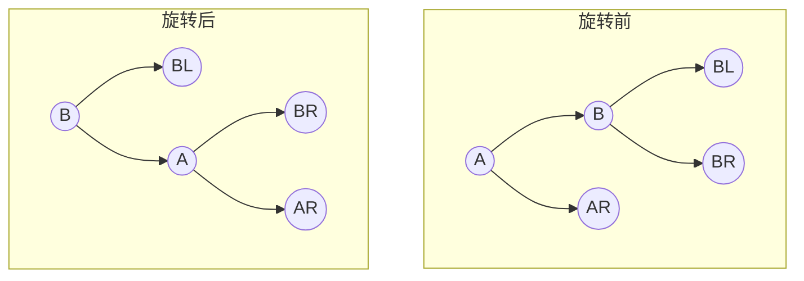
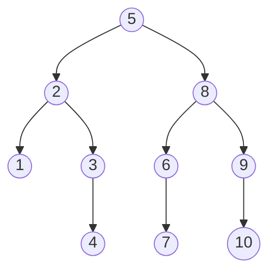
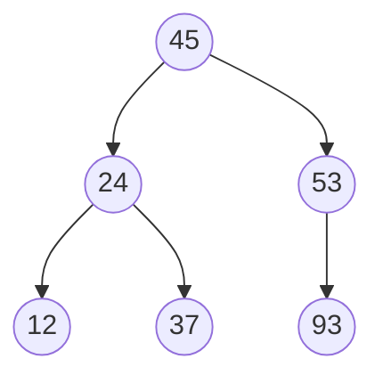
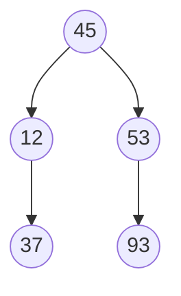
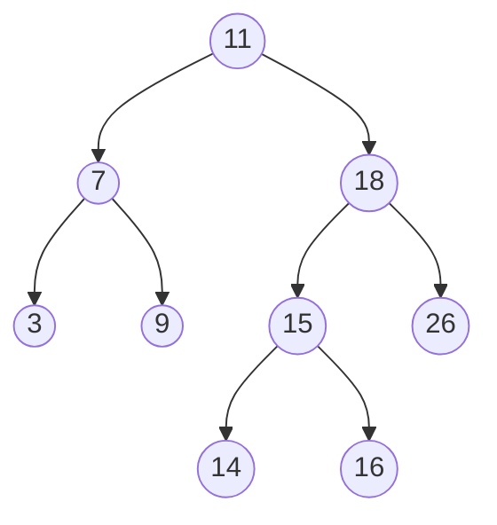
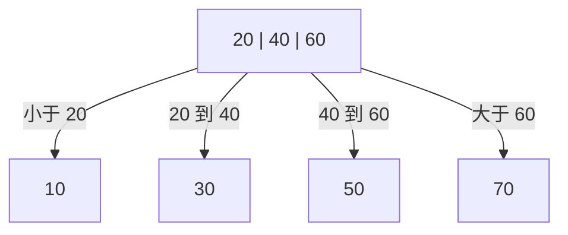

# 第 7 章：查找

> 本章是 408 数据结构的**重点章节**（重要度 ⭐⭐⭐⭐），综合应用题与选择题的双重高频区——**哈希表的构造与成功/不成功 ASL 计算、AVL 树的四种旋转、折半查找判定树、B 树的插入分裂与删除合并**几乎每年必考其一。选择题高频考点包括：ASL 的计算与比较、BST 的插入删除、B 树的高度与关键字数范围、装填因子与查找效率。本章的 BST、AVL 都是二叉树的特殊形态，B 树是多叉平衡树，全部建立在[第 5 章（树与二叉树）](05-tree-and-binary-tree.md)的基础之上：二叉树的性质、中序遍历、高度与深度的概念必须先复习扎实。本章内容与第 6 章图相对独立，时间紧张时可以先学本章再补图。建议投入 **6-8 小时**，重点是"ASL 会算、旋转会画、分裂合并会推演、哈希表会构造"。

---

## 7.1 查找的基本概念

### 7.1.1 查找表

**查找表（Search Table）** 是由**同一类型**的数据元素（或记录）构成的集合。集合中的每个元素称为一个**记录**，每个记录由若干数据项组成。

| 术语 | 定义 | 说明 |
|------|------|------|
| **关键字（Key）** | 记录中某个数据项的值，用于标识记录 | 可以是数值、字符，串的关键字处理见[第 4 章（串）](04-string.md) |
| **主关键字** | 能**唯一**标识一个记录的关键字 | 如学号、身份证号 |
| **次关键字** | 可能对应多个记录的关键字 | 如姓名、年龄 |
| **静态查找表** | 只做查找操作的查找表 | 结构固定，无需考虑插入删除 |
| **动态查找表** | 查找过程中还要插入/删除记录的表 | BST、AVL、B 树、哈希表都属于此类 |

> 408 中"查找"一章的所有结构都可归入两类：**静态查找**（顺序查找、折半查找、分块查找——结构不变，只比较）与**动态查找**（树表查找、散列查找——边查边改）。选择题常以此分类设置陷阱，例如"折半查找适用于动态查找表吗？"——不适用，折半查找要求表有序且顺序存储，插入删除代价高，通常视为静态查找。

### 7.1.2 平均查找长度 ASL

查找算法的**基本操作**是"将给定值与记录的关键字比较"，查找效率用**平均查找长度（Average Search Length, ASL）** 度量：

$$
ASL = \sum_{i=1}^{n} p_i \cdot c_i
$$

其中 $p_i$ 是查找第 $i$ 个记录的概率（等概率时 $p_i = 1/n$ ）， $c_i$ 是找到第 $i$ 个记录所需的比较次数。

**查找成功与查找失败的 ASL 必须分开计算**：

| 类型 | 含义 | 概率基数 |
|------|------|---------|
| 成功 ASL | 表中**存在**该关键字，找到为止 | 对 $n$ 个记录取平均 |
| 失败 ASL | 表中**不存在**该关键字，判定"查不到"为止 | 对失败情形分类取平均（分类数视方法而定） |

> 408 考法提示：题目若只说"求 ASL"，默认指**成功** ASL；若问"查找不成功时的 ASL"，必须单独算。哈希表的失败 ASL 按哈希地址分 $m$ 类（7.5 例 5），折半查找的失败 ASL 看判定树的外结点（7.2.4）——两者的"失败分类数"不同，是最常见的丢分点。

---

## 7.2 线性表的查找

### 7.2.1 顺序查找

**顺序查找（Sequential Search）** 是最基本的查找方法：从表的一端开始，逐个比较关键字，直到找到目标或遍历完整张表。它对存储结构没有要求（顺序表、链表均可），对关键字是否有序也没有要求。

**一般线性表的顺序查找**（哨兵写法，408 教材标准代码）：

```c
// 静态顺序查找表：元素存放在 elem[1..TableLen]，elem[0] 留作哨兵
typedef struct {
    ElemType *elem;        // 元素存储空间，下标 0 作哨兵
    int TableLen;          // 表的长度
} SSTable;

// 顺序查找：从后往前找，elem[0] 存待查关键字作哨兵
int Search_Seq(SSTable ST, ElemType key) {
    ST.elem[0] = key;                        // 哨兵：免去每步的越界判断
    for (int i = ST.TableLen; ST.elem[i] != key; --i)
        ;                                    // 从后向前逐个比较
    return i;                                // 返回 0 表示查找失败
}
```

> **哨兵的作用**：`elem[0] = key` 后，循环中**无需判断下标是否越界**——即使表中没有 key，循环也一定会在 $i = 0$ 处停下（哨兵与自身相等）。比较次数不变，但每趟循环少一个条件判断，且代码更简洁。选择题可能考"哨兵是否减少比较次数"——**不减少**，它只省去越界检查。

**ASL 分析**（等概率）：

| 情形 | 比较次数 | ASL |
|------|---------|-----|
| 成功：查到第 $i$ 个元素 | $n - i + 1$ （从后往前数） | $ASL_{成功} = \frac{n+1}{2}$ |
| 失败：遍历完仍没找到 | $n + 1$ （多比一次哨兵） | $ASL_{失败} = n + 1$ |

推导： $ASL_{成功} = \frac{1}{n}(n + (n-1) + \cdots + 1) = \frac{n+1}{2}$ 。失败时 $n$ 个元素都比完再比哨兵一次，共 $n + 1$ 次。

**判定树视角**：顺序查找可以画成一棵"判定树"——内部结点是表中的 $n$ 个元素（成功），叶子结点是 $n+1$ 种失败情形。一般线性表的判定树是一条链加 $n+1$ 片叶子，这也解释了为什么它的 ASL 是 $O(n)$ 。

### 7.2.2 有序表的顺序查找

若线性表**按关键字有序**，顺序查找可以在"确定不可能找到"时**提前终止**：一旦当前元素大于待查值（升序表），后面的元素必然更大，查找失败。

提前终止改变了**失败 ASL**。设有序表为 $a_1 < a_2 < \cdots < a_n$ ，失败共有 $n+1$ 个区间：

| 失败区间 | 比较次数 |
|---------|---------|
| $key < a_1$ | 1（与 $a_1$ 比一次即知失败） |
| $a_i < key < a_{i+1}$ （ $1 \leq i \leq n-1$ ） | $i + 1$ |
| $key > a_n$ | $n$ （与全部 $n$ 个元素比较） |

$$
ASL_{失败} = \frac{1 + 2 + \cdots + n + n}{n + 1} = \frac{n}{2} + \frac{n}{n+1} \approx \frac{n}{2}
$$

> 对比：一般线性表失败必须比完全部 $n$ 个元素再加哨兵（ $n+1$ 次），有序表失败平均只需约 $n/2$ 次。**成功 ASL 两者相同**，都是 $\frac{n+1}{2}$ ——有序性只加速了失败情形的判定。

### 7.2.3 折半查找

**折半查找（Binary Search）** 每次取表的**中间位置**与待查值比较，据比较结果把查找范围缩小一半。它有两个硬性前提：

1. **关键字有序**（升序或降序）；
2. **顺序存储**（需要按下标随机访问中间元素）。

```c
// 折半查找：表元素存于 elem[1..TableLen]，升序
int Binary_Search(SSTable ST, ElemType key) {
    int low = 1, high = ST.TableLen;        // 查找区间 [low, high]
    while (low <= high) {
        int mid = (low + high) / 2;         // 取中间位置
        if (ST.elem[mid] == key)
            return mid;                     // 查找成功，返回位置
        else if (ST.elem[mid] > key)
            high = mid - 1;                 // 目标在左半区间
        else
            low = mid + 1;                  // 目标在右半区间
    }
    return -1;                              // 区间为空，查找失败
}
```

**复杂度**：每比较一次，区间缩小一半，最多比较 $\lceil \log_2(n+1) \rceil$ 次，时间复杂度 $O(\log_2 n)$ 。

> 易错点：① 循环条件是 `low <= high` 而不是 `low < high` ——区间只剩一个元素时仍要比较；② **链表不能用折半查找**——取中间元素需要按下标随机访问，链表定位中间元素本身就要 $O(n)$ ，折半就失去了意义；③ 折半查找要求表有序，而维持有序需要插入/删除时移动大量元素，因此它**只适合静态查找表**。

### 7.2.4 折半查找的判定树

把折半查找的比较过程画成二叉树：每个**中间位置 mid 作为根**，左半区间的判定树作左子树，右半区间作右子树，递归构造，得到**折半查找判定树**。判定树是 408 的高频考点（画树 + 求 ASL，见 7.5 例 1）。

**判定树的性质**（ $n$ 个元素的有序表）：

1. 判定树是**唯一**的（给定 mid 取法 $\lfloor (low+high)/2 \rfloor$ 后形态确定）；
2. 判定树是一棵**二叉排序树**（左子树所有元素 < 根 < 右子树所有元素）；
3. **树高** $h = \lceil \log_2(n+1) \rceil$ （或等价地： $2^{h-1} - 1 < n \leq 2^h - 1$ ）；
4. 判定树**形态平衡**：任一结点的左右子树结点数之差不超过 1（因为 mid 把区间近似对半分）。它不一定是完全二叉树，但一定是"最平衡"的形态之一；
5. **成功 ASL** = 各结点所在层数之和 / $n$ ；当 $n = 2^h - 1$ （判定树为满二叉树）时有精确公式：

$$
ASL_{成功} = \frac{1}{n}\sum_{j=1}^{h} j \cdot 2^{j-1} = \frac{(h-1) \cdot 2^h + 1}{2^h - 1} \approx \log_2(n+1) - 1
$$

6. 失败情形对应判定树的 **$n+1$ 个外结点**（空指针位置），失败 ASL 按外结点的层数加权计算。

> 408 考法提示：**"折半查找判定树是平衡的"** 是选择题常见表述——同一层最多相差一层的两种深度，树高为 $\lceil \log_2(n+1) \rceil$ ，这也是折半查找时间复杂度为 $O(\log_2 n)$ 的直观来源。常考题型："对长度为 16 的有序表折半查找，最多比较几次？"—— $\lceil \log_2 17 \rceil = 5$ 次。

### 7.2.5 分块查找（索引顺序查找）

**分块查找（Blocking Search）** 是顺序查找与折半查找的折中：把表分成 $b$ 块，每块 $s$ 个元素（ $n = b \times s$ ），要求：

1. **块间有序**：第 $i$ 块的最大关键字小于第 $i+1$ 块的最小关键字；
2. **块内无序**：块内元素可以任意排列。

查找分两步：① 在**索引表**（每块存一个最大关键字）中确定目标块；② 在该块内顺序查找。

**ASL** = 索引查找的 ASL + 块内查找的 ASL：

| 索引查找方式 | $ASL$ | 最优块大小 |
|-------------|-------|-----------|
| 索引、块内均顺序查找 | $\frac{b+1}{2} + \frac{s+1}{2} = \frac{1}{2}\left(\frac{n}{s} + s\right) + 1$ | $s = \sqrt{n}$ 时最小， $ASL_{min} = \sqrt{n} + 1$ |
| 索引折半查找、块内顺序查找 | $\approx \log_2(b+1) - 1 + \frac{s+1}{2}$ | 无统一最优，视 $b, s$ 而定 |

> 分块查找的性能介于顺序查找与折半查找之间，优点是**插入删除只需在块内操作**，不必整体移动，适合动态表。最优块大小 $s = \sqrt{n}$ 的推导：对 $ASL(s) = \frac{1}{2}(\frac{n}{s} + s) + 1$ 求导令其为零即得。408 选择题常直接问"等分分块时块大小取多少 ASL 最小"——答 $\sqrt{n}$ 。

---

## 7.3 树形查找

### 7.3.1 二叉排序树（BST）

**二叉排序树（Binary Sort Tree, BST）** 或是空树，或是满足以下性质的二叉树：

1. 若**左子树**非空，则左子树上所有结点的值**小于**根结点的值；
2. 若**右子树**非空，则右子树上所有结点的值**大于**根结点的值；
3. 左、右子树本身也分别是二叉排序树。

由此可得两条重要性质：

- **中序遍历 BST 得到关键字递增的有序序列**（这是判定"给定二叉树是否为 BST"的实用方法）；
- 对同一组关键字，**插入顺序不同，BST 形态不同**（见 7.5 例 2）。

```c
// 二叉排序树结点定义
typedef struct BSTNode {
    int key;                          // 关键字
    struct BSTNode *lchild, *rchild;  // 左右孩子
} BSTNode, *BSTree;
```

**BST 查找**（非递归，从根出发"小往左走、大往右走"）：

```c
// 在 BST 中查找关键字 key，成功返回结点指针，失败返回 NULL
BSTNode *BST_Search(BSTree T, int key) {
    while (T != NULL && key != T->key) {
        if (key < T->key)
            T = T->lchild;       // 比根小 → 进入左子树
        else
            T = T->rchild;       // 比根大 → 进入右子树
    }
    return T;
}
```

查找路径即"从根到目标结点"的路径，比较次数 = 目标结点的层数。最好情况树是平衡的，比较次数 $O(\log_2 n)$ ；最坏情况树退化成**单支树**（如按递增序列插入），比较次数 $O(n)$ ——与顺序查找无异。

**BST 插入**（递归写法）：

```c
// 向 BST 中插入关键字 k：成功返回 1，已存在返回 0
// 注：BSTree &T 为 C++ 引用写法（408 认可 C/C++），纯 C 可改为 BSTree *T
int BST_Insert(BSTree &T, int k) {
    if (T == NULL) {                       // 找到空位，创建新结点
        T = (BSTree)malloc(sizeof(BSTNode));
        T->key = k;
        T->lchild = T->rchild = NULL;
        return 1;
    }
    if (k == T->key)                       // 关键字已存在，不重复插入
        return 0;
    else if (k < T->key)
        return BST_Insert(T->lchild, k);   // 插入左子树
    else
        return BST_Insert(T->rchild, k);   // 插入右子树
}
```

**BST 的构造**：对给定的关键字序列，**依次**调用插入算法即可构造一棵 BST。新插入的结点**总是叶子**（因为它沿查找路径走到空位才被创建）。由此引出一个重要结论：

| 插入序列特征 | 树形 | 查找性能 |
|-------------|------|---------|
| 随机顺序（理想） | 接近平衡 | 平均查找长度 $O(\log_2 n)$ |
| 有序（递增/递减） | **单支树** | 退化为 $O(n)$ |

**BST 删除**：删除结点 $p$ 后必须**保持 BST 性质**。按 $p$ 的孩子情况分三种：

| 情形 | 处理方法 |
|------|---------|
| ① $p$ 是**叶子** | 直接删除，双亲的对应指针置空 |
| ② $p$ **只有一个孩子** | 让 $p$ 的孩子"顶替" $p$ 的位置（直接挂到 $p$ 的双亲下） |
| ③ $p$ **有左右两个孩子** | 用 $p$ 的**中序前驱**（左子树中最右下的结点）或**中序后继**（右子树中最左下的结点）的值替换 $p$ ，再删除那个前驱/后继结点 |

情形 ③ 的正确性：中序前驱是"比 $p$ 小的最大值"，用它替换 $p$ 后，左子树所有值仍小于新根、右子树所有值仍大于新根，BST 性质保持。而前驱/后继结点**至多只有一个孩子**（前驱无右孩子、后继无左孩子），删除它归约为情形 ① 或 ②。

```c
// 从以 T 为根的 BST 中删除关键字 key：成功返回 1，未找到返回 0
int BST_Delete(BSTree &T, int key) {
    if (T == NULL)
        return 0;                              // 空树，删除失败
    if (key < T->key)
        return BST_Delete(T->lchild, key);     // 目标在左子树
    if (key > T->key)
        return BST_Delete(T->rchild, key);     // 目标在右子树
    // 找到待删结点 T，分三种情况
    if (T->lchild == NULL) {                   // 左空（含叶子）：右子树顶替
        BSTree q = T;
        T = T->rchild;
        free(q);
    } else if (T->rchild == NULL) {            // 右空：左子树顶替
        BSTree q = T;
        T = T->lchild;
        free(q);
    } else {                                   // 双孩子：中序前驱替代
        BSTree pre = T->lchild, parent = T;    // pre 找左子树最右下
        while (pre->rchild != NULL) {
            parent = pre;
            pre = pre->rchild;
        }
        T->key = pre->key;                     // 前驱值上移覆盖 T
        if (parent == T)                       // 前驱就是 T 的左孩子
            parent->lchild = pre->lchild;
        else
            parent->rchild = pre->lchild;      // 前驱的左子树接回
        free(pre);
    }
    return 1;
}
```

> 易错点：情形 ③ 若用**中序后继**替代，则后继的**右子树**（而非左子树）要接回。考试画图题两种替代都可能出现，动笔前先确认题目指定的是前驱还是后继。完整推演见 7.5 例 2。

### 7.3.2 平衡二叉树（AVL）

BST 的最坏形态是单支树，为此引入**平衡**约束。**平衡二叉树（AVL 树）** 或是空树，或是满足以下性质的二叉排序树：**任一结点的左子树与右子树的高度之差的绝对值不超过 1**。

**平衡因子（Balance Factor, BF）** = 该结点的**左子树高度 − 右子树高度**。AVL 树上每个结点的平衡因子只能是 $-1, 0, +1$ 。

```c
// AVL 树结点定义（比 BST 多一个高度域，便于维护平衡因子）
typedef struct AVLNode {
    int key;
    struct AVLNode *lchild, *rchild;
    int height;                        // 以该结点为根的子树高度
} AVLNode, *AVLTree;
```

**最小不平衡子树**：插入（或删除）一个结点后，以**距离插入位置最近的、平衡因子绝对值大于 1 的结点**为根的子树。AVL 的调整**只需在这棵最小不平衡子树内进行**——旋转后该子树高度恢复到插入前的高度，其祖先的平衡因子不受影响，整棵树重新平衡。这是 AVL 调整最重要的性质，选择题常考"插入后需要调整几棵子树"——**最多一棵**。

插入破坏平衡的情形按"插入位置"分为四种，对应四种旋转：

**① LL 型（左孩子的左子树插入）→ 右旋**

在结点 $A$ 的**左孩子 $B$ 的左子树**上插入，使 $A$ 失衡（ $BF(A) = +2$ ）。**右旋**： $B$ 上移为根， $A$ 成为 $B$ 的右孩子， $B$ 原来的右子树改挂为 $A$ 的左子树。



**② RR 型（右孩子的右子树插入）→ 左旋**

与 LL 完全对称：在 $A$ 的**右孩子 $B$ 的右子树**上插入（ $BF(A) = -2$ ），**左旋**： $B$ 上移为根， $A$ 成为 $B$ 的左孩子， $B$ 原来的左子树改挂为 $A$ 的右子树。

**③ LR 型（左孩子的右子树插入）→ 先左旋再右旋**

在 $A$ 的**左孩子 $B$ 的右子树**（设根为 $C$ ）上插入。**两步调整**：先对 $B$ **左旋**（转化为 LL 形态），再对 $A$ **右旋**，最终 $C$ 上移为根：

| 步骤 | 操作 | 结果 |
|------|------|------|
| 1 | 对 $B$ 左旋 | $C$ 取代 $B$ 成为 $A$ 的左孩子， $C$ 的左子树改挂为 $B$ 的右子树 |
| 2 | 对 $A$ 右旋 | $C$ 上移为根， $A$ 成为 $C$ 的右孩子， $C$ 的右子树改挂为 $A$ 的左子树 |

**④ RL 型（右孩子的左子树插入）→ 先右旋再左旋**

与 LR 对称：在 $A$ 的**右孩子 $B$ 的左子树**（根为 $C$ ）上插入。先对 $B$ **右旋**（转化为 RR 形态），再对 $A$ **左旋**，最终 $C$ 上移为根。

**四种旋转速查表**（必背）：

| 失衡类型 | 插入位置 | 调整方法 | 旋转后新根 |
|---------|---------|---------|-----------|
| LL | 左孩子的**左**子树 | 对失衡点**右旋** | 原左孩子 $B$ |
| RR | 右孩子的**右**子树 | 对失衡点**左旋** | 原右孩子 $B$ |
| LR | 左孩子的**右**子树 | 左孩子**左旋**，失衡点**右旋** | 原左孩子的右孩子 $C$ |
| RL | 右孩子的**左**子树 | 右孩子**右旋**，失衡点**左旋** | 原右孩子的左孩子 $C$ |

> 记忆口诀：**看失衡点的左/右孩子，再看新结点插在哪个孩子的哪一侧**——两次方向相同（LL/RR）就一次旋转，方向相异（LR/RL）就两次旋转，且**第一次旋转针对离插入点最近的失衡结点**。旋转的实质是**中序遍历序列不变**的前提下调整形态——旋转前后对树中序遍历结果完全一致（仍是有序序列），这也是旋转保持 BST 性质的原因。

**AVL 树的高度**：设 $N(h)$ 为高度 $h$ 的 AVL 树的**最少结点数**，则：

$$
N(h) = N(h-1) + N(h-2) + 1, \quad N(0) = 0, \; N(1) = 1
$$

（根 + 一棵高度 $h-1$ 的子树 + 一棵高度 $h-2$ 的子树，取最不平衡的合法形态。）该递推与斐波那契数列相关，由此可得 $n$ 个结点的 AVL 树高度为 $O(\log_2 n)$ （约不超过 $1.44 \log_2(n+1)$ ），因此 AVL 的查找、插入、删除都是 $O(\log_2 n)$ 。

> 完整构造推演（四种旋转各出现一次）见 7.5 例 3。

### 7.3.3 B 树（B-Tree）

BST/AVL 是二叉树，磁盘检索需要**多叉平衡树**——这就是 **B 树**。**$m$ 阶 B 树**（每个结点最多 $m$ 棵子树）满足以下五条性质：

| 编号 | 性质 |
|------|------|
| ① | 每个结点**至多有 $m$ 棵子树**（即至多 $m - 1$ 个关键字） |
| ② | 若根结点不是叶子，则**至少有 2 棵子树**（至少 1 个关键字） |
| ③ | 除根之外的所有非终端结点**至少有 $\lceil m/2 \rceil$ 棵子树**（至少 $\lceil m/2 \rceil - 1$ 个关键字） |
| ④ | 所有**叶子结点（失败结点，即空指针）都在同一层** |
| ⑤ | 结点结构为 $(n, P_0, K_1, P_1, K_2, P_2, \dots, K_n, P_n)$ ： $n$ 个关键字夹着 $n+1$ 棵子树， $P_i$ 所指子树的关键字介于 $K_i$ 与 $K_{i+1}$ 之间 |

> 408 考法提示：**B 树的"叶子结点"指失败结点（空指针所在层），不含任何关键字**；真正存放关键字的最低一层叫"终端结点"。题目说"3 阶 B 树所有叶子在同一层"，指的就是失败结点层。另外性质 ③ 的下限是 $\lceil m/2 \rceil$ 棵**子树**，换算成关键字要减 1——这个转换是选择题常见陷阱。

**B 树的高度与关键字数**：设 B 树含 $N$ 个关键字，高度 $h$ **不计失败结点层**（若计失败层则整体加 1），则：

$$
\lceil \log_m(N+1) \rceil \leq h \leq \left\lfloor \log_{\lceil m/2 \rceil} \frac{N+1}{2} \right\rfloor + 1
$$

- **下界**（最矮，所有结点都满）：失败结点共 $N + 1$ 个，每层最多按 $m$ 叉扩展， $m^h \geq N + 1$ ；
- **上界**（最高，所有结点都只装下限个关键字）：根 1 个关键字分裂出 2 棵子树，之后每层每结点至少 $\lceil m/2 \rceil$ 棵子树。

**含关键字数的上下界**（高度 $h$ **含失败层**的 $m$ 阶 B 树）：

| 界 | 公式 | 推导思路 |
|----|------|---------|
| 最多关键字 | $m^{h-1} - 1$ | 每层结点都装满 $m-1$ 个关键字，等比求和 |
| 最少关键字 | $2 \lceil m/2 \rceil^{h-2} - 1$ | 根 1 个关键字，其余结点都取下限 $\lceil m/2 \rceil - 1$ 个 |

> 例：3 阶 B 树高度为 4（含失败层）时，关键字最多 $3^3 - 1 = 26$ 个，最少 $2 \times 2^2 - 1 = 7$ 个。408 选择题常以"含 $N$ 个关键字的 $m$ 阶 B 树最大/最小高度"或"高度为 $h$ 的 B 树最多含多少关键字"出现，两个公式必须记牢。

**B 树的插入（满则分裂）**：插入总是在**终端结点**（含关键字的最低层）中进行：

1. 按查找路径找到应插入的终端结点，把新关键字按序插入；
2. 若该结点关键字数**未超过** $m - 1$ ，插入完成；
3. 若结点**溢出**（关键字达到 $m$ 个）则**分裂**：把 $m$ 个关键字排序后，取**正中间**（第 $\lceil m/2 \rceil$ 个）的关键字**上移**到双亲结点，左右两半各成一个新结点；
4. 上移可能引起双亲结点也溢出，**逐级向上分裂**，最坏波及根结点——根分裂后**树长高一层**。

分裂示意（3 阶 B 树，结点最多 2 个关键字）：结点 $[10, 30, 50]$ 溢出 → 中间关键字 $30$ 上移，分裂为 $[10]$ 与 $[50]$ 两个结点。

**B 树的删除（借兄弟 / 合并）**：

1. 若删除的关键字在**非终端结点**：先用它的**中序前驱或后继**（必在终端结点）替代，转化为在终端结点删除；
2. 终端结点删除后，若剩余关键字数仍 $\geq \lceil m/2 \rceil - 1$ ，删除完成；
3. 若**不足下限**：优先向**兄弟结点借**——兄弟关键字数多于下限时，双亲的分隔关键字"下移"补入本结点，兄弟的关键字"上移"补到双亲（**借一还一**，双亲不变）；
4. 兄弟也无富余则**合并**：本结点、兄弟结点、双亲中夹在两者之间的那个分隔关键字**三者合并**为一个结点。合并会使双亲少一个关键字，可能引发双亲也不足下限，**逐级向上传递**；若最终根被合并消失，**树降低一层**。

完整推演见 7.5 例 4。

### 7.3.4 B+ 树（了解）

**B+ 树**是 B 树的变体，广泛用于数据库索引（如 MySQL InnoDB 引擎）与文件系统。与 B 树的主要区别：

| 对比项 | B 树 | B+ 树 |
|--------|------|-------|
| 关键字分布 | 关键字分散在各层结点 | **所有关键字都出现在叶子层**，非叶结点只作索引（存子树的最大/最小关键字） |
| 叶子层 | 终端结点各自独立 | 叶子结点按关键字**从小到大链接成有序链表**，支持顺序扫描 |
| 关键字数与子树数 | $n$ 个关键字对应 $n + 1$ 棵子树 | $n$ 个关键字对应 $n$ 棵子树 |
| 查找方式 | 找到即终止 | 既可随机查找（走到叶子），也可**顺序查找**（沿叶子链表） |
| 删除位置 | 任意层删除 | 删除只发生在叶子层（非叶结点的关键字是索引副本） |

> 408 对 B+ 树只要求"了解区别"，典型选择题："下列关于 B+ 树的叙述中错误的是……"——抓住"所有关键字都在叶子层出现、叶子层有链表、非叶结点是索引副本"三点即可。B/B+ 树与数据库索引、文件系统索引的关联还会在操作系统文件管理部分再次出现。

---

## 7.4 散列表（哈希表）

### 7.4.1 基本概念

**散列表（Hash Table）** 根据关键字的**散列地址**直接访问存储位置，理想情况下查找时间为 $O(1)$ 。

- **散列函数** $H(key)$ ：把关键字映射为散列地址的函数；
- **散列存储**：以散列地址为下标存储记录；
- **冲突（Collision）**：两个不同关键字 $key_1 \neq key_2$ 却有 $H(key_1) = H(key_2)$ ；互为冲突的关键字互称**同义词**。

冲突不可能完全避免（关键字空间通常远大于地址空间），因此散列设计的核心是：**构造好的散列函数 + 设计好的冲突处理方法**。

### 7.4.2 散列函数的构造

构造原则：① 计算简单；② 地址分布尽量均匀，减少冲突。常用方法：

| 方法 | 公式 | 适用场景 |
|------|------|---------|
| **直接定址法** | $H(key) = a \cdot key + b$ （ $a, b$ 为常数） | 关键字分布连续、无冲突，如年龄 0~150 |
| **除留余数法** | $H(key) = key \bmod p$ | 最常用，408 必考 |
| 数字分析法 | 取关键字中分布均匀的若干位 | 关键字位数多且已知分布 |
| 平方取中法 | 取关键字平方值的中间几位 | 关键字分布未知时 |
| 折叠法 | 关键字分段叠加 | 关键字位数很长 |

**除留余数法的关键**： $p$ 必须取**不大于表长 $m$ 的质数**（或至少与 $m$ 互质的数），否则地址分布不均匀、冲突成倍增加。

> 例：表长 $m = 12$ ，若取 $p = 12$ （非质数），所有 $key \equiv 0 \pmod{12}$ 的关键字全部挤到地址 0；取质数 $p = 11$ 则均匀得多。**做题默认：表长为 $m$ 时， $p$ 取不超过 $m$ 的最大质数**（ $m = 7$ 时 $p = 7$ ， $m = 11$ 时 $p = 11$ ， $m = 15$ 时 $p = 13$ ）。

### 7.4.3 冲突处理：开放定址法

**开放定址法**：冲突时按某种探测序列在表内**另找空位**，通用公式：

$$
H_i = (H(key) + d_i) \bmod m, \quad i = 1, 2, \dots, m-1
$$

| 探测方法 | 增量序列 $d_i$ | 特点 |
|---------|---------------|------|
| **线性探测法** | $1, 2, 3, \dots, m-1$ | 实现最简单，但有**堆积（聚集）**现象 |
| **平方探测法**（二次探测） | $1^2, -1^2, 2^2, -2^2, \dots, k^2, -k^2$ （ $k \leq m/2$ ） | 减少堆积；要求表长 $m$ 为 $4k+3$ 形式的质数才能探测到所有位置 |
| **双散列法**（再散列） | $i \cdot H_2(key)$ ， $H_2$ 是第二个散列函数 | 探测序列与关键字相关，分布最均匀，计算代价最高 |

**堆积（聚集）现象**：线性探测中，发生冲突的记录连续堆积在一起，导致后续**即使哈希地址不同**的记录也要探测这片堆积区——堆积区越长，平均查找长度越大。平方探测与双散列就是为了缓解堆积。

> 易错点：平方探测的增量**有正有负**（ $+1^2, -1^2, +2^2, -2^2, \dots$ ），不是只往后探；线性探测**只能**覆盖连续的地址，表满时无法插入。

### 7.4.4 冲突处理：链地址法

**链地址法（拉链法）**：把所有**同义词**存放在同一单链表中，散列表本身是一个指针数组，每个分量指向对应同义词链表的表头。

```c
// 链地址法散列表（除留余数法，表长 m）
#define M 11
typedef struct HashNode {
    int key;
    struct HashNode *next;
} HashNode;
HashNode *HashTable[M];      // 表头指针数组，初始全为 NULL

// 查找：先定址，再沿链表顺序查找
HashNode *Hash_Search(int key) {
    int addr = key % M;
    HashNode *p = HashTable[addr];
    while (p != NULL && p->key != key)
        p = p->next;
    return p;                // NULL 表示查找失败
}
```

**开放定址法 vs 链地址法**：

| 对比项 | 开放定址法 | 链地址法 |
|--------|-----------|---------|
| 存储 | 记录直接存表内，无额外指针 | 需要链表指针，同义词多时更省空间 |
| 装填因子 | 必须 $\alpha < 1$ （表内要有空位） | $\alpha$ **可以大于 1**（链表可无限延长） |
| 删除 | 不能物理删除，只能**懒惰删除** | 直接删除链表结点即可 |
| 堆积 | 有（线性探测最严重） | 无堆积，同义词集中管理 |

### 7.4.5 装填因子与 ASL 计算

**装填因子**：

$$
\alpha = \frac{\text{表中记录数 } n}{\text{散列表长 } m}
$$

$\alpha$ 越大冲突越多、ASL 越大。**ASL 是 $\alpha$ 的函数，与 $n, m$ 的绝对值无关**——这是选择题常考结论。

| 方法 | 成功 ASL（近似，等概率） | 失败 ASL（近似） |
|------|------------------------|-----------------|
| 线性探测 | $\frac{1}{2}\left(1 + \frac{1}{1-\alpha}\right)$ | $\frac{1}{2}\left(1 + \frac{1}{(1-\alpha)^2}\right)$ |
| 链地址法 | $1 + \frac{\alpha}{2}$ | $\approx 1 + \alpha$ |

上表是理论近似值（用于定性比较）。**408 计算题要求精确手算**：按实际构造出的散列表，逐个数探测次数：

- **成功 ASL**：对表中每个已存记录，数"从它的哈希地址出发到找到它"的比较次数，再除以记录数 $n$ ；
- **失败 ASL**（开放定址法）：按哈希地址分 $m$ 类，每类数"从该地址出发探测到**第一个空位**"的次数（**空位本身也算一次比较**），再除以 $m$ 。

> 408 考法提示：失败 ASL 的分母是**哈希地址的个数 $m$**（不是失败关键字的个数，失败关键字有无穷多个，按哈希地址归类）。链地址法的失败 ASL 通常不要求精确计算。完整推演见 7.5 例 5。

### 7.4.6 开放定址法的删除：懒惰删除

开放定址法中，**不能物理删除**表中的记录：探测序列依赖"沿途的 occupied 记录"来继续探测，若把中间某个记录物理移除，会**切断探测链**，导致其后靠探测放入的记录永远查不到。

解决办法是**懒惰删除（lazy deletion）**：为每个槽位设置删除标记（如 `DELETED`），删除时只打标记、不腾空。查找时遇到 `DELETED` 继续探测（不当作失败）；插入时 `DELETED` 槽位可以复用。

> 副作用：大量懒惰删除后表中"有效记录少但标记多"，探测效率下降，需要定期**重建散列表**（rehash）。链地址法没有此问题，直接删链表结点即可。

---

## 7.5 典型例题

**例 1**（折半查找判定树 + ASL）：对长度为 10 的有序表 $\{1, 2, 3, \dots, 10\}$ 进行折半查找（ $mid = \lfloor (low+high)/2 \rfloor$ ）。(1) 画出判定树；(2) 求成功 ASL；(3) 判定树的高度是多少？

**解**：

(1) 递归取中点构造：根为 $mid = \lfloor(1+10)/2 \rfloor = 5$ ；左区间 $[1,4]$ 的根为 2，右区间 $[6,10]$ 的根为 8……逐层展开：

| 层 | 构造过程 | 该层结点 |
|----|---------|---------|
| 1 | $[1,10]$ 取中点 | 5 |
| 2 | $[1,4] \to 2$ ， $[6,10] \to 8$ | 2, 8 |
| 3 | $[1,1] \to 1$ ， $[3,4] \to 3$ ， $[6,7] \to 6$ ， $[9,10] \to 9$ | 1, 3, 6, 9 |
| 4 | 3 的右区间 $[4,4] \to 4$ ，6 的右区间 $[7,7] \to 7$ ，9 的右区间 $[10,10] \to 10$ | 4, 7, 10 |



(2) 各层结点数：第 1 层 1 个、第 2 层 2 个、第 3 层 4 个、第 4 层 3 个：

$$
ASL_{成功} = \frac{1 \times 1 + 2 \times 2 + 4 \times 3 + 3 \times 4}{10} = \frac{1 + 4 + 12 + 12}{10} = \frac{29}{10} = 2.9
$$

(3) 树高 $h = \lceil \log_2(10+1) \rceil = \lceil \log_2 11 \rceil = 4$ ✓（与图吻合）。

> 验证近似公式： $\log_2(10+1) - 1 \approx 3.46 - 1 = 2.46$ ，与精确值 2.9 同数量级——近似公式在 $n = 2^h - 1$ 时才精确。判定树还有 $n + 1 = 11$ 个失败外结点（分布在第 4、5 层），失败 ASL 可同样按层数加权计算。

---

**例 2**（BST 构造与删除）：将关键字序列 $\{45, 24, 53, 12, 37, 93\}$ 依次插入空树构造 BST。(1) 画出所得 BST 并求成功 ASL；(2) 分别画出删除 37、删除 53、删除 24 后的结果（三种删除各独立进行）。

**解**：

(1) 逐个插入（新结点总是叶子）：45 为根 → 24 < 45 作左孩子 → 53 > 45 作右孩子 → 12 < 24 作 24 的左孩子 → 37 介于 24、45 之间作 24 的右孩子 → 93 > 53 作 53 的右孩子：



各结点层数：45 在第 1 层，24、53 在第 2 层，12、37、93 在第 3 层：

$$
ASL_{成功} = \frac{1 \times 1 + 2 \times 2 + 3 \times 3}{6} = \frac{14}{6} = \frac{7}{3} \approx 2.33
$$

(2) 三种删除（各自在原树上独立进行）：

| 删除对象 | 情形 | 操作 | 结果 |
|--------|------|------|------|
| 37 | 叶子 | 直接删除，24 的右指针置空 | 24 只剩左孩子 12 |
| 53 | 只有右孩子 | 右孩子 93 顶替 53 挂到 45 下 | 45 的右孩子变为 93 |
| 24 | 双孩子 | 用**中序前驱**（左子树最右下 = 12）的值替换 24，删除原 12 结点 | 原 24 位置变为 12，其左子树空、右孩子仍是 37 |

删除 24 后的树（前驱替代法）：



> 若题目指定用**中序后继**替代，则取右子树最左下 = 37 替换 24，37 的左孩子接上 12，结果同样合法：45 的左孩子为 37，37 的左孩子为 12。两种结果都保持中序有序（ $12, 37, 45, 53, 93$ ），判卷以题目指定的替代方式为准。

---

**例 3**（AVL 构造 + 旋转类型标注）：将序列 $\{16, 3, 7, 11, 9, 26, 18, 14, 15\}$ 依次插入空 AVL 树，指出每次引起旋转的插入操作与旋转类型，并画出最终的 AVL 树。

**解**：逐个插入并随时检查平衡因子（ $BF =$ 左高 − 右高），失衡时调整**最小不平衡子树**：

| 步骤 | 插入 | 过程与失衡点 | 旋转类型 | 调整后局部形态 |
|------|------|-------------|---------|--------------|
| 1 | 16 | 根 16，平衡 | — | 16 |
| 2 | 3 | 16 左孩子， $BF(16) = 1$ | — | 16(3) |
| 3 | 7 | 7 是 3 的右孩子， $BF(16) = 2$ 失衡；插入在左孩子 3 的**右**子树 | **LR** | 先对 3 左旋、再对 16 右旋，7 上移为根：7(3, 16) |
| 4 | 11 | 11 作 16 的左孩子，各点 $|BF| \leq 1$ | — | 7(3, 16(11)) |
| 5 | 9 | 9 作 11 的左孩子， $BF(16) = 2$ 失衡；插入在左孩子 11 的**左**子树 | **LL** | 对 16 右旋：11(9, 16)；整树 7(3, 11(9, 16)) |
| 6 | 26 | 26 作 16 的右孩子， $BF(7) = -2$ 失衡；插入在右孩子 11 的**右**子树 | **RR** | 对 7 左旋，11 上移为根：11(7(3, 9), 16(, 26)) |
| 7 | 18 | 18 作 26 的左孩子， $BF(16) = -2$ 失衡；插入在右孩子 26 的**左**子树 | **RL** | 先对 26 右旋、再对 16 左旋，18 上移：11(7(3,9), 18(16, 26)) |
| 8 | 14 | 14 作 16 的左孩子，各点 $|BF| \leq 1$ | — | 形态不变 |
| 9 | 15 | 15 作 14 的右孩子， $BF(16) = 2$ 失衡；插入在左孩子 14 的**右**子树 | **LR** | 先对 14 左旋、再对 16 右旋，15 上移：18 的左子树变为 15(14, 16) |

最终 AVL 树：



验证：每个结点的 $BF \in \{-1, 0, 1\}$ （如 18：左高 2、右高 1， $BF = 1$ ；11：左高 2、右高 3， $BF = -1$ ），中序遍历为 $3, 7, 9, 11, 14, 15, 16, 18, 26$ 有序 ✓。本例 9 次插入共触发 5 次旋转，**四种旋转类型全部出现**。

> 判断旋转类型只看两件事：**失衡点是谁**（自底向上第一个 $|BF| = 2$ 的结点）与**新结点插在失衡点的哪个孩子的哪一侧**（左左 → LL、右右 → RR、左右 → LR、右左 → RL）。旋转只在最小不平衡子树内进行，旋转后该子树高度与插入前相同，上层无需再调整。

---

**例 4**（3 阶 B 树的插入分裂与删除合并）：设 3 阶 B 树（每个结点至多 2 个关键字，非根非叶结点至少 1 个关键字），依次插入 $\{50, 20, 40, 10, 30, 60, 70\}$ 。(1) 画出构造过程与最终结果；(2) 在最终结果上删除 70，说明调整过程。

**解**：

(1) 逐个插入（插入总在终端结点）：

| 步骤 | 插入 | 过程 | 结果（根 / 各层） |
|------|------|------|------------------|
| 1 | 50 | 根 $[50]$ | $[50]$ |
| 2 | 20 | 根未满： $[20, 50]$ | $[20, 50]$ |
| 3 | 40 | 根变为 $[20, 40, 50]$ **溢出**（3 > 2）→ **分裂**：中间 40 上移成新根 | 根 $[40]$ ，孩子 $[20]$ 、 $[50]$ |
| 4 | 10 | $10 < 40$ ，插入左结点 $[10, 20]$ （未满） | 根 $[40]$ ，孩子 $[10, 20]$ 、 $[50]$ |
| 5 | 30 | 插入左结点 $[10, 20, 30]$ **溢出** → 分裂：20 上移 | 根 $[20, 40]$ ，孩子 $[10]$ 、 $[30]$ 、 $[50]$ |
| 6 | 60 | $60 > 40$ ，插入右结点 $[50, 60]$ （未满） | 根 $[20, 40]$ ，孩子 $[10]$ 、 $[30]$ 、 $[50, 60]$ |
| 7 | 70 | 插入右结点 $[50, 60, 70]$ **溢出** → 分裂：60 上移 | 根 $[20, 40, 60]$ ，孩子 $[10]$ 、 $[30]$ 、 $[50]$ 、 $[70]$ |

最终的 3 阶 B 树：



所有失败结点（图中省略的空指针）都在同一层 ✓；根 3 个关键字对应 4 棵子树 ✓。

(2) 删除 70：70 在终端结点 $[70]$ 中，删除后该结点剩 0 个关键字，**低于下限**（ $\lceil 3/2 \rceil - 1 = 1$ ），需要调整：

- 看兄弟：相邻兄弟 $[50]$ 恰好只有 1 个关键字（等于下限），**无富余可借**；
- 执行**合并**：把空结点、兄弟 $[50]$ 、以及双亲中夹在两者之间的分隔关键字 $60$ 三者合并为一个结点 $[50, 60]$ ；
- 双亲（根）失去 60 后变为 $[20, 40]$ ，仍有 2 个关键字 $\geq 1$ ，调整结束。

删除后：根 $[20, 40]$ ，孩子 $[10]$ 、 $[30]$ 、 $[50, 60]$ 。树高不变（仍为 2 层含关键字 + 失败层）。

> 若兄弟有富余（关键字数 > 下限），则**借而不并**：兄弟的一个关键字上移到双亲，双亲的分隔关键字下移补入本结点，结点总数不变。删除引起合并时可能逐级波及到根——根被合并消失则**树高减 1**，这与插入引起根分裂时**树高加 1** 正好对称。

---

**例 5**（哈希表构造 + 成功/不成功 ASL）：设散列表长度 $m = 7$ ，散列函数 $H(key) = key \bmod 7$ ，用**线性探测法**处理冲突，将关键字序列 $\{7, 8, 30, 11, 18, 9\}$ 依次插入。(1) 画出散列表；(2) 求查找成功与查找不成功的 ASL；(3) 若改用链地址法，成功 ASL 是多少？

**解**：

(1) 逐个插入（冲突时向后探测第一个空位）：

| 关键字 | $H(key)$ | 插入过程 | 查找时探测次数 |
|--------|----------|---------|--------------|
| 7 | 0 | 地址 0 空，直接放入 | 1 |
| 8 | 1 | 地址 1 空，直接放入 | 1 |
| 30 | 2 | 地址 2 空，直接放入 | 1 |
| 11 | 4 | 地址 4 空，直接放入 | 1 |
| 18 | 4 | 地址 4 被 11 占用 → 探地址 5，空，放入 | 2 |
| 9 | 2 | 地址 2 被 30 占用 → 探地址 3，空，放入 | 2 |

计数约定：**"查找时探测次数"指查找该关键字时的比较次数**——途经的冲突槽位各计一次，最后命中的槽位也计一次。如查找 9：先比地址 2 的 30（冲突），再比地址 3 命中，共 2 次。

所得散列表：

| 地址 | 0 | 1 | 2 | 3 | 4 | 5 | 6 |
|------|---|---|---|---|---|---|---|
| 关键字 | 7 | 8 | 30 | 9 | 11 | 18 | — |
| 成功探测次数 | 1 | 1 | 1 | 2 | 1 | 2 | |

(2) ASL 计算：

$$
ASL_{成功} = \frac{1 + 1 + 1 + 2 + 1 + 2}{6} = \frac{8}{6} = \frac{4}{3}
$$

**不成功 ASL**：按哈希地址 $0 \sim 6$ 分 7 类，每类数"从该地址出发到**第一个空位**"的比较次数（空位算一次比较）：

| 哈希地址 | 探测路径 | 比较次数 |
|---------|---------|---------|
| 0 | 0→1→2→3→4→5→6（空） | 7 |
| 1 | 1→2→3→4→5→6（空） | 6 |
| 2 | 2→3→4→5→6（空） | 5 |
| 3 | 3→4→5→6（空） | 4 |
| 4 | 4→5→6（空） | 3 |
| 5 | 5→6（空） | 2 |
| 6 | 6（空） | 1 |

$$
ASL_{不成功} = \frac{7 + 6 + 5 + 4 + 3 + 2 + 1}{7} = \frac{28}{7} = 4
$$

(3) 链地址法：按 $H(key)$ 挂链——地址 0：7；地址 1：8；地址 2：30 → 9；地址 4：11 → 18。各关键字比较次数：7、8、30、11 各 1 次，9、18 各 2 次（链上第二个）：

$$
ASL_{成功} = \frac{1 + 1 + 1 + 2 + 1 + 2}{6} = \frac{8}{6} = \frac{4}{3}
$$

> 本题装填因子 $\alpha = 6/7 \approx 0.857$ ，表接近满时线性探测的失败 ASL（4 次）明显高于链地址法——这就是堆积现象的代价。计算不成功 ASL 的三个要点：① 按**哈希地址**分类（分母是 $m$ ）；② 数到**第一个空位**为止；③ **空位本身计入**比较次数。

---

**例 6**（分块查找 ASL）：长度为 100 的表等分成 10 块、每块 10 个元素。(1) 若索引表和块内都用顺序查找，求 ASL；(2) 若索引表改用折半查找呢？(3) 对 $n = 100$ ，理论上最优的块大小是多少？

**解**： $b = 10, s = 10$ 。

(1) 索引顺序查找 + 块内顺序查找：

$$
ASL = \frac{b+1}{2} + \frac{s+1}{2} = \frac{11}{2} + \frac{11}{2} = 11
$$

(2) 索引折半查找（ $b = 10$ ，由例 1 知 10 个元素的判定树平均层数为 2.9）：

$$
ASL \approx 2.9 + \frac{11}{2} = 2.9 + 5.5 = 8.4
$$

(3) 最优块大小 $s = \sqrt{n} = \sqrt{100} = 10$ ——本题等分恰好就是最优分法，此时 $ASL_{min} = \sqrt{n} + 1 = 11$ ，与 (1) 吻合。

> 对比：整个表直接顺序查找 ASL = 50.5，折半查找 ASL ≈ 5.7。分块查找介于两者之间，但不必维持全表有序，**插入删除只影响一个块**，是动态场景的折中选择。

---

### 常见陷阱清单

1. **成功与失败 ASL 混算**：两者概率基数不同（成功除以记录数 $n$ ，失败除以失败分类数），必须分开；哈希失败 ASL 的分母是 $m$ 个哈希地址，且要数到**第一个空位**（空位计一次比较）。
2. **折半查找的适用条件**：必须**有序 + 顺序存储**两个条件同时满足；"链表上折半查找"是经典错误选项。
3. **BST 形态依赖插入顺序**：同一组关键字不同插入顺序得到不同 BST，ASL 也不同；递增插入退化为单支树（ $O(n)$ ）。另外 BST 中**不允许重复关键字**。
4. **AVL 旋转类型判断看"两侧"**：只看失衡点左/右孩子不够，还要看新结点在该孩子的哪一侧；LR 与 RL 是**两次旋转**，且第一次旋转针对的是**孩子**而不是失衡点本身。
5. **AVL 调整只动最小不平衡子树**：旋转后子树高度与插入前一致，祖先不受影响——"插入一个结点最多引起一次旋转调整"。
6. **B 树的"叶子"是失败结点**：不含关键字、全在同一层；关键字数与子树数相差 1（ $n$ 个关键字对应 $n+1$ 棵子树）；非根非叶结点关键字下限是 $\lceil m/2 \rceil - 1$ ，不是 $\lceil m/2 \rceil$ 。
7. **B 树分裂取"正中间"**： $m$ 阶 B 树结点溢出时有 $m$ 个关键字，第 $\lceil m/2 \rceil$ 个上移，不是上移最大或最小；分裂可能逐级向上传播直至根。
8. **开放定址法不能物理删除**：会切断探测链，必须懒惰删除；链地址法则可以直接删结点，且允许 $\alpha > 1$ 。
9. **除留余数法的 $p$ 要取质数**： $p$ 取表长本身（非质数）或表长的因子会导致地址聚集；默认取不超过表长的最大质数。
10. **装填因子决定 ASL**：ASL 是 $\alpha$ 的函数，与表的绝对长度无关；"表越大查找越快"的说法错误。

---

## 本章小结

### 核心要点回顾

1. **ASL**： $ASL = \sum p_i c_i$ ，成功与失败分开计算；它是衡量一切查找方法性能的统一指标。
2. **顺序查找**： $ASL_{成功} = \frac{n+1}{2}$ ；哨兵免去越界判断但不减少比较次数；有序表失败 ASL $= \frac{n}{2} + \frac{n}{n+1}$ 。
3. **折半查找**：要求有序 + 顺序存储；判定树唯一、树高 $h = \lceil \log_2(n+1) \rceil$ 、 $ASL \approx \log_2(n+1) - 1$ ，时间复杂度 $O(\log_2 n)$ 。
4. **分块查找**：块间有序、块内无序； $ASL = L_I + L_S$ （索引 ASL + 块内 ASL）；块大小 $s = \sqrt{n}$ 时 ASL 最小，为 $\sqrt{n} + 1$ 。
5. **BST**：左 < 根 < 右，**中序遍历递增有序**；插入的结点总是叶子，插入顺序决定树形（最好 $O(\log_2 n)$ 、最坏单支 $O(n)$ ）；删除三情况——叶子直接删、单孩子顶替、双孩子用中序前驱/后继替代后再删替代者。
6. **AVL**：每个结点 $|BF| \leq 1$ ；失衡后只调整**最小不平衡子树**（一次旋转即恢复全树平衡）；四种旋转 LL（右旋）、RR（左旋）、LR（先左后右）、RL（先右后左）；最少结点数 $N(h) = N(h-1) + N(h-2) + 1$ ，高度为 $O(\log_2 n)$ 。
7. **B 树**： $m$ 阶 B 树五条性质（至多 $m$ 棵子树、根至少 2 棵、其余非叶至少 $\lceil m/2 \rceil$ 棵、失败结点同层、 $n$ 个关键字对应 $n+1$ 棵子树）；插入满则分裂（中间关键字上移）、删除借兄弟或合并；高度与关键字数有严格上下界。
8. **B+ 树**：所有关键字都出现在叶子层，叶子层链接成有序链表，非叶结点只是索引副本——数据库索引的标准结构。
9. **散列表**：除留余数法 $p$ 取不超过表长的质数；开放定址法（线性探测有堆积、平方探测、双散列）与链地址法；装填因子 $\alpha = n/m$ ，**ASL 只依赖 $\alpha$**；失败 ASL 按 $m$ 个哈希地址分类、数到第一个空位；开放定址法删除用懒惰删除。
10. **方法选型主线**：顺序查找 $O(n)$ → 分块查找 $O(\sqrt{n})$ → 折半查找 $O(\log_2 n)$ （要求有序静态表）→ 树表查找 $O(\log_2 n)$ （支持动态增删）→ 散列 $O(1)$ （理想情况）。结构越复杂效率越高，选择取决于表是否有序、是否动态、增删频率。

### 考试重点排序

| 优先级 | 考点 | 题型 |
|--------|------|------|
| ⭐⭐⭐ | 散列表构造、成功/不成功 ASL 计算（线性探测为主） | 选择题 + 综合题 |
| ⭐⭐⭐ | AVL 树依次插入、判断旋转类型、画调整后结果 | 选择题 + 综合题 |
| ⭐⭐⭐ | 折半查找判定树的画法与 ASL | 选择题 |
| ⭐⭐ | B 树的插入分裂、删除合并、高度与关键字数范围 | 选择题 + 综合题 |
| ⭐⭐ | BST 的构造、三种删除情形 | 选择题 |
| ⭐ | 顺序/折半/分块查找的 ASL 公式与比较 | 选择题 |
| ⭐ | B+ 树与 B 树的区别 | 选择题 |

> 本章复习策略：**ASL 手算、旋转画图、分裂合并推演**三件套要练到"看到题就能动笔"。哈希 ASL 与 AVL 旋转是综合题级别的考点，建议把 7.5 例 3、例 5 完整重做一遍并遮住答案自我检测。本章结束后进入[第 8 章（排序）](08-sorting.md)——排序与查找互为逆过程（排序是查找的前提），且第 8 章的综合比较表同样是 408 必背内容，两章建议连续学习。

---

## 自测题

1. 对长度为 $n$ 的一般线性表顺序查找，成功与失败的 ASL 分别是多少？哨兵能减少比较次数吗？
2. 折半查找为什么必须"有序 + 顺序存储"？能否用于链表，为什么？
3. 对长度为 15 的有序表折半查找，判定树第 4 层是哪些元素？判定树的高度是多少？
4. 将关键字 $\{10, 8, 12, 7, 9\}$ 依次插入空 BST，画出结果并求成功 ASL。
5. 高度为 4 的 AVL 树最少有多少个结点？（约定 $N(0) = 0, N(1) = 1$ ）
6. 高度为 4（含失败层）的 3 阶 B 树，最多与最少各含多少个关键字？
7. 装填因子如何定义？为什么开放定址法不能物理删除记录？

> **答案**：1. 成功 $ASL = \frac{n+1}{2}$ ，失败 $ASL = n + 1$ （含哨兵比较）；哨兵只免去越界判断，**不减少**比较次数。2. 折半查找要按下标随机访问中间元素，链表定位中点本身需 $O(n)$ ，失去意义；无序表则无法判断目标落在哪一半，两个条件缺一不可。3. $n = 15 = 2^4 - 1$ ，判定树是高度为 4 的满二叉树：第 1~4 层依次为 8；4、12；2、6、10、14；1、3、5、7、9、11、13、15，故第 4 层是全部 8 个奇数；高度 $h = \lceil \log_2 16 \rceil = 4$ 。4. 树形为 10 的左孩子 8（8 的左右孩子为 7、9）、右孩子 12；各结点层数 1、2、2、3、3， $ASL = \frac{1 + 2 + 2 + 3 + 3}{5} = \frac{11}{5} = 2.2$ 。5. $N(2) = N(1) + N(0) + 1 = 2$ ， $N(3) = N(2) + N(1) + 1 = 4$ ， $N(4) = N(3) + N(2) + 1 = 7$ ，最少 7 个结点。6. 最多 $= 3^{4-1} - 1 = 26$ 个（每层结点都装满 2 个关键字）；最少 $= 2 \times \lceil 3/2 \rceil^{4-2} - 1 = 2 \times 2^2 - 1 = 7$ 个（根 1 个关键字，其余结点都取下限 1 个）。7. $\alpha = \frac{\text{表中记录数}}{\text{表长}}$ ；开放定址法中后续同义词沿探测链放置，物理删除中间记录会**切断探测链**，使其后插入的记录永远查不到，只能用懒惰删除（打标记、保留探测路径）。