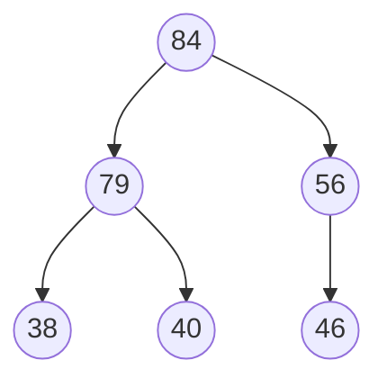
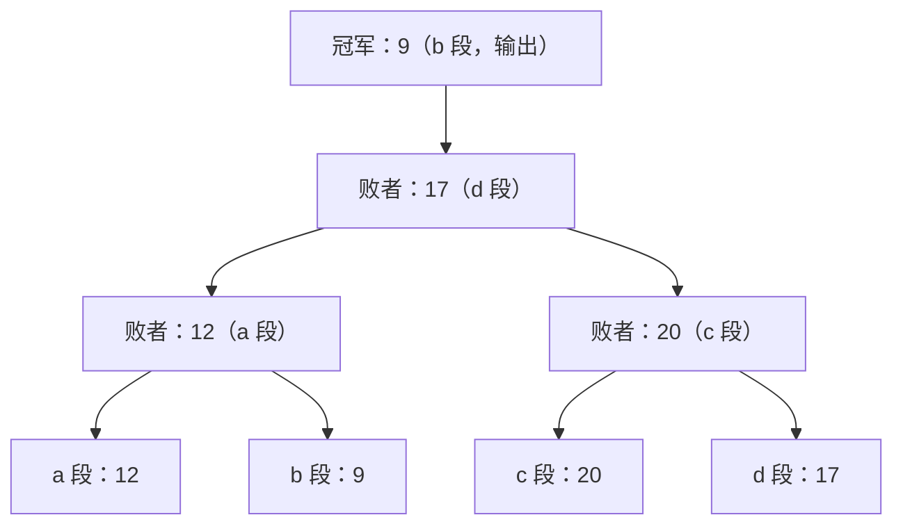
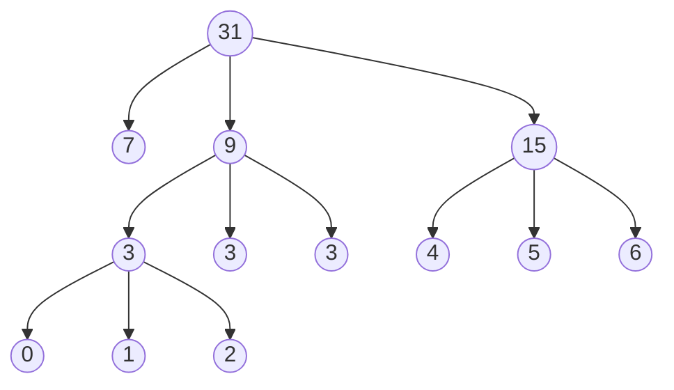

# 第 8 章：排序

> 本章是 408 数据结构的**重点收束章节**（重要度 ⭐⭐⭐⭐⭐），既是**选择题重灾区**，也是**算法设计题的常客**——"排序过程模拟、稳定性判断、给定场景选排序"几乎每年必考其一，外部排序（败者树、置换-选择、最佳归并树）近年考频明显增加。408 的典型考法有四类：① 给定初始序列，写出某排序第 $k$ 趟后的结果（或反过来：给定中间状态判断是哪种排序产生的）；② 判断/记忆各排序的稳定性；③ 根据场景特征（ $n$ 的大小、是否基本有序、是否要求稳定、内存是否受限）选择最优排序；④ 外部排序的归并趟数与 I/O 次数计算。本章计算性强、动手要求高，八种内部排序都要能"纸上推演"；复杂度分析的基础请先复习[第 1 章（绪论）](01-introduction.md)，堆结构与最佳归并树分别与[第 5 章（树与二叉树）](05-tree-and-binary-tree.md)的完全二叉树（5.2.4）、哈夫曼树（5.7）一脉相承。建议投入 **6-8 小时**，重点是"**比较表背熟、代码手写、过程能推演**"。

---

## 8.1 排序的基本概念

### 8.1.1 排序的定义

**排序（Sort）**：将 $n$ 个记录的序列 $\{R_1, R_2, \dots, R_n\}$ 重新排列为 $\{R_{p_1}, R_{p_2}, \dots, R_{p_n}\}$ ，使得各记录的关键字满足 $K_{p_1} \leq K_{p_2} \leq \cdots \leq K_{p_n}$ （升序，降序同理）。排序的本质是**按关键字调整记录的相对位置**。

### 8.1.2 稳定性

设序列中存在两个关键字相等的记录 $R_i$ 和 $R_j$ （ $K_i = K_j$ ），且排序前 $R_i$ 在 $R_j$ 之前：

- 若排序后 $R_i$ 仍在 $R_j$ 之前，则称该排序算法是**稳定的**；
- 若排序后 $R_i$ 、 $R_j$ 的相对次序**可能**发生颠倒，则称该算法是**不稳定的**。

> 稳定性是对**算法**的评价，与输入序列无关——只要存在一个序列能使等值记录颠倒，该算法就是不稳定的。

**稳定性什么时候重要？多关键字排序。** 例如学生表先按"年龄"排序，再按"班级"做一次**稳定**排序，则同一班级内的学生仍保持年龄顺序（两次排序的结果叠加）。若第二次排序不稳定，班级内的年龄顺序就可能被打乱。因此数据库的多级排序（order by 班级, 年龄）必须依赖稳定排序。

> 选择题常直接问"下列排序中哪些是稳定的"。记忆口诀：**不稳定的是"快、希、选、堆"**（快速、希尔、简单选择、堆排序），其余内部排序（直接插入、折半插入、冒泡、归并、基数）均稳定。

### 8.1.3 内部排序与外部排序

| 类别 | 条件 | 特点 |
|------|------|------|
| **内部排序** | 全部记录能放入内存 | 本章 8.2 ~ 8.6 的八种方法 |
| **外部排序** | 记录太多，必须借助外存（磁盘） | 排序过程中要反复进行内、外存间的数据交换（I/O），见 8.7 节 |

本章主线：插入类（8.2）→ 交换类（8.3）→ 选择类（8.4）→ 归并（8.5）→ 基数（8.6）→ 外部排序（8.7）→ 综合比较（8.8）。

---

## 8.2 插入排序

> 基本思想：将无序部分的记录**逐个插入**到前面已排好序的子序列中的恰当位置，使有序子序列不断增长，直到全部有序。

本章代码约定（与教材一致）：数组**下标从 1 开始**， `A[0]` 用作**哨兵或临时变量**；记录类型如下：

```c
typedef struct {
    int key;              // 关键字
    // InfoType otherinfo; // 其他数据项（略）
} ElemType;
```

### 8.2.1 直接插入排序

**思想**：把第 $i$ 个记录 $A[i]$ 的关键字与有序子序列 $A[1 \dots i-1]$ 从后向前比较，找到插入位置，将大于它的记录依次**后移**，然后插入。

**完整代码**：

```c
// 直接插入排序：A[1..n]，A[0] 为哨兵
void InsertSort(ElemType A[], int n) {
    int i, j;
    for (i = 2; i <= n; i++) {              // 依次将 A[2]~A[n] 插入有序子表
        if (A[i].key < A[i - 1].key) {      // A[i] 比前一个小，才需要插入
            A[0] = A[i];                    // 哨兵：暂存待插入记录
            for (j = i - 1; A[0].key < A[j].key; --j)
                A[j + 1] = A[j];            // 大于哨兵的记录逐个后移
            A[j + 1] = A[0];                // 插入到正确位置
        }
    }
}
```

> 哨兵 `A[0]` 有两个作用：① 暂存待插入记录；② 防止 `for` 循环中 `j` 越界（循环不必再判断 `j >= 1` ，因为 `A[0]` 不会小于自身）。

**过程推演**（初始序列 $(46, 79, 56, 38, 40, 84)$ ，竖线左侧为有序子表）：

| 趟次 | 待插入记录 | 插入后的有序子表 | 整序列状态 |
|------|-----------|-----------------|-----------|
| 初始 | — | $(46)$ | $(46 \mid 79, 56, 38, 40, 84)$ |
| 1 | 79 | $(46, 79)$ | $(46, 79 \mid 56, 38, 40, 84)$ |
| 2 | 56 | $(46, 56, 79)$ | $(46, 56, 79 \mid 38, 40, 84)$ |
| 3 | 38 | $(38, 46, 56, 79)$ | $(38, 46, 56, 79 \mid 40, 84)$ |
| 4 | 40 | $(38, 40, 46, 56, 79)$ | $(38, 40, 46, 56, 79 \mid 84)$ |
| 5 | 84 | $(38, 40, 46, 56, 79, 84)$ | 排序完成 |

**复杂度与性质**：

| 情况 | 比较次数 | 移动次数 | 时间复杂度 |
|------|---------|---------|-----------|
| 最好（正序） | $n - 1$ | $0$ | $O(n)$ |
| 最坏（逆序） | $\sum_{i=2}^{n} i = \frac{(n+2)(n-1)}{2}$ | $\sum_{i=2}^{n} (i+1)$ | $O(n^2)$ |
| 平均 | 约 $\frac{n^2}{4}$ | 约 $\frac{n^2}{4}$ | $O(n^2)$ |

- 空间复杂度 $O(1)$ （只需一个哨兵单元）；
- **稳定**：关键字相等时不后移（比较条件是 `A[0].key < A[j].key` ，相等即停止），等值记录相对次序不变；
- 适合： $n$ 较小，或序列**基本有序**（此时接近最好情况）；对链式存储也适用（但不便随机访问）。

### 8.2.2 折半插入排序

**思想**：与直接插入相同，只是**查找插入位置**时用**折半查找**代替逐个比较，减少比较次数。

**完整代码**：

```c
// 折半插入排序：先折半查找插入位置，再统一后移
void BinaryInsertSort(ElemType A[], int n) {
    int i, j, low, high, mid;
    for (i = 2; i <= n; i++) {
        A[0] = A[i];                        // 暂存待插入记录
        low = 1; high = i - 1;
        while (low <= high) {               // 折半查找插入位置
            mid = (low + high) / 2;
            if (A[mid].key > A[0].key)
                high = mid - 1;             // 插入位置在左半部分
            else
                low = mid + 1;              // 关键字相等时也去右半部分 → 保证稳定
        }
        for (j = i - 1; j >= high + 1; j--)
            A[j + 1] = A[j];                // 统一后移
        A[high + 1] = A[0];                 // 插入
    }
}
```

**比较次数与移动次数分析**（仍用序列 $(46, 79, 56, 38, 40, 84)$ 推演）：

| 待插入 | 折半查找过程（与谁比较） | 比较次数 | 后移记录 | 移动次数 |
|--------|------------------------|---------|---------|---------|
| 79 | 46（大，去右侧） | 1 | — | 0 |
| 56 | 46（小→右）, 79（大→左） | 2 | 79 | 1 |
| 38 | 56（大→左）, 46（大→左） | 2 | 46, 56, 79 | 3 |
| 40 | 46（大→左）, 38（小→右） | 2 | 46, 56, 79 | 3 |
| 84 | 46, 56, 79（均小，一路向右） | 3 | — | 0 |

关键结论：

- **比较次数与序列初始状态无关**，只与 $n$ 有关：插入第 $i$ 个记录最多比较 $\lceil \log_2 i \rceil$ 次，总共约 $O(n \log n)$ 次比较；
- **移动次数与初始状态有关**（最好 0 次，最坏 $O(n^2)$ 次），故总时间复杂度仍为 $O(n^2)$ ；
- 空间 $O(1)$ ；**稳定**（相等时 `low = mid + 1` ，插入到等值记录之后）。

### 8.2.3 希尔排序（缩小增量排序）

**思想**：直接插入排序在"基本有序"时效率很高，于是先让序列"**大体有序**"再整体插入。具体做法：取一个**增量** $d_1 < n$ ，把**相隔 $d_1$** 的记录分成一组，对每组做直接插入排序；再取 $d_2 < d_1$ 重复，直到 $d = 1$ 做最后一趟直接插入排序。

**增量序列**：教材常用 $d_i = \lfloor n/2 \rfloor, \lfloor n/4 \rfloor, \dots, 1$ （每次减半，最后一趟必为 1）。增量的选取影响性能，理论上尚无定论。

**完整代码**：

```c
// 希尔排序：增量序列 n/2, n/4, ..., 1
void ShellSort(ElemType A[], int n) {
    int d, i, j;
    for (d = n / 2; d >= 1; d = d / 2)          // 逐趟缩小增量
        for (i = d + 1; i <= n; i++)            // 对各组做直接插入（交替进行）
            if (A[i].key < A[i - d].key) {
                A[0] = A[i];
                for (j = i - d; j > 0 && A[0].key < A[j].key; j -= d)
                    A[j + d] = A[j];            // 组内后移，步长为 d
                A[j + d] = A[0];
            }
}
```

**过程推演**（初始序列 $(40, 38, 65, 97, 76, 13, 27, 49)$ ， $n = 8$ ）：

| 趟次 | 增量 $d$ | 分组（按下标） | 组内插入排序结果 | 整序列状态 |
|------|---------|--------------|----------------|-----------|
| 1 | 4 | $(40,76)\ (38,13)\ (65,27)\ (97,49)$ | $(40,76)\ (13,38)\ (27,65)\ (49,97)$ | $(40, 13, 27, 49, 76, 38, 65, 97)$ |
| 2 | 2 | $(40,27,76,65)\ (13,49,38,97)$ | $(27,40,65,76)\ (13,38,49,97)$ | $(27, 13, 40, 38, 65, 49, 76, 97)$ |
| 3 | 1 | 整个序列为一组（直接插入） | $(13,27,38,40,49,65,76,97)$ | 排序完成 |

**复杂度与性质**：

- 时间复杂度依赖增量序列，一般认为是 $O(n^{1.3})$ 量级，最坏 $O(n^2)$ ；
- 空间 $O(1)$ ；
- **不稳定**：分组排序可能使等值记录在**不同组内**发生跨越。例：序列 $(2_a, 2_b, 1)$ 取增量 $d = 2$ ，分组为 $(2_a, 1)$ 和 $(2_b)$ ，第一组排序后变为 $(1, 2_a)$ ，整序列成为 $(1, 2_b, 2_a)$ —— $2_a$ 跑到了 $2_b$ 后面，相对次序颠倒；
- **只适合顺序存储**：分组比较需要按下标跳跃访问（ $A[i - d]$ ），链式存储无法高效随机访问。

---

## 8.3 交换排序

> 基本思想：根据两个记录关键字的比较结果，**交换**它们在序列中的位置，把关键字大的往"后"推。

### 8.3.1 冒泡排序

**思想**：从后向前（或从前向后）依次比较相邻记录，若**逆序**则交换，这样每一趟都把当前无序部分中关键字**最大**的记录像"气泡"一样**沉底**（交换到最终位置）。共需 $n - 1$ 趟，第 $i$ 趟确定第 $i$ 大的记录。

**完整代码**（带提前结束标志）：

```c
// 冒泡排序：每趟把最大的记录"沉底"，flag 记录本趟是否发生过交换
void BubbleSort(ElemType A[], int n) {
    for (int i = 1; i <= n - 1; i++) {
        bool flag = false;                  // 本趟是否发生交换
        for (int j = n; j > i; j--)         // 从后向前两两比较
            if (A[j - 1].key > A[j].key) {
                Swap(A[j - 1], A[j]);       // 逆序则交换
                flag = true;
            }
        if (flag == false)
            return;                         // 本趟无交换 → 已有序，提前结束
    }
}
```

**过程推演**（初始序列 $(46, 79, 56, 38, 40, 84)$ ）：

| 趟次 | 比较与交换过程（只列发生交换的） | 本趟结果 |
|------|-------------------------------|---------|
| 1 | $79 > 56$ 交换、 $79 > 38$ 交换、 $79 > 40$ 交换； $79 < 84$ 不换 | $(46, 56, 38, 40, 79, \mathbf{84})$ |
| 2 | $56 > 38$ 交换、 $56 > 40$ 交换 | $(46, 38, 40, 56, 79, \mathbf{84})$ |
| 3 | $46 > 38$ 交换、 $46 > 40$ 交换 | $(38, 40, 46, 56, 79, \mathbf{84})$ |
| 4 | 全部正序，无交换 → `flag = false`，结束 | 排序完成 |

**复杂度与性质**：

- 最好（正序）：只比较 $n - 1$ 次、0 次交换， $O(n)$ （靠 `flag` 实现提前结束）；最坏（逆序）：比较与交换均 $\frac{n(n-1)}{2}$ 次， $O(n^2)$ ；平均 $O(n^2)$ ；
- 空间 $O(1)$ ；**稳定**（只在**严格大于**时交换，相等不交换）；
- 每趟一定会把一个记录放到最终位置（第 $i$ 趟沉底第 $i$ 大的记录），这是识别冒泡排序中间状态的关键特征。

### 8.3.2 快速排序（本章核心）

**思想**：在序列中任取一个记录作为**枢轴（pivot）**，以它的关键字为基准把序列划分成两部分——左部分关键字均 $\leq$ 枢轴，右部分均 $\geq$ 枢轴，枢轴放到最终位置（**一趟划分**）；然后对左右两部分**递归**重复上述过程。

**完整代码**（教材版 Partition + 递归）：

```c
// 一趟划分：以 A[low] 为枢轴，返回枢轴的最终位置
int Partition(ElemType A[], int low, int high) {
    ElemType pivot = A[low];                // 取第一个记录为枢轴
    while (low < high) {
        while (low < high && A[high].key >= pivot.key)
            --high;                         // 右端找比枢轴小的
        A[low] = A[high];                   // 移到左端空位
        while (low < high && A[low].key <= pivot.key)
            ++low;                          // 左端找比枢轴大的
        A[high] = A[low];                   // 移到右端空位
    }
    A[low] = pivot;                         // 枢轴落位
    return low;
}

// 快速排序
void QuickSort(ElemType A[], int low, int high) {
    if (low < high) {
        int pivotpos = Partition(A, low, high);   // 划分，枢轴落位
        QuickSort(A, low, pivotpos - 1);          // 递归排左半部分
        QuickSort(A, pivotpos + 1, high);         // 递归排右半部分
    }
}
```

**一趟划分推演**（初始序列 $(46, 79, 56, 38, 40, 84)$ ，枢轴 = 46，详细推演见 8.10 例 1）。一趟划分后枢轴 46 落位，得到 $(40, 38, 56, \mathbf{46}, 79, 84)$ ：左部分均 $\leq 46$ ，右部分均 $\geq 46$ 。

**复杂度分析**：

| 情况 | 划分形态 | 递归深度 | 时间复杂度 |
|------|---------|---------|-----------|
| 最好 / 平均 | 近似均匀划分 | $O(\log n)$ | $O(n \log n)$ |
| 最坏 | 一边空、一边 $n-1$ | $O(n)$ | $O(n^2)$ |

- 每趟划分需 $O(n)$ 次比较，共 $O(\log_2 n)$ 层（平均），故平均时间 $O(n \log n)$ ；
- **最坏情形的两种典型输入**：初始序列**正序或逆序**，且取**第一个元素**为枢轴——每趟划分都极不均匀（空表 + $n-1$ 长度子表），退化为 $O(n^2)$ ，递归深度达 $n$ ，空间 $O(n)$ ；
- **优化**：① **三数取中**——取首、中、尾三个记录的中位数作枢轴，避免有序序列退化；② **随机枢轴**——随机选取一个记录作枢轴（随机快排），使最坏情形不再由输入决定；③ 小区间改用直接插入排序；
- 空间复杂度即递归栈深度：最好/平均 $O(\log n)$ ，最坏 $O(n)$ ；
- **不稳定**：划分过程存在远距离交换。例：序列 $(2_a, 2_b, 1)$ 以 $2_a$ 为枢轴，划分时 $1$ 被换到 $2_a$ 的原位置，最终得 $(1, 2_b, 2_a)$ ，两个 2 颠倒。

> **快排是所有内部排序中平均性能最优的算法**——平均情况下常数因子小、缓存友好，是实践中最常用的排序（C 库 `qsort` 的基础）。408 选择题常考："平均性能最好 / 实践中最快的内部排序是？"答：快速排序。

---

## 8.4 选择排序

> 基本思想：每一趟从无序部分**选出**关键字最小（或最大）的记录，放到有序部分的末尾。

### 8.4.1 简单选择排序

**思想**：第 $i$ 趟从 $A[i \dots n]$ 中选出最小记录，与 $A[i]$ 交换。共 $n - 1$ 趟。

**完整代码**：

```c
// 简单选择排序：每趟选出最小记录与当前位置交换
void SelectSort(ElemType A[], int n) {
    for (int i = 1; i <= n - 1; i++) {
        int min = i;
        for (int j = i + 1; j <= n; j++)    // 在 A[i+1..n] 中找最小
            if (A[j].key < A[min].key)
                min = j;
        if (min != i)
            Swap(A[i], A[min]);             // 最多交换 3(n-1) 次移动
    }
}
```

**过程推演**（初始序列 $(46, 79, 56, 38, 40, 84)$ ）：

| 趟次 | 无序部分 | 选出最小 | 交换后序列 |
|------|---------|---------|-----------|
| 1 | $(46, 79, 56, 38, 40, 84)$ | 38 | $(38, 79, 56, 46, 40, 84)$ |
| 2 | $(79, 56, 46, 40, 84)$ | 40 | $(38, 40, 56, 46, 79, 84)$ |
| 3 | $(56, 46, 79, 84)$ | 46 | $(38, 40, 46, 56, 79, 84)$ |
| 4 | $(56, 79, 84)$ | 56（已在位） | 不变 |
| 5 | $(79, 84)$ | 79（已在位） | 排序完成 |

**复杂度与性质**：

- **比较次数恒为** $\frac{n(n-1)}{2}$ ，**与初始状态无关**；移动次数最多 $3(n-1)$ （每次交换 3 次移动），最好（正序）为 0；
- 时间复杂度**始终** $O(n^2)$ （即使正序也要比较完）；空间 $O(1)$ ；
- **不稳定**：交换可能跨越等值记录。例：序列 $(2_a, 2_b, 1)$ ，第 1 趟选出最小 1 与 $2_a$ 交换，得 $(1, 2_b, 2_a)$ —— $2_a$ 与 $2_b$ 颠倒；
- 适合： $n$ 较小，且**记录移动代价很高**时（移动次数是所有排序中最少级别）。

### 8.4.2 堆排序（408 必考）

**堆的定义**： $n$ 个关键字序列 $K_1, K_2, \dots, K_n$ 称为**堆**，当且仅当对所有 $i = 1, 2, \dots, \lfloor n/2 \rfloor$ 满足：

- **大根堆**： $K_i \geq K_{2i}$ 且 $K_i \geq K_{2i+1}$ （双亲 $\geq$ 孩子，堆顶最大）；
- **小根堆**： $K_i \leq K_{2i}$ 且 $K_i \leq K_{2i+1}$ （双亲 $\leq$ 孩子，堆顶最小）。

堆在逻辑上是一棵**完全二叉树**（下标关系与[第 5 章](05-tree-and-binary-tree.md) 5.2.4 完全二叉树性质一致：结点 $i$ 的左孩子 $2i$ 、右孩子 $2i+1$ 、双亲 $\lfloor i/2 \rfloor$ ），因此**适合顺序存储**，下标 $\lfloor n/2 \rfloor + 1 \sim n$ 的结点全是叶子。

**排序思想**（以大根堆升序为例）：

1. **建堆**（BuildMaxHeap）：把初始序列建成大根堆——自底向上，从 $i = \lfloor n/2 \rfloor$ 开始逐个向前，将以 $i$ 为根的子树调整为堆（HeapAdjust）；
2. **排序**：把堆顶（最大值）与**当前最后一个**记录交换，则最大值落到最终位置；再把剩余 $n - 1$ 个记录重新调整为堆；重复直到只剩一个记录。

**完整代码**：

```c
// 自底向上调整：将以 k 为根的子树调整为大根堆（A[k] 的左右子树已是堆）
void HeapAdjust(ElemType A[], int k, int len) {
    A[0] = A[k];                            // 暂存待调整结点
    for (int i = 2 * k; i <= len; i *= 2) { // 沿较大孩子向下筛选
        if (i < len && A[i].key < A[i + 1].key)
            i++;                            // 取关键字较大的孩子
        if (A[0].key >= A[i].key)
            break;                          // 已满足堆性质，筛选结束
        else {
            A[k] = A[i];                    // 大孩子上移
            k = i;                          // 继续向下筛选
        }
    }
    A[k] = A[0];                            // 被筛选结点落位
}

// 建堆：自底向上，从最后一个分支结点 ⌊n/2⌋ 开始逐个调整
void BuildMaxHeap(ElemType A[], int len) {
    for (int i = len / 2; i > 0; i--)
        HeapAdjust(A, i, len);
}

// 堆排序（升序用大根堆）
void HeapSort(ElemType A[], int n) {
    BuildMaxHeap(A, n);                     // 初始建堆
    for (int i = n; i > 1; i--) {
        Swap(A[i], A[1]);                   // 堆顶（最大值）与末尾交换 → 输出当前最大值
        HeapAdjust(A, 1, i - 1);            // 调整剩余部分，重建堆
    }
}
```

> 为什么建堆从 $\lfloor n/2 \rfloor$ 开始？因为下标 $\lfloor n/2 \rfloor + 1 \sim n$ 都是叶子，天然满足堆性质，无需调整；而调整某结点的前提是其左右子树已是堆，所以必须**自底向上**。

**建堆推演**（初始序列 $(46, 79, 56, 38, 40, 84)$ ， $n = 6$ ，自 $i = 3$ 起调整）：

| 调整对象 | 操作 | 序列状态 |
|---------|------|---------|
| $i = 3$ （56） | 左孩子 84 > 56，交换 | $(46, 79, 84, 38, 40, 56)$ |
| $i = 2$ （79） | 孩子 38、40 均小于 79，无需调整 | $(46, 79, 84, 38, 40, 56)$ |
| $i = 1$ （46） | 较大孩子 84 > 46，交换；46 下沉到 3 号位后孩子 56 > 46，再交换 | $(84, 79, 56, 38, 40, 46)$ |

建堆完成，对应的大根堆形态：



**排序过程推演**（每趟交换堆顶与末尾，再调整）：

| 趟次 | 交换（堆顶 ↔ 末尾） | 调整后堆（无序部分） | 本趟输出 | 有序部分（序列尾部） |
|------|--------------------|--------------------|---------|-------------------|
| 1 | $84 \leftrightarrow 46$ | $(79, 46, 56, 38, 40)$ | 84 | $(84)$ |
| 2 | $79 \leftrightarrow 40$ | $(56, 46, 40, 38)$ | 79 | $(79, 84)$ |
| 3 | $56 \leftrightarrow 38$ | $(46, 38, 40)$ | 56 | $(56, 79, 84)$ |
| 4 | $46 \leftrightarrow 40$ | $(40, 38)$ | 46 | $(46, 56, 79, 84)$ |
| 5 | $40 \leftrightarrow 38$ | $(38)$ | 40 | $(40, 46, 56, 79, 84)$ |

最终升序序列 $(38, 40, 46, 56, 79, 84)$ 。注意第 1 趟的调整细节：交换后堆顶为 46，孩子 79、56 中较大者 79 上移；46 继续下沉，孩子 38、40 中较大者 40 仍小于 46，停止，得堆 $(79, 46, 56, 38, 40)$ 。

**复杂度与性质**：

- 建堆时间 $O(n)$ （可以证明）；每趟调整 $O(\log n)$ ，共 $n - 1$ 趟，总时间 $O(n \log n)$ ，最好/最坏均如此；
- 空间 $O(1)$ ；**不稳定**（例：序列 $(5, 8, 5, 2, 9)$ 建堆时，第一个 5 会被交换到第二个 5 之后，相对次序颠倒）；
- **大根堆升序、小根堆降序**（每趟把当前最值放到尾部）；
- 特别适合**求前 $k$ 大（小）元素**：只需建堆 + 做 $k$ 趟，时间 $O(n + k \log n)$ ，且只需一维数组、不必全部排序。

---

## 8.5 归并排序

### 8.5.1 二路归并的思想

**归并（Merge）**：将两个或两个以上的**有序表**合并成一个新的有序表。**二路归并排序**：把序列看作 $n$ 个长度为 1 的有序子表，**两两合并**得到 $\lceil n/2 \rceil$ 个长度为 2（或 1）的有序子表；再两两合并……直到合并成一个长度为 $n$ 的有序表。

### 8.5.2 代码、推演与复杂度

**完整代码**：

```c
ElemType B[MaxSize];                    // 辅助数组（与 A 等长）

// 将 A[low..mid] 与 A[mid+1..high] 两个有序段合并为 A[low..high]
void Merge(ElemType A[], int low, int mid, int high) {
    int i, j, k;
    for (k = low; k <= high; k++)
        B[k] = A[k];                    // 先把待合并段复制到辅助数组
    for (i = low, j = mid + 1, k = i; i <= mid && j <= high; k++) {
        if (B[i].key <= B[j].key)       // 注意 <= ：相等时取前段，保证稳定
            A[k] = B[i++];
        else
            A[k] = B[j++];
    }
    while (i <= mid) A[k++] = B[i++];   // 前段剩余
    while (j <= high) A[k++] = B[j++];  // 后段剩余
}

// 二路归并排序（递归版）
void MergeSort(ElemType A[], int low, int high) {
    if (low < high) {
        int mid = (low + high) / 2;
        MergeSort(A, low, mid);         // 递归排左半
        MergeSort(A, mid + 1, high);    // 递归排右半
        Merge(A, low, mid, high);       // 合并
    }
}
```

**过程推演**（初始序列 $(46, 79, 56, 38, 40, 84)$ ， $n = 6$ ）：

| 趟次 | 有序段长度 | 合并过程 | 结果 |
|------|-----------|---------|------|
| 初始 | 1 | 各元素自成一个有序段 | $(46)(79)(56)(38)(40)(84)$ |
| 1 | 2 | $(46)+(79)$ 、 $(56)+(38)$ 、 $(40)+(84)$ 两两合并 | $(46, 79)(38, 56)(40, 84)$ |
| 2 | 4 | $(46,79)+(38,56)$ 合并； $(40,84)$ 单独照抄 | $(38, 46, 56, 79)(40, 84)$ |
| 3 | 8 | $(38,46,56,79)+(40,84)$ 合并 | $(38, 40, 46, 56, 79, 84)$ |

**复杂度与性质**：

- **归并趟数** $= \lceil \log_2 n \rceil$ （每趟段长翻倍）；每趟合并需 $O(n)$ 次比较与移动，总时间 $O(n \log n)$ ，**最好、最坏、平均均如此**（与初始状态无关）；
- 空间复杂度 $O(n)$ （辅助数组 B，是八种内部排序中空间开销最大的）；
- **稳定**：合并时相等关键字取前段记录（ `<=` ）；
- 适合：要求**稳定**且 $n$ 较大的场合；也是**外部排序**的基础（8.7 节的多路归并就是它的推广）。

---

## 8.6 基数排序

### 8.6.1 多关键字排序与 LSD / MSD

前面七种排序都是基于**关键字的整体比较**。基数排序另辟蹊径：把关键字看成由若干**分量**（如十进制数的百、十、个位）组成的**多关键字**，通过"**分配 + 收集**"实现排序，全程**不需要比较关键字**。

- **LSD（最低位优先）**：从**最低位**分量开始，对各分量分别做一次稳定的分配收集，逐位进行，最高位做完即有序。408 主要考 LSD；
- **MSD（最高位优先）**：从最高位开始，按分量把序列**递归地划分**成若干子序列，再对子序列继续按次高位划分。

### 8.6.2 链式基数排序：过程推演与复杂度

以十进制三位数为例，基数 $r = 10$ （队列 0 ~ 9），关键字位数 $d = 3$ 。LSD 的每一趟：**分配**——按当前位的数字把记录依次放入对应队列；**收集**——按队列 0 → 9 的顺序首尾相接串起来。队列的 FIFO 保证了稳定性。

**过程推演**（初始序列 $(329, 457, 657, 839, 436, 720, 355)$ ）：

| 趟次 | 按哪一位分配（只列非空队列） | 收集结果 |
|------|---------------------------|---------|
| 1 | 个位： $r_0$:(720) $r_5$:(355) $r_6$:(436) $r_7$:(457, 657) $r_9$:(329, 839) | $(720, 355, 436, 457, 657, 329, 839)$ |
| 2 | 十位： $r_2$:(720, 329) $r_3$:(436, 839) $r_5$:(355, 457, 657) | $(720, 329, 436, 839, 355, 457, 657)$ |
| 3 | 百位： $r_3$:(329, 355) $r_4$:(436, 457) $r_6$:(657) $r_7$:(720) $r_8$:(839) | $(329, 355, 436, 457, 657, 720, 839)$ |

注意第 2 趟中 457 与 657 十位同为 5，收集后仍保持第 1 趟确立的先后顺序（457 在 657 前）——这正是稳定性的体现。

**复杂度与性质**：

- 时间 $O(d(n + r))$ ：共 $d$ 趟，每趟分配 $O(n)$ 、收集 $O(r)$ ；本例 $d = 3, n = 7, r = 10$ ，基本操作约 $3 \times (7 + 10) = 51$ 次；
- 空间 $O(r)$ （ $r$ 个队列的头、尾指针；链式实现时不需移动记录，只改指针）；
- **稳定**（分配按原顺序入队、收集按 FIFO 出队）；
- 适合： $n$ 较大、**关键字位数 $d$ 少**、基数 $r$ 不大的场合（如整数、定长字符串）；若 $d$ 很大（如长字符串），代价反而高。

---

## 8.7 外部排序（近年考频增加，重点）

### 8.7.1 基本方法与 I/O 次数分析

数据量超过内存容量时，排序必须借助外存。外部排序分两步：

1. **生成初始归并段**：把外存文件按内存容量 $w$ 分批读入，用内部排序（如快排）排好后写回外存，得到一个**有序的初始归并段**；重复直到整个文件被切成 $m = \lceil n/w \rceil$ 个归并段；
2. **多路归并**：对 $m$ 个归并段做 $k$ 路归并，逐趟减少归并段数量，直到合成一个有序大文件。

**归并趟数**：每趟 $k$ 路归并把段数从 $m$ 减为 $\lceil m/k \rceil$ ，故

$$
s = \lceil \log_k m \rceil
$$

**I/O 次数分析**：生成初始归并段需要把所有记录读一遍、写一遍，共 $2n$ 次 I/O；之后**每一趟归并**也要把所有记录读写一遍，又是 $2n$ 次。总 I/O 次数：

$$
\text{总 I/O} = 2n(1 + s)
$$

> 例：10000 个记录，内存一次容纳 1000 个 → $m = 10$ 个初始归并段。2 路归并： $s = \lceil \log_2 10 \rceil = 4$ 趟，总 I/O $= 2 \times 10000 \times (1 + 4) = 100000$ 次；若改用 5 路归并： $s = \lceil \log_5 10 \rceil = 2$ 趟，总 I/O $= 60000$ 次。**增大归并路数 $k$ 可显著减少 I/O**（外部排序的瓶颈正是 I/O），但 $k$ 增大后"从 $k$ 个记录中选最小"的内部比较开销上升——这就是败者树要解决的问题。

### 8.7.2 多路平衡归并与败者树

**k 路归并的朴素做法**：内存中设 $k$ 个输入缓冲区和 1 个输出缓冲区，每次从 $k$ 个段的当前记录里选最小者输出，需要 $k - 1$ 次比较。总共约 $n(k - 1)s$ 次比较， $k$ 很大时内部归并时间不可接受。

**败者树（Loser Tree）**：一棵完全二叉树，用于加速"从 $k$ 个记录中选最小"：

- **叶子**：各归并段当前待归并的记录；
- **内部结点**：记录其两棵子树"比赛"中的**败者**（关键字较大者，小者为胜）；
- 根之上另设一个**冠军结点**，记录最终的胜者（最小记录），即本次应输出的记录。

**例**：4 路归并，各段当前记录为 a:12、b:9、c:20、d:17（小者胜）：a 与 b 比，9 胜、12 记为败者；c 与 d 比，17 胜、20 记为败者；9 与 17 比，9 胜、17 记为败者；冠军 9（b 段）输出：



输出冠军后，从该冠军所属段读入下一个记录（如 b 段补入 15），**重构**败者树：只需沿该叶子到根的路径，与各层记录的败者依次比较，共 $\lceil \log_2 k \rceil$ 次比较（本例 2 次），远少于朴素的 $k - 1$ 次。

**败者树 vs 胜者树**：

| 对比项 | 胜者树 | 败者树 |
|--------|--------|--------|
| 内部结点记录 | 每场比赛的胜者 | 每场比赛的败者 |
| 最终冠军 | 即根结点 | 另设根之上的冠军结点 |
| 重构方式 | 冠军变化后需沿路径与"新的胜者"重新比较，父结点信息随胜者改变 | 只需沿变化叶子的路径与**各层已记录的败者**比较，兄弟子树的败者不受影响 |
| 重构比较次数 | 最坏多于败者树 | 约 $\lceil \log_2 k \rceil$ 次，实现简单、效率更高 |

**关键结论（408 常考）**：引入败者树后，每输出一个记录重构只需 $O(\log_2 k)$ 次比较， $s$ 趟归并 $n$ 个记录的总比较次数约为

$$
n \cdot s \cdot \lceil \log_2 k \rceil = n \cdot \lceil \log_k m \rceil \cdot \lceil \log_2 k \rceil \approx n \log_2 m
$$

**与 $k$ 无关**（ $\log_k m \times \log_2 k = \log_2 m$ ）——这意味着增大 $k$ 只减少 I/O 趟数而不增加内部比较总量。实际中 $k$ 也不能无限增大：① 需要 $k$ 个输入缓冲区，受内存限制；② $k$ 大到一定程度后收益递减。工程上若需要更大路数的归并，可采用**多平衡归并**：把一次 $k^d$ 路归并分解为 $d$ 次 $k$ 路归并逐级完成，兼顾缓冲区数量与 I/O 效率。

### 8.7.3 置换-选择排序（生成不等长初始归并段）

8.7.1 中每个初始归并段长度固定为内存容量 $w$ ，归并段数 $m = \lceil n/w \rceil$ 。**置换-选择排序**可以生成**更长（且不等长）** 的初始归并段，从而减少归并段数量、降低归并趟数。

**MINIMAX 过程**（简述）：内存工作区容量为 $w$ 个记录。

1. 从输入文件读入 $w$ 个记录填满工作区；
2. 设 **MINIMAX** = 当前归并段最后一个输出的记录的关键字；
3. 从工作区中所有关键字 $\geq$ MINIMAX 的记录里，选出**最小**者输出到当前归并段，并更新 MINIMAX；
4. 从输入文件读入一个新记录替补工作区的空位；
5. 重复 3-4，直到工作区中**所有记录都小于 MINIMAX**（无法再输出）→ 当前归并段结束，把 MINIMAX 重置，开始下一个归并段；
6. 那些"被冻结"（小于 MINIMAX）的记录留待下一段。

**效果**：若输入记录关键字随机分布，置换-选择生成的初始归并段**平均长度为 $2w$** （是固定长度法的 2 倍），归并段数约减半，归并趟数随之减少。由于各段长度不等，后续应采用**最佳归并树**（8.7.4）。

### 8.7.4 最佳归并树（哈夫曼思想）

归并段长度不等时，不同的归并次序 I/O 总量不同。**最佳归并树**利用[哈夫曼树](05-tree-and-binary-tree.md)（5.7 节）思想：把各归并段的**长度当作权值**，构造 $k$ 叉哈夫曼树——**长度大的段靠近根（少参与几趟归并），长度小的段远离根**，使总 I/O（带权路径长度）最小。

**虚段补充规则**： $k$ 路归并要求归并树是一棵**严格 $k$ 叉树**（内部结点都有 $k$ 个孩子）。设初始归并段有 $m$ 个（即叶子数），若

$$
(m - 1) \bmod (k - 1) \neq 0
$$

则需补充 $k - 1 - (m - 1) \bmod (k - 1)$ 个长度为 0 的**虚段**，使叶子总数满足 $(m - 1) \bmod (k - 1) = 0$ 。虚段不产生任何 I/O，只是让树形完整。

> 推导：一棵有 $m$ 个叶子的严格 $k$ 叉树，内部结点数 $= (m - 1)/(k - 1)$ 必须为整数，故有此判断。二路归并时 $k = 2$ ， $(m - 1) \bmod 1 \equiv 0$ 恒成立，无需补虚段——这与 2 叉哈夫曼树（[第 5 章](05-tree-and-binary-tree.md) 5.7 节）总是可构造的事实一致。

**例**：有 8 个初始归并段，长度分别为 $\{5, 3, 3, 4, 6, 7, 2, 1\}$ ，采用 3 路归并。 $(m - 1) \bmod (k - 1) = (8 - 1) \bmod 2 = 1 \neq 0$ ，补 $2 - 1 = 1$ 个虚段（长度 0），共 9 个叶子。按 3 叉哈夫曼算法每次合并**最小的 3 个**：

| 步骤 | 合并 | 新结点 | 剩余权值集合 |
|------|------|--------|------------|
| 1 | 0 + 1 + 2 | 3 | {3, 3, 3, 4, 5, 6, 7} |
| 2 | 3 + 3 + 3 | 9 | {4, 5, 6, 7, 9} |
| 3 | 4 + 5 + 6 | 15 | {7, 9, 15} |
| 4 | 7 + 9 + 15 | 31（根） | 完成 |

得到的最佳归并树（归并趟数 = 树高）：



叶子深度：7 为 1；两个 3 和 4、5、6 为 2；虚段 0 与 1、2 为 3。归并趟数 $= 3$ ；总 I/O（WPL） $= 7 \times 1 + (3+3+4+5+6) \times 2 + (0+1+2) \times 3 = 7 + 42 + 9 = 58$ （虚段不计实际 I/O）。若不按最佳次序归并（如简单两两配对），I/O 会大于 58。

---

## 8.8 内部排序算法的综合比较

### 8.8.1 比较要点

八种内部排序各有侧重，比较时抓住四个维度：

1. **时间**：简单方法（直接插入、折半插入、冒泡、简单选择）平均 $O(n^2)$ ；改进方法（希尔约 $O(n^{1.3})$ ）；高效方法（快排、堆排、归并平均 $O(n \log n)$ ）；基数排序 $O(d(n+r))$ ，与 $n$ 近似线性；
2. **空间**：归并 $O(n)$ 最大，快排 $O(\log n)$ （递归栈，最坏 $O(n)$ ），基数 $O(r)$ ，其余 $O(1)$ ；
3. **稳定性**：稳定——直接插入、折半插入、冒泡、归并、基数；不稳定——**快、希、选、堆**；
4. **对初始状态的敏感性**：直接插入、冒泡在**正序**时达最好情况 $O(n)$ ；快排在**正序/逆序**时反而退化到最坏 $O(n^2)$ ；简单选择、堆排、归并、基数与初始状态基本无关。

### 8.8.2 给定场景选哪种排序（408 常考）

| 场景需求 | 推荐算法 | 理由 |
|---------|---------|------|
| $n$ 较小，或序列基本有序 | 直接插入排序 | 实现简单，最好情况 $O(n)$ ，基本有序时接近线性 |
| $n$ 较小，希望减少比较次数 | 折半插入排序 | 比较 $O(n \log n)$ ，移动仍是 $O(n^2)$ |
| $n$ 较大，追求平均性能 | **快速排序** | 平均性能最优，实践中最快 |
| $n$ 较大，要求**稳定** | **归并排序** | 唯一稳定的 $O(n \log n)$ 内部排序 |
| $n$ 较大，内存受限（辅助空间小） | 堆排序 | 时间 $O(n \log n)$ 且空间 $O(1)$ |
| 求前 $k$ 大（小）元素 | 堆排序（部分） | $O(n + k \log n)$ ，无需全排序 |
| 关键字为整数且位数少、范围小 | 基数排序 | 时间 $O(d(n+r))$ ，稳定 |
| 记录移动代价很大 | 简单选择排序 | 比较 $O(n^2)$ 但移动至多 $3(n-1)$ 次 |
| 数据量超过内存容量 | 外部排序 | 初始归并段 + 多路归并 + 败者树 |
| 初始序列基本有序且 $n$ 较大 | 直接插入 / 堆排序 | **切忌用快排**（正序 + 首元素枢轴 → 最坏 $O(n^2)$ ） |

> 完整对比大表见「本章小结」的排序算法综合比较表（408 必背）。

---

## 8.9 408 算法题结合点（排序思想用于算法设计）

排序章节的**划分、堆、归并**思想经常直接出现在第 41 题算法设计题中：

1. **划分思想**：快排的 `Partition` 可以在 $O(n)$ 时间内把数组按枢轴分成"小-枢轴-大"三段，凡"按某值重排/划分"的题目都可套用；
2. **堆**：求第 $k$ 大、前 $k$ 大、动态维护最值（见 8.4.2）；
3. **归并**：合并两个有序表/链表（与[第 2 章（线性表）](02-linear-list.md)合并算法同源）、统计逆序对。

**经典例题：荷兰国旗问题（2016 年 408 真题改编）**：设数组 $A[0 \dots n-1]$ 中只含 0、1、2 三种值（红白蓝），要求重新排列使所有 0 在前、1 在中间、2 在后，时间 $O(n)$ 、空间 $O(1)$ 。

**思路**：三指针划分（快排思想的推广）。 `i` 指向"0 区"的右边界后一位， `k` 指向"2 区"的左边界前一位， `j` 为扫描指针：遇 0 换到 0 区、遇 2 换到 2 区、遇 1 跳过。

```c
// 荷兰国旗：三指针一次扫描完成三向划分
void Flag_Netherlands(int A[], int n) {
    int i = 0, j = 0, k = n - 1;
    while (j <= k) {
        if (A[j] == 0) {            // 换到 0 区，两指针同时前进
            Swap(A[i], A[j]);
            i++; j++;
        } else if (A[j] == 1) {     // 本就在中间，跳过
            j++;
        } else {                    // A[j] == 2，换到 2 区；换回的值未检查，j 不动
            Swap(A[j], A[k]);
            k--;
        }
    }
}
```

时间 $O(n)$ （每个元素最多被访问常数次），空间 $O(1)$ 。

> 另注：排序与查找互为前提——折半查找、BST 等要求序列有序（见[第 7 章（查找）](07-search.md)）；反之查找结构（如 BST 的中序遍历）天然产生有序序列。

---

## 8.10 典型例题

**例 1**（快速排序一趟划分模拟）：对序列 $(46, 79, 56, 38, 40, 84)$ 进行快速排序，取第一个元素为枢轴，写出第一趟划分的结果，并给出完整推演。

**解**：枢轴 $pivot = 46$ ， $low = 1, high = 6$ ，按 8.3.2 的 Partition 规则推演：

| 步骤 | 操作 | 序列状态 |
|------|------|---------|
| 0 | 保存枢轴 46， low = 1， high = 6 | $(46, 79, 56, 38, 40, 84)$ |
| 1 | high 左移：84 ≥ 46 跳过；40 < 46 → 移到 low 位，low++ | $(40, 79, 56, 38, 40, 84)$ |
| 2 | low 右移：79 > 46 → 移到 high 位，high-- | $(40, 79, 56, 38, 79, 84)$ |
| 3 | high 左移：38 < 46 → 移到 low 位，low++ | $(40, 38, 56, 38, 79, 84)$ |
| 4 | low 右移：56 > 46 → 移到 high 位，high-- | $(40, 38, 56, 56, 79, 84)$ |
| 5 | low = high = 3，枢轴落位 | $(40, 38, 56, 46, 79, 84)$ |

> 答案：第一趟结果为 $(40, 38, 56, 46, 79, 84)$ 。识别快排中间状态的通用判据：**存在一个元素处在最终位置，其左侧元素均不大于它、右侧元素均不小于它**。选择题若给出多个候选序列，先找"谁可能已落位"再验证两侧，即可快速排除。

---

**例 2**（堆排序过程与堆形态）：对序列 $(46, 79, 56, 38, 40, 84)$ 用堆排序进行升序排列。

(1) 写出初始建堆后的序列并画出堆形态；(2) 写出前两趟排序后的序列及每趟输出的记录。

**解**：

(1) 建堆过程见 8.4.2 推演表：自 $i = 3$ 起调整，初始堆为 $(84, 79, 56, 38, 40, 46)$ ，形态为 84 为根，左右孩子 79、56，79 的孩子 38、40，56 的孩子 46（图见 8.4.2）。

(2) 第一趟：交换堆顶 84 与末尾 46 → $(46, 79, 56, 38, 40 \mid 84)$ ，调整堆顶：46 与较大孩子 79 交换，继续下沉比较孩子 38、40 均小于 46 停止 → 堆 $(79, 46, 56, 38, 40)$ 。第一趟后序列 $(79, 46, 56, 38, 40, 84)$ ，**输出 84**（当前最大值）。

第二趟：交换堆顶 79 与末尾 40 → $(40, 46, 56, 38 \mid 79, 84)$ ，调整：40 与较大孩子 56 交换，到达 3 号位无孩子停止 → 堆 $(56, 46, 40, 38)$ 。第二趟后序列 $(56, 46, 40, 38, 79, 84)$ ，**输出 79**。

> 堆排序每一趟把**当前最大值**交换到无序部分的末尾。识别题判据：**序列尾部已有序的部分恰为最大的若干个元素，且剩余前缀构成堆**（可用"双亲 ≥ 孩子"逐位验证）。

---

**例 3**（归并排序每趟结果 + 算法识别）：对序列 $(46, 79, 56, 38, 40, 84)$ 用二路归并排序升序排列，写出每一趟的结果。若某排序算法对该序列排序两趟后得到 $(38, 46, 56, 79, 40, 84)$ ，它最可能是什么排序？

**解**：归并推演见 8.5.2：

| 趟次 | 结果 |
|------|------|
| 第 1 趟 | $(46, 79)(38, 56)(40, 84)$ → $(46, 79, 38, 56, 40, 84)$ |
| 第 2 趟 | $(38, 46, 56, 79)(40, 84)$ → $(38, 46, 56, 79, 40, 84)$ |
| 第 3 趟 | $(38, 40, 46, 56, 79, 84)$ |

识别： $(38, 46, 56, 79, 40, 84)$ 呈现"**长度为 4 的有序段 + 长度为 2 的有序段**"的结构，正是二路归并第 2 趟的典型形态（冒泡两趟后尾部有序、快排一趟后枢轴落位，均不符）。答案：**二路归并排序**。

> 二路归并的中间状态特征最鲜明：**若干等长的有序段依次排列**（最后一段可能不满）。看到"块状有序"优先想归并。

---

**例 4**（综合识别：同一中间状态可能对应多种排序）：对初始序列 $(60, 50, 40, 30, 20, 10)$ 用某种排序方法升序排序，两趟后得到 $(40, 30, 20, 10, 50, 60)$ 。下列算法中哪些**可能**产生该结果？① 冒泡排序；② 堆排序；③ 简单选择排序；④ 快速排序（首元素为枢轴）。

**解**：逐个模拟两趟：

| 算法 | 第 1 趟 | 第 2 趟 | 是否匹配 |
|------|---------|---------|---------|
| 冒泡 | $(50, 40, 30, 20, 10, 60)$ | $(40, 30, 20, 10, 50, 60)$ | ✅ |
| 堆排（大根堆） | 初始即堆；交换 60↔10 并调整 → $(50, 30, 40, 10, 20, 60)$ | 交换 50↔20 并调整 → $(40, 30, 20, 10, 50, 60)$ | ✅ |
| 简单选择 | $(10, 50, 40, 30, 20, 60)$ | $(10, 20, 40, 30, 50, 60)$ | ❌ |
| 快排 | $(10, 50, 40, 30, 20, 60)$ | 递归划分 $(10, 20, 40, 30, 50, 60)$ | ❌ |

> 答案：① 冒泡、② 堆排序都可能。**冒泡与堆排第一趟都把最大值沉底**，逆序输入下两趟结果甚至完全相同，仅凭中间状态无法区分二者——需要再看"前缀是否满足堆性质"（堆排满足、冒泡不保证）。简单选择的特征是"头部有序"，快排的特征是"枢轴落位、左小右大"，均可快速排除。

---

**例 5**（基数排序过程）：对序列 $(329, 457, 657, 839, 436, 720, 355)$ 用链式基数排序（LSD）升序排列，写出每一趟分配收集后的结果，并给出时间、空间复杂度。

**解**：逐位分配收集的详细过程见 8.6.2 推演表，三趟结果依次为：

| 趟次 | 按位 | 收集后序列 |
|------|------|-----------|
| 1 | 个位 | $(720, 355, 436, 457, 657, 329, 839)$ |
| 2 | 十位 | $(720, 329, 436, 839, 355, 457, 657)$ |
| 3 | 百位 | $(329, 355, 436, 457, 657, 720, 839)$ |

$d = 3, n = 7, r = 10$ ：时间复杂度 $O(d(n + r)) = O(3 \times 17)$ ，空间复杂度 $O(r) = O(10)$ （ 10 个队列指针）。

> 易错点：第 2 趟按十位分配时，457 与 657 同在 $r_5$ 队列，**收集顺序必须保持上一趟的相对次序**（457 在前）——基数排序的正确性完全依赖每一趟的稳定性（队列 FIFO）。若误用"按值重排"代替 FIFO 收集，结果可能错误。

---

**例 6**（外部排序：归并趟数与 I/O 计算）：某文件有 10000 个记录，内存工作区一次可容纳 1000 个记录。先生成初始归并段，再做 5 路归并。求：(1) 初始归并段数；(2) 归并趟数；(3) 整个排序的总 I/O 次数（每个记录读、写各计一次）；(4) 引入败者树后，每输出一个记录重构败者树约需几次比较？

**解**：

(1) $m = \lceil 10000 / 1000 \rceil = 10$ 个初始归并段；

(2) $s = \lceil \log_5 10 \rceil = 2$ 趟（ $5^1 = 5 < 10 \leq 25 = 5^2$ ）；

(3) 生成初始归并段：全部记录读写一遍 $= 2 \times 10000$ ；两趟归并每趟各读写一遍 $= 2 \times 2 \times 10000$ 。总 I/O $= 2n(1 + s) = 2 \times 10000 \times 3 = 60000$ 次；

(4) 重构沿叶子到根路径比较 $\lceil \log_2 5 \rceil = 3$ 次。

> 对比：若用 2 路归并， $s = \lceil \log_2 10 \rceil = 4$ ，总 I/O $= 2 \times 10000 \times 5 = 100000$ 次。增大归并路数直接减少 I/O 趟数——这正是外部排序采用多路归并 + 败者树的原因。计算时注意区分"归并阶段的 I/O"（ $2ns$ ）与"含生成初始归并段的总 I/O"（ $2n(1+s)$ ），审题要看清问的是哪一个。

---

**例 7**（最佳归并树与虚段）：有 6 个初始归并段，长度分别为 $\{3, 2, 5, 4, 6, 1\}$ ，采用 3 路归并。问：(1) 需要补充几个虚段？(2) 构造最佳归并树，求归并趟数与最小总 I/O（WPL）。

**解**：

(1) $(m - 1) \bmod (k - 1) = (6 - 1) \bmod 2 = 1 \neq 0$ ，需补 $2 - 1 = 1$ 个虚段（长度 0），叶子总数变为 7。

(2) 对 $\{0, 1, 2, 3, 4, 5, 6\}$ 每次合并最小的 3 个：

| 步骤 | 合并 | 新结点 | 剩余 |
|------|------|--------|------|
| 1 | 0 + 1 + 2 | 3 | {3, 3, 4, 5, 6} |
| 2 | 3 + 3 + 4 | 10 | {5, 6, 10} |
| 3 | 5 + 6 + 10 | 21（根） | 完成 |

树结构：根 21 的孩子为 5、6、10；结点 10 的孩子为新 3、原 3、4；新 3 的孩子为虚段 0、1、2。叶子深度：5 和 6 为 1；两个 3 与 4 为 2；虚段 0、1、2 为 3。

$$
\text{归并趟数} = \text{树高} = 3, \qquad WPL = (5 + 6) \times 1 + (3 + 3 + 4) \times 2 + (0 + 1 + 2) \times 3 = 11 + 20 + 9 = 40
$$

> 虚段长度为 0，不计入实际 I/O，但参与建树、占据叶子位置。判断虚段个数是送分题： $(m-1) \bmod (k-1) \neq 0$ 时补 $k - 1 - (m-1) \bmod (k-1)$ 个，其余为 0。

---

### 常见陷阱清单

1. **稳定性记混**：八种内部排序中只有"快、希、选、堆"不稳定，其余（直接插入、折半插入、冒泡、归并、基数）均稳定。冒泡"相等不交换"、归并"相等取前段"、基数"FIFO 收集"都是靠细节保证稳定的，改动这些细节（如归并用 `<` 代替 `<=` ）就会破坏稳定性。
2. **快排"一趟"的含义**：一趟 = 一次 `Partition` 调用（枢轴落到最终位置，左小右大），不是递归一层的全部划分；识别题先看"是否存在一个已落位的枢轴"。
3. **快排最坏情形**：初始序列**正序或逆序**且取首元素为枢轴 → $O(n^2)$ 、空间 $O(n)$ 。"快排总是 $O(n \log n)$ "是错误说法；反之"基本有序的序列"也不适合用快排。
4. **堆排序的方向**：升序用**大根堆**、降序用**小根堆**；每趟把堆顶（当前最值）与无序部分末尾交换。别记反。
5. **堆排 vs 冒泡的中间状态**：两者第一趟都把最大值沉底，逆序序列下前两趟结果甚至相同。区分依据：堆排每趟之后**前缀必须满足堆性质**（双亲 ≥ 孩子），冒泡无此保证。
6. **简单选择的时间复杂度恒为 $O(n^2)$**：比较次数固定 $\frac{n(n-1)}{2}$ ，与初始状态无关（正序也不例外）；它胜在移动次数少（至多 $3(n-1)$ ）。
7. **归并排序的空间**：需要 $O(n)$ 辅助数组，是八种内部排序中空间开销最大的；也是其中**唯一稳定的 $O(n \log n)$ 排序**，要求稳定且 $n$ 大时必选归并。
8. **基数排序的复杂度**：是 $O(d(n + r))$ 不是 $O(n \log n)$ ；其效率依赖位数 $d$ 和基数 $r$ ，与序列初始状态无关；LSD 必须逐位稳定排序，MSD 则递归划分，二者实现方式不同。
9. **外部排序归并趟数公式**： $s = \lceil \log_k m \rceil$ 中 $m$ 是**初始归并段数**，不是记录总数；每趟归并 I/O 为 $2n$ ，总 I/O 别忘了加上生成初始归并段的 $2n$ 。
10. **虚段规则**：只有 $(m - 1) \bmod (k - 1) \neq 0$ 才补虚段，补 $k - 1 - (m-1) \bmod (k-1)$ 个；二路归并（ $k = 2$ ）永远不需要虚段。
11. **败者树的结论**：重构比较次数 $\lceil \log_2 k \rceil$ ， $s$ 趟总比较次数 $\approx n \log_2 m$ **与 $k$ 无关**——选择题常把"与 $k$ 成正比"作为干扰项。
12. **希尔排序的限制**：只适合顺序存储（按下标跳组比较），且不稳定；增量的最后一趟必须是 1。

---

## 本章小结

### 核心要点回顾

1. **稳定性**：等值记录相对次序是否保持；不稳定的是"快、希、选、堆"。多关键字排序必须用稳定算法。
2. **插入类**：直接插入（最好 $O(n)$ ，适合基本有序）、折半插入（比较 $O(n \log n)$ 、与初始状态无关）、希尔（分组插入，约 $O(n^{1.3})$ ，不稳定，只适合顺序存储）。
3. **交换类**：冒泡（每趟最值沉底，加 `flag` 最好 $O(n)$ ，稳定）；快排（枢轴划分 + 递归，平均 $O(n \log n)$ 为内部排序最优，最坏 $O(n^2)$ 发生在有序/逆序 + 首元素枢轴，优化靠三数取中/随机枢轴，空间 $O(\log n)$ ，不稳定）。
4. **选择类**：简单选择（比较恒 $\frac{n(n-1)}{2}$ 、移动少、不稳定）；堆排（大根堆升序，建堆 $O(n)$ 自底向上，总时间 $O(n \log n)$ 、空间 $O(1)$ 、不稳定，适合求前 $k$ 大）。
5. **归并**：二路两两合并，时间恒 $O(n \log n)$ 、空间 $O(n)$ 、稳定；归并趟数 $\lceil \log_2 n \rceil$ 。
6. **基数**：LSD 按位分配收集，时间 $O(d(n + r))$ 、空间 $O(r)$ 、稳定，适合位数少的关键字。
7. **外部排序**：初始归并段 + $k$ 路归并，趟数 $s = \lceil \log_k m \rceil$ ，总 I/O $2n(1+s)$ ；败者树重构 $O(\log_2 k)$ 、总比较 $\approx n \log_2 m$ 与 $k$ 无关；置换-选择使平均归并段长度达 $2w$ ；最佳归并树用 $k$ 叉哈夫曼思想， $(m-1) \bmod (k-1) \neq 0$ 时补虚段。
8. **选型**： $n$ 小/基本有序 → 直接插入； $n$ 大求平均性能 → 快排；要求稳定 → 归并；内存受限 → 堆排；前 $k$ 大 → 堆；关键字位数少 → 基数。
9. **算法题结合**：划分思想（荷兰国旗）、堆求第 $k$ 大、归并合并有序表，都是 408 第 41 题的常见素材。

### 排序算法综合比较大表（408 必背）

| 排序方法 | 最好时间 | 平均时间 | 最坏时间 | 辅助空间 | 稳定性 | 适用场景 |
|---------|---------|---------|---------|---------|--------|---------|
| 直接插入 | $O(n)$ | $O(n^2)$ | $O(n^2)$ | $O(1)$ | ✅ 稳定 | $n$ 小或基本有序 |
| 折半插入 | $O(n \log n)$ | $O(n^2)$ | $O(n^2)$ | $O(1)$ | ✅ 稳定 | $n$ 小，减少比较次数 |
| 希尔排序 | — | $O(n^{1.3})$ | $O(n^2)$ | $O(1)$ | ❌ 不稳定 | $n$ 较大，仅限顺序存储 |
| 冒泡排序 | $O(n)$ | $O(n^2)$ | $O(n^2)$ | $O(1)$ | ✅ 稳定 | 教学为主，实际少用 |
| 快速排序 | $O(n \log n)$ | $O(n \log n)$ | $O(n^2)$ | 平均 $O(\log n)$ ，最坏 $O(n)$ | ❌ 不稳定 | $n$ 大，平均性能最优 |
| 简单选择 | $O(n^2)$ | $O(n^2)$ | $O(n^2)$ | $O(1)$ | ❌ 不稳定 | $n$ 小，移动代价高 |
| 堆排序 | $O(n \log n)$ | $O(n \log n)$ | $O(n \log n)$ | $O(1)$ | ❌ 不稳定 | $n$ 大，求前 $k$ 大元素 |
| 归并排序 | $O(n \log n)$ | $O(n \log n)$ | $O(n \log n)$ | $O(n)$ | ✅ 稳定 | 要求稳定、外部排序 |
| 基数排序 | $O(d(n+r))$ | $O(d(n+r))$ | $O(d(n+r))$ | $O(r)$ | ✅ 稳定 | $n$ 大、关键字位数少 |

> 记忆提示：① "快、希、选、堆"不稳定；② 最好情况能到 $O(n)$ 的只有**直接插入和冒泡**（正序时）；③ 最坏仍保持 $O(n \log n)$ 的是**堆排和归并**；④ 时间复杂度与初始状态完全无关的是**简单选择、堆排、归并、基数**；⑤ 空间开销最大的是归并（ $O(n)$ ）。

### 考试重点排序

| 优先级 | 考点 | 题型 |
|--------|------|------|
| ⭐⭐⭐ | 排序算法综合比较（复杂度、稳定性、场景选型） | 选择题（几乎每年） |
| ⭐⭐⭐ | 快速排序：一趟划分推演、最坏情形、优化 | 选择题 + 算法题 |
| ⭐⭐⭐ | 堆排序：建堆/调整过程、每趟输出、堆形态 | 选择题 + 算法题 |
| ⭐⭐⭐ | 外部排序：归并趟数与 I/O、败者树、虚段与最佳归并树 | 选择题（近年考频上升） |
| ⭐⭐ | 各排序过程模拟与中间状态识别（插入/冒泡/选择/归并/基数） | 选择题 |
| ⭐⭐ | 划分思想解决算法设计题（荷兰国旗类） | 算法题 |
| ⭐ | 直接插入/折半插入/归并的代码填空 | 选择题 + 算法题 |

> 本章复习策略：**比较大表必须默写级熟练**，八种排序"随手画推演表"。识别题（给中间状态猜算法）是近年高频，判据口诀：冒泡/堆排看"尾部有序、最值沉底"，快排看"枢轴落位、左小右大"，归并看"块状等长有序段"，简单选择看"头部有序"。外部排序记住两个公式： $s = \lceil \log_k m \rceil$ 与总 I/O $= 2n(1+s)$ 。排序与查找互为表里，接下来可回顾[第 7 章（查找）](07-search.md)中折半查找、BST 等对有序序列的依赖，形成完整知识闭环。

---

## 自测题

1. 在直接插入、希尔、冒泡、快速、简单选择、堆、归并、基数排序中，哪些是稳定的？哪些是不稳定的？
2. 对序列 $(46, 79, 56, 38, 40, 84)$ 以第一个元素为枢轴做一趟快速排序划分，结果是什么？
3. 堆排序建堆时为什么从 $\lfloor n/2 \rfloor$ 号结点开始调整？ $n = 10$ 时需要对哪些位置的结点做调整？
4. 冒泡排序在什么输入下时间复杂度为 $O(n)$ ？ `flag` 标志起什么作用？
5. 对 16 个元素做二路归并排序需要几趟？其辅助空间复杂度是多少？是否稳定？
6. 外部排序中有 25 个初始归并段，采用 5 路归并需要几趟？若改为 3 路归并呢？
7. 有 6 个初始归并段，用 3 路归并构造最佳归并树，需要补几个虚段？为什么？

> **答案**：1. 稳定：直接插入、冒泡、归并、基数（折半插入也稳定）；不稳定："快、希、选、堆"（快速、希尔、简单选择、堆排序）。2. $(40, 38, 56, 46, 79, 84)$ ——枢轴 46 落位于第 4 个位置，左侧均小于 46、右侧均大于 46（推演见 8.10 例 1）。3. 下标 $\lfloor n/2 \rfloor + 1 \sim n$ 的结点都是叶子，天然满足堆性质；而调整某结点的前提是其左右子树已是堆，故必须自底向上从最后一个分支结点 $\lfloor n/2 \rfloor$ 开始。 $n = 10$ 时调整位置 $5, 4, 3, 2, 1$ 。4. 初始序列正序时：第一趟只做 $n - 1$ 次比较、无交换， `flag` 保持 false 即提前结束，总计 $O(n)$ 。 `flag` 记录"本趟是否发生过交换"，用于提前终止。5. $\lceil \log_2 16 \rceil = 4$ 趟；辅助空间 $O(n)$ ；稳定（合并时相等取前段）。6. 5 路： $\lceil \log_5 25 \rceil = 2$ 趟；3 路： $\lceil \log_3 25 \rceil = 3$ 趟（ $3^2 = 9 < 25 \leq 27 = 3^3$ ）。7. $(6 - 1) \bmod (3 - 1) = 1 \neq 0$ ，需补 $2 - 1 = 1$ 个虚段，使叶子总数满足 $(m - 1) \bmod (k - 1) = 0$ ，才能构成严格的 3 叉归并树（虚段长度为 0，不计 I/O）。
