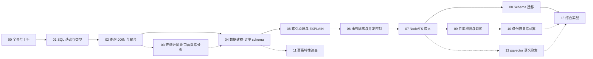

# 数据库学习大纲（PostgreSQL 工程实战向）

> 以 **PostgreSQL 18** 为例，围绕一套「**电商订单系统**」主线，讲述后端开发者真正会用到的数据库能力：落库 → 查询 → 建模 → 索引 → 并发 → 工程接入 → 迁移 → 排障 → 运维 → 语义检索。全程可动手、可运行，最终产出：一个基于 Bun + TypeScript 的可交付订单后端。
>
> 非 408 考研导向、非教材目录导向——**一切知识点的取舍标准是「写业务时会不会用到」**。

---

## 📌 元信息

| 项目 | 说明 |
|------|------|
| **定位** | 工程实战向，非学术；「面试能答、功能能做」，面试只是顺带红利 |
| **目标读者** | 资深全栈 / 前端 Leader（TS/JS/Node/Bun 生态），无需数据库基础，但要会装环境、敢敲 SQL |
| **前置知识** | 任意一门编程语言；TypeScript 基础（第 7 章起有用）；无 SQL 基础可从第 1 章零起点 |
| **数据库版本** | PostgreSQL 18（2025-09 发布，当前补丁 18.6，2026-08-13；19 仍在 Beta，暂不用） |
| **扩展版本** | pgvector v0.8.2（2026-02-25；⚠️ 0.8.0/0.8.1 有 HNSW 并行构建 buffer overflow 缺陷，勿用） |
| **运行环境** | 三选一：`brew install postgresql@18` / Docker / 云托管（Neon、Supabase、RDS） |
| **权威参考** | [PostgreSQL 官方文档](https://www.postgresql.org/docs/current/) · [pgvector](https://github.com/pgvector/pgvector) · [node-postgres](https://node-postgres.com/) · [Drizzle ORM](https://orm.drizzle.team/) |

---

## 🎯 目标读者与学习目标

| 项目 | 内容 |
|------|------|
| **目标读者** | 作者本人画像：全栈工程师 / Agent 开发，已掌握 JS/TS 工程化，无需科普铺垫，直接给结论和路径 |
| **前置要求** | 见元信息表；无硬性门槛 |
| **学习目标** | 从零交付一个基于 PG 18 的电商订单后端：生产级 schema、可解释的索引、安全的并发写、版本化迁移、备份恢复演练、pgvector 商品语义搜索 |
| **面试目标**（弱化） | 隔离级别、MVCC、索引失效、深分页等高频题**顺带能答**，不另设主线 |

---

## 🗺️ 学习路径图



> **如何快速上手**：先走实线主线 **00→01→02→04→05→06→07→08→13**，跑通即可交付「核心版」订单后端；虚线章节按需后置——03（报表/分页，13 章做游标分页时再回看）、09（排障）、10（备份恢复）、11（速查）、12（语义搜索）。13 章交付清单里的语义搜索与备份脚本，属读完 12/10 后的「完整版」增强项，不阻塞主线。

---

## 📚 文档目录规划

```text
src/computer-science/database/
├── database-learning-outline.md              # 本文件（学习大纲）
├── doc/
│   ├── 00-why-postgresql.md                  # 全景与上手
│   ├── 01-sql-basics-and-types.md            # SQL 基础与类型系统
│   ├── 02-query-joins-and-aggregation.md     # 查询实战：JOIN 与聚合
│   ├── 03-window-functions-and-pagination.md # 查询进阶：窗口函数与分页
│   ├── 04-data-modeling.md                   # 数据建模：订单 schema
│   ├── 05-indexes-and-explain.md             # 索引原理与 EXPLAIN
│   ├── 06-transactions-isolation.md          # 事务、隔离级别与并发控制
│   ├── 07-node-ts-driver.md                  # Node/TS 接入
│   ├── 08-schema-migration.md                # Schema 迁移
│   ├── 09-performance-tuning.md              # 性能排障与调优
│   ├── 10-backup-recovery.md                 # 备份恢复与可靠
│   ├── 11-advanced-features.md               # 高级特性速查（JSONB/全文）
│   ├── 12-pgvector.md                        # pgvector 语义检索
│   └── 13-capstone.md                        # 综合实战：订单后端交付
├── lab/                                      # 主线电商库：建表与示例数据 SQL（与章节同步生长）
└── assets/                                   # ER 图、索引示意图、EXPLAIN 截图
```

---

## 📖 篇目规划

| 序号 | 篇名 | 层 | 建议 | 一句话定位 | 核心知识点 | 前置篇目 |
|------|------|----|------|-----------|-----------|---------|
| 00 | PostgreSQL 全景与上手 | 认知 | 主线 | 为什么是 PG、它怎么跑、把环境跑起来 | 选型对比、进程/存储/WAL 鸟瞰、安装、psql | 无 |
| 01 | SQL 基础与类型系统 | 基础 | 主线 | 数据怎么落库：DDL、类型选型、约束 | 建表、主键策略、常用类型、NULL 三值、约束 | 00 |
| 02 | 查询实战：JOIN 与聚合 | 基础 | 主线 | 把业务数据查出来 | SELECT 执行顺序、五种 JOIN、GROUP BY 陷阱 | 01 |
| 03 | 查询进阶：窗口函数与分页 | 基础 | 后置 | 分析型查询：报表、Top N、深分页 | 窗口函数、keyset 分页、DISTINCT ON | 02 |
| 04 | 数据建模：设计订单 schema | 应用 | 主线 | 从需求到表结构及取舍 | ER 三况、反规范化、枚举三选一、jsonb 边界、通用列惯例 | 01~02 |
| 05 | 索引原理与 EXPLAIN | 核心 | 主线 | 数据多了怎么快 | B+Tree 直觉、索引选型、复合/覆盖/部分索引、EXPLAIN | 04 |
| 06 | 事务、隔离级别与并发控制 | 核心 | 主线 | 并发写会不会错 | ACID、隔离四档、MVCC/vacuum、死锁、扣库存三方案 | 05 |
| 07 | Node/TS 接入 | 工程 | 主线 | 在 Bun/TS 里正确连库 | 驱动选型、连接池、防注入、事务封装、最小权限、TS 类型安全 | 06 |
| 08 | Schema 迁移 | 工程 | 主线 | 让 schema 演进可版本化 | drizzle/prisma 迁移、锁表风险、零停机改表、回填 | 07 |
| 09 | 性能排障与调优 | 工程 | 后置 | 慢查询定位与关键参数判断 | 排查流程、N+1/长事务、work_mem 等、vacuum 维护 | 05+07 |
| 10 | 备份恢复与可靠 | 工程 | 后置 | 数据丢了怎么办 | pg_dump、WAL 归档/PITR、流复制、读写分离概念 | 09 |
| 11 | 高级特性速查 | 速查 | 后置 | 随用随查：非结构化与搜索 | JSONB/GIN、全文检索、触发器/物化视图边界 | 04 |
| 12 | pgvector 语义检索 | 速查 | 后置 | 把向量检索装进 PG | embedding、vector 列、距离算子、HNSW vs IVFFlat | 07 |
| 13 | 综合实战：订单后端交付 | 实战 | 主线 | 组装全书，交付可运行后端 | API 分层、事务一致性、索引落地、压测、语义搜索 | 全部 |

> 建议含义：**主线** = 最短上手路径，跑通后交付「核心版」后端；**后置** = 对应需求出现时再补读，不阻塞主线。

---

## 🔁 每篇对比板块规划

每篇文末设「本技术 vs 同类方案 vs 基线」三角对比，来源均可官方验证：

| 篇目 | 对比对象 |
|------|---------|
| 00 | PostgreSQL vs MySQL vs SQLite vs 文档/键值/向量库 |
| 01 | `IDENTITY` vs `SERIAL` vs `UUID`（主键三选一） |
| 02 | 显式 JOIN vs 子查询 vs ORM 写法 |
| 03 | OFFSET 分页 vs keyset 游标分页 vs 三方库 |
| 04 | 关系表 vs JSONB vs 独立文档库 |
| 05 | btree/hash/gin/gist/brin；PG B+Tree vs MySQL InnoDB 索引 |
| 06 | PG MVCC vs MySQL undo log（锁与并发模型差异） |
| 07 | 原生 SQL vs Query Builder（kysely） vs ORM（Prisma/Drizzle） |
| 08 | drizzle-kit vs prisma migrate vs node-pg-migrate |
| 09 | 自建压测调参 vs 云托管（RDS/Neon/Supabase）默认配置 |
| 10 | 逻辑备份 vs 物理备份 vs 云托管自动备份/PITR |
| 11 | PG 全文检索（trgm/tsvector） vs Elasticsearch vs Meilisearch |
| 12 | pgvector vs Milvus vs Qdrant/Pinecone（能力边界） |

---

## 📖 各章知识点细化

### 第 0 章：PostgreSQL 全景与上手（难度：⭐）

**核心问题：为什么是它？它内部大致怎么跑？**

- 选型横评（按作者真实场景）：PostgreSQL vs MySQL vs SQLite vs 文档/键值/向量库
  - 谁适合做主库：事务/一致性/复杂度场景
  - 谁适合做缓存/附属：Redis、SQLite（本地小工具）
  - 谁适合做搜索/向量：Elasticsearch、Milvus/Qdrant（与 PG 的边界）
- PG 架构鸟瞰（只讲直觉，不追深）：
  - 多进程模型：postmaster + 每连接一个 backend process（对比 MySQL 线程模型，解释"连接珍贵"的根源）
  - 连接 = 每个 backend 进程处理的一段会话；shared_buffers = 共享缓存；WAL = 先写日志再落数据（商店记账本比喻）
  - MVCC 一句话预告（第 6 章展开）
- 动手：安装三选一（brew/Docker/Neon-Supabase）、`psql` 常用命令、建库建角色、`.pgpass`/`PGPASSWORD`
- **验证**：本机或云端跑起 PG 18，`psql -l` 能看到自己的库

### 第 1 章：SQL 基础与类型系统（难度：⭐）

**核心问题：数据怎么落到表里，并且存得对。**

- DDL：`CREATE TABLE`、列约束、表约束
- 主键三选一及依据：`bigserial` / `GENERATED ALWAYS AS IDENTITY` / `UUID v7`（含与 JS 端生成 ULID 的配合）
- PG 类型速查（只讲高频，不背手册）：
  - `numeric`（钱必须用它）、`integer/bigint`、`float` 的坑
  - `timestamptz` vs `timestamp`（时区陷阱）、`date`、`interval`
  - `text` vs `varchar(n)`（PG 中两者存储/性能基本一致，长度约束仅 `varchar` 生效）、`uuid`、`boolean`
  - `jsonb` 预告（第 11 章展开）、`array`、`enum` 预告（第 4 章展开）
- **NULL 三值逻辑**：`NULL = NULL` 是 NULL；`NOT IN` 与 NULL 的坑（面试必考）
- 约束：`NOT NULL` / `UNIQUE` / `CHECK` / `FOREIGN KEY` / 默认值（`CURRENT_TIMESTAMP`、`gen_random_uuid()`）
- 常见反例：金额用 float、时间存字符串、手机号用 int
- **验证**：建出 `users` / `products` 两张表，能查能插

### 第 2 章：查询实战：JOIN 与聚合（难度：⭐⭐）

**核心问题：把业务查出来而不出错。**

- SELECT 执行顺序心法：`FROM → WHERE → GROUP BY → HAVING → SELECT → ORDER BY → LIMIT`（几乎所有查询 BUG 的根源）
- 单表查询：`WHERE`/`ORDER BY`/`LIMIT`、`IS NULL`、`BETWEEN`、模式匹配 `LIKE`/`ILIKE`
- JOIN：`INNER / LEFT / RIGHT / FULL / CROSS` 及何时用哪种
  - 自连接（商品分类层级）/ 多表 JOIN 的书写顺序直觉
  - 经典事故：JOIN 条件写错 → 行数爆炸（笛卡尔）
- 聚合与 `GROUP BY` 陷阱：`HAVING` vs `WHERE`；select 列表只能出现分组列或聚合函数；`COUNT(*)` vs `COUNT(col)`
- 子查询 → CTE（`WITH`）：什么时候换 CTE（可读性、复用）
- **验证**：写出订单库常见 6 条业务查询（用户订单列表、商品销量排行等）

### 第 3 章：查询进阶：窗口函数与分页（难度：⭐⭐）

**核心问题：报表类/分析类查询怎么写，列表分页在大数据下怎么不炸。**

- 窗口函数三件套及业务落点：
  - `ROW_NUMBER / RANK / DENSE_RANK` → 分组 Top N（每个用户最近一单）
  - `LAG / LEAD` → 环比、复购间隔
  - `SUM(...) OVER (...)` 累计、移动平均 → 销售趋势
  - `PARTITION BY` 与 `ORDER BY` 在窗口中的职责
- 窗口函数 vs `GROUP BY`：不丢行明细 vs 聚合折叠
- 分页三式：
  - `LIMIT/OFFSET`：简单但深翻页越来越慢（OFFSET 要扫掉前面所有行）
  - **keyset pagination（游标分页）**：`WHERE (created_at, id) > ($1, $2) ORDER BY ... LIMIT n`，生产主选
  - 排序不稳定的坑：必须加唯一列做 tie-breaker
- `DISTINCT ON` 妙用（每组取一条）
- **验证**：用窗口函数算「每月复购用户数」「Top 10 热卖商品」；实现游标分页接口

### 第 4 章：数据建模：设计订单 schema（难度：⭐⭐⭐）

**核心问题：从需求到表结构，并做出合理的取舍。**

- 拆分心智：实体是什么、关系怎么落，避免「一张大宽表」冲动
- 三种关系落 DDL（都在本章完成并入库）：
  - 1:1：用户 ↔ 用户详情（或直接合并，讲合并时机）
  - 1:N：用户 ↔ 订单（FK + 索引）
  - M:N：订单 ↔ 商品（`order_items` 中间表，带购买快照字段）
- 订单系统 schema（本书主线持续使用的库）：
  - `users` / `products` / `inventory`（库存）/ `orders` / `order_items` / `payments`
  - 状态字段用**枚举三选一**：`enum` 类型 vs `CHECK` vs 查找表（依据：是否会扩展、是否要查元数据）
  - 快照设计：`order_items` 冗余商品名/价格（下单后商品改价不影响历史订单）
- 反规范化时机：冗余列 / 冗余计数（`SELECT COUNT(*)` vs 维护计数）——「买单还是买查询」的权衡
- 通用列惯例（业务表必修）：
  - `created_at` / `updated_at`：`DEFAULT now()` vs 应用层写入 vs 触发器——三选一及取舍
  - 软删除 `deleted_at`：查询统一 `WHERE deleted_at IS NULL`，与部分索引/唯一约束的配合（呼应第 5 章）
  - 审计字段：什么场景值得要（合规/操作追踪），什么时候是过度设计
- JSONB vs 关系表：商品属性、订单附加信息何时该放 JSONB（第 11 章实操）
- 主外键之外：`CREATE INDEX` 初步规划（本章建好，第 5 章负责验证和进阶）
- **验证**：落库完整 schema（DDL 存 `lab/`），插入一份含 2 个商品的订单样例数据

### 第 5 章：索引原理与 EXPLAIN（难度：⭐⭐⭐）

**核心问题：数据量上来后，查询为什么慢、怎么让它快。**

- B+Tree 直觉（够用版）：为什么是它而不是哈希表（范围查询、磁盘顺序 IO），三层就能命中 vs 全表扫
- 索引类型盘点，每种配一句话「什么时候有用」：
  - `btree`（默认，等值+范围）、`hash`（仅等值）、`gin`（jsonb/数组/trgm）、`gist`（地理/范围）、`brin`（超大表顺序数据）
- 复合索引：**最左前缀原则**；覆盖索引（`index-only scan` 省回表）
- 部分索引（`WHERE status='active'` 场景）、表达式索引（`lower(email)`）
- `EXPLAIN ANALYZE` 入门：如何读 cost / rows / Seq Scan vs Index Scan vs Bitmap Heap Scan
- 实战案例：找一条慢 SQL → 补索引 → 前后对比
- 高频踩坑：函数包字段导致索引失效、隐式类型转换（`id = '1'`）、索引不是越多越好
- **验证**：对 `orders` 高频查询建复合索引，用 `EXPLAIN ANALYZE` 对比行数/耗时

### 第 6 章：事务、隔离级别与并发控制（难度：⭐⭐⭐⭐）

**核心问题：并发写的时候会不会错，怎么保证不错。**

- ACID 一句话消化；`BEGIN / COMMIT / ROLLBACK`；`SAVEPOINT`
- 并发问题四态：脏读 / 不可重复读 / 幻读 / 更新丢失——每个都给可复现 SQL
- 隔离级别四档：PG 实际只有 RC（默认）/ Repeatable Read / Serializable 有意义；每档能防什么
- MVCC 直觉：快照、xmin/xmax、读写不互斥；`UPDATE/DELETE` 产生新版本 → 表膨胀（bloat）→ `VACUUM`/`autovacuum` 是为什么存在
- 行锁与死锁：复现一个死锁、用 `pg_locks` + `log_lock_waits` 定位、修复（统一锁顺序）
- 扣库存三条路线（电商核心，动手实现）：
  1. 乐观锁：`UPDATE inventory SET stock = stock - 1 WHERE id=$1 AND stock >= 1`（正确且简单，首选）
  2. `SELECT ... FOR UPDATE` 悲观锁：何时必要
  3. 队列抢单：`SKIP LOCKED`（秒杀/任务队列表）
- 工程侧坑：长事务、事务里发 HTTP、锁顺序不一致
- **验证**：两个 psql 窗口复现不可重复读/死锁并修复；用 SQL 实现防超卖扣库存

### 第 7 章：Node/TS 接入：驱动、连接池与事务封装（难度：⭐⭐⭐）

**核心问题：在 Bun/TS 工程里，怎么连库才不出性能与安全问题。**

- 驱动选型三角：`pg`（node-postgres，生态最稳）/ `postgres.js`（现代/轻）/ Bun 内置 `bun:sql`
- 连接池为什么必须：连接是进程、昂贵又有限（呼应第 0 章）；`Pool` 关键参数：`max` / `connectionTimeoutMillis` / `idleTimeoutMillis` / `statement_timeout`
- 参数化查询防注入：永远 `$1, $2`，禁止字符串拼接；注入复现演示
- 应用层事务封装：单连接执行 `BEGIN/COMMIT/ROLLBACK` 的封装函数、出错自动回滚、必要时的重试
- 最小权限连接模型：应用角色只授 DML（`SELECT/INSERT/UPDATE/DELETE`）、迁移角色授 DDL、禁止超级用户/库主跑应用（呼应第 0 章角色）；凭据走环境变量，密钥不进仓库
- TS 类型安全三层递进：手写 `Row` 类型 → 查询构建器（kysely）→ ORM（Drizzle / Prisma）选型讨论
- **验证**：用 `pg` + Bun 写一个带事务的扣库存 API（下单 → 扣库存 → 失败回滚）

### 第 8 章：Schema 迁移：改表怎么不出事（难度：⭐⭐⭐）

**核心问题：生产环境改表是高频事故源，怎么让它变成可回退的日常操作。**

- 为什么要迁移文件（vs 直接 `psql` 改表）：可追溯、可回滚、多人协作、环境同步
- 工具选型：`drizzle-kit`（贴近 SQL、TS 生成类型）vs `prisma migrate`（工程化强但重）vs `node-pg-migrate`
- 迁移实践（挑重点）：
  - 每个迁移一个文件，只增不改历史
  - 加列带 `DEFAULT`：PG 11+ 有快速默认值，但也存在锁表场景，怎么安全加
  - 重命名列/表的风险与 `ALTER TABLE ... RENAME` 的 cache invalidation 依赖
  - 大数据回填：分批 `UPDATE ... WHERE id < ...`
- 回滚策略：`up/down` 一对函数；「能下钻到任意版本」的语义
- **验证**：为订单库先后加 `coupons` 表、给 `orders` 加列，走一遍迁移 + 回滚

### 第 9 章：性能排障与调优（难度：⭐⭐⭐⭐）

**核心问题：线上卡了，第一步干什么，关键参数怎么判断。**

- 定位慢查询流程：`pg_stat_statements` 开起来 → 按总耗时排序 → 挑 SQL 优化
- 常见性能杀手清单（每个都给排查手法）：
  - N+1（好在哪一层被放大、如何发现）
  - 无 `LIMIT` / 深分页（呼应第 3 章游标）
  - 连接数打满（`max_connections` 和池的关系）、未提交长事务
  - 表膨胀不收缩 → 查询越来越慢
- 调参判断方法（不背参数表、给判断链路）：`work_mem` / `shared_buffers` / `effective_cache_size`
- 维护操作：`ANALYZE`（统计信息过期导致执行计划漂移）`VACUUM`/`REINDEX` 时机
- **验证**：给一个「卡顿现场」（慢 SQL + 高连接 + 膨胀表），走完从定位到修复的全流程

### 第 10 章：备份恢复与可靠（难度：⭐⭐⭐）

**核心问题：数据没了怎么办——会备份、会恢复、知道兜底。**

- 逻辑备份：`pg_dump` / `pg_restore`（选库/选表/`--jobs` 加速）；`COPY` 导入导出
- 物理备份与 WAL：`pg_basebackup`、`archive_mode`、**PITR（时间点恢复）** 一句话讲清「日志重放」
- 复制与高可用概念：流复制（`pg_standby`→`pg_ctl promote` 思想）、读写分离、主从切换重启后恢复；不自己搭，讲清概念与云托管的关系
- 实操建议：开发库定时 `pg_dump`；生产用云托管（RDS/Neon/Supabase）的自动备份 + PITR
- **验证**：把订单库完整 `pg_dump` 一次 → drop 库 → 恢复 → 数据完整

### 第 11 章：高级特性速查：JSONB 与全文检索（难度：⭐⭐）

**核心问题：非结构化数据和「模糊搜」怎么搞，什么值得用。**

- JSONB：`->`/`->>`/`#>`/`@>`/`?` 操作符、`jsonb_set`、GIN 索引、性能与陷阱（每次写全量重写）
- 商品属性实战：属性差异大的商品用 JSONB 存 → GIN 索引检索
- 全文检索三选一：
  - `ILIKE '%x%'`：能用但扫全表
  - `pg_trgm` GIN：轻量模糊搜索，够用 90% 场景
  - `tsvector/tsquery`：中文分词短板，何时该换 Elasticsearch/Meilisearch
- 触发器 / 存储函数 / 物化视图：什么场景值得用（审计、缓存聚合）、什么时候是坑（业务逻辑别进 DB）
- **验证**：给 `products` 加 JSONB 属性列并用 GIN 检索；实现一个商品名模糊搜索

### 第 12 章：pgvector：把语义检索装进 PG（难度：⭐⭐⭐）

**核心问题：想在 PG 里做向量相似检索（RAG/商品语义搜索），怎么做、边界在哪。**

- 场景：商品语义搜索（「跑步鞋」→ 相近向量）、Agent 记忆检索（呼应 `artificial-intelligence/` 知识库）
- 动手链路：
  - `CREATE EXTENSION vector`；`vector(n)` 列；embedding 生成（OpenAI / 本地模型）
  - 距离算子：`<->`（L2）/ `<=>`（余弦）/ `<#>`（内积），SQL 全文旁路
  - HNSW vs IVFFlat 选型（recall vs 构建成本）；`hnsw.ef_search`
  - 向量 + 结构化混合过滤：`WHERE status='active' ORDER BY embedding <=> ... LIMIT 10`
- Node 集成：`pgvector-node` + pg 驱动 / Prisma
- **能力边界**：多少数据/多高 QPS 后该换专用向量库（Milvus/Qdrant/Pinecone）——「先 PG 后专用」的演进路线
- ⚠️ 版本坑：pgvector 须 ≥ 0.8.2（0.8.0/0.8.1 HNSW 并行构建有 buffer overflow）
- **验证**：给 `products` 建立向量列 + HNSW 索引，实现接口：输入一句话 → 返回 Top 5 相似商品

### 第 13 章：综合实战：订单后端交付（难度：⭐⭐⭐⭐⭐）

**核心问题：把所有章节组装成一个能跑的、有性能保障的后端。**

- 仓库结构：`bun init` + strict TS + oxlint/oxfmt（按仓库规范），分层：`db/`（连接池、事务封装）、`repos/`（仓储）、`routes/`（API）
- 交付清单：
  1. 完整 schema（第 4 章）经迁移管理（第 8 章）
  2. 下单接口：事务 + 乐观锁扣库存 + 幂等（第 6、7 章）
  3. 列表接口：游标分页（第 3 章）
  4. 商品语义搜索接口（第 12 章）
  5. 慢查询优化闭环：`EXPLAIN` 验证 + 索引落地（第 5、9 章）
  6. 备份恢复脚本 + README（第 10 章）
- 压测（可选自写脚本）：并发下单 100 并发不超卖、慢查询收敛
- 产出对标：一个可 clone、可 `bun run dev` 的完整演示项目（与 `src/` 下其它项目 Demo 同规范）
- **验证**：跑通端到端；压测下无超卖、无 O(n) 深翻页

---

## 🎯 练习递进线（同一库，逐步变难）

| 阶段 | 练习 | 提示 | 预期效果 |
|------|------|------|---------|
| 1 | 建 `users` / `products` 表 | 用 `GENERATED ALWAYS AS IDENTITY` | 能插能查，无类型坑 |
| 2 | 写订单列表、商品销量排行查询 | 注意执行顺序心法 | 6 条业务查询跑通 |
| 3 | 算「每月复购用户数」「Top 10 热卖」 | `ROW_NUMBER` / `SUM() OVER` | 一条 SQL 出报表 |
| 4 | 完成订单 6 张表 schema + 样例数据 | 快照设计、枚举三选一、通用列惯例 | 库可跑、含 1 笔 2 商品订单 |
| 5 | 给高频查询建索引 | `EXPLAIN ANALYZE` 前后对比 | 全表扫 → 索引扫 |
| 6 | 实现防超卖扣库存 | `stock >= n` 原子更新 | 并发 100 扣不穿 |
| 7 | 包一个事务化扣库存 API | 单连接事务封装、最小权限角色 | 失败自动回滚 |
| 8 | 加 `coupons` 表并做一次回滚 | up/down 成对 | 能上能下 |
| 9 | 人为制造慢查询并优化 | 用 `pg_stat_statements` 找 | 有据可查的优化过程 |
| 10 | 备份 → 删库 → 恢复 | `pg_dump` + `pg_restore` | 数据完好 |
| 11 | JSONB 商品属性 + 模糊搜索 | GIN / pg_trgm | 属性检索可用 |
| 12 | 商品语义搜索接口 | pgvector HNSW | 输入一句话返 Top5 |
| 13 | 组装交付完整后端 | 章节复用 | 可运行 + 压测通过 |

---

## 🎤 面试覆盖（顺带红利，非主线）

| 高频面试点 | 覆盖篇目 |
|-----------|---------|
| MySQL vs PostgreSQL 选型、连接模型差异 | 00 |
| NULL 三值逻辑、`NOT IN` 陷阱 | 01 |
| GROUP BY 注意事项、HAVING vs WHERE | 02 |
| OFFSET 深分页为什么慢、游标分页 | 03 |
| 反规范化、JSONB vs 关系表 | 04 |
| 软删除的实现与索引配合、通用列惯例 | 04 |
| B+Tree 为什么快、索引失效场景、最左前缀 | 05 |
| 隔离级别四档、MVCC、死锁、超卖解决方案 | 06 |
| 连接池原理与泄漏、SQL 注入防护 | 07 |
| 最小权限、应用/迁移角色划分 | 07 |
| 迁移工具与锁表、加列默认值 | 08 |
| N+1、慢查询定位流程 | 09 |
| 备份方案、PITR | 10 |
| GIN / 全文检索 vs ES | 11 |
| pgvector 定位 vs 专用向量库 | 12 |

> 定位声明：本章节知识点的讲解**默认以「工程里怎么用」为先**，面试能答只是结果之一，不做单独准备。

---

## 🔍 与既有知识库的互补关系

| 模块 | 互补点 |
|------|--------|
| [docker/](../../deploy/docker/) | 用 docker-compose 一键起 PG 18 + 备份卷挂载 |
| [linux/](../../deploy/linux/) | 连接数打满、文件句柄、网络排查（第 9 章现场） |
| [networking/](../../computer-science/networking/) | 连接池与 TCP 连接复用、keepalive 底层 |
| [security/](../../computer-science/security/) | SQL 注入攻击面（第 7 章参数化实践） |
| [design-patterns/](../../computer-science/design-patterns/) | Repository / Unit of Work 模式在第 13 章落地 |
| [artificial-intelligence/](../../artificial-intelligence/) | pgvector 商品语义搜索、Agent 记忆检索互通 |

---

## ✅ 完成标准

- [ ] 本机/云端跑起 PG 18，能用 psql 完成建库、建角色
- [ ] 能熟练建表并说出主键三选一的取舍；金额必用 `numeric`
- [ ] 能画 SELECT 执行顺序，写出 5 种 JOIN 与 GROUP BY 常见查询
- [ ] 能用窗口函数完成分组 Top N、累计、环比；列表分页用游标
- [ ] 完整跑通订单 6 表 schema，能解释订单项为何存快照
- [ ] 订单表带通用列惯例（created_at/updated_at/软删除）；应用用最小权限角色连库，不用超级用户
- [ ] 能解释 B+Tree 直觉，会用 `EXPLAIN ANALYZE` 优化一条慢 SQL
- [ ] 能复现不可重复读/死锁，用 PostgreSQL 实现防超卖扣库存
- [ ] 能用 pg 驱动 + Bun 封装连接池与事务，接口防注入
- [ ] 能完成一次迁移的上与回滚，知道加列时的锁风险
- [ ] 能按流程定位慢查询并给出调整结论（不背参数）
- [ ] 能完成一次备份与恢复演练
- [ ] 能给商品实现 JSONB 属性与模糊搜索
- [ ] 能给商品接 pgvector 语义搜索，并说明边界与版本坑
- [ ] 交付可运行订单后端：迁移可管理、并发不超卖、列表不分页爆炸、语义可搜索

---

## 📝 学习建议

1. **库就是主线**：第 4 章 schema 落库后，后续每章都在同一库上动手，别每章重开新库
2. **先跑通再深挖**：每个示例先亲手敲一遍看到结果，再回头理解原理；原理只讲到够用（大纲已替你砍过一轮）
3. **两个 psql 窗口是并发课的必备道具**：隔离级别、死锁全靠多窗口复现才有肌肉记忆
4. **EXPLAIN 是核心工具**：第 5 章往后，遇到任何「为什么慢」都先 `EXPLAIN ANALYZE` 再猜
5. **ORM 放舒服的位置**：先掌握原生 SQL（前面 6 章），第 7 章再谈 ORM，避免被框架遮住真相
6. **云托管 ≠ 学习障碍**：本地学原理，云上练运维（备份/只读副本），两条腿走路
7. **版本锚点**：本文按 PG 18 撰写；PG 19 预计 2026-09 GA，届时只核对差异，不重写
8. **廉洁引用**：示例 SQL 建议在本地跑，截图/输出存到 `assets/`