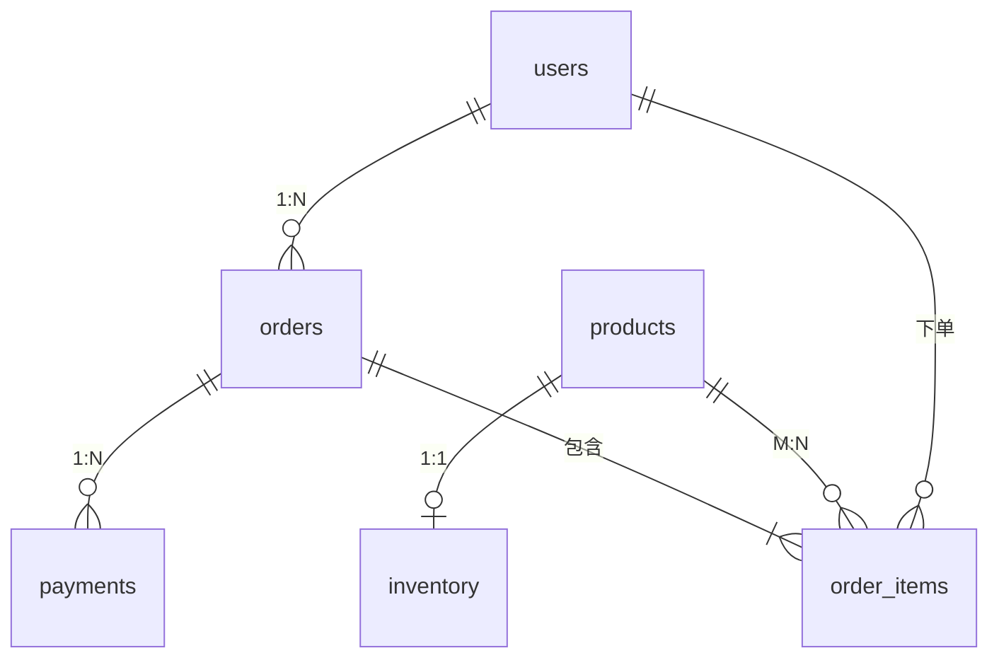

# 04 — 数据建模：设计订单 schema

> 从需求到表结构。这一章把第 1/2 章的简化表升级成完整的**订单系统 schema**（6 张表落库），并讲清楚三种关系怎么落 DDL、状态字段怎么存、通用列怎么设计。**这是全书的地基：从本章起，所有章节都在这套库上动手。**

---

## 📌 元信息

| 项目 | 内容 |
|------|------|
| **模块** | 应用层 · 第 5 篇（主线） |
| **预计时间** | 60 ~ 75 分钟 |
| **面试可答** | 三种关系分别怎么建表；订单项为什么存快照；软删除 + 唯一约束怎么共存 |

---

## 1. 拆分心智：先找"实体"，再定"关系"

拿到需求别急着写列。先问三个问题：

1. **有哪些实体？**（能独立存在、独立查询的事物：用户、商品、订单、支付…）
2. **实体间是什么关系？**（1:1 / 1:N / M:N）
3. **哪些属性属于谁？**（商品价格属于商品，不塞进订单表）

口诀：**一次查询只碰一张表是理想，两张表是常态，三张表就该警惕建模有问题。** 如果一张表 30 个字段、注释写着"暂时备用的列"，基本是没建模。

---

## 2. 三种关系落 DDL（都在本章入库）

| 关系 | 场景 | 落表方式 |
|------|------|---------|
| **1:1** | 商品 ↔ 库存 | 任选一边放对方的 FK + 唯一约束；或合并成一张表。**倾向合并，除非访问模式明显不同**（库存高频更新，想减少同行的锁竞争） |
| **1:N** | 用户 ↔ 订单 | 在"多"的一边（订单）放 `user_id` FK |
| **M:N** | 订单 ↔ 商品 | **中间表**（`order_items`）：两边各放 FK，中间表还可以附带关系属性（数量、快照价） |

```sql
-- 1:1 —— 我们让 inventory.product_id 直接做主键（即 FK + 唯一）
CREATE TABLE inventory (
  product_id bigint PRIMARY KEY REFERENCES products(id),
  stock      integer NOT NULL DEFAULT 0 CHECK (stock >= 0)
);
```

> 💡 M:N 中间表是面试常考：它存的不是"关系概念"，而是**带属性的事实**。`order_items` 里存的是"这单买了什么、当时多少钱"，不是"订单和商品有关系"。

---

## 3. 订单系统 schema 终版（本书主线库）

完整 DDL 已落盘 [lab/schema.sql](../lab/schema.sql)，直接执行：

```bash
psql -U shop_app -h localhost -d shop -f lab/schema.sql
```

结构总览：



**三个值得掰开了讲的设计决策：**

### 决策一：订单主键用 UUIDv7（对外暴露的 ID）

`orders.id uuid PRIMARY KEY DEFAULT uuidv7()`。理由（呼应第 1 章）：订单号会出现在订单详情 URL、回调、客服沟通里，暴露自增序号会泄露"平台每天多少单"。而 `uuidv7()` 时间有序，索引性能几乎等同于自增（PG 18 内置，RFC 9562）。

### 决策二：order_items 存快照（商品名 + 单价）

订单项上冗余了 `product_name` 和 `unit_price`。为什么？**商品改价/改名/下架都不该影响历史订单**——下单后商品从 99 涨到 199，你的历史订单明细还是应该显示 99。这就是"快照"：下单那一刻的事实拷贝。

> ⚠️ 反例：只存 `product_id`，明细靠 JOIN 商品表现查。商品改名后，历史订单显示的是新名字——客服只会有理说不出。

### 决策三：总额也冗余（total_amount）

`orders.total_amount` 同样是快照。订单总额 = 下单时 items 之和，不随未来折扣/改价漂移。**"是不是总能算出来" ≠ "应该每次都算"**——高频读取的派生值该物化（这就是"买单还是买查询"，§5 展开）。

---

## 4. 状态字段：枚举三选一

订单状态、支付状态这类字段，有三种存法：

| 方案 | 写法 | 优点 | 缺点 | 什么时候用 |
|------|------|------|------|-----------|
| `text` + `CHECK` | `status text CHECK (status IN ('pending','paid','cancelled'))` | 普通 DDL，加值就是改约束 | 无类型强约束之外的元数据 | **默认选它**（第 1 章已定） |
| PG `enum` 类型 | `CREATE TYPE order_status AS ENUM (...)` | 类型即白名单，排错直观 | **加值要 `ALTER TYPE`，线上改起来重**；排序顺序固定 | 值几乎不变且确定 |
| 查找表 | `order_status` 独立小表 + FK | 可带元数据（展示名/排序权重） | 每次 JOIN、查询绕 | 状态要带额外展示信息、可能频繁增删 |

订单状态已能预见"支付/发货/完成"等演进 → **不选 enum**，用 `text + CHECK`，迁移成本最低。

---

## 5. 通用列惯例（每张业务表都改不了的骨架）

在 §2 之前先把这个立好，后面表直接套：

### created_at / updated_at

```sql
created_at timestamptz NOT NULL DEFAULT now(),   -- 只读，DEFAULT 就够
updated_at timestamptz NOT NULL DEFAULT now()    -- 谁来更新？见下
```

PG **没有** MySQL 的 `ON UPDATE CURRENT_TIMESTAMP` 语法。三个方案：

| 方案 | 做法 | 评价 |
|------|------|------|
| 应用层写入 | UPDATE 时显式 `SET updated_at = now()` | 容易漏，尤其 ORM 批量改表 |
| **数据库触发器** | BEFORE UPDATE 触发器统一赋值（见 schema.sql 的 `set_updated_at()`） | **推荐**：任何客户端都躲不掉 |
| 中间件自动加 | ORM 钩子 | 依赖框架，治标不治本 |

> ⚠️ 触发器版的坑：某些"心跳式" UPDATE（每 10 秒更新在线状态）会把每行都刷一遍，导致大量无效新版本 → 表膨胀（第 6/9 章）。

### 软删除 deleted_at

```sql
deleted_at timestamptz   -- NULL = 正常；有值 = 已删除
```

痛点：**软删除和唯一约束打架**。用户"删"了再注册同名 email，`UNIQUE(email)` 会挡在前面。解法：把全局唯一降级为**部分唯一索引**（只约束未删除的行）：

```sql
-- schema.sql 已含：只保证"活着"的用户 email 唯一
CREATE UNIQUE INDEX users_email_unique_active
  ON users (email) WHERE deleted_at IS NULL;
```

> 💡 是否真的要软删除？**默认不要**，除非有"恢复原状"或"保留审计"的硬需求。软删除要付出全查询 `WHERE deleted_at IS NULL` 的代价，也容易漏删级联。真实订单业务一般只对"用户"这类可恢复实体开。

### 审计字段（created_by 等）

只有合规/追责场景才值得（谁操作了什么）。普通 CRUD 表加了就是没人用的死字段。**过度设计，别加**。

---

## 6. 反规范化：买单还是买查询

规范化的代价是"JOIN 变多"。反规范化 = 用冗余换查询快。三个常见选择：

| 场景 | 规范化做法 | 反规范化做法 | 结论 |
|------|-----------|-------------|------|
| 订单明细 | 每次 JOIN 商品表 | items 存商品名/价快照 | **下单就快照**（否则历史被改） |
| 订单总额 | 每次 SUM(items) | orders 冗余 total_amount | **冗余**，读取高频 |
| 用户下单数 | 每次 COUNT(orders) | users 冗余 order_count | **别做**：维护成本 > 收益，COUNT 有索引可控 |

判断标准就一句：**这个值"被读的频率 vs 被写的维护成本"。** 高频读、低频变 → 冗余；反之别碰。

---

## 🎯 练习

**要求**：执行 `lab/schema.sql` 把 6 张表建好；插入样例数据：2 个用户、3 个商品（含库存）、1 笔含 2 个商品明细的订单、1 笔支付。

**提示**：先插入 users → products → inventory → orders（拿 `RETURNING id`）→ order_items → payments；字段有主外键顺序是硬约束。订单状态从 `pending` 起步即可。

**预期效果**：`\dt` 看到 6 张表；`\d orders` 显示 uuid 主键 + CHECK 约束 + 触发器；下面这条查询能出结果：

```sql
SELECT o.id, u.email, o.status, o.total_amount,
       array_agg(oi.product_name) AS items
FROM orders o
JOIN users u      ON u.id = o.user_id
JOIN order_items oi ON oi.order_id = o.id
GROUP BY o.id, u.email;
```

---

## 🎤 面试问答

> **问：M:N 关系怎么存？中间表还能放什么？**
> **答：** 用中间表，双方各放 FK。中间表不只是一根"关系线"，通常携带关系属性——比如订单明细的数量、单价快照，这让它变成了业务事实表，而不是纯映射表。
>
> **问：订单明细为什么冗余商品名和价格？**
> **答：** 因为商品会变（改名、改价、下架），而订单是**历史事实**，必须稳定。冗余的瞬间值 = 快照，防止历史订单被未来商品变更污染。这是反规范化里最值得做的一种。
>
> **问：软删除怎么和唯一索引共存？**
> **答：** 全局 `UNIQUE(email)` 会把已删除的行也算进去，导致同名无法复用。解法是**部分唯一索引 `UNIQUE ... WHERE deleted_at IS NULL`**，把约束范围缩小到"活跃行"。这也是部分索引（第 5 章）的实际应用。
>
> **追问：enum 类型还是 CHECK？**
> **答：** 默认 `text + CHECK`：加值是改约束（成本低），`ALTER TYPE ADD VALUE` 在事务/旧版上有额外负担（且不能移除值）。enum 只适合"值域几乎永不变"的场景。

---

## 🔁 对比板块：关系表 vs JSONB vs 独立文档库

| 维度 | 关系表（本 schema） | JSONB 列 | 独立文档库（MongoDB） |
|------|--------------------|----------|---------------------|
| 强约束 | ✅ PK/FK/CHECK | ❌ 结构自由 | ❌ |
| 跨实体 JOIN | ✅ 天生 | ❌ 要应用层拼 | ❌ |
| 动态/异构字段 | ❌ 加 ALTER | ✅ 随用随写 | ✅ |
| 检索 | 强 | GIN 索引（第 11 章） | 弱 |
| 适用 | **订单/用户等强关系数据** | 商品属性这类"差异大"的附属数据 | 纯文档型、无强关系 |

> 一句话：**主数据用关系表；商品属性这类"每件商品字段都不一样"的，放 JSONB；MongoDB 只在"你确定不需要关系与事务"时才考虑。**

---

**下一篇：[05-indexes-and-explain.md](05-indexes-and-explain.md)** — 数据多了怎么快：索引原理与 EXPLAIN。