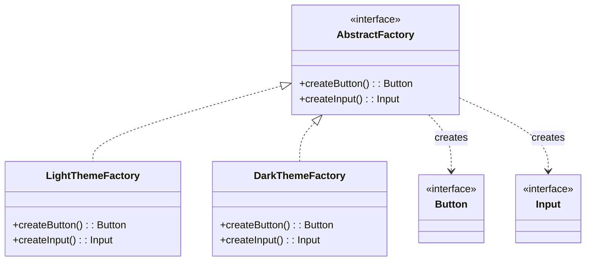

# 抽象工厂模式（Abstract Factory）

## 意图

提供一个接口，用于创建一族相关或相互依赖的对象，而无需指定它们的具体类。

## 结构（UML 类图）



## 适用场景

**该用：**
- 系统需要独立于产品的创建和组合方式
- 产品族中的对象需要一起使用、保证兼容性（如 UI 主题、跨平台组件）
- 需要在运行时切换整套产品族（如切换主题、切换数据库驱动）

**不该用：**
- 只创建单一产品——用 Factory Method 足够
- 产品族之间没有约束关系——不需要捆绑创建
- 产品种类频繁增减——每加一种产品需要改所有工厂接口

## 代价与权衡

| 维度 | 说明 |
|------|------|
| 复杂度 | **高**。新增产品种类需要修改抽象工厂接口 + 所有具体工厂 |
| 一致性 | **好**。强制产品族内对象兼容，避免混搭错误 |
| 可测试性 | 好。注入 mock 工厂即可替换整套依赖 |
| 替代方案 | 配置对象 + Factory Method 组合；DI 容器的 named binding |

## TypeScript 实现

```typescript
// ===== 产品接口 =====
interface Button {
  render(): string;
}
interface Input {
  render(): string;
}

// ===== 具体产品：Light 主题 =====
class LightButton implements Button {
  render(): string {
    return '<button class="btn-light">Click</button>';
  }
}
class LightInput implements Input {
  render(): string {
    return '<input class="input-light" />';
  }
}

// ===== 具体产品：Dark 主题 =====
class DarkButton implements Button {
  render(): string {
    return '<button class="btn-dark">Click</button>';
  }
}
class DarkInput implements Input {
  render(): string {
    return '<input class="input-dark" />';
  }
}

// ===== 抽象工厂 =====
interface UIFactory {
  createButton(): Button;
  createInput(): Input;
}

class LightThemeFactory implements UIFactory {
  createButton(): Button { return new LightButton(); }
  createInput(): Input { return new LightInput(); }
}

class DarkThemeFactory implements UIFactory {
  createButton(): Button { return new DarkButton(); }
  createInput(): Input { return new DarkInput(); }
}

// ===== 客户端代码：只依赖抽象 =====
function renderForm(factory: UIFactory): string {
  const button = factory.createButton();
  const input = factory.createInput();
  return `<form>${input.render()}${button.render()}</form>`;
}

// 运行时切换主题
const theme: UIFactory = process.env.THEME === 'dark'
  ? new DarkThemeFactory()
  : new LightThemeFactory();

console.log(renderForm(theme));
```

## 真实世界实例

| 框架/库 | 实现方式 |
|---------|---------|
| **跨平台 UI 框架**（Qt/Flutter） | 每个平台一套 Widget 工厂（MaterialFactory / CupertinoFactory） |
| **数据库驱动**（TypeORM） | `DriverFactory` 根据 type 创建 MySQL/Postgres/SQLite 驱动族（Connection + QueryRunner + SchemaBuilder） |
| **Webpack** | `Compiler` 创建一族相关对象（Compilation、Resolver、Parser），不同 target（web/node）产出不同族 |
| **AWS SDK v3** | 每个 service client 内部创建一族 signer + serializer + deserializer |

## 易混淆对比

| 对比 | 区别 |
|------|------|
| Abstract Factory vs Factory Method | Abstract Factory 创建**一族**产品（多个方法）；Factory Method 创建**一个**产品（一个方法） |
| Abstract Factory vs Builder | Abstract Factory 强调产品族的兼容性；Builder 强调单个复杂对象的分步构建 |
| Abstract Factory vs Prototype | Abstract Factory 通过 new 创建；Prototype 通过 clone 创建。当产品族初始化成本高时，可用 Prototype 实现 Abstract Factory |

## 关联

- **常配合**：Singleton（工厂实例全局唯一）、Factory Method（抽象工厂的每个方法本质是 Factory Method）
- **架构位置**：在 [software-engineering/](../../software-engineering/software-engineering-learning-outline.md) 第 9 章六边形架构中，Abstract Factory 用于创建适配器族（如同时创建 DB 适配器 + Cache 适配器 + MQ 适配器，保证环境一致性）
