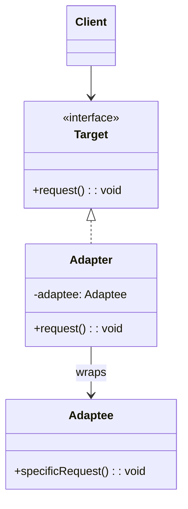

# 适配器模式（Adapter）

> 📍 **导航**：前置 [prototype.md](./prototype.md)（创建型完结） ｜ 后续 [bridge.md](./bridge.md) ｜ 优先级 **P1**

## 意图

将一个类的接口转换为客户端期望的另一个接口，使原本因接口不兼容而无法协作的类可以一起工作。

## 结构（UML 类图）



两种变体：
- **对象适配器**（组合）：Adapter 持有 Adaptee 实例，通过委托调用
- **类适配器**（继承）：Adapter 继承 Adaptee 并实现 Target 接口（TS 中因单继承限制较少使用）

## 适用场景

**该用：**
- 集成第三方库，其 API 与项目内部抽象不一致
- 旧系统接口迁移，新代码需要统一调用方式
- 同一功能有多种实现（XHR / Fetch / Node http），需要统一上层调用

**不该用：**
- 设计初期就预判"将来可能需要适配"——YAGNI，等真正不兼容时再引入
- 接口完全一致只是命名不同——直接重命名或 type alias 更简单

> 🔍 **对应 Code Smell**：第三方接口与内部抽象不匹配、新旧系统集成接口不一致

## 代价与权衡

| 维度 | 说明 |
|------|------|
| 复杂度 | 低。每个适配器通常只有一个类/函数 |
| 运行时开销 | 多一层委托调用，可忽略 |
| 可维护性 | 第三方库升级时只需修改 Adapter，不影响业务代码 |
| 替代方案 | 直接封装工具函数（无 Target 接口时）、Anti-Corruption Layer（DDD 中更重的隔离层） |

> **TS/JS 特化**：TS 的结构化类型系统（duck typing）天然消除了很多"名义类型不兼容"问题。Adapter 在 TS 中更多是**运行时行为适配**（如将 callback 风格转为 Promise），而非编译期类型转换。

## TypeScript 实现

### 对象适配器（组合方式，最常用）

```typescript
// Target: 项目内部统一的日志接口
interface Logger {
  log(level: 'info' | 'warn' | 'error', message: string): void;
}

// Adaptee: 第三方库（假设其 API 与内部接口不一致）
class ThirdPartyLogger {
  writeLog(severity: number, msg: string, timestamp: number): void {
    console.log(`[${severity}] ${new Date(timestamp).toISOString()} - ${msg}`);
  }
}

// Adapter: 将 ThirdPartyLogger 适配为 Logger
class ThirdPartyLoggerAdapter implements Logger {
  private readonly severityMap: Record<string, number> = {
    info: 1,
    warn: 2,
    error: 3,
  };

  constructor(private readonly adaptee: ThirdPartyLogger) {}

  log(level: 'info' | 'warn' | 'error', message: string): void {
    this.adaptee.writeLog(this.severityMap[level], message, Date.now());
  }
}

// Client: 只依赖 Logger 接口
class App {
  constructor(private readonly logger: Logger) {}

  run(): void {
    this.logger.log('info', 'App started');
    this.logger.log('error', 'Something went wrong');
  }
}

const app = new App(new ThirdPartyLoggerAdapter(new ThirdPartyLogger()));
app.run();
```

### 类适配器（继承方式）

```typescript
interface PaymentGateway {
  charge(amountCents: number, currency: string): Promise<{ transactionId: string }>;
}

// Adaptee: 旧版支付 SDK，接口完全不同
class LegacyPaymentSDK {
  processPayment(amount: number, options: { cur: string }): { txn_id: string } {
    console.log(`Legacy SDK processing ${amount} ${options.cur}`);
    return { txn_id: `txn_${Date.now()}` };
  }
}

// 类适配器：继承 Adaptee + 实现 Target
class LegacyPaymentAdapter extends LegacyPaymentSDK implements PaymentGateway {
  async charge(amountCents: number, currency: string): Promise<{ transactionId: string }> {
    const result = this.processPayment(amountCents / 100, { cur: currency });
    return { transactionId: result.txn_id };
  }
}

const gateway: PaymentGateway = new LegacyPaymentAdapter();
gateway.charge(2999, 'USD').then((r) => console.log(r.transactionId));
```

### 函数式适配器（TS 中更轻量）

```typescript
// 环境：Node.js 18+（使用了 node:fs API）
// 将 Node.js callback 风格 API 适配为 Promise 风格
import { readFile } from 'node:fs';

type AsyncFileReader = (path: string) => Promise<string>;

// 适配器：一个函数即可
const adaptReadFile: AsyncFileReader = (path) =>
  new Promise((resolve, reject) => {
    readFile(path, 'utf-8', (err, data) => {
      if (err) reject(err);
      else resolve(data);
    });
  });

// 实际上 Node 已提供 util.promisify 和 fs/promises，这就是标准库级别的 Adapter
```

## 真实世界实例

| 框架/库 | 实现方式 |
|---------|---------|
| **Axios** adapter | `axios.defaults.adapter` 可替换为 `xhr` / `http` / `fetch`，统一上层 `axios(config)` 调用 |
| **Node.js `util.promisify`** | 将 `(err, result)` callback 风格适配为 Promise 风格 |
| **`express-async-handler`** | 将返回 Promise 的 async 中间件适配为 Express 同步错误处理签名 `(req, res, next)` |
| **TypeORM / Prisma** | 将不同数据库驱动（pg / mysql / sqlite）适配为统一的 Repository API |
| **Webpack loader** | 将各种文件格式（Sass / TS / Vue SFC）适配为 Webpack 能处理的 JS 模块 |

## 易混淆对比

| 对比 | 区别 |
|------|------|
| Adapter vs Bridge | Adapter 是**事后补救**，让已有不兼容接口协作；Bridge 是**事前设计**，将抽象与实现分离以独立变化 |
| Adapter vs Decorator | Adapter 改变接口（A 接口 → B 接口）；Decorator 保持接口不变，增强行为 |
| Adapter vs Facade | Adapter 转换单个接口；Facade 为复杂子系统提供简化入口，不改变原有接口 |

## 面试速答

> **问：Adapter 和 Wrapper（Decorator）有什么区别？**
>
> 答：两者结构相似（都是包装一个对象），但意图不同。Adapter 改变接口——将 A 接口转换为 B 接口，解决不兼容问题；Decorator 保持接口不变，在调用前后增强行为。判断标准：包装后对外暴露的接口是否变了——变了是 Adapter，没变是 Decorator。

> **问：你在工作中用过 Adapter 模式吗？举个例子。**
>
> 答：最常见的场景是封装第三方 SDK。比如项目中统一使用 `Logger` 接口，但引入了 Sentry SDK，其 API 签名完全不同，我写了一个 `SentryLoggerAdapter` 将 `Sentry.captureException` 适配为 `logger.log(level, msg)`。另一个典型例子是用 `util.promisify` 将 Node.js callback 风格 API 适配为 Promise 风格。

> **问：TS 的 duck typing 是否让 Adapter 模式不再需要？**
>
> 答：不完全。TS 的结构化类型系统确实消除了很多"名义类型不兼容"的编译期问题，但 Adapter 解决的核心是**运行时行为适配**——比如将 callback 风格转为 Promise、将同步 API 包装为异步、将 REST 响应映射为内部领域模型。这些运行时转换是 duck typing 无法替代的。

## 关联

- **常配合**：Bridge（Bridge 的实现层可复用 Adapter）、Proxy（Proxy 也可包装对象，但目的不同）
- **架构位置**：在 [software-engineering/](../../software-engineering/software-engineering-learning-outline.md) 第 6 章中，Adapter 是防腐层（Anti-Corruption Layer）的核心实现手段，用于隔离外部依赖
