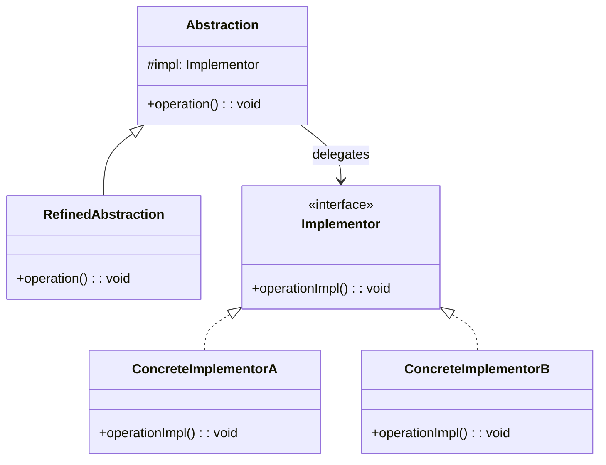

# 桥接模式（Bridge）

## 意图

将抽象部分与它的实现部分分离，使它们都可以独立地变化。核心解决：多维度变化导致的类爆炸问题。

## 结构（UML 类图）



核心思想：用**组合**（持有 Implementor 引用）替代**继承**，将两个独立变化维度拆成两棵类层次。

## 适用场景

**该用：**
- 一个类存在两个或多个独立变化维度（如 UI 组件 × 渲染平台）
- 需要在运行时切换实现（如切换数据库驱动）
- 继承层次因多维度组合而爆炸（M × N 个子类）

**不该用：**
- 只有一个变化维度——普通继承或策略模式即可
- 变化维度在编译期已确定且不会扩展——过度设计

## 代价与权衡

| 维度 | 说明 |
|------|------|
| 复杂度 | 中高。需要预先识别独立变化维度并设计两层接口 |
| 可扩展性 | **好**。新增抽象或新增实现互不影响，符合开闭原则 |
| 运行时开销 | 多一层间接调用（委托），通常可忽略 |
| 替代方案 | 策略模式（Strategy 更侧重算法替换，Bridge 侧重整体架构分层）；插件系统（更动态但更重） |

> **TS/JS 特化**：React 本身就是 Bridge 的典型案例——组件（抽象）与渲染器（实现）完全分离。`react-dom`、`react-native`、`react-three-fiber` 都是同一抽象的不同 Implementor。

## TypeScript 实现

### 经典实现：消息发送（抽象 × 渠道）

```typescript
// Implementor: 发送渠道
interface MessageChannel {
  send(to: string, content: string): void;
}

class EmailChannel implements MessageChannel {
  send(to: string, content: string): void {
    console.log(`[Email] To: ${to}, Content: ${content}`);
  }
}

class SmsChannel implements MessageChannel {
  send(to: string, content: string): void {
    console.log(`[SMS] To: ${to}, Content: ${content}`);
  }
}

class SlackChannel implements MessageChannel {
  send(to: string, content: string): void {
    console.log(`[Slack] #${to}: ${content}`);
  }
}

// Abstraction: 消息类型
abstract class Message {
  constructor(protected channel: MessageChannel) {}

  abstract send(to: string): void;
}

class TextMessage extends Message {
  constructor(channel: MessageChannel, private readonly text: string) {
    super(channel);
  }

  send(to: string): void {
    this.channel.send(to, this.text);
  }
}

class UrgentMessage extends Message {
  constructor(channel: MessageChannel, private readonly text: string) {
    super(channel);
  }

  send(to: string): void {
    // 紧急消息：重复发送 + 加前缀
    const content = `[URGENT] ${this.text}`;
    this.channel.send(to, content);
    this.channel.send(to, `[Reminder] ${content}`);
  }
}

// 使用：抽象和实现自由组合
const email = new EmailChannel();
const slack = new SlackChannel();

new TextMessage(email, 'Hello').send('alice@example.com');
new UrgentMessage(slack, 'Server down!').send('ops-team');
```

### React 风格的 Bridge（抽象与渲染器分离）

```typescript
// Implementor: 渲染器接口
interface Renderer {
  createElement(type: string, props: Record<string, unknown>, children: VNode[]): VNode;
  render(vnode: VNode, container: unknown): void;
}

interface VNode {
  type: string;
  props: Record<string, unknown>;
  children: VNode[];
}

// ConcreteImplementor: DOM 渲染器
class DomRenderer implements Renderer {
  createElement(type: string, props: Record<string, unknown>, children: VNode[]): VNode {
    return { type, props, children };
  }

  render(vnode: VNode, container: unknown): void {
    console.log(`[DOM] Rendering <${vnode.type}> into`, container);
  }
}

// ConcreteImplementor: 终端渲染器
class TerminalRenderer implements Renderer {
  createElement(type: string, props: Record<string, unknown>, children: VNode[]): VNode {
    return { type, props, children };
  }

  render(vnode: VNode, _container: unknown): void {
    console.log(`[Terminal] Drawing "${vnode.type}" with props:`, vnode.props);
  }
}

// Abstraction: 组件系统（不关心渲染到哪里）
class Component {
  constructor(private readonly renderer: Renderer) {}

  createView(type: string, props: Record<string, unknown>, ...children: VNode[]): VNode {
    return this.renderer.createElement(type, props, children);
  }

  mount(vnode: VNode, container: unknown): void {
    this.renderer.render(vnode, container);
  }
}

// 同一组件逻辑，不同渲染目标
const webApp = new Component(new DomRenderer());
const cliApp = new Component(new TerminalRenderer());

const view = webApp.createView('div', { className: 'app' });
webApp.mount(view, document.body);       // DOM 渲染
cliApp.mount(view, process.stdout);      // 终端渲染
```

## 真实世界实例

| 框架/库 | 实现方式 |
|---------|---------|
| **React** | 组件（Abstraction）与渲染器（`react-dom` / `react-native` / `react-test-renderer`）分离 |
| **Vue 3** | `@vue/runtime-core` 是抽象层，`@vue/runtime-dom` / `@vue/runtime-test` 是具体 Implementor |
| **JDBC / TypeORM** | 应用代码（Abstraction）通过 Driver 接口（Implementor）访问不同数据库 |
| **SLF4J / Winston transports** | 日志 API（Abstraction）与输出目标（Console / File / HTTP）分离 |
| **OpenGL / WebGL** | 图形 API 抽象与具体 GPU 驱动实现的分离 |

## 易混淆对比

| 对比 | 区别 |
|------|------|
| Bridge vs Strategy | 结构相似，但意图不同：Bridge 是架构级分层（两个维度独立演化）；Strategy 是行为级替换（同一算法族） |
| Bridge vs Adapter | Bridge 是**设计时**预防类爆炸；Adapter 是**事后**让不兼容接口协作 |
| Bridge vs Abstract Factory | Abstract Factory 可用来创建 Bridge 中 Implementor 的具体实例，二者互补 |

## 关联

- **常配合**：Abstract Factory（创建具体 Implementor）、Adapter（已有实现不符合 Implementor 接口时包装）
- **架构位置**：在 [software-engineering/](../../software-engineering/software-engineering-learning-outline.md) 第 6 章中，Bridge 思想对应"端口与适配器"（Hexagonal Architecture）的核心分层原则
