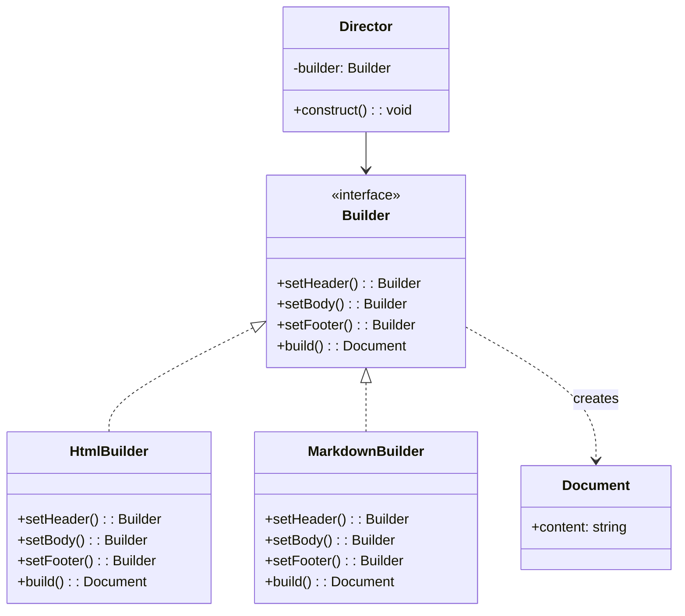

# 建造者模式（Builder）

> 📍 **导航**：前置 [abstract-factory.md](./abstract-factory.md) ｜ 后续 [prototype.md](./prototype.md) ｜ 优先级 **P1**

## 意图

将一个复杂对象的构建过程与其表示分离，使得同样的构建过程可以创建不同的表示。核心解决：构造函数参数爆炸问题。

## 结构（UML 类图）



> **TS 实践**：Director 角色在 TS 中常被省略，客户端直接链式调用 Builder。

## 适用场景

**该用：**
- 构造函数参数 > 4-5 个，且多数可选
- 对象创建需要多步骤、有顺序依赖
- 同一构建过程需要产出不同表示（HTML / Markdown / PDF）
- 需要不可变对象（构建完成后 freeze）

**不该用：**
- 对象简单，2-3 个参数——直接用 options 对象
- 构建步骤不固定、高度动态——Builder 的固定步骤反而成为约束

> 🔍 **对应 Code Smell**：构造函数参数爆炸（>4-5 个）、telescoping constructor 反模式（参考大纲附录速查表）

## 代价与权衡

| 维度 | 说明 |
|------|------|
| 复杂度 | 中。每个产品需要对应一个 Builder 类 |
| 可读性 | **好**。链式调用比长参数列表清晰得多 |
| 安全性 | 可在 `build()` 中做完整性校验，避免半初始化对象 |
| 替代方案 | Options 对象（`{ host, port, timeout }`）——参数少时更简洁 |

> **TS 特化**：TypeScript 的 Options 对象 + 类型推导已经解决了大部分"参数爆炸"问题。Builder 更适合有**步骤顺序约束**或需要**多种输出格式**的场景。

## TypeScript 实现

### 链式 Builder（最常用）

```typescript
interface RequestConfig {
  url: string;
  method: 'GET' | 'POST' | 'PUT' | 'DELETE';
  headers: Record<string, string>;
  body?: unknown;
  timeout: number;
  retries: number;
}

class RequestBuilder {
  private config: Partial<RequestConfig> = {
    method: 'GET',
    headers: {},
    timeout: 5000,
    retries: 0,
  };

  constructor(url: string) {
    this.config.url = url;
  }

  method(m: RequestConfig['method']): this {
    this.config.method = m;
    return this;
  }

  header(key: string, value: string): this {
    this.config.headers![key] = value;
    return this;
  }

  body(data: unknown): this {
    this.config.body = data;
    return this;
  }

  timeout(ms: number): this {
    this.config.timeout = ms;
    return this;
  }

  retries(n: number): this {
    this.config.retries = n;
    return this;
  }

  build(): Readonly<RequestConfig> {
    if (!this.config.url) throw new Error('URL is required');
    if (this.config.body && this.config.method === 'GET') {
      throw new Error('GET request cannot have body');
    }
    return Object.freeze({ ...this.config } as RequestConfig);
  }
}

// 使用
const request = new RequestBuilder('https://api.example.com/users')
  .method('POST')
  .header('Content-Type', 'application/json')
  .header('Authorization', 'Bearer xxx')
  .body({ name: 'Alice' })
  .timeout(10000)
  .retries(3)
  .build();
```

### 类型安全的 Builder（编译期强制必填项）

```typescript
type RequiredKeys = 'url' | 'method';

class TypedBuilder<Set extends string = never> {
  private config = {} as Record<string, unknown>;

  url(u: string): TypedBuilder<Set | 'url'> {
    this.config.url = u;
    return this as unknown as TypedBuilder<Set | 'url'>;
  }

  method(m: string): TypedBuilder<Set | 'method'> {
    this.config.method = m;
    return this as unknown as TypedBuilder<Set | 'method'>;
  }

  header(k: string, v: string): this {
    (this.config.headers ??= {} as Record<string, string>)[k] = v;
    return this;
  }

  // 只有 url 和 method 都设置后，build 才可用
  build(this: TypedBuilder<'url' | 'method'>): Readonly<Record<string, unknown>> {
    return Object.freeze({ ...this.config });
  }
}

// new TypedBuilder().build() // ❌ 编译错误：this 类型不匹配
// new TypedBuilder().url('/api').build() // ❌ 编译错误：缺少 method
new TypedBuilder().url('/api').method('GET').build(); // ✅
```

## 真实世界实例

| 框架/库 | 实现方式 |
|---------|---------|
| **SQL Query Builder**（Knex.js / TypeORM `QueryBuilder`） | `.select().from().where().orderBy().build()` |
| **`new Request(url, init)`** | Fetch API 的 init 对象是简化版 Builder（Options 模式） |
| **Jest `expect`** | `expect(x).not.toHaveBeenCalledWith(...)` 链式断言 |
| **Protobuf / gRPC** | 生成代码中的 `Message.newBuilder().setField().build()` |
| **NestJS `Test.createTestingModule`** | `.setImports().setControllers().setProviders().compile()` |

## 易混淆对比

| 对比 | 区别 |
|------|------|
| Builder vs Abstract Factory | Builder 分步构建**一个**复杂对象；Abstract Factory 一步创建**一族**对象 |
| Builder vs Factory Method | Builder 关注构建过程和步骤；Factory Method 关注创建什么类型 |
| Builder vs Options 对象 | Options 是无序的键值对；Builder 可强制步骤顺序、支持条件逻辑和校验 |

## 面试速答

> **问：什么时候用 Builder，什么时候用 Options 对象就够了？**
>
> 答：参数 ≤ 4-5 个且无顺序依赖时，Options 对象（`{ host, port, timeout }`）更简洁。Builder 适合：参数多且有必填/可选区分、构建步骤有顺序约束、需要在 build() 时做交叉校验、或同一构建过程要产出不同格式。TS 中 Options + 类型推导已解决大部分场景，Builder 留给真正复杂的构建。

> **问：Builder 模式如何保证不可变性？**
>
> 答：在 build() 方法中返回 Object.freeze() 冻结的对象，Builder 内部维护的是可变草稿。关键是 build() 返回后，Builder 继续修改不影响已产出的对象。TS 中用 Readonly<T> 作为返回类型，编译期就阻止修改。进阶做法：每次 setter 返回新 Builder 实例（persistent data structure），彻底无副作用。

> **问：TS 中如何实现"必填项未设置就编译报错"的 Builder？**
>
> 答：用泛型类型参数追踪已设置的 key。例如 `class Builder<Set extends string = never>`，每个 setter 返回 `Builder<Set | 'fieldName'>`，build() 方法通过 `this: Builder<'url' | 'method'>` 约束——只有所有必填 key 都在 Set 中时 this 类型才匹配，否则编译报错。这是 TS 类型体操的经典应用。

## 关联

- **常配合**：Composite（构建树形结构）、Singleton（Builder 实例复用）
- **架构位置**：在 [software-engineering/](../../software-engineering/software-engineering-learning-outline.md) 第 9 章中，复杂中间件/插件配置常用 Builder 模式暴露给用户
