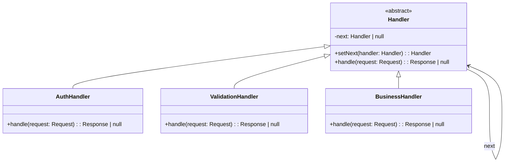

# 责任链模式（Chain of Responsibility）

> 📍 **导航**：前置 [proxy.md](./proxy.md)（结构型完结） ｜ 后续 [command.md](./command.md) ｜ 优先级 **P0**

## 意图

将请求的发送者和接收者解耦，使多个对象都有机会处理请求。将这些对象连成一条链，沿着链传递请求，直到有一个对象处理它为止。

## 结构（UML 类图）



核心机制：
- 每个处理器决定自己处理或传递给下一个
- 客户端无需知道哪个处理器最终处理了请求
- 链的组装与处理逻辑分离

## 适用场景

**该用：**
- 多个对象可以处理同一请求，具体处理者运行时决定（如中间件管道）
- 请求需要经过多层处理（认证 → 限流 → 日志 → 业务）
- 处理者集合需要动态配置（插件系统）

**不该用：**
- 只有一个固定处理者——直接调用即可
- 需要所有处理者都执行（那是 Pipeline/Interceptor，不是经典 CoR）
- 链过长导致调试困难，且处理顺序无实际意义

> 🔍 **对应 Code Smell**：多层处理逻辑硬编码嵌套、请求处理者运行时才能确定

## 代价与权衡

| 维度 | 说明 |
|------|------|
| 复杂度 | 中。需要定义处理器接口和链组装逻辑 |
| 可调试性 | **差**。请求在链中流转，断点跟踪困难 |
| 性能 | 链过长时有遍历开销；但通常可忽略 |
| 灵活性 | **高**。运行时可增删、重排处理器 |
| 替代方案 | 函数组合（`compose(fn1, fn2, fn3)`）、装饰器模式、事件系统 |

> **TS/JS 特化**：JS/TS 生态中责任链最普遍的形态是**中间件**（Express/Koa middleware）。函数是一等公民，不需要经典的 Handler 类继承体系，直接用函数数组 + compose 即可。

## TypeScript 实现

### 经典链表式

```typescript
interface RequestContext {
  url: string;
  method: string;
  user?: string;
  body?: unknown;
}

abstract class Middleware {
  protected next: Middleware | null = null;

  setNext(handler: Middleware): Middleware {
    this.next = handler;
    return handler; // 支持链式组装
  }

  abstract process(ctx: RequestContext): boolean;

  protected passToNext(ctx: RequestContext): boolean {
    if (this.next) {
      return this.next.process(ctx);
    }
    return false; // 链尾无人处理
  }
}

class AuthMiddleware extends Middleware {
  process(ctx: RequestContext): boolean {
    if (!ctx.user) {
      console.log('401 Unauthorized');
      return true; // 已处理（拒绝）
    }
    console.log(`Auth passed: ${ctx.user}`);
    return this.passToNext(ctx);
  }
}

class RateLimitMiddleware extends Middleware {
  private count = 0;
  private readonly limit = 100;

  process(ctx: RequestContext): boolean {
    if (++this.count > this.limit) {
      console.log('429 Too Many Requests');
      return true;
    }
    return this.passToNext(ctx);
  }
}

class BusinessMiddleware extends Middleware {
  process(ctx: RequestContext): boolean {
    console.log(`Handling ${ctx.method} ${ctx.url}`);
    return true;
  }
}

// 组装链
const auth = new AuthMiddleware();
const rateLimit = new RateLimitMiddleware();
const business = new BusinessMiddleware();

auth.setNext(rateLimit).setNext(business);

// 使用
auth.process({ url: '/api/users', method: 'GET', user: 'alice' });
```

### 函数组合式（Koa 洋葱模型）

```typescript
type Context = {
  method: string;
  url: string;
  status: number;
  body: unknown;
};

type Next = () => Promise<void>;
type MiddlewareFn = (ctx: Context, next: Next) => Promise<void>;

function compose(middlewares: MiddlewareFn[]): MiddlewareFn {
  return function (ctx: Context, next: Next): Promise<void> {
    let index = -1;

    function dispatch(i: number): Promise<void> {
      if (i <= index) {
        return Promise.reject(new Error('next() called multiple times'));
      }
      index = i;

      const fn = i < middlewares.length ? middlewares[i] : next;
      if (!fn) return Promise.resolve();

      return Promise.resolve(fn(ctx, () => dispatch(i + 1)));
    }

    return dispatch(0);
  };
}

// 定义中间件
const logger: MiddlewareFn = async (ctx, next) => {
  const start = Date.now();
  console.log(`--> ${ctx.method} ${ctx.url}`);
  await next(); // 进入内层
  console.log(`<-- ${ctx.method} ${ctx.url} ${Date.now() - start}ms`);
};

const auth: MiddlewareFn = async (ctx, next) => {
  // 模拟认证
  await next();
};

const handler: MiddlewareFn = async (ctx, _next) => {
  ctx.status = 200;
  ctx.body = { message: 'Hello' };
};

// 组装并执行
const app = compose([logger, auth, handler]);

const ctx: Context = { method: 'GET', url: '/api/hello', status: 404, body: null };
app(ctx, async () => {}).then(() => {
  console.log(ctx.status, ctx.body);
});
```

## 真实世界实例

| 框架/库 | 实现方式 |
|---------|---------|
| **Express** | `app.use(middleware)` 线性链，`next()` 传递控制权 |
| **Koa** | `compose()` 洋葱模型，`await next()` 实现前后置逻辑 |
| **Axios Interceptors** | `axios.interceptors.request.use()` 请求/响应拦截器链 |
| **DOM 事件冒泡** | 事件沿 DOM 树向上传播，任何节点可 `stopPropagation()` 终止 |
| **NestJS Guards/Pipes/Interceptors** | 请求经过 Guard → Pipe → Interceptor → Handler 多层处理 |

## 易混淆对比

| 对比 | 区别 |
|------|------|
| CoR vs Pipeline | CoR 中任一节点可终止链；Pipeline 中所有阶段必须执行 |
| CoR vs Decorator | Decorator 增强**同一对象**的行为；CoR 在**多个对象**间路由请求 |
| CoR vs Mediator | CoR 是线性传递、单向；Mediator 是中心化协调、多对多 |

## 面试速答

> **问：Express 和 Koa 的中间件模型有什么区别？**
>
> 答：Express 是线性管道，中间件按顺序执行，`next()` 把控制权单向交给下一个，响应一旦发出流程基本结束。Koa 基于 `koa-compose` 实现洋葱模型，`await next()` 会先深入内层中间件，等内层返回后再继续执行当前中间件 `next()` 之后的代码，因此每个中间件都能包裹前后置逻辑（如计时、错误兜底）。

> **问：洋葱模型相比线性管道有什么优势？**
>
> 答：洋葱模型让每个中间件都能在 `await next()` 前后分别做事，天然支持请求计时、日志、try/catch 统一错误处理这类"包裹式"逻辑。线性管道只能前置处理，想做后置统计就得额外 hack。代价是控制流更隐式，调试时需要理解递归式的调用栈。

> **问：责任链过长导致调试困难，你怎么解决？**
>
> 答：首先给每个节点加结构化日志，记录进入/离开和耗时，让链路可观测；其次用命名清晰的函数式组合（`compose(auth, rateLimit, handler)`）替代深层类继承，使组装顺序一目了然。还可以限制链长度、按职责分层，并在开发环境注入一个 trace 中间件打印完整执行路径。

## 关联

- **常配合**：Command（请求封装为对象后沿链传递）、Composite（链节点本身可以是树结构）
- **架构位置**：在 [software-engineering/](../../software-engineering/software-engineering-learning-outline.md) 第 10 章中，HTTP 中间件管道是责任链最典型的架构级应用
