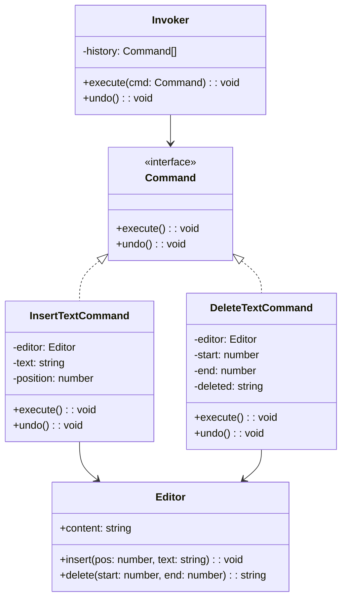

# 命令模式（Command）

## 意图

将请求封装为对象，从而可以用不同的请求对客户端进行参数化，支持请求的排队、记录、撤销与重做。

## 结构（UML 类图）



核心思想：
- 将"做什么"和"怎么做"封装为对象
- Invoker 不关心具体操作内容，只负责调度
- 命令对象携带执行所需的全部上下文

## 适用场景

**该用：**
- 需要撤销/重做（Undo/Redo）功能
- 需要操作日志、事务回滚
- 需要将操作排队、延迟执行或远程发送
- 宏命令（批量操作组合）

**不该用：**
- 简单的函数调用就能解决——无需额外封装
- 操作不可逆（如发送邮件），undo 无意义
- 状态变更极其频繁（每帧 60 次），命令对象开销过大

## 代价与权衡

| 维度 | 说明 |
|------|------|
| 复杂度 | 中。每个操作需要一个 Command 类/对象 |
| 内存 | 历史栈会持续增长，需要限制或压缩 |
| 可测试性 | **好**。命令是纯数据对象，易于序列化和断言 |
| 可追溯性 | **好**。所有操作有记录，可审计 |
| 替代方案 | 直接函数调用、Event Sourcing、Redux-style reducer |

> **TS/JS 特化**：Redux 的 Action 就是命令模式的函数式变体——`{ type: 'ADD_TODO', payload: {...} }` 是一个可序列化的命令对象。不需要 class，plain object + type 字面量即可。

## TypeScript 实现

### 经典 Command + Undo/Redo

```typescript
interface Command {
  execute(): void;
  undo(): void;
}

class TextEditor {
  content = '';

  insert(position: number, text: string): void {
    this.content =
      this.content.slice(0, position) + text + this.content.slice(position);
  }

  delete(start: number, end: number): string {
    const deleted = this.content.slice(start, end);
    this.content = this.content.slice(0, start) + this.content.slice(end);
    return deleted;
  }
}

class InsertCommand implements Command {
  constructor(
    private editor: TextEditor,
    private position: number,
    private text: string
  ) {}

  execute(): void {
    this.editor.insert(this.position, this.text);
  }

  undo(): void {
    this.editor.delete(this.position, this.position + this.text.length);
  }
}

class DeleteCommand implements Command {
  private deleted = '';

  constructor(
    private editor: TextEditor,
    private start: number,
    private end: number
  ) {}

  execute(): void {
    this.deleted = this.editor.delete(this.start, this.end);
  }

  undo(): void {
    this.editor.insert(this.start, this.deleted);
  }
}

class CommandHistory {
  private undoStack: Command[] = [];
  private redoStack: Command[] = [];

  execute(cmd: Command): void {
    cmd.execute();
    this.undoStack.push(cmd);
    this.redoStack = []; // 新操作清空 redo 栈
  }

  undo(): void {
    const cmd = this.undoStack.pop();
    if (!cmd) return;
    cmd.undo();
    this.redoStack.push(cmd);
  }

  redo(): void {
    const cmd = this.redoStack.pop();
    if (!cmd) return;
    cmd.execute();
    this.undoStack.push(cmd);
  }
}

// 使用
const editor = new TextEditor();
const history = new CommandHistory();

history.execute(new InsertCommand(editor, 0, 'Hello World'));
console.log(editor.content); // "Hello World"

history.execute(new DeleteCommand(editor, 5, 11));
console.log(editor.content); // "Hello"

history.undo();
console.log(editor.content); // "Hello World"

history.redo();
console.log(editor.content); // "Hello"
```

### Redux 风格（函数式命令）

```typescript
// Action = 命令对象（可序列化的 plain object）
type Action =
  | { type: 'ADD_TODO'; payload: { id: number; text: string } }
  | { type: 'TOGGLE_TODO'; payload: { id: number } }
  | { type: 'REMOVE_TODO'; payload: { id: number } };

interface Todo {
  id: number;
  text: string;
  done: boolean;
}

type State = { todos: Todo[] };

// Reducer = 命令处理器（纯函数）
function todoReducer(state: State, action: Action): State {
  switch (action.type) {
    case 'ADD_TODO':
      return {
        todos: [
          ...state.todos,
          { id: action.payload.id, text: action.payload.text, done: false },
        ],
      };
    case 'TOGGLE_TODO':
      return {
        todos: state.todos.map((t) =>
          t.id === action.payload.id ? { ...t, done: !t.done } : t
        ),
      };
    case 'REMOVE_TODO':
      return {
        todos: state.todos.filter((t) => t.id !== action.payload.id),
      };
  }
}

// Store = Invoker（调度命令 + 保存历史）
function createStore(reducer: (s: State, a: Action) => State) {
  let state: State = { todos: [] };
  const history: Action[] = [];

  return {
    getState: () => state,
    dispatch(action: Action) {
      history.push(action);
      state = reducer(state, action);
    },
    getHistory: () => [...history],
  };
}

const store = createStore(todoReducer);
store.dispatch({ type: 'ADD_TODO', payload: { id: 1, text: 'Learn Command Pattern' } });
store.dispatch({ type: 'TOGGLE_TODO', payload: { id: 1 } });
console.log(store.getState().todos); // [{ id: 1, text: '...', done: true }]
```

## 真实世界实例

| 框架/库 | 实现方式 |
|---------|---------|
| **Redux** | Action 对象即命令，`dispatch(action)` 即 Invoker 执行命令 |
| **VS Code** | `vscode.commands.registerCommand` / `executeCommand`，支持撤销 |
| **DOM `execCommand`**（已废弃） | `document.execCommand('bold')` 将编辑操作封装为命令 |
| **Git** | 每个 commit 是一个命令记录，`git revert` 是 undo |
| **Photoshop / Figma** | 操作历史面板，每步操作是 Command 对象，支持多步撤销 |

## 易混淆对比

| 对比 | 区别 |
|------|------|
| Command vs Strategy | Command 封装**一次操作**（含上下文）；Strategy 封装**一种算法**（可替换） |
| Command vs Memento | Command 记录操作本身（可重放）；Memento 记录状态快照（不可重放） |
| Command vs Event | Event 是已发生的通知（过去时）；Command 是待执行的请求（将来时） |

## 关联

- **常配合**：Memento（实现 undo 时保存状态快照）、Composite（宏命令 = 命令的组合）、Chain of Responsibility（命令沿链传递）
- **架构位置**：在 [software-engineering/](../../software-engineering/software-engineering-learning-outline.md) 第 10 章中，CQRS 和 Event Sourcing 是命令模式在架构层面的延伸
