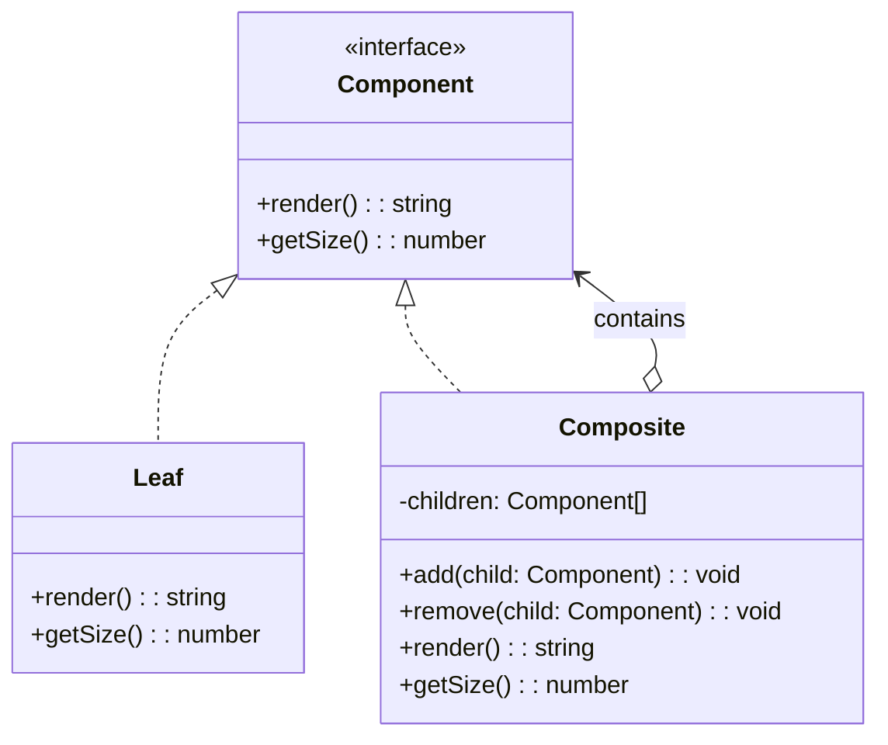

# 组合模式（Composite）

## 意图

将对象组合成树形结构以表示"部分-整体"层次，使客户端对单个对象和组合对象的使用具有一致性。

## 结构（UML 类图）



核心约束：Leaf 和 Composite 实现同一接口，客户端无需区分"叶子"还是"容器"。

## 适用场景

**该用：**
- 数据结构天然是树形（文件系统、DOM、组织架构）
- 客户端需要对叶子和容器执行相同操作（渲染、计算大小、序列化）
- 需要递归遍历并聚合结果（目录总大小、组件树渲染）

**不该用：**
- 结构不是树形或层次很浅（2 层）——简单数组即可
- 叶子和容器的操作差异极大，强行统一接口会导致大量无意义实现

> 🔍 **对应 Code Smell**：树形结构中叶子和容器代码大量重复、客户端需要区分节点类型

## 代价与权衡

| 维度 | 说明 |
|------|------|
| 复杂度 | 中。需要设计统一的 Component 接口 |
| 类型安全 | **TS 痛点**：Leaf 不应有 `add/remove`，但统一接口要求声明这些方法（或用类型守卫区分） |
| 遍历性能 | 深层嵌套递归可能有栈溢出风险，极端情况需改为迭代 |
| 替代方案 | 纯数据 + 递归函数（无 class，用 plain object 表示树）；Visitor 模式处理异构节点 |

> **TS 特化**：TS 中常用联合类型 `type Node = Leaf | Composite` + 类型守卫（`'children' in node`）替代经典继承体系，更符合 TS 的代数数据类型风格。

## TypeScript 实现

### 经典 OOP 实现（文件系统）

```typescript
interface FileSystemNode {
  name: string;
  size(): number;
  print(indent?: number): void;
}

class File implements FileSystemNode {
  constructor(
    public readonly name: string,
    private readonly fileSize: number,
  ) {}

  size(): number {
    return this.fileSize;
  }

  print(indent = 0): void {
    console.log(`${' '.repeat(indent)}📄 ${this.name} (${this.fileSize}B)`);
  }
}

class Directory implements FileSystemNode {
  public readonly name: string;
  private children: FileSystemNode[] = [];

  constructor(name: string) {
    this.name = name;
  }

  add(node: FileSystemNode): void {
    this.children.push(node);
  }

  remove(node: FileSystemNode): void {
    this.children = this.children.filter((c) => c !== node);
  }

  size(): number {
    return this.children.reduce((sum, child) => sum + child.size(), 0);
  }

  print(indent = 0): void {
    console.log(`${' '.repeat(indent)}📁 ${this.name}/`);
    for (const child of this.children) {
      child.print(indent + 2);
    }
  }
}

// 构建文件树
const root = new Directory('project');
const src = new Directory('src');
src.add(new File('index.ts', 2048));
src.add(new File('app.ts', 4096));
root.add(src);
root.add(new File('package.json', 512));

// 客户端统一调用，无需区分文件/目录
console.log(`Total size: ${root.size()}B`); // 6656B
root.print();
```

### 函数式实现（TS 联合类型 + 递归）

```typescript
// 用纯数据表示树，无 class
type UiNode =
  | { type: 'text'; content: string }
  | { type: 'container'; children: UiNode[] };

function renderNode(node: UiNode): string {
  switch (node.type) {
    case 'text':
      return `<span>${node.content}</span>`;
    case 'container':
      return `<div>${node.children.map(renderNode).join('')}</div>`;
  }
}

function countNodes(node: UiNode): number {
  if (node.type === 'text') return 1;
  return 1 + node.children.reduce((sum, child) => sum + countNodes(child), 0);
}

const tree: UiNode = {
  type: 'container',
  children: [
    { type: 'text', content: 'Hello' },
    {
      type: 'container',
      children: [
        { type: 'text', content: 'World' },
        { type: 'text', content: '!' },
      ],
    },
  ],
};

console.log(renderNode(tree)); // <div><span>Hello</span><div><span>World</span><span>!</span></div></div>
console.log(countNodes(tree)); // 5
```

## 真实世界实例

| 框架/库 | 实现方式 |
|---------|---------|
| **DOM** | `Node` 是统一接口，`Element`（容器）和 `Text`（叶子）统一处理 |
| **React 组件树** | `ReactNode` 可以是单个元素或嵌套数组，递归渲染 |
| **Vue 3 VNode** | `VNode` 的 `children` 可以是字符串（叶子）或 VNode 数组（容器） |
| **Webpack ModuleGraph** | Module 可包含子 Module（chunk），统一参与构建流程 |
| **AST（Babel / TS Compiler）** | `Node` 接口统一表达叶子节点（Identifier）和容器节点（BlockStatement） |

## 易混淆对比

| 对比 | 区别 |
|------|------|
| Composite vs Decorator | Composite 关注树形结构的统一遍历；Decorator 关注给单个对象动态添加职责 |
| Composite vs Builder | Builder 用于**构建**复杂对象（含树形）；Composite 是树形结构本身的表示 |
| Composite vs Flyweight | Composite 的叶子通常各自独立；Flyweight 的叶子是共享的（大量重复对象） |

## 面试速答

> **问：Composite 模式在 TS 中如何实现类型安全？Leaf 不应该有 add 方法怎么办？**
>
> 答：经典 OOP 方式是在统一接口中声明 `add/remove`，Leaf 实现中抛异常——但这违反里氏替换原则。TS 中更推荐用联合类型 + 判别式：`type Node = { type: 'leaf'; value: string } | { type: 'container'; children: Node[] }`，配合 `'children' in node` 类型守卫，编译器自动收窄类型，Leaf 上根本不存在 `add` 方法，类型安全由编译器保证。

> **问：DOM 树是 Composite 模式吗？为什么？**
>
> 答：是的，DOM 是 Composite 的教科书案例。`Node` 是统一接口，`Element`（容器，可含子节点）和 `Text` / `Comment`（叶子）都实现 `Node`。客户端可以对任意 `Node` 调用 `appendChild`、`removeChild`、`textContent`，无需区分是元素还是文本。浏览器内部遍历渲染树时也是统一递归处理，不关心节点具体类型。

> **问：Composite 和 Builder 怎么配合使用？**
>
> 答：Composite 定义树形结构本身，Builder 负责一步步构建这棵树。典型例子：React 的 JSX 编译后通过 `createElement` 逐层构建 VNode 树（Builder 行为），最终产出的 VNode 树就是 Composite 结构。另一个例子是 Webpack 的 `Compilation` 对象，ModuleGraph 是 Composite 结构，而 `Compiler` 的 hook 链逐步构建它。

## 关联

- **常配合**：Builder（构建树）、Visitor（遍历树时执行不同操作）、Flyweight（共享叶子节点）
- **架构位置**：在 [software-engineering/](../../software-engineering/software-engineering-learning-outline.md) 第 7 章中，Composite 是 UI 组件系统和 AST 处理的核心数据结构模式
