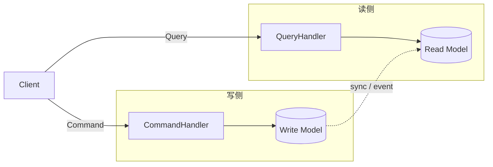

# 命令查询职责分离（CQRS - Command Query Responsibility Segregation）

## 意图

将系统的写操作（Command）和读操作（Query）分离为独立模型，使两侧可以独立优化、扩展和演化，避免单一模型同时承载读写导致的耦合。

## 结构（UML 类图）



核心约束：
- **Command**：表达意图（"做某事"），不返回值，触发状态变更
- **Query**：获取数据（"问某事"），只读，不产生副作用
- 读写模型可以是同一存储的不同视图，也可以是完全独立的存储

## 适用场景

**该用：**
- 读写比例严重不对称（读远多于写），需要独立扩展读侧
- 读写有不同的性能/一致性需求（写要强一致，读可最终一致）
- 复杂领域中，读写模型差异大（写入用聚合根，读取用扁平化 DTO）
- 需要为不同客户端提供不同读视图（Web / Mobile / 报表）

**不该用：**
- 简单 CRUD 应用，读写模型几乎相同——分离只增加样板代码
- 团队不熟悉该模式，引入后维护成本高于收益
- 需要强一致读写（写完立刻读到）且无法接受最终一致延迟

## 代价与权衡

| 维度 | 说明 |
|------|------|
| 复杂度 | 高。需要维护两套模型 + 同步机制，小项目过度设计 |
| 一致性 | 读写分离后通常只能保证最终一致，需要处理"写后读"延迟 |
| 可扩展性 | **好**。读侧可水平扩展（多副本），写侧独立优化 |
| 可维护性 | 读写职责清晰，改读不影响写，改写不影响读 |
| 替代方案 | 单一模型 + 读写方法分离（Service 层分 CommandService / QueryService）、ORM 读写分离（主从复制） |

> **TS 特化**：在前端状态管理中，Redux 的 `dispatch(action)` 是 Command，`selector(state)` 是 Query，本质是简化版 CQRS。

## TypeScript 实现

### 基础 Command/Query 分离

```typescript
// 环境：Node 18+（crypto.randomUUID() 为全局 API）
// ===== 命令侧 =====

interface Command {
  type: string;
}

interface CreateTaskCommand extends Command {
  type: 'CREATE_TASK';
  title: string;
  assignee: string;
}

interface CompleteTaskCommand extends Command {
  type: 'COMPLETE_TASK';
  taskId: string;
}

// 写模型：面向业务规则
interface TaskEntity {
  id: string;
  title: string;
  assignee: string;
  completed: boolean;
  createdAt: number;
  completedAt: number | null;
}

class CommandHandler {
  private tasks = new Map<string, TaskEntity>();

  handle(command: Command): void {
    switch (command.type) {
      case 'CREATE_TASK': {
        const cmd = command as CreateTaskCommand;
        const task: TaskEntity = {
          id: crypto.randomUUID(),
          title: cmd.title,
          assignee: cmd.assignee,
          completed: false,
          createdAt: Date.now(),
          completedAt: null,
        };
        this.tasks.set(task.id, task);
        break;
      }
      case 'COMPLETE_TASK': {
        const cmd = command as CompleteTaskCommand;
        const task = this.tasks.get(cmd.taskId);
        if (!task) throw new Error(`Task ${cmd.taskId} not found`);
        if (task.completed) throw new Error('Task already completed');
        task.completed = true;
        task.completedAt = Date.now();
        break;
      }
      default:
        throw new Error(`Unknown command: ${(command as Command).type}`);
    }
  }

  // 暴露内部存储供同步使用
  getTasks(): Map<string, TaskEntity> {
    return this.tasks;
  }
}

// ===== 查询侧 =====

interface Query<T> {
  type: string;
}

interface TaskSummaryQuery extends Query<TaskSummary[]> {
  type: 'GET_TASK_SUMMARIES';
}

interface TaskDetailQuery extends Query<TaskDetail | null> {
  type: 'GET_TASK_DETAIL';
  taskId: string;
}

// 读模型：面向展示，扁平化
interface TaskSummary {
  id: string;
  title: string;
  status: 'pending' | 'completed';
}

interface TaskDetail {
  id: string;
  title: string;
  assignee: string;
  status: 'pending' | 'completed';
  createdAt: string;
  completedAt: string | null;
}

class QueryHandler {
  // 读模型：独立于写模型的投影
  private summaries: TaskSummary[] = [];
  private details = new Map<string, TaskDetail>();

  // 从写模型同步（实际项目中通过事件异步同步）
  sync(tasks: Map<string, TaskEntity>): void {
    this.summaries = [];
    this.details.clear();

    for (const task of tasks.values()) {
      this.summaries.push({
        id: task.id,
        title: task.title,
        status: task.completed ? 'completed' : 'pending',
      });
      this.details.set(task.id, {
        id: task.id,
        title: task.title,
        assignee: task.assignee,
        status: task.completed ? 'completed' : 'pending',
        createdAt: new Date(task.createdAt).toISOString(),
        completedAt: task.completedAt ? new Date(task.completedAt).toISOString() : null,
      });
    }
  }

  handle<T>(query: Query<T>): T {
    switch (query.type) {
      case 'GET_TASK_SUMMARIES':
        return this.summaries as unknown as T;
      case 'GET_TASK_DETAIL': {
        const q = query as unknown as TaskDetailQuery;
        return (this.details.get(q.taskId) ?? null) as unknown as T;
      }
      default:
        throw new Error(`Unknown query: ${(query as Query<unknown>).type}`);
    }
  }
}

// ===== 使用 =====

const commandHandler = new CommandHandler();
const queryHandler = new QueryHandler();

// 发送命令
commandHandler.handle({ type: 'CREATE_TASK', title: 'Write docs', assignee: 'Alice' } as CreateTaskCommand);
commandHandler.handle({ type: 'CREATE_TASK', title: 'Review PR', assignee: 'Bob' } as CreateTaskCommand);

// 同步读模型
queryHandler.sync(commandHandler.getTasks());

// 查询（只读，无副作用）
const summaries = queryHandler.handle<TaskSummary[]>({ type: 'GET_TASK_SUMMARIES' } as TaskSummaryQuery);
console.log(summaries.length); // 2
console.log(summaries[0].status); // "pending"
```

### Redux 风格的简化 CQRS

```typescript
// Redux 本质是简化 CQRS：
// - dispatch(action) = Command（写）
// - selector(state) = Query（读）

interface State {
  tasks: TaskEntity[];
}

type Action =
  | { type: 'CREATE_TASK'; title: string; assignee: string }
  | { type: 'COMPLETE_TASK'; taskId: string };

// Command handler = reducer（处理写）
function taskReducer(state: State, action: Action): State {
  switch (action.type) {
    case 'CREATE_TASK':
      return {
        tasks: [
          ...state.tasks,
          {
            id: crypto.randomUUID(),
            title: action.title,
            assignee: action.assignee,
            completed: false,
            createdAt: Date.now(),
            completedAt: null,
          },
        ],
      };
    case 'COMPLETE_TASK':
      return {
        tasks: state.tasks.map((t) =>
          t.id === action.taskId
            ? { ...t, completed: true, completedAt: Date.now() }
            : t
        ),
      };
    default:
      return state;
  }
}

// Query = selector（处理读）
const selectPendingTasks = (state: State): TaskSummary[] =>
  state.tasks
    .filter((t) => !t.completed)
    .map((t) => ({ id: t.id, title: t.title, status: 'pending' as const }));

const selectCompletedCount = (state: State): number =>
  state.tasks.filter((t) => t.completed).length;

// 模拟 store
let currentState: State = { tasks: [] };
function dispatch(action: Action): void {
  currentState = taskReducer(currentState, action);
}

dispatch({ type: 'CREATE_TASK', title: 'Learn CQRS', assignee: 'Dev' });
dispatch({ type: 'CREATE_TASK', title: 'Ship feature', assignee: 'Dev' });

console.log(selectPendingTasks(currentState).length); // 2
console.log(selectCompletedCount(currentState)); // 0
```

## 真实世界实例

| 框架/库 | 实现方式 |
|---------|---------|
| **Redux / Zustand** | `dispatch(action)` 是 Command，`useSelector(fn)` 是 Query，读写天然分离 |
| **NestJS CQRS**（`@nestjs/cqrs`） | 提供 `CommandBus` / `QueryBus`，分别注册 `ICommandHandler` / `IQueryHandler` |
| **MediatR**（.NET，TS 有 mediatr-ts） | 统一 Mediator 分发 Command 和 Query 到对应 Handler |
| **Axon Framework**（Java） | 完整 CQRS + Event Sourcing 框架，Command/Query 走不同总线 |
| **Elasticsearch + PostgreSQL** | 写入走 PostgreSQL（强一致），异步同步到 ES（读优化），架构级 CQRS |

## 易混淆对比

| 对比 | 区别 |
|------|------|
| CQRS vs CRUD 分离 | CRUD 分离只是 Service 层方法命名区分；CQRS 是**模型级**分离，读写有独立的数据结构和存储 |
| CQRS vs Event Sourcing | CQRS 分离读写模型；Event Sourcing 用事件序列存储状态。两者常配合但独立——CQRS 不要求 ES，ES 不要求 CQRS |
| CQRS vs 读写分离（主从复制） | 数据库主从是**基础设施层**的读写分离；CQRS 是**应用层**的模型分离，读模型可以是完全不同的结构 |

## 面试速答

> **问：CQRS 和普通的读写分离（主从复制）有什么区别？**
>
> 答：主从复制是基础设施层的读写分离，读写用的是同一套数据模型和 schema，只是物理上把流量分流到主库/从库；CQRS 是应用层的模型分离，读模型和写模型可以是完全不同的数据结构甚至不同存储（如写 PostgreSQL、读 Elasticsearch）。CQRS 让读侧能针对查询场景做扁平化、预计算优化，这是主从复制做不到的。

> **问：CQRS 一定要配合 Event Sourcing 吗？**
>
> 答：不需要，两者是正交的模式：CQRS 解决读写模型分离，Event Sourcing 解决状态如何持久化。CQRS 的读模型完全可以由写库通过 CDC 或定时任务同步，不必用事件流；Event Sourcing 也可以不分离读写。只是因为 ES 天然产生事件流、很适合驱动 CQRS 的读模型投影，所以实践中常一起出现。

> **问：Redux 算 CQRS 吗？为什么？**
>
> 答：可以看作简化版 CQRS。Redux 的 `dispatch(action)` 是 Command（只表达写意图、不返回值），`selector(state)` 是 Query（只读、无副作用），读写路径天然分离。但它没有独立的读模型存储和异步同步机制，读写共享同一份 state，所以是"职责分离"而非完整的"模型/存储分离"。

## 关联

- **常配合**：Event Sourcing（写侧产生事件，读侧订阅事件构建投影）、Command 模式（Command 对象封装写操作）、Mediator（总线分发 Command/Query）
- **架构位置**：在 [software-engineering/](../../software-engineering/software-engineering-learning-outline.md) 第 14 章中，CQRS 的部署拓扑（读写独立扩展、最终一致性同步）属于分布式系统架构决策
