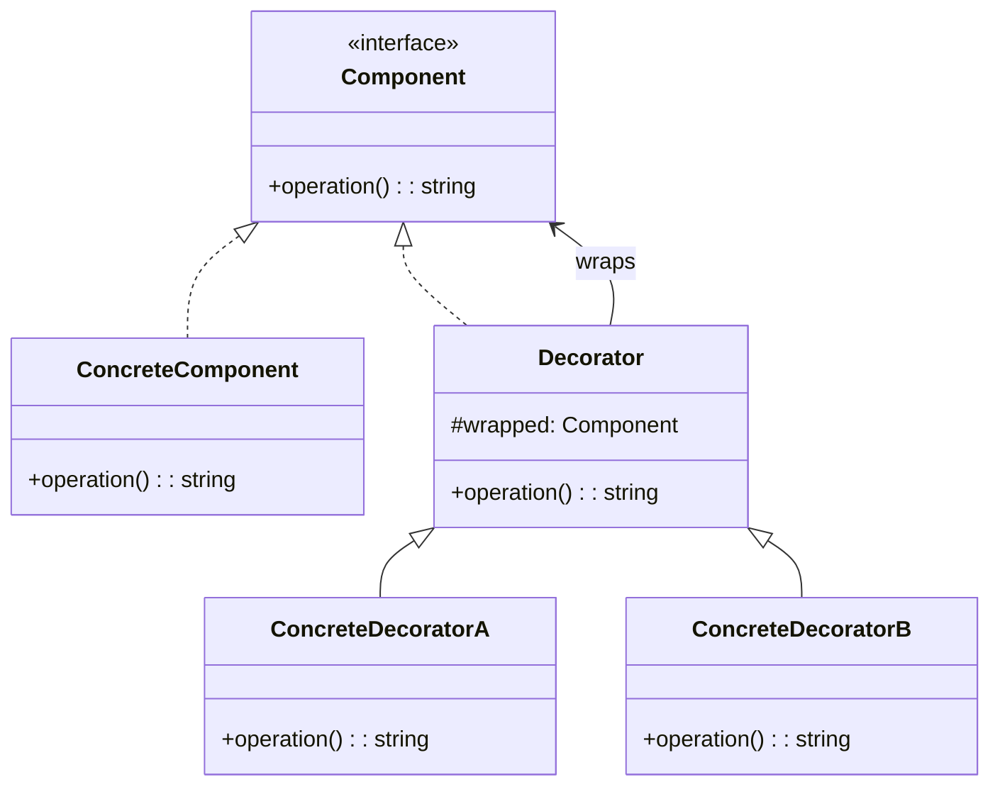

# 装饰器模式（Decorator）

## 意图

动态地给对象添加额外职责，提供比继承更灵活的扩展方式。核心解决：通过子类爆炸式扩展行为的问题。

## 结构（UML 类图）



核心特征：Decorator 与 Component 实现同一接口，内部持有 Component 引用，可在调用前后插入额外逻辑。

## 适用场景

**该用：**
- 需要动态、可组合地给对象添加行为（日志、缓存、重试、压缩）
- 行为扩展的组合数远大于继承能表达的范围
- 中间件/管道架构（Express、Koa、Axios interceptors）

**不该用：**
- 只需一种固定扩展——直接继承或包装函数更简单
- 需要访问被装饰对象的内部状态——Decorator 只应通过公共接口交互

## 代价与权衡

| 维度 | 说明 |
|------|------|
| 复杂度 | 中。多层嵌套时调试栈较深 |
| 灵活性 | **极高**。行为可在运行时任意组合、排序 |
| 可调试性 | 多层包装后 stack trace 变长，需良好的命名 |
| 替代方案 | 继承（静态、不灵活）；AOP / 中间件（本质是 Decorator 的架构级应用）；Mixin |

> **TS/JS 特化**：TS 有原生 `@decorator` 语法（Stage 3 / TS 5.0+），但它是**类/方法级别的元编程**，与 GoF Decorator 模式（对象包装）是不同层面的概念。JS 生态中 Decorator 模式更常见的体现是**高阶函数 / 中间件**。

## TypeScript 实现

### 经典 OOP 装饰器

```typescript
interface DataSource {
  read(): string;
  write(data: string): void;
}

class FileDataSource implements DataSource {
  private content = '';

  constructor(private readonly filename: string) {}

  read(): string {
    console.log(`Reading from ${this.filename}`);
    return this.content;
  }

  write(data: string): void {
    console.log(`Writing to ${this.filename}`);
    this.content = data;
  }
}

// Decorator 基类
abstract class DataSourceDecorator implements DataSource {
  constructor(protected readonly wrapped: DataSource) {}

  read(): string {
    return this.wrapped.read();
  }

  write(data: string): void {
    this.wrapped.write(data);
  }
}

class Base64EncodingDecorator extends DataSourceDecorator {
  read(): string {
    const data = super.read();
    return Buffer.from(data, 'base64').toString('utf-8');
  }

  write(data: string): void {
    super.write(Buffer.from(data).toString('base64'));
  }
}

class CompressionDecorator extends DataSourceDecorator {
  read(): string {
    console.log('[Decompressing]');
    return super.read();
  }

  write(data: string): void {
    console.log('[Compressing]');
    super.write(data);
  }
}

// 组合使用：写入时先压缩再编码，读取时先解码再解压
const source: DataSource = new CompressionDecorator(
  new Base64EncodingDecorator(new FileDataSource('secret.dat')),
);

source.write('Hello, World!');
console.log(source.read());
```

### 函数式装饰器（高阶函数 / 中间件风格）

```typescript
type Handler = (req: { path: string; body?: unknown }) => { status: number; data: unknown };

// 装饰器就是高阶函数：Handler -> Handler
function withLogging(handler: Handler): Handler {
  return (req) => {
    console.log(`[LOG] ${req.path}`);
    const res = handler(req);
    console.log(`[LOG] Response: ${res.status}`);
    return res;
  };
}

function withAuth(handler: Handler): Handler {
  return (req) => {
    if (!req.path.startsWith('/public')) {
      console.log('[AUTH] Checking token...');
    }
    return handler(req);
  };
}

function withRetry(handler: Handler, times = 3): Handler {
  return (req) => {
    for (let i = 0; i < times; i++) {
      try {
        return handler(req);
      } catch {
        if (i === times - 1) throw new Error('Max retries exceeded');
      }
    }
    return { status: 500, data: null };
  };
}

// 基础处理器
const baseHandler: Handler = (req) => ({ status: 200, data: `Handled ${req.path}` });

// 组合装饰
const enhancedHandler = withLogging(withAuth(withRetry(baseHandler)));
enhancedHandler({ path: '/api/users' });
```

### TS 5.0 原生 Decorator 语法（元编程层面）

```typescript
// TS 5.0+ Stage 3 Decorators — 注意：这是语言级元编程，不等同于 GoF Decorator
function logged<T extends (...args: unknown[]) => unknown>(
  originalMethod: T,
  context: ClassMethodDecoratorContext,
): T {
  const methodName = String(context.name);
  return function (this: unknown, ...args: Parameters<T>): ReturnType<T> {
    console.log(`[CALL] ${methodName}(${JSON.stringify(args)})`);
    const result = originalMethod.call(this, ...args) as ReturnType<T>;
    console.log(`[RETURN] ${methodName} -> ${JSON.stringify(result)}`);
    return result;
  } as T;
}

class Calculator {
  @logged
  add(a: number, b: number): number {
    return a + b;
  }
}

const calc = new Calculator();
calc.add(1, 2); // [CALL] add([1,2]) → [RETURN] add -> 3
```

## 真实世界实例

| 框架/库 | 实现方式 |
|---------|---------|
| **Express / Koa 中间件** | `app.use(middleware)` 逐层包装请求处理函数，洋葱模型 |
| **Axios interceptors** | `axios.interceptors.request.use(fn)` 在请求前后插入逻辑 |
| **NestJS `@UseGuards` / `@UseInterceptors`** | 通过 TS decorator 语法给 Controller 方法添加横切关注点 |
| **Java I/O（经典）** | `new BufferedInputStream(new FileInputStream(...))` 层层包装 |
| **Webpack plugin `tap`** | 在编译管道各阶段插入处理逻辑，本质是 Decorator 链 |

## 易混淆对比

| 对比 | 区别 |
|------|------|
| Decorator vs Proxy | Decorator **增强**对象行为，客户端知道装饰存在；Proxy **控制访问**，对客户端透明 |
| Decorator vs Adapter | Decorator 保持接口不变，添加职责；Adapter 改变接口，适配不兼容 |
| Decorator vs 继承 | 继承是编译期静态扩展，组合固定；Decorator 是运行时动态组合，可叠加 |

## 关联

- **常配合**：Composite（Decorator 可装饰 Composite 中的节点）、Strategy（Decorator 改变外壳，Strategy 改变内核）
- **架构位置**：在 [software-engineering/](../../software-engineering/software-engineering-learning-outline.md) 第 8 章中，中间件管道（Express / Koa）是 Decorator 在 Web 框架中的架构级应用
