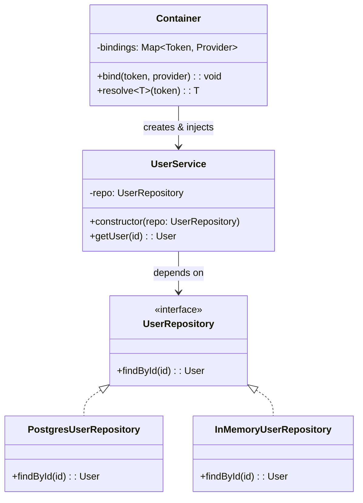

# 依赖注入（Dependency Injection）

## 意图

将对象的依赖从内部创建改为外部传入，实现控制反转（IoC），使类不依赖具体实现而依赖抽象，从而解耦组件、提升可测试性。

## 结构（UML 类图）



核心思想：
- **高层模块不依赖低层模块**，两者都依赖抽象
- 依赖的创建和绑定由外部（容器/组装代码）负责
- 三种注入方式：构造函数注入（推荐）、属性注入、方法注入

## 适用场景

**该用：**
- 类依赖具体实现（如直接 `new Database()`），导致无法替换或 mock
- 单元测试需要注入 stub/mock 对象
- 同一接口有多种实现，需要运行时切换（如开发/生产环境）
- 中大型应用的组件组装，需要统一管理生命周期

**不该用：**
- 简单脚本或工具，依赖关系固定且无需替换
- 依赖是纯工具函数（如 `Math.max`），无需抽象
- 过度 DI 导致所有类都通过容器获取，增加理解成本

## 代价与权衡

| 维度 | 说明 |
|------|------|
| 复杂度 | 中。引入接口 + 容器/组装层，小项目可能过度设计 |
| 可测试性 | **显著提升**。测试时注入 mock，无需真实数据库/网络 |
| 可读性 | 构造函数参数即依赖清单，比内部 `new` 更透明 |
| 调试 | 容器报错（循环依赖、未注册）可能不直观 |
| 替代方案 | 手动组装（Composition Root）、Service Locator、ES Module 直接导入 |

> **TS 特化**：TypeScript 的 `interface` 在运行时被擦除，因此 DI 容器通常用 `Symbol`、字符串 token 或 `reflect-metadata` 的 `@injectable()` 装饰器来标识依赖。

## TypeScript 实现

### 手动 DI（构造函数注入）

```typescript
// 抽象层：领域层只依赖接口
interface UserRepository {
  findById(id: string): { id: string; name: string } | undefined;
  save(user: { id: string; name: string }): void;
}

// 具体实现 A：生产环境
class PostgresUserRepository implements UserRepository {
  private db = new Map<string, { id: string; name: string }>();

  findById(id: string) {
    return this.db.get(id);
  }

  save(user: { id: string; name: string }) {
    this.db.set(user.id, user);
  }
}

// 具体实现 B：测试用
class InMemoryUserRepository implements UserRepository {
  private store = new Map<string, { id: string; name: string }>();

  findById(id: string) {
    return this.store.get(id);
  }

  save(user: { id: string; name: string }) {
    this.store.set(user.id, user);
  }
}

// 业务层：依赖通过构造函数注入，不知道具体实现
class UserService {
  constructor(private readonly repo: UserRepository) {}

  register(id: string, name: string): void {
    if (this.repo.findById(id)) {
      throw new Error(`User ${id} already exists`);
    }
    this.repo.save({ id, name });
  }

  getUserName(id: string): string {
    const user = this.repo.findById(id);
    if (!user) throw new Error(`User ${id} not found`);
    return user.name;
  }
}

// 组装（Composition Root）：决定注入哪个实现
const prodService = new UserService(new PostgresUserRepository());
const testService = new UserService(new InMemoryUserRepository());

testService.register('1', 'Alice');
console.log(testService.getUserName('1')); // "Alice"
```

### 简易 DI 容器

```typescript
type Token = string | symbol;
type Factory<T> = (container: Container) => T;

class Container {
  private factories = new Map<Token, Factory<unknown>>();
  private singletons = new Map<Token, unknown>();
  private singletonTokens = new Set<Token>();

  bind<T>(token: Token, factory: Factory<T>, singleton = true): void {
    this.factories.set(token, factory);
    if (singleton) this.singletonTokens.add(token);
  }

  resolve<T>(token: Token): T {
    if (this.singletonTokens.has(token) && this.singletons.has(token)) {
      return this.singletons.get(token) as T;
    }

    const factory = this.factories.get(token);
    if (!factory) throw new Error(`No binding for ${String(token)}`);

    const instance = factory(this) as T;

    if (this.singletonTokens.has(token)) {
      this.singletons.set(token, instance);
    }
    return instance;
  }
}

// 使用容器
const TOKENS = {
  UserRepo: Symbol('UserRepository'),
  UserService: Symbol('UserService'),
};

const container = new Container();

container.bind<UserRepository>(TOKENS.UserRepo, () => new InMemoryUserRepository());
container.bind<UserService>(TOKENS.UserService, (c) => new UserService(c.resolve(TOKENS.UserRepo)));

const service = container.resolve<UserService>(TOKENS.UserService);
service.register('42', 'Bob');
console.log(service.getUserName('42')); // "Bob"
```

### NestJS 风格装饰器 DI（概念演示）

> ⚠️ 本示例需要 `tsconfig.json` 中开启 `"experimentalDecorators": true` 和 `"emitDecoratorMetadata": true`，并安装 `reflect-metadata`。

```typescript
// 使用 reflect-metadata 模拟 NestJS 的 @Injectable / @Inject
import 'reflect-metadata';

const INJECTABLE_KEY = Symbol('injectable');
const INJECT_KEY = Symbol('inject');

function Injectable(): ClassDecorator {
  return (target) => {
    Reflect.defineMetadata(INJECTABLE_KEY, true, target);
  };
}

function Inject(token: Token): ParameterDecorator {
  return (target, _key, index) => {
    const existing = Reflect.getMetadata(INJECT_KEY, target) ?? {};
    existing[index] = token;
    Reflect.defineMetadata(INJECT_KEY, existing, target);
  };
}

@Injectable()
class EmailService {
  send(to: string, body: string): void {
    console.log(`Email to ${to}: ${body}`);
  }
}

@Injectable()
class NotificationService {
  constructor(@Inject('EmailService') private email: EmailService) {}

  notify(userId: string): void {
    this.email.send(userId, 'Welcome!');
  }
}

// 容器根据元数据自动解析依赖
class NestLikeContainer {
  private instances = new Map<Token, unknown>();

  register(token: Token, cls: new (...args: unknown[]) => unknown): void {
    this.instances.set(token, null); // placeholder
    const injectMeta: Record<number, Token> =
      Reflect.getMetadata(INJECT_KEY, cls) ?? {};
    const paramCount = cls.length;
    const deps: unknown[] = [];
    for (let i = 0; i < paramCount; i++) {
      const depToken = injectMeta[i];
      if (depToken) deps.push(this.resolve(depToken));
    }
    this.instances.set(token, new cls(...deps));
  }

  resolve<T>(token: Token): T {
    const inst = this.instances.get(token);
    if (!inst) throw new Error(`Not registered: ${String(token)}`);
    return inst as T;
  }
}

const nestContainer = new NestLikeContainer();
nestContainer.register('EmailService', EmailService);
nestContainer.register('NotificationService', NotificationService);

const notifier = nestContainer.resolve<NotificationService>('NotificationService');
notifier.notify('alice@example.com'); // "Email to alice@example.com: Welcome!"
```

## 真实世界实例

| 框架/库 | 实现方式 |
|---------|---------|
| **NestJS** | `@Injectable()` + `@Module({ providers })` 声明式 DI，底层用 `reflect-metadata` 解析构造函数参数 |
| **tsyringe**（Microsoft） | 轻量 DI 容器，`@injectable()` + `container.resolve()`，支持 token 和生命周期 scope |
| **InversifyJS** | 基于 IoC 容器，`@injectable()` + `@inject(TYPES.X)` 绑定，支持中间件和上下文绑定 |
| **Angular** | `@Injectable({ providedIn: 'root' })` 树形 DI，支持多实例（ElementInjector）和层级解析 |
| **Jest 手动 mock** | `jest.mock()` 本质是测试时的依赖替换，与 DI 目标一致 |

## 易混淆对比

| 对比 | 区别 |
|------|------|
| DI vs Service Locator | DI 由外部**推送**依赖（被动接收）；Service Locator 由对象主动**拉取**依赖（`locator.get()`），隐藏了依赖关系 |
| DI vs IoC | IoC 是原则（控制反转：框架调用你的代码）；DI 是 IoC 的一种实现手段（通过注入实现反转） |
| DI vs 工厂模式 | 工厂封装"如何创建"；DI 封装"谁提供"。DI 容器中常使用工厂函数来创建实例 |

## 关联

- **常配合**：Repository（通过 DI 注入数据访问层）、Strategy（通过 DI 切换算法实现）、Singleton（容器管理单例生命周期）
- **架构位置**：在 [software-engineering/](../../software-engineering/software-engineering-learning-outline.md) 第 9 章中，DI 是六边形架构/洋葱架构实现依赖倒置的核心手段，使领域层不依赖基础设施层
