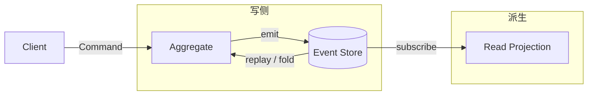

# 事件溯源（Event Sourcing）

## 意图

将实体的状态变更以不可变事件序列的形式持久化，通过重放（fold/reduce）事件来重建当前状态，而非直接存储最终状态。核心解决：状态变更历史丢失、审计困难、时间旅行调试。

## 结构（UML 类图）



核心约束：
- **事件不可变**：已发生的事实，只能追加（append-only），不能修改或删除
- **状态是派生的**：当前状态 = `events.reduce(applyEvent, initialState)`
- **聚合根**负责业务规则校验，决定是否产生事件

## 适用场景

**该用：**
- 需要完整审计日志（金融交易、医疗记录、合规系统）
- 需要"时间旅行"——回溯任意历史时刻的状态
- 业务规则频繁变化，但历史事件需要按当时规则保留
- 多读模型需要从同一事件流派生不同视图（配合 CQRS）

**不该用：**
- 简单 CRUD，状态无复杂历史（如用户配置项）
- 事件模型不稳定，schema 频繁迁移成本高
- 团队不熟悉事件建模，学习曲线陡峭
- 对查询延迟极敏感且无法接受重放开销（需快照优化）

> 🔍 **对应 Code Smell**：状态变更历史丢失、审计困难、需要时间旅行调试

## 代价与权衡

| 维度 | 说明 |
|------|------|
| 复杂度 | 高。需要事件 schema 管理、版本迁移、快照策略 |
| 审计能力 | **天然完整**。所有变更都有记录，无需额外审计表 |
| 存储 | 事件持续增长，需要归档/压缩策略 |
| 查询 | 直接查事件效率低，通常需要投影（Projection）构建读模型 |
| 替代方案 | 传统 CRUD + 审计触发器、Git 式快照链、Temporal Table（PostgreSQL） |

> **TS 特化**：Redux 的 `store.getState()` 本质是 `actions.reduce(reducer, initialState)` 的结果——这是前端最简化的 Event Sourcing 实践。

## TypeScript 实现

### 银行账户：事件存储 + 状态重建

```typescript
// ===== 事件定义 =====

type DomainEvent =
  | { type: 'ACCOUNT_OPENED'; ownerId: string; timestamp: number }
  | { type: 'MONEY_DEPOSITED'; amount: number; timestamp: number }
  | { type: 'MONEY_WITHDRAWN'; amount: number; timestamp: number };

// ===== 聚合根状态 =====

interface AccountState {
  ownerId: string | null;
  balance: number;
  opened: boolean;
}

const initialAccountState: AccountState = {
  ownerId: null,
  balance: 0,
  opened: false,
};

// ===== 事件应用函数（fold 的一步） =====

function applyAccountEvent(state: AccountState, event: DomainEvent): AccountState {
  switch (event.type) {
    case 'ACCOUNT_OPENED':
      return { ...state, ownerId: event.ownerId, opened: true };
    case 'MONEY_DEPOSITED':
      return { ...state, balance: state.balance + event.amount };
    case 'MONEY_WITHDRAWN':
      return { ...state, balance: state.balance - event.amount };
    default:
      return state;
  }
}

// ===== 状态重建（fold / reduce） =====

function rebuildState(events: DomainEvent[]): AccountState {
  return events.reduce(applyAccountEvent, initialAccountState);
}

// ===== 事件存储 =====

class EventStore {
  private streams = new Map<string, DomainEvent[]>();

  append(streamId: string, events: DomainEvent[]): void {
    const stream = this.streams.get(streamId) ?? [];
    stream.push(...events);
    this.streams.set(streamId, stream);
  }

  getEvents(streamId: string): DomainEvent[] {
    return [...(this.streams.get(streamId) ?? [])];
  }

  getAllStreams(): string[] {
    return [...this.streams.keys()];
  }
}

// ===== 聚合根：业务规则 + 事件产生 =====

class BankAccount {
  private state: AccountState;
  private pendingEvents: DomainEvent[] = [];

  constructor(private readonly id: string, events: DomainEvent[]) {
    this.state = rebuildState(events);
  }

  // 业务规则：开户
  open(ownerId: string): void {
    if (this.state.opened) throw new Error('Account already opened');
    const event: DomainEvent = { type: 'ACCOUNT_OPENED', ownerId, timestamp: Date.now() };
    this.pendingEvents.push(event);
    this.state = applyAccountEvent(this.state, event); // 立即应用，保证后续校验基于最新状态
  }

  // 业务规则：存款
  deposit(amount: number): void {
    if (!this.state.opened) throw new Error('Account not opened');
    if (amount <= 0) throw new Error('Deposit amount must be positive');
    const event: DomainEvent = { type: 'MONEY_DEPOSITED', amount, timestamp: Date.now() };
    this.pendingEvents.push(event);
    this.state = applyAccountEvent(this.state, event);
  }

  // 业务规则：取款（余额校验基于含 pending 事件的最新状态）
  withdraw(amount: number): void {
    if (!this.state.opened) throw new Error('Account not opened');
    if (amount <= 0) throw new Error('Withdrawal amount must be positive');
    if (amount > this.state.balance) throw new Error('Insufficient funds');
    const event: DomainEvent = { type: 'MONEY_WITHDRAWN', amount, timestamp: Date.now() };
    this.pendingEvents.push(event);
    this.state = applyAccountEvent(this.state, event);
  }

  // 提交未决事件到 EventStore（状态已在 push 时即时更新）
  commit(store: EventStore): void {
    if (this.pendingEvents.length === 0) return;
    store.append(this.id, this.pendingEvents);
    this.pendingEvents = [];
  }

  getBalance(): number {
    return this.state.balance;
  }

  getOwnerId(): string | null {
    return this.state.ownerId;
  }
}

// ===== 使用 =====

const store = new EventStore();
const accountId = 'acc-001';

// 从事件流加载聚合（首次为空）
let account = new BankAccount(accountId, store.getEvents(accountId));
account.open('user-alice');
account.deposit(1000);
account.withdraw(200);
account.commit(store);

console.log(account.getBalance()); // 800

// 重新加载：从事件重建状态（模拟服务重启）
const reloaded = new BankAccount(accountId, store.getEvents(accountId));
console.log(reloaded.getBalance()); // 800
console.log(reloaded.getOwnerId()); // "user-alice"

// 审计：查看完整历史
const history = store.getEvents(accountId);
console.log(history.map((e) => e.type));
// ["ACCOUNT_OPENED", "MONEY_DEPOSITED", "MONEY_WITHDRAWN"]
```

### 快照优化（避免全量重放）

```typescript
interface Snapshot {
  state: AccountState;
  version: number; // 快照时的事件数量
}

class SnapshotEventStore {
  private events = new Map<string, DomainEvent[]>();
  private snapshots = new Map<string, Snapshot>();
  private readonly snapshotInterval = 100;

  append(streamId: string, newEvents: DomainEvent[]): void {
    const stream = this.events.get(streamId) ?? [];
    stream.push(...newEvents);
    this.events.set(streamId, stream);

    // 每 N 个事件创建快照
    if (stream.length % this.snapshotInterval === 0) {
      const state = stream.reduce(applyAccountEvent, initialAccountState);
      this.snapshots.set(streamId, { state, version: stream.length });
    }
  }

  load(streamId: string): { state: AccountState; events: DomainEvent[] } {
    const snapshot = this.snapshots.get(streamId);
    const allEvents = this.events.get(streamId) ?? [];

    if (snapshot) {
      // 只重放快照之后的事件
      const eventsAfterSnapshot = allEvents.slice(snapshot.version);
      const state = eventsAfterSnapshot.reduce(applyAccountEvent, snapshot.state);
      return { state, events: eventsAfterSnapshot };
    }

    return {
      state: allEvents.reduce(applyAccountEvent, initialAccountState),
      events: allEvents,
    };
  }
}
```

### Redux 作为简化 Event Sourcing

```typescript
// Redux 的核心思想与 Event Sourcing 一致：
// - actions = 事件序列（不可变的变更记录）
// - reducer = 事件应用函数
// - state = events.reduce(reducer, initialState)

interface TodoState {
  todos: { id: number; text: string; done: boolean }[];
  nextId: number;
}

type TodoAction =
  | { type: 'ADD_TODO'; text: string }
  | { type: 'TOGGLE_TODO'; id: number };

const initialTodoState: TodoState = { todos: [], nextId: 1 };

function todoReducer(state: TodoState, action: TodoAction): TodoState {
  switch (action.type) {
    case 'ADD_TODO':
      return {
        todos: [...state.todos, { id: state.nextId, text: action.text, done: false }],
        nextId: state.nextId + 1,
      };
    case 'TOGGLE_TODO':
      return {
        ...state,
        todos: state.todos.map((t) =>
          t.id === action.id ? { ...t, done: !t.done } : t
        ),
      };
    default:
      return state;
  }
}

// "事件流"重放
const actions: TodoAction[] = [
  { type: 'ADD_TODO', text: 'Learn ES' },
  { type: 'ADD_TODO', text: 'Build app' },
  { type: 'TOGGLE_TODO', id: 1 },
];

const finalState = actions.reduce(todoReducer, initialTodoState);
console.log(finalState.todos);
// [{ id: 1, text: 'Learn ES', done: true }, { id: 2, text: 'Build app', done: false }]

// 时间旅行：重放到第 2 个事件
const stateAtStep2 = actions.slice(0, 2).reduce(todoReducer, initialTodoState);
console.log(stateAtStep2.todos.every((t) => !t.done)); // true
```

## 真实世界实例

| 框架/库 | 实现方式 |
|---------|---------|
| **Redux** | `actions` 是事件流，`reducer` 是 fold 函数，`state` 是派生结果；DevTools 的时间旅行即事件重放 |
| **Git** | 每次 commit 是不可变事件，工作区状态 = commit 链的 fold 结果 |
| **EventStoreDB** | 专用事件数据库，支持流（stream）、订阅、投影，原生 append-only |
| **Axon Framework**（Java） | 聚合根自动管理事件溯源生命周期，配合 CQRS 构建读模型 |
| **Kafka + 投影** | 事件写入 Kafka topic（append-only log），消费者构建各读模型（ES 索引、物化视图） |

## 易混淆对比

| 对比 | 区别 |
|------|------|
| Event Sourcing vs 审计日志 | 审计日志是**附加记录**，主存储仍是当前状态；ES 中事件是**唯一真相源**，状态完全由事件派生 |
| Event Sourcing vs CQRS | ES 关注"如何存储变更"（事件序列）；CQRS 关注"如何分离读写模型"。两者正交，常配合但非必须 |
| Event Sourcing vs 事件驱动架构（EDA） | EDA 是系统间通过事件通信（集成模式）；ES 是单个聚合内的持久化策略。ES 的事件可以触发 EDA，但 ES 本身不要求分布式 |

## 面试速答

> **问：Event Sourcing 和审计日志有什么区别？**
>
> 答：审计日志是主存储之外的附加记录，系统真相源仍是当前状态表，日志只用于事后追溯；Event Sourcing 中事件流本身就是唯一真相源，当前状态完全由事件重放派生。所以审计日志丢了不影响业务运行，而 ES 的事件流丢了状态就无法重建。ES 是一种持久化策略，审计日志只是合规手段。

> **问：Event Sourcing 的事件 schema 演进怎么处理？**
>
> 答：核心原则是事件不可变，因此不能修改历史事件，只能向前兼容。常见做法是给事件加 `version` 字段，重放时用 upcaster 把旧版本事件转换成新版本；或采用弱 schema，新增字段设默认值、读取时容错。关键是保证旧事件用新代码仍能正确重放，必要时配合快照减少全量迁移成本。

> **问：Redux 的 actions 是 Event Sourcing 吗？**
>
> 答：思想上高度一致，但通常不算完整 ES。Redux 的 actions 是不可变变更记录，reducer 是 fold 函数，state = actions.reduce(...)，DevTools 时间旅行就是事件重放。但标准 Redux 不持久化 action 流、重启后从初始 state 重新开始，没有真正的事件存储和快照机制，所以是"内存里的简化事件溯源"。

## 关联

- **常配合**：CQRS（事件流驱动读模型投影）、Command 模式（命令触发事件产生）、Snapshot（优化重放性能）、Observer（事件订阅通知）
- **架构位置**：在 [software-engineering/](../../software-engineering/software-engineering-learning-outline.md) 第 14 章中，Event Sourcing 的存储选型（EventStoreDB / Kafka / PostgreSQL append-only 表）和一致性保证属于分布式系统架构决策
