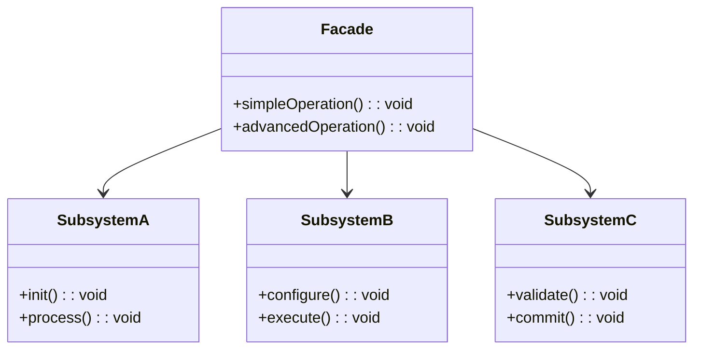

# 外观模式（Facade）

## 意图

为复杂子系统提供一个统一的高层接口，使子系统更易于使用。核心解决：客户端面对大量细粒度 API 时的认知负担。

## 结构（UML 类图）



核心特征：Facade 不封装子系统（客户端仍可直接访问），只是提供一条"捷径"。

## 适用场景

**该用：**
- 子系统复杂（多模块、多步骤），但 80% 用户只需简单操作
- SDK / 库需要暴露"开箱即用"的入口，同时保留底层 API
- 遗留系统接口混乱，需要一层整洁的入口供新代码调用

**不该用：**
- 子系统本身已经简单——多加一层只是无意义的间接
- 需要完全隔离客户端与子系统——那是 Adapter 或 Anti-Corruption Layer 的职责

## 代价与权衡

| 维度 | 说明 |
|------|------|
| 复杂度 | 低。通常就是一个类/模块，聚合调用 |
| 耦合 | Facade 依赖所有子系统，子系统变化时 Facade 需同步更新 |
| 灵活性 | 客户端可绕过 Facade 直接用底层 API（不强制） |
| 替代方案 | Builder（侧重构建过程）；Mediator（侧重对象间通信协调）；直接导出工具函数 |

> **TS/JS 特化**：JS 生态中 Facade 最常见的形态是库的**默认导出**或**顶层 API 模块**——如 `import express from 'express'` 背后是 Router + Server + Middleware 子系统的聚合。

## TypeScript 实现

### 经典实现：视频转码 Facade

```typescript
// 子系统 A：文件读取
class FileReader {
  read(path: string): Buffer {
    console.log(`[FileReader] Reading ${path}`);
    return Buffer.from(`raw-video-data-from-${path}`);
  }
}

// 子系统 B：编解码器
class VideoCodec {
  decode(data: Buffer, format: string): Buffer {
    console.log(`[Codec] Decoding ${format}`);
    return Buffer.from(`decoded-${data.toString()}`);
  }

  encode(data: Buffer, format: string): Buffer {
    console.log(`[Codec] Encoding to ${format}`);
    return Buffer.from(`${format}:${data.toString()}`);
  }
}

// 子系统 C：文件写入
class FileWriter {
  write(path: string, data: Buffer): void {
    console.log(`[FileWriter] Writing ${data.length} bytes to ${path}`);
  }
}

// 子系统 D：进度通知
class ProgressNotifier {
  notify(percent: number): void {
    console.log(`[Progress] ${percent}%`);
  }
}

// Facade：一行调用完成转码
class VideoConverter {
  private reader = new FileReader();
  private codec = new VideoCodec();
  private writer = new FileWriter();
  private notifier = new ProgressNotifier();

  convert(inputPath: string, outputPath: string, targetFormat: string): void {
    this.notifier.notify(0);

    const raw = this.reader.read(inputPath);
    this.notifier.notify(25);

    const decoded = this.codec.decode(raw, 'mp4');
    this.notifier.notify(50);

    const encoded = this.codec.encode(decoded, targetFormat);
    this.notifier.notify(75);

    this.writer.write(outputPath, encoded);
    this.notifier.notify(100);

    console.log(`Done: ${inputPath} -> ${outputPath}`);
  }
}

// 客户端只需一行
const converter = new VideoConverter();
converter.convert('input.mp4', 'output.webm', 'webm');
```

### 模块级 Facade（TS 中最常见的形态）

```typescript
// internal/compiler.ts
export class Compiler {
  parse(source: string): AST { /* ... */ return {} as AST; }
}
type AST = Record<string, unknown>;

// internal/optimizer.ts
export class Optimizer {
  optimize(ast: AST): AST { return ast; }
}

// internal/emitter.ts
export class Emitter {
  emit(ast: AST): string { return JSON.stringify(ast); }
}

// index.ts — Facade 模块：对外只暴露一个函数
import { Compiler } from './internal/compiler';
import { Optimizer } from './internal/optimizer';
import { Emitter } from './internal/emitter';

export function bundle(entry: string): string {
  const compiler = new Compiler();
  const optimizer = new Optimizer();
  const emitter = new Emitter();

  const ast = compiler.parse(entry);
  const optimized = optimizer.optimize(ast);
  return emitter.emit(optimized);
}

// 用户只需：import { bundle } from 'mini-bundler'
```

## 真实世界实例

| 框架/库 | 实现方式 |
|---------|---------|
| **jQuery `$()`** | 一个函数聚合了 DOM 查询、事件绑定、动画、Ajax 等子系统 |
| **Vite `createServer()`** | 聚合了 esbuild 预构建 + Rollup 打包 + HMR + 插件系统 |
| **`createApp()` (Vue 3)** | 聚合了组件注册、指令、插件、挂载等子系统初始化 |
| **Axios `axios(config)`** | 聚合了 adapter 选择、interceptor 执行、transformRequest/Response |
| **Node.js `http.createServer(cb)`** | 隐藏了 Socket、Parser、EventEmitter 等底层子系统 |

## 易混淆对比

| 对比 | 区别 |
|------|------|
| Facade vs Adapter | Facade 提供**简化**入口（子系统接口不变）；Adapter **转换**接口使其兼容 |
| Facade vs Mediator | Facade 是单向简化（客户端 → 子系统）；Mediator 是多对象间双向通信协调 |
| Facade vs Singleton | Facade 常实现为单例，但本质不同：Facade 关注接口简化，Singleton 关注实例唯一 |

## 关联

- **常配合**：Abstract Factory（Facade 内部用工厂创建子系统对象）、Singleton（Facade 通常全局唯一）
- **架构位置**：在 [software-engineering/](../../software-engineering/software-engineering-learning-outline.md) 第 6 章中，Facade 是分层架构中"服务层"对上层暴露的典型接口形态
