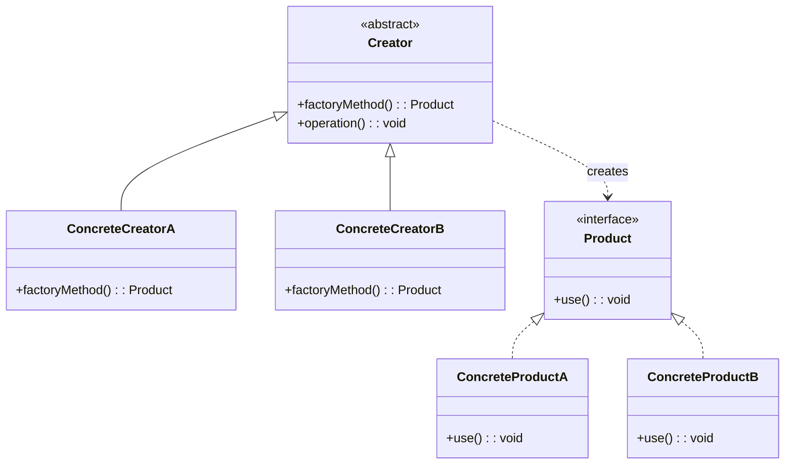

# 工厂方法模式（Factory Method）

## 意图

定义创建对象的接口，让子类决定实例化哪个类。将实例化延迟到子类。

## 结构（UML 类图）



## 适用场景

**该用：**
- 类不知道它需要创建的对象的具体类型（依赖倒置）
- 希望将"创建逻辑"与"使用逻辑"分离，子类可扩展创建行为
- 创建过程复杂（需要配置、注册、条件判断），不想污染业务代码

**不该用：**
- 只有一种产品且不会扩展——直接 `new` 更简单
- 创建逻辑只有一行——抽工厂是过度设计
- 产品族需要一起创建——用 Abstract Factory

## 代价与权衡

| 维度 | 说明 |
|------|------|
| 复杂度 | 中。每新增一种产品需要新增一个 Creator 子类 |
| 可读性 | 调用方看不到具体类型，调试时需要跳转 |
| 扩展性 | **好**。新增产品只需新增子类，不修改已有代码（OCP） |
| 替代方案 | 简单工厂（一个函数 + switch）——产品少时更直接 |

## TypeScript 实现

### 经典 OOP 实现

```typescript
// 产品接口
interface Logger {
  log(message: string): void;
}

class ConsoleLogger implements Logger {
  log(message: string): void {
    console.log(`[console] ${message}`);
  }
}

class FileLogger implements Logger {
  constructor(private filePath: string) {}
  log(message: string): void {
    // 实际场景：fs.appendFileSync(this.filePath, message)
    console.log(`[file:${this.filePath}] ${message}`);
  }
}

// 创建者
abstract class LoggerFactory {
  abstract createLogger(): Logger;

  /** 模板逻辑：创建 + 初始化 + 返回 */
  getLogger(): Logger {
    const logger = this.createLogger();
    logger.log('Logger initialized');
    return logger;
  }
}

class ConsoleLoggerFactory extends LoggerFactory {
  createLogger(): Logger {
    return new ConsoleLogger();
  }
}

class FileLoggerFactory extends LoggerFactory {
  constructor(private path: string) {
    super();
  }
  createLogger(): Logger {
    return new FileLogger(this.path);
  }
}

// 使用
const factory: LoggerFactory = new FileLoggerFactory('/var/log/app.log');
const logger = factory.getLogger();
logger.log('hello');
```

### TS 惯用：函数式工厂

```typescript
type Transport = 'http' | 'websocket' | 'ipc';

interface Connection {
  send(data: unknown): void;
  close(): void;
}

class HttpConnection implements Connection {
  constructor(private url: string) {}
  send(data: unknown): void { console.log(`HTTP POST ${this.url}`, data); }
  close(): void { console.log(`HTTP close ${this.url}`); }
}

class WebSocketConnection implements Connection {
  constructor(private url: string) {}
  send(data: unknown): void { console.log(`WS send ${this.url}`, data); }
  close(): void { console.log(`WS close ${this.url}`); }
}

class IpcConnection implements Connection {
  constructor(private url: string) {}
  send(data: unknown): void { console.log(`IPC send ${this.url}`, data); }
  close(): void { console.log(`IPC close ${this.url}`); }
}

function createConnection(transport: Transport, url: string): Connection {
  switch (transport) {
    case 'http':
      return new HttpConnection(url);
    case 'websocket':
      return new WebSocketConnection(url);
    case 'ipc':
      return new IpcConnection(url);
  }
}

const conn = createConnection('websocket', 'ws://localhost:8080');
conn.send({ type: 'ping' });
conn.close();
```

> TS 中如果不需要子类扩展创建逻辑，一个带 switch 的工厂函数比 class 继承更简洁。

## 真实世界实例

| 框架/库 | 实现方式 |
|---------|---------|
| **`document.createElement(tag)`** | 根据 tag 字符串创建不同 DOM 节点（HTMLDivElement、HTMLCanvasElement...） |
| **React `createElement` / `jsx`** | 根据 type（string / function / class）创建不同元素 |
| **NestJS `@Module` providers** | DI 容器根据 token 和 useClass/useFactory 决定实例化策略 |
| **Winston `winston.createLogger`** | 根据 transport 配置创建不同 Transport 实例 |
| **Axios `axios.create(config)`** | 工厂方法创建带默认配置的 Axios 实例 |

## 易混淆对比

| 对比 | 区别 |
|------|------|
| Factory Method vs Abstract Factory | Factory Method 创建一个产品；Abstract Factory 创建一族产品 |
| Factory Method vs Builder | Factory Method 一步创建；Builder 分步构建复杂对象 |
| Factory Method vs 简单工厂 | 简单工厂是一个函数/静态方法 + 条件分支；Factory Method 通过继承让子类决定创建什么 |

## 关联

- **常配合**：Template Method（工厂方法本身是模板方法的一个步骤）、Singleton（工厂缓存实例）
- **架构位置**：在 [software-engineering/](../../software-engineering/software-engineering-learning-outline.md) 第 8 章中，Factory Method 是依赖注入的底层机制——DI 容器本质上是一个大型工厂
