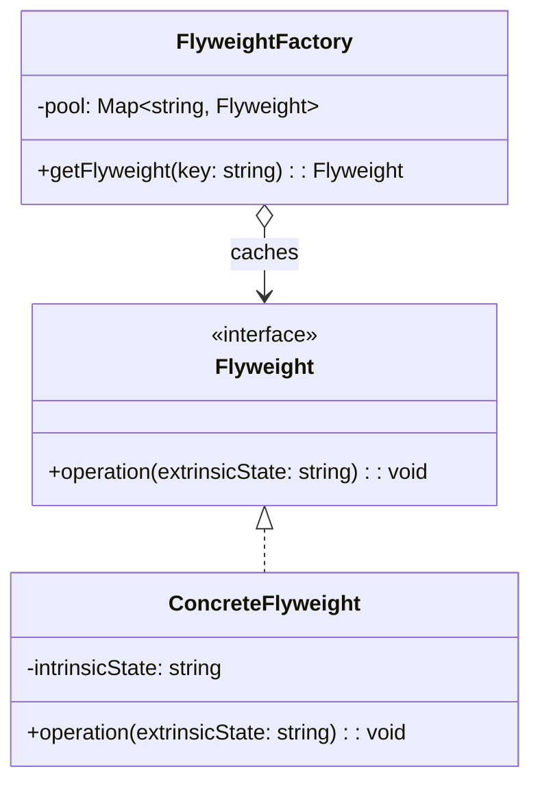

# 享元模式（Flyweight）

> 📍 **导航**：前置 [facade.md](./facade.md) ｜ 后续 [proxy.md](./proxy.md) ｜ 优先级 **P2**

## 意图

通过共享细粒度对象来有效支持大量对象的存储。核心解决：对象数量巨大导致的内存浪费问题。

## 结构（UML 类图）



核心概念：
- **内在状态（Intrinsic）**：可共享的、不随上下文变化的数据，存在 Flyweight 内部
- **外在状态（Extrinsic）**：随上下文变化的数据，由客户端在调用时传入

## 适用场景

**该用：**
- 应用需要创建大量相似对象（数千/数万个），内存成为瓶颈
- 对象的大部分状态可以外部化（外在状态）
- 对象可按内在状态分组，组内对象可共享

**不该用：**
- 对象数量少（几十/几百个）——共享带来的复杂度不值得
- 对象状态几乎全部是外在的——没有可共享的内在状态

> 🔍 **对应 Code Smell**：大量相似对象导致内存压力、对象状态大部分可外部化

## 代价与权衡

| 维度 | 说明 |
|------|------|
| 复杂度 | 中高。需要拆分内在/外在状态，引入 Factory 管理池 |
| 内存收益 | 对象数从 N 降为 M（M = 内在状态组合数），显著减少 GC 压力 |
| 运行时开销 | 每次操作需传入外在状态，查找池有哈希开销 |
| 替代方案 | 对象池（Object Pool，侧重复用而非共享）；数据驱动（plain data + 查表）；V8 引擎自身的字符串内化 |

> **TS/JS 特化**：V8 引擎已内置字符串内化（string interning）和隐藏类（hidden class / shape）优化。JS 层面的 Flyweight 更多体现在**应用层缓存**（如 Canvas 文字渲染缓存、图标精灵图）而非语言机制。

## TypeScript 实现

### 经典实现：字符渲染（文本编辑器）

```typescript
// 内在状态：字符的样式（可共享）
interface CharStyle {
  fontFamily: string;
  fontSize: number;
  color: string;
  bold: boolean;
}

// Flyweight：共享的字符样式对象
class CharFlyweight {
  constructor(public readonly style: CharStyle) {}

  render(char: string, x: number, y: number): void {
    // 外在状态 (char, x, y) 由客户端传入
    console.log(
      `Draw "${char}" at (${x},${y}) ` +
      `[${this.style.fontFamily} ${this.style.fontSize}px ${this.style.color}${this.style.bold ? ' bold' : ''}]`,
    );
  }
}

// FlyweightFactory：管理共享池
class CharFlyweightFactory {
  private pool = new Map<string, CharFlyweight>();

  getFlyweight(style: CharStyle): CharFlyweight {
    const key = JSON.stringify(style);
    let flyweight = this.pool.get(key);
    if (!flyweight) {
      flyweight = new CharFlyweight(style);
      this.pool.set(key, flyweight);
      console.log(`[Factory] Created new flyweight: ${key}`);
    }
    return flyweight;
  }

  get poolSize(): number {
    return this.pool.size;
  }
}

// 客户端：文档渲染
const factory = new CharFlyweightFactory();

const bodyStyle: CharStyle = { fontFamily: 'Arial', fontSize: 14, color: '#333', bold: false };
const titleStyle: CharStyle = { fontFamily: 'Arial', fontSize: 24, color: '#000', bold: true };

// 模拟渲染 10000 个字符，但只有 2 个 Flyweight 实例
const text = 'Hello World'.repeat(909); // ~10000 chars
for (let i = 0; i < text.length; i++) {
  const style = i < 5 ? titleStyle : bodyStyle;
  const flyweight = factory.getFlyweight(style);
  flyweight.render(text[i], i * 8, i < 5 ? 0 : 30);
}

console.log(`Total flyweights: ${factory.poolSize}`); // 2
```

### 实用实现：Canvas 文字测量缓存

```typescript
// 场景：Canvas 中 measureText 开销大，相同字体+文字只需测量一次
interface TextMetrics {
  width: number;
  height: number;
}

class TextMetricsCache {
  private cache = new Map<string, TextMetrics>();

  // 内在状态：font + text 组合（可共享）
  // 外在状态：x, y 坐标（调用时传入）
  measure(font: string, text: string): TextMetrics {
    const key = `${font}::${text}`;
    let metrics = this.cache.get(key);
    if (!metrics) {
      // 模拟昂贵的测量操作
      metrics = {
        width: text.length * parseInt(font) * 0.6,
        height: parseInt(font) * 1.2,
      };
      this.cache.set(key, metrics);
    }
    return metrics;
  }

  get size(): number {
    return this.cache.size;
  }
}

const cache = new TextMetricsCache();

// 渲染 1000 个标签，但文字内容只有有限几种
const labels = ['Active', 'Inactive', 'Pending', 'Error'];
for (let i = 0; i < 1000; i++) {
  const text = labels[i % labels.length];
  const metrics = cache.measure('14px', text);
  // 外在状态：位置由循环决定
  const x = (i % 50) * 100;
  const y = Math.floor(i / 50) * 20;
  void { x, y, metrics }; // 实际会调用 ctx.fillText
}

console.log(`Cache entries: ${cache.size}`); // 4（而非 1000）
```

## 真实世界实例

| 框架/库 | 实现方式 |
|---------|---------|
| **V8 字符串内化** | 相同的字符串字面量在堆中只存一份（internalized string table） |
| **CSS 引擎** | 相同选择器的 ComputedStyle 对象在渲染树中共享 |
| **游戏引擎（Cocos / Phaser）** | 精灵图（Sprite Sheet）：共享纹理，外在状态是位置/旋转 |
| **`WeakRef` / `FinalizationRegistry`** | WeakRef 允许共享对象引用而不阻止 GC，实现轻量级共享引用池（JS 中真正的 Flyweight 语义） |
| **Node.js `Buffer.poolSize`** | 小 Buffer 从共享池中分配，减少内存碎片 |

## 易混淆对比

| 对比 | 区别 |
|------|------|
| Flyweight vs Object Pool | Flyweight 共享**不可变**内在状态；Object Pool 复用**可变**对象（用完归还） |
| Flyweight vs Singleton | Singleton 全局唯一实例；Flyweight 是按 key 分组的多个共享实例 |
| Flyweight vs Cache | Cache 缓存计算结果（可过期/淘汰）；Flyweight 共享对象本身（生命周期与应用一致） |

## 面试速答

> **问：Flyweight 和缓存（Cache）有什么区别？**
>
> 答：Cache 缓存的是计算结果或临时数据，有过期策略（TTL / LRU），命中后返回副本或引用，未命中则重新计算。Flyweight 共享的是对象本身，没有过期概念，生命周期与应用一致，且强调的是"内在状态不可变 + 外在状态由客户端传入"的分离设计。Cache 是通用优化手段，Flyweight 是一种对象结构设计模式。

> **问：在 V8 引擎中，字符串内化是 Flyweight 吗？**
>
> 答：是的，V8 的字符串内化（string interning）是 Flyweight 思想的引擎级实现。相同的字符串字面量在堆中只存一份（internalized string table），所有引用指向同一内存。内在状态是字符串内容（不可变、可共享），外在状态是使用位置（由调用上下文决定）。这完全符合 Flyweight 的定义，只是由引擎自动完成而非应用层手动管理。

> **问：什么场景下你会考虑 Flyweight？现代 JS 还需要吗？**
>
> 答：当应用需要创建数万甚至数十万个相似对象且内存成为瓶颈时考虑，典型场景：文本编辑器中每个字符的样式对象、Canvas 游戏中大量精灵、表格中重复的单元格格式。现代 JS 中 V8 已内置字符串内化和隐藏类优化，大多数场景无需手动 Flyweight。但在 Canvas/WebGL 渲染、大型文档编辑器等内存敏感场景，显式的 Flyweight 设计仍然有价值。

## 关联

- **常配合**：Composite（树形结构中叶子节点用 Flyweight 共享）、Factory（FlyweightFactory 管理池）
- **架构位置**：在 [software-engineering/](../../software-engineering/software-engineering-learning-outline.md) 第 10 章中，Flyweight 思想对应性能优化中的"对象共享与内存池化"策略
