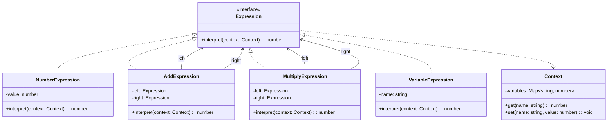

# 解释器模式（Interpreter）

> 📍 **导航**：前置 [command.md](./command.md) ｜ 后续 [iterator.md](./iterator.md) ｜ 优先级 **P2**

## 意图

给定一个语言，定义其文法的一种表示，并建立一个解释器来解释该语言中的句子。核心解决：用面向对象方式实现简单语言/表达式的解析与求值。

## 结构（UML 类图）



核心机制：
- 每条文法规则对应一个类
- 终结符表达式（数字、变量）直接求值
- 非终结符表达式（运算符）递归组合子表达式

## 适用场景

**该用：**
- 文法简单（规则少、嵌套浅），如配置表达式、模板语法
- 需要用户自定义简单 DSL（领域特定语言）
- 表达式需要可组合、可扩展

**不该用：**
- 文法复杂（规则 > 20 条）——类爆炸，难以维护
- 性能敏感场景——递归解释执行远慢于编译
- 已有成熟的 parser 工具可用（PEG.js、Chevrotain、ANTLR）

> 🔍 **对应 Code Smell**：需要解析自定义 DSL 或表达式、文法规则相对简单

## 代价与权衡

| 维度 | 说明 |
|------|------|
| 复杂度 | 高。每条规则一个类，文法复杂时类数量爆炸 |
| 可扩展性 | **好**。新增规则只需新增类，符合开闭原则 |
| 性能 | **差**。递归调用 + 对象创建开销大 |
| 可维护性 | 文法变更时需修改多个类 |
| 替代方案 | Parser Combinator、PEG 解析器生成器、正则引擎、直接 `eval`（不推荐） |

> **TS/JS 特化**：JS 生态中很少手写经典 Interpreter 类层次。更常见的是：1）正则引擎（内置的 `RegExp`）；2）Babel/ESLint 的 AST visitor（解析后遍历而非递归解释）；3）模板引擎（`{{var}}`）用简单的字符串解析。Interpreter 模式的思想更多体现在"AST 节点 + 递归求值"中。

## TypeScript 实现

### 算术表达式解释器

```typescript
interface Expression {
  interpret(context: Map<string, number>): number;
}

class NumberLiteral implements Expression {
  constructor(private readonly value: number) {}

  interpret(): number {
    return this.value;
  }
}

class Variable implements Expression {
  constructor(private readonly name: string) {}

  interpret(context: Map<string, number>): number {
    const value = context.get(this.name);
    if (value === undefined) {
      throw new Error(`Undefined variable: ${this.name}`);
    }
    return value;
  }
}

class BinaryOp implements Expression {
  constructor(
    private readonly op: '+' | '-' | '*' | '/',
    private readonly left: Expression,
    private readonly right: Expression
  ) {}

  interpret(context: Map<string, number>): number {
    const l = this.left.interpret(context);
    const r = this.right.interpret(context);
    switch (this.op) {
      case '+': return l + r;
      case '-': return l - r;
      case '*': return l * r;
      case '/': return l / r;
    }
  }
}

// 简单递归下降解析器：支持 +, -, *, / 和括号
class Parser {
  private pos = 0;

  constructor(private readonly input: string) {}

  parse(): Expression {
    const expr = this.parseAddSub();
    this.skipWhitespace();
    if (this.pos < this.input.length) {
      throw new Error(`Unexpected character: '${this.input[this.pos]}'`);
    }
    return expr;
  }

  private parseAddSub(): Expression {
    let left = this.parseMulDiv();
    this.skipWhitespace();
    while (this.pos < this.input.length && (this.peek() === '+' || this.peek() === '-')) {
      const op = this.consume() as '+' | '-';
      const right = this.parseMulDiv();
      left = new BinaryOp(op, left, right);
      this.skipWhitespace();
    }
    return left;
  }

  private parseMulDiv(): Expression {
    let left = this.parsePrimary();
    this.skipWhitespace();
    while (this.pos < this.input.length && (this.peek() === '*' || this.peek() === '/')) {
      const op = this.consume() as '*' | '/';
      const right = this.parsePrimary();
      left = new BinaryOp(op, left, right);
      this.skipWhitespace();
    }
    return left;
  }

  private parsePrimary(): Expression {
    this.skipWhitespace();
    if (this.peek() === '(') {
      this.consume(); // '('
      const expr = this.parseAddSub();
      this.skipWhitespace();
      if (this.peek() !== ')') throw new Error('Expected )');
      this.consume(); // ')'
      return expr;
    }
    if (/[a-zA-Z_]/.test(this.peek())) {
      return this.parseVariable();
    }
    return this.parseNumber();
  }

  private parseNumber(): Expression {
    this.skipWhitespace();
    let numStr = '';
    while (this.pos < this.input.length && /[\d.]/.test(this.peek())) {
      numStr += this.consume();
    }
    if (!numStr) throw new Error(`Expected number at position ${this.pos}`);
    return new NumberLiteral(parseFloat(numStr));
  }

  private parseVariable(): Expression {
    let name = '';
    while (this.pos < this.input.length && /[a-zA-Z_\d]/.test(this.peek())) {
      name += this.consume();
    }
    return new Variable(name);
  }

  private skipWhitespace(): void {
    while (this.pos < this.input.length && this.input[this.pos] === ' ') {
      this.pos++;
    }
  }

  private peek(): string {
    return this.input[this.pos];
  }

  private consume(): string {
    return this.input[this.pos++];
  }
}

// 使用
const ast = new Parser('(x + 2) * y - 1').parse();
const context = new Map<string, number>([['x', 3], ['y', 4]]);
console.log(ast.interpret(context)); // (3+2)*4-1 = 19
```

### 模板字符串解释器（`{{var}}` 语法）

```typescript
type TemplateNode =
  | { type: 'text'; value: string }
  | { type: 'variable'; name: string };

function parseTemplate(template: string): TemplateNode[] {
  const nodes: TemplateNode[] = [];
  const regex = /\{\{(\w+)\}\}/g;
  let lastIndex = 0;
  let match: RegExpExecArray | null;

  while ((match = regex.exec(template)) !== null) {
    if (match.index > lastIndex) {
      nodes.push({ type: 'text', value: template.slice(lastIndex, match.index) });
    }
    nodes.push({ type: 'variable', name: match[1] });
    lastIndex = regex.lastIndex;
  }

  if (lastIndex < template.length) {
    nodes.push({ type: 'text', value: template.slice(lastIndex) });
  }

  return nodes;
}

function interpretTemplate(
  nodes: TemplateNode[],
  context: Record<string, string>
): string {
  return nodes
    .map((node) => {
      if (node.type === 'text') return node.value;
      const value = context[node.name];
      if (value === undefined) throw new Error(`Missing variable: ${node.name}`);
      return value;
    })
    .join('');
}

// 使用
const ast = parseTemplate('Hello, {{name}}! You have {{count}} messages.');
const result = interpretTemplate(ast, { name: 'Alice', count: '5' });
console.log(result); // "Hello, Alice! You have 5 messages."
```

## 真实世界实例

| 框架/库 | 实现方式 |
|---------|---------|
| **Babel** | 将 JS 代码解析为 AST，每种节点类型对应一个解释/转换逻辑 |
| **正则引擎**（`RegExp`） | 正则表达式本身就是一种语言，引擎递归解释 pattern |
| **Handlebars / Mustache** | `{{#if}}` / `{{#each}}` 是文法规则，模板引擎即解释器 |
| **SQL 解析器**（node-sql-parser） | 将 SQL 文法映射为 AST 节点类，再解释执行或转译 |
| **CSS-in-JS**（styled-components） | 解析模板字符串中的 `${props => ...}` 插值表达式 |

## 易混淆对比

| 对比 | 区别 |
|------|------|
| Interpreter vs Visitor | Interpreter 将求值逻辑放在节点类内部；Visitor 将操作外置，节点只接受访问 |
| Interpreter vs Compiler | Interpreter 边解析边执行；Compiler 先完整翻译再执行（性能更好） |
| Interpreter vs Strategy | Strategy 封装可替换的算法；Interpreter 定义语言文法并递归求值 |

## 面试速答

> **问：什么场景下你会自己写解释器而不是用现成工具？**
>
> 答：当文法非常简单（规则少、嵌套浅），比如配置表达式、过滤条件、模板插值 `{{var}}`，用正则加递归下降几十行就能搞定，引入 PEG.js/ANTLR 反而过重。另一种情况是需要深度定制求值语义或错误提示，现成工具难以满足。如果文法规则超过十几条且会持续演进，就应该用解析器生成器而非手写。

> **问：解释器模式的最大缺点是什么？**
>
> 答：类爆炸和性能差。每条文法规则对应一个类，文法复杂时类数量急剧膨胀、难以维护；执行上靠递归遍历 AST 并频繁创建对象，远慢于编译执行。所以它只适合简单语言，复杂语言通常改用 parser combinator 或先编译再执行。

> **问：Babel 是解释器模式吗？**
>
> 答：不完全是。Babel 把源码解析成 AST 这一步是解析器，而对 AST 的遍历转换用的是 Visitor 模式（`traverse` + 节点类型分派），不是把求值逻辑放在节点内部的经典 Interpreter。更准确说 Babel 是转译器（compiler）：解析 → Visitor 转换 → 代码生成，而非边解析边执行。

## 关联

- **常配合**：Visitor（用 Visitor 遍历 AST 而非在每个节点内写 interpret）、Composite（AST 本身是树形结构）、Iterator（遍历 AST 节点）
- **架构位置**：在 [software-engineering/](../../software-engineering/software-engineering-learning-outline.md) 第 11 章中，DSL 设计和编译器前端是解释器模式的典型应用领域
