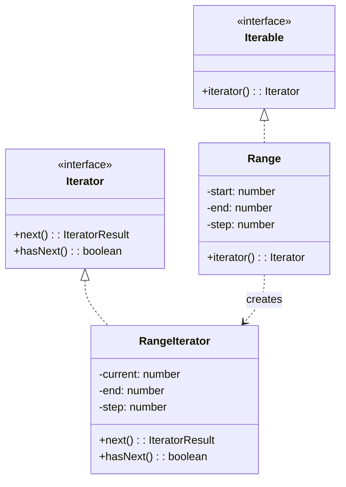

# 迭代器模式（Iterator）

> 📍 **导航**：前置 [interpreter.md](./interpreter.md) ｜ 后续 [mediator.md](./mediator.md) ｜ 优先级 **P1**

## 意图

提供一种方法顺序访问聚合对象的各个元素，而又不暴露该对象的内部表示。核心解决：统一不同数据结构的遍历方式。

## 结构（UML 类图）



核心机制：
- 聚合对象暴露 `iterator()` 方法，不暴露内部结构
- 迭代器维护遍历状态（当前位置）
- 客户端通过统一接口遍历，无需关心底层是数组、链表还是树

## 适用场景

**该用：**
- 需要统一多种集合的遍历接口（数组、树、图、自定义集合）
- 需要惰性求值（不一次性生成所有元素）
- 需要支持多种遍历方式（正序、逆序、按层）
- 需要隐藏复杂数据结构的内部实现

**不该用：**
- 简单的数组遍历——`for...of` 已经足够
- 随机访问场景（需要按索引跳转）——迭代器是顺序访问
- 只需要遍历一次且逻辑简单——直接用回调（`forEach`）

> 🔍 **对应 Code Smell**：多种集合遍历方式不统一、需要惰性求值避免中间数组

## 代价与权衡

| 维度 | 说明 |
|------|------|
| 复杂度 | 低（TS 中实现 `Symbol.iterator` 即可） |
| 性能 | 惰性迭代器避免中间数组分配；但有函数调用开销 |
| 可组合性 | **好**。迭代器可链式组合（map/filter/take） |
| 限制 | 单次消费（部分迭代器不可重置）；不支持随机访问 |
| 替代方案 | 回调函数（`forEach`）、Stream API、RxJS Observable |

> **TS/JS 特化**：JS 内置了迭代器协议（`Symbol.iterator` + `{ next(), done, value }`），`for...of`、展开运算符、解构赋值都基于此。Generator 函数（`function*`）是实现自定义迭代器的最简方式，无需手写 Iterator 类。

## TypeScript 实现

### 手写 Iterator 协议

```typescript
interface IteratorResult<T> {
  value: T;
  done: boolean;
}

class Range implements Iterable<number> {
  constructor(
    private readonly start: number,
    private readonly end: number,
    private readonly step: number = 1
  ) {}

  [Symbol.iterator](): Iterator<number> {
    let current = this.start;
    const { end, step } = this;

    return {
      next(): IteratorResult<number> {
        if (current <= end) {
          const value = current;
          current += step;
          return { value, done: false };
        }
        return { value: undefined as unknown as number, done: true };
      },
    };
  }
}

// 使用：for...of 自动调用 Symbol.iterator
for (const n of new Range(1, 10, 2)) {
  console.log(n); // 1, 3, 5, 7, 9
}

// 展开运算符也能用
const nums = [...new Range(1, 5)];
console.log(nums); // [1, 2, 3, 4, 5]
```

### Generator 实现（推荐）

```typescript
// Generator 函数天然返回 IterableIterator
function* range(start: number, end: number, step = 1): Generator<number> {
  for (let i = start; i <= end; i += step) {
    yield i;
  }
}

// 惰性求值：不会一次性生成所有值
function* fibonacci(): Generator<number> {
  let prev = 0;
  let curr = 1;
  while (true) {
    yield curr;
    [prev, curr] = [curr, prev + curr];
  }
}

// 组合：取前 N 个
function* take<T>(iterable: Iterable<T>, count: number): Generator<T> {
  let i = 0;
  for (const item of iterable) {
    if (i >= count) return;
    yield item;
    i++;
  }
}

// 组合：过滤
function* filter<T>(
  iterable: Iterable<T>,
  predicate: (item: T) => boolean
): Generator<T> {
  for (const item of iterable) {
    if (predicate(item)) {
      yield item;
    }
  }
}

// 使用：惰性管道，只在需要时计算
const evenFibs = filter(fibonacci(), (n) => n % 2 === 0);
const first5 = take(evenFibs, 5);
console.log([...first5]); // [2, 8, 34, 144, 610]
```

### 自定义可迭代数据结构

```typescript
class LinkedList<T> implements Iterable<T> {
  private head: Node<T> | null = null;

  push(value: T): void {
    const node: Node<T> = { value, next: this.head };
    this.head = node;
  }

  // 正向迭代
  [Symbol.iterator](): Iterator<T> {
    let current = this.head;
    return {
      next(): IteratorResult<T> {
        if (current) {
          const value = current.value;
          current = current.next;
          return { value, done: false };
        }
        return { value: undefined as unknown as T, done: true };
      },
    };
  }

  // 反向迭代（生成器实现）
  *reverse(): Generator<T> {
    const items = [...this]; // 先收集
    for (let i = items.length - 1; i >= 0; i--) {
      yield items[i];
    }
  }
}

interface Node<T> {
  value: T;
  next: Node<T> | null;
}

// 使用
const list = new LinkedList<number>();
list.push(3);
list.push(2);
list.push(1);

console.log([...list]); // [1, 2, 3]
console.log([...list.reverse()]); // [3, 2, 1]
```

## 真实世界实例

| 框架/库 | 实现方式 |
|---------|---------|
| **JS 内置** | `Array`, `Map`, `Set`, `String` 都实现了 `Symbol.iterator` |
| **Node.js Streams** | `Readable` 流实现 `Symbol.asyncIterator`，支持 `for await...of` |
| **RxJS** | `Observable` 可视为异步迭代器的推送版本 |
| **Redux-Saga** | Generator 函数驱动副作用流程控制 |
| **Cheerio / jsdom** | DOM 集合（`NodeList`）实现迭代器协议 |

## 易混淆对比

| 对比 | 区别 |
|------|------|
| Iterator vs Iterable | Iterable 是"可以被迭代的对象"（有 `Symbol.iterator`）；Iterator 是"正在迭代的游标"（有 `next()`） |
| Iterator vs Generator | Generator 是实现 Iterator 的语法糖；Iterator 是协议/接口 |
| Iterator vs Stream | Iterator 是拉模型（消费者主动 `next()`）；Stream 是推模型（生产者主动推送） |

## 面试速答

> **问：Iterator 和 Generator 是什么关系？**
>
> 答：Iterator 是协议/接口（实现 `next()` 返回 `{ value, done }` 的对象），Generator 是实现该协议的语法糖。`function*` 写出的函数调用后返回一个 Generator，它同时是 Iterable 和 Iterator，用 `yield` 暂停/恢复执行，免去了手写游标状态。可以说 Generator 是语言层面内置的迭代器实现。

> **问：for...of 是怎么工作的？背后调用了什么？**
>
> 答：`for...of` 先调用目标对象的 `Symbol.iterator` 方法拿到一个迭代器，然后反复调用迭代器的 `next()`，每次取 `value` 赋给循环变量，直到返回的 `done` 为 `true`。所以任何实现了 `Symbol.iterator` 的对象（数组、Map、Set、字符串、自定义对象）都能被 `for...of` 遍历，展开运算符和解构赋值底层也是这套协议。

> **问：迭代器是拉模型还是推模型？和 Stream 有什么区别？**
>
> 答：迭代器是拉模型，由消费者主动调用 `next()` 按需取下一个值，生产者是被动的，因此天然支持惰性求值和背压。Stream（尤其 Node Readable 或 RxJS Observable）是推模型，生产者主动把数据推给消费者，消费者被动接收。异步场景下 `Symbol.asyncIterator` + `for await...of` 让流也能以拉的方式消费。

## 关联

- **常配合**：Composite（遍历树形结构）、Factory Method（`iterator()` 是工厂方法）、Visitor（遍历 + 操作分离）
- **架构位置**：在 [software-engineering/](../../software-engineering/software-engineering-learning-outline.md) 第 10 章中，惰性迭代器是函数式数据管道（map/filter/reduce 链）的基础设施
