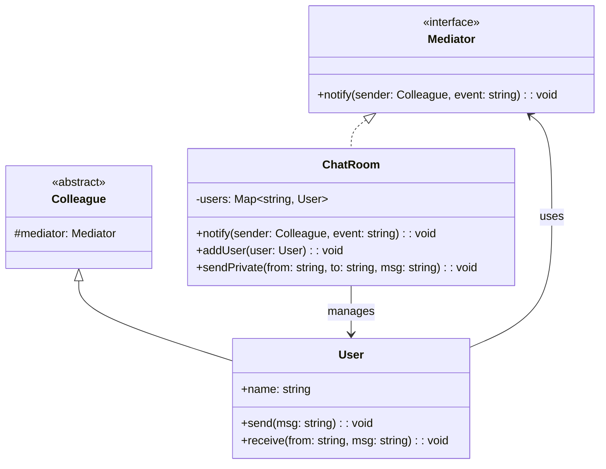

# 中介者模式（Mediator）

## 意图

用一个中介对象封装一系列对象的交互，使各对象不需要显式地相互引用，从而松耦合，而且可以独立地改变它们之间的交互。

## 结构（UML 类图）



核心机制：
- 将多对多交互收敛为一对多（所有对象只与 Mediator 通信）
- 对象间不直接持有彼此引用
- 交互逻辑集中在 Mediator 中，易于修改和扩展

## 适用场景

**该用：**
- 多个对象相互通信，形成复杂的网状引用（"蜘蛛网"）
- 交互逻辑需要集中管理和变更（如聊天室、空中交通管制）
- 组件需要复用但不能依赖具体协作对象

**不该用：**
- 对象间交互简单且固定——直接引用更清晰
- 只有两个对象通信——无需中介
- Mediator 本身变得过于庞大（God Object 反模式）

> 🔍 **对应 Code Smell**：对象间多对多耦合形成"蜘蛛网"引用

## 代价与权衡

| 维度 | 说明 |
|------|------|
| 复杂度 | 中。引入一个中心对象，但减少了 N² 条引用 |
| 耦合度 | 同事对象解耦，但 Mediator 与所有同事耦合 |
| 可维护性 | 交互逻辑集中，修改方便；但 Mediator 易膨胀 |
| 可测试性 | 可单独测试 Mediator 的协调逻辑 |
| 替代方案 | 事件总线（EventEmitter）、状态管理库（Redux）、依赖注入 |

> **TS/JS 特化**：Node.js 的 `EventEmitter` 常被当作 Mediator 使用，但严格来说 EventEmitter 是 Observer（广播）。真正的 Mediator 需要**路由逻辑**——根据事件类型和发送者决定通知谁。前端状态管理（Redux store）更接近 Mediator：组件不直接通信，通过 dispatch → reducer → state 间接协调。

## TypeScript 实现

### 聊天室 Mediator

```typescript
interface Mediator {
  notify(sender: User, event: string, data?: unknown): void;
}

class ChatRoom implements Mediator {
  private users = new Map<string, User>();

  addUser(user: User): void {
    this.users.set(user.name, user);
    user.setMediator(this);
    this.broadcast('system', `${user.name} joined the room`);
  }

  removeUser(name: string): void {
    this.users.delete(name);
    this.broadcast('system', `${name} left the room`);
  }

  notify(sender: User, event: string, data?: unknown): void {
    switch (event) {
      case 'message':
        // 广播：通知除发送者外的所有人
        for (const [name, user] of this.users) {
          if (name !== sender.name) {
            user.receive(sender.name, data as string);
          }
        }
        break;
      case 'private': {
        // 私聊：只通知目标用户
        const { to, message } = data as { to: string; message: string };
        const target = this.users.get(to);
        if (target) {
          target.receive(sender.name, `[private] ${message}`);
        }
        break;
      }
    }
  }

  private broadcast(from: string, message: string): void {
    for (const user of this.users.values()) {
      user.receive(from, message);
    }
  }
}

class User {
  private mediator: Mediator | null = null;

  constructor(readonly name: string) {}

  setMediator(mediator: Mediator): void {
    this.mediator = mediator;
  }

  send(message: string): void {
    console.log(`[${this.name}] sends: ${message}`);
    this.mediator?.notify(this, 'message', message);
  }

  sendPrivate(to: string, message: string): void {
    console.log(`[${this.name}] -> [${to}]: ${message}`);
    this.mediator?.notify(this, 'private', { to, message });
  }

  receive(from: string, message: string): void {
    console.log(`[${this.name}] receives from [${from}]: ${message}`);
  }
}

// 使用
const room = new ChatRoom();
const alice = new User('Alice');
const bob = new User('Bob');
const charlie = new User('Charlie');

room.addUser(alice);
room.addUser(bob);
room.addUser(charlie);

alice.send('Hello everyone!');
bob.sendPrivate('Charlie', 'Hey, got a minute?');
```

### 类型安全的事件 Mediator

```typescript
// 定义所有事件及其 payload 类型
interface MediatorEvents {
  'user:login': { userId: string; timestamp: number };
  'user:logout': { userId: string };
  'order:created': { orderId: string; userId: string; total: number };
  'notification:send': { userId: string; message: string };
}

type EventHandler<T> = (payload: T) => void;

class TypedMediator {
  private handlers = new Map<string, Set<EventHandler<never>>>();

  on<K extends keyof MediatorEvents>(
    event: K,
    handler: EventHandler<MediatorEvents[K]>
  ): void {
    if (!this.handlers.has(event)) {
      this.handlers.set(event, new Set());
    }
    this.handlers.get(event)!.add(handler as EventHandler<never>);
  }

  off<K extends keyof MediatorEvents>(
    event: K,
    handler: EventHandler<MediatorEvents[K]>
  ): void {
    this.handlers.get(event)?.delete(handler as EventHandler<never>);
  }

  emit<K extends keyof MediatorEvents>(
    event: K,
    payload: MediatorEvents[K]
  ): void {
    const handlers = this.handlers.get(event);
    if (handlers) {
      for (const handler of handlers) {
        (handler as EventHandler<MediatorEvents[K]>)(payload);
      }
    }
  }
}

// 使用
const mediator = new TypedMediator();

// 通知服务监听订单事件
mediator.on('order:created', ({ userId, total }) => {
  mediator.emit('notification:send', {
    userId,
    message: `Order confirmed: $${total}`,
  });
});

mediator.on('notification:send', ({ userId, message }) => {
  console.log(`Notify [${userId}]: ${message}`);
});

mediator.emit('order:created', { orderId: 'ORD-001', userId: 'u1', total: 99.9 });
```

## 真实世界实例

| 框架/库 | 实现方式 |
|---------|---------|
| **Redux Store** | 组件不直接通信，通过 `dispatch(action)` → reducer → state 变更间接协调 |
| **Angular 依赖注入** | `Injector` 作为中介管理所有 Service 的创建和注入 |
| **Air Traffic Control** | 经典领域案例：飞机不直接通信，通过塔台协调 |
| **Dialog/Modal 管理器** | UI 框架中的 ModalManager 协调多个弹窗的打开/关闭/层级 |
| **Webpack Plugin System** | `compiler` 对象作为中介，插件通过 hooks 交互而非直接引用 |

## 易混淆对比

| 对比 | 区别 |
|------|------|
| Mediator vs Observer | Observer 是广播（一对多，无路由逻辑）；Mediator 是集中协调（有路由，决定谁收到什么） |
| Mediator vs Facade | Facade 简化子系统对外的接口（单向）；Mediator 协调同事间的双向通信 |
| Mediator vs Event Bus | Event Bus 是无差别广播；Mediator 包含业务路由逻辑（知道谁该收到什么） |

## 面试速答

> **问：Mediator 和 EventEmitter 有什么区别？**
>
> 答：EventEmitter 本质是 Observer，做的是无差别广播——它不知道也不关心谁该收到什么，只负责把事件发给所有订阅者。Mediator 则封装了业务路由逻辑，会根据事件类型和发送者决定通知哪些同事、以什么方式。实践中常把 EventEmitter 当作 Mediator 用，但严格说缺少路由决策的只是事件总线。

> **问：Redux Store 算 Mediator 吗？**
>
> 答：可以这么看。组件之间不直接通信，而是通过 `dispatch(action)` 把意图交给 store，reducer 计算新 state，再由订阅机制通知相关组件更新，store 充当了集中协调的中介。它比纯 EventEmitter 更进一步，因为 reducer 决定了状态如何变化、谁受影响，带有明确的路由/协调语义。

> **问：Mediator 容易变成 God Object，怎么避免？**
>
> 答：关键是别让所有逻辑都堆进一个 Mediator。可以按领域/功能把大 Mediator 拆成多个小的，或把路由规则数据化（用配置表/转换表描述谁通知谁），让 Mediator 只做调度不做业务。也可以引入依赖注入或事件总线分担通信，保持 Mediator 薄、同事对象各自内聚。

## 关联

- **常配合**：Observer（Mediator 内部用 Observer 通知同事）、Command（将请求封装后交给 Mediator 调度）、Facade（对外暴露简化接口）
- **架构位置**：在 [software-engineering/](../../software-engineering/software-engineering-learning-outline.md) 第 10 章中，前端状态管理（Redux/Vuex）是 Mediator 在应用架构中的典型体现
