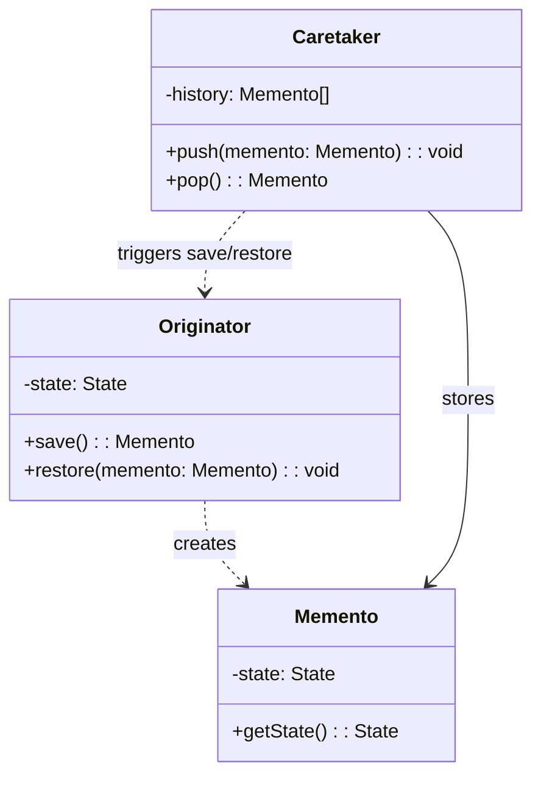

# 备忘录模式（Memento）

## 意图

在不破坏封装性的前提下，捕获一个对象的内部状态，并在该对象之外保存这个状态，以便后续恢复到先前的状态。

## 结构（UML 类图）



核心角色：
- **Originator**：需要保存/恢复状态的对象
- **Memento**：状态快照，对 Caretaker 不透明
- **Caretaker**：保管 Memento，不操作其内容

## 适用场景

**该用：**
- 编辑器撤销/重做（文本、画布、表单）
- 游戏存档 / 应用状态快照
- 事务回滚（数据库 savepoint）
- 浏览器前进/后退（history state）

**不该用：**
- 状态对象极大（快照内存开销高）——考虑增量记录（Command 模式）
- 状态包含不可序列化的资源（Socket、文件句柄）
- 只需要最近一次状态——直接保存变量即可

## 代价与权衡

| 维度 | 说明 |
|------|------|
| 复杂度 | 低。核心就是"保存 + 恢复"两个操作 |
| 内存 | **高**。每次快照都是完整副本，历史越长开销越大 |
| 封装性 | **好**。Caretaker 无法篡改 Memento 内部状态 |
| 性能 | 深拷贝大对象时可能成为瓶颈 |
| 替代方案 | Command 模式（记录操作而非状态）、Immutable 数据结构（结构共享减少拷贝）、Event Sourcing |

> **TS/JS 特化**：JS 对象天然可 JSON 序列化，`structuredClone()` / `JSON.parse(JSON.stringify(obj))` 是最简单的 Memento 实现。Immutable.js / Immer 通过结构共享大幅降低快照内存开销。

## TypeScript 实现

### 编辑器撤销系统（JSON 序列化方式）

```typescript
// Memento: 不透明的状态快照
interface Memento {
  readonly state: string;
  readonly cursorPosition: number;
  readonly timestamp: number;
}

// Originator: 文本编辑器
class TextEditor {
  private content = '';
  private cursor = 0;

  type(text: string): void {
    this.content =
      this.content.slice(0, this.cursor) +
      text +
      this.content.slice(this.cursor);
    this.cursor += text.length;
  }

  delete(count: number): void {
    const start = Math.max(0, this.cursor - count);
    this.content =
      this.content.slice(0, start) + this.content.slice(this.cursor);
    this.cursor = start;
  }

  getContent(): string {
    return this.content;
  }

  getCursor(): number {
    return this.cursor;
  }

  // 创建快照
  save(): Memento {
    return Object.freeze({
      state: this.content,
      cursorPosition: this.cursor,
      timestamp: Date.now(),
    });
  }

  // 从快照恢复
  restore(memento: Memento): void {
    this.content = memento.state;
    this.cursor = memento.cursorPosition;
  }
}

// Caretaker: 管理历史
class History {
  private undoStack: Memento[] = [];
  private redoStack: Memento[] = [];

  push(memento: Memento): void {
    this.undoStack.push(memento);
    this.redoStack = [];
  }

  undo(editor: TextEditor): void {
    const current = editor.save();
    const previous = this.undoStack.pop();
    if (!previous) return;
    this.redoStack.push(current);
    editor.restore(previous);
  }

  redo(editor: TextEditor): void {
    const current = editor.save();
    const next = this.redoStack.pop();
    if (!next) return;
    this.undoStack.push(current);
    editor.restore(next);
  }

  get undoCount(): number {
    return this.undoStack.length;
  }
}

// 使用
const editor = new TextEditor();
const history = new History();

history.push(editor.save());
editor.type('Hello');

history.push(editor.save());
editor.type(' World');

console.log(editor.getContent()); // "Hello World"

history.undo(editor);
console.log(editor.getContent()); // "Hello"

history.undo(editor);
console.log(editor.getContent()); // ""

history.redo(editor);
console.log(editor.getContent()); // "Hello"
```

### 通用快照管理器（泛型 + structuredClone）

```typescript
class SnapshotManager<T extends Record<string, unknown>> {
  private snapshots: T[] = [];
  private pointer = -1;

  constructor(private readonly originator: T) {}

  save(): void {
    // 丢弃 pointer 之后的快照（新分支）
    this.snapshots = this.snapshots.slice(0, this.pointer + 1);
    this.snapshots.push(structuredClone(this.originator));
    this.pointer++;
  }

  restore(index?: number): T | null {
    const target = index ?? this.pointer - 1;
    if (target < 0 || target >= this.snapshots.length) return null;

    this.pointer = target;
    const snapshot = this.snapshots[target];

    // 将快照内容写回 originator
    Object.keys(snapshot).forEach((key) => {
      (this.originator as Record<string, unknown>)[key] =
        structuredClone(snapshot[key]);
    });

    return snapshot;
  }

  get canUndo(): boolean {
    return this.pointer > 0;
  }

  get canRedo(): boolean {
    return this.pointer < this.snapshots.length - 1;
  }
}

// 使用：表单状态管理
interface FormState extends Record<string, unknown> {
  name: string;
  email: string;
  preferences: { theme: string; language: string };
}

const form: FormState = {
  name: '',
  email: '',
  preferences: { theme: 'light', language: 'en' },
};

const manager = new SnapshotManager(form);

manager.save(); // 初始状态
form.name = 'Alice';
form.email = 'alice@example.com';
manager.save();

form.preferences.theme = 'dark';
manager.save();

console.log(form.preferences.theme); // "dark"

manager.restore(); // 回到上一步
console.log(form.preferences.theme); // "light"
console.log(form.name); // "Alice"
```

## 真实世界实例

| 框架/库 | 实现方式 |
|---------|---------|
| **VS Code** | 编辑器的 Undo/Redo 栈，每次编辑操作保存文档快照 |
| **Redux DevTools** | 时间旅行调试：保存每次 dispatch 后的 state 快照 |
| **Immer** | `produce()` 通过结构共享生成新状态，天然支持快照对比 |
| **浏览器 History API** | `history.pushState()` / `history.back()` 保存页面状态 |
| **Git** | 每个 commit 是代码库的 Memento，`git checkout` 是 restore |

## 易混淆对比

| 对比 | 区别 |
|------|------|
| Memento vs Command | Memento 保存**状态快照**；Command 保存**操作记录**（可重放） |
| Memento vs Prototype | Prototype 用于**创建新对象**（克隆）；Memento 用于**恢复旧状态** |
| Memento vs Immutable State | Immutable 每次变更产生新对象（无需显式 save）；Memento 需要显式触发快照 |

## 关联

- **常配合**：Command（undo 时配合 Memento 恢复状态）、Iterator（遍历历史快照）、State（状态机切换时保存/恢复上下文）
- **架构位置**：在 [software-engineering/](../../software-engineering/software-engineering-learning-outline.md) 第 10 章中，时间旅行调试和 Event Sourcing 是 Memento 在应用架构中的延伸
