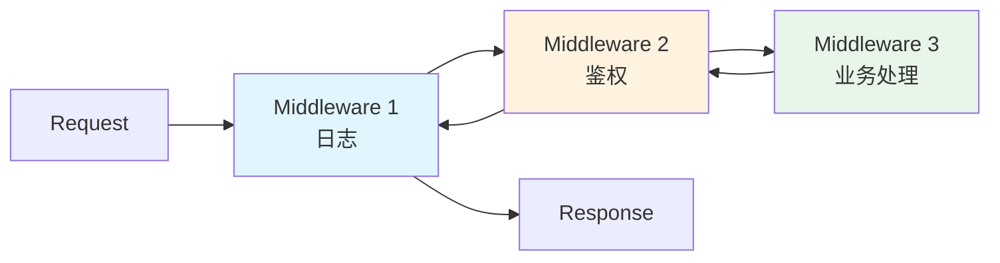

# 中间件 / 管道模式（Middleware / Pipeline）

> 📍 **导航**：前置 [event-sourcing.md](./event-sourcing.md) ｜ 后续：无（终章） ｜ 优先级 **P0**

## 意图

将请求处理分解为一系列可组合的步骤（中间件），每个步骤可执行逻辑并决定是否传递给下一步，支持前置/后置处理（洋葱模型），实现横切关注点（日志、鉴权、错误处理）与业务逻辑的解耦。

## 结构（UML 类图）



洋葱模型执行顺序：
```
→ MW1 前置 → MW2 前置 → MW3（核心） → MW2 后置 → MW1 后置
```

核心约束：
- 每个中间件接收 `context` + `next` 函数
- 调用 `next()` 将控制权传递给下一层
- `next()` 返回后可执行后置逻辑（`await next()` 之后的代码）
- 不调用 `next()` 则短路，后续中间件不执行

## 适用场景

**该用：**
- HTTP 请求处理需要横切逻辑（日志、CORS、鉴权、压缩、限流）
- 构建工具需要多步转换管道（Webpack loader、Babel plugin）
- 需要动态组合处理步骤，顺序可调、可选启用
- 插件系统：允许第三方扩展处理流程

**不该用：**
- 处理步骤固定且简单（2-3 步），直接函数调用更清晰
- 步骤间有复杂数据依赖，管道模型反而增加理解成本
- 性能极敏感场景，多层 `await next()` 有调用栈开销

> 🔍 **对应 Code Smell**：横切关注点（日志/鉴权/错误处理）散落在业务代码各处

## 代价与权衡

| 维度 | 说明 |
|------|------|
| 复杂度 | 中。compose 函数本身简单，但调试多层嵌套中间件需要经验 |
| 可组合性 | **好**。中间件独立开发、测试、排序，支持条件启用 |
| 可读性 | 执行顺序由注册顺序决定，洋葱模型的心智模型需要适应 |
| 调试 | 错误堆栈可能很深，需要良好的错误传播机制 |
| 替代方案 | 直接函数组合（`pipe(f, g, h)`）、装饰器模式、AOP 切面、Chain of Responsibility |

> **TS 特化**：TypeScript 的 `async/await` 天然适配洋葱模型——`await next()` 之前的代码是前置，之后是后置，无需手动管理回调。

## TypeScript 实现

### Koa 洋葱模型（compose 核心实现）

```typescript
// 上下文对象
interface Context {
  method: string;
  path: string;
  headers: Record<string, string>;
  body: unknown;
  status: number;
  responseBody: string;
  // 中间件间共享数据
  state: Record<string, unknown>;
}

type Next = () => Promise<void>;
type Middleware = (ctx: Context, next: Next) => Promise<void>;

// 核心：compose 函数（Koa 源码简化版）
function compose(middlewares: Middleware[]): Middleware {
  return function composed(ctx: Context, next: Next): Promise<void> {
    let index = -1;

    function dispatch(i: number): Promise<void> {
      if (i <= index) {
        return Promise.reject(new Error('next() called multiple times'));
      }
      index = i;

      const fn = i < middlewares.length ? middlewares[i] : next;
      if (!fn) return Promise.resolve();

      return fn(ctx, () => dispatch(i + 1));
    }

    return dispatch(0);
  };
}

// ===== 中间件定义 =====

// 日志中间件
const logger: Middleware = async (ctx, next) => {
  const start = Date.now();
  console.log(`→ ${ctx.method} ${ctx.path}`);
  await next();
  const ms = Date.now() - start;
  console.log(`← ${ctx.method} ${ctx.path} ${ctx.status} (${ms}ms)`);
};

// 鉴权中间件
const auth: Middleware = async (ctx, next) => {
  const token = ctx.headers['authorization'];
  if (!token) {
    ctx.status = 401;
    ctx.responseBody = 'Unauthorized';
    return; // 短路：不调用 next()
  }
  ctx.state['userId'] = 'user-123';
  await next();
};

// 错误处理中间件（最外层）
const errorHandler: Middleware = async (ctx, next) => {
  try {
    await next();
  } catch (err) {
    ctx.status = 500;
    ctx.responseBody = `Internal Error: ${(err as Error).message}`;
  }
};

// 业务处理（最内层）
const handler: Middleware = async (ctx, next) => {
  if (ctx.path === '/hello') {
    ctx.status = 200;
    ctx.responseBody = `Hello, ${ctx.state['userId'] ?? 'anonymous'}!`;
  } else {
    ctx.status = 404;
    ctx.responseBody = 'Not Found';
  }
  await next();
};

// ===== 组装并执行 =====

const app = compose([errorHandler, logger, auth, handler]);

async function handleRequest(method: string, path: string, headers: Record<string, string> = {}): Promise<void> {
  const ctx: Context = {
    method,
    path,
    headers,
    body: null,
    status: 200,
    responseBody: '',
    state: {},
  };

  await app(ctx, async () => {});
  console.log(`Response: ${ctx.status} - ${ctx.responseBody}`);
}

// 测试（包裹在 async main 中，避免顶层 await 在 CJS 报错）
async function main(): Promise<void> {
  await handleRequest('GET', '/hello', { authorization: 'Bearer xxx' });
  // → GET /hello
  // ← GET /hello 200 (Xms)
  // Response: 200 - Hello, user-123!

  await handleRequest('GET', '/hello');
  // Response: 401 - Unauthorized

  await handleRequest('GET', '/unknown', { authorization: 'Bearer xxx' });
  // Response: 404 - Not Found
}

main();
```

### Webpack Loader 管道（单向转换管道）

```typescript
// Webpack loader 是单向管道：每个 loader 接收上一个的输出，产出下一个的输入
type Loader = (source: string) => string;

// 模拟 webpack 的 loader 执行（从右到左 / 从下到上）
function runLoaders(source: string, loaders: Loader[]): string {
  // webpack 中 loaders 数组从右到左执行
  return loaders.reduceRight((input, loader) => loader(input), source);
}

// 定义 loaders
const stripComments: Loader = (source) => {
  return source.replace(/\/\/.*$/gm, '').replace(/\/\*[\s\S]*?\*\//g, '');
};

const addBanner: Loader = (source) => {
  return `/* Generated at ${new Date().toISOString()} */\n${source}`;
};

const minifyWhitespace: Loader = (source) => {
  return source.replace(/\n{2,}/g, '\n').trim();
};

// 管道执行
const rawSource = `
// This is a comment
const x = 1;

/* block comment */
const y = 2;
`;

const output = runLoaders(rawSource, [stripComments, minifyWhitespace, addBanner]);
console.log(output);
// /* Generated at ... */
// const x = 1;
// const y = 2;
```

### 类型安全的管道组合（函数式）

```typescript
// 类型安全的 pipe：每个函数的输出类型匹配下一个的输入
function pipe<A, B>(fn1: (a: A) => B): (a: A) => B;
function pipe<A, B, C>(fn1: (a: A) => B, fn2: (b: B) => C): (a: A) => C;
function pipe<A, B, C, D>(fn1: (a: A) => B, fn2: (b: B) => C, fn3: (c: C) => D): (a: A) => D;
function pipe(...fns: ((arg: unknown) => unknown)[]): (arg: unknown) => unknown {
  return (arg: unknown) => fns.reduce((acc, fn) => fn(acc), arg);
}

// 使用：编译期检查类型链
const processUser = pipe(
  (name: string) => ({ name, createdAt: Date.now() }),
  (user) => ({ ...user, id: crypto.randomUUID() }),
  (user) => JSON.stringify(user)
);

const result = processUser('Alice');
console.log(typeof result); // "string"

// pipe((n: number) => n.toString(), (s: number) => s) // ❌ 编译错误：string 不能赋给 number
```

## 真实世界实例

| 框架/库 | 实现方式 |
|---------|---------|
| **Koa** | `app.use(middleware)` 注册，`koa-compose` 实现洋葱模型，`await next()` 分隔前置/后置 |
| **Express** | `app.use((req, res, next) => {})` 线性管道，调用 `next()` 传递，无后置阶段（非洋葱） |
| **Webpack** | `module.rules.use: ['style-loader', 'css-loader', 'sass-loader']` 从右到左的转换管道 |
| **NestJS** | `MiddlewareConsumer.apply(LoggerMiddleware).forRoutes('*')` + 拦截器（Interceptor）实现洋葱模型 |
| **Redux** | `applyMiddleware(thunk, logger, crashReporter)` 组合中间件增强 `dispatch`，每个中间件包裹下一层 |

## 易混淆对比

| 对比 | 区别 |
|------|------|
| Middleware vs Chain of Responsibility | Middleware 是**双向/洋葱**模型（前置 + 后置），通过 `next()` 显式传递；CoR 是**单向**传递，处理者决定是否终止，无后置阶段 |
| Middleware vs Decorator | Decorator 在**对象级**包装增强（静态组合）；Middleware 在**请求/数据流级**组合处理步骤（运行时管道） |
| Middleware vs Pipeline（函数式 pipe） | Pipeline 是单向数据转换（`f(g(h(x)))`），无上下文共享；Middleware 共享 Context 对象，支持短路和后置逻辑 |

## 面试速答

> **问：Koa 的洋葱模型是怎么实现的？compose 函数的核心思路？**
>
> 答：核心是 `koa-compose` 把中间件数组组合成一个函数：内部用递归的 `dispatch(i)` 执行第 i 个中间件，并把 `() => dispatch(i + 1)` 作为 `next` 传进去。中间件 `await next()` 之前的代码是前置、之后是后置，于是形成"先进后出"的洋葱结构；再用一个 `index` 变量防止 `next()` 被重复调用。

> **问：Webpack loader 为什么从右到左执行？**
>
> 答：Webpack 用 `reduceRight` 串联 loader，让数组里最右边的 loader 先处理原始源码，输出再喂给左边的 loader。这样书写顺序符合"从源到产物"的直觉：如 `['style-loader', 'css-loader', 'sass-loader']` 会先由 sass 编译成 css，再由 css 转成 JS 模块，最后由 style 注入 DOM，与函数组合 `f(g(h(x)))` 的求值顺序一致。

> **问：中间件模式和装饰器模式有什么区别？**
>
> 答：装饰器在对象级别静态地包装增强某个对象的接口（编译期/构造期组合，如给类方法加日志）；中间件在请求/数据流级别运行时动态组合处理步骤，共享一个 Context 并支持短路与后置逻辑。可以说中间件是"面向流程的装饰器"，装饰器是"面向对象的包装"。

## 关联

- **常配合**：Decorator（中间件本质是请求处理的装饰器）、Chain of Responsibility（线性中间件是 CoR 的特化）、Strategy（每个中间件可视为可插拔的处理策略）
- **架构位置**：在 [software-engineering/](../../software-engineering/software-engineering-learning-outline.md) 第 9 章中，中间件管道是 API 网关和 Web 框架的核心架构模式，横切关注点（鉴权、限流、日志）通过管道统一处理
