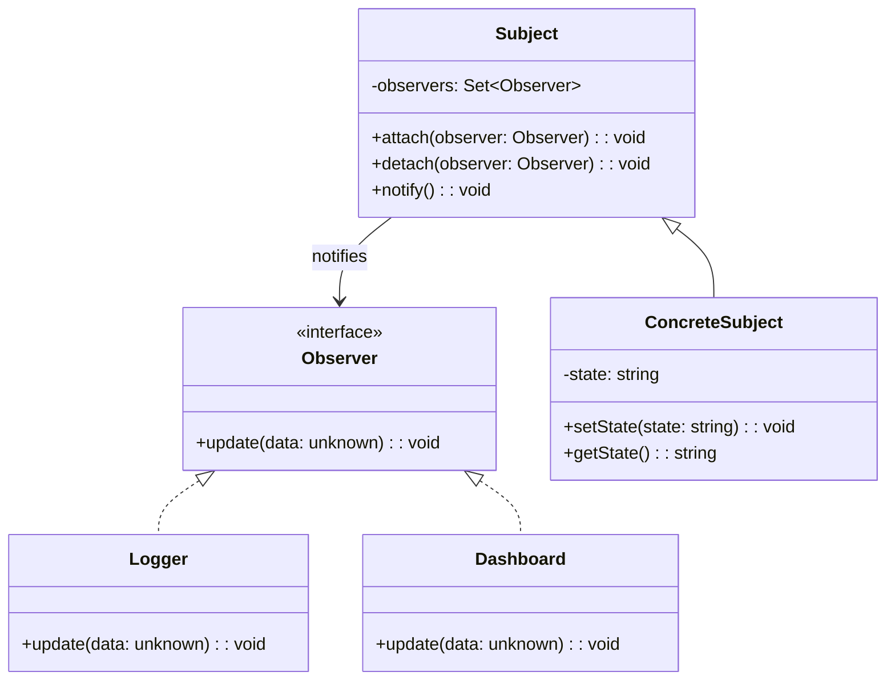

# 观察者模式（Observer）

## 意图

定义对象间的一对多依赖关系，当一个对象状态改变时，所有依赖它的对象都自动收到通知并更新。

## 结构（UML 类图）



核心机制：
- Subject 维护观察者列表，状态变更时遍历通知
- Observer 只需实现 `update` 接口
- 订阅/取消订阅在运行时动态进行

## 适用场景

**该用：**
- 一个状态变更需要触发多个不相关的副作用（日志、UI 更新、缓存失效）
- 发布者和订阅者之间需要松耦合（插件系统）
- 事件驱动的 UI 交互（DOM 事件、表单联动）

**不该用：**
- 只有一对一的通知——直接方法调用
- 需要保证通知顺序或事务性——Observer 不保证顺序
- 观察者数量极少且固定——硬编码调用更简单

## 代价与权衡

| 维度 | 说明 |
|------|------|
| 复杂度 | 低。核心是订阅列表 + 遍历通知 |
| 内存泄漏风险 | **高**。忘记 `detach` 会导致观察者无法被 GC |
| 调试难度 | 中。通知是隐式的，调用栈中看不到订阅关系 |
| 性能 | 观察者多时通知开销大；可用批量/节流优化 |
| 替代方案 | 回调函数、EventEmitter、RxJS Observable、响应式框架（Vue/Signal） |

> **TS/JS 特化**：JS 生态中 Observer 无处不在——DOM `addEventListener`、Node.js `EventEmitter`、RxJS `Observable`。TS 的类型系统可以让事件名和 payload 完全类型安全，避免"字符串事件名拼错"的经典问题。

## TypeScript 实现

### 经典 Push 模式

```typescript
interface Observer<T> {
  update(data: T): void;
}

class Subject<T> {
  private observers = new Set<Observer<T>>();

  attach(observer: Observer<T>): void {
    this.observers.add(observer);
  }

  detach(observer: Observer<T>): void {
    this.observers.delete(observer);
  }

  protected notify(data: T): void {
    for (const observer of this.observers) {
      observer.update(data);
    }
  }
}

// 具体 Subject：温度传感器
class TemperatureSensor extends Subject<{ celsius: number; timestamp: number }> {
  private current = 0;

  simulate(): void {
    this.current = Math.round((Math.random() * 40 - 10) * 10) / 10;
    this.notify({ celsius: this.current, timestamp: Date.now() });
  }
}

// 具体 Observer
class ConsoleLogger implements Observer<{ celsius: number; timestamp: number }> {
  update(data: { celsius: number; timestamp: number }): void {
    console.log(`[${new Date(data.timestamp).toISOString()}] Temp: ${data.celsius}°C`);
  }
}

class AlertSystem implements Observer<{ celsius: number; timestamp: number }> {
  update(data: { celsius: number }): void {
    if (data.celsius > 35) {
      console.log('⚠️ HIGH TEMPERATURE ALERT!');
    }
  }
}

// 使用
const sensor = new TemperatureSensor();
const logger = new ConsoleLogger();
const alert = new AlertSystem();

sensor.attach(logger);
sensor.attach(alert);
sensor.simulate();

sensor.detach(alert);
sensor.simulate(); // alert 不再收到通知
```

### 类型安全的 EventEmitter（Pull 模式可选）

```typescript
type EventMap = {
  login: { userId: string; ip: string };
  logout: { userId: string };
  error: { code: number; message: string };
};

type Listener<T> = (payload: T) => void;

class TypedEventEmitter<Events extends Record<string, unknown>> {
  private listeners = new Map<keyof Events, Set<Listener<never>>>();

  on<K extends keyof Events>(event: K, listener: Listener<Events[K]>): () => void {
    if (!this.listeners.has(event)) {
      this.listeners.set(event, new Set());
    }
    this.listeners.get(event)!.add(listener as Listener<never>);

    // 返回取消订阅函数（避免忘记 detach）
    return () => this.off(event, listener);
  }

  off<K extends keyof Events>(event: K, listener: Listener<Events[K]>): void {
    this.listeners.get(event)?.delete(listener as Listener<never>);
  }

  emit<K extends keyof Events>(event: K, payload: Events[K]): void {
    const set = this.listeners.get(event);
    if (set) {
      for (const listener of set) {
        (listener as Listener<Events[K]>)(payload);
      }
    }
  }

  once<K extends keyof Events>(event: K, listener: Listener<Events[K]>): void {
    const wrapper: Listener<Events[K]> = (payload) => {
      this.off(event, wrapper);
      listener(payload);
    };
    this.on(event, wrapper);
  }
}

// 使用
const emitter = new TypedEventEmitter<EventMap>();

const unsubscribe = emitter.on('login', ({ userId, ip }) => {
  console.log(`User ${userId} logged in from ${ip}`);
});

emitter.on('error', ({ code, message }) => {
  console.error(`Error ${code}: ${message}`);
});

emitter.emit('login', { userId: 'u1', ip: '192.168.1.1' });
emitter.emit('error', { code: 404, message: 'Not Found' });

unsubscribe(); // 取消订阅
emitter.emit('login', { userId: 'u2', ip: '10.0.0.1' }); // 不再触发
```

### RxJS 风格（响应式流）

```typescript
// 简化的 Observable 实现
type Subscriber<T> = {
  next: (value: T) => void;
  error?: (err: Error) => void;
  complete?: () => void;
};

class SimpleObservable<T> {
  constructor(private readonly subscribeFn: (subscriber: Subscriber<T>) => () => void) {}

  subscribe(subscriber: Subscriber<T>): { unsubscribe: () => void } {
    const teardown = this.subscribeFn(subscriber);
    return { unsubscribe: teardown };
  }

  // 操作符：map
  map<U>(transform: (value: T) => U): SimpleObservable<U> {
    return new SimpleObservable<U>((subscriber) => {
      const sub = this.subscribe({
        next: (value) => subscriber.next(transform(value)),
        error: subscriber.error,
        complete: subscriber.complete,
      });
      return () => sub.unsubscribe();
    });
  }

  // 操作符：filter
  filter(predicate: (value: T) => boolean): SimpleObservable<T> {
    return new SimpleObservable<T>((subscriber) => {
      const sub = this.subscribe({
        next: (value) => {
          if (predicate(value)) subscriber.next(value);
        },
        error: subscriber.error,
        complete: subscriber.complete,
      });
      return () => sub.unsubscribe();
    });
  }
}

// 使用：模拟点击事件流
const clicks$ = new SimpleObservable<{ x: number; y: number }>((subscriber) => {
  // 模拟事件源
  const interval = setInterval(() => {
    subscriber.next({ x: Math.random() * 100, y: Math.random() * 100 });
  }, 1000);

  return () => clearInterval(interval); // teardown
});

const subscription = clicks$
  .filter(({ x }) => x > 50)
  .map(({ x, y }) => `Click at (${x.toFixed(1)}, ${y.toFixed(1)})`)
  .subscribe({
    next: (msg) => console.log(msg),
  });

// 5 秒后取消订阅
setTimeout(() => subscription.unsubscribe(), 5000);
```

## 真实世界实例

| 框架/库 | 实现方式 |
|---------|---------|
| **DOM `addEventListener`** | 浏览器原生事件系统，`target` 是 Subject，listener 是 Observer |
| **Node.js `EventEmitter`** | `on/emit/off` API，所有 Stream 继承自 EventEmitter |
| **RxJS** | `Observable/Observer/Subject`，带操作符的响应式 Observer |
| **Vue 3 Reactivity** | `reactive()` 的 Proxy 拦截 set 操作，触发 `effect` 重新执行 |
| **React `useSyncExternalStore`** | 外部 store 变更时通知 React 重新渲染 |

## 易混淆对比

| 对比 | 区别 |
|------|------|
| Observer vs Pub/Sub | Observer 中 Subject 直接持有 Observer 引用；Pub/Sub 通过 Broker（消息队列）解耦，发布者不知道订阅者 |
| Observer vs Mediator | Observer 是广播（一对多，无路由）；Mediator 是集中协调（有路由逻辑，决定谁收到什么） |
| Observer vs Chain of Responsibility | Observer 所有订阅者都收到通知；CoR 沿链传递直到有人处理 |

## 关联

- **常配合**：Mediator（Mediator 内部用 Observer 通知同事）、Singleton（EventEmitter 通常是全局单例）、Command（事件触发后封装为 Command 执行）
- **架构位置**：在 [software-engineering/](../../software-engineering/software-engineering-learning-outline.md) 第 10 章中，事件驱动架构（EDA）是 Observer 在分布式系统中的扩展
