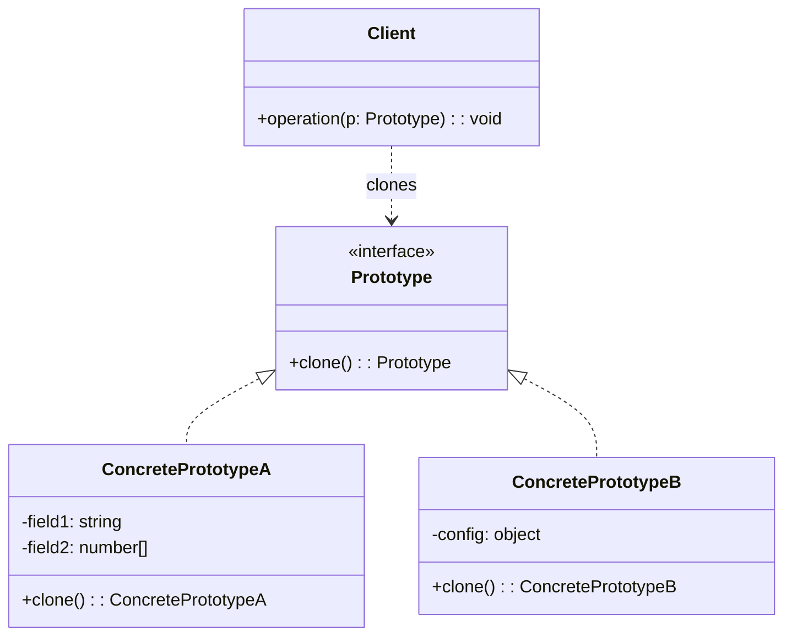

# 原型模式（Prototype）

> 📍 **导航**：前置 [builder.md](./builder.md) ｜ 后续 [adapter.md](./adapter.md)（进入结构型） ｜ 优先级 **P2**

## 意图

用原型实例指定创建对象的种类，并通过复制（克隆）这些原型创建新的对象。

## 结构（UML 类图）



## 适用场景

**该用：**
- 对象初始化成本高（数据库查询、网络请求、复杂计算），需要基于已有对象快速创建变体
- 对象状态差异小，大部分字段相同——clone 比重新构造高效
- 需要避免与创建类的层次结构平行（不想为每种变体建子类）
- 运行时动态决定创建哪种对象（原型注册表）

**不该用：**
- 对象包含不可序列化的资源（Socket、文件句柄）——深拷贝语义不明确
- 对象简单，`new` 的成本可忽略
- 循环引用复杂——深拷贝实现困难

> 🔍 **对应 Code Smell**：对象初始化成本高、需要基于已有对象快速创建变体（参考大纲附录速查表）

## 代价与权衡

| 维度 | 说明 |
|------|------|
| 复杂度 | 低-中。难点在深拷贝的正确性（嵌套对象、循环引用） |
| 性能 | 对重量级对象：clone 比 new + 初始化快；对轻量对象：无优势 |
| 正确性 | **风险**。浅拷贝导致共享引用 bug；深拷贝可能遗漏新增字段 |
| 替代方案 | `structuredClone()`（浏览器/Node 17+）、展开运算符（浅拷贝）、`Object.create`（原型链继承） |

> **TS/JS 特化**：JavaScript 的 `structuredClone` 已覆盖大部分深拷贝需求。Prototype 模式在 JS 中的价值更多体现在**原型注册表**（按 key 查找并克隆）而非手动实现 clone 方法。

## TypeScript 实现

### 基础实现

```typescript
interface Cloneable<T> {
  clone(): T;
}

class GameUnit implements Cloneable<GameUnit> {
  constructor(
    public name: string,
    public hp: number,
    public position: { x: number; y: number },
    public inventory: string[],
  ) {}

  clone(): GameUnit {
    return new GameUnit(
      this.name,
      this.hp,
      { ...this.position },       // 深拷贝嵌套对象
      [...this.inventory],        // 深拷贝数组
    );
  }
}

// 使用：基于模板快速创建变体
const template = new GameUnit('Knight', 100, { x: 0, y: 0 }, ['sword', 'shield']);
const unit1 = template.clone();
unit1.position.x = 5;
unit1.inventory.push('potion');

console.log(template.position.x);  // 0（不受影响）
console.log(template.inventory);   // ['sword', 'shield']（不受影响）
```

### 原型注册表

```typescript
class PrototypeRegistry {
  private prototypes = new Map<string, Cloneable<unknown>>();

  register(key: string, prototype: Cloneable<unknown>): void {
    this.prototypes.set(key, prototype);
  }

  create<T>(key: string): T {
    const proto = this.prototypes.get(key);
    if (!proto) throw new Error(`Unknown prototype: ${key}`);
    return proto.clone() as T;
  }
}

// 注册
const registry = new PrototypeRegistry();
registry.register('knight', new GameUnit('Knight', 100, { x: 0, y: 0 }, ['sword']));
registry.register('mage', new GameUnit('Mage', 60, { x: 0, y: 0 }, ['staff']));

// 按 key 创建
const knight = registry.create<GameUnit>('knight');
```

### 利用 `structuredClone`（现代 JS）

```typescript
// 不需要手动实现 clone 方法
interface Config {
  host: string;
  port: number;
  tls: { cert: string; key: string };
  plugins: string[];
}

const baseConfig: Config = {
  host: 'localhost',
  port: 3000,
  tls: { cert: '/path/cert.pem', key: '/path/key.pem' },
  plugins: ['auth', 'logging'],
};

// 深拷贝，自动处理嵌套
const prodConfig = structuredClone(baseConfig);
prodConfig.host = '0.0.0.0';
prodConfig.plugins.push('metrics');

console.log(baseConfig.plugins); // ['auth', 'logging']（不受影响）
```

## 真实世界实例

| 框架/库 | 实现方式 |
|---------|---------|
| **`Object.create(proto)`** | 以指定对象为原型创建新对象（原型链继承） |
| **`structuredClone(obj)`** | 浏览器/Node 内置深拷贝，处理循环引用 |
| **React `cloneElement`** | 基于已有 element 克隆并覆盖 props |
| **Lodash `_.cloneDeep`** | 递归深拷贝，处理 Date/RegExp/Map/Set 等 |
| **Git** | `git clone` 本质是 Prototype 模式——基于远程仓库复制一份完整副本 |

## 易混淆对比

| 对比 | 区别 |
|------|------|
| Prototype vs Factory Method | Prototype 通过 clone 创建（不需要知道类）；Factory Method 通过 new 创建（需要子类） |
| Prototype vs Abstract Factory | Prototype 可动态注册/替换原型；Abstract Factory 的产品族在编译期确定 |
| 浅拷贝 vs 深拷贝 | 浅拷贝共享嵌套引用（`{...obj}`）；深拷贝递归复制所有层级（`structuredClone`） |

## 面试速答

> **问：浅拷贝和深拷贝的区别？JS 中如何实现深拷贝？**
>
> 答：浅拷贝（`{...obj}`、`Object.assign`）只复制第一层，嵌套对象仍共享引用——修改副本的嵌套字段会影响原对象。深拷贝递归复制所有层级。JS 中实现深拷贝：首选 `structuredClone(obj)`（内置、处理循环引用）；或用 Lodash `_.cloneDeep`；手写递归需注意循环引用（用 WeakMap 记录已拷贝对象）。

> **问：structuredClone 有什么限制？哪些东西不能克隆？**
>
> 答：structuredClone 不能克隆：函数、DOM 节点、Symbol、原型链（克隆后原型变为 Object.prototype）、Error 对象的 stack 属性。它也不能保留 class 实例的方法——只拷贝数据属性。对于包含方法的对象，需要自定义 clone 方法或用 Lodash cloneDeep（它保留原型）。

> **问：Prototype 模式和 Factory Method 怎么选？**
>
> 答：看创建方式：如果新对象是基于已有对象"改几个字段"得到的变体，用 Prototype（clone + 覆盖）；如果需要从零构建、创建逻辑涉及条件判断或子类扩展，用 Factory Method。Prototype 的优势是不需要知道具体类（只依赖 clone 接口），适合运行时动态决定创建哪种对象（原型注册表）。

## 关联

- **常配合**：Abstract Factory（用 Prototype 实现工厂的 clone 创建）、Singleton（原型注册表本身是单例）、Command（clone 用于保存历史状态）
- **架构位置**：在 [software-engineering/](../../software-engineering/software-engineering-learning-outline.md) 第 8 章中，Prototype 常用于配置模板系统——基础配置 clone 后按环境覆盖
