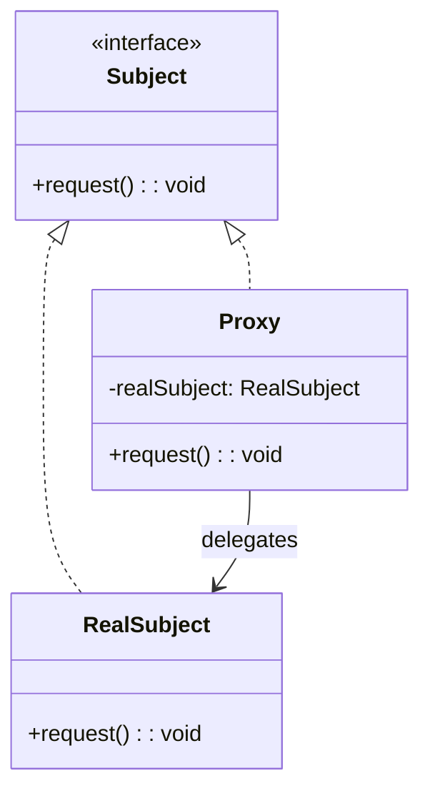

# 代理模式（Proxy）

## 意图

为另一个对象提供一个替身或占位符，以控制对它的访问。核心解决：在不修改目标对象的前提下，控制、增强或延迟对对象的访问。

## 结构（UML 类图）



常见变体：
- **虚拟代理（Virtual）**：延迟创建昂贵对象
- **保护代理（Protection）**：控制访问权限
- **缓存代理（Caching）**：缓存请求结果
- **远程代理（Remote）**：代表远程对象（RPC stub）

## 适用场景

**该用：**
- 需要控制对象访问（权限校验、访问计数）
- 对象创建成本高，需要延迟初始化
- 需要缓存昂贵操作的结果
- 需要拦截属性读写实现响应式（Vue 3）

**不该用：**
- 只是简单包装添加行为——那是 Decorator
- 只是转换接口——那是 Adapter
- 目标对象本身就能完成需求，无需额外控制层

## 代价与权衡

| 维度 | 说明 |
|------|------|
| 复杂度 | 低（JS `Proxy`）到中（需处理所有 trap 的语义正确性） |
| 性能 | `Proxy` 的 trap 调用比直接属性访问慢 ~2-5x，热路径需注意 |
| 透明性 | 对客户端完全透明（与 Decorator 的关键区别） |
| 替代方案 | `Object.defineProperty`（ES5 响应式，Vue 2 方案）；getter/setter；高阶函数包装 |

> **TS/JS 特化**：JavaScript 原生提供 `Proxy` + `Reflect` API，是语言级别的代理模式实现。无需手动编写包装类，一个 `new Proxy(target, handler)` 即可拦截 13 种基本操作（get / set / has / deleteProperty / apply / construct 等）。这是 GoF 模式中极少数被语言直接内置的案例。

## TypeScript 实现

### 基于 JS Proxy 的保护代理 + 日志代理

```typescript
interface User {
  name: string;
  age: number;
  role: 'admin' | 'user';
}

function createProtectedUser(user: User, currentUserRole: string): User {
  return new Proxy(user, {
    get(target, prop, receiver) {
      console.log(`[READ] ${String(prop)}`);
      return Reflect.get(target, prop, receiver);
    },

    set(target, prop, value, receiver) {
      if (currentUserRole !== 'admin') {
        throw new Error(`Permission denied: cannot set "${String(prop)}" as ${currentUserRole}`);
      }
      console.log(`[WRITE] ${String(prop)} = ${JSON.stringify(value)}`);
      return Reflect.set(target, prop, value, receiver);
    },

    deleteProperty(target, prop) {
      if (currentUserRole !== 'admin') {
        throw new Error(`Permission denied: cannot delete "${String(prop)}"`);
      }
      return Reflect.deleteProperty(target, prop);
    },
  });
}

const user: User = { name: 'Alice', age: 30, role: 'user' };

const adminView = createProtectedUser(user, 'admin');
adminView.age = 31; // ✅ [WRITE] age = 31

const userView = createProtectedUser(user, 'user');
console.log(userView.name); // ✅ [READ] name → "Alice"
// userView.age = 25; // ❌ Permission denied
```

### 虚拟代理（延迟初始化）

```typescript
interface Image {
  display(): void;
}

class HighResImage implements Image {
  private data: string;

  constructor(private readonly url: string) {
    // 模拟昂贵的加载操作
    console.log(`[Heavy] Loading image from ${url}...`);
    this.data = `binary-data-from-${url}`;
  }

  display(): void {
    console.log(`Displaying image (${this.data.length} bytes)`);
  }
}

// 虚拟代理：只在真正需要时才创建 HighResImage
class ImageProxy implements Image {
  private realImage: HighResImage | null = null;

  constructor(private readonly url: string) {}

  display(): void {
    if (!this.realImage) {
      console.log('[Proxy] First access, creating real image...');
      this.realImage = new HighResImage(this.url);
    }
    this.realImage.display();
  }
}

// 创建 100 个代理，但只有被 display 的才会真正加载
const images: Image[] = Array.from({ length: 100 }, (_, i) => new ImageProxy(`/img/${i}.png`));
images[42].display(); // 只有这一张被加载
```

### 缓存代理

```typescript
function createCachingProxy<T extends (...args: unknown[]) => unknown>(fn: T): T {
  const cache = new Map<string, unknown>();

  return new Proxy(fn, {
    apply(target, thisArg, args) {
      const key = JSON.stringify(args);
      if (cache.has(key)) {
        console.log(`[Cache HIT] ${key}`);
        return cache.get(key);
      }
      console.log(`[Cache MISS] ${key}`);
      const result = Reflect.apply(target, thisArg, args);
      cache.set(key, result);
      return result;
    },
  }) as T;
}

// 昂贵的计算函数（通过闭包引用代理自身，确保递归也走缓存）
function createFibonacci(): (n: number) => number {
  let fib: (n: number) => number = (n) => {
    if (n <= 1) return n;
    return fib(n - 1) + fib(n - 2);
  };
  fib = createCachingProxy(fib);
  return fib;
}

const cachedFib = createFibonacci();
console.log(cachedFib(40)); // 首次计算，子问题也命中缓存 → O(n)
console.log(cachedFib(40)); // [Cache HIT] → 直接返回
```

### Vue 3 响应式原理（Proxy 的工业级应用）

```typescript
// 简化版 Vue 3 reactive 实现
type EffectFn = () => void;

let activeEffect: EffectFn | null = null;
const targetMap = new WeakMap<object, Map<string | symbol, Set<EffectFn>>>();

function track(target: object, key: string | symbol): void {
  if (!activeEffect) return;
  let depsMap = targetMap.get(target);
  if (!depsMap) {
    depsMap = new Map();
    targetMap.set(target, depsMap);
  }
  let deps = depsMap.get(key);
  if (!deps) {
    deps = new Set();
    depsMap.set(key, deps);
  }
  deps.add(activeEffect);
}

function trigger(target: object, key: string | symbol): void {
  const deps = targetMap.get(target)?.get(key);
  if (deps) {
    deps.forEach((effect) => effect());
  }
}

function reactive<T extends object>(target: T): T {
  return new Proxy(target, {
    get(obj, key, receiver) {
      track(obj, key); // 收集依赖
      const result = Reflect.get(obj, key, receiver);
      // 深层响应式
      if (result && typeof result === 'object') {
        return reactive(result as object) as T[keyof T] & object;
      }
      return result;
    },
    set(obj, key, value, receiver) {
      const oldValue = Reflect.get(obj, key, receiver);
      const result = Reflect.set(obj, key, value, receiver);
      if (oldValue !== value) {
        trigger(obj, key); // 触发更新
      }
      return result;
    },
  });
}

// 使用
function effect(fn: EffectFn): void {
  activeEffect = fn;
  fn();
  activeEffect = null;
}

const state = reactive({ count: 0, name: 'Vue' });

effect(() => {
  console.log(`count is: ${state.count}`);
});

state.count = 1; // 自动输出: count is: 1
state.count = 2; // 自动输出: count is: 2
```

## 真实世界实例

| 框架/库 | 实现方式 |
|---------|---------|
| **Vue 3 `reactive()`** | 用 `Proxy` 拦截 get/set 实现依赖收集和响应式更新 |
| **MobX `observable`** | 类似 Vue 3，Proxy 拦截属性访问实现自动追踪 |
| **ES Module `import` 绑定** | 模块导出是 live binding，本质是对模块命名空间的只读代理 |
| **Service Worker** | 拦截网络请求，充当远程代理（缓存/离线策略） |
| **gRPC / tRPC client** | 客户端 stub 是远程代理，本地调用透明转发为网络请求 |

## 易混淆对比

| 对比 | 区别 |
|------|------|
| Proxy vs Decorator | Proxy 控制**访问**（客户端不知代理存在）；Decorator 增强**行为**（客户端主动组合） |
| Proxy vs Adapter | Proxy 保持接口完全一致；Adapter 改变接口以适配不兼容 |
| Proxy vs Facade | Proxy 是对**单个对象**的访问控制；Facade 是对**子系统**的简化入口 |

## 关联

- **常配合**：Decorator（二者结构相似，可组合使用）、Factory（虚拟代理内部用工厂延迟创建）
- **架构位置**：在 [software-engineering/](../../software-engineering/software-engineering-learning-outline.md) 第 8 章中，Proxy 是响应式框架（Vue 3 / MobX）和 RPC 框架的核心基础设施模式
