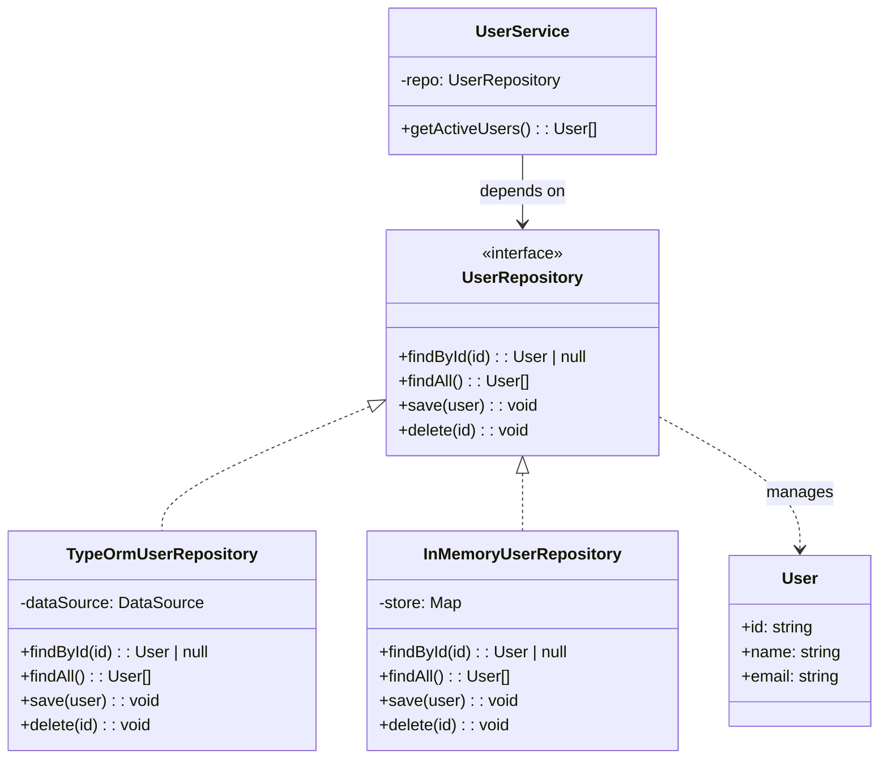

# 仓储模式（Repository）

> 📍 **导航**：前置 [dependency-injection.md](./dependency-injection.md) ｜ 后续 [cqrs.md](./cqrs.md) ｜ 优先级 **P2**

## 意图

为领域层提供面向集合的数据访问抽象，使业务逻辑不依赖具体存储技术（数据库、API、文件系统），实现领域模型与持久化的解耦。

## 结构（UML 类图）



核心约束：
- 接口用**领域语言**描述（`findByEmail`），而非存储语言（`SELECT * WHERE`）
- 返回领域对象，不暴露 ORM Entity 或 Row 类型
- 领域层只依赖接口，具体实现放在基础设施层

## 适用场景

**该用：**
- 领域逻辑复杂，需要与存储细节隔离（DDD 项目）
- 需要支持多种存储后端（开发用内存、测试用 SQLite、生产用 PostgreSQL）
- 单元测试需要 mock 数据层，不想依赖真实数据库
- 多个聚合根需要统一的数据访问规范

**不该用：**
- 简单 CRUD 应用，ORM 的 Active Record / Data Mapper 已足够
- 存储逻辑与业务逻辑高度耦合（如复杂报表 SQL）
- 团队规模小、项目生命周期短，抽象层带来的间接性不值得

> 🔍 **对应 Code Smell**：业务代码散落 SQL/ORM 调用、领域层依赖具体存储技术

## 代价与权衡

| 维度 | 说明 |
|------|------|
| 复杂度 | 中。每个聚合根需要接口 + 实现，增加文件数量 |
| 可测试性 | **好**。领域层测试注入 InMemory 实现，秒级运行 |
| 灵活性 | 切换存储只需替换实现类，领域代码零改动 |
| 性能 | 抽象层可能掩盖 N+1 查询等问题，需注意接口粒度 |
| 替代方案 | 直接使用 ORM（TypeORM EntityManager / Prisma Client）、DAO 模式、Active Record |

> **TS 特化**：TypeScript 的 `interface` + 泛型可以定义类型安全的通用 Repository，配合 DI 容器在运行时绑定具体实现。

## TypeScript 实现

### 通用 Repository 接口 + 内存实现

```typescript
// 领域实体
interface User {
  id: string;
  name: string;
  email: string;
  active: boolean;
}

// 通用 Repository 接口（面向集合的抽象）
interface Repository<T extends { id: string }> {
  findById(id: string): T | null;
  findAll(): T[];
  save(entity: T): void;
  deleteById(id: string): boolean;
}

// 领域特定查询接口（用领域语言命名）
interface UserRepository extends Repository<User> {
  findByEmail(email: string): User | null;
  findActiveUsers(): User[];
}

// 内存实现（测试 / 开发用）
class InMemoryUserRepository implements UserRepository {
  private store = new Map<string, User>();

  findById(id: string): User | null {
    return this.store.get(id) ?? null;
  }

  findAll(): User[] {
    return [...this.store.values()];
  }

  findByEmail(email: string): User | null {
    return this.findAll().find((u) => u.email === email) ?? null;
  }

  findActiveUsers(): User[] {
    return this.findAll().filter((u) => u.active);
  }

  save(entity: User): void {
    this.store.set(entity.id, { ...entity });
  }

  deleteById(id: string): boolean {
    return this.store.delete(id);
  }
}
```

### TypeORM 风格实现（异步版本）

```typescript
// 模拟 TypeORM 的 DataSource 和 Entity 仓库
interface TypeOrmRepository<T extends { id: string }> {
  findOne(options: { where: Partial<T> }): Promise<T | null>;
  find(options?: { where?: Partial<T> }): Promise<T[]>;
  save(entity: T): Promise<T>;
  delete(id: string): Promise<void>;
}

// 异步版本的领域接口（真实项目中 Repository 通常是异步的）
interface AsyncUserRepository {
  findById(id: string): Promise<User | null>;
  findAll(): Promise<User[]>;
  findByEmail(email: string): Promise<User | null>;
  findActiveUsers(): Promise<User[]>;
  save(entity: User): Promise<void>;
  deleteById(id: string): Promise<void>;
}

// 基础设施层：适配 TypeORM 到领域接口
class TypeOrmUserRepository implements AsyncUserRepository {
  constructor(private readonly ormRepo: TypeOrmRepository<User>) {}

  async findById(id: string): Promise<User | null> {
    return this.ormRepo.findOne({ where: { id } as Partial<User> });
  }

  async findAll(): Promise<User[]> {
    return this.ormRepo.find();
  }

  async findByEmail(email: string): Promise<User | null> {
    return this.ormRepo.findOne({ where: { email } as Partial<User> });
  }

  async findActiveUsers(): Promise<User[]> {
    return this.ormRepo.find({ where: { active: true } as Partial<User> });
  }

  async save(entity: User): Promise<void> {
    await this.ormRepo.save(entity);
  }

  async deleteById(id: string): Promise<void> {
    await this.ormRepo.delete(id);
  }
}
```

### 领域服务使用 Repository

```typescript
// 环境：Node 18+（crypto.randomUUID() 为全局 API）
// 领域服务：只依赖接口，不知道底层是 TypeORM 还是内存
class UserRegistrationService {
  constructor(private readonly userRepo: UserRepository) {}

  register(name: string, email: string): User {
    const existing = this.userRepo.findByEmail(email);
    if (existing) {
      throw new Error(`Email ${email} is already registered`);
    }

    const user: User = {
      id: crypto.randomUUID(),
      name,
      email,
      active: true,
    };

    this.userRepo.save(user);
    return user;
  }

  deactivate(id: string): void {
    const user = this.userRepo.findById(id);
    if (!user) throw new Error(`User ${id} not found`);
    this.userRepo.save({ ...user, active: false });
  }
}

// 组装：注入内存实现
const repo = new InMemoryUserRepository();
const service = new UserRegistrationService(repo);

const alice = service.register('Alice', 'alice@example.com');
console.log(alice.name); // "Alice"
console.log(repo.findActiveUsers().length); // 1

service.deactivate(alice.id);
console.log(repo.findActiveUsers().length); // 0
```

## 真实世界实例

| 框架/库 | 实现方式 |
|---------|---------|
| **TypeORM** | `DataSource.getRepository(Entity)` 返回 `Repository<T>`，提供 `find`/`save`/`delete` 等集合式 API |
| **Prisma** | `prisma.user.findMany()` 按模型生成类型安全的 Data Mapper，本质是自动生成的 Repository |
| **NestJS + TypeORM** | `@InjectRepository(User)` 注入 Repository，配合 DI 实现领域层与存储解耦 |
| **DDD 社区（ddd-ts）** | 定义 `AggregateRepository<T>` 接口，基础设施层实现 `SqlAggregateRepository` |
| **MikroORM** | `EntityManager.getRepository(Entity)` 提供 Unit of Work + Repository 组合 |

## 易混淆对比

| 对比 | 区别 |
|------|------|
| Repository vs DAO | DAO 面向**数据表**（CRUD 操作映射到 SQL）；Repository 面向**领域聚合**（用领域语言描述，如 `findActiveUsers`），隐藏存储细节 |
| Repository vs Active Record | Active Record 将持久化方法混入实体（`user.save()`）；Repository 将持久化职责外置，实体保持纯净 |
| Repository vs ORM EntityManager | EntityManager 是通用入口（`em.find(User, id)`）；Repository 是领域特定接口，可组合多个 EntityManager 操作为一个领域方法 |

## 面试速答

> **问：Repository 和 DAO 有什么区别？**
>
> 答：DAO 面向数据表，方法粒度是 CRUD（`insert`/`update`/`deleteById`），会泄漏 SQL 与存储细节；Repository 面向领域聚合，用领域语言命名（`findActiveUsers`/`findByEmail`），对上层隐藏持久化技术。简单说 DAO 是"数据库访问层"，Repository 是"领域集合的抽象"，后者更贴近 DDD。

> **问：Repository 和 Active Record 模式怎么选？**
>
> 答：Active Record 把持久化方法混进实体（`user.save()`），实体同时承载数据与存储逻辑，写得快但领域模型被污染、难测试；Repository 把持久化职责外置，实体保持纯净的 POJO。领域逻辑复杂、需要解耦和单元测试时选 Repository；简单 CRUD、快速原型用 Active Record（如 Rails、Laravel Eloquent）更省事。

> **问：什么场景下你会引入 Repository 层？什么场景下不值得？**
>
> 答：当领域逻辑复杂、需要切换多种存储后端（开发内存/测试 SQLite/生产 PostgreSQL），或要给领域层做无数据库的单元测试时，Repository 价值明显，典型是 DDD 项目。反之，简单 CRUD 应用、ORM 的 Data Mapper 已足够、或团队小项目周期短，引入 Repository 只会增加样板代码和间接性，不值得。

## 关联

- **常配合**：Dependency Injection（通过 DI 注入 Repository 实现）、Unit of Work（协调多个 Repository 的事务）、Factory（在 Repository 内部重建领域对象）
- **架构位置**：在 [software-engineering/](../../software-engineering/software-engineering-learning-outline.md) 第 9 章中，Repository 是六边形架构「端口-适配器」的典型实现——接口是端口，TypeORM/Prisma 实现是适配器
