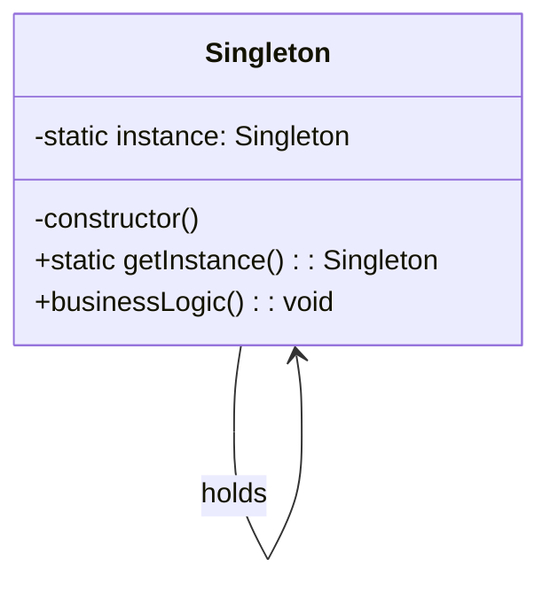

# 单例模式（Singleton）

## 意图

确保一个类只有一个实例，并提供一个全局访问点。

## 结构（UML 类图）



核心约束：
- 构造函数私有化，外部无法 `new`
- 通过静态方法延迟创建并返回唯一实例

## 适用场景

**该用：**
- 配置管理器、日志器、连接池等天然唯一的资源
- 需要跨模块共享状态（如全局 Store）
- 重量级对象（初始化成本高），需要复用

**不该用：**
- 仅仅为了"方便全局访问"——这是全局变量的伪装，优先考虑依赖注入
- 需要多实例的场景（如多租户、多数据库连接）
- 单元测试中需要 mock 时，Singleton 会增加测试耦合

## 代价与权衡

| 维度 | 说明 |
|------|------|
| 复杂度 | 低。仅增加一个静态字段 + 静态方法 |
| 可测试性 | **差**。全局状态导致测试间相互影响，需要 reset 机制或 DI 容器 |
| 并发安全 | 多线程/异步初始化时需要额外保护（TS 单线程环境天然安全） |
| 替代方案 | 模块级 `const`（ES Module 天然单例）、DI 容器管理生命周期 |

> **TS 特化**：ES Module 的顶层导出本身就是单例（模块只执行一次），很多场景不需要 class 形式的 Singleton。

## TypeScript 实现

### 经典实现

```typescript
class DatabaseConnection {
  private static instance: DatabaseConnection | null = null;
  private connected = false;

  private constructor(private readonly dsn: string) {}

  static getInstance(dsn = 'postgres://localhost:5432/app'): DatabaseConnection {
    if (!DatabaseConnection.instance) {
      DatabaseConnection.instance = new DatabaseConnection(dsn);
    }
    return DatabaseConnection.instance;
  }

  connect(): void {
    this.connected = true;
    console.log(`Connected to ${this.dsn}`);
  }

  query(sql: string): unknown[] {
    if (!this.connected) throw new Error('Not connected');
    console.log(`Executing: ${sql}`);
    return [];
  }

  /** 仅用于测试：重置实例 */
  static reset(): void {
    DatabaseConnection.instance = null;
  }
}

// 使用
const db1 = DatabaseConnection.getInstance();
const db2 = DatabaseConnection.getInstance();
console.assert(db1 === db2); // true
```

### ES Module 单例（推荐）

```typescript
// logger.ts
class Logger {
  private logs: string[] = [];

  info(msg: string): void {
    this.logs.push(`[INFO] ${msg}`);
  }

  flush(): string[] {
    const out = [...this.logs];
    this.logs = [];
    return out;
  }
}

// 模块级单例：import 多次也只执行一次
export const logger = new Logger();
```

```typescript
// app.ts
import { logger } from './logger';
logger.info('app started');
```

## 真实世界实例

| 框架/库 | 实现方式 | 源码位置 |
|---------|---------|---------|
| **Redux** `createStore` | 应用级唯一 Store，通过 `Provider` 注入 | `redux/src/createStore.ts` |
| **NestJS** DI Container | `ModuleRef` 管理 Provider 单例生命周期 | `@nestjs/core/injector` |
| **Node.js** `require` 缓存 | `Module._cache` 确保模块只加载一次 | `node/lib/internal/modules/cjs/loader.js` |
| **Pinia** `createPinia` | 在单个 app 实例内注册为单例插件（`app.use(pinia)` 幂等），通过 `useStore()` 全局访问 | `pinia/src/createPinia.ts` |

## 易混淆对比

| 对比 | 区别 |
|------|------|
| Singleton vs 全局变量 | Singleton 可延迟初始化、可继承扩展、可控制访问；全局变量无保护 |
| Singleton vs Factory | Factory 每次调用可返回新实例；Singleton 始终返回同一实例 |
| Singleton vs DI 容器单例 | DI 容器中的 "singleton" scope 是容器级唯一，可有多个容器；经典 Singleton 是进程级唯一 |

## 关联

- **常配合**：Factory Method（工厂内部缓存实例）、Abstract Factory（工厂本身是单例）
- **架构位置**：在 [software-engineering/](../../software-engineering/software-engineering-learning-outline.md) 第 8 章中，Singleton 常作为基础设施层组件（Logger、Config、ConnectionPool）的默认生命周期
