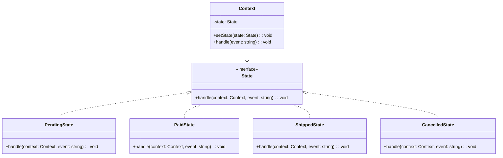

# 状态模式（State）

> 📍 **导航**：前置 [observer.md](./observer.md) ｜ 后续 [strategy.md](./strategy.md) ｜ 优先级 **P1**

## 意图

允许对象在内部状态改变时改变其行为，看起来好像修改了自身的类。核心解决：用多态替代大量 `if/switch` 状态判断。

## 结构（UML 类图）



核心机制：
- 每种状态是一个独立的类，封装该状态下的行为
- Context 将行为委托给当前 State 对象
- 状态转换由 State 内部决定（或集中管理）

## 适用场景

**该用：**
- 对象行为依赖状态，且状态转换逻辑复杂（订单、TCP 连接、审批流）
- 大量 `if (state === 'xxx')` 散落在多个方法中
- 状态转换有严格约束（不能从已完成跳到待支付）

**不该用：**
- 只有 2-3 个简单状态——枚举 + switch 足够
- 状态间行为差异很小——不值得每个状态一个类
- 状态转换完全由外部决定——用状态机库（XState）更合适

> 🔍 **对应 Code Smell**：大量 if/switch 状态判断散落在多个方法中、状态转换约束难以维护

## 代价与权衡

| 维度 | 说明 |
|------|------|
| 复杂度 | 中高。每个状态一个类，状态多时文件数增加 |
| 可维护性 | **好**。新增状态只需新增类，不修改已有代码（开闭原则） |
| 可读性 | **好**。每个状态的行为内聚在一起，而非散落在 switch 中 |
| 状态转换可见性 | 分散在各 State 类中，不如集中式状态机直观 |
| 替代方案 | 枚举 + switch（简单场景）、XState / 有限状态机库、表驱动（转换表） |

> **TS 特化**：TypeScript 的联合类型 + 类型收窄（discriminated union）可以在编译期保证状态转换的合法性。结合 `never` 类型做穷举检查，比经典 OOP State 模式更轻量。

## TypeScript 实现

### 经典 OOP 状态模式（订单状态机）

```typescript
interface OrderState {
  readonly name: string;
  pay(order: Order): void;
  ship(order: Order): void;
  cancel(order: Order): void;
}

class Order {
  private _state: OrderState;

  constructor() {
    this._state = new PendingState();
  }

  get state(): string {
    return this._state.name;
  }

  setState(state: OrderState): void {
    console.log(`  [${this._state.name}] → [${state.name}]`);
    this._state = state;
  }

  pay(): void {
    this._state.pay(this);
  }

  ship(): void {
    this._state.ship(this);
  }

  cancel(): void {
    this._state.cancel(this);
  }
}

class PendingState implements OrderState {
  readonly name = 'pending';

  pay(order: Order): void {
    console.log('Payment received.');
    order.setState(new PaidState());
  }

  ship(_order: Order): void {
    console.log('Cannot ship: order not paid yet.');
  }

  cancel(order: Order): void {
    console.log('Order cancelled.');
    order.setState(new CancelledState());
  }
}

class PaidState implements OrderState {
  readonly name = 'paid';

  pay(_order: Order): void {
    console.log('Already paid.');
  }

  ship(order: Order): void {
    console.log('Order shipped!');
    order.setState(new ShippedState());
  }

  cancel(order: Order): void {
    console.log('Refund issued. Order cancelled.');
    order.setState(new CancelledState());
  }
}

class ShippedState implements OrderState {
  readonly name = 'shipped';

  pay(_order: Order): void {
    console.log('Already paid.');
  }

  ship(_order: Order): void {
    console.log('Already shipped.');
  }

  cancel(_order: Order): void {
    console.log('Cannot cancel: order already shipped.');
  }
}

class CancelledState implements OrderState {
  readonly name = 'cancelled';

  pay(_order: Order): void {
    console.log('Cannot pay: order is cancelled.');
  }

  ship(_order: Order): void {
    console.log('Cannot ship: order is cancelled.');
  }

  cancel(_order: Order): void {
    console.log('Already cancelled.');
  }
}

// 使用
const order = new Order();
console.log(`State: ${order.state}`); // pending
order.ship(); // Cannot ship: order not paid yet.
order.pay(); // Payment received. → [paid]
order.ship(); // Order shipped! → [shipped]
order.cancel(); // Cannot cancel: order already shipped.
```

### 类型安全的状态机（TS 联合类型）

```typescript
// 状态定义：discriminated union
type ConnectionState =
  | { status: 'disconnected' }
  | { status: 'connecting'; attempt: number }
  | { status: 'connected'; since: number }
  | { status: 'reconnecting'; attempt: number };

// 事件定义
type ConnectionEvent =
  | { type: 'CONNECT' }
  | { type: 'SUCCESS' }
  | { type: 'FAILURE' }
  | { type: 'DISCONNECT' }
  | { type: 'RETRY' };

// 纯函数状态转换（编译期保证合法性）
function transition(
  state: ConnectionState,
  event: ConnectionEvent
): ConnectionState {
  switch (state.status) {
    case 'disconnected':
      if (event.type === 'CONNECT') {
        return { status: 'connecting', attempt: 1 };
      }
      return state;

    case 'connecting':
      if (event.type === 'SUCCESS') {
        return { status: 'connected', since: Date.now() };
      }
      if (event.type === 'FAILURE') {
        return { status: 'reconnecting', attempt: state.attempt };
      }
      return state;

    case 'connected':
      if (event.type === 'DISCONNECT') {
        return { status: 'disconnected' };
      }
      if (event.type === 'FAILURE') {
        return { status: 'reconnecting', attempt: 1 };
      }
      return state;

    case 'reconnecting':
      if (event.type === 'RETRY') {
        return { status: 'connecting', attempt: state.attempt + 1 };
      }
      if (event.type === 'DISCONNECT') {
        return { status: 'disconnected' };
      }
      return state;

    default: {
      // 穷举检查：如果遗漏了状态，编译报错
      const _exhaustive: never = state;
      return _exhaustive;
    }
  }
}

// 使用
let state: ConnectionState = { status: 'disconnected' };

state = transition(state, { type: 'CONNECT' });
console.log(state); // { status: 'connecting', attempt: 1 }

state = transition(state, { type: 'SUCCESS' });
console.log(state.status); // 'connected'

state = transition(state, { type: 'FAILURE' });
console.log(state); // { status: 'reconnecting', attempt: 1 }

state = transition(state, { type: 'RETRY' });
console.log(state); // { status: 'connecting', attempt: 2 }
```

## 真实世界实例

| 框架/库 | 实现方式 |
|---------|---------|
| **XState** | 声明式有限状态机库，`createMachine({ states: { idle: {...} } })` |
| **TCP 协议栈** | CLOSED → LISTEN → SYN_SENT → ESTABLISHED → FIN_WAIT → CLOSED |
| **React 组件生命周期** | mounted → updating → unmounting，每个阶段行为不同 |
| **Redux** | `isFetching` / `success` / `error` 状态决定 UI 渲染逻辑 |
| **游戏角色状态** | idle / walk / run / jump / attack，每个状态有不同的动画和物理行为 |

## 易混淆对比

| 对比 | 区别 |
|------|------|
| State vs Strategy | State 中状态转换是自动的（内部触发）；Strategy 由客户端主动选择算法 |
| State vs Singleton | State 对象可以有多个实例；但通常每种状态只需一个实例（可缓存） |
| State vs 有限状态机（FSM） | 经典 State 模式是 OOP 实现；FSM 更强调转换表和形式化定义（XState） |

## 面试速答

> **问：State 和 Strategy 看起来一样，怎么区分？**
>
> 答：结构几乎相同，区别在意图和切换方式。Strategy 由客户端主动选择并注入算法，对象本身不关心选了哪个，各策略相互独立、通常无状态。State 的切换是对象内部根据当前状态自动触发的，状态对象之间往往互相知道彼此、会主动把 Context 转到下一个状态，强调的是"行为随状态流转"。

> **问：什么时候用 XState 而不是手写 State 模式？**
>
> 答：当状态多、转换复杂且需要形式化保证时——比如需要并行状态、历史状态、guard 条件、延迟事件、可视化状态图，或团队协作需要一张能看懂的转换全貌。手写 OOP State 的转换逻辑散落在各个类里难以总览，XState 用声明式转换表集中管理，还能生成图表和做模型测试。只有两三个简单状态时枚举加 switch 就够了。

> **问：TS 的 discriminated union 如何替代经典 State 模式？**
>
> 答：用带字面量 `status` 字段的联合类型表示各状态，每个状态携带自己独有的数据；再写一个纯函数 `transition(state, event)` 用 switch 处理转换。配合 `never` 做穷举检查，新增状态或遗漏分支会在编译期报错，比 OOP 的多类继承更轻量，且转换逻辑集中、类型安全、易于测试。

## 关联

- **常配合**：Singleton（State 实例缓存复用）、Memento（保存/恢复状态）、Observer（状态变更时通知）
- **架构位置**：在 [software-engineering/](../../software-engineering/software-engineering-learning-outline.md) 第 10 章中，有限状态机是协议实现、工作流引擎、UI 交互管理的核心建模工具
