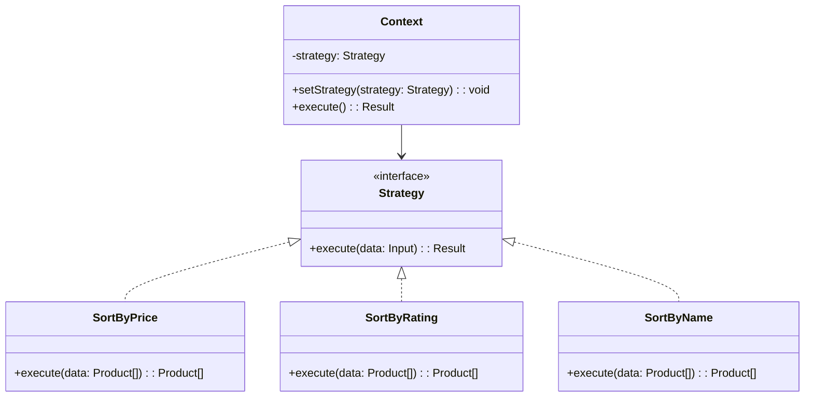

# 策略模式（Strategy）

## 意图

定义一系列算法，将每个算法封装起来，并使它们可以互相替换。让算法的变化独立于使用它的客户端。

## 结构（UML 类图）



核心机制：
- 算法族有统一接口，客户端面向接口编程
- 运行时可切换具体算法
- 消除大量 `if/else` 或 `switch` 分支

## 适用场景

**该用：**
- 多种算法可互换（排序、压缩、加密、校验规则）
- 算法需要运行时动态选择（用户配置、A/B 测试）
- 消除条件分支：`if (type === 'a') ... else if (type === 'b') ...`

**不该用：**
- 只有一种算法且不会变——直接写即可
- 算法差异极小（仅一个参数不同）——用参数化代替
- 客户端需要知道算法细节才能选择——违反封装

## 代价与权衡

| 维度 | 说明 |
|------|------|
| 复杂度 | 低。核心就是接口 + 多实现 |
| 对象数量 | 每个策略一个类/函数，策略多时文件增加 |
| 通信开销 | 策略可能需要额外上下文数据（通过 Context 传递） |
| 可测试性 | **好**。每个策略可独立单元测试 |
| 替代方案 | 函数参数（TS 中函数即策略）、Map 查表、多态继承 |

> **TS/JS 特化**：在 TS 中，函数是一等公民，**函数本身就是最好的 Strategy**。不需要定义 interface + class，直接传函数即可。类型系统保证函数签名一致。经典 OOP Strategy 在 TS 中退化为"高阶函数参数"。

## TypeScript 实现

### 函数即策略（推荐）

```typescript
interface Product {
  name: string;
  price: number;
  rating: number;
}

// 策略 = 函数类型
type SortStrategy = (products: Product[]) => Product[];

// 具体策略：普通函数即可
const byPriceAsc: SortStrategy = (products) =>
  [...products].sort((a, b) => a.price - b.price);

const byPriceDesc: SortStrategy = (products) =>
  [...products].sort((a, b) => b.price - a.price);

const byRating: SortStrategy = (products) =>
  [...products].sort((a, b) => b.rating - a.rating);

const byName: SortStrategy = (products) =>
  [...products].sort((a, b) => a.name.localeCompare(b.name));

// Context：接受策略作为参数
class ProductList {
  constructor(private products: Product[]) {}

  display(strategy: SortStrategy): string[] {
    return strategy(this.products).map(
      (p) => `${p.name} - $${p.price} (★${p.rating})`
    );
  }
}

// 使用
const products: Product[] = [
  { name: 'Keyboard', price: 79, rating: 4.5 },
  { name: 'Mouse', price: 49, rating: 4.8 },
  { name: 'Monitor', price: 399, rating: 4.2 },
];

const list = new ProductList(products);

console.log(list.display(byPriceAsc));
// ["Mouse - $49 (★4.8)", "Keyboard - $79 (★4.5)", "Monitor - $399 (★4.2)"]

console.log(list.display(byRating));
// ["Mouse - $49 (★4.8)", "Keyboard - $79 (★4.5)", "Monitor - $399 (★4.2)"]
```

### 表单验证策略

```typescript
type ValidationRule = (value: string) => string | null; // null = 通过

// 策略工厂：创建可组合的验证规则
const required: ValidationRule = (value) =>
  value.trim() ? null : 'This field is required';

const minLength = (min: number): ValidationRule =>
  (value) => (value.length >= min ? null : `Must be at least ${min} characters`);

const maxLength = (max: number): ValidationRule =>
  (value) => (value.length <= max ? null : `Must be at most ${max} characters`);

const pattern = (regex: RegExp, message: string): ValidationRule =>
  (value) => (regex.test(value) ? null : message);

const email: ValidationRule = pattern(
  /^[^\s@]+@[^\s@]+\.[^\s@]+$/,
  'Invalid email format'
);

// 组合多个策略
function validate(value: string, rules: ValidationRule[]): string[] {
  const errors: string[] = [];
  for (const rule of rules) {
    const error = rule(value);
    if (error) errors.push(error);
  }
  return errors;
}

// 使用
const usernameRules: ValidationRule[] = [
  required,
  minLength(3),
  maxLength(20),
  pattern(/^[a-zA-Z0-9_]+$/, 'Only letters, numbers, and underscores'),
];

const emailRules: ValidationRule[] = [required, email];

console.log(validate('', usernameRules));
// ["This field is required", "Must be at least 3 characters"]

console.log(validate('ab', usernameRules));
// ["Must be at least 3 characters"]

console.log(validate('alice_01', usernameRules));
// []

console.log(validate('not-an-email', emailRules));
// ["Invalid email format"]
```

### 策略注册表（Map 查表）

```typescript
interface ShippingCalculator {
  calculate(weight: number, distance: number): number;
}

// 策略注册表
const shippingStrategies = new Map<string, ShippingCalculator>([
  ['standard', {
    calculate: (weight, distance) => 5 + weight * 0.5 + distance * 0.01,
  }],
  ['express', {
    calculate: (weight, distance) => 15 + weight * 1.0 + distance * 0.03,
  }],
  ['overnight', {
    calculate: (weight, distance) => 30 + weight * 2.0 + distance * 0.05,
  }],
]);

function getShippingCost(
  method: string,
  weight: number,
  distance: number
): number {
  const strategy = shippingStrategies.get(method);
  if (!strategy) {
    throw new Error(`Unknown shipping method: ${method}`);
  }
  return Math.round(strategy.calculate(weight, distance) * 100) / 100;
}

// 使用
console.log(getShippingCost('standard', 2, 100)); // 7
console.log(getShippingCost('express', 2, 100)); // 20
console.log(getShippingCost('overnight', 2, 100)); // 39
```

## 真实世界实例

| 框架/库 | 实现方式 |
|---------|---------|
| **`Array.prototype.sort(compareFn)`** | 比较函数就是排序策略，运行时传入 |
| **Passport.js** | `passport.use(new GoogleStrategy(...))` 认证策略可插拔 |
| **Webpack** | `optimization.minimizer` 可替换压缩算法（TerserPlugin / EsbuildPlugin） |
| **Jest `testEnvironment`** | `node` / `jsdom` / 自定义环境，运行时切换测试策略 |
| **CSS `transition-timing-function`** | `ease` / `linear` / `cubic-bezier(...)` 是动画插值策略 |

## 易混淆对比

| 对比 | 区别 |
|------|------|
| Strategy vs State | Strategy 由客户端主动选择；State 由对象内部自动转换 |
| Strategy vs Template Method | Strategy 通过组合（委托）复用；Template Method 通过继承（覆写钩子）复用 |
| Strategy vs Command | Strategy 封装**算法**（无状态）；Command 封装**操作**（含上下文，可撤销） |

## 关联

- **常配合**：Context 对象（为策略提供所需数据）、Factory（根据配置创建策略）、Flyweight（策略对象无状态时可共享）
- **架构位置**：在 [software-engineering/](../../software-engineering/software-engineering-learning-outline.md) 第 9 章中，策略模式是"面向接口编程"和"依赖倒置"原则的最直接体现
