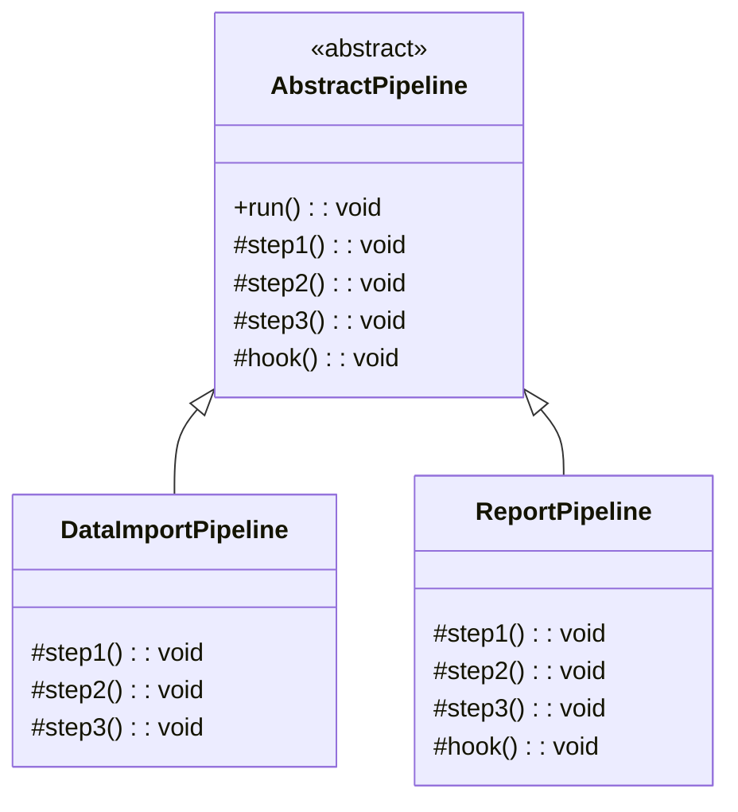

# 模板方法模式（Template Method）

## 意图

在抽象类中定义算法的骨架，将某些步骤延迟到子类实现。使得子类可以不改变算法结构的情况下重定义某些步骤。

## 结构（UML 类图）



核心机制：
- 父类定义算法骨架（`run()` 方法），调用各步骤
- 抽象步骤由子类必须实现
- 钩子方法（hook）有默认实现，子类可选覆写
- 算法结构在父类中固定，不可被子类改变

## 适用场景

**该用：**
- 多个子类有相同的算法结构，只是某些步骤不同（测试框架、构建流程）
- 需要控制扩展点：只允许子类覆写特定步骤，不能改变整体流程
- 公共行为提取到父类，避免代码重复

**不该用：**
- 算法步骤本身需要动态变化——用 Strategy
- 子类需要改变步骤顺序——模板方法的结构是固定的
- TS 中更倾向组合而非继承——优先考虑函数组合

## 代价与权衡

| 维度 | 说明 |
|------|------|
| 复杂度 | 低。就是抽象类 + 继承 |
| 灵活性 | **受限**。子类只能覆写步骤，不能改变算法结构 |
| 继承耦合 | 子类与父类紧耦合，父类变更影响所有子类 |
| 可读性 | **好**。算法骨架一目了然 |
| 替代方案 | Strategy（组合替代继承）、高阶函数、Hook 系统（React Hooks / Webpack Hooks） |

> **TS 特化**：TS 支持 `abstract class`，但社区更倾向组合。模板方法的思想在 TS 中常体现为：1）测试框架的 `beforeEach/afterEach` 生命周期；2）React class 组件的 `render()` + 生命周期钩子；3）抽象基类定义流程骨架（NestJS `CanActivate`）。

## TypeScript 实现

### 经典抽象类 + 钩子

```typescript
abstract class TestFixture {
  // 模板方法：定义测试执行骨架（final，不可覆写）
  readonly run = (): void => {
    this.beforeAll();
    for (const testCase of this.getTestCases()) {
      this.beforeEach();
      try {
        testCase();
        console.log(`  ✓ passed`);
      } catch (e) {
        console.log(`  ✗ failed: ${(e as Error).message}`);
      }
      this.afterEach();
    }
    this.afterAll();
  };

  // 抽象步骤：子类必须实现
  protected abstract getTestCases(): Array<() => void>;

  // 钩子方法：可选覆写
  protected beforeAll(): void {
    // default: no-op
  }

  protected beforeEach(): void {
    // default: no-op
  }

  protected afterEach(): void {
    // default: no-op
  }

  protected afterAll(): void {
    // default: no-op
  }
}

// 具体实现：数据库测试
class DatabaseTest extends TestFixture {
  private connection: string | null = null;

  protected beforeAll(): void {
    this.connection = 'db://localhost:5432/test';
    console.log(`Connected to ${this.connection}`);
  }

  protected beforeEach(): void {
    console.log('  Starting transaction...');
  }

  protected afterEach(): void {
    console.log('  Rolling back transaction...');
  }

  protected afterAll(): void {
    this.connection = null;
    console.log('Connection closed.');
  }

  protected getTestCases(): Array<() => void> {
    return [
      () => {
        console.log('  Testing INSERT...');
        // assert...
      },
      () => {
        console.log('  Testing SELECT...');
        // assert...
      },
      () => {
        throw new Error('Expected failure for demo');
      },
    ];
  }
}

// 使用
const suite = new DatabaseTest();
suite.run();
```

### 数据导出管道（抽象流程 + 具体步骤）

```typescript
abstract class DataExporter<T> {
  // 模板方法：固定的导出流程
  export(source: T[]): string {
    const validated = this.validate(source);
    const transformed = this.transform(validated);
    const formatted = this.format(transformed);
    const output = this.wrap(formatted);
    return output;
  }

  // 抽象步骤
  protected abstract transform(data: T[]): Record<string, unknown>[];
  protected abstract format(rows: Record<string, unknown>[]): string;

  // 钩子：默认不做校验
  protected validate(data: T[]): T[] {
    return data;
  }

  // 钩子：默认不加包装
  protected wrap(content: string): string {
    return content;
  }
}

class CsvExporter extends DataExporter<{ name: string; age: number }> {
  protected transform(
    data: { name: string; age: number }[]
  ): Record<string, unknown>[] {
    return data.map((item) => ({ Name: item.name, Age: item.age }));
  }

  protected format(rows: Record<string, unknown>[]): string {
    if (rows.length === 0) return '';
    const headers = Object.keys(rows[0]).join(',');
    const body = rows.map((r) => Object.values(r).join(',')).join('\n');
    return `${headers}\n${body}`;
  }
}

class JsonExporter extends DataExporter<{ name: string; age: number }> {
  protected transform(
    data: { name: string; age: number }[]
  ): Record<string, unknown>[] {
    return data.map((item) => ({ fullName: item.name, age: item.age }));
  }

  protected format(rows: Record<string, unknown>[]): string {
    return JSON.stringify(rows, null, 2);
  }

  protected wrap(content: string): string {
    return `{"data": ${content}, "exportedAt": "${new Date().toISOString()}"}`;
  }
}

// 使用
const users = [
  { name: 'Alice', age: 30 },
  { name: 'Bob', age: 25 },
];

console.log(new CsvExporter().export(users));
// Name,Age
// Alice,30
// Bob,25

console.log(new JsonExporter().export(users));
// {"data": [...], "exportedAt": "..."}
```

## 真实世界实例

| 框架/库 | 实现方式 |
|---------|---------|
| **Jest / Mocha** | `beforeAll` → `beforeEach` → `test` → `afterEach` → `afterAll` 固定骨架 |
| **React Class Component** | `constructor` → `render()` → `componentDidMount` → ... 生命周期由框架控制 |
| **NestJS `CanActivate`** | 框架定义 Guard 执行流程，开发者只实现 `canActivate()` 方法 |
| **Vue 组件选项** | `beforeCreate` → `created` → `mounted` → ... 生命周期钩子 |
| **Gulp / Grunt 任务** | `init` → `src` → `transform` → `dest` 管道骨架固定 |

## 易混淆对比

| 对比 | 区别 |
|------|------|
| Template Method vs Strategy | Template Method 用**继承**（编译期绑定）；Strategy 用**组合**（运行时切换） |
| Template Method vs Factory Method | Factory Method 是 Template Method 的特例（只延迟"创建"这一步） |
| Template Method vs Hook 系统 | Hook 系统（Webpack Tapable）允许动态注册/排序；Template Method 的步骤在继承时固定 |

## 关联

- **常配合**：Factory Method（模板中的创建步骤）、Strategy（用组合替代继承实现同样效果）、Composite（模板步骤操作树结构）
- **架构位置**：在 [software-engineering/](../../software-engineering/software-engineering-learning-outline.md) 第 9 章中，框架的"好莱坞原则"（Don't call us, we'll call you）就是模板方法在架构层面的体现
