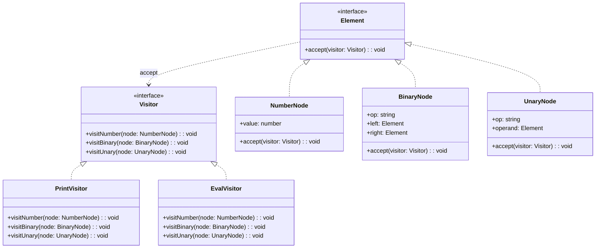

# 访问者模式（Visitor）

> 📍 **导航**：前置 [template-method.md](./template-method.md) ｜ 后续 [dependency-injection.md](./dependency-injection.md)（进入现代工程模式） ｜ 优先级 **P2**

## 意图

表示一个作用于对象结构中各元素的操作。它使你可以在不改变各元素类的前提下定义作用于这些元素的新操作。核心解决：数据结构稳定但操作频繁新增的场景。

## 结构（UML 类图）



核心机制（双重分派）：
1. 客户端调用 `element.accept(visitor)`（第一次分派：确定元素类型）
2. 元素内部调用 `visitor.visitXxx(this)`（第二次分派：确定操作类型）
3. 操作逻辑集中在 Visitor 中，元素类只负责"接受访问"

## 适用场景

**该用：**
- 对象结构稳定（节点类型不常变），但操作经常新增（AST 的打印、求值、优化、代码生成）
- 需要对异构集合中的不同元素执行不同操作
- 操作逻辑需要集中管理，而非散落在各元素类中

**不该用：**
- 元素类型频繁新增——每加一个类型，所有 Visitor 都要改
- 元素内部状态对外不可见——Visitor 需要访问元素数据
- 对象结构简单、操作少——直接 switch/if 即可

> 🔍 **对应 Code Smell**：操作逻辑与数据结构频繁一起改、需要对异构集合执行不同操作

## 代价与权衡

| 维度 | 说明 |
|------|------|
| 复杂度 | 高。双重分派机制理解成本高 |
| 开闭原则 | 对操作开放（新增 Visitor）；对元素封闭（新增元素需改所有 Visitor） |
| 封装性 | **差**。Visitor 需要访问元素内部数据，常需暴露 getter |
| 可维护性 | 操作集中，易于对比和复用 |
| 替代方案 | TS 联合类型 + switch（穷举检查）、多态方法、函数式遍历 |

> **TS/JS 特化**：TS 的 discriminated union + `switch` 穷举检查（`never`）可以实现 Visitor 的核心价值（新增操作时编译期检查是否覆盖所有类型），无需经典的双重分派。Babel 和 ESLint 的 visitor 是 JS 生态中最经典的 Visitor 应用。

## TypeScript 实现

### 经典双重分派

```typescript
// AST 节点
interface AstNode {
  accept<T>(visitor: AstVisitor<T>): T;
}

class NumberNode implements AstNode {
  constructor(readonly value: number) {}

  accept<T>(visitor: AstVisitor<T>): T {
    return visitor.visitNumber(this);
  }
}

class BinaryNode implements AstNode {
  constructor(
    readonly op: '+' | '-' | '*' | '/',
    readonly left: AstNode,
    readonly right: AstNode
  ) {}

  accept<T>(visitor: AstVisitor<T>): T {
    return visitor.visitBinary(this);
  }
}

class UnaryNode implements AstNode {
  constructor(readonly op: '-' | '+', readonly operand: AstNode) {}

  accept<T>(visitor: AstVisitor<T>): T {
    return visitor.visitUnary(this);
  }
}

// Visitor 接口
interface AstVisitor<T> {
  visitNumber(node: NumberNode): T;
  visitBinary(node: BinaryNode): T;
  visitUnary(node: UnaryNode): T;
}

// 具体 Visitor：求值
class EvalVisitor implements AstVisitor<number> {
  visitNumber(node: NumberNode): number {
    return node.value;
  }

  visitBinary(node: BinaryNode): number {
    const left = node.left.accept(this);
    const right = node.right.accept(this);
    switch (node.op) {
      case '+': return left + right;
      case '-': return left - right;
      case '*': return left * right;
      case '/': return left / right;
    }
  }

  visitUnary(node: UnaryNode): number {
    const operand = node.operand.accept(this);
    return node.op === '-' ? -operand : operand;
  }
}

// 具体 Visitor：打印为字符串
class PrintVisitor implements AstVisitor<string> {
  visitNumber(node: NumberNode): string {
    return String(node.value);
  }

  visitBinary(node: BinaryNode): string {
    const left = node.left.accept(this);
    const right = node.right.accept(this);
    return `(${left} ${node.op} ${right})`;
  }

  visitUnary(node: UnaryNode): string {
    const operand = node.operand.accept(this);
    return `(${node.op}${operand})`;
  }
}

// 使用
const ast = new BinaryNode(
  '+',
  new BinaryNode('*', new NumberNode(2), new NumberNode(3)),
  new UnaryNode('-', new NumberNode(1))
);

console.log(ast.accept(new EvalVisitor())); // 5
console.log(ast.accept(new PrintVisitor())); // ((2 * 3) + (-1))
```

### TS 联合类型 + switch（现代替代）

```typescript
// 用 discriminated union 定义 AST（无需 class）
type Expr =
  | { type: 'number'; value: number }
  | { type: 'binary'; op: '+' | '-' | '*' | '/'; left: Expr; right: Expr }
  | { type: 'unary'; op: '-' | '+'; operand: Expr };

// "Visitor" = 一个处理所有节点类型的函数
function evaluate(expr: Expr): number {
  switch (expr.type) {
    case 'number':
      return expr.value;
    case 'binary': {
      const l = evaluate(expr.left);
      const r = evaluate(expr.right);
      switch (expr.op) {
        case '+': return l + r;
        case '-': return l - r;
        case '*': return l * r;
        case '/': return l / r;
      }
      break;
    }
    case 'unary':
      return expr.op === '-' ? -evaluate(expr.operand) : evaluate(expr.operand);
    default: {
      // 穷举检查：新增节点类型时编译报错
      const _exhaustive: never = expr;
      throw new Error(`Unknown node: ${JSON.stringify(_exhaustive)}`);
    }
  }
}

function printExpr(expr: Expr): string {
  switch (expr.type) {
    case 'number':
      return String(expr.value);
    case 'binary':
      return `(${printExpr(expr.left)} ${expr.op} ${printExpr(expr.right)})`;
    case 'unary':
      return `(${expr.op}${printExpr(expr.operand)})`;
    default: {
      const _exhaustive: never = expr;
      throw new Error(`Unknown node: ${JSON.stringify(_exhaustive)}`);
    }
  }
}

// 使用
const expr: Expr = {
  type: 'binary',
  op: '+',
  left: { type: 'binary', op: '*', left: { type: 'number', value: 2 }, right: { type: 'number', value: 3 } },
  right: { type: 'unary', op: '-', operand: { type: 'number', value: 1 } },
};

console.log(evaluate(expr)); // 5
console.log(printExpr(expr)); // ((2 * 3) + (-1))
```

### Babel/ESLint 风格 Visitor

```typescript
// 模拟 Babel 的 visitor 模式
type NodeType = 'Program' | 'FunctionDeclaration' | 'CallExpression' | 'Identifier';

interface BaseNode {
  type: NodeType;
}

interface ProgramNode extends BaseNode {
  type: 'Program';
  body: BaseNode[];
}

interface FunctionDeclarationNode extends BaseNode {
  type: 'FunctionDeclaration';
  id: IdentifierNode;
  params: IdentifierNode[];
  body: BaseNode[];
}

interface CallExpressionNode extends BaseNode {
  type: 'CallExpression';
  callee: IdentifierNode;
  arguments: BaseNode[];
}

interface IdentifierNode extends BaseNode {
  type: 'Identifier';
  name: string;
}

// Visitor：每种节点类型可选 enter/exit
type VisitorHandlers = {
  [K in NodeType]?: {
    enter?: (node: Extract<BaseNode, { type: K }>) => void;
    exit?: (node: Extract<BaseNode, { type: K }>) => void;
  };
};

function traverse(node: BaseNode, visitor: VisitorHandlers): void {
  const handlers = visitor[node.type] as
    | { enter?: (n: BaseNode) => void; exit?: (n: BaseNode) => void }
    | undefined;

  handlers?.enter?.(node);

  // 递归遍历子节点
  if ('body' in node && Array.isArray(node.body)) {
    for (const child of node.body) {
      traverse(child, visitor);
    }
  }
  if ('params' in node && Array.isArray(node.params)) {
    for (const param of node.params) {
      traverse(param, visitor);
    }
  }
  if ('arguments' in node && Array.isArray(node.arguments)) {
    for (const arg of node.arguments) {
      traverse(arg, visitor);
    }
  }
  if ('callee' in node) {
    traverse((node as CallExpressionNode).callee, visitor);
  }

  handlers?.exit?.(node);
}

// 使用：收集所有函数名和调用表达式
const ast: ProgramNode = {
  type: 'Program',
  body: [
    {
      type: 'FunctionDeclaration',
      id: { type: 'Identifier', name: 'greet' },
      params: [{ type: 'Identifier', name: 'name' }],
      body: [
        {
          type: 'CallExpression',
          callee: { type: 'Identifier', name: 'console.log' },
          arguments: [{ type: 'Identifier', name: 'name' }],
        },
      ],
    },
  ],
};

const functionNames: string[] = [];
const callTargets: string[] = [];

traverse(ast, {
  FunctionDeclaration: {
    enter(node) {
      functionNames.push(node.id.name);
    },
  },
  CallExpression: {
    enter(node) {
      callTargets.push(node.callee.name);
    },
  },
});

console.log(functionNames); // ['greet']
console.log(callTargets); // ['console.log']
```

## 真实世界实例

| 框架/库 | 实现方式 |
|---------|---------|
| **Babel** | `traverse(ast, { FunctionDeclaration(path) {...} })` 按节点类型分派 |
| **ESLint** | 规则导出 visitor 对象：`{ CallExpression(node) { ... } }` |
| **TypeScript Compiler** | `ts.forEachChild(node, visitor)` 遍历 AST |
| **Prettier** | 打印器对每种 AST 节点类型定义格式化逻辑 |
| **React Reconciler** | 对 Fiber 树的不同节点类型（Host / Class / Function）执行不同操作 |

## 易混淆对比

| 对比 | 区别 |
|------|------|
| Visitor vs Iterator | Iterator 只负责遍历（不关心操作）；Visitor 在遍历时对每个元素执行特定操作 |
| Visitor vs Interpreter | Interpreter 将求值逻辑放在节点内部；Visitor 将操作外置到独立对象 |
| Visitor vs 多态方法 | 多态：操作分散在各子类中；Visitor：操作集中在 Visitor 类中 |

## 面试速答

> **问：Visitor 模式的双重分派是怎么实现的？**
>
> 答：靠两次动态分派确定"对哪个元素做什么操作"。客户端调用 `element.accept(visitor)`，第一次分派根据元素的运行时类型进入具体元素类；元素内部再调用 `visitor.visitXxx(this)`，第二次分派根据 visitor 的运行时类型选中具体操作。由于 JS/TS 没有方法重载，这种 accept + visitXxx 的回调结构正是绕过单分派限制实现双重分派的标准手法。

> **问：Visitor 模式的最大限制是什么？**
>
> 答：对元素类型封闭。新增一种元素类型时，所有 Visitor 接口和实现都得跟着加一个 visit 方法，改动面很大，违背开闭原则（它只对新增操作开放）。此外 Visitor 需要访问元素内部数据，常被迫暴露 getter，破坏封装。所以它适合元素结构稳定、操作频繁新增的场景，元素类型常变就别用。

> **问：Babel 和 ESLint 的 visitor 是经典 Visitor 模式吗？**
>
> 答：是 Visitor 思想的应用，但形态更现代。它们不要求元素类实现 `accept`，而是由框架统一 `traverse` AST，根据节点的 `type` 字段分派到 visitor 对象里对应的处理函数（如 `CallExpression(node){}`），并支持 enter/exit 钩子。本质仍是"数据结构稳定、操作外置集中"，只是用类型字段查表替代了经典的双重分派，在 JS 生态里更实用。

## 关联

- **常配合**：Composite（Visitor 遍历 Composite 树）、Iterator（提供遍历机制）、Interpreter（Visitor 替代节点内的 interpret 方法）
- **架构位置**：在 [software-engineering/](../../software-engineering/software-engineering-learning-outline.md) 第 11 章中，编译器/转译器的 AST 处理管道是 Visitor 模式最核心的工业级应用
