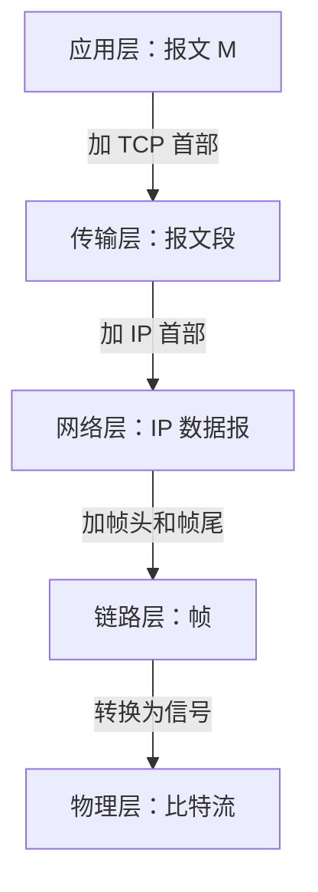
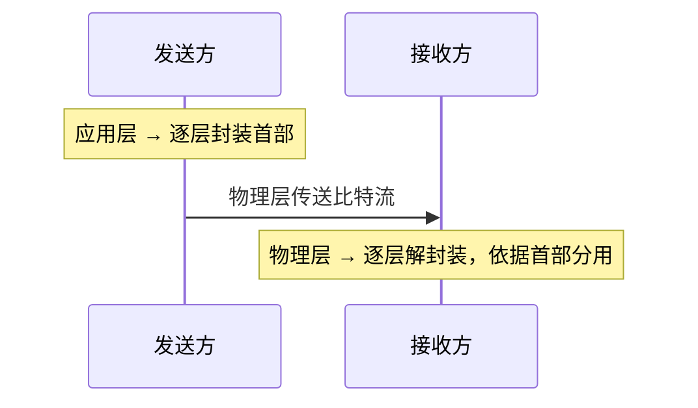

# 第 1 章：计算机网络体系结构

> 这章在 408 里重要度 ⭐⭐，通常出 1 道选择题，但**性能指标计算是送分题也是易错题**——四种时延、带宽-时延积、信道利用率几乎每年出现在选择题中，2025 年综合应用题还考过时延计算。分层模型（五层结构、各层 PDU、协议三要素）属于记忆型考点，选择题里反复出现。本章建议花 2-3 小时，一半时间放在性能指标计算上，一半时间记住分层模型和各层职责。

---

## 1.1 计算机网络的概念、组成与功能

### 概念

计算机网络是将**地理位置不同**的、具有**独立功能**的多台计算机及其外部设备，通过通信线路和通信设备连接起来，在网络操作系统和**网络协议**的管理协调下，实现**资源共享**和**信息传递**的系统。

> 关键词：**自治**（每台计算机独立工作，不存在主从关系）、**互联**、**共享**。"自主计算机的互联集合"是最简洁的定义，选择题常考"计算机网络与多用户系统的区别"——区别就在于计算机之间是否自治互联。

### 组成

| 组成部分 | 内容 |
|---------|------|
| 硬件 | 主机（端系统）、通信链路、交换设备（路由器、交换机） |
| 软件 | 操作系统、协议软件、应用程序 |
| 协议 | 通信双方必须遵守的规则（1.4 节详述） |

### 功能

1. **数据通信**（最基本功能）：主机之间传送数据
2. **资源共享**：硬件、软件、数据共享
3. **分布式处理**：多台计算机协作完成同一任务

---

## 1.2 计算机网络的分类

### 按覆盖范围分类（常考）

| 类别 | 缩写 | 覆盖范围 | 典型例子 |
|------|------|---------|---------|
| 局域网 | LAN | 几米 ~ 几千米 | 以太网、校园网 |
| 城域网 | MAN | 5 ~ 50 千米 | 城市骨干网络 |
| 广域网 | WAN | 几十 ~ 几千千米 | Internet 骨干网 |

> 注意区分依据是**覆盖范围**，不是传输速率。局域网不一定比广域网快，只是范围小。

### 按拓扑结构分类

| 拓扑 | 特点 | 优缺点 |
|------|------|--------|
| 总线型 | 所有节点挂在一条总线上 | 结构简单、成本低；总线故障全网瘫痪 |
| 星型 | 所有节点连向中心节点 | 易于管理；中心节点是单点故障 |
| 环型 | 节点连成闭合环 | 传输延迟确定；单点故障影响全网 |
| 网状型 | 节点间有多条冗余链路 | 可靠性高；成本高，广域网常用 |
| 树型 | 星型的扩展，层次结构 | 易于扩展；根节点故障影响大 |

---

## 1.3 主要性能指标（408 高频计算考点）

### 速率、带宽与吞吐量

| 概念 | 含义 | 单位 |
|------|------|------|
| 速率（数据传输速率） | 单位时间传送的数据量 | bps（bit/s） |
| 带宽 | 网络的最高数据传输速率（"名义速率"） | bps |
| 吞吐量 | 单位时间**实际**通过某链路的数据量 | bps |

单位换算（**必须记牢，选择题最爱挖的坑**）：

- $1 \text{ kbps} = 10^3 \text{ bps}$ ， $1 \text{ Mbps} = 10^6 \text{ bps}$ ， $1 \text{ Gbps} = 10^9 \text{ bps}$ （带宽单位的 k/M/G 是 **1000 进制**，不是 1024）
- 带宽单位是 **bit/s**，文件大小单位是 **Byte**，两者差 **8 倍**： $1 \text{ MB/s} = 8 \text{ Mbps}$

> 经典陷阱： "100 Mbps 链路下载 100 MB 文件至少要多少秒？"答案是 $100 \times 8 / 100 = 8$ 秒，不是 1 秒。另外吞吐量受瓶颈链路限制——一条链路上某段速率低，整体吞吐量就低（木桶效应）。

### 四种时延

总时延 = 发送时延 + 传播时延 + 处理时延 + 排队时延。

| 时延 | 公式 | 取决于 |
|------|------|--------|
| 发送时延 | 数据长度 ÷ 信道带宽 | **报文大小和带宽**，与距离无关 |
| 传播时延 | 信道长度 ÷ 电磁波传播速率 | **距离和传播速率**，与带宽无关 |
| 处理时延 | 路由器检错、查找转发表等耗时 | 路由器处理能力，题目通常忽略 |
| 排队时延 | 分组在路由器缓存中等待的时间 | 网络拥塞程度，不确定，题目通常忽略 |

$$
t_{send} = \frac{\text{数据长度 (bit)}}{\text{带宽 (bps)}}, \quad t_{prop} = \frac{\text{链路长度 (m)}}{\text{传播速率 (m/s)}}
$$

> **发送时延 vs 传播时延是本章第一易错点**。直觉类比：发送时延好比"车队完全开上高速公路入口所需时间"（与车队长度、收费站放行速度有关），传播时延好比"车队从入口开到出口的时间"（与路程、车速有关）。增大带宽只能减小发送时延，减小不了传播时延；距离再远也不影响发送时延。

### 带宽-时延积

$$
\text{带宽-时延积} = \text{传播时延} \times \text{带宽}
$$

单位是 **bit**。物理含义：一条链路上能容纳的比特数，即链路这条"管道"能装多少数据。

> 带宽-时延积越大，说明在途（in-flight）数据越多，停-等协议的效率损失越大，这也是长肥网络（LFN）必须用滑动窗口的原因。与[第 3 章（数据链路层）](03-data-link-layer.md)的滑动窗口、[第 5 章（传输层）](05-transport-layer.md)的 TCP 窗口直接相关。

### RTT 与丢包率

- **RTT（往返时间）** = 2 × 传播时延 + 两端处理/排队时间（题目中常简化为 $RTT = 2 \times t_{prop}$ ）。ping 命令测的就是 RTT
- **丢包率** = 丢失分组数 ÷ 发送分组总数。丢包可能由链路误码、路由器缓存溢出引起，是衡量网络拥塞程度的指标

### 信道利用率

$$
U = \frac{t_{send}}{t_{send} + RTT + t_{ack}}
$$

即一个发送周期内信道真正在传数据的时间占比（停-等协议场景， $t_{ack}$ 为确认帧发送时延，常忽略）。有效数据传输速率 = $U \times$ 带宽。

> 区分**信道利用率**与**发送方利用率**：停-等协议下两者相同；滑动窗口协议下发送方可能连续发送多个帧，此时发送方利用率还与发送窗口大小有关，两者不再相等（详见[第 3 章（数据链路层）](03-data-link-layer.md)）。

---

## 1.4 分层模型

### 为什么要分层

分层的核心思想是**各层独立完成本层功能，层间通过接口交互**。好处：

1. 各层独立，降低复杂度（分而治之）
2. 灵活性好——某层技术变更不影响其他层
3. 便于标准化

### OSI 七层 vs TCP/IP 四层 vs 五层参考模型

| OSI 七层 | TCP/IP 四层 | 五层参考模型（408 主线） | 核心功能 | 典型协议 |
|---------|------------|------------------------|---------|---------|
| 应用层 | 应用层 | 应用层 | 为用户提供网络服务接口 | HTTP、DNS、FTP、SMTP |
| 表示层 | | | 数据格式转换、加密压缩 | SSL/TLS（位于应用层与传输层之间） |
| 会话层 | | | 建立/管理/终止会话 | RPC |
| 传输层 | 传输层 | 传输层 | 端到端的进程间通信 | TCP、UDP |
| 网络层 | 网际层 | 网络层 | 路由选择与分组转发 | IP、ICMP、ARP、路由协议 |
| 数据链路层 | 网络接口层 | 数据链路层 | 相邻节点间的帧传输 | Ethernet、PPP |
| 物理层 | | 物理层 | 比特流的透明传输 | 各种物理接口标准 |

> 408 按**五层模型**组织，但要能对应到 OSI 和 TCP/IP。常考辨析：OSI 有会话层和表示层而 TCP/IP 没有；TCP/IP 的网际层对应 OSI 网络层；**ARP 属于网络层**（不是链路层也不是传输层）。

### 各层 PDU（协议数据单元）

| 层次 | PDU 名称 |
|------|---------|
| 应用层 | 报文（message） |
| 传输层 | 报文段（segment，TCP/UDP） |
| 网络层 | 分组 / 数据报（packet / datagram） |
| 数据链路层 | 帧（frame） |
| 物理层 | 比特（bit） |

### 协议三要素

协议是通信双方必须遵守的规则集合，由三要素组成：

| 要素 | 含义 | 管什么 |
|------|------|--------|
| **语法** | 数据的结构、格式、编码 | "数据长什么样" |
| **语义** | 控制信息的含义、要完成的动作 | "这段数据是什么意思、要做什么" |
| **同步**（时序） | 事件顺序、速度匹配 | "什么时候做、按什么顺序做" |

> 记忆口诀："语法管格式，语义管含义，同步管顺序"。选择题常给出描述判断属于哪个要素，例如"规定报文由首部加数据部分组成"属于语法。

### 接口与服务

- **SAP（服务访问点）**：上层通过服务访问点使用下层提供的服务，是层间逻辑接口。如传输层的 SAP 是端口号，网络层的 SAP 是 IP 地址，链路层的 SAP 是 MAC 地址
- **PDU**：对等层之间传送的数据单位，由本层的 SDU（服务数据单元）加本层首部（必要时加尾部）构成
- **服务原语**（了解）：上层向下层请求服务的四种原语——**请求**（request）、**指示**（indication）、**响应**（response）、**确认**（confirm）

> 两个关键结论：**下层为上层提供服务，上层不感知下层实现细节**；**对等层之间是"虚拟"的水平通信**——实际数据是垂直穿过本层、经下层传过去的。

---

## 1.5 封装与解封装

发送方从上层到下层逐层**封装**（每层加上自己的首部），接收方从下层到上层逐层**解封装**（剥掉对应首部）：

要点：

1. 每一层只认识**本层的**首部，把上层交下来的整体当作本层的数据部分
2. 接收方依据首部信息完成**分用**（如 IP 首部协议字段决定交给 TCP 还是 UDP，端口号决定交给哪个应用进程）
3. 封装增加了开销——首部占用的带宽不携带用户数据，这也是为什么小报文传输效率低

---

## 1.6 数据交换方式

### 三种交换方式对比（常考）

| 对比项 | 电路交换 | 报文交换 | 分组交换 |
|--------|---------|---------|---------|
| 建立连接 | 需要（呼叫建立阶段） | 不需要 | 数据报不需要，虚电路需要 |
| 传输单位 | 比特流 | 整个报文 | 分组（报文切片） |
| 时延特点 | 建立连接有延迟，传输时延小、实时性好 | 转发时延大（整个报文存储转发） | 时延小，逐段转发 |
| 线路利用率 | 低（独占，静默期也占信道） | 较高 | 高（统计复用） |
| 可靠性 | 差（独占路径，故障即断） | 较好 | 好（可绕开故障节点） |
| 适用场景 | 电话、实时性要求高 | 早期电报网，现已少用 | Internet、突发数据业务 |

> 分组交换相对报文交换的优势：① 分组小，存储转发时延小；② 不必整条报文收齐即可转发（流水线）；③ 出错只需重传一个分组。代价是增加首部开销和乱序重组的复杂度。

### 数据报 vs 虚电路（都属于分组交换）

| 对比项 | 数据报（无连接） | 虚电路（面向连接） |
|--------|----------------|-------------------|
| 建立连接 | 不需要 | 需要（虚电路建立阶段） |
| 目的地址 | 每个分组带完整目的地址 | 仅用虚电路号（VCI） |
| 转发依据 | 每个分组独立路由，可能乱序到达 | 沿同一条虚电路，按序到达 |
| 故障适应 | 强（可动态绕路） | 弱（路径故障则中断） |
| 代表 | IP | X.25、帧中继、ATM |

> 记忆：**数据报 = 寄信**（每封独立写地址，路线不定）；**虚电路 = 打电话**（先拨号建路，之后按序送达）。IP 采用数据报方式，这也是 TCP 要在传输层做排序和确认的原因。

---

## 1.7 典型例题

**例 1**（时延计算）：主机 A 向主机 B 发送一个 1000 字节的文件，链路带宽为 10 Mbps，链路长度 2 km，电磁波传播速率为 $2 \times 10^8$ m/s。忽略处理时延、排队时延和确认帧，求该文件从开始发送到 B 接收完毕的总时延。

**解**：

发送时延：

$$
t_{send} = \frac{1000 \times 8}{10 \times 10^6} = 0.8 \times 10^{-3} \text{ s} = 0.8 \text{ ms}
$$

传播时延：

$$
t_{prop} = \frac{2 \times 10^3}{2 \times 10^8} = 10^{-5} \text{ s} = 0.01 \text{ ms}
$$

总时延 $= t_{send} + t_{prop} = 0.81$ ms。

> 本题发送时延是传播时延的 80 倍——短距离链路上总时延几乎完全由发送时延决定。注意 1000 字节要乘 8 换成 bit。

**例 2**（带宽-时延积）：某链路带宽为 1 Gbps，长度 2000 km，传播速率为 $2 \times 10^8$ m/s。求该链路的带宽-时延积，并说明其含义。

**解**：

$$
t_{prop} = \frac{2000 \times 10^3}{2 \times 10^8} = 10^{-2} \text{ s} = 10 \text{ ms}
$$

$$
\text{带宽-时延积} = 10 \times 10^{-3} \times 10^9 = 10^7 \text{ bit} = 10 \text{ Mb}
$$

含义：该链路上最多可同时容纳 $10^7$ bit 的数据，即发送方在收到第一个比特的确认前，可以持续发送 10 Mb 数据而不"溢出"。窗口至少要达到这个量级才能充分利用带宽。

> 带宽-时延积的单位是 **bit**，不是 Byte，也不是"每秒比特"。

**例 3**（信道利用率，408 真题风格）：两台主机相距 5000 km，链路带宽 10 Mbps，传播速率 $2.5 \times 10^8$ m/s。采用停-等协议发送数据，分组长度 1000 字节，忽略确认帧的发送时延和处理时延。求信道利用率和有效数据传输速率。

**解**：

发送时延：

$$
t_{send} = \frac{1000 \times 8}{10 \times 10^6} = 0.8 \text{ ms}
$$

传播时延：

$$
t_{prop} = \frac{5000 \times 10^3}{2.5 \times 10^8} = 0.02 \text{ s} = 20 \text{ ms}
$$

信道利用率：

$$
U = \frac{t_{send}}{t_{send} + 2 t_{prop}} = \frac{0.8}{0.8 + 40} \approx 1.96\%
$$

有效数据传输速率 $= U \times 10 \text{ Mbps} \approx 0.196 \text{ Mbps}$ 。

> 结论直观地解释了"为什么长距离链路必须用滑动窗口"：停-等协议下 98% 的时间信道在空等。若发送窗口为 $W$ ，发送方利用率最多可提升到 $\min(1, W \times U)$ 量级——这正是[第 3 章（数据链路层）](03-data-link-layer.md) GBN/SR 的出发点。

### 常见陷阱清单

1. **单位换算**： $1 \text{ Gbps} = 10^9 \text{ bps}$ 是 1000 进制；bit 与 Byte 差 8 倍。看到 "下载 1 MB 文件"先乘 8
2. **发送时延与传播时延混淆**：发送时延只与报文大小和带宽有关，**与距离无关**；传播时延只与距离和传播速率有关，**与带宽无关**。"增大带宽能减少总时延吗？"——只能减少发送时延
3. **带宽-时延积的单位**是 bit，不是 Byte
4. **信道利用率的分母**是完整发送周期（发送时延 + RTT + 确认时延），不是 RTT
5. **吞吐量受瓶颈链路限制**：端到端路径上吞吐量不超过最小带宽的那一段
6. **ARP 的层次归属**：属于网络层（工作在网际层），不是链路层；以太网最小帧长 64B 是链路层内容，不要与本章混淆

---

## 本章小结

### 核心要点回顾

1. **网络定义三要素**：自治计算机 + 互联 + 资源共享
2. **四种时延**：发送时延（报文大小 ÷ 带宽）、传播时延（距离 ÷ 传播速率）、处理时延、排队时延
3. **带宽-时延积** = 传播时延 × 带宽，单位 bit，代表链路的"管道容量"
4. **五层模型**：应用层（报文）→ 传输层（报文段）→ 网络层（分组）→ 链路层（帧）→ 物理层（比特）
5. **协议三要素**：语法、语义、同步
6. **三种交换方式**：电路交换实时性好利用率低，分组交换利用率高风险适应强；数据报无连接可乱序，虚电路面向连接按序
7. **封装/解封装**：逐层加/剥首部，接收方按首部分用

### 考试重点排序

| 优先级 | 考点 | 题型 |
|--------|------|------|
| ⭐⭐⭐ | 四种时延计算、带宽-时延积 | 选择题（偶入综合题） |
| ⭐⭐⭐ | 信道利用率 / 有效数据传输速率 | 选择题 |
| ⭐⭐⭐ | 电路/报文/分组交换对比、数据报 vs 虚电路 | 选择题 |
| ⭐⭐ | 五层模型各层功能、PDU 名称、协议归属（ARP 在哪层） | 选择题 |
| ⭐⭐ | 协议三要素、服务原语、SAP | 选择题 |
| ⭐ | 网络分类（LAN/MAN/WAN、拓扑） | 选择题 |

> 复习策略：把例 1、例 3 的算法做熟（注意单位换算），分层模型表格背下来即可。本章是后续各章的地图——各层具体机制见[第 2 章（物理层）](02-physical-layer.md)至[第 6 章（应用层）](06-application-layer.md)。

---

## 自测题

1. 发送时延和传播时延分别由什么因素决定？增大链路带宽能否减小传播时延？
2. 某链路带宽 100 Mbps，长度 1000 km，传播速率 $2 \times 10^8$ m/s，求带宽-时延积（单位 bit）。
3. 协议的三要素是什么？"规定应答报文必须在收到请求后 100 ms 内发出"属于哪个要素？
4. 分组交换相比报文交换有哪些优点？IP 采用的是数据报还是虚电路方式？
5. 停-等协议下信道利用率公式是什么？为什么长距离高带宽链路上停-等协议效率极低？

> **答案**：1. 发送时延 = 数据长度 ÷ 带宽，取决于报文大小和带宽；传播时延 = 距离 ÷ 传播速率，取决于距离和传播速率。增大带宽**不能**减小传播时延；2. 传播时延 $= 10^6 / (2 \times 10^8) = 5$ ms，带宽-时延积 $= 5 \times 10^{-3} \times 10^8 = 5 \times 10^5$ bit；3. 语法、语义、同步；该描述规定事件的时间顺序，属于**同步**；4. 分组小则存储转发时延小、可流水线转发、出错只需重传单个分组、统计复用利用率高；IP 采用**数据报**方式（无连接、每个分组独立路由）；5. $U = t_{send} / (t_{send} + RTT + t_{ack})$ ；长距离链路 RTT 大而发送时延相对很小，信道绝大部分时间在空等确认，故利用率趋近于 0。
